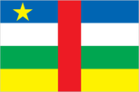
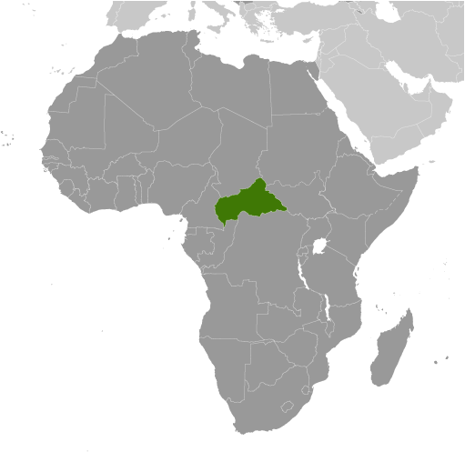
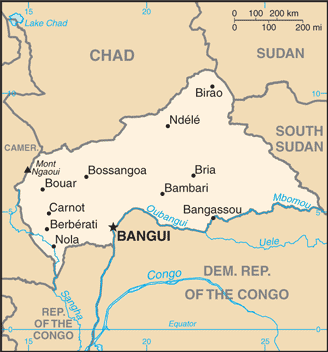

# Central African Republic

## Introduction

**_Background:_**   
The former French colony of Ubangi-Shari became the Central African Republic upon independence in 1960. After three tumultuous decades of misrule - mostly by military governments - civilian rule was established in 1993 and lasted for one decade. In March, 2003 President Ange-Felix PATASSE was deposed in a military coup led by General Francois BOZIZE, who established a transitional government. Elections held in 2005 affirmed General BOZIZE as president; he was reelected in 2011 in voting widely viewed as flawed. The government still does not fully control the countryside, where pockets of lawlessness persist. The militant group the Lord's Resistance Army continues to destabilize southeastern Central African Republic, and several rebel groups joined together in early December 2012 to launch a series of attacks that left them in control of numerous towns in the northern and central parts of the country. The rebels - who are unhappy with BOZIZE's government - participated in peace talks in early January 2013 which resulted in a coalition government including the rebellion's leadership. In March 2013, the coalition government dissolved, rebels seized the capital, and President BOZIZE fled the country. Rebel leader Michel DJOTODIA assumed the presidency, reappointed Nicolas TIANGAYE as Prime Minister, and established a transitional government on 31 March. On 13 April 2013, the National Transitional Council affirmed DJOTODIA as President.

## Geography

**_Location:_**   
Central Africa, north of Democratic Republic of the Congo

**_Geographic coordinates:_**   
7 00 N, 21 00 E

**_Map references:_**   
Africa

**_Area:_**   
**total:** 622,984 sq km   
**land:** 622,984 sq km   
**water:** 0 sq km

**_Area - comparative:_**   
slightly smaller than Texas

**_Land boundaries:_**   
**total:** 5,920 km   
**border countries:** Cameroon 901 km, Chad 1,556 km, Democratic Republic of the Congo 1,747 km, Republic of the Congo 487 km, South Sudan 1,055 km, Sudan 174 km

**_Coastline:_**   
0 km (landlocked)

**_Maritime claims:_**   
none (landlocked)

**_Climate:_**   
tropical; hot, dry winters; mild to hot, wet summers

**_Terrain:_**   
vast, flat to rolling, monotonous plateau; scattered hills in northeast and southwest

**_Elevation extremes:_**   
**lowest point:** Oubangui River 335 m   
**highest point:** Mont Ngaoui 1,420 m

**_Natural resources:_**   
diamonds, uranium, timber, gold, oil, hydropower

**_Land use:_**   
**arable land:** 2.89%   
**permanent crops:** 0.13%   
**other:** 96.98% (2011)

**_Irrigated land:_**   
1.35 sq km (2003)

**_Total renewable water resources:_**   
144.4 cu km (2011)

**_Freshwater withdrawal (domestic/industrial/agricultural):_**   
**total:** 0.07 cu km/yr (83%/17%/1%)   
**per capita:** 17.42 cu m/yr (2005)

**_Natural hazards:_**   
hot, dry, dusty harmattan winds affect northern areas; floods are common

**_Environment - current issues:_**   
tap water is not potable; poaching has diminished the country's reputation as one of the last great wildlife refuges; desertification; deforestation

**_Environment - international agreements:_**   
**party to:** Biodiversity, Climate Change, Climate Change-Kyoto Protocol, Desertification, Endangered Species, Hazardous Wastes, Ozone Layer Protection, Tropical Timber 94, Wetlands   
**signed, but not ratified:** Law of the Sea

**_Geography - note:_**   
landlocked; almost the precise center of Africa

## People and Society

**_Nationality:_**   
**noun:** Central African(s)   
**adjective:** Central African

**_Ethnic groups:_**   
Baya 33%, Banda 27%, Mandjia 13%, Sara 10%, Mboum 7%, M'Baka 4%, Yakoma 4%, other 2%

**_Languages:_**   
French (official), Sangho (lingua franca and national language), tribal languages

**_Religions:_**   
indigenous beliefs 35%, Protestant 25%, Roman Catholic 25%, Muslim 15%   
**note:** animistic beliefs and practices strongly influence the Christian majority

**_Population:_**   
5,277,959   
**note:** estimates for this country explicitly take into account the effects of excess mortality due to AIDS; this can result in lower life expectancy, higher infant mortality, higher death rates, lower population growth rates, and changes in the distribution of population by age and sex than would otherwise be expected (July 2014 est.)

**_Age structure:_**   
**0-14 years:** 40.6% (male 1,077,247/female 1,064,660)   
**15-24 years:** 20.1% (male 534,257/female 528,822)   
**25-54 years:** 31.8% (male 838,484/female 838,858)   
**55-64 years:** 3.9% (male 91,696/female 115,600)   
**65 years and over:** 3.6% (male 73,914/female 114,421) (2014 est.)

**_Dependency ratios:_**   
**total dependency ratio:** 76.5 %   
**youth dependency ratio:** 69.7 %   
**elderly dependency ratio:** 6.7 %   
**potential support ratio:** 14.8 (2014 est.)

**_Median age:_**   
**total:** 19.4 years   
**male:** 19.1 years   
**female:** 19.8 years (2014 est.)

**_Population growth rate:_**   
2.13% (2014 est.)

**_Birth rate:_**   
35.45 births/1,000 population (2014 est.)

**_Death rate:_**   
14.11 deaths/1,000 population (2014 est.)

**_Net migration rate:_**   
0 migrant(s)/1,000 population (2014 est.)

**_Urbanization:_**   
**urban population:** 39.1% of total population (2011)   
**rate of urbanization:** 2.6% annual rate of change (2010-15 est.)

**_Major urban areas - population:_**   
BANGUI (capital) 740,000 (2011)

**_Sex ratio:_**   
**at birth:** 1.03 male(s)/female   
**0-14 years:** 1.01 male(s)/female   
**15-24 years:** 1.01 male(s)/female   
**25-54 years:** 1 male(s)/female   
**55-64 years:** 0.98 male(s)/female   
**65 years and over:** 0.66 male(s)/female   
**total population:** 0.98 male(s)/female (2014 est.)

**_Maternal mortality rate:_**   
890 deaths/100,000 live births (2010)

**_Infant mortality rate:_**   
**total:** 92.86 deaths/1,000 live births   
**male:** 100.55 deaths/1,000 live births   
**female:** 84.93 deaths/1,000 live births (2014 est.)

**_Life expectancy at birth:_**   
**total population:** 51.35 years   
**male:** 50.06 years   
**female:** 52.67 years (2014 est.)

**_Total fertility rate:_**   
4.46 children born/woman (2014 est.)

**_Contraceptive prevalence rate:_**   
19% (2006)

**_Health expenditures:_**   
3.8% of GDP (2011)

**_Physicians density:_**   
0.05 physicians/1,000 population (2009)

**_Hospital bed density:_**   
1 beds/1,000 population (2011)

**_Drinking water source:_**   
**improved:** urban: 89.6% of population; rural: 54.4% of population; total: 68.2% of population   
**unimproved:** urban: 10.4% of population; rural: 45.6% of population; total: 31.8% of population (2012 est.)

**_Sanitation facility access:_**   
**improved:** urban: 43.6% of population; rural: 7.2% of population; total: 21.5% of population   
**unimproved:** urban: 56.4% of population; rural: 92.8% of population; total: 78.5% of population (2012 est.)

**_HIV/AIDS - adult prevalence rate:_**   
4.7% (2009 est.)

**_HIV/AIDS - people living with HIV/AIDS:_**   
130,000 (2009 est.)

**_HIV/AIDS - deaths:_**   
11,000 (2009 est.)

**_Major infectious diseases:_**   
**degree of risk:** very high   
**food or waterborne diseases:** bacterial and protozoal diarrhea, hepatitis A and E, and typhoid fever   
**vectorborne diseases:** malaria and dengue fever   
**respiratory disease:** meningococcal meningitis   
**water contact disease:** schistosomiasis   
**animal contact disease:** rabies (2013)

**_Obesity - adult prevalence rate:_**   
3.5% (2008)

**_Children under the age of 5 years underweight:_**   
28% (2006)

**_Education expenditures:_**   
1.2% of GDP (2011)

**_Literacy:_**   
**definition:** age 15 and over can read and write   
**total population:** 56.6%   
**male:** 69.6%   
**female:** 44.2% (2011 est.)

**_School life expectancy (primary to tertiary education):_**   
**total:** 7 years   
**male:** 9 years   
**female:** 6 years (2012)

**_Child labor - children ages 5-14:_**   
**total number:** 532,518   
**percentage:** 47 % (2006 est.)

## Government

**_Country name:_**   
**conventional long form:** Central African Republic   
**conventional short form:** none   
**local long form:** Republique Centrafricaine   
**local short form:** none   
**former:** Ubangi-Shari, Central African Empire   
**abbreviation:** CAR

**_Government type:_**   
republic

**_Capital:_**   
**name:** Bangui   
**geographic coordinates:** 4 22 N, 18 35 E   
**time difference:** UTC+1 (6 hours ahead of Washington, DC, during Standard Time)

**_Administrative divisions:_**   
14 prefectures (prefectures, singular - prefecture), 2 economic prefectures\* (prefectures economiques, singular - prefecture economique), and 1 commune\*\*; Bamingui-Bangoran, Bangui\*\*, Basse-Kotto, Haute-Kotto, Haut-Mbomou, Kemo, Lobaye, Mambere-Kadei, Mbomou, Nana-Grebizi\*, Nana-Mambere, Ombella-Mpoko, Ouaka, Ouham, Ouham-Pende, Sangha-Mbaere\*, Vakaga

**_Independence:_**   
13 August 1960 (from France)

**_National holiday:_**   
Republic Day, 1 December (1958)

**_Constitution:_**   
several previous; latest ratified by referendum 5 December 2004, effective 27 December 2004; amended 2010; note - the transitional parliament has begun work on a new constitution which should be ready for citizens feedback in early 2015 (2010)

**_Legal system:_**   
civil law system based on the French model

**_International law organization participation:_**   
has not submitted an ICJ jurisdiction declaration; accepts ICCt jurisdiction

**_Suffrage:_**   
18 years of age; universal

**_Executive branch:_**   
**chief of state:** Interim President Catherine SAMBA-PANZA (since 20 January 2014); elected by the National Transitional Council   
**head of government:** Interim Prime Minister Andre NZAPAYEKE (since 25 January 2014); note - he replaced Prime Minister Nicolas TIANGAYE who resigned 10 January 2014   
**cabinet:** Council of Ministers   
**elections:** interim president was elected by the National Transitional Council on 20 January 2014; she will be in office until February 2015 at the new general elections   
**election results:** in the second round Catherine SAMBA-PANZA was elected; SAMBA-PANZA 75 votes from the National Transitional Council, Desire KOLINGBA 53 votes (129 MPs out of 135 voted); note: rebel forces seized the captial in March 2013, forcing former President BOZIZE to flee the country; Interim President Michel DJOTODIA assumed the presidency, reinstated the prime minister, established a transitional government and was subsequently affirmed as president by the National Transitional Council on 13 Apriil 2013; he resigned soon after because of racial violence in the country and was replced briefly by Interim President Alexandre-Ferdinand NGUENDET

**_Legislative branch:_**   
unicameral National Transitional Council to act as the National Assembly or Assemblee Nationale (105 seats; members are elected by popular vote to serve five-year terms)   
**elections:** last held on 23 January 2011 and 27 March 2011 (next to be held in February 2015)   
**election results:** percent of vote by party - NA; seats by party - NA

**_Judicial branch:_**   
**highest court(s):** Supreme Court (consists of NA judges); Constitutional Court (consists of 9 judges, at least 3 of which are women)   
**judge selection and term of office:** Supreme Court judges appointed by the president; Constitutional Court judge appointments - 2 by the president, 1 by the speaker of the National Assembly, 2 elected by their peers, 2 are advocates elected by their peers, and 2 are law professors elected by their peers; judges serve 7-year non-renewable terms   
**subordinate courts:** high courts; magistrates' courts

**_Political parties and leaders:_**   
Alliance for Democracy and Progress or ADP [Clement BELIBANGA]   
Central African Democratic Rally or RDC [Louis-Pierre GAMBA]   
Civic Forum or FC   
Democratic Forum for Modernity or FODEM [Saturnin NDOMBY]   
Liberal Democratic Party or PLD   
Londo Association or LONDO   
Movement for Democracy and Development or MDD   
MaMovement for the Liberation of the Central African People or MLPC [Martin ZIGUELE ]   
National Convergence or KNK [Francois BOZIZE]   
National Unity Party or PUN   
New Alliance for Progress or NAP [Jean-Jacques DEMAFOUTH]   
Patriotic Front for Progress or FPP [Alexandre Philippe GOUMBA]   
People's Union for the Republic or UPR [Pierre Sammy MAKFOY]   
Social Democratic Party or PSD [Enoch LAKOUE]

**_Political pressure groups and leaders:_**   
NA

**_International organization participation:_**   
ACP, AfDB, AU, BDEAC, CEMAC, EITI (compliant country), FAO, FZ, G-77, IAEA, IBRD, ICAO, ICRM, IDA, IFAD, IFC, IFRCS, ILO, IMF, Interpol, IOC, IOM, ITSO, ITU, ITUC (NGOs), MIGA, NAM, OIC, OIF, OPCW, UN, UNCTAD, UNESCO, UNIDO, UNWTO, UPU, WCO, WHO, WIPO, WMO, WTO

**_Diplomatic representation in the US:_**   
**chief of mission:** Ambassador Stanislas MOUSSA-KEMBE (since 24 August 2009)   
**chancery:** 1618 22nd Street NW, Washington, DC 20008   
**telephone:** [1] (202) 483-7800   
**FAX:** [1] (202) 332-9893

**_Diplomatic representation from the US:_**   
**chief of mission:** Ambassador Laurence D. WOHLERS (since September 2010)   
**embassy:** Avenue David Dacko, Bangui   
**mailing address:** B. P. 924, Bangui   
**telephone:** [236] 21 61 02 00   
**FAX:** [236] 21 61 44 94   
**note:** the embassy temporarily suspended operations in December, 2012

**_Flag description:_**   
four equal horizontal bands of blue (top), white, green, and yellow with a vertical red band in center; a yellow five-pointed star to the hoist side of the blue band; banner combines the Pan-African and French flag colors; red symbolizes the blood spilled in the struggle for independence, blue represents the sky and freedom, white peace and dignity, green hope and faith, and yellow tolerance; the star represents aspiration towards a vibrant future

**_National symbol(s):_**   
elephant

**_National anthem:_**   
**name:** "Le Renaissance" (The Renaissance)   
**lyrics/music:** Barthelemy BOGANDA/Herbert PEPPER   
**note:** adopted 1960; Barthelemy BOGANDA, who wrote the anthem's lyrics, was the first prime minister of the autonomous French territory

## Economy

**_Economy - overview:_**   
Subsistence agriculture, together with forestry and mining, remains the backbone of the economy of the Central African Republic (CAR), with about 60% of the population living in outlying areas. The agricultural sector generates more than half of GDP. Timber and diamonds account for most export earnings, followed by cotton. Important constraints to economic development include the CAR's landlocked position, a poor transportation system, a largely unskilled work force, and a legacy of misdirected macroeconomic policies. Factional fighting between the government and its opponents remains a drag on economic revitalization. Since 2009 the IMF has worked closely with the government to institute reforms that have resulted in some improvement in budget transparency, but other problems remain. The government's additional spending in the run-up to the election in 2011 worsened CAR's fiscal situation. Distribution of income is extraordinarily unequal. Grants from France and the international community can only partially meet humanitarian needs. In 2012 the World Bank approved $125 million in funding for transport infrastructure and regional trade, focused on the route between CAR's capital and the port of Douala in Cameroon. After a two year lag in donor support, the IMF's first review of CAR's extended credit facility for 2012-15 praised improvements in revenue collection but warned of weak management of spending.

**_GDP (purchasing power parity):_**   
$3.336 billion (2013 est.)   
$3.902 billion (2012 est.)   
$3.748 billion (2011 est.)   
**note:** data are in 2013 US dollars

**_GDP (official exchange rate):_**   
$2.05 billion (2013 est.)

**_GDP - real growth rate:_**   
-14.5% (2013 est.)   
4.1% (2012 est.)   
3.3% (2011 est.)

**_GDP - per capita (PPP):_**   
$700 (2013 est.)   
$900 (2012 est.)   
$800 (2011 est.)   
**note:** data are in 2013 US dollars

**_Gross national saving:_**   
2.4% of GDP (2013 est.)   
3.8% of GDP (2012 est.)   
3.7% of GDP (2011 est.)

**_GDP - composition, by end use:_**   
**household consumption:** 91.5%   
**government consumption:** 6.1%   
**investment in fixed capital:** 8.3%   
**investment in inventories:** 0%   
**exports of goods and services:** 9.7%   
**imports of goods and services:** -15.6%; (2013 est.)

**_GDP - composition, by sector of origin:_**   
**agriculture:** 56.6%   
**industry:** 14.5%   
**services:** 28.9% (2013 est.)

**_Agriculture - products:_**   
cotton, coffee, tobacco, cassava (manioc, tapioca), yams, millet, corn, bananas; timber

**_Industries:_**   
gold and diamond mining, logging, brewing, sugar refining

**_Industrial production growth rate:_**   
-11% (2013 est.)

**_Labor force:_**   
2.082 million (2011 est.)

**_Unemployment rate:_**   
8% (2001 est.)   
**note:** 23% unemployment in the capital, Bangui

**_Population below poverty line:_**   
NA%

**_Household income or consumption by percentage share:_**   
**lowest 10%:** 2.1%   
**highest 10%:** 33% (2003)

**_Distribution of family income - Gini index:_**   
61.3 (1993)

**_Budget:_**   
**revenues:** $186.2 million   
**expenditures:** $270.7 million (2013 est.)

**_Taxes and other revenues:_**   
9.1% of GDP (2013 est.)

**_Budget surplus (+) or deficit (-):_**   
-4.1% of GDP (2013 est.)

**_Fiscal year:_**   
calendar year

**_Inflation rate (consumer prices):_**   
7% (2013 est.)   
5.8% (2012 est.)

**_Central bank discount rate:_**   
4.25% (31 December 2009)   
4.75% (31 December 2008)

**_Commercial bank prime lending rate:_**   
15% (31 December 2013 est.)   
15% (31 December 2012 est.)

**_Stock of narrow money:_**   
$308.3 million (31 December 2013 est.)   
$337.7 million (31 December 2012 est.)

**_Stock of broad money:_**   
$376.4 million (31 December 2013 est.)   
$421.6 million (31 December 2012 est.)

**_Stock of domestic credit:_**   
$478.7 million (31 December 2013 est.)   
$507.7 million (31 December 2012 est.)

**_Market value of publicly traded shares:_**   
$NA

**_Current account balance:_**   
-$133.8 million (2013 est.)   
-$197.6 million (2012 est.)

**_Exports:_**   
$138.9 million (2013 est.)   
$207.7 million (2012 est.)

**_Exports - commodities:_**   
diamonds, timber, cotton, coffee

**_Exports - partners:_**   
Belgium 31.7%, China 27.9%, Democratic Republic of the Congo 7.8%, Indonesia 5.2%, France 4.5% (2012)

**_Imports:_**   
$218.6 million (2013 est.)   
$333.7 million (2012 est.)

**_Imports - commodities:_**   
food, textiles, petroleum products, machinery, electrical equipment, motor vehicles, chemicals, pharmaceuticals

**_Imports - partners:_**   
Netherlands 20.3%, France 9.7%, Cameroon 9.1%, South Korea 9.1% (2012)

**_Debt - external:_**   
$634.2 million (31 December 2013 est.)   
$632.7 million (31 December 2012 est.)

**_Exchange rates:_**   
Cooperation Financiere en Afrique Centrale francs (XAF) per US dollar -   
500.7 (2013 est.)   
510.53 (2012 est.)   
495.28 (2010)   
472.19 (2009)   
447.81 (2008)

## Energy

**_Electricity - production:_**   
160 million kWh (2010 est.)

**_Electricity - consumption:_**   
148.8 million kWh (2010 est.)

**_Electricity - exports:_**   
0 kWh (2012 est.)

**_Electricity - imports:_**   
0 kWh (2012 est.)

**_Electricity - installed generating capacity:_**   
44,000 kW (2010 est.)

**_Electricity - from fossil fuels:_**   
43.2% of total installed capacity (2010 est.)

**_Electricity - from nuclear fuels:_**   
0% of total installed capacity (2010 est.)

**_Electricity - from hydroelectric plants:_**   
56.8% of total installed capacity (2010 est.)

**_Electricity - from other renewable sources:_**   
0% of total installed capacity (2010 est.)

**_Crude oil - production:_**   
0 bbl/day (2012 est.)

**_Crude oil - exports:_**   
0 bbl/day (2010 est.)

**_Crude oil - imports:_**   
0 bbl/day (2010 est.)

**_Crude oil - proved reserves:_**   
0 bbl (1 January 2013 est.)

**_Refined petroleum products - production:_**   
0 bbl/day (2010 est.)

**_Refined petroleum products - consumption:_**   
3,175 bbl/day (2011 est.)

**_Refined petroleum products - exports:_**   
0 bbl/day (2010 est.)

**_Refined petroleum products - imports:_**   
2,318 bbl/day (2010 est.)

**_Natural gas - production:_**   
0 cu m (2011 est.)

**_Natural gas - consumption:_**   
0 cu m (2010 est.)

**_Natural gas - exports:_**   
0 cu m (2011 est.)

**_Natural gas - imports:_**   
0 cu m (2011 est.)

**_Natural gas - proved reserves:_**   
0 cu m (1 January 2013 est.)

**_Carbon dioxide emissions from consumption of energy:_**   
293,900 Mt (2011 est.)

## Communications

**_Telephones - main lines in use:_**   
5,600 (2012)

**_Telephones - mobile cellular:_**   
1.07 million (2012)

**_Telephone system:_**   
**general assessment:** network consists principally of microwave radio relay and low-capacity, low-powered radiotelephone communication   
**domestic:** limited telephone service with less than 1 fixed-line connection per 100 persons; spurred by the presence of multiple mobile-cellular service providers, cellular usage is increasing from a low base; most fixed-line and mobile-cellular telephone services are concentrated in Bangui   
**international:** country code - 236; satellite earth station - 1 Intelsat (Atlantic Ocean) (2011)

**_Broadcast media:_**   
government-owned network, Radiodiffusion Television Centrafricaine, provides domestic TV broadcasting; licenses for 2 private TV stations are pending; state-owned radio network is supplemented by a small number of privately owned broadcast stations as well as a few community radio stations; transmissions of at least 2 international broadcasters are available (2007)

**_Internet country code:_**   
.cf

**_Internet hosts:_**   
20 (2012)

**_Internet users:_**   
22,600 (2009)

## Transportation

**_Airports:_**   
39 (2013)

**_Airports - with paved runways:_**   
**total:** 2   
**2,438 to 3,047 m:** 1   
**1,524 to 2,437 m:** 1 (2013)

**_Airports - with unpaved runways:_**   
**total:** 37   
**2,438 to 3,047 m:** 1   
**1,524 to 2,437 m:** 11   
**914 to 1,523 m:** 19   
**under 914 m:** 6 (2013)

**_Roadways:_**   
**total:** 20,278 km (2010)

**_Waterways:_**   
2,800 km (the primary navigable river is the Ubangi, which joins the River Congo; it was the traditional route for the export of products because it connected with the Congo-Ocean railway at Brazzaville; because of the warfare on both sides of the River Congo from 1997, however, routes through Cameroon became preferred by importers and exporters) (2011)

**_Ports and terminals:_**   
**river port(s):** Bangui (Oubangui); Nola (Sangha)

## Military

**_Military branches:_**   
Central African Armed Forces (Forces Armees Centrafricaines, FACA): Ground Forces (includes Military Air Service), General Directorate of Gendarmerie Inspection (DGIG), National Police (2011)

**_Military service age and obligation:_**   
18 years of age for selective military service; 2-year conscript service obligation (2012)

**_Manpower available for military service:_**   
**males age 16-49:** 1,149,856   
**females age 16-49:** 1,145,897 (2010 est.)

**_Manpower fit for military service:_**   
**males age 16-49:** 655,875   
**females age 16-49:** 661,308 (2010 est.)

**_Manpower reaching militarily significant age annually:_**   
**male:** 54,843   
**female:** 53,999 (2010 est.)

## Transnational Issues

**_Disputes - international:_**   
periodic skirmishes over water and grazing rights among related pastoral populations along the border with southern Sudan persist

**_Refugees and internally displaced persons:_**   
**refugees (country of origin):** 10,992 (Democratic Republic of the Congo) (2013)   
**IDPs:** 551,600 (clashes between army and rebel groups since 2005; tensions between ethnic groups) (2014)

**_Trafficking in persons:_**   
**current situation:** Central African Republic (CAR) is a source and destination country for children subjected to forced labor and sex trafficking and possibly women subjected to forced prostitution; most victims appear to be CAR citizens exploited within the country, and that a smaller number are transported back and forth between the CAR and Cameroon, Chad, Nigeria, Republic of the Congo, Democratic Republic of the Congo, Sudan, and South Sudan; children are forced into domestic servitude, commercial sexual exploitation, agricultural labor, mining, and street vending; armed groups operating in the CAR, including the Lord's Resistance Army, continue to recruit and use children for military activities, while village self-defense units use children as combatants, lookouts, and porters

............................................................   
_Page last updated on June 22, 2014_
