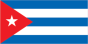
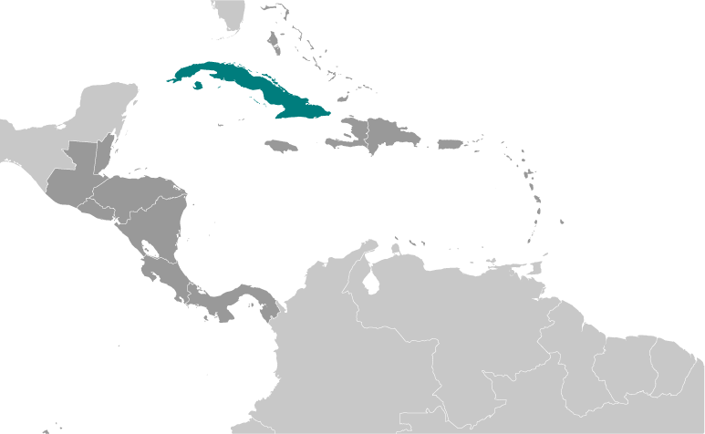
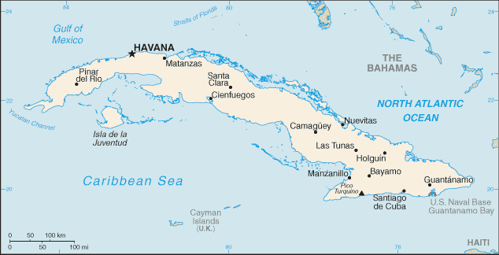

# Cuba

## Introduction

**_Background:_**   
The native Amerindian population of Cuba began to decline after the European discovery of the island by Christopher COLUMBUS in 1492 and following its development as a Spanish colony during the next several centuries. Large numbers of African slaves were imported to work the coffee and sugar plantations, and Havana became the launching point for the annual treasure fleets bound for Spain from Mexico and Peru. Spanish rule eventually provoked an independence movement and occasional rebellions that were harshly suppressed. US intervention during the Spanish-American War in 1898 assisted the Cubans in overthrowing Spanish rule. Subsequently, the 1901 Platt Amendment to the Cuban constitution authorized the US to intevene in Cuba in the event of instability. The Treaty of Paris established Cuban independence from the US in 1902 after which the island experienced a string of governments mostly dominated by the military and corrupt politicians. Fidel CASTRO led a rebel army to victory in 1959; his iron rule held the subsequent regime together for nearly five decades. He stepped down as president in February 2008 in favor of his younger brother Raul CASTRO. Cuba's communist revolution, with Soviet support, was exported throughout Latin America and Africa during the 1960s, 1970s, and 1980s. The country faced a severe economic downturn in 1990 following the withdrawal of former Soviet subsidies worth $4-6 billion annually. Cuba at times portrays the US embargo, in place since 1961, as the source if its difficulties. Illicit migration to the US - using homemade rafts, alien smugglers, air flights, or via the US's southwest border - is a continuing problem. The US Coast Guard interdicted 1,357 Cuban nationals attempting to cross the Straits of Florida in 2013. Also in 2013, 14,251 Cuban migrants presented themselves at various land border ports of entry through out the US.

## Geography

**_Location:_**   
Caribbean, island between the Caribbean Sea and the North Atlantic Ocean, 150 km south of Key West, Florida

**_Geographic coordinates:_**   
21 30 N, 80 00 W

**_Map references:_**   
Central America and the Caribbean

**_Area:_**   
**total:** 110,860 sq km   
**land:** 109,820 sq km   
**water:** 1,040 sq km

**_Area - comparative:_**   
slightly smaller than Pennsylvania

**_Land boundaries:_**   
**total:** 29 km   
**border countries:** US Naval Base at Guantanamo Bay 29 km   
**note:** Guantanamo Naval Base is leased by the US and remains part of Cuba

**_Coastline:_**   
3,735 km

**_Maritime claims:_**   
**territorial sea:** 12 nm   
**contiguous zone:** 24 nm   
**exclusive economic zone:** 200 nm

**_Climate:_**   
tropical; moderated by trade winds; dry season (November to April); rainy season (May to October)

**_Terrain:_**   
mostly flat to rolling plains, with rugged hills and mountains in the southeast

**_Elevation extremes:_**   
**lowest point:** Caribbean Sea 0 m   
**highest point:** Pico Turquino 2,005 m

**_Natural resources:_**   
cobalt, nickel, iron ore, chromium, copper, salt, timber, silica, petroleum, arable land

**_Land use:_**   
**arable land:** 32.31%   
**permanent crops:** 3.55%   
**other:** 64.15% (2011)

**_Irrigated land:_**   
8,703 sq km (2003)

**_Total renewable water resources:_**   
38.12 cu km (2011)

**_Freshwater withdrawal (domestic/industrial/agricultural):_**   
**total:** 4.42 cu km/yr (22%/14%/65%)   
**per capita:** 392.6 cu m/yr (2010)

**_Natural hazards:_**   
the east coast is subject to hurricanes from August to November (in general, the country averages about one hurricane every other year); droughts are common

**_Environment - current issues:_**   
air and water pollution; biodiversity loss; deforestation

**_Environment - international agreements:_**   
**party to:** Antarctic Treaty, Biodiversity, Climate Change, Climate Change-Kyoto Protocol, Desertification, Endangered Species, Environmental Modification, Hazardous Wastes, Law of the Sea, Marine Dumping, Ozone Layer Protection, Ship Pollution, Wetlands   
**signed, but not ratified:** Marine Life Conservation

**_Geography - note:_**   
largest country in Caribbean and westernmost island of the Greater Antilles

## People and Society

**_Nationality:_**   
**noun:** Cuban(s)   
**adjective:** Cuban

**_Ethnic groups:_**   
white 64.1%, mestizo 26.6%, black 9.3% (2012 est.)

**_Languages:_**   
Spanish (official)

**_Religions:_**   
nominally Roman Catholic 85%, Protestant, Jehovah's Witnesses, Jewish, Santeria   
**note:** prior to CASTRO assuming power

**_Population:_**   
11,047,251 (July 2014 est.)

**_Age structure:_**   
**0-14 years:** 16.3% (male 923,602/female 873,156)   
**15-24 years:** 13.6% (male 770,515/female 732,056)   
**25-54 years:** 47.1% (male 2,618,089/female 2,581,895)   
**55-64 years:** 10.4% (male 551,637/female 602,658)   
**65 years and over:** 12.3% (male 625,330/female 768,313) (2014 est.)

**_Dependency ratios:_**   
**total dependency ratio:** 41.9 %   
**youth dependency ratio:** 22.6 %   
**elderly dependency ratio:** 19.3 %   
**potential support ratio:** 5.2 (2014 est.)

**_Median age:_**   
**total:** 39.9 years   
**male:** 39.1 years   
**female:** 40.8 years (2014 est.)

**_Population growth rate:_**   
-0.14% (2014 est.)

**_Birth rate:_**   
9.9 births/1,000 population (2014 est.)

**_Death rate:_**   
7.64 deaths/1,000 population (2014 est.)

**_Net migration rate:_**   
-3.64 migrant(s)/1,000 population (2014 est.)

**_Urbanization:_**   
**urban population:** 75.2% of total population (2011)   
**rate of urbanization:** -0.08% annual rate of change (2010-15 est.)

**_Major urban areas - population:_**   
HAVANA (capital) 2.116 million (2011)

**_Sex ratio:_**   
**at birth:** 1.06 male(s)/female   
**0-14 years:** 1.06 male(s)/female   
**15-24 years:** 1.05 male(s)/female   
**25-54 years:** 1.01 male(s)/female   
**55-64 years:** 0.99 male(s)/female   
**65 years and over:** 0.82 male(s)/female   
**total population:** 0.99 male(s)/female (2014 est.)

**_Maternal mortality rate:_**   
73 deaths/100,000 live births (2010)

**_Infant mortality rate:_**   
**total:** 4.7 deaths/1,000 live births   
**male:** 5.04 deaths/1,000 live births   
**female:** 4.33 deaths/1,000 live births (2014 est.)

**_Life expectancy at birth:_**   
**total population:** 78.22 years   
**male:** 75.92 years   
**female:** 80.65 years (2014 est.)

**_Total fertility rate:_**   
1.46 children born/woman (2014 est.)

**_Contraceptive prevalence rate:_**   
74.3% (2011)

**_Health expenditures:_**   
10% of GDP (2011)

**_Physicians density:_**   
6.72 physicians/1,000 population (2010)

**_Hospital bed density:_**   
5.1 beds/1,000 population (2011)

**_Drinking water source:_**   
**improved:** urban: 96.3% of population; rural: 87.3% of population; total: 94% of population   
**unimproved:** urban: 3.7% of population; rural: 12.7% of population; total: 6% of population (2012 est.)

**_Sanitation facility access:_**   
**improved:** urban: 94% of population; rural: 88.2% of population; total: 92.6% of population   
**unimproved:** urban: 6% of population; rural: 11.8% of population; total: 7.4% of population (2012 est.)

**_HIV/AIDS - adult prevalence rate:_**   
0.1% (2012 est.)

**_HIV/AIDS - people living with HIV/AIDS:_**   
4,700 (2012 est.)

**_HIV/AIDS - deaths:_**   
fewer than 100 (2009 est.)

**_Major infectious diseases:_**   
**degree of risk:** intermediate   
**food or waterborne diseases:** bacterial diarrhea and hepatitis A   
**vectorborne diseases:** dengue fever (2013)

**_Obesity - adult prevalence rate:_**   
21.5% (2008)

**_Children under the age of 5 years underweight:_**   
3.4% (2000)

**_Education expenditures:_**   
12.8% of GDP (2010)

**_Literacy:_**   
**definition:** age 15 and over can read and write   
**total population:** 99.8%   
**male:** 99.8%   
**female:** 99.8% (2011 est.)

**_School life expectancy (primary to tertiary education):_**   
**total:** 15 years   
**male:** 14 years   
**female:** 15 years (2012)

**_Unemployment, youth ages 15-24:_**   
**total:** 3.1%   
**male:** 2.8%   
**female:** 3.5% (2008)

**_People - note:_**   
illicit emigration is a continuing problem; Cubans attempt to depart the island and enter the US using homemade rafts, alien smugglers, direct flights, or falsified visas; Cubans also use non-maritime routes to enter the US including direct flights to Miami and over-land via the southwest border

## Government

**_Country name:_**   
**conventional long form:** Republic of Cuba   
**conventional short form:** Cuba   
**local long form:** Republica de Cuba   
**local short form:** Cuba

**_Government type:_**   
Communist state

**_Capital:_**   
**name:** Havana   
**geographic coordinates:** 23 07 N, 82 21 W   
**time difference:** UTC-5 (same time as Washington, DC, during Standard Time)   
**daylight saving time:** +1hr, begins second Sunday in March; ends first Sunday in November; note - Cuba has been known to alter the schedule of DST on short notice in an attempt to conserve electricity for lighting

**_Administrative divisions:_**   
15 provinces (provincias, singular - provincia) and 1 special municipality\* (municipio especial); Artemisa, Camaguey, Ciego de Avila, Cienfuegos, Granma, Guantanamo, Holguin, Isla de la Juventud\*, La Habana, Las Tunas, Matanzas, Mayabeque, Pinar del Rio, Sancti Spiritus, Santiago de Cuba, Villa Clara

**_Independence:_**   
20 May 1902 (from Spain 10 December 1898; administered by the US from 1898 to 1902); not acknowledged by the Cuban Government as a day of independence

**_National holiday:_**   
Triumph of the Revolution, 1 January (1959)

**_Constitution:_**   
several previous; latest adopted by referendum 15 February 1976, effective 24 February 1976; amended 1978, 1992, 2002 (2010)

**_Legal system:_**   
civil law system based on Spanish civil code

**_International law organization participation:_**   
has not submitted an ICJ jurisdiction declaration; non-party state to the ICCt

**_Suffrage:_**   
16 years of age; universal

**_Executive branch:_**   
**chief of state:** President of the Council of State and President of the Council of Ministers Gen. Raul CASTRO Ruz (president since 24 February 2008); First Vice President of the Council of State and First Vice President of the Council of Ministers Miguel DIAZ-CANEL Bermudez (since 24 February 2013); note - the president is both chief of state and head of government   
**head of government:** President of the Council of State and President of the Council of Ministers Gen. Raul CASTRO Ruz (president since 24 February 2008); First Vice President of the Council of State and First Vice President of the Council of Ministers Miguel DIAZ-CANEL Bermudez (since 24 February 2013)   
**cabinet:** Council of Ministers proposed by the president of the Council of State, appointed by the National Assembly or the 28-member Council of State, and elected by the assembly to act on its behalf when it is not in session   
**elections:** president and vice presidents elected by the National Assembly for a five-year term; election last held on 24 February 2013 (next to be held in 2018)   
**election results:** Gen. Raul CASTRO Ruz reelected president; percent of legislative vote - 100%; Miguel DIAZ-CANEL Bermudez elected vice president; percent of legislative vote - 100%

**_Legislative branch:_**   
unicameral National Assembly of People's Power or Asamblea Nacional del Poder Popular (number of seats in the National Assembly is based on population and currently exceeds 600; members elected directly from slates approved by special candidacy commissions to serve five-year terms)   
**elections:** last held on 3 February 2013 (next to be held in 2018)   
**election results:** Cuba's Communist Party is the only legal party, and officially sanctioned candidates run unopposed

**_Judicial branch:_**   
**highest court(s):** People's Supreme Court (consists of court president, vice president, 41 professional justices, and NA lay judges; organized into the "Whole," State Council, and criminal, civil, administrative, labor, crimes against the state, and military courts)   
**judge selection and term of office:** professional judges elected by the National Assembly to serve 2.5-year terms; lay judges nominated by workplace collectives and neighborhood associations and elected by municipal or provincial assemblies; lay judges appointed for 5-year terms and serve up to 30 days per year   
**subordinate courts:** People's Provincial Courts; People's Regional Courts; People's Courts

**_Political parties and leaders:_**   
Cuban Communist Party or PCC [Raul CASTRO Ruz, first secretary]

**_Political pressure groups and leaders:_**   
Damas de Blanco   
National Association of Small Farmers   
Patriotic Union of Cuba   
political dissidents and bloggers   
The Cuban Commission for Human Rights and National Reconciliation

**_International organization participation:_**   
ACP, ALBA, AOSIS, CELAC, FAO, G-77, IAEA, ICAO, ICC (national committees), ICRM, IFAD, IFRCS, IHO, ILO, IMO, IMSO, Interpol, IOC, IOM (observer), IPU, ISO, ITSO, ITU, LAES, LAIA, NAM, OAS (excluded from formal participation since 1962), OPANAL, OPCW, PCA, Petrocaribe, UN, UNCTAD, UNESCO, UNIDO, Union Latina, UNWTO, UPU, WCO, WFTU (NGOs), WHO, WIPO, WMO, WTO

**_Diplomatic representation in the US:_**   
none; note - the Cuban Interests Section of the Embassy of Switzerland is headed by Jose R. CABANAS Rodriguez (since October 2012); address: Cuban Interests Section, Swiss Embassy, 2630 16th Street NW, Washington, DC 20009; telephone: [1] (202) 797-8518; FAX: [1] (202) 986-7283

**_Diplomatic representation from the US:_**   
none; note - the United States Interests Section of the Embassy of Switzerland is headed by John P. CAULFIELD (since September 2011); address: USINT, Swiss Embassy, Calzada between L and M Streets, Vedado, Havana; telephone: [53] (7) 839-4100; FAX: [53] (7) 839-4247; protecting power in Cuba is Switzerland

**_Flag description:_**   
five equal horizontal bands of blue (top, center, and bottom) alternating with white; a red equilateral triangle based on the hoist side bears a white, five-pointed star in the center; the blue bands refer to the three old divisions of the island: central, occidental, and oriental; the white bands describe the purity of the independence ideal; the triangle symbolizes liberty, equality, and fraternity, while the red color stands for the blood shed in the independence struggle; the white star, called La Estrella Solitaria (the Lone Star) lights the way to freedom and was taken from the flag of Texas   
**note:** design similar to the Puerto Rican flag, with the colors of the bands and triangle reversed

**_National anthem:_**   
**name:** "La Bayamesa" (The Bayamo Song)   
**lyrics/music:** Pedro FIGUEREDO   
**note:** adopted 1940; Pedro FIGUEREDO first performed "La Bayamesa" in 1868 during the Ten Years War against the Spanish; a leading figure in the uprising, FIGUEREDO was captured in 1870 and executed by a firing squad; just prior to the fusillade he is reputed to have shouted, "Morir por la Patria es vivir" (To die for the country is to live), a line from the anthem

## Economy

**_Economy - overview:_**   
The government continues to balance the need for loosening its socialist economic system against a desire for firm political control. The government in April 2011 held the first Cuban Communist Party Congress in almost 13 years, during which leaders approved a plan for wide-ranging economic changes. Since then, the Cuban government has slowly and incrementally implemented limited economic reforms, including allowing Cubans to buy electronic appliances and cell phones, stay in hotels, and buy and sell used cars. The Cuban government also opened up some retail services to "self-employment," leading to the rise of so-called "cuentapropistas" or entrepreneurs. Recent moves include permitting the private ownership and sale of real estate and new vehicles, allowing private farmers to sell agricultural goods directly to hotels, and expanding categories of self-employment. Despite these reforms, the average Cuban's standard of living remains at a lower level than before the collapse of the Soviet Union and the resulting downturn of the 1990s. Since late 2000, Venezuela has been providing oil on preferential terms, and it currently supplies over 100,000 barrels per day of petroleum products. Cuba has been paying for the oil, in part, with the services of Cuban personnel in Venezuela, including some 30,000 medical professionals.

**_GDP (purchasing power parity):_**   
$121 billion (2012 est.)   
$117.3 billion (2011 est.)   
$114.1 billion (2010 est.)   
**note:** data are in 2012 US dollars

**_GDP (official exchange rate):_**   
$72.3 billion (2012 est.)

**_GDP - real growth rate:_**   
3.1% (2012 est.)   
2.8% (2011 est.)   
2.4% (2010 est.)

**_GDP - per capita (PPP):_**   
$10,200 (2010 est.)   
$10,000 (2009 est.)   
$10,000 (2008 est.)   
**note:** data are in 2010 US dollars

**_Gross national saving:_**   
13.4% of GDP (2013 est.)   
11.1% of GDP (2012 est.)   
11.7% of GDP (2011 est.)

**_GDP - composition, by end use:_**   
**household consumption:** 52.1%   
**government consumption:** 34.4%   
**investment in fixed capital:** 10%   
**investment in inventories:** -3.4%   
**exports of goods and services:** 26%   
**imports of goods and services:** -19.2%; (2013 est.)

**_GDP - composition, by sector of origin:_**   
**agriculture:** 3.8%   
**industry:** 22.3%   
**services:** 73.9% (2013 est.)

**_Agriculture - products:_**   
sugar, tobacco, citrus, coffee, rice, potatoes, beans; livestock

**_Industries:_**   
petroleum, nickel, cobalt, pharmaceuticals, tobacco, construction, steel, cement, agricultural machinery, sugar

**_Industrial production growth rate:_**   
2.6% (2013 est.)

**_Labor force:_**   
5.233 million   
**note:** state sector 72.3%, non-state sector 27.7% (2013 est.)

**_Labor force - by occupation:_**   
**agriculture:** 19.7%   
**industry:** 17.1%   
**services:** 63.2% (2011)

**_Unemployment rate:_**   
4.3% (2013 est.)   
3.8% (2012 est.)   
**note:** these are official rates; unofficial estimates are about double the official figures

**_Population below poverty line:_**   
NA%

**_Household income or consumption by percentage share:_**   
**lowest 10%:** NA%   
**highest 10%:** NA%

**_Budget:_**   
**revenues:** $47.62 billion   
**expenditures:** $50.29 billion (2013 est.)

**_Taxes and other revenues:_**   
65.9% of GDP (2013 est.)

**_Budget surplus (+) or deficit (-):_**   
-3.7% of GDP (2013 est.)

**_Public debt:_**   
35.9% of GDP (2013 est.)   
35.8% of GDP (2012 est.)

**_Fiscal year:_**   
calendar year

**_Inflation rate (consumer prices):_**   
6% (2013 est.)   
5.5% (2012 est.)

**_Central bank discount rate:_**   
NA%

**_Commercial bank prime lending rate:_**   
NA%

**_Stock of narrow money:_**   
$11.21 billion (31 December 2013 est.)   
$10.97 billion (31 December 2012 est.)

**_Stock of broad money:_**   
$24.63 billion (31 December 2013 est.)   
$24.08 billion (31 December 2012 est.)

**_Stock of domestic credit:_**   
$NA

**_Current account balance:_**   
$289.8 million (2013 est.)   
-$134.4 million (2012 est.)

**_Exports:_**   
$6.252 billion (2013 est.)   
$5.972 billion (2012 est.)

**_Exports - commodities:_**   
petroleum, nickel, medical products, sugar, tobacco, fish, citrus, coffee

**_Exports - partners:_**   
Canada 17.7%, China 16.9%, Venezuela 12.5%, Netherlands 9%, Spain 5.9% (2012)

**_Imports:_**   
$13.6 billion (2013 est.)   
$13.72 billion (2012 est.)

**_Imports - commodities:_**   
petroleum, food, machinery and equipment, chemicals

**_Imports - partners:_**   
Venezuela 38.3%, China 10.8%, Spain 8.9%, Brazil 5.2%, US 4.3% (2012)

**_Reserves of foreign exchange and gold:_**   
$4.993 billion (31 December 2013 est.)   
$4.693 billion (31 December 2012 est.)

**_Debt - external:_**   
$23.44 billion (31 December 2013 est.)   
$22.51 billion (31 December 2012 est.)

**_Stock of direct foreign investment - at home:_**   
$NA

**_Stock of direct foreign investment - abroad:_**   
$4.138 billion (2006 est.)

**_Exchange rates:_**   
Cuban pesos (CUP) per US dollar -   
1 (2013 est.)   
1 (2012 est.)   
0.9259 (2010 est.)   
0.9259 (2009)   
0.9259 (2008)

## Energy

**_Electricity - production:_**   
17.8 billion kWh (2011 est.)

**_Electricity - consumption:_**   
13.64 billion kWh (2010 est.)

**_Electricity - exports:_**   
0 kWh (2012 est.)

**_Electricity - imports:_**   
0 kWh (2012 est.)

**_Electricity - installed generating capacity:_**   
5.914 million kW (2011 est.)

**_Electricity - from fossil fuels:_**   
99.3% of total installed capacity (2011 est.)

**_Electricity - from nuclear fuels:_**   
0% of total installed capacity (2011 est.)

**_Electricity - from hydroelectric plants:_**   
0.6% of total installed capacity (2011 est.)

**_Electricity - from other renewable sources:_**   
0.1% of total installed capacity (2011 est.)

**_Crude oil - production:_**   
50,800 bbl/day (2012 est.)

**_Crude oil - exports:_**   
83,000 bbl/day (2012 est.)

**_Crude oil - imports:_**   
165,000 bbl/day (2012 est.)

**_Crude oil - proved reserves:_**   
124 million bbl (1 January 2013 est.)

**_Refined petroleum products - production:_**   
100,600 bbl/day (2010 est.)

**_Refined petroleum products - consumption:_**   
150,200 bbl/day (2011 est.)

**_Refined petroleum products - exports:_**   
11,320 bbl/day (2010 est.)

**_Refined petroleum products - imports:_**   
4,877 bbl/day (2010 est.)

**_Natural gas - production:_**   
1.03 billion cu m (2012 est.)

**_Natural gas - consumption:_**   
1.03 billion cu m (2012 est.)

**_Natural gas - exports:_**   
0 cu m (2012 est.)

**_Natural gas - imports:_**   
0 cu m (2012 est.)

**_Natural gas - proved reserves:_**   
70.79 billion cu m (1 January 2013 est.)

**_Carbon dioxide emissions from consumption of energy:_**   
28.41 million Mt (2011 est.)

## Communications

**_Telephones - main lines in use:_**   
1.217 million (2012)

**_Telephones - mobile cellular:_**   
1.682 million (2012)

**_Telephone system:_**   
**general assessment:** greater investment beginning in 1994 and the establishment of a new Ministry of Information Technology and Communications in 2000 has resulted in improvements in the system; national fiber-optic system under development; 95% of switches digitized by end of 2006; mobile-cellular telephone service is expensive and must be paid in convertible pesos; cell phones in Cuba number around 2 million; state communications started service of email to cell phones through nauta.cu accounts; Cuban Government has opened Internet cafes around the island, which are expensive and offer slow-speed connections   
**domestic:** fixed-line density remains low at 10 per 100 inhabitants; mobile-cellular service expanding but remains only about 10 per 100 persons   
**international:** country code - 53; the ALBA-1 fiber-optic submarine cable links Cuba, Jamaica, and Venezuela; fiber-optic cable laid to but not linked to US network; satellite earth station - 1 Intersputnik (Atlantic Ocean region) (2010)

**_Broadcast media:_**   
government owns and controls all broadcast media with private ownership of electronic media prohibited; government operates 4 national TV networks and many local TV stations; government operates 6 national radio networks, an international station, and many local radio stations; Radio-TV Marti is beamed from the US (2007)

**_Internet country code:_**   
.cu

**_Internet hosts:_**   
3,244 (2012)

**_Internet users:_**   
1.606 million   
**note:** private citizens are prohibited from buying computers or accessing the Internet without special authorization; foreigners may access the Internet in large hotels but are subject to firewalls; some Cubans buy illegal passwords on the black market or take advantage of public outlets to access limited email and the government-controlled "intranet" (2009)

## Transportation

**_Airports:_**   
133 (2013)

**_Airports - with paved runways:_**   
**total:** 64   
**over 3,047 m:** 7   
**2,438 to 3,047 m:** 10   
**1,524 to 2,437 m:** 16   
**914 to 1,523 m:** 4   
**under 914 m:** 27 (2013)

**_Airports - with unpaved runways:_**   
**total:** 69   
**914 to 1,523 m:** 11   
**under 914 m:** 58 (2013)

**_Pipelines:_**   
gas 41 km; oil 230 km (2013)

**_Railways:_**   
**total:** 8,203 km   
**standard gauge:** 8,134 km 1.435-m gauge (124 km electrified)   
**narrow gauge:** 69 km 1.000-m gauge   
**note:** 48 km of standard gauge track is not for public use (2011)

**_Roadways:_**   
**total:** 60,858 km   
**paved:** 29,820 km (includes 639 km of expressways)   
**unpaved:** 31,038 km (2001)

**_Waterways:_**   
240 km (almost all navigable inland waterways are near the mouths of rivers) (2011)

**_Merchant marine:_**   
**total:** 3   
**by type:** cargo 1, passenger 1, refrigerated cargo 1   
**registered in other countries:** 5 (Curacao 1, Panama 2, unknown 2) (2010)

**_Ports and terminals:_**   
**major seaport(s):** Antilla, Cienfuegos, Guantanamo, Havana, Matanzas, Mariel, Nuevitas Bay, Santiago de Cuba

## Military

**_Military branches:_**   
Revolutionary Armed Forces (Fuerzas Armadas Revolucionarias, FAR): Revolutionary Army (Ejercito Revolucionario, ER, includes Territorial Militia Troops (Milicia de Tropas de Territoriales, MTT)); Revolutionary Navy (Marina de Guerra Revolucionaria, MGR, includes Marine Corps); Revolutionary Air and Air Defense Forces (Defensas Anti-Aereas y Fuerza Aerea Revolucionaria, DAAFAR), Youth Labor Army (Ejercito Juvenil del Trabajo, EJT) (2013)

**_Military service age and obligation:_**   
17-28 years of age for compulsory military service; 2-year service obligation; both sexes subject to military service (2012)

**_Manpower available for military service:_**   
**males age 16-49:** 2,998,201   
**females age 16-49:** 2,919,107 (2010 est.)

**_Manpower fit for military service:_**   
**males age 16-49:** 2,446,131   
**females age 16-49:** 2,375,590 (2010 est.)

**_Manpower reaching militarily significant age annually:_**   
**male:** 72,823   
**female:** 69,108 (2010 est.)

**_Military - note:_**   
the collapse of the Soviet Union deprived the Cuban military of its major economic and logistic support and had a significant impact on the state of Cuban equipment; the army remains well trained and professional in nature; the lack of replacement parts for its existing equipment has increasingly affected operational capabilities (2013)

## Transnational Issues

**_Disputes - international:_**   
US Naval Base at Guantanamo Bay is leased to US and only mutual agreement or US abandonment of the facility can terminate the lease

**_Trafficking in persons:_**   
**current situation:** Cuba is a source country for adults and children subjected to forced labor and sex trafficking; child prostitution and child sex tourism reportedly occurs in Cuba, and laws do not appear to penalize the prostitution of children between the ages of 16 and 18; allegations have been made of Cubans being subjected to forced labor, particularly with Cuban work missions abroad; the scope of trafficking within Cuba is particularly difficult to gauge due to the closed nature of the government and sparse non-governmental or independent reporting   
**tier rating:** Tier 3 - Cuba does not fully comply with the minimum standards for the elimination of trafficking and is not making significant efforts to do so; the government has not publicized information about government measures to address human trafficking through prosecution, protection, or prevention efforts but did share information about its general approach to protection for children and youth; the government has a network of shelters for victims of domestic violence and child abuse but has not verified if trafficking victims receive care in those centers (2013)

**_Illicit drugs:_**   
territorial waters and air space serve as transshipment zone for US- and European-bound drugs; established the death penalty for certain drug-related crimes in 1999 (2008)

............................................................   
_Page last updated on June 20, 2014_
