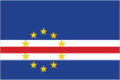
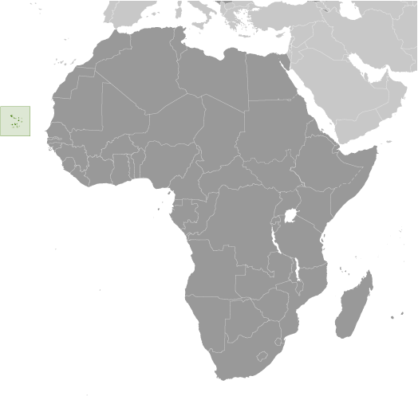
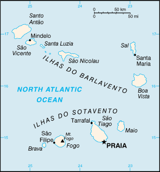

# Cabo Verde

## Introduction

**_Background:_**   
The uninhabited islands were discovered and colonized by the Portuguese in the 15th century; Cabo Verde subsequently became a trading center for African slaves and later an important coaling and resupply stop for whaling and transatlantic shipping. Following independence in 1975, and a tentative interest in unification with Guinea-Bissau, a one-party system was established and maintained until multi-party elections were held in 1990. Cabo Verde continues to exhibit one of Africa's most stable democratic governments. Repeated droughts during the second half of the 20th century caused significant hardship and prompted heavy emigration. As a result, Cabo Verde's expatriate population is greater than its domestic one. Most Cabo Verdeans have both African and Portuguese antecedents.

## Geography

**_Location:_**   
Western Africa, group of islands in the North Atlantic Ocean, west of Senegal

**_Geographic coordinates:_**   
16 00 N, 24 00 W

**_Map references:_**   
Africa

**_Area:_**   
**total:** 4,033 sq km   
**land:** 4,033 sq km   
**water:** 0 sq km

**_Area - comparative:_**   
slightly larger than Rhode Island

**_Land boundaries:_**   
0 km

**_Coastline:_**   
965 km

**_Maritime claims:_**   
measured from claimed archipelagic baselines   
**territorial sea:** 12 nm   
**contiguous zone:** 24 nm   
**exclusive economic zone:** 200 nm

**_Climate:_**   
temperate; warm, dry summer; precipitation meager and erratic

**_Terrain:_**   
steep, rugged, rocky, volcanic

**_Elevation extremes:_**   
**lowest point:** Atlantic Ocean 0 m   
**highest point:** Mt. Fogo 2,829 m (a volcano on Fogo Island)

**_Natural resources:_**   
salt, basalt rock, limestone, kaolin, fish, clay, gypsum

**_Land use:_**   
**arable land:** 11.66%   
**permanent crops:** 0.74%   
**other:** 87.59% (2011)

**_Irrigated land:_**   
34.76 sq km (2004)

**_Total renewable water resources:_**   
0.3 cu km (2011)

**_Freshwater withdrawal (domestic/industrial/agricultural):_**   
**total:** 0.02 cu km/yr (6%/1%/93%)   
**per capita:** 48.57 cu m/yr (2004)

**_Natural hazards:_**   
prolonged droughts; seasonal harmattan wind produces obscuring dust; volcanically and seismically active   
**volcanism:** Fogo (elev. 2,829 m), which last erupted in 1995, is Cabo Verde's only active volcano

**_Environment - current issues:_**   
soil erosion; deforestation due to demand for wood used as fuel; water shortages; desertification; environmental damage has threatened several species of birds and reptiles; illegal beach sand extraction; overfishing

**_Environment - international agreements:_**   
**party to:** Biodiversity, Climate Change, Climate Change-Kyoto Protocol, Desertification, Endangered Species, Environmental Modification, Hazardous Wastes, Law of the Sea, Marine Dumping, Ozone Layer Protection, Ship Pollution, Wetlands   
**signed, but not ratified:** none of the selected agreements

**_Geography - note:_**   
strategic location 500 km from west coast of Africa near major north-south sea routes; important communications station; important sea and air refueling site

## People and Society

**_Nationality:_**   
**noun:** Cabo Verdean(s)   
**adjective:** Cabo Verdean

**_Ethnic groups:_**   
Creole (mulatto) 71%, African 28%, European 1%

**_Languages:_**   
Portuguese (official), Crioulo (a blend of Portuguese and West African words)

**_Religions:_**   
Roman Catholic 77.3%, Protestant 3.7% (includes Church of the Nazarene 1.7%, Adventist 1.5%, Universal Kingdom of God .4%, and God and Love .1%), other Christian 4.3% (includes Christian Rationalism 1.9%, Jehovah's Witness 1%, Assembly of God .9%, and New Apostolic .5%), Muslim 1.8%, other 1.3%, none 10.8%, unspecified 0.7% (2010 est.)

**_Population:_**   
538,535 (July 2014 est.)

**_Age structure:_**   
**0-14 years:** 30.6% (male 82,942/female 82,069)   
**15-24 years:** 21.4% (male 57,633/female 57,637)   
**25-54 years:** 38% (male 99,248/female 105,381)   
**55-64 years:** 4.9% (male 10,917/female 15,352)   
**65 years and over:** 5.2% (male 10,322/female 17,034) (2014 est.)

**_Dependency ratios:_**   
**total dependency ratio:** 51.7 %   
**youth dependency ratio:** 43.8 %   
**elderly dependency ratio:** 8 %   
**potential support ratio:** 12.6 (2014 est.)

**_Median age:_**   
**total:** 24 years   
**male:** 23.2 years   
**female:** 24.8 years (2014 est.)

**_Population growth rate:_**   
1.39% (2014 est.)

**_Birth rate:_**   
20.72 births/1,000 population (2014 est.)

**_Death rate:_**   
6.17 deaths/1,000 population (2014 est.)

**_Net migration rate:_**   
-0.64 migrant(s)/1,000 population (2014 est.)

**_Urbanization:_**   
**urban population:** 62.6% of total population (2011)   
**rate of urbanization:** 2.12% annual rate of change (2010-15 est.)

**_Major urban areas - population:_**   
PRAIA (capital) 132,000 (2011)

**_Sex ratio:_**   
**at birth:** 1.03 male(s)/female   
**0-14 years:** 1.01 male(s)/female   
**15-24 years:** 1 male(s)/female   
**25-54 years:** 0.94 male(s)/female   
**55-64 years:** 0.94 male(s)/female   
**65 years and over:** 0.6 male(s)/female   
**total population:** 0.94 male(s)/female (2014 est.)

**_Mother's mean age at first birth:_**   
19.5   
**note:** median age at first birth among women 25-29 (2005 est.)

**_Maternal mortality rate:_**   
79 deaths/100,000 live births (2010)

**_Infant mortality rate:_**   
**total:** 24.28 deaths/1,000 live births   
**male:** 27.82 deaths/1,000 live births   
**female:** 20.63 deaths/1,000 live births (2014 est.)

**_Life expectancy at birth:_**   
**total population:** 71.57 years   
**male:** 69.32 years   
**female:** 73.89 years (2014 est.)

**_Total fertility rate:_**   
2.34 children born/woman (2014 est.)

**_Contraceptive prevalence rate:_**   
61.3% (2005)

**_Health expenditures:_**   
4.8% of GDP (2011)

**_Physicians density:_**   
0.3 physicians/1,000 population (2010)

**_Hospital bed density:_**   
2.1 beds/1,000 population (2010)

**_Drinking water source:_**   
**improved:** urban: 91.2% of population; rural: 86% of population; total: 89.3% of population   
**unimproved:** urban: 8.8% of population; rural: 14% of population; total: 10.7% of population (2012 est.)

**_Sanitation facility access:_**   
**improved:** urban: 75.2% of population; rural: 47.2% of population; total: 64.9% of population   
**unimproved:** urban: 24.8% of population; rural: 52.8% of population; total: 35.1% of population (2012 est.)

**_HIV/AIDS - adult prevalence rate:_**   
0.2% (2012 est.)

**_HIV/AIDS - people living with HIV/AIDS:_**   
800 (2001) (2012 est.)

**_HIV/AIDS - deaths:_**   
NA

**_Obesity - adult prevalence rate:_**   
10% (2008)

**_Education expenditures:_**   
5% of GDP (2011)

**_Literacy:_**   
**definition:** age 15 and over can read and write   
**total population:** 84.9%   
**male:** 89.7%   
**female:** 80.3% (2011 est.)

**_School life expectancy (primary to tertiary education):_**   
**total:** 13 years   
**male:** 13 years   
**female:** 14 years (2012)

**_Child labor - children ages 5-14:_**   
**total number:** 1,948   
**percentage:** 3 %   
**note:** data represents children ages 10-14 (2001 est.)

## Government

**_Country name:_**   
**conventional long form:** Republic of Cabo Verde   
**conventional short form:** Cabo Verde   
**local long form:** Republica de Cabo Verde   
**local short form:** Cabo Verde

**_Government type:_**   
republic

**_Capital:_**   
**name:** Praia   
**geographic coordinates:** 14 55 N, 23 31 W   
**time difference:** UTC-1 (4 hours ahead of Washington, DC, during Standard Time)

**_Administrative divisions:_**   
22 municipalities (concelhos, singular - concelho); Boa Vista, Brava, Maio, Mosteiros, Paul, Porto Novo, Praia, Ribeira Brava, Ribeira Grande, Ribeira Grande de Santiago, Sal, Santa Catarina, Santa Catarina do Fogo, Santa Cruz, Sao Domingos, Sao Filipe, Sao Lourenco dos Orgaos, Sao Miguel, Sao Salvador do Mundo, Sao Vicente, Tarrafal, Tarrafal de Sao Nicolau

**_Independence:_**   
5 July 1975 (from Portugal)

**_National holiday:_**   
Independence Day, 5 July (1975)

**_Constitution:_**   
previous 1981; latest effective 25 September 1992; revised 1995, 1999, 2010 (2010)

**_Legal system:_**   
civil law system of Portugal

**_International law organization participation:_**   
has not submitted an ICJ jurisdiction declaration; non-party state to the ICCt

**_Suffrage:_**   
18 years of age; universal

**_Executive branch:_**   
**chief of state:** President Jorge Carlos FONSECA (since 9 September 2011)   
**head of government:** Prime Minister Jose Maria Pereira NEVES (since 1 February 2001)   
**cabinet:** Council of Ministers appointed by the president on the recommendation of the prime minister   
**elections:** president elected by popular vote for a five-year term (eligible for a second term); election last held on 7 August 2011 with a second round on 21 August 2011; prime minister nominated by the National Assembly and appointed by the president   
**election results:** percent of vote (second round) - Jorge Carlos FONSECA 53.4%, Manuel Inocencio SOUSA 46.6%

**_Legislative branch:_**   
unicameral National Assembly or Assembleia Nacional (72 seats; members elected by popular vote to serve five-year terms)   
**elections:** last held on 6 February 2011 (next to be held by 2016)   
**election results:** percent of vote by party - NA; seats by party - PAICV 38, MPD 32, UCID 2

**_Judicial branch:_**   
**highest court(s):** Supreme Court of Justice (consists of the chief justice and at least 5 judges)   
**judge selection and term of office:** judges appointments - 1 by the president of the republic, 1 elected by the National Assembly, and the remainder by the Supreme Council of Magistrates, a 9-member independent body presided over by the chief justice and includes the high judicial inspector, 2 presidential appointees, 3 elected by the National Assembly, and 2 by their court peers; chief justice appointed by the president of the republic from among peers of the Supreme Court and in consultation with the Supreme Council of the Magistrates; judge tenure NA   
**subordinate courts:** first instance (municipal) courts; audit, military, and fiscal and customs courts

**_Political parties and leaders:_**   
African Party for Independence of Cabo Verde or PAICV [Jose Maria Pereira NEVES, chairman]   
Democratic and Independent Cabo Verdean Union or UCID [Antonio MONTEIRO]   
Democratic Christian Party or PDC [Manuel RODRIGUES]   
Democratic Renovation Party or PRD [Victor FIDALGO]   
Movement for Democracy or MPD [Carlos VEIGA]   
Party for Democratic Convergence or PCD [Dr. Eurico MONTEIRO]   
Party of Work and Solidarity or PTS [Anibal MEDINA]   
Social Democratic Party or PSD [Joao ALEM]

**_Political pressure groups and leaders:_**   
**other:** environmentalists; political pressure groups

**_International organization participation:_**   
ACP, AfDB, AOSIS, AU, CD, CPLP, ECOWAS, FAO, G-77, IAEA, IBRD, ICAO, ICRM, IDA, IFAD, IFC, IFRCS, ILO, IMF, IMO, Interpol, IOC, IOM, IPU, ITSO, ITU, ITUC (NGOs), MIGA, NAM, OIF, OPCW, UN, UNCTAD, UNESCO, UNIDO, Union Latina, UNWTO, UPU, WCO, WHO, WIPO, WMO, WTO

**_Diplomatic representation in the US:_**   
**chief of mission:** Ambassador Maria De Fatima Lima Da VEIGA (since 22 November 2013)   
**chancery:** 3415 Massachusetts Avenue NW, Washington, DC 20007   
**telephone:** [1] (202) 965-6820   
**FAX:** [1] (202) 965-1207   
**consulate(s) general:** Boston

**_Diplomatic representation from the US:_**   
**chief of mission:** Ambassador Adrienne O'NEAL (since 9 December 2011)   
**embassy:** Rua Abilio Macedo 6, Praia   
**mailing address:** C. P. 201, Praia   
**telephone:** [238] 2-60-89-00   
**FAX:** [238] 2-61-13-55

**_Flag description:_**   
five unequal horizontal bands; the top-most band of blue - equal to one half the width of the flag - is followed by three bands of white, red, and white, each equal to 1/12 of the width, and a bottom stripe of blue equal to one quarter of the flag width; a circle of 10, yellow, five-pointed stars is centered on the red stripe and positioned 3/8 of the length of the flag from the hoist side; blue stands for the sea and the sky, the circle of stars represents the 10 major islands united into a nation, the stripes symbolize the road to formation of the country through peace (white) and effort (red)

**_National anthem:_**   
**name:** "Cantico da Liberdade" (Song of Freedom)   
**lyrics/music:** Amilcar Spencer LOPES/Adalberto Higino Tavares SILVA   
**note:** adopted 1996

## Economy

**_Economy - overview:_**   
The economy is service-oriented with commerce, transport, tourism, and public services accounting for about three-fourths of GDP. Tourism is the mainstay of the economy and it is heavily dependent on conditions in the euro zone countries. This island economy suffers from a poor natural resource base, including serious water shortages exacerbated by cycles of long-term drought and poor soil for agriculture on several of the islands. Although about 40% of the population lives in rural areas, the share of food production in GDP is low. About 82% of food must be imported. The fishing potential, mostly lobster and tuna, is not fully exploited. Cabo Verde annually runs a high trade deficit financed by foreign aid and remittances from its large pool of emigrants; remittances supplement GDP by more than 20%. Despite the lack of resources, sound economic management has produced steadily improving incomes. Continued economic reforms are aimed at developing the private sector and attracting foreign investment to diversify the economy and mitigate high unemployment. Future prospects depend heavily on the maintenance of aid flows, the encouragement of tourism, remittances, and the momentum of the government's development program. Cabo Verde became a member of the WTO in July 2008.

**_GDP (purchasing power parity):_**   
$2.222 billion (2013 est.)   
$2.19 billion (2012 est.)   
$2.135 billion (2011 est.)   
**note:** data are in 2013 US dollars

**_GDP (official exchange rate):_**   
$1.955 billion (2013 est.)

**_GDP - real growth rate:_**   
1.5% (2013 est.)   
2.5% (2012 est.)   
4% (2011 est.)

**_GDP - per capita (PPP):_**   
$4,400 (2013 est.)   
$4,400 (2012 est.)   
$4,400 (2011 est.)   
**note:** data are in 2013 US dollars

**_Gross national saving:_**   
38.5% of GDP (2013 est.)   
34.2% of GDP (2012 est.)   
31.2% of GDP (2011 est.)

**_GDP - composition, by end use:_**   
**household consumption:** 52.9%   
**government consumption:** 16.6%   
**investment in fixed capital:** 41.9%   
**investment in inventories:** 1.7%   
**exports of goods and services:** 34.3%   
**imports of goods and services:** -47.3%; (2013 est.)

**_GDP - composition, by sector of origin:_**   
**agriculture:** 9.3%   
**industry:** 18.8%   
**services:** 71.9% (2013 est.)

**_Agriculture - products:_**   
bananas, corn, beans, sweet potatoes, sugarcane, coffee, peanuts; fish

**_Industries:_**   
food and beverages, fish processing, shoes and garments, salt mining, ship repair

**_Industrial production growth rate:_**   
1.8% (2013 est.)

**_Labor force:_**   
196,100 (2007)

**_Unemployment rate:_**   
21% (2000 est.)

**_Population below poverty line:_**   
30% (2000)

**_Household income or consumption by percentage share:_**   
**lowest 10%:** 1.9%   
**highest 10%:** 40.6% (2001)

**_Budget:_**   
**revenues:** $414.6 million   
**expenditures:** $607 million (2013 est.)

**_Taxes and other revenues:_**   
21.2% of GDP (2013 est.)

**_Budget surplus (+) or deficit (-):_**   
-9.8% of GDP (2013 est.)

**_Public debt:_**   
86.2% of GDP (2012 est.)   
78.1% of GDP (2011 est.)

**_Fiscal year:_**   
calendar year

**_Inflation rate (consumer prices):_**   
1.9% (2013 est.)   
2.5% (2012 est.)

**_Central bank discount rate:_**   
7.5% (31 December 2010 est.)   
7.5% (31 December 2009 est.)

**_Commercial bank prime lending rate:_**   
10.1% (31 December 2013 est.)   
9.92% (31 December 2012 est.)

**_Stock of narrow money:_**   
$517.4 million (31 December 2013 est.)   
$490.5 million (31 December 2012 est.)

**_Stock of broad money:_**   
$1.488 billion (31 December 2013 est.)   
$1.461 billion (31 December 2012 est.)

**_Stock of domestic credit:_**   
$1.523 billion (31 December 2013 est.)   
$1.496 billion (31 December 2012 est.)

**_Current account balance:_**   
-$100 million (2013 est.)   
-$209.3 million (2012 est.)

**_Exports:_**   
$159.9 million (2013 est.)   
$173.1 million (2012 est.)

**_Exports - commodities:_**   
fuel, shoes, garments, fish, hides

**_Exports - partners:_**   
Spain 66.9%, Portugal 13.9%, US 5% (2012)

**_Imports:_**   
$796.3 million (2013 est.)   
$878.7 million (2012 est.)

**_Imports - commodities:_**   
foodstuffs, industrial products, transport equipment, fuels

**_Imports - partners:_**   
Portugal 38.1%, Netherlands 21.5%, China 7.9%, Spain 7% (2012)

**_Reserves of foreign exchange and gold:_**   
$426.2 million (31 December 2013 est.)   
$376 million (31 December 2012 est.)

**_Debt - external:_**   
$1.328 billion (31 December 2013 est.)   
$1.18 billion (31 December 2012 est.)

**_Exchange rates:_**   
Cabo Verdean escudos (CVE) per US dollar -   
84.18 (2013 est.)   
85.822 (2012 est.)   
83.259 (2010 est.)   
79.38 (2009)   
73.84 (2008)

## Energy

**_Electricity - production:_**   
287 million kWh (2010 est.)

**_Electricity - consumption:_**   
266.9 million kWh (2010 est.)

**_Electricity - exports:_**   
0 kWh (2012 est.)

**_Electricity - imports:_**   
0 kWh (2012 est.)

**_Electricity - installed generating capacity:_**   
89,800 kW (2010 est.)

**_Electricity - from fossil fuels:_**   
96.9% of total installed capacity (2010 est.)

**_Electricity - from nuclear fuels:_**   
0% of total installed capacity (2010 est.)

**_Electricity - from hydroelectric plants:_**   
0% of total installed capacity (2010 est.)

**_Electricity - from other renewable sources:_**   
3.1% of total installed capacity (2010 est.)

**_Crude oil - production:_**   
0 bbl/day (2012 est.)

**_Crude oil - exports:_**   
0 bbl/day (2010 est.)

**_Crude oil - imports:_**   
0 bbl/day (2010 est.)

**_Crude oil - proved reserves:_**   
0 bbl (1 January 2013 est.)

**_Refined petroleum products - production:_**   
0 bbl/day (2010 est.)

**_Refined petroleum products - consumption:_**   
2,608 bbl/day (2011 est.)

**_Refined petroleum products - exports:_**   
0 bbl/day (2010 est.)

**_Refined petroleum products - imports:_**   
2,646 bbl/day (2010 est.)

**_Natural gas - production:_**   
0 cu m (2011 est.)

**_Natural gas - consumption:_**   
0 cu m (2010 est.)

**_Natural gas - exports:_**   
0 cu m (2011 est.)

**_Natural gas - imports:_**   
0 cu m (2011 est.)

**_Natural gas - proved reserves:_**   
0 cu m (1 January 2013 est.)

**_Carbon dioxide emissions from consumption of energy:_**   
430,000 Mt (2011 est.)

## Communications

**_Telephones - main lines in use:_**   
70,200 (2012)

**_Telephones - mobile cellular:_**   
425,300 (2012)

**_Telephone system:_**   
**general assessment:** effective system, extensive modernization from 1996-2000 following partial privatization in 1995   
**domestic:** major service provider is Cabo Verde Telecom (CVT); fiber-optic ring, completed in 2001, links all islands providing Internet access and ISDN services; cellular service introduced in 1998; broadband services launched in 2004   
**international:** country code - 238; landing point for the Atlantis-2 fiber-optic transatlantic telephone cable that provides links to South America, Senegal, and Europe; HF radiotelephone to Senegal and Guinea-Bissau; satellite earth station - 1 Intelsat (Atlantic Ocean) (2011)

**_Broadcast media:_**   
state-run TV and radio broadcast network plus a growing number of private broadcasters; Portuguese public TV and radio services for Africa are available; transmissions of a few international broadcasters are available (2007)

**_Internet country code:_**   
.cv

**_Internet hosts:_**   
38 (2012)

**_Internet users:_**   
150,000 (2009)

## Transportation

**_Airports:_**   
9 (2013)

**_Airports - with paved runways:_**   
**total:** 9   
**over 3,047 m:** 1   
**1,524 to 2,437 m:** 3   
**914 to 1,523 m:** 3   
**under 914 m:** 2 (2013)

**_Roadways:_**   
**total:** 1,350 km   
**paved:** 932 km   
**unpaved:** 418 km (2013)

**_Merchant marine:_**   
**total:** 13   
**by type:** cargo 3, chemical tanker 2, passenger/cargo 7, petroleum tanker 1   
**foreign-owned:** 3 (Greece 1, Spain 1, UK 1)   
**registered in other countries:** 1 (unknown 1) (2010)

**_Ports and terminals:_**   
**major seaport(s):** Porto Grande

## Military

**_Military branches:_**   
Armed Forces: Army (also called the National Guard, GN), Cabo Verde Coast Guard (Guardia Costeira de Cabo Verde, GCCV; includes naval infantry) (2013)

**_Military service age and obligation:_**   
18-35 years of age for male and female selective compulsory military service; conscript service obligation - 2 years; 17 years of age for voluntary service (with parental consent) (2013)

**_Manpower available for military service:_**   
**males age 16-49:** 132,087   
**females age 16-49:** 136,956 (2010 est.)

**_Manpower fit for military service:_**   
**males age 16-49:** 106,864   
**females age 16-49:** 117,518 (2010 est.)

**_Manpower reaching militarily significant age annually:_**   
**male:** 6,029   
**female:** 6,026 (2010 est.)

**_Military expenditures:_**   
NA% (2012)   
0.51% of GDP (2011)   
NA% (2010)

## Transnational Issues

**_Disputes - international:_**   
none

**_Illicit drugs:_**   
used as a transshipment point for Latin American cocaine destined for Western Europe, particularly because of Lusophone links to Brazil, Portugal, and Guinea-Bissau; has taken steps to deter drug money laundering, including a 2002 anti-money laundering reform that criminalizes laundering the proceeds of narcotics trafficking and other crimes and the establishment in 2008 of a Financial Intelligence Unit (2008)

............................................................   
_Page last updated on June 20, 2014_
