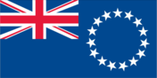
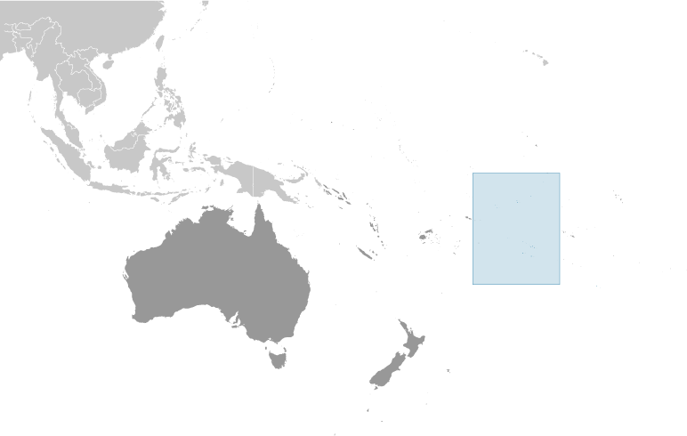
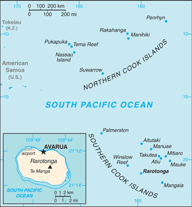

# Cook Islands

_self-governing in free association with New Zealand_

## Introduction

**_Background:_**   
Named after Captain COOK, who sighted them in 1770, the islands became a British protectorate in 1888. By 1900, administrative control was transferred to New Zealand; in 1965, residents chose self-government in free association with New Zealand. The emigration of skilled workers to New Zealand and government deficits are continuing problems.

## Geography

**_Location:_**   
Oceania, group of islands in the South Pacific Ocean, about half way between Hawaii and New Zealand

**_Geographic coordinates:_**   
21 14 S, 159 46 W

**_Map references:_**   
Oceania

**_Area:_**   
**total:** 236 sq km   
**land:** 236 sq km   
**water:** 0 sq km

**_Area - comparative:_**   
1.3 times the size of Washington, DC

**_Land boundaries:_**   
0 km

**_Coastline:_**   
120 km

**_Maritime claims:_**   
**territorial sea:** 12 nm   
**exclusive economic zone:** 200 nm   
**continental shelf:** 200 nm or to the edge of the continental margin

**_Climate:_**   
tropical oceanic; moderated by trade winds; a dry season from April to November and a more humid season from December to March

**_Terrain:_**   
low coral atolls in north; volcanic, hilly islands in south

**_Elevation extremes:_**   
**lowest point:** Pacific Ocean 0 m   
**highest point:** Te Manga 652 m

**_Natural resources:_**   
NEGL

**_Land use:_**   
**arable land:** 8.33%   
**permanent crops:** 4.17%   
**other:** 87.5% (2011)

**_Irrigated land:_**   
NA

**_Natural hazards:_**   
typhoons (November to March)

**_Environment - current issues:_**   
NA

**_Environment - international agreements:_**   
**party to:** Biodiversity, Climate Change, Climate Change-Kyoto Protocol, Desertification, Hazardous Wastes, Law of the Sea, Ozone Layer Protection

**_Geography - note:_**   
the northern Cook Islands are seven low-lying, sparsely populated, coral atolls; the southern Cook Islands, where most of the population lives, consist of eight elevated, fertile, volcanic isles, including the largest, Rarotonga, at 67 sq km

## People and Society

**_Nationality:_**   
**noun:** Cook Islander(s)   
**adjective:** Cook Islander

**_Ethnic groups:_**   
Cook Island Maori (Polynesian) 81.3%, part Cook Island Maori 6.7%, other 11.9% (2011 est.)

**_Languages:_**   
English (official) 86.4%, Cook Islands Maori (Rarotongan) (official) 76.2%, other 8.3% (2011 est.)

**_Religions:_**   
Protestant 62.8% (Cook Islands Christian Church 49.1%, Seventh-Day Adventist 7.9%, Assemblies of God 3.7%, Apostolic Church 2.1%), Roman Catholic 17%, Mormon 4.4%, other 8%, none 5.6%, no response 2.2% (2011 est.)

**_Population:_**   
10,134   
**note:** the Cook Islands' Ministry of Finance & Economic Management estimated the resident population to have been 13,700 in September 2013 (July 2014 est.)

**_Age structure:_**   
**0-14 years:** 22.8% (male 1,224/female 1,084)   
**15-24 years:** 17.9% (male 971/female 845)   
**25-54 years:** 38% (male 1,937/female 1,917)   
**55-64 years:** 10.3% (male 555/female 487)   
**65 years and over:** 10.6% (male 548/female 566) (2014 est.)

**_Median age:_**   
**total:** 34.4 years   
**male:** 33.8 years   
**female:** 35 years (2014 est.)

**_Population growth rate:_**   
-3% (2014 est.)

**_Birth rate:_**   
14.7 births/1,000 population (2014 est.)

**_Death rate:_**   
7.8 deaths/1,000 population (2014 est.)

**_Urbanization:_**   
**urban population:** 73.5% of total population (2011)   
**rate of urbanization:** 0.88% annual rate of change (2010-15 est.)

**_Sex ratio:_**   
**at birth:** 1.04 male(s)/female   
**0-14 years:** 1.13 male(s)/female   
**15-24 years:** 1.15 male(s)/female   
**25-54 years:** 1.01 male(s)/female   
**55-64 years:** 1.07 male(s)/female   
**65 years and over:** 0.96 male(s)/female   
**total population:** 1.07 male(s)/female (2014 est.)

**_Infant mortality rate:_**   
**total:** 14.33 deaths/1,000 live births   
**male:** 17.43 deaths/1,000 live births   
**female:** 11.08 deaths/1,000 live births (2014 est.)

**_Life expectancy at birth:_**   
**total population:** 75.38 years   
**male:** 72.56 years   
**female:** 78.33 years (2014 est.)

**_Total fertility rate:_**   
2.27 children born/woman (2014 est.)

**_Health expenditures:_**   
5.5% of GDP (2011)

**_Physicians density:_**   
2.89 physicians/1,000 population (2009)

**_Drinking water source:_**   
**improved:** urban: 99.9% of population; rural: 99.9% of population; total: 99.9% of population   
**unimproved:** urban: 0.1% of population; rural: 0.1% of population; total: 0.1% of population (2012 est.)

**_Sanitation facility access:_**   
**improved:** urban: 97.2% of population; rural: 97.2% of population; total: 97.2% of population   
**unimproved:** urban: 2.8% of population; rural: 2.8% of population; total: 2.8% of population (2012 est.)

**_HIV/AIDS - adult prevalence rate:_**   
NA

**_HIV/AIDS - people living with HIV/AIDS:_**   
NA

**_HIV/AIDS - deaths:_**   
NA

**_Obesity - adult prevalence rate:_**   
63.7% (2008)

**_Education expenditures:_**   
3.1% of GDP (2011)

**_Literacy:_**   
**definition:** age 15 and over can read and write   
**total population:** 95%   
**male:** NA   
**female:** NA

**_School life expectancy (primary to tertiary education):_**   
**total:** 13 years   
**male:** 12 years   
**female:** 13 years (2011)

## Government

**_Country name:_**   
**conventional long form:** none   
**conventional short form:** Cook Islands   
**former:** Harvey Islands

**_Dependency status:_**   
self-governing in free association with New Zealand; Cook Islands is fully responsible for internal affairs; New Zealand retains responsibility for external affairs and defense in consultation with the Cook Islands

**_Government type:_**   
self-governing parliamentary democracy

**_Capital:_**   
**name:** Avarua   
**geographic coordinates:** 21 12 S, 159 46 W   
**time difference:** UTC-10 (5 hours behind Washington, DC, during Standard Time)

**_Administrative divisions:_**   
none

**_Independence:_**   
none (became self-governing in free association with New Zealand on 4 August 1965 and has the right at any time to move to full independence by unilateral action)

**_National holiday:_**   
Constitution Day, first Monday in August (1965)

**_Constitution:_**   
effective 4 August 1965 (Cook islands Constitution Act 1964); amended many times, last in 2004 (2004)

**_Legal system:_**   
common law similar to New Zealand common law

**_International law organization participation:_**   
has not submitted an ICJ jurisdiction declaration (New Zealand normally retains responsibility for external affairs); accepts ICCt jurisdiction

**_Suffrage:_**   
18 years of age; universal

**_Executive branch:_**   
**chief of state:** Queen ELIZABETH II (since 6 February 1952) represented by Tom J. MARSTERS (since 9 August 2013); New Zealand High Commissioner Joanna KEMPKERS (since 19 July 2013)   
**head of government:** Prime Minister Henry PUNA (since 30 November 2010)   
**cabinet:** Cabinet chosen by the prime minister; collectively responsible to Parliament   
**elections:** the monarchy is hereditary; the UK representative appointed by the monarch; the New Zealand high commissioner appointed by the New Zealand Government; following legislative elections, the leader of the majority party or the leader of the majority coalition usually becomes prime minister

**_Legislative branch:_**   
bicameral Parliament consists of a House of Ariki, or upper house, made up of traditional leaders and a Legislative Assembly, or lower house, (24 seats; members elected by popular vote to serve four-year terms)   
**note:** the House of Ariki advises on traditional matters and maintains considerable influence but has no legislative powers   
**elections:** last held on 17 November 2010 (next to be held by 2014)   
**election results:** percent of vote by party - NA; seats by party - CIP 16, Demo 8

**_Judicial branch:_**   
**highest court(s):** Court of Appeal (consists of the chief justice and 3 judges of the High Court); High Court (consists of the chief justice and at least 4 judges and organized into civil, criminal, and land divisions); note - appeals beyond the Cook Islands Court of Appeal are brought before the Judicial Committee of the Privy Council (in London)   
**judge selection and term of office:** High Court chief justice appointed by the Queen's Representative on the advice of the Executive Council tendered by the prime minister; other judges appointed by the Queen's Representative, on the advice of the Executive Council tendered by the chief justice, High Court chief justice, and the minister of justice; chief justice and judges appointed for 3-year renewable terms   
**subordinate courts:** justices of the peace

**_Political parties and leaders:_**   
Cook Islands Party or CIP [Henry PUNA]   
Democratic Party or Demo [Dr. Terepai MAOATE]

**_Political pressure groups and leaders:_**   
Reform Conference (lobby for political system changes)   
**other:** various groups lobbying for political change

**_International organization participation:_**   
ACP, ADB, AOSIS, FAO, ICAO, ICRM, IFAD, IFRCS, IMO, IMSO, IOC, ITUC (NGOs), OPCW, PIF, Sparteca, SPC, UNESCO, UPU, WHO, WMO

**_Diplomatic representation in the US:_**   
none (self-governing in free association with New Zealand)

**_Diplomatic representation from the US:_**   
none (self-governing in free association with New Zealand)

**_Flag description:_**   
blue, with the flag of the UK in the upper hoist-side quadrant and a large circle of 15 white five-pointed stars (one for every island) centered in the outer half of the flag

**_National anthem:_**   
**name:** "Te Atua Mou E" (To God Almighty)   
**lyrics/music:** Tepaeru Te RITO/Thomas DAVIS   
**note:** adopted 1982; as prime minister, Sir Thomas DAVIS composed the anthem; his wife, a tribal chief, wrote the lyrics

## Economy

**_Economy - overview:_**   
Like many other South Pacific island nations, the Cook Islands' economic development is hindered by the isolation of the country from foreign markets, the limited size of domestic markets, lack of natural resources, periodic devastation from natural disasters, and inadequate infrastructure. Agriculture, employing more than one-quarter of the working population, provides the economic base with major exports of copra and citrus fruit. Black pearls are the Cook Islands' leading export. Manufacturing activities are limited to fruit processing, clothing, and handicrafts. Trade deficits are offset by remittances from emigrants and by foreign aid overwhelmingly from New Zealand. In the 1980s and 1990s, the country lived beyond its means, maintaining a bloated public service and accumulating a large foreign debt. Subsequent reforms, including the sale of state assets, the strengthening of economic management, the encouragement of tourism, and a debt restructuring agreement, have rekindled investment and growth.

**_GDP (purchasing power parity):_**   
$183.2 million (2005 est.)

**_GDP (official exchange rate):_**   
$183.2 million (2005 est.)

**_GDP - real growth rate:_**   
0.1% (2005 est.)

**_GDP - per capita (PPP):_**   
$9,100 (2005 est.)

**_GDP - composition, by sector of origin:_**   
**agriculture:** 5.1%   
**industry:** 12.7%   
**services:** 82.1% (2010 est.)

**_Agriculture - products:_**   
copra, citrus, pineapples, tomatoes, beans, pawpaws, bananas, yams, taro, coffee; pigs, poultry

**_Industries:_**   
fruit processing, tourism, fishing, clothing, handicrafts

**_Industrial production growth rate:_**   
1% (2002)

**_Labor force:_**   
6,820 (2001)

**_Labor force - by occupation:_**   
**agriculture:** 29%   
**industry:** 15%   
**services:** 56% (1995)

**_Unemployment rate:_**   
13.1% (2005)

**_Population below poverty line:_**   
NA%

**_Household income or consumption by percentage share:_**   
**lowest 10%:** NA%   
**highest 10%:** NA%

**_Budget:_**   
**revenues:** $70.95 million   
**expenditures:** $69.05 million (FY05/06)

**_Taxes and other revenues:_**   
38.7% of GDP (FY05/06)

**_Budget surplus (+) or deficit (-):_**   
1% of GDP (FY05/06)

**_Fiscal year:_**   
1 April - 31 March

**_Inflation rate (consumer prices):_**   
2.2% (2011 est.)   
2.2% (2011 est.)

**_Stock of narrow money:_**   
$38.99 million (31 December 2011 est.)   
$38.99 million (31 December 2011 est.)

**_Stock of broad money:_**   
$148.2 million (31 December 2011 est.)   
$170.9 million (31 December 2010 est.)

**_Current account balance:_**   
$26.67 million (2005)

**_Exports:_**   
$5.222 million (2005 est.)   
$3,000

**_Exports - commodities:_**   
copra, papayas, fresh and canned citrus fruit, coffee; fish; pearls and pearl shells; clothing

**_Imports:_**   
$83.49 million (2011 est.)   
$80.55 million

**_Imports - commodities:_**   
foodstuffs, textiles, fuels, timber, capital goods

**_Debt - external:_**   
$141 million (1996 est.)

**_Exchange rates:_**   
NZ dollars (NZD) per US dollar -   
1.247 (2013)   
1.2659 (2011 est.)   
1.3874 (2010)   
1.6002 (2009)   
1.4151 (2008)

## Energy

**_Electricity - production:_**   
31.13 million kWh (2010 est.)

**_Electricity - consumption:_**   
28.95 million kWh (2010 est.)

**_Electricity - exports:_**   
0 kWh (2012 est.)

**_Electricity - imports:_**   
0 kWh (2012 est.)

**_Electricity - installed generating capacity:_**   
8,090 kW (2010 est.)

**_Electricity - from fossil fuels:_**   
98.9% of total installed capacity (2010 est.)

**_Electricity - from nuclear fuels:_**   
0% of total installed capacity (2010 est.)

**_Electricity - from hydroelectric plants:_**   
0% of total installed capacity (2010 est.)

**_Electricity - from other renewable sources:_**   
1.1% of total installed capacity (2010 est.)

**_Crude oil - production:_**   
0 bbl/day (2012 est.)

**_Crude oil - exports:_**   
0 bbl/day (2010 est.)

**_Crude oil - imports:_**   
0 bbl/day (2010 est.)

**_Crude oil - proved reserves:_**   
0 bbl (1 January 2013 est.)

**_Refined petroleum products - production:_**   
0 bbl/day (2010 est.)

**_Refined petroleum products - consumption:_**   
974 bbl/day (2011 est.)

**_Refined petroleum products - exports:_**   
0 bbl/day (2010 est.)

**_Refined petroleum products - imports:_**   
485 bbl/day (2010 est.)

**_Natural gas - production:_**   
0 cu m (2011 est.)

**_Natural gas - consumption:_**   
0 cu m (2010 est.)

**_Natural gas - exports:_**   
0 cu m (2011 est.)

**_Natural gas - imports:_**   
0 cu m (2011 est.)

**_Natural gas - proved reserves:_**   
0 cu m (1 January 2013 est.)

**_Carbon dioxide emissions from consumption of energy:_**   
75,400 Mt (2011 est.)

## Communications

**_Telephones - main lines in use:_**   
7,200 (2009)

**_Telephones - mobile cellular:_**   
7,800 (2009)

**_Telephone system:_**   
**general assessment:** Telecom Cook Islands offers international direct dialing, Internet, email, fax, and Telex   
**domestic:** individual islands are connected by a combination of satellite earth stations, microwave systems, and VHF and HF radiotelephone; within the islands, service is provided by small exchanges connected to subscribers by open-wire, cable, and fiber-optic cable   
**international:** country code - 682; satellite earth station - 1 Intelsat (Pacific Ocean)

**_Broadcast media:_**   
1 privately owned TV station broadcasts from Rarotonga providing a mix of local news and overseas-sourced programs; a satellite program package is available; 6 radio stations broadcast with 1 reportedly reaching all of the islands (2009)

**_Internet country code:_**   
.ck

**_Internet hosts:_**   
3,562 (2012)

**_Internet users:_**   
6,000 (2009)

## Transportation

**_Airports:_**   
11 (2013)

**_Airports - with paved runways:_**   
**total:** 1   
**1,524 to 2,437 m:** 1 (2013)

**_Airports - with unpaved runways:_**   
**total:** 10   
**1,524 to 2,437 m:** 2   
**914 to 1,523 m:** 7   
**under 914 m:** 1 (2013)

**_Roadways:_**   
**total:** 320 km   
**paved:** 33 km   
**unpaved:** 287 km (2003)

**_Merchant marine:_**   
**total:** 35   
**by type:** bulk carrier 2, cargo 25, passenger 1, refrigerated cargo 6, roll on/roll off 1   
**foreign-owned:** 23 (Estonia 1, Germany 1, Lithuania 1, Norway 8, NZ 2, Russia 1, Sweden 3, Turkey 4, UK 2) (2010)

**_Ports and terminals:_**   
**major seaport(s):** Avatiu

## Military

**_Military branches:_**   
no regular military forces; National Police Department (2009)

**_Manpower fit for military service:_**   
**males age 16-49:** 2,198   
**females age 16-49:** 2,156 (2010 est.)

**_Manpower reaching militarily significant age annually:_**   
**male:** 127   
**female:** 107 (2010 est.)

**_Military - note:_**   
defense is the responsibility of New Zealand in consultation with the Cook Islands and at its request

## Transnational Issues

**_Disputes - international:_**   
none

............................................................   
_Page last updated on June 20, 2014_
