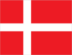
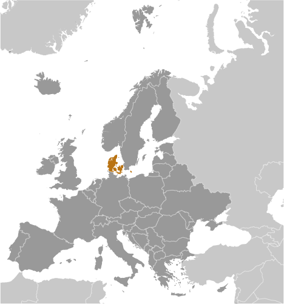
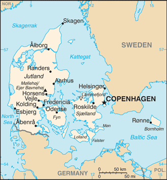

# Denmark

## Introduction

**_Background:_**   
Once the seat of Viking raiders and later a major north European power, Denmark has evolved into a modern, prosperous nation that is participating in the general political and economic integration of Europe. It joined NATO in 1949 and the EEC (now the EU) in 1973. However, the country has opted out of certain elements of the European Union's Maastricht Treaty, including the European Economic and Monetary Union (EMU), European defense cooperation, and issues concerning certain justice and home affairs.

## Geography

**_Location:_**   
Northern Europe, bordering the Baltic Sea and the North Sea, on a peninsula north of Germany (Jutland); also includes several major islands (Sjaelland, Fyn, and Bornholm)

**_Geographic coordinates:_**   
56 00 N, 10 00 E

**_Map references:_**   
Europe

**_Area:_**   
**total:** 43,094 sq km   
**land:** 42,434 sq km   
**water:** 660 sq km   
**note:** includes the island of Bornholm in the Baltic Sea and the rest of metropolitan Denmark (the Jutland Peninsula, and the major islands of Sjaelland and Fyn), but excludes the Faroe Islands and Greenland

**_Area - comparative:_**   
slightly less than twice the size of Massachusetts

**_Land boundaries:_**   
**total:** 140 km   
**border countries:** Germany 140 km

**_Coastline:_**   
7,314 km

**_Maritime claims:_**   
**territorial sea:** 12 nm   
**contiguous zone:** 24 nm   
**exclusive economic zone:** 200 nm   
**continental shelf:** 200 m depth or to the depth of exploitation

**_Climate:_**   
temperate; humid and overcast; mild, windy winters and cool summers

**_Terrain:_**   
low and flat to gently rolling plains

**_Elevation extremes:_**   
**lowest point:** Lammefjord -7 m   
**highest point:** Mollehoj/Ejer Bavnehoj 171 m

**_Natural resources:_**   
petroleum, natural gas, fish, salt, limestone, chalk, stone, gravel and sand

**_Land use:_**   
**arable land:** 57.99%   
**permanent crops:** 0.09%   
**other:** 41.91% (2011)

**_Irrigated land:_**   
4,354 sq km (2007)

**_Total renewable water resources:_**   
6 cu km (2011)

**_Freshwater withdrawal (domestic/industrial/agricultural):_**   
**total:** 0.66 cu km/yr (58%/5%/36%)   
**per capita:** 118.4 cu m/yr (2009)

**_Natural hazards:_**   
flooding is a threat in some areas of the country (e.g., parts of Jutland, along the southern coast of the island of Lolland) that are protected from the sea by a system of dikes

**_Environment - current issues:_**   
air pollution, principally from vehicle and power plant emissions; nitrogen and phosphorus pollution of the North Sea; drinking and surface water becoming polluted from animal wastes and pesticides

**_Environment - international agreements:_**   
**party to:** Air Pollution, Air Pollution-Nitrogen Oxides, Air Pollution-Persistent Organic Pollutants, Air Pollution-Sulfur 85, Air Pollution-Sulfur 94, Air Pollution-Volatile Organic Compounds, Antarctic Treaty, Biodiversity, Climate Change, Climate Change-Kyoto Protocol, Desertification, Endangered Species, Environmental Modification, Hazardous Wastes, Law of the Sea, Marine Dumping, Marine Life Conservation, Ozone Layer Protection, Ship Pollution, Tropical Timber 83, Tropical Timber 94, Wetlands, Whaling   
**signed, but not ratified:** none of the selected agreements

**_Geography - note:_**   
controls Danish Straits (Skagerrak and Kattegat) linking Baltic and North Seas; about one-quarter of the population lives in greater Copenhagen

## People and Society

**_Nationality:_**   
**noun:** Dane(s)   
**adjective:** Danish

**_Ethnic groups:_**   
Scandinavian, Inuit, Faroese, German, Turkish, Iranian, Somali

**_Languages:_**   
Danish, Faroese, Greenlandic (an Inuit dialect), German (small minority)   
**note:** English is the predominant second language

**_Religions:_**   
Evangelical Lutheran (official) 80%, Muslim 4%, other (denominations of less than 1% each, includes Roman Catholic, Jehovah's Witness, Serbian Orthodox Christian, Jewish, Baptist, and Buddhist) 16% (2012 est.)

**_Population:_**   
5,569,077 (July 2014 est.)

**_Age structure:_**   
**0-14 years:** 17% (male 485,115/female 460,682)   
**15-24 years:** 13.1% (male 371,258/female 355,984)   
**25-54 years:** 39.2% (male 1,087,993/female 1,093,545)   
**55-64 years:** 12.4% (male 343,685/female 347,732)   
**65 years and over:** 18% (male 457,175/female 565,908) (2014 est.)

**_Dependency ratios:_**   
**total dependency ratio:** 55.6 %   
**youth dependency ratio:** 27.1 %   
**elderly dependency ratio:** 28.5 %   
**potential support ratio:** 3.5 (2014 est.)

**_Median age:_**   
**total:** 41.6 years   
**male:** 40.7 years   
**female:** 42.5 years (2014 est.)

**_Population growth rate:_**   
0.22% (2014 est.)

**_Birth rate:_**   
10.22 births/1,000 population (2014 est.)

**_Death rate:_**   
10.23 deaths/1,000 population (2014 est.)

**_Net migration rate:_**   
2.25 migrant(s)/1,000 population (2014 est.)

**_Urbanization:_**   
**urban population:** 86.9% of total population (2011)   
**rate of urbanization:** 0.5% annual rate of change (2010-15 est.)

**_Major urban areas - population:_**   
COPENHAGEN (capital) 1.206 million (2011)

**_Sex ratio:_**   
**at birth:** 1.06 male(s)/female   
**0-14 years:** 1.05 male(s)/female   
**15-24 years:** 1.04 male(s)/female   
**25-54 years:** 1 male(s)/female   
**55-64 years:** 0.97 male(s)/female   
**65 years and over:** 0.8 male(s)/female   
**total population:** 0.97 male(s)/female (2014 est.)

**_Mother's mean age at first birth:_**   
29.1 (2012 est.)

**_Maternal mortality rate:_**   
12 deaths/100,000 live births (2010)

**_Infant mortality rate:_**   
**total:** 4.1 deaths/1,000 live births   
**male:** 4.17 deaths/1,000 live births   
**female:** 4.02 deaths/1,000 live births (2014 est.)

**_Life expectancy at birth:_**   
**total population:** 79.09 years   
**male:** 76.68 years   
**female:** 81.64 years (2014 est.)

**_Total fertility rate:_**   
1.73 children born/woman (2014 est.)

**_Health expenditures:_**   
11.2% of GDP (2011)

**_Physicians density:_**   
3.42 physicians/1,000 population (2007)

**_Hospital bed density:_**   
3.5 beds/1,000 population (2010)

**_Drinking water source:_**   
**improved:** urban: 100% of population; rural: 100% of population; total: 100% of population   
**unimproved:** urban: 0% of population; rural: 0% of population; total: 0% of population (2012 est.)

**_Sanitation facility access:_**   
**improved:** urban: 100% of population; rural: 100% of population; total: 100% of population   
**unimproved:** urban: 0% of population; rural: 0% of population; total: 0% of population (2012 est.)

**_HIV/AIDS - adult prevalence rate:_**   
0.2% (2009 est.)

**_HIV/AIDS - people living with HIV/AIDS:_**   
5,300 (2009 est.)

**_HIV/AIDS - deaths:_**   
fewer than 100 (2009 est.)

**_Obesity - adult prevalence rate:_**   
18.2% (2008)

**_Education expenditures:_**   
8.7% of GDP (2009)

**_Literacy:_**   
**definition:** age 15 and over can read and write   
**total population:** 99%   
**male:** 99%   
**female:** 99% (2003 est.)

**_School life expectancy (primary to tertiary education):_**   
**total:** 17 years   
**male:** 16 years   
**female:** 18 years (2010)

**_Unemployment, youth ages 15-24:_**   
**total:** 14.2%   
**male:** 14.8%   
**female:** 14.1% (2012)

## Government

**_Country name:_**   
**conventional long form:** Kingdom of Denmark   
**conventional short form:** Denmark   
**local long form:** Kongeriget Danmark   
**local short form:** Danmark

**_Government type:_**   
constitutional monarchy

**_Capital:_**   
**name:** Copenhagen   
**geographic coordinates:** 55 40 N, 12 35 E   
**time difference:** UTC+1 (6 hours ahead of Washington, DC, during Standard Time)   
**daylight saving time:** +1hr, begins last Sunday in March; ends last Sunday in October   
**note:** applies to continental Denmark only, not to its North Atlantic components

**_Administrative divisions:_**   
metropolitan Denmark - 5 regions (regioner, singular - region); Hovedstaden (Capital), Midtjylland (Central Jutland), Nordjylland (North Jutland), Sjaelland (Zealand), Syddanmark (Southern Denmark)   
**note:** an extensive local government reform merged 271 municipalities into 98 and 13 counties into five regions, effective 1 January 2007

**_Independence:_**   
ca. 965 (unified and Christianized under HARALD I Gormson); 5 June 1849 (became a constitutional monarchy)

**_National holiday:_**   
none designated; Constitution Day, 5 June (1849) is generally viewed as the National Day

**_Constitution:_**   
previous 1665; latest adopted 5 June 1849; amended several times, last in 2009 (2009)

**_Legal system:_**   
civil law; judicial review of legislative acts

**_International law organization participation:_**   
accepts compulsory ICJ jurisdiction with reservations; accepts ICCt jurisdiction

**_Suffrage:_**   
18 years of age; universal

**_Executive branch:_**   
**chief of state:** Queen MARGRETHE II (since 14 January 1972); Heir Apparent Crown Prince FREDERIK, elder son of the monarch (born on 26 May 1968)   
**head of government:** Prime Minister Helle THORNING-SCHMIDT (since 3 October 2011)   
**cabinet:** Council of State appointed by the monarch   
**elections:** the monarchy is hereditary; following legislative elections, the leader of the majority party or the leader of the majority coalition usually appointed prime minister by the monarch

**_Legislative branch:_**   
unicameral People's Assembly or Folketing (179 seats, including 2 from Greenland and 2 from the Faroe Islands; members elected by popular vote on the basis of proportional representation to serve four-year terms unless the Folketing is dissolved earlier)   
**elections:** last held on 15 September 2011 (next to be held by September 2015)   
**election results:** percent of vote by party - V 26.7%, SDP 24.9%, DF 12.3%, SLP 9.5%, SF 9.2%, O 6.7%, LA 5%, C 4.9%, other 0.8%; seats by party - V 47, SDP 44, DF 22, SLP 17, SF 16, O 12, LA 9, C 8; note - does not include the two seats from Greenland and the two seats from the Faroe Islands

**_Judicial branch:_**   
**highest court(s):** Supreme Court (consists of the court president and 18 judges)   
**judge selection and term of office:** judges appointed by the monarch upon the recommendation of the Minister of Justice with the advice of the Judicial Appointments Council, a 6-member independent body of judges and lawyers; judges appointed for life with retirement at age 70   
**subordinate courts:** Special Court of Indictment and Revision; 2 High Courts; Maritime and Commercial Court; county courts

**_Political parties and leaders:_**   
Conservative People's Party or C [Lars BARFOED]   
Danish People's Party or DF [Kristian THULESEN DAHL]   
Liberal Alliance or LA [Anders SAMUELSEN]   
Liberal Party or V [Lars LOKKE RAMUSSEN]   
Red-Green Alliance (Unity List) or O [collective leadership, spokesperson Johanne SCHMIDT-NIELSEN]   
Social Democratic Party or SDP [Helle THORNING-SCHMIDT]   
Social Liberal Party or SLP [Margrethe VESTAGER]   
Socialist People's Party or SF [Annette VILHELMSEN]

**_Political pressure groups and leaders:_**   
Confederation of Danish Employers or DA [President Jorn Neergaard LARSEN]   
Confederation of Danish Industries [CEO Karsten DYBVAD]   
Confederation of Danish Labor Unions (Landsorganisationen) or LO [President Harald BORSTING]   
Danish Shipowners' Association [Chairman Carsten MORTENSEN]; Danish Bankers Association [CEO Joergen HORWITZ]   
DaneAge Association [President Bjarne HASTRUP]   
Danish Society for Nature Conservation [President Ella Maria BISSCHOP-LARSEN]   
**other:** environmental groups; humanitarian relief; development assistance; human rights NGOs

**_International organization participation:_**   
ADB (nonregional member), AfDB (nonregional member), Arctic Council, Australia Group, BIS, CBSS, CD, CE, CERN, EAPC, EBRD, EIB, EITI (implementing country), ESA, EU, FAO, FATF, G-9, IADB, IAEA, IBRD, ICAO, ICC (national committees), ICRM, IDA, IEA, IFAD, IFC, IFRCS, IGAD (partners), IHO, ILO, IMF, IMO, IMSO, Interpol, IOC, IOM, IPU, ISO, ITSO, ITU, ITUC (NGOs), MIGA, MINUSMA, NATO, NC, NEA, NIB, NSG, OAS (observer), OECD, OPCW, OSCE, Paris Club, PCA, Schengen Convention, UN, UNCTAD, UNESCO, UNHCR, UNIDO, UNMIL, UNMISS, UNRWA, UNTSO, UPU, WCO, WHO, WIPO, WMO, WTO, ZC

**_Diplomatic representation in the US:_**   
**chief of mission:** Ambassador Peter TAKSOE-JENSEN (since 1 September 2010)   
**chancery:** 3200 Whitehaven Street NW, Washington, DC 20008   
**telephone:** [1] (202) 234-4300   
**FAX:** [1] (202) 328-1470   
**consulate(s) general:** Chicago, New York

**_Diplomatic representation from the US:_**   
**chief of mission:** Ambassador Rufus GIFFORD (since 15 August 2013)   
**embassy:** Dag Hammarskjolds Alle 24, 2100 Copenhagen 0   
**mailing address:** Unit 5280, DPO, AE 09716   
**telephone:** [45] 33 41 71 00   
**FAX:** [45] 35 43 02 23

**_Flag description:_**   
red with a white cross that extends to the edges of the flag; the vertical part of the cross is shifted to the hoist side; the banner is referred to as the Dannebrog (Danish flag) and is one of the oldest national flags in the world; traditions as to the origin of the flag design vary, but the best known is a legend that the banner fell from the sky during an early-13th century battle; caught up by the Danish king before it ever touched the earth, this heavenly talisman inspired the royal army to victory; in actuality, the flag may derive from a crusade banner or ensign   
**note:** the shifted design element was subsequently adopted by the other Nordic countries of Finland, Iceland, Norway, and Sweden

**_National symbol(s):_**   
lion; mute swan

**_National anthem:_**   
**name:** "Der er et yndigt land" (There is a Lovely Land); "Kong Christian" (King Christian)   
**lyrics/music:** Adam Gottlob OEHLENSCHLAGER/Hans Ernst KROYER; Johannes EWALD/unknown   
**note:** Denmark has two national anthems with equal status; "Der er et yndigt land," adopted 1844, is a national anthem, while "Kong Christian," adopted 1780, serves as both a national and royal anthem; "Kong Christian" is also known as "Kong Christian stod ved hojen mast" (King Christian Stood by the Lofty Mast) and "Kongesangen" (The King's Anthem); within Denmark, the royal anthem is played only when royalty is present and is usually followed by the national anthem; when royalty is not present, only the national anthem is performed; outside Denmark, the royal anthem is played, unless the national anthem is requested

## Economy

**_Economy - overview:_**   
This thoroughly modern market economy features a high-tech agricultural sector, state-of-the-art industry with world-leading firms in pharmaceuticals, maritime shipping and renewable energy, and a high dependence on foreign trade. Denmark is a member of the European Union (EU); Danish legislation and regulations conform to EU standards on almost all issues. Danes enjoy a high standard of living and the Danish economy is characterized by extensive government welfare measures and an equitable distribution of income. Denmark is a net exporter of food and energy and enjoys a comfortable balance of payments surplus, but depends on imports of raw materials for the manufacturing sector. Within the EU, Denmark is among the strongest supporters of trade liberalization. After a long consumption-driven upswing, Denmark's economy began slowing in 2007 with the end of a housing boom. Housing prices dropped markedly in 2008-09 and, following a short respite in 2010, have since continued to decline. Household indebtedness is still relatively high at more than 275% of gross disposable income in the first half of 2013. The global financial crisis has exacerbated this cyclical slowdown through increased borrowing costs and lower export demand, consumer confidence, and investment. Denmark made a modest recovery in 2010, in part because of increased government spending; however, the country experienced a technical recession in late 2010-early 2011. Historically low levels of unemployment rose sharply with the recession and have remained at about 6% in 2010-13, based on the national measure, about two-thirds average EU unemployment. An impending decline in the ratio of workers to retirees will be a major long-term issue. Denmark maintained a healthy budget surplus for many years up to 2008, but the budget balance swung into deficit in 2009, where it remains. In spite of the deficits, the new coalition government delivered a modest stimulus to the economy in 2012. Nonetheless, Denmark's fiscal position remains among the strongest in the EU with public debt at about 46% of GDP in 2013. Despite previously meeting the criteria to join the European Economic and Monetary Union (EMU), so far Denmark has decided not to join, although the Danish krone remains pegged to the euro.

**_GDP (purchasing power parity):_**   
$211.3 billion (2013 est.)   
$211.1 billion (2012 est.)   
$211.9 billion (2011 est.)   
**note:** data are in 2013 US dollars

**_GDP (official exchange rate):_**   
$324.3 billion (2013 est.)

**_GDP - real growth rate:_**   
0.1% (2013 est.)   
-0.4% (2012 est.)   
1.1% (2011 est.)

**_GDP - per capita (PPP):_**   
$37,800 (2013 est.)   
$37,800 (2012 est.)   
$38,100 (2011 est.)   
**note:** data are in 2013 US dollars

**_Gross national saving:_**   
24.1% of GDP (2013 est.)   
22.6% of GDP (2012 est.)   
23.3% of GDP (2011 est.)

**_GDP - composition, by end use:_**   
**household consumption:** 49.1%   
**government consumption:** 28.8%   
**investment in fixed capital:** 17.7%   
**investment in inventories:** 0.2%   
**exports of goods and services:** 53.4%   
**imports of goods and services:** -49.2%; (2013 est.)

**_GDP - composition, by sector of origin:_**   
**agriculture:** 1.5%   
**industry:** 21.7%   
**services:** 76.8% (2013 est.)

**_Agriculture - products:_**   
barley, wheat, potatoes, sugar beets; pork, dairy products; fish

**_Industries:_**   
iron, steel, nonferrous metals, chemicals, food processing, machinery and transportation equipment, textiles and clothing, electronics, construction, furniture and other wood products, shipbuilding and refurbishment, windmills, pharmaceuticals, medical equipment

**_Industrial production growth rate:_**   
1.1% (2013 est.)

**_Labor force:_**   
2.795 million (2013 est.)

**_Labor force - by occupation:_**   
**agriculture:** 2.6%   
**industry:** 20.3%   
**services:** 77.1% (2011 est.)

**_Unemployment rate:_**   
6% (2013 est.)   
6% (2012 est.)

**_Population below poverty line:_**   
13.4% (2011)

**_Household income or consumption by percentage share:_**   
**lowest 10%:** 1.9%   
**highest 10%:** 28.7% (2007)

**_Distribution of family income - Gini index:_**   
24.8 (2011 est.)   
24.7 (1992)

**_Budget:_**   
**revenues:** $181.4 billion   
**expenditures:** $189.7 billion (2013 est.)

**_Taxes and other revenues:_**   
55.9% of GDP (2013 est.)

**_Budget surplus (+) or deficit (-):_**   
-2.5% of GDP (2013 est.)

**_Public debt:_**   
47% of GDP (2013 est.)   
45.6% of GDP (2012 est.)   
**note:** data cover general government debt, and includes debt instruments issued (or owned) by government entities other than the treasury; the data include treasury debt held by foreign entities; the data include debt issued by subnational entities, as well as intra-governmental debt; intra-governmental debt consists of treasury borrowings from surpluses in the social funds, such as for retirement, medical care, and unemployment; debt instruments for the social funds are not sold at public auctions

**_Fiscal year:_**   
calendar year

**_Inflation rate (consumer prices):_**   
0.8% (2013 est.)   
2.4% (2012 est.)

**_Central bank discount rate:_**   
0.75% (31 December 2011 est.)   
0.75% (31 December 2010 est.)

**_Commercial bank prime lending rate:_**   
3.6% (31 December 2013 est.)   
3.6% (31 December 2012 est.)

**_Stock of narrow money:_**   
$147.6 billion (31 December 2013 est.)   
$150.4 billion (31 December 2012 est.)

**_Stock of broad money:_**   
$180.2 billion (31 December 2013 est.)   
$174.3 billion (31 December 2012 est.)

**_Stock of domestic credit:_**   
$675 billion (31 December 2013 est.)   
$664.5 billion (31 December 2012 est.)

**_Market value of publicly traded shares:_**   
$NA (31 December 2012 est.)   
$179.5 billion (31 December 2011)   
$231.7 billion (31 December 2010 est.)

**_Current account balance:_**   
$19.6 billion (2013 est.)   
$17.44 billion (2012 est.)

**_Exports:_**   
$106 billion (2013 est.)   
$104.9 billion (2012 est.)

**_Exports - commodities:_**   
machinery and instruments, meat and meat products, dairy products, fish, pharmaceuticals, furniture, windmills

**_Exports - partners:_**   
Germany 15.9%, Sweden 13.5%, UK 9.6%, US 6.6%, Norway 6.3%, Netherlands 4.6% (2012)

**_Imports:_**   
$98.45 billion (2013 est.)   
$96.77 billion (2012 est.)

**_Imports - commodities:_**   
machinery and equipment, raw materials and semimanufactures for industry, chemicals, grain and foodstuffs, consumer goods

**_Imports - partners:_**   
Germany 21.2%, Sweden 13.5%, Netherlands 7.5%, China 6.4%, Norway 6.3%, UK 5.6% (2012)

**_Reserves of foreign exchange and gold:_**   
$89.5 billion (31 December 2013 est.)   
$89.7 billion (31 December 2012 est.)

**_Debt - external:_**   
$586.7 billion (31 December 2012 est.)   
$571.4 billion (31 December 2011)

**_Stock of direct foreign investment - at home:_**   
$146 billion (31 December 2013 est.)   
$147.1 billion (31 December 2012 est.)

**_Stock of direct foreign investment - abroad:_**   
$248.3 billion (31 December 2013 est.)   
$241.7 billion (31 December 2012 est.)

**_Exchange rates:_**   
Danish kroner (DKK) per US dollar -   
5.695 (2013 est.)   
5.7925 (2012 est.)   
5.6241 (2010 est.)   
5.361 (2009)   
5.0236 (2008)

## Energy

**_Electricity - production:_**   
33.71 billion kWh (2011 est.)

**_Electricity - consumption:_**   
33.56 billion kWh (2010 est.)

**_Electricity - exports:_**   
10.71 billion kWh (2012 est.)

**_Electricity - imports:_**   
15.92 billion kWh (2012 est.)

**_Electricity - installed generating capacity:_**   
13.71 million kW (2010 est.)

**_Electricity - from fossil fuels:_**   
63% of total installed capacity (2010 est.)

**_Electricity - from nuclear fuels:_**   
0% of total installed capacity (2010 est.)

**_Electricity - from hydroelectric plants:_**   
0.1% of total installed capacity (2010 est.)

**_Electricity - from other renewable sources:_**   
36.9% of total installed capacity (2010 est.)

**_Crude oil - production:_**   
207,400 bbl/day (2012 est.)

**_Crude oil - exports:_**   
155,200 bbl/day (2010 est.)

**_Crude oil - imports:_**   
55,010 bbl/day (2010 est.)

**_Crude oil - proved reserves:_**   
805 million bbl (1 January 2013 est.)

**_Refined petroleum products - production:_**   
145,300 bbl/day (2010 est.)

**_Refined petroleum products - consumption:_**   
160,200 bbl/day (2011 est.)

**_Refined petroleum products - exports:_**   
104,400 bbl/day (2010 est.)

**_Refined petroleum products - imports:_**   
124,100 bbl/day (2010 est.)

**_Natural gas - production:_**   
6.412 billion cu m (2012 est.)

**_Natural gas - consumption:_**   
4.994 billion cu m (2010 est.)

**_Natural gas - exports:_**   
2.983 billion cu m (2012 est.)

**_Natural gas - imports:_**   
254 million cu m (2012 est.)

**_Natural gas - proved reserves:_**   
42.98 billion cu m (1 January 2013 est.)

**_Carbon dioxide emissions from consumption of energy:_**   
46.66 million Mt (2011 est.)

## Communications

**_Telephones - main lines in use:_**   
2.431 million (2012)

**_Telephones - mobile cellular:_**   
6.6 million (2012)

**_Telephone system:_**   
**general assessment:** excellent telephone and telegraph services   
**domestic:** buried and submarine cables and microwave radio relay form trunk network, multiple cellular mobile communications systems   
**international:** country code - 45; a series of fiber-optic submarine cables link Denmark with Canada, Faroe Islands, Germany, Iceland, Netherlands, Norway, Poland, Russia, Sweden, and UK; satellite earth stations - 18 (6 Intelsat, 10 Eutelsat, 1 Orion, 1 Inmarsat (Blaavand-Atlantic-East)); note - the Nordic countries (Denmark, Finland, Iceland, Norway, and Sweden) share the Danish earth station and the Eik, Norway, station for worldwide Inmarsat access (2011)

**_Broadcast media:_**   
strong public-sector TV presence with state-owned Danmarks Radio (DR) operating 4 channels and publicly owned TV2 operating roughly a half dozen channels; broadcasts of privately owned stations are available via satellite and cable feed; DR operates 4 nationwide FM radio stations, 15 digital audio broadcasting stations, and about 15 web-based radio stations; approximately 250 commercial and community radio stations (2007)

**_Internet country code:_**   
.dk

**_Internet hosts:_**   
4.297 million (2012)

**_Internet users:_**   
4.75 million (2009)

## Transportation

**_Airports:_**   
80 (2013)

**_Airports - with paved runways:_**   
**total:** 28   
**over 3,047 m:** 2   
**2,438 to 3,047 m:** 7   
**1,524 to 2,437 m:** 5   
**914 to 1,523 m:** 12   
**under 914 m:** 2 (2013)

**_Airports - with unpaved runways:_**   
**total:** 52   
**914 to 1,523 m:** 5   
**under 914 m:** 47 (2013)

**_Pipelines:_**   
condensate 11 km; gas 4,377 km; oil 647 km; oil/gas/water 2 km (2013)

**_Railways:_**   
**total:** 2,667 km   
**standard gauge:** 2,667 km 1.435-m gauge (640 km electrified) (2008)

**_Roadways:_**   
**total:** 73,929 km   
**paved:** 73,929 km (includes 1,143 km of expressways) (2012)

**_Waterways:_**   
400 km (2010)

**_Merchant marine:_**   
**total:** 367   
**by type:** bulk carrier 4, cargo 48, carrier 1, chemical tanker 125, container 94, liquefied gas 4, passenger 1, passenger/cargo 40, petroleum tanker 36, refrigerated cargo 3, roll on/roll off 8, specialized tanker 3   
**foreign-owned:** 27 (Germany 9, Greenland 1, Norway 2, Sweden 15)   
**registered in other countries:** 582 (Antigua and Barbuda 20, Bahamas 69, Belgium 4, Brazil 3, Curacao 1, Cyprus 6, Egypt 1, France 11, Gibraltar 7, Hong Kong 42, Isle of Man 30, Italy 4, Jamaica 1, Liberia 8, Lithuania 8, Luxembourg 1, Malaysia 1, Malta 34, Marshall Islands 7, Moldova 1, Netherlands 27, Norway 7, Panama 41, Philippines 2, Portugal 4, Saint Vincent and the Grenadines 9, Singapore 149, Sweden 4, UK 43, Uruguay 1, US 31, Venezuela 1, unknown 4) (2010)

**_Ports and terminals:_**   
**major seaport(s):** Baltic Sea - Aarhus, Copenhagen, Fredericia, Kalundborg; North Sea - Esbjerg,   
**river port(s):** Aalborg (Langerak)   
**dry bulk cargo port(s):** Ensted (coal)   
**cruise port(s):** Copenhagen

## Military

**_Military branches:_**   
Defense Command: Army Operational Command, Admiral Danish Fleet, Arctic Command, Tactical Air Command, Home Guard (2010)

**_Military service age and obligation:_**   
18 years of age for compulsory and voluntary military service; conscripts serve an initial training period that varies from 4 to 12 months according to specialization; reservists are assigned to mobilization units following completion of their conscript service; women eligible to volunteer for military service (2012)

**_Manpower available for military service:_**   
**males age 16-49:** 1,236,337   
**females age 16-49:** 1,224,182 (2010 est.)

**_Manpower fit for military service:_**   
**males age 16-49:** 1,014,560   
**females age 16-49:** 1,003,921 (2010 est.)

**_Manpower reaching militarily significant age annually:_**   
**male:** 37,913   
**female:** 35,865 (2010 est.)

**_Military expenditures:_**   
1.41% of GDP (2012)   
1.35% of GDP (2011)   
1.41% of GDP (2010)

## Transnational Issues

**_Disputes - international:_**   
Iceland, the UK, and Ireland dispute Denmark's claim that the Faroe Islands' continental shelf extends beyond 200 nm; Faroese continue to study proposals for full independence; sovereignty dispute with Canada over Hans Island in the Kennedy Channel between Ellesmere Island and Greenland; Denmark (Greenland) and Norway have made submissions to the Commission on the Limits of the Continental Shelf (CLCS) and Russia is collecting additional data to augment its 2001 CLCS submission

............................................................   
_Page last updated on June 22, 2014_
