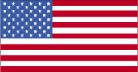
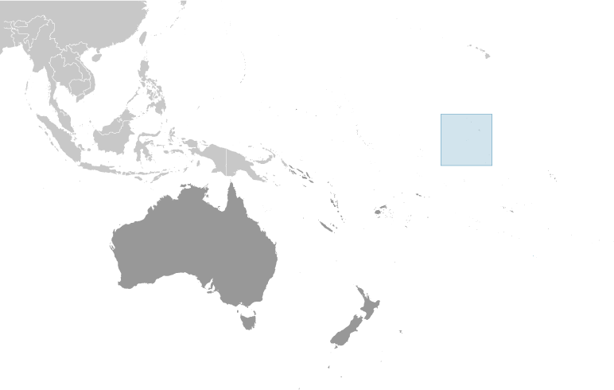
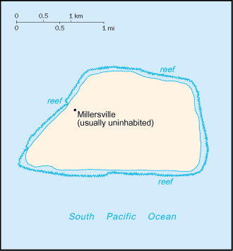

# Jarvis Island

_territory of the US_

## Introduction

**_Background:_**   
First discovered by the British in 1821, the uninhabited island was annexed by the US in 1858 but abandoned in 1879 after tons of guano deposits had been removed for use in producing fertilizer. The UK annexed the island in 1889 but never carried out plans for further exploitation. The US occupied and reclaimed the island in 1935. Abandoned after World War II, the island is currently a National Wildlife Refuge administered by the US Department of the Interior.

## Geography

**_Location:_**   
Oceania, island in the South Pacific Ocean, about half way between Hawaii and the Cook Islands

**_Geographic coordinates:_**   
0 22 S, 160 01 W

**_Map references:_**   
Oceania

**_Area:_**   
**total:** 4.5 sq km   
**land:** 4.5 sq km   
**water:** 0 sq km

**_Area - comparative:_**   
about eight times the size of The Mall in Washington, DC

**_Land boundaries:_**   
0 km

**_Coastline:_**   
8 km

**_Maritime claims:_**   
**territorial sea:** 12 nm   
**exclusive economic zone:** 200 nm

**_Climate:_**   
tropical; scant rainfall, constant wind, burning sun

**_Terrain:_**   
sandy, coral island surrounded by a narrow fringing reef

**_Elevation extremes:_**   
**lowest point:** Pacific Ocean 0 m   
**highest point:** unnamed location 7 m

**_Natural resources:_**   
guano (deposits worked until late 1800s), terrestrial and aquatic wildlife

**_Land use:_**   
**arable land:** 0%   
**permanent crops:** 0%   
**other:** 100% (2011)

**_Irrigated land:_**   
0 sq km (2011)

**_Natural hazards:_**   
the narrow fringing reef surrounding the island poses a maritime hazard

**_Environment - current issues:_**   
no natural fresh water resources

**_Geography - note:_**   
sparse bunch grass, prostrate vines, and low-growing shrubs; primarily a nesting, roosting, and foraging habitat for seabirds, shorebirds, and marine wildlife

## People and Society

**_Population:_**   
uninhabited   
**note:** Millersville settlement on western side of island occasionally used as a weather station from 1935 until World War II, when it was abandoned; reoccupied in 1957 during the International Geophysical Year by scientists who left in 1958; public entry is by special-use permit from US Fish and Wildlife Service only and generally restricted to scientists and educators; visited annually by US Fish and Wildlife Service

## Government

**_Country name:_**   
**conventional long form:** none   
**conventional short form:** Jarvis Island

**_Dependency status:_**   
unincorporated territory of the US; administered from Washington, DC, by the Fish and Wildlife Service of the US Department of the Interior as part of the National Wildlife Refuge system

**_Legal system:_**   
the laws of the US, where applicable, apply

**_Flag description:_**   
the flag of the US is used

## Transportation

**_Ports and terminals:_**   
none; offshore anchorage only; note - there is one small boat landing area in the middle of the west coast and another near the southwest corner of the island

**_Transportation - note:_**   
there is a day beacon near the middle of the west coast

## Military

**_Military - note:_**   
defense is the responsibility of the US; visited annually by the US Coast Guard

## Transnational Issues

**_Disputes - international:_**   
none

............................................................   
_Page last updated on March 27, 2014_
