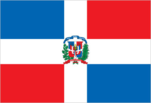
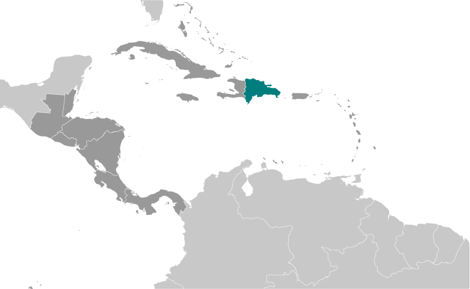
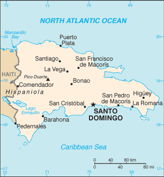

# Dominican Republic

## Introduction

**_Background:_**   
The Taino - indigenous inhabitants of Hispaniola prior to the arrival of the Europeans - divided the island into five chiefdoms and territories. Christopher COLUMBUS explored and claimed the island on his first voyage in 1492; it became a springboard for Spanish conquest of the Caribbean and the American mainland. In 1697, Spain recognized French dominion over the western third of the island, which in 1804 became Haiti. The remainder of the island, by then known as Santo Domingo, sought to gain its own independence in 1821 but was conquered and ruled by the Haitians for 22 years; it finally attained independence as the Dominican Republic in 1844. In 1861, the Dominicans voluntarily returned to the Spanish Empire, but two years later they launched a war that restored independence in 1865. A legacy of unsettled, mostly non-representative rule followed, capped by the dictatorship of Rafael Leonidas TRUJILLO from 1930 to 1961. Juan BOSCH was elected president in 1962 but was deposed in a military coup in 1963. In 1965, the United States led an intervention in the midst of a civil war sparked by an uprising to restore BOSCH. In 1966, Joaquin BALAGUER defeated BOSCH in an election to become president. BALAGUER maintained a tight grip on power for most of the next 30 years when international reaction to flawed elections forced him to curtail his term in 1996. Since then, regular competitive elections have been held in which opposition candidates have won the presidency. Former President Leonel FERNANDEZ Reyna (first term 1996-2000) won election to a new term in 2004 following a constitutional amendment allowing presidents to serve more than one term, and was later reelected to a second consecutive term. In 2012, Danilo MEDINA Sanchez was elected president.

## Geography

**_Location:_**   
Caribbean, eastern two-thirds of the island of Hispaniola, between the Caribbean Sea and the North Atlantic Ocean, east of Haiti

**_Geographic coordinates:_**   
19 00 N, 70 40 W

**_Map references:_**   
Central America and the Caribbean

**_Area:_**   
**total:** 48,670 sq km   
**land:** 48,320 sq km   
**water:** 350 sq km

**_Area - comparative:_**   
slightly more than twice the size of New Hampshire

**_Land boundaries:_**   
**total:** 376 km   
**border countries:** Haiti 376 km

**_Coastline:_**   
1,288 km

**_Maritime claims:_**   
measured from claimed archipelagic straight baselines   
**territorial sea:** 12 nm   
**contiguous zone:** 24 nm   
**exclusive economic zone:** 200 nm   
**continental shelf:** 200 nm or to the edge of the continental margin

**_Climate:_**   
tropical maritime; little seasonal temperature variation; seasonal variation in rainfall

**_Terrain:_**   
rugged highlands and mountains with fertile valleys interspersed

**_Elevation extremes:_**   
**lowest point:** Lago Enriquillo -46 m   
**highest point:** Pico Duarte 3,175 m

**_Natural resources:_**   
nickel, bauxite, gold, silver

**_Land use:_**   
**arable land:** 16.44%   
**permanent crops:** 9.25%   
**other:** 74.32% (2011)

**_Irrigated land:_**   
3,065 sq km (2009)

**_Total renewable water resources:_**   
21 cu km (2011)

**_Freshwater withdrawal (domestic/industrial/agricultural):_**   
**total:** 5.47 cu km/yr (26%/1%/72%)   
**per capita:** 574.2 cu m/yr (2005)

**_Natural hazards:_**   
lies in the middle of the hurricane belt and subject to severe storms from June to October; occasional flooding; periodic droughts

**_Environment - current issues:_**   
water shortages; soil eroding into the sea damages coral reefs; deforestation

**_Environment - international agreements:_**   
**party to:** Biodiversity, Climate Change, Climate Change-Kyoto Protocol, Desertification, Endangered Species, Hazardous Wastes, Marine Dumping, Marine Life Conservation, Ozone Layer Protection, Ship Pollution, Wetlands   
**signed, but not ratified:** Law of the Sea

**_Geography - note:_**   
shares island of Hispaniola with Haiti

## People and Society

**_Nationality:_**   
**noun:** Dominican(s)   
**adjective:** Dominican

**_Ethnic groups:_**   
mixed 73%, white 16%, black 11%

**_Languages:_**   
Spanish (official)

**_Religions:_**   
Roman Catholic 95%, other 5%

**_Population:_**   
10,349,741 (July 2014 est.)

**_Age structure:_**   
**0-14 years:** 28% (male 1,474,170/female 1,423,573)   
**15-24 years:** 18.5% (male 974,688/female 937,103)   
**25-54 years:** 39.3% (male 2,078,915/female 1,984,585)   
**55-64 years:** 7.2% (male 376,175/female 371,152)   
**65 years and over:** 6.9% (male 336,712/female 392,668) (2014 est.)

**_Dependency ratios:_**   
**total dependency ratio:** 57.1 %   
**youth dependency ratio:** 47 %   
**elderly dependency ratio:** 10.1 %   
**potential support ratio:** 9.9 (2014 est.)

**_Median age:_**   
**total:** 27.1 years   
**male:** 26.9 years   
**female:** 27.3 years (2014 est.)

**_Population growth rate:_**   
1.25% (2014 est.)

**_Birth rate:_**   
18.97 births/1,000 population (2014 est.)

**_Death rate:_**   
4.5 deaths/1,000 population (2014 est.)

**_Net migration rate:_**   
-1.93 migrant(s)/1,000 population (2014 est.)

**_Urbanization:_**   
**urban population:** 69.7% of total population (2011)   
**rate of urbanization:** 2.03% annual rate of change (2010-15 est.)

**_Major urban areas - population:_**   
SANTO DOMINGO (capital) 2.191 million (2011)

**_Sex ratio:_**   
**at birth:** 1.04 male(s)/female   
**0-14 years:** 1.04 male(s)/female   
**15-24 years:** 1.04 male(s)/female   
**25-54 years:** 1.05 male(s)/female   
**55-64 years:** 1.03 male(s)/female   
**65 years and over:** 0.86 male(s)/female   
**total population:** 1.03 male(s)/female (2014 est.)

**_Mother's mean age at first birth:_**   
20.3   
**note:** median age at first birth among women 25-29 (2007 est.)

**_Maternal mortality rate:_**   
150 deaths/100,000 live births (2010)

**_Infant mortality rate:_**   
**total:** 19.63 deaths/1,000 live births   
**male:** 21.56 deaths/1,000 live births   
**female:** 17.62 deaths/1,000 live births (2014 est.)

**_Life expectancy at birth:_**   
**total population:** 77.8 years   
**male:** 75.6 years   
**female:** 80.08 years (2014 est.)

**_Total fertility rate:_**   
2.36 children born/woman (2014 est.)

**_Contraceptive prevalence rate:_**   
72.9% (2007)

**_Health expenditures:_**   
5.4% of GDP (2011)

**_Physicians density:_**   
1.88 physicians/1,000 population (2000)

**_Hospital bed density:_**   
1.7 beds/1,000 population (2011)

**_Drinking water source:_**   
**improved:** urban: 82.5% of population; rural: 77.2% of population; total: 80.9% of population   
**unimproved:** urban: 17.5% of population; rural: 22.8% of population; total: 19.1% of population (2012 est.)

**_Sanitation facility access:_**   
**improved:** urban: 85.5% of population; rural: 73.8% of population; total: 82% of population   
**unimproved:** urban: 14.5% of population; rural: 26.2% of population; total: 18% of population (2012 est.)

**_HIV/AIDS - adult prevalence rate:_**   
0.7% (2012 est.)

**_HIV/AIDS - people living with HIV/AIDS:_**   
45,000 (2012 est.)

**_HIV/AIDS - deaths:_**   
1,900 (2012 est.)

**_Major infectious diseases:_**   
**degree of risk:** high   
**food or waterborne diseases:** bacterial diarrhea, hepatitis A, and typhoid fever   
**vectorborne disease:** dengue fever (2013)

**_Obesity - adult prevalence rate:_**   
21.2% (2008)

**_Children under the age of 5 years underweight:_**   
3.4% (2007)

**_Education expenditures:_**   
2.2% of GDP (2012)

**_Literacy:_**   
**definition:** age 15 and over can read and write   
**total population:** 90.1%   
**male:** 90%   
**female:** 90.2% (2011 est.)

**_Child labor - children ages 5-14:_**   
**total number:** 180,423   
**percentage:** 10 % (2000 est.)

**_Unemployment, youth ages 15-24:_**   
**total:** 29.4%   
**male:** 22.6%   
**female:** 40.8% (2011)

## Government

**_Country name:_**   
**conventional long form:** Dominican Republic   
**conventional short form:** The Dominican   
**local long form:** Republica Dominicana   
**local short form:** La Dominicana

**_Government type:_**   
democratic republic

**_Capital:_**   
**name:** Santo Domingo   
**geographic coordinates:** 18 28 N, 69 54 W   
**time difference:** UTC-4 (1 hour ahead of Washington, DC, during Standard Time)

**_Administrative divisions:_**   
10 regions (regiones, singular - region);Cibao Nordeste, Cibao Noroeste, Cibao Norte, Cibao Sur, El Valle, Enriquillo, Higuamo, Ozama, Valdesia, Yuma

**_Independence:_**   
27 February 1844 (from Haiti)

**_National holiday:_**   
Independence Day, 27 February (1844)

**_Constitution:_**   
many previous (38 total); latest proclaimed 26 January 2010; note - the Dominican Republic Government has a practice of promulgating a "new" constitution whenever an amendment is ratified (2013)

**_Legal system:_**   
civil law system based on the French civil code; Criminal Procedures Code modified in 2004 to include important elements of an accusatory system

**_International law organization participation:_**   
accepts compulsory ICJ jurisdiction; accepts ICCt jurisdiction

**_Suffrage:_**   
18 years of age, universal and compulsory; married persons regardless of age can vote; note - members of the armed forces and national police by law cannot vote

**_Executive branch:_**   
**chief of state:** President Danilo MEDINA Sanchez (since 16 August 2012); Vice President Margarita CEDENO DE FERNANDEZ (since 16 August 2012); note - the president is both chief of state and head of government   
**head of government:** President Danilo MEDINA Sanchez (since 16 August 2012); Vice President Margarita CEDENO DE FERNANDEZ (since 16 August 2012)   
**cabinet:** Cabinet nominated by the president   
**elections:** president and vice president elected on the same ticket by popular vote for four-year terms; election last held on 20 May 2012 (next to be held in 2016)   
**election results:** Danilo MEDINA Sanchez elected president; percent of vote - Danilo MEDINA Sanchez 51.2%, Hipolito MEJIA 47%, other 1.8%; Margarita CEDENO DE FERNANDEZ elected vice president

**_Legislative branch:_**   
bicameral National Congress or Congreso Nacional consists of the Senate or Senado (32 seats; members elected by popular vote to serve four-year terms) and the House of Representatives or Camara de Diputados (183 seats; members are elected by popular vote to serve four-year terms)   
**elections:** Senate - last held on 16 May 2010 (next to be held in May 2016); House of Representatives - last held on 16 May 2010 (next to be held in May 2016); in order to synchronize presidential, legislative, and local elections for 2016, those members elected in 2010 will actually serve six-year terms   
**election results:** Senate - percent of vote by party - NA; seats by party - PLD 31, PRSC 1; House of Representatives - percent of vote by party - NA; seats by party - PLD 105, PRD 75, PRSC 3

**_Judicial branch:_**   
**highest court(s):** Supreme Court of Justice or Suprema Corte de Justicia (consists of a minimum of 16 magistrates); Constitutional Court or Tribunal Constitucional (consists of 13 judges); note - the Constitutional Court was established in 2010 by constitutional amendment   
**judge selection and term of office:** Supreme Court and Constitutional Court judges appointed by the National Council of the Judiciary comprised of the president, the leaders of both chambers of congress, the president of the Supreme Court, and a non-governing party congressional representative; Supreme Court judges appointed for 7- year terms; Constitutional Court judges appointed for 9-year terms   
**subordinate courts:** courts of appeal; courts of first instance; justices of the peace; special courts for juvenile, labor, and land cases; Contentious Administrative Court for cases filed against the government

**_Political parties and leaders:_**   
Dominican Liberation Party or PLD [Leonel FERNANDEZ Reyna]   
Dominican Revolutionary Party or PRD [Miguel VARGAS Maldonado]   
National Progressive Front [Vinicio CASTILLO, Pelegrin CASTILLO]   
Social Christian Reformist Party or PRSC [Carlos MORALES Troncoso]

**_Political pressure groups and leaders:_**   
Citizen Participation Group (Participacion Ciudadania)   
Collective of Popular Organizations or COP   
Foundation for Institution-Building and Justice or FINJUS

**_International organization participation:_**   
ACP, AOSIS, BCIE, Caricom (observer), CD, CELAC, FAO, G-77, IADB, IAEA, IBRD, ICAO, ICC (national committees), ICRM, IDA, IFAD, IFC, IFRCS, IHO, ILO, IMF, IMO, Interpol, IOC, IOM, IPU, ISO (correspondent), ITSO, ITU, ITUC (NGOs), LAES, LAIA (observer), MIGA, MINUSMA, NAM, OAS, OIF (observer), OPANAL, OPCW, Pacific Alliance (observer), PCA, Petrocaribe, SICA (associated member), UN, UNCTAD, UNESCO, UNIDO, Union Latina, UNWTO, UPU, WCO, WFTU (NGOs), WHO, WIPO, WMO, WTO

**_Diplomatic representation in the US:_**   
**chief of mission:** Ambassador Anibal de Jesus de CASTRO Rodriguez (since 5 July 2011)   
**chancery:** 1715 22nd Street NW, Washington, DC 20008   
**telephone:** [1] (202) 332-6280   
**FAX:** [1] (202) 265-8057   
**consulate(s) general:** Boston, Chicago, Glendale (CA), Mayaguez (Puerto Rico), Miami, New Orleans, New York, San Juan (Puerto Rico)

**_Diplomatic representation from the US:_**   
**chief of mission:** Ambassador James BREWSTER   
**embassy:** corner of Calle Cesar Nicolas Penson and Calle Leopoldo Navarro, Santo Domingo   
**mailing address:** Unit 5500, APO AA 34041-5500   
**telephone:** [1] (809) 221-2171   
**FAX:** [1] (809) 686-7437

**_Flag description:_**   
a centered white cross that extends to the edges divides the flag into four rectangles - the top ones are blue (hoist side) and red, and the bottom ones are red (hoist side) and blue; a small coat of arms featuring a shield supported by a laurel branch (left) and a palm branch (right) is at the center of the cross; above the shield a blue ribbon displays the motto, DIOS, PATRIA, LIBERTAD (God, Fatherland, Liberty), and below the shield, REPUBLICA DOMINICANA appears on a red ribbon; in the shield a bible is opened to a verse that reads "Y la verdad nos hara libre" (And the truth shall set you free); blue stands for liberty, white for salvation, and red for the blood of heroes

**_National symbol(s):_**   
palmchat (bird)

**_National anthem:_**   
**name:** "Himno Nacional" (National Anthem)   
**lyrics/music:** Emilio PRUD"HOMME/Jose REYES   
**note:** adopted 1934; also known as "Quisqueyanos valientes" (Valient Sons of Quisqueye); the anthem never refers to the people as Dominican but rather calls them "Quisqueyanos," a reference to the indigenous name of the island

## Economy

**_Economy - overview:_**   
The Dominican Republic has long been viewed primarily as an exporter of sugar, coffee, and tobacco, but in recent years the service sector has overtaken agriculture as the economy's largest employer, due to growth in telecommunications, tourism, and free trade zones. The economy is highly dependent upon the US, the destination for approximately half of exports. Remittances from the US amount to about 5% of GDP, equivalent to about a third of exports and two-thirds of tourism receipts. The country suffers from marked income inequality; the poorest half of the population receives less than one-fifth of GDP, while the richest 10% enjoys nearly 40% of GDP. High unemployment and underemployment remains an important long-term challenge. The Central America-Dominican Republic Free Trade Agreement (CAFTA-DR) came into force in March 2007, boosting investment and exports and reducing losses to the Asian garment industry. The Dominican Republic's economy rebounded from the global recession in 2010-13, and the fiscal situation is improving. A tax reform package passed in November 2012 and a reduction in government spending helped to narrow the central government budget deficit from 6.6% of GDP in 2012 to below 3% in 2013. A successful government bond placement in 2013 helped finance the deficit.

**_GDP (purchasing power parity):_**   
$101 billion (2013 est.)   
$99.02 billion (2012 est.)   
$95.32 billion (2011 est.)   
**note:** data are in 2013 US dollars

**_GDP (official exchange rate):_**   
$59.27 billion (2013 est.)

**_GDP - real growth rate:_**   
2% (2013 est.)   
3.9% (2012 est.)   
4.5% (2011 est.)

**_GDP - per capita (PPP):_**   
$9,700 (2013 est.)   
$9,700 (2012 est.)   
$9,500 (2011 est.)   
**note:** data are in 2013 US dollars

**_GDP - composition, by end use:_**   
**household consumption:** 83.3%   
**government consumption:** 7.7%   
**investment in fixed capital:** 15.6%   
**investment in inventories:** 0.1%   
**exports of goods and services:** 26.4%   
**imports of goods and services:** -33.2%; (2013 est.)

**_GDP - composition, by sector of origin:_**   
**agriculture:** 6%   
**industry:** 29.1%   
**services:** 64.9% (2013 est.)

**_Agriculture - products:_**   
sugarcane, coffee, cotton, cocoa, tobacco, rice, beans, potatoes, corn, bananas; cattle, pigs, dairy products, beef, eggs

**_Industries:_**   
tourism, sugar processing, ferronickel and gold mining, textiles, cement, tobacco

**_Industrial production growth rate:_**   
2.5% (2013 est.)

**_Labor force:_**   
4.912 million (2013 est.)

**_Labor force - by occupation:_**   
**agriculture:** 14.6%   
**industry:** 22.3%   
**services:** 63.1% (2005)

**_Unemployment rate:_**   
15% (2013 est.)   
14.3% (2012 est.)

**_Population below poverty line:_**   
34.4% (2010 est.)

**_Household income or consumption by percentage share:_**   
**lowest 10%:** 1.8%   
**highest 10%:** 36.4% (2010 est.)

**_Distribution of family income - Gini index:_**   
47.2 (2010 est.)   
52 (2000 est.)

**_Budget:_**   
**revenues:** $9.012 billion   
**expenditures:** $10.79 billion (2013 est.)

**_Taxes and other revenues:_**   
15.2% of GDP (2013 est.)

**_Budget surplus (+) or deficit (-):_**   
-3% of GDP (2013 est.)

**_Public debt:_**   
47% of GDP (2013 est.)   
41.5% of GDP (2012 est.)

**_Fiscal year:_**   
calendar year

**_Inflation rate (consumer prices):_**   
5% (2013 est.)   
3.7% (2012 est.)

**_Commercial bank prime lending rate:_**   
13.6% (31 December 2013 est.)   
15.48% (31 December 2012 est.)

**_Stock of narrow money:_**   
$4.943 billion (31 December 2013 est.)   
$4.738 billion (31 December 2012 est.)

**_Stock of broad money:_**   
$15.54 billion (31 December 2013 est.)   
$14.83 billion (31 December 2012 est.)

**_Stock of domestic credit:_**   
$25.09 billion (31 December 2013 est.)   
$23.71 billion (31 December 2012 est.)

**_Market value of publicly traded shares:_**   
$NA

**_Current account balance:_**   
-$2.33 billion (2013 est.)   
-$4.037 billion (2012 est.)

**_Exports:_**   
$9.825 billion (2013 est.)   
$9.079 billion (2012 est.)

**_Exports - commodities:_**   
ferronickel, sugar, gold, silver, coffee, cocoa, tobacco, meats, consumer goods

**_Exports - partners:_**   
US 47%, Haiti 16.1%, China 4.3% (2012)

**_Imports:_**   
$16.8 billion (2013 est.)   
$17.76 billion (2012 est.)

**_Imports - commodities:_**   
foodstuffs, petroleum, cotton and fabrics, chemicals and pharmaceuticals

**_Imports - partners:_**   
US 43.3%, Venezuela 7.7%, China 6.3%, Mexico 5.3%, Colombia 4.1% (2012)

**_Reserves of foreign exchange and gold:_**   
$4.379 billion (31 December 2013 est.)   
$3.579 billion (31 December 2012 est.)

**_Debt - external:_**   
$18.01 billion (31 December 2013 est.)   
$16.33 billion (31 December 2012 est.)

**_Stock of direct foreign investment - at home:_**   
$26.76 billion (31 December 2013 est.)   
$24.86 billion (31 December 2012 est.)

**_Stock of direct foreign investment - abroad:_**   
$59 million (31 December 2013 est.)   
$59 million (31 December 2012 est.)

**_Exchange rates:_**   
Dominican pesos (DOP) per US dollar -   
41.8 (2013 est.)   
39.336 (2012 est.)   
37.307 (2010 est.)   
36.03 (2009)   
34.775 (2008)

## Energy

**_Electricity - production:_**   
13.09 billion kWh (2011 est.)

**_Electricity - consumption:_**   
13.11 billion kWh (2010 est.)

**_Electricity - exports:_**   
0 kWh (2012 est.)

**_Electricity - imports:_**   
0 kWh (2012 est.)

**_Electricity - installed generating capacity:_**   
5.701 million kW (2010 est.)

**_Electricity - from fossil fuels:_**   
90.6% of total installed capacity (2010 est.)

**_Electricity - from nuclear fuels:_**   
0% of total installed capacity (2010 est.)

**_Electricity - from hydroelectric plants:_**   
9.2% of total installed capacity (2010 est.)

**_Electricity - from other renewable sources:_**   
0.2% of total installed capacity (2010 est.)

**_Crude oil - production:_**   
61.1 bbl/day (2012 est.)

**_Crude oil - exports:_**   
0 bbl/day (2010 est.)

**_Crude oil - imports:_**   
27,260 bbl/day (2010 est.)

**_Crude oil - proved reserves:_**   
0 bbl (1 January 2013 est.)

**_Refined petroleum products - production:_**   
28,050 bbl/day (2010 est.)

**_Refined petroleum products - consumption:_**   
122,300 bbl/day (2011 est.)

**_Refined petroleum products - exports:_**   
0 bbl/day (2010 est.)

**_Refined petroleum products - imports:_**   
85,490 bbl/day (2010 est.)

**_Natural gas - production:_**   
0 cu m (2011 est.)

**_Natural gas - consumption:_**   
820 million cu m (2010 est.)

**_Natural gas - exports:_**   
0 cu m (2011 est.)

**_Natural gas - imports:_**   
930 million cu m (2011 est.)

**_Natural gas - proved reserves:_**   
0 cu m (1 January 2013 est.)

**_Carbon dioxide emissions from consumption of energy:_**   
20.64 million Mt (2011 est.)

## Communications

**_Telephones - main lines in use:_**   
1.065 million (2012)

**_Telephones - mobile cellular:_**   
9.038 million (2012)

**_Telephone system:_**   
**general assessment:** relatively efficient system based on island-wide microwave radio relay network   
**domestic:** fixed-line teledensity is about 10 per 100 persons; multiple providers of mobile-cellular service with a subscribership of nearly 90 per 100 persons   
**international:** country code - 1-809; landing point for the Americas Region Caribbean Ring System (ARCOS-1), Antillas 1, and the Fibralink submarine cables that provide links to South and Central America, parts of the Caribbean, and US; satellite earth station - 1 Intelsat (Atlantic Ocean) (2011)

**_Broadcast media:_**   
combination of state-owned and privately owned broadcast media; 1 state-owned TV network and a number of private TV networks; networks operate repeaters to extend signals throughout country; combination of state-owned and privately owned radio stations with more than 300 radio stations operating (2007)

**_Internet country code:_**   
.do

**_Internet hosts:_**   
404,500 (2012)

**_Internet users:_**   
2.701 million (2009)

## Transportation

**_Airports:_**   
36 (2013)

**_Airports - with paved runways:_**   
**total:** 16   
**over 3,047 m:** 3   
**2,438 to 3,047 m:** 4   
**1,524 to 2,437 m:** 4   
**914 to 1,523 m:** 4   
**under 914 m:** 1 (2013)

**_Airports - with unpaved runways:_**   
**total:** 20   
**1,524 to 2,437 m:** 1   
**914 to 1,523 m:** 1   
**under 914 m:** 18 (2013)

**_Heliports:_**   
1 (2013)

**_Pipelines:_**   
gas 27 km; oil 103 km (2013)

**_Railways:_**   
**total:** 142 km   
**standard gauge:** 142 km 1.435-m gauge (2008)

**_Roadways:_**   
**total:** 19,705 km   
**paved:** 9,872 km   
**unpaved:** 9,833 km (2002)

**_Ports and terminals:_**   
**major seaport(s):** Puerto Haina, Puerto Plata, Santo Domingo   
**oil/gas terminal(s):** Andres LNG terminal (Boca Chica), Punta Nizao oil terminal

## Military

**_Military branches:_**   
Army (Ejercito Nacional, EN), Navy (Marina de Guerra, MdG; includes naval infantry), Dominican Air Force (Fuerza Aerea Dominicana, FAD) (2013)

**_Military service age and obligation:_**   
17-21 years of age for voluntary military service; recruits must have completed primary school and be Dominican Republic citizens; women may volunteer (2012)

**_Manpower available for military service:_**   
**males age 16-49:** 2,580,083   
**females age 16-49:** 2,464,698 (2010 est.)

**_Manpower fit for military service:_**   
**males age 16-49:** 2,188,358   
**females age 16-49:** 2,090,180 (2010 est.)

**_Manpower reaching militarily significant age annually:_**   
**male:** 100,047   
**female:** 96,302 (2010 est.)

**_Military expenditures:_**   
0.61% of GDP (2012)   
0.63% of GDP (2011)   
0.61% of GDP (2010)

## Transnational Issues

**_Disputes - international:_**   
Haitian migrants cross the porous border into the Dominican Republic to find work; illegal migrants from the Dominican Republic cross the Mona Passage each year to Puerto Rico to find better work

**_Illicit drugs:_**   
transshipment point for South American drugs destined for the US and Europe; has become a transshipment point for ecstasy from the Netherlands and Belgium destined for US and Canada; substantial money laundering activity in particular by Colombian narcotics traffickers; significant amphetamine consumption (2008)

............................................................   
_Page last updated on June 22, 2014_
