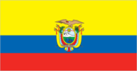
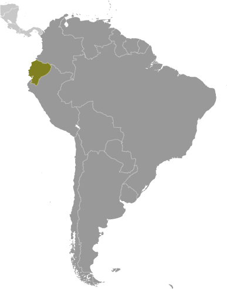
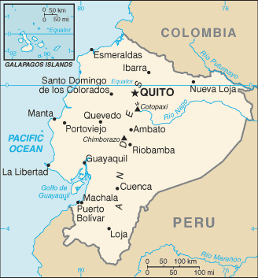

# Ecuador

## Introduction

**_Background:_**   
What is now Ecuador formed part of the northern Inca Empire until the Spanish conquest in 1533. Quito became a seat of Spanish colonial government in 1563 and part of the Viceroyalty of New Granada in 1717. The territories of the Viceroyalty - New Granada (Colombia), Venezuela, and Quito - gained their independence between 1819 and 1822 and formed a federation known as Gran Colombia. When Quito withdrew in 1830, the traditional name was changed in favor of the "Republic of the Equator." Between 1904 and 1942, Ecuador lost territories in a series of conflicts with its neighbors. A border war with Peru that flared in 1995 was resolved in 1999. Although Ecuador marked 30 years of civilian governance in 2004, the period was marred by political instability. Protests in Quito contributed to the mid-term ouster of three of Ecuador's last four democratically elected presidents. In late 2008, voters approved a new constitution, Ecuador's 20th since gaining independence. General elections were held in February 2013, and voters re-elected President Rafael CORREA.

## Geography

**_Location:_**   
Western South America, bordering the Pacific Ocean at the Equator, between Colombia and Peru

**_Geographic coordinates:_**   
2 00 S, 77 30 W

**_Map references:_**   
South America

**_Area:_**   
**total:** 283,561 sq km   
**land:** 276,841 sq km   
**water:** 6,720 sq km   
**note:** includes Galapagos Islands

**_Area - comparative:_**   
slightly smaller than Nevada

**_Land boundaries:_**   
**total:** 2,237 km   
**border countries:** Colombia 708 km, Peru 1,529 km

**_Coastline:_**   
2,237 km

**_Maritime claims:_**   
**territorial sea:** 200 nm   
**continental shelf:** 100 nm from 2,500-m isobath

**_Climate:_**   
tropical along coast, becoming cooler inland at higher elevations; tropical in Amazonian jungle lowlands

**_Terrain:_**   
coastal plain (costa), inter-Andean central highlands (sierra), and flat to rolling eastern jungle (oriente)

**_Elevation extremes:_**   
**lowest point:** Pacific Ocean 0 m   
**highest point:** Chimborazo 6,267 m   
**note:** due to the fact that the earth is not a perfect sphere and has an equatorial bulge, the highest point on the planet furthest from its center is Mount Chimborazo not Mount Everest, which is merely the highest peak above sea-level

**_Natural resources:_**   
petroleum, fish, timber, hydropower

**_Land use:_**   
**arable land:** 4.51%   
**permanent crops:** 5.38%   
**other:** 90.11% (2011)

**_Irrigated land:_**   
8,534 sq km (2003)

**_Total renewable water resources:_**   
424.4 cu km (2011)

**_Freshwater withdrawal (domestic/industrial/agricultural):_**   
**total:** 9.92 cu km/yr (13%/6%/81%)   
**per capita:** 716.1 cu m/yr (2005)

**_Natural hazards:_**   
frequent earthquakes; landslides; volcanic activity; floods; periodic droughts   
**volcanism:** volcanic activity concentrated along the Andes Mountains; Sangay (elev. 5,230 m), which erupted in 2010, is mainland Ecuador's most active volcano; other historically active volcanoes in the Andes include Antisana, Cayambe, Chacana, Cotopaxi, Guagua Pichincha, Reventador, Sumaco, and Tungurahua; Fernandina (elev. 1,476 m), a shield volcano that last erupted in 2009, is the most active of the many Galapagos volcanoes; other historically active Galapagos volcanoes include Wolf, Sierra Negra, Cerro Azul, Pinta, Marchena, and Santiago

**_Environment - current issues:_**   
deforestation; soil erosion; desertification; water pollution; pollution from oil production wastes in ecologically sensitive areas of the Amazon Basin and Galapagos Islands

**_Environment - international agreements:_**   
**party to:** Antarctic-Environmental Protocol, Antarctic Treaty, Biodiversity, Climate Change, Climate Change-Kyoto Protocol, Desertification, Endangered Species, Hazardous Wastes, Ozone Layer Protection, Ship Pollution, Tropical Timber 83, Tropical Timber 94, Wetlands   
**signed, but not ratified:** none of the selected agreements

**_Geography - note:_**   
Cotopaxi in Andes is highest active volcano in world

## People and Society

**_Nationality:_**   
**noun:** Ecuadorian(s)   
**adjective:** Ecuadorian

**_Ethnic groups:_**   
mestizo (mixed Amerindian and white) 71.9%, Montubio 7.4%, Afroecuadorian 7.2%, Amerindian 7%, white 6.1%, other 0.4% (2010 census)

**_Languages:_**   
Spanish (Castillian) 93% (official), Quechua 4.1%, other indigenous 0.7%, foreign 2.2%   
**note:** (Quechua and Shuar are official languages of intercultural relations; other indigenous languages are in official use by indigenous peoples in the areas they inhabit) (2010 est.)

**_Religions:_**   
Roman Catholic 95%, other 5%

**_Demographic profile:_**   
Ecuador's high poverty and income inequality most affect indigenous, mixed race, and rural populations. The government has increased its social spending to ameliorate these problems, but critics question the efficiency and implementation of its national development plan. Nevertheless, the conditional cash transfer program, which requires participants' children to attend school and have medical check-ups, has helped improve educational attainment and healthcare among poor children. Ecuador is stalled at above replacement level fertility and the population most likely will keep growing rather than stabilize.   
An estimated 2 to 3 million Ecuadorians live abroad, but increased unemployment in key receiving countries - Spain, the United States, and Italy - is slowing emigration and increasing the likelihood of returnees to Ecuador. The first large-scale emigration of Ecuadorians occurred between 1980 and 2000, when an economic crisis drove Ecuadorians from southern provinces to New York City, where they had trade contacts. A second, nationwide wave of emigration in the late 1990s was caused by another economic downturn, political instability, and a currency crisis. Spain was the logical destination because of its shared language and the wide availability of low-skilled, informal jobs at a time when increased border surveillance made illegal migration to the US difficult. Ecuador has a small but growing immigrant population and is Latin America's top recipient of refugees; 98% are neighboring Colombians fleeing violence in their country.

**_Population:_**   
15,654,411 (July 2014 est.)

**_Age structure:_**   
**0-14 years:** 28.5% (male 2,275,448/female 2,184,706)   
**15-24 years:** 18.6% (male 1,478,184/female 1,439,288)   
**25-54 years:** 38.9% (male 2,968,757/female 3,124,938)   
**55-64 years:** 7.1% (male 544,097/female 562,326)   
**65 years and over:** 6.7% (male 514,549/female 562,118) (2014 est.)

**_Dependency ratios:_**   
**total dependency ratio:** 56.9 %   
**youth dependency ratio:** 46.5 %   
**elderly dependency ratio:** 10.5 %   
**potential support ratio:** 9.6 (2014 est.)

**_Median age:_**   
**total:** 26.7 years   
**male:** 26 years   
**female:** 27.3 years (2014 est.)

**_Population growth rate:_**   
1.37% (2014 est.)

**_Birth rate:_**   
18.87 births/1,000 population (2014 est.)

**_Death rate:_**   
5.04 deaths/1,000 population (2014 est.)

**_Net migration rate:_**   
-0.13 migrant(s)/1,000 population (2014 est.)

**_Urbanization:_**   
**urban population:** 67.5% of total population (2011)   
**rate of urbanization:** 2.13% annual rate of change (2010-15 est.)

**_Major urban areas - population:_**   
Guayaquil 2.287 million; QUITO (capital) 1.622 million (2011)

**_Sex ratio:_**   
**at birth:** 1.05 male(s)/female   
**0-14 years:** 1.04 male(s)/female   
**15-24 years:** 1.03 male(s)/female   
**25-54 years:** 0.95 male(s)/female   
**55-64 years:** 0.99 male(s)/female   
**65 years and over:** 0.92 male(s)/female   
**total population:** 0.99 male(s)/female (2014 est.)

**_Mother's mean age at first birth:_**   
21.1   
**note:** median age at first birth among women 25-29 (2004 est.)

**_Maternal mortality rate:_**   
110 deaths/100,000 live births (2010)

**_Infant mortality rate:_**   
**total:** 17.93 deaths/1,000 live births   
**male:** 21.11 deaths/1,000 live births   
**female:** 14.58 deaths/1,000 live births (2014 est.)

**_Life expectancy at birth:_**   
**total population:** 76.36 years   
**male:** 73.4 years   
**female:** 79.46 years (2014 est.)

**_Total fertility rate:_**   
2.29 children born/woman (2014 est.)

**_Contraceptive prevalence rate:_**   
72.7% (2004)

**_Health expenditures:_**   
7.3% of GDP (2011)

**_Physicians density:_**   
1.69 physicians/1,000 population (2009)

**_Hospital bed density:_**   
1.6 beds/1,000 population (2010)

**_Drinking water source:_**   
**improved:** urban: 91.6% of population; rural: 75.2% of population; total: 86.4% of population   
**unimproved:** urban: 8.4% of population; rural: 24.8% of population; total: 13.6% of population (2012 est.)

**_Sanitation facility access:_**   
**improved:** urban: 86.5% of population; rural: 75.9% of population; total: 83.1% of population   
**unimproved:** urban: 13.5% of population; rural: 24.1% of population; total: 16.9% of population (2012 est.)

**_HIV/AIDS - adult prevalence rate:_**   
0.6% (2012 est.)

**_HIV/AIDS - people living with HIV/AIDS:_**   
52,300 (2012 est.)

**_HIV/AIDS - deaths:_**   
2,700 (2012 est.)

**_Major infectious diseases:_**   
**degree of risk:** high   
**food or waterborne diseases:** bacterial diarrhea, hepatitis A, and typhoid fever   
**vectorborne diseases:** dengue fever and malaria (2013)

**_Obesity - adult prevalence rate:_**   
21.4% (2008)

**_Children under the age of 5 years underweight:_**   
6.2% (2004)

**_Education expenditures:_**   
4.4% of GDP (2012)

**_Literacy:_**   
**definition:** age 15 and over can read and write   
**total population:** 91.6%   
**male:** 93.1%   
**female:** 90.2% (2011 est.)

**_Child labor - children ages 5-14:_**   
**total number:** 227,599   
**percentage:** 8 % (2008 est.)

**_Unemployment, youth ages 15-24:_**   
**total:** 11.1%   
**male:** 9%   
**female:** 15% (2011)

## Government

**_Country name:_**   
**conventional long form:** Republic of Ecuador   
**conventional short form:** Ecuador   
**local long form:** Republica del Ecuador   
**local short form:** Ecuador

**_Government type:_**   
republic

**_Capital:_**   
**name:** Quito   
**geographic coordinates:** 0 13 S, 78 30 W   
**time difference:** UTC-5 (same time as Washington, DC, during Standard Time)

**_Administrative divisions:_**   
24 provinces (provincias, singular - provincia); Azuay, Bolivar, Canar, Carchi, Chimborazo, Cotopaxi, El Oro, Esmeraldas, Galapagos, Guayas, Imbabura, Loja, Los Rios, Manabi, Morona-Santiago, Napo, Orellana, Pastaza, Pichincha, Santa Elena, Santo Domingo de los Tsachilas, Sucumbios, Tungurahua, Zamora-Chinchipe

**_Independence:_**   
24 May 1822 (from Spain)

**_National holiday:_**   
Independence Day (independence of Quito), 10 August (1809)

**_Constitution:_**   
many previous; latest approved 20 October 2008; amended 2011 (2011)

**_Legal system:_**   
civil law based on the Chilean civil code with modifications; traditional law in indigenous communities

**_International law organization participation:_**   
has not submitted an ICJ jurisdiction declaration; accepts ICCt jurisdiction

**_Suffrage:_**   
18-65 years of age, universal and compulsory; 16-18, over 65, and other eligible voters, voluntary

**_Executive branch:_**   
**chief of state:** President Rafael CORREA Delgado (since 15 January 2007); Vice President Jorge GLAS Espinel (since 24 May 2013); note - the president is both chief of state and head of government   
**head of government:** President Rafael CORREA Delgado (since 15 January 2007); Vice President Jorge GLAS Espinel (since 24 May 2013)   
**cabinet:** Cabinet appointed by the president   
**elections:** the president and vice president elected on the same ticket by popular vote for a four-year term and can be re-elected for another consecutive term; election last held on 17 February 2013 (next to be held in 2017)   
**election results:** President Rafael CORREA Delgado reelected president; percent of vote - Rafael CORREA Delgado 57.2%, Guillermo LASSO 22.7%, Lucio GUTIERREZ 6.8%, Mauricio RODAS 3.9%, other 9.4%

**_Legislative branch:_**   
unicameral National Assembly or Asamblea Nacional (137 seats; members are elected through a party-list proportional representation system to serve four-year terms)   
**elections:** last held on 17 February 2013 (next to be held in 2017)   
**election results:** percent of vote by party - NA; seats by party - PAIS 100, CREO 11, PSC 6, AVANZA 5, MUPP 5, PSP 5, other 5; note - defections by members of National Assembly are commonplace, resulting in frequent changes in the numbers of seats held by the various parties

**_Judicial branch:_**   
**highest court(s):** National Court of Justice or Corte Nacional de Justicia (consists of 21 judges including the chief justice and organized into 5 specialized chambers); Constitutional Court or Corte Constitucional (consists of 9 judges)   
**judge selection and term of office:** justices of National Court of Justice elected by the Judiciary Council, a 9-member independent body of law professionals; judges elected for 9-year, non-renewable terms, with one-third of the membership renewed every 3 years; Constitutional Court judges appointed by the executive, legislative, and Citizen Participation branches of government; judges appointed for 9-year non-renewable terms with one-third of the membership renewed every 3 years   
**subordinate courts:** Fiscal Tribunal; Election Dispute Settlement Courts, provincial courts (one for each province); cantonal courts

**_Political parties and leaders:_**   
Alianza PAIS movement [Rafael Vicente CORREA Delgado]   
Avanza Party or AVANZA [Ramiro GONZALEZ]   
Creating Opportunities Movement or CREO [Guillermo LASSO]   
Institutional Renewal and National Action Party or PRIAN [Alvaro NOBOA]   
Pachakutik Plurinational Unity Movement or MUPP [Rafael ANTUNI]   
Patriotic Society Party or PSP [Lucio GUTIERREZ Borbua]   
Popular Democracy Movement or MPD [Luis VILLACIS]   
Roldosist Party or PRE   
Social Christian Party or PSC [Pascual DEL CIOPPO]   
Socialist Party [Fabian SOLANO]   
Society United for More Action or SUMA [Mauricio RODAS]   
Warrior's Spirit Movement [Jaime NEBOT]

**_Political pressure groups and leaders:_**   
Confederation of Indigenous Nationalities of Ecuador or CONAIE [Humberto CHOLANGO]   
Federation of Indigenous Evangelists of Ecuador or FEINE [Manuel CHUGCHILAN, president]   
National Federation of Indigenous Afro-Ecuatorianos and Peasants or FENOCIN   
National Teacher's Union or UNE [Mariana PALLASCO]

**_International organization participation:_**   
CAN, CD, CELAC, FAO, G-11, G-77, IADB, IAEA, IBRD, ICAO, ICC (national committees), ICRM, IDA, IFAD, IFC, IFRCS, IHO, ILO, IMF, IMO, Interpol, IOC, IOM, IPU, ISO, ITSO, ITU, ITUC (NGOs), LAES, LAIA, Mercosur (associate), MIGA, MINUSTAH, NAM, OAS, OPANAL, OPCW, OPEC, Pacific Alliance (observer), PCA, UN, UNAMID, UNASUR, UNCTAD, UNESCO, UNHCR, UNIDO, Union Latina, UNMIL, UNMISS, UNOCI, UNWTO, UPU, WCO, WFTU (NGOs), WHO, WIPO, WMO, WTO

**_Diplomatic representation in the US:_**   
**chief of mission:** Ambassador Saskia Nathalie CELY Suarez (since 2 December 2011)   
**chancery:** 1050 30th Street, NW, Washington, DC 20007   
**telephone:** [1] (202) 465-8140   
**FAX:** [1] (202) 333-2893   
**consulate(s) general:** Atlanta, Boston, Chicago, Houston, Los Angeles, Miami, New Haven (CT), New Orleans, New York, Newark (NJ), Phoenix, San Francisco, San Juan (Puerto Rico)

**_Diplomatic representation from the US:_**   
**chief of mission:** Ambassador Adam E. NAMM (since 26 April 2012)   
**embassy:** Avenida Avigiras E12-170 y Avenida Eloy Alfaro, Quito   
**mailing address:** Avenida Guayacanes N52-205 y Avenida Avigiras   
**telephone:** [593] (2) 398-5000   
**FAX:** [593] (2) 398-5100   
**consulate(s) general:** Guayaquil

**_Flag description:_**   
three horizontal bands of yellow (top, double width), blue, and red with the coat of arms superimposed at the center of the flag; the flag retains the three main colors of the banner of Gran Columbia, the South American republic that broke up in 1830; the yellow color represents sunshine, grain, and mineral wealth, blue the sky, sea, and rivers, and red the blood of patriots spilled in the struggle for freedom and justice   
**note:** similar to the flag of Colombia, which is shorter and does not bear a coat of arms

**_National symbol(s):_**   
Andean condor

**_National anthem:_**   
**name:** "Salve, Oh Patria!" (We Salute You Our Homeland)   
**lyrics/music:** Juan Leon MERA/Antonio NEUMANE   
**note:** adopted 1948; Juan Leon MERA wrote the lyrics in 1865; only the chorus and second verse are sung

## Economy

**_Economy - overview:_**   
Ecuador is substantially dependent on its petroleum resources, which have accounted for more than half of the country's export earnings and approximately two-fifths of public sector revenues in recent years. In 1999/2000, Ecuador's economy suffered from a banking crisis, with GDP contracting by 5.3% and poverty increasing significantly. In March 2000, the Congress approved a series of structural reforms that also provided for the adoption of the US dollar as legal tender. Dollarization stabilized the economy, and positive growth returned in the years that followed, helped by high oil prices, remittances, and increased non-traditional exports. From 2002-06 the economy grew an average of 4.3% per year, the highest five-year average in 25 years. After moderate growth in 2007, the economy reached a growth rate of 6.4% in 2008, buoyed by high global petroleum prices and increased public sector investment. President Rafael CORREA Delgado, who took office in January 2007, defaulted in December 2008 on Ecuador's sovereign debt, which, with a total face value of approximately US$3.2 billion, represented about 30% of Ecuador's public external debt. In May 2009, Ecuador bought back 91% of its "defaulted" bonds via an international reverse auction. Economic policies under the CORREA administration - for example, an announcement in late 2009 of its intention to terminate 13 bilateral investment treaties, including one with the United States - have generated economic uncertainty and discouraged private investment. China has become Ecuador's largest foreign lender since Quito defaulted in 2008, allowing the government to maintain a high rate of social spending; Ecuador contracted with the Chinese government for more than $9.9 billion in forward oil sales, project financing, and budget support loans as of December 2013. Foreign investment levels in Ecuador continue to be the lowest in the region as a result of an unstable regulatory environment, weak rule of law, and the crowding-out effect of public investments. In 2013, oil output marginally reversed a declining trend and production is expected to increase slightly in 2014, although prices will likely remain lower than in previous years. Faced with a 2013 trade deficit of $1.1 billion, Ecuador erected technical barriers to trade in December 2013, causing tensions with its largest trading partners. Ecuador also decriminalized intellectual property rights violations in February 2014.

**_GDP (purchasing power parity):_**   
$157.6 billion (2013 est.)   
$151.5 billion (2012 est.)   
$144.2 billion (2011 est.)   
**note:** data are in 2013 US dollars

**_GDP (official exchange rate):_**   
$91.41 billion (2013 est.)

**_GDP - real growth rate:_**   
4% (2013 est.)   
5.1% (2012 est.)   
7.8% (2011 est.)

**_GDP - per capita (PPP):_**   
$10,600 (2013 est.)   
$9,600 (2012 est.)   
$9,200 (2011 est.)   
**note:** data are in 2013 US dollars

**_Gross national saving:_**   
26% of GDP (2013 est.)   
21.3% of GDP (2012 est.)   
19.7% of GDP (2011 est.)

**_GDP - composition, by end use:_**   
**household consumption:** 62.4%   
**government consumption:** 13.4%   
**investment in fixed capital:** 26.6%   
**investment in inventories:** 0.3%   
**exports of goods and services:** 29.4%   
**imports of goods and services:** -32.1%; (2013 est.)

**_GDP - composition, by sector of origin:_**   
**agriculture:** 5.9%   
**industry:** 35.1%   
**services:** 59% (2013 est.)

**_Agriculture - products:_**   
bananas, coffee, cocoa, rice, potatoes, cassava (manioc, tapioca), plantains, sugarcane; cattle, sheep, pigs, beef, pork, dairy products; fish, shrimp; balsa wood

**_Industries:_**   
petroleum, food processing, textiles, wood products, chemicals

**_Industrial production growth rate:_**   
3.1%   
**note:** excludes oil refining (2013 est.)

**_Labor force:_**   
6.953 million (2013 est.)

**_Labor force - by occupation:_**   
**agriculture:** 27.8%   
**industry:** 17.8%   
**services:** 54.4% (2012)

**_Unemployment rate:_**   
4.2% (2013 est.)   
4.2% (2011 est.)

**_Population below poverty line:_**   
25.6% (December 2013 est)

**_Household income or consumption by percentage share:_**   
**lowest 10%:** 1.4%   
**highest 10%:** 38.3%   
**note:** data for urban households only (2010 est.)

**_Distribution of family income - Gini index:_**   
48.5 (December 2013)   
50.5 (December 2010)   
**note:** data are for urban households

**_Budget:_**   
**revenues:** $37 billion   
**expenditures:** $39.3 billion (2013 est.)

**_Taxes and other revenues:_**   
40.5% of GDP (2013 est.)

**_Budget surplus (+) or deficit (-):_**   
-2.5% of GDP (2013 est.)

**_Public debt:_**   
23.2% of GDP (2013 est.)   
21% of GDP (2012 est.)

**_Fiscal year:_**   
calendar year

**_Inflation rate (consumer prices):_**   
2.6% (2013 est.)   
4.5% (2011 est.)

**_Central bank discount rate:_**   
8.17% (31 December 2011)   
8.68% (31 December 2010)

**_Commercial bank prime lending rate:_**   
8.7% (31 December 2013 est.)   
8.17% (31 December 2012 est.)

**_Stock of narrow money:_**   
$8.59 billion (31 December 2013 est.)   
$7.801 billion (31 December 2012 est.)

**_Stock of broad money:_**   
$27.75 billion (31 December 2013 est.)   
$24.68 billion (31 December 2012 est.)

**_Stock of domestic credit:_**   
$25.4 billion (31 December 2013 est.)   
$22.5 billion (31 December 2012 est.)

**_Market value of publicly traded shares:_**   
$5.911 billion (31 December 2012 est.)   
$5.779 billion (31 December 2011)   
$5.263 billion (31 December 2010 est.)

**_Current account balance:_**   
-$827.1 million (2013 est.)   
-$177 million (2012 est.)

**_Exports:_**   
$25.48 billion (2013 est.)   
$24.65 billion (2012 est.)

**_Exports - commodities:_**   
petroleum, bananas, cut flowers, shrimp, cacao, coffee, wood, fish

**_Exports - partners:_**   
US 37.3%, Chile 8.1%, Peru 6.5%, Japan 4.5%, Russia 4.5%, Colombia 4% (2012)

**_Imports:_**   
$26.22 billion (2013 est.)   
$24.58 billion (2012 est.)

**_Imports - commodities:_**   
industrial materials, fuels and lubricants, nondurable consumer goods

**_Imports - partners:_**   
US 28.4%, China 11.3%, Colombia 8.8%, Peru 4.5% (2012)

**_Reserves of foreign exchange and gold:_**   
$2.625 billion (.)   
$2.483 billion (31 December 2012 est.)

**_Debt - external:_**   
$19.91 billion (31 December 2013 est.)   
$17.68 billion (31 December 2012 est.)

**_Stock of direct foreign investment - at home:_**   
$17.89 billion (31 December 2013 est.)   
$17.3 billion (31 December 2012 est.)

**_Stock of direct foreign investment - abroad:_**   
$6.33 billion (31 December 2012 est.)   
$6.33 billion (31 December 2011 est.)

**_Exchange rates:_**   
the US dollar became Ecuador's currency in 2001

## Energy

**_Electricity - production:_**   
22.85 billion kWh (2011 est.)

**_Electricity - consumption:_**   
19.38 billion kWh (2010 est.)

**_Electricity - exports:_**   
14.1 million kWh (2010 est.)

**_Electricity - imports:_**   
1.3 billion kWh (2010 est.)

**_Electricity - installed generating capacity:_**   
5.243 million kW (2010 est.)

**_Electricity - from fossil fuels:_**   
55.3% of total installed capacity (2010 est.)

**_Electricity - from nuclear fuels:_**   
0% of total installed capacity (2010 est.)

**_Electricity - from hydroelectric plants:_**   
42.8% of total installed capacity (2010 est.)

**_Electricity - from other renewable sources:_**   
2% of total installed capacity (2010 est.)

**_Crude oil - production:_**   
526,000 bbl/day (2013 est.)

**_Crude oil - exports:_**   
413,000 bbl/day (2013 est.)

**_Crude oil - imports:_**   
154,000 bbl/day (2012 est.)

**_Crude oil - proved reserves:_**   
8.24 billion bbl (1 January 2013 est.)

**_Refined petroleum products - production:_**   
207,300 bbl/day (2013 est.)

**_Refined petroleum products - consumption:_**   
280,000 bbl/day (2012 est.)

**_Refined petroleum products - exports:_**   
28,000 bbl/day (2013 est.)

**_Refined petroleum products - imports:_**   
135,500 bbl/day (2012 est.)

**_Natural gas - production:_**   
240 million cu m (2011 est.)

**_Natural gas - consumption:_**   
330 million cu m (2010 est.)

**_Natural gas - exports:_**   
0 cu m (2011 est.)

**_Natural gas - imports:_**   
25,000 cu m (2012 est.)

**_Natural gas - proved reserves:_**   
6.994 billion cu m (1 January 2013 est.)

**_Carbon dioxide emissions from consumption of energy:_**   
29.13 million Mt (2011 est.)

## Communications

**_Telephones - main lines in use:_**   
2.31 million (2012)

**_Telephones - mobile cellular:_**   
16.457 million (2012)

**_Telephone system:_**   
**general assessment:** elementary fixed-line service, but increasingly sophisticated mobile-cellular network   
**domestic:** fixed-line services provided by multiple telecommunications operators; fixed-line teledensity stands at about 15 per 100 persons; mobile-cellular use has surged and subscribership has reached 100 per 100 persons   
**international:** country code - 593; landing points for the PAN-AM and South America-1 submarine cables that provide links to the west coast of South America, Panama, Colombia, Venezuela, and extending onward to Aruba and the US Virgin Islands in the Caribbean; satellite earth station - 1 Intelsat (Atlantic Ocean) (2011)

**_Broadcast media:_**   
Ecuador has multiple TV networks and many local channels, as well as more than 300 radio stations; many TV and radio stations are privately owned; the government owns or controls 5 national TV stations and multiple radio stations; broadcast media required by law to give the government free air time to broadcast programs produced by the state (2007)

**_Internet country code:_**   
.ec

**_Internet hosts:_**   
170,538 (2012)

**_Internet users:_**   
3.352 million (2009)

## Transportation

**_Airports:_**   
432 (2013)

**_Airports - with paved runways:_**   
**total:** 104   
**over 3,047 m:** 4   
**2,438 to 3,047 m:** 5   
**1,524 to 2,437 m:** 18   
**914 to 1,523 m:** 26   
**under 914 m:** 51 (2013)

**_Airports - with unpaved runways:_**   
**total:** 328   
**914 to 1,523 m:** 37   
**under 914 m:** 291 (2013)

**_Heliports:_**   
2 (2013)

**_Pipelines:_**   
extra heavy crude 527 km; gas 71 km; oil 2,131 km; refined products 1,526 km (2013)

**_Railways:_**   
**total:** 965 km   
**narrow gauge:** 965 km 1.067-m gauge (2008)

**_Roadways:_**   
**total:** 43,670 km   
**paved:** 6,472 km   
**unpaved:** 37,198 km (2007)

**_Waterways:_**   
1,500 km (most inaccessible) (2012)

**_Merchant marine:_**   
**total:** 44   
**by type:** cargo 1, chemical tanker 4, liquefied gas 1, passenger 9, petroleum tanker 28, refrigerated cargo 1   
**registered in other countries:** 4 (Panama 3, Peru 1) (2010)

**_Ports and terminals:_**   
**major seaport(s):** Esmeraldas, Manta, Puerto Bolivar   
**river port(s):** Guayaquil (Guayas)   
**container port(s) (TEUs):** Guayaquil (1,405,762)

## Military

**_Military branches:_**   
Ecuadorian Armed Forces: Ecuadorian Land Force (Fuerza Terrestre Ecuatoriana, FTE), Ecuadorian Navy (Fuerza Naval del Ecuador (FNE), includes Naval Infantry, Naval Aviation, Coast Guard), Ecuadorian Air Force (Fuerza Aerea Ecuatoriana, FAE) (2012)

**_Military service age and obligation:_**   
18 years of age for selective conscript military service; conscription has been suspended; 18 years of age for voluntary military service; Air Force 18-22 years of age, Ecadorian birth requirement; 1-year service obligation (2012)

**_Manpower available for military service:_**   
**males age 16-49:** 3,728,906   
**females age 16-49:** 3,844,918 (2010 est.)

**_Manpower fit for military service:_**   
**males age 16-49:** 2,834,213   
**females age 16-49:** 3,269,535 (2010 est.)

**_Manpower reaching militarily significant age annually:_**   
**male:** 152,593   
**female:** 147,143 (2010 est.)

**_Military expenditures:_**   
2.83% of GDP (2012)   
3.2% of GDP (2011)   
2.83% of GDP (2010)

## Transnational Issues

**_Disputes - international:_**   
organized illegal narcotics operations in Colombia penetrate across Ecuador's shared border, which thousands of Colombians also cross to escape the violence in their home country

**_Refugees and internally displaced persons:_**   
**refugees (country of origin):** 122,276 (Colombia) (2013)

**_Illicit drugs:_**   
significant transit country for cocaine originating in Colombia and Peru, with much of the US-bound cocaine passing through Ecuadorian Pacific waters; importer of precursor chemicals used in production of illicit narcotics; attractive location for cash-placement by drug traffickers laundering money because of dollarization and weak anti-money-laundering regime; increased activity on the northern frontier by trafficking groups and Colombian insurgents (2008)

............................................................   
_Page last updated on June 22, 2014_
