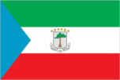
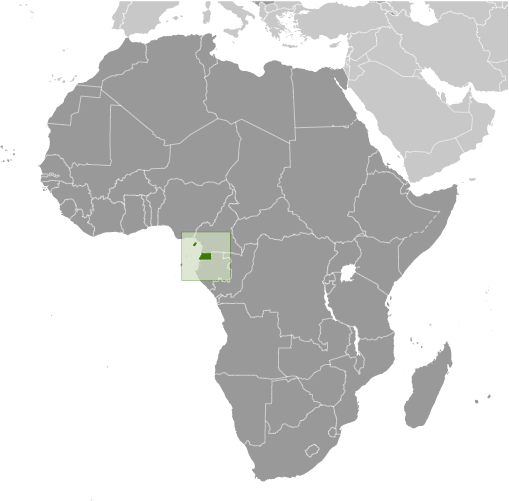
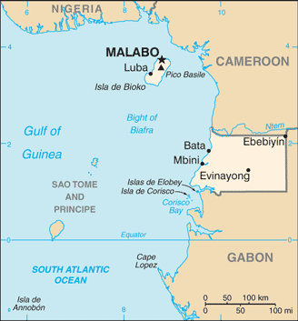

# Equatorial Guinea

## Introduction

**_Background:_**   
Equatorial Guinea gained independence in 1968 after 190 years of Spanish rule. This tiny country, composed of a mainland portion plus five inhabited islands, is one of the smallest on the African continent. President Teodoro Obiang NGUEMA MBASOGO has ruled the country since 1979 when he seized power in a coup. Although nominally a constitutional democracy since 1991, the 1996, 2002, and 2009 presidential elections - as well as the 1999, 2004, 2008, and 2013 legislative elections - were widely seen as flawed. The president exerts almost total control over the political system and has discouraged political opposition. Equatorial Guinea has experienced rapid economic growth due to the discovery of large offshore oil reserves, and in the last decade has become Sub-Saharan Africa's third largest oil exporter. Despite the country's economic windfall from oil production, resulting in a massive increase in government revenue in recent years, improvements in the population's living standards have been slow to develop.

## Geography

**_Location:_**   
Central Africa, bordering the Bight of Biafra, between Cameroon and Gabon

**_Geographic coordinates:_**   
2 00 N, 10 00 E

**_Map references:_**   
Africa

**_Area:_**   
**total:** 28,051 sq km   
**land:** 28,051 sq km   
**water:** 0 sq km

**_Area - comparative:_**   
slightly smaller than Maryland

**_Land boundaries:_**   
**total:** 528 km   
**border countries:** Cameroon 183 km, Gabon 345 km

**_Coastline:_**   
296 km

**_Maritime claims:_**   
**territorial sea:** 12 nm   
**exclusive economic zone:** 200 nm

**_Climate:_**   
tropical; always hot, humid

**_Terrain:_**   
coastal plains rise to interior hills; islands are volcanic

**_Elevation extremes:_**   
**lowest point:** Atlantic Ocean 0 m   
**highest point:** Pico Basile 3,008 m

**_Natural resources:_**   
petroleum, natural gas, timber, gold, bauxite, diamonds, tantalum, sand and gravel, clay

**_Land use:_**   
**arable land:** 4.63%   
**permanent crops:** 2.5%   
**other:** 92.87% (2011)

**_Irrigated land:_**   
NA

**_Total renewable water resources:_**   
26 cu km (2011)

**_Freshwater withdrawal (domestic/industrial/agricultural):_**   
**total:** 0.02 cu km/yr (80%/15%/5%)   
**per capita:** 31.41 cu m/yr (2005)

**_Natural hazards:_**   
violent windstorms; flash floods   
**volcanism:** Santa Isabel (elev. 3,007 m), which last erupted in 1923, is the country's only historically active volcano; Santa Isabel, along with two dormant volcanoes, form Bioko Island in the Gulf of Guinea

**_Environment - current issues:_**   
tap water is not potable; deforestation

**_Environment - international agreements:_**   
**party to:** Biodiversity, Climate Change, Climate Change-Kyoto Protocol, Desertification, Endangered Species, Hazardous Wastes, Law of the Sea, Marine Dumping, Ozone Layer Protection, Ship Pollution, Wetlands   
**signed, but not ratified:** none of the selected agreements

**_Geography - note:_**   
insular and continental regions widely separated

## People and Society

**_Nationality:_**   
**noun:** Equatorial Guinean(s) or Equatoguinean(s)   
**adjective:** Equatorial Guinean or Equatoguinean

**_Ethnic groups:_**   
Fang 85.7%, Bubi 6.5%, Mdowe 3.6%, Annobon 1.6%, Bujeba 1.1%, other 1.4% (1994 census)

**_Languages:_**   
Spanish (official) 67.6%, other (includes French (official), Fang, Bubi) 32.4% (1994 census)

**_Religions:_**   
nominally Christian and predominantly Roman Catholic, pagan practices

**_Population:_**   
722,254 (July 2014 est.)

**_Age structure:_**   
**0-14 years:** 40.8% (male 149,597/female 144,788)   
**15-24 years:** 19.5% (male 71,609/female 69,061)   
**25-54 years:** 31.5% (male 112,956/female 114,785)   
**55-64 years:** 4.2% (male 13,052/female 17,247)   
**65 years and over:** 4.1% (male 12,310/female 16,849) (2014 est.)

**_Dependency ratios:_**   
**total dependency ratio:** 70.8 %   
**youth dependency ratio:** 66.1 %   
**elderly dependency ratio:** 4.7 %   
**potential support ratio:** 21.1 (2014 est.)

**_Median age:_**   
**total:** 19.4 years   
**male:** 18.8 years   
**female:** 19.9 years (2014 est.)

**_Population growth rate:_**   
2.54% (2014 est.)

**_Birth rate:_**   
33.83 births/1,000 population (2014 est.)

**_Death rate:_**   
8.39 deaths/1,000 population (2014 est.)

**_Net migration rate:_**   
0 migrant(s)/1,000 population (2014 est.)

**_Urbanization:_**   
**urban population:** 39.5% of total population (2011)   
**rate of urbanization:** 3.16% annual rate of change (2010-15 est.)

**_Major urban areas - population:_**   
MALABO (capital) 137,000 (2011)

**_Sex ratio:_**   
**at birth:** 1.03 male(s)/female   
**0-14 years:** 1.03 male(s)/female   
**15-24 years:** 1.04 male(s)/female   
**25-54 years:** 0.98 male(s)/female   
**55-64 years:** 0.99 male(s)/female   
**65 years and over:** 0.75 male(s)/female   
**total population:** 0.99 male(s)/female (2014 est.)

**_Maternal mortality rate:_**   
240 deaths/100,000 live births (2010)

**_Infant mortality rate:_**   
**total:** 71.12 deaths/1,000 live births   
**male:** 72.17 deaths/1,000 live births   
**female:** 70.04 deaths/1,000 live births (2014 est.)

**_Life expectancy at birth:_**   
**total population:** 63.49 years   
**male:** 62.43 years   
**female:** 64.58 years (2014 est.)

**_Total fertility rate:_**   
4.66 children born/woman (2014 est.)

**_Contraceptive prevalence rate:_**   
10.1% (2000)

**_Health expenditures:_**   
4% of GDP (2011)

**_Physicians density:_**   
0.3 physicians/1,000 population (2004)

**_Hospital bed density:_**   
2.1 beds/1,000 population (2010)

**_Drinking water source:_**   
**improved:** urban: 65.5% of population; rural: 41.6% of population; total: 50.9% of population   
**unimproved:** urban: 34.5% of population; rural: 58.4% of population; total: 49.1% of population (2006 est.)

**_Sanitation facility access:_**   
**improved:** urban: 92.2% of population; rural: 86.8% of population; total: 88.9% of population   
**unimproved:** urban: 7.8% of population; rural: 13.2% of population; total: 11.1% of population (2006 est.)

**_HIV/AIDS - adult prevalence rate:_**   
6.2% (2012 est.)

**_HIV/AIDS - people living with HIV/AIDS:_**   
31,400 (2012 est.)

**_HIV/AIDS - deaths:_**   
1,400 (2012 est.)

**_Major infectious diseases:_**   
**degree of risk:** very high   
**food or waterborne diseases:** bacterial and protozoal diarrhea, hepatitis A, and typhoid fever   
**vectorborne disease:** malaria and dengue fever   
**animal contact disease:** rabies (2013)

**_Obesity - adult prevalence rate:_**   
10.6% (2008)

**_Children under the age of 5 years underweight:_**   
10.6% (2004)

**_Education expenditures:_**   
0.6% of GDP (2002)

**_Literacy:_**   
**definition:** age 15 and over can read and write   
**total population:** 94.2%   
**male:** 97.1%   
**female:** 91.1% (2011 est.)

**_School life expectancy (primary to tertiary education):_**   
**total:** 9 years   
**male:** 10 years   
**female:** 7 years (2000)

**_Child labor - children ages 5-14:_**   
**total number:** 35,382   
**percentage:** 28 % (2000 est.)

## Government

**_Country name:_**   
**conventional long form:** Republic of Equatorial Guinea   
**conventional short form:** Equatorial Guinea   
**local long form:** Republica de Guinea Ecuatorial/Republique de Guinee equatoriale   
**local short form:** Guinea Ecuatorial/Guinee equatoriale   
**former:** Spanish Guinea

**_Government type:_**   
republic

**_Capital:_**   
**name:** Malabo   
**geographic coordinates:** 3 45 N, 8 47 E   
**time difference:** UTC+1 (6 hours ahead of Washington, DC, during Standard Time)

**_Administrative divisions:_**   
7 provinces (provincias, singular - provincia); Annobon, Bioko Norte, Bioko Sur, Centro Sur, Kie-Ntem, Litoral, Wele-Nzas

**_Independence:_**   
12 October 1968 (from Spain)

**_National holiday:_**   
Independence Day, 12 October (1968)

**_Constitution:_**   
approved by referendum 17 November 1991; amended several times, last in 2012 (2012)

**_Legal system:_**   
mixed system of civil and customary law

**_International law organization participation:_**   
has not submitted an ICJ jurisdiction declaration; non-party state to the ICCt

**_Suffrage:_**   
18 years of age; universal

**_Executive branch:_**   
**chief of state:** President Brig. Gen. (Ret.) Teodoro Obiang NGUEMA MGASOGO (since 3 August 1979 when he seized power in a military coup)   
**head of government:** Prime Minister Vicente Ehate TOMI (since 22 May 2012)   
**cabinet:** Council of Ministers appointed by the president   
**elections:** president elected by popular vote for a seven-year term (two- term limit); election last held on 29 November 2009 (next to be held in 2016); prime minister and deputy prime ministers appointed by the president   
**election results:** Teodoro Obiang NGUEMA MBASOGO reelected president; percent of vote - Teodoro Obiang NGUEMA MBASOGO 95.8%, Placido MICO Abogo 3.6%, other 0.6%

**_Legislative branch:_**   
bicameral Parliament consists of the Senate (70 seats; 55 seats directly elected and 15 appointed by the president) and the House of People's Representatives or Camara de los Diputdos or Chamber of Deputies (100 seats; members directly elected by popular vote to serve five-year terms)   
**elections:** last held on 26 May 2013 (next to be held in 2018)   
**election results:** Senate - percent of vote by party - NA; seats by party - PDGE 54, CPDS 1; Chamber of Deputies - percent of vote by party - NA; seats by party - PDGE 99, CPDS 1   
**note:** note - Parliament has little power since the constitution vests all executive authority in the president; the constitutional referendum of 2011 established a bicameral legislature formed following the May 2013 elections; the newly formed Senate consists of elected and appointed (by the President) members

**_Judicial branch:_**   
**highest court(s):** Supreme Court of Justice (consists of the chief justice and NA judges); Constitutional Court (consists of the court president and 4 members)   
**judge selection and term of office:** Supreme Court judges appointed by the president for 5-year terms; Constitutional Court members appointed by the president, two of which are nominated by the Chamber of Deputies   
**subordinate courts:** Court of Guarantees; military courts; Courts of Appeal; first instance tribunals; district and county tribunals

**_Political parties and leaders:_**   
Convergence Party for Social Democracy or CPDS [Andres Esono ONDO]   
Democratic Party for Equatorial Guinea or PDGE [Jeronimo Osa Osa ECORO] (ruling party)   
Electoral Coalition or EC   
Party for Progress of Equatorial Guinea or PPGE [Severo MOTO]   
Popular Action of Equatorial Guinea or APGE [Carmelo Mba BACALE]   
Popular Union or UP [Daniel MARTINEZ Ayecaba]

**_Political pressure groups and leaders:_**   
ASODEGUE (Madrid-based pressure group for democratic reform)   
EG Justice (US-based anti-corruption group)

**_International organization participation:_**   
ACP, AfDB, AU, BDEAC, CEMAC, CPLP (associate), FAO, FZ, G-77, IBRD, ICAO, ICRM, IDA, IFAD, IFC, IFRCS, ILO, IMF, IMO, Interpol, IOC, IPU, ITSO, ITU, MIGA, NAM, OAS (observer), OIF, OPCW, UN, UNCTAD, UNESCO, UNIDO, UNWTO, UPU, WHO, WIPO, WTO (observer)

**_Diplomatic representation in the US:_**   
**chief of mission:** Ambassador Ruben Maye Nsue MANGUE (since 10 September 2013)   
**chancery:** 2020 16th Street NW, Washington, DC 20009   
**telephone:** [1] (202) 518-5700   
**FAX:** [1] (202) 518-5252   
**consul general(s):** Houston

**_Diplomatic representation from the US:_**   
**chief of mission:** Ambassador Mark L. ASQUINO (since 29 June 2012)   
**embassy:** Carretera Malabo II, Malabo, Guinea Ecuatorial   
**mailing address:** US Embassy Malabo, US Department of State, Washington, DC 20521-2520   
**telephone:** [240] 333 09 57 41

**_Flag description:_**   
three equal horizontal bands of green (top), white, and red, with a blue isosceles triangle based on the hoist side and the coat of arms centered in the white band; the coat of arms has six yellow six-pointed stars (representing the mainland and five offshore islands) above a gray shield bearing a silk-cotton tree and below which is a scroll with the motto UNIDAD, PAZ, JUSTICIA (Unity, Peace, Justice); green symbolizes the jungle and natural resources, blue represents the sea that connects the mainland to the islands, white stands for peace, and red recalls the fight for independence

**_National symbol(s):_**   
silk cotton tree

**_National anthem:_**   
**name:** "Caminemos pisando la senda" (Let Us Tread the Path)   
**lyrics/music:** Atanasio Ndongo MIYONO/Atanasio Ndongo MIYONO or Ramiro Sanchez LOPEZ (disputed)   
**note:** adopted 1968

## Economy

**_Economy - overview:_**   
The discovery and exploitation of large oil and gas reserves have contributed to dramatic economic growth, but fluctuating oil prices along with slowing or declining oil production have resulted in much lower GDP growth in recent years. The economy is still dominated by hydrocarbon production. The government has solicited foreign investment, particularly from the United States, to diversify the economy and in February 2014 the government hosted an economic diversification symposium focused on attracting investment in five sectors: agriculture and animal ranching, fishing, mining and petrochemicals, tourism, and financial services. Undeveloped mineral resources include gold, zinc, diamonds, columbite-tantalite, and other base metals. Forestry and farming are also minor components of GDP. Subsistence farming is the dominant form of livelihood. Although pre-independence Equatorial Guinea counted on cocoa production for hard currency earnings, the neglect of the rural economy under successive regimes has diminished potential for agriculture-led growth. The government has stated its intention to reinvest some oil revenue into agriculture. A number of aid programs sponsored by the World Bank and the IMF have been cut off since 1993 because of corruption and mismanagement. The government has been widely criticized for its lack of transparency and misuse of oil revenues and has attempted to address this issue by working towards compliance with the Extractive Industries Transparency Initiative.

**_GDP (purchasing power parity):_**   
$19.68 billion (2013 est.)   
$19.97 billion (2012 est.)   
$18.96 billion (2011 est.)   
**note:** data are in 2013 US dollars

**_GDP (official exchange rate):_**   
$17.08 billion (2013 est.)

**_GDP - real growth rate:_**   
-1.5% (2013 est.)   
5.3% (2012 est.)   
4.6% (2011 est.)

**_GDP - per capita (PPP):_**   
$25,700 (2013 est.)   
$26,900 (2012 est.)   
$26,200 (2011 est.)

**_Gross national saving:_**   
22.6% of GDP (2013 est.)   
26.4% of GDP (2012 est.)   
32% of GDP (2011 est.)

**_GDP - composition, by end use:_**   
**household consumption:** 26.7%   
**government consumption:** 3.7%   
**investment in fixed capital:** 37.9%   
**investment in inventories:** 1%   
**exports of goods and services:** 80.8%   
**imports of goods and services:** -50.1%; (2013 est.)

**_GDP - composition, by sector of origin:_**   
**agriculture:** 4.6%   
**industry:** 87.3%   
**services:** 8.1% (2013 est.)

**_Agriculture - products:_**   
coffee, cocoa, rice, yams, cassava (manioc, tapioca), bananas, palm oil nuts; livestock; timber

**_Industries:_**   
petroleum, natural gas, sawmilling

**_Industrial production growth rate:_**   
3.2% (2013 est.)

**_Labor force:_**   
195,200 (2007)

**_Unemployment rate:_**   
22.3% (2009 est.)

**_Population below poverty line:_**   
NA%

**_Household income or consumption by percentage share:_**   
**lowest 10%:** NA%   
**highest 10%:** NA%

**_Budget:_**   
**revenues:** $6.837 billion   
**expenditures:** $6.795 billion (2013 est.)

**_Taxes and other revenues:_**   
40% of GDP (2013 est.)

**_Budget surplus (+) or deficit (-):_**   
0.2% of GDP (2013 est.)

**_Public debt:_**   
11% of GDP (2013 est.)   
9.3% of GDP (2012 est.)

**_Fiscal year:_**   
calendar year

**_Inflation rate (consumer prices):_**   
6% (2013 est.)   
6.1% (2012 est.)

**_Central bank discount rate:_**   
8.5% (31 December 2010 est.)   
4.25% (31 December 2009 est.)

**_Commercial bank prime lending rate:_**   
15% (31 December 2013 est.)   
15% (31 December 2012 est.)

**_Stock of narrow money:_**   
$3.001 billion (31 December 2013 est.)   
$3.023 billion (31 December 2012 est.)

**_Stock of broad money:_**   
$3.382 billion (31 December 2013 est.)   
$3.438 billion (31 December 2012 est.)

**_Stock of domestic credit:_**   
$-424.6 million (31 December 2013 est.)   
$-631.4 million (31 December 2012 est.)

**_Current account balance:_**   
-$2.916 billion (2013 est.)   
-$2.945 billion (2012 est.)

**_Exports:_**   
$15.44 billion (2013 est.)   
$14.86 billion (2012 est.)

**_Exports - commodities:_**   
petroleum products, timber

**_Exports - partners:_**   
Japan 18.8%, France 16.1%, China 11.7%, US 11.3%, Netherlands 7.2%, Spain 7.1%, Italy 5.1% (2012)

**_Imports:_**   
$7.943 billion (2013 est.)   
$8.045 billion (2012 est.)

**_Imports - commodities:_**   
petroleum sector equipment, other equipment, construction materials, vehicles

**_Imports - partners:_**   
Spain 18.4%, China 17.4%, US 11.1%, France 8%, Italy 5.9%, Cote dIvoire 5.3%, Brazil 4.4% (2012)

**_Reserves of foreign exchange and gold:_**   
$4.027 billion (31 December 2013 est.)   
$4.397 billion (31 December 2012 est.)

**_Debt - external:_**   
$2.104 billion (31 December 2013 est.)   
$1.858 billion (31 December 2012 est.)

**_Exchange rates:_**   
Cooperation Financiere en Afrique Centrale francs (XAF) per US dollar -   
500.7 (2013 est.)   
510.53 (2012 est.)   
495.28 (2010 est.)   
472.19 (2009)   
447.81 (2008)

## Energy

**_Electricity - production:_**   
97 million kWh (2010 est.)

**_Electricity - consumption:_**   
90.21 million kWh (2010 est.)

**_Electricity - exports:_**   
0 kWh (2012 est.)

**_Electricity - imports:_**   
0 kWh (2012 est.)

**_Electricity - installed generating capacity:_**   
38,000 kW (2010 est.)

**_Electricity - from fossil fuels:_**   
97.4% of total installed capacity (2010 est.)

**_Electricity - from nuclear fuels:_**   
0% of total installed capacity (2010 est.)

**_Electricity - from hydroelectric plants:_**   
2.6% of total installed capacity (2010 est.)

**_Electricity - from other renewable sources:_**   
0% of total installed capacity (2010 est.)

**_Crude oil - production:_**   
318,000 bbl/day (2012 est.)

**_Crude oil - exports:_**   
319,100 bbl/day (2010 est.)

**_Crude oil - imports:_**   
0 bbl/day (2010 est.)

**_Crude oil - proved reserves:_**   
1.1 billion bbl (1 January 2013 est.)

**_Refined petroleum products - production:_**   
3,074 bbl/day (2010 est.)

**_Refined petroleum products - consumption:_**   
1,588 bbl/day (2011 est.)

**_Refined petroleum products - exports:_**   
2,320 bbl/day (2010 est.)

**_Refined petroleum products - imports:_**   
4,561 bbl/day (2010 est.)

**_Natural gas - production:_**   
6.88 billion cu m (2011 est.)

**_Natural gas - consumption:_**   
1.58 billion cu m (2010 est.)

**_Natural gas - exports:_**   
5.26 billion cu m (2011 est.)

**_Natural gas - imports:_**   
0 cu m (2011 est.)

**_Natural gas - proved reserves:_**   
36.81 billion cu m (1 January 2013 est.)

**_Carbon dioxide emissions from consumption of energy:_**   
5.232 million Mt (2011 est.)

## Communications

**_Telephones - main lines in use:_**   
14,900 (2012)

**_Telephones - mobile cellular:_**   
501,000 (2012)

**_Telephone system:_**   
**general assessment:** digital fixed-line network in most major urban areas and good mobile coverage   
**domestic:** fixed-line density is about 2 per 100 persons; mobile-cellular subscribership has been increasing and in 2011 stood at about 60 percent of the population   
**international:** country code - 240; international communications from Bata and Malabo to African and European countries; satellite earth station - 1 Intelsat (Indian Ocean) (2011)

**_Broadcast media:_**   
state maintains control of broadcast media with domestic broadcast media limited to 1 state-owned TV station, 1 private TV station owned by the president's eldest son, 1 state-owned radio station, and 1 private radio station owned by the president's eldest son; satellite TV service is available; transmissions of multiple international broadcasters are accessible (2013)

**_Internet country code:_**   
.gq

**_Internet hosts:_**   
7 (2012)

**_Internet users:_**   
14,400 (2009)

## Transportation

**_Airports:_**   
7 (2013)

**_Airports - with paved runways:_**   
**total:** 6   
**over 3,047 m:** 1   
**2,438 to 3,047 m:** 2   
**1,524 to 2,437 m:** 1   
**under 914 m:** 2 (2013)

**_Airports - with unpaved runways:_**   
**total:** 1   
**2,438 to 3,047 m:** 1 (2013)

**_Pipelines:_**   
condensate 42 km; condensate/gas 5 km; gas 79 km; oil 71 km (2013)

**_Roadways:_**   
**total:** 2,880 km (2000)

**_Merchant marine:_**   
**total:** 5   
**by type:** cargo 1, chemical tanker 1, petroleum tanker 3   
**foreign-owned:** 1 (Norway 1) (2010)

**_Ports and terminals:_**   
**major seaport(s):** Bata, Luba, Malabo

## Military

**_Military branches:_**   
Equatorial Guinea Armed Forces (FAGE): Equatorial Guinea National Guard (Guardia Nacional de Guinea Ecuatorial, GNGE (Army); Navy; Air Force (2013)

**_Military service age and obligation:_**   
18 years of age for selective compulsory military service, although conscription is rare in practice; 2-year service obligation; women hold only administrative positions in the Navy (2013)

**_Manpower available for military service:_**   
**males age 16-49:** 151,147   
**females age 16-49:** 150,345 (2010 est.)

**_Manpower fit for military service:_**   
**males age 16-49:** 113,277   
**females age 16-49:** 115,320 (2010 est.)

**_Manpower reaching militarily significant age annually:_**   
**male:** 7,398   
**female:** 7,126 (2010 est.)

## Transnational Issues

**_Disputes - international:_**   
in 2002, ICJ ruled on an equidistance settlement of Cameroon-Equatorial Guinea-Nigeria maritime boundary in the Gulf of Guinea, but a dispute between Equatorial Guinea and Cameroon over an island at the mouth of the Ntem River and imprecisely defined maritime coordinates in the ICJ decision delayed final delimitation; UN urged Equatorial Guinea and Gabon to resolve the sovereignty dispute over Gabon-occupied Mbane and lesser islands and to create a maritime boundary in the hydrocarbon-rich Corisco Bay

**_Trafficking in persons:_**   
**current situation:** Equatorial Guinea is a source and destination country for women and children subjected to forced labor and sexual exploitation; children have been trafficked from nearby countries for work as domestic servants, market laborers, ambulant vendors, and launderers; women may also be trafficked to Equatorial Guinea from Cameroon, Benin, other neighboring countries, and China for forced labor or prostitution; Equatorial Guinean girls may be encouraged by their parents to engage in the sex trade in urban centers to receive groceries, gifts, housing, and money

............................................................   
_Page last updated on June 22, 2014_
