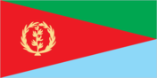
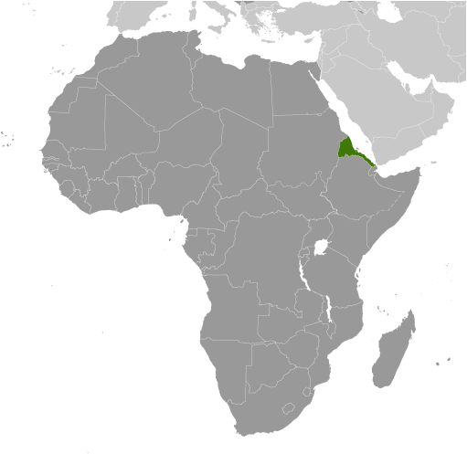
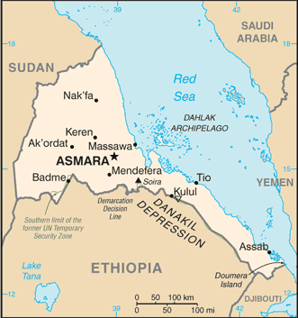

# Eritrea

## Introduction

**_Background:_**   
After independence from Italian colonial control in 1941 and 10 years of British administrative control, the UN established Eritrea as an autonomous region within the Ethiopian federation in 1952. Ethiopia's full annexation of Eritrea as a province 10 years later sparked a violent 30-year struggle for independence that ended in 1991 with Eritrean rebels defeating government forces. Eritreans overwhelmingly approved independence in a 1993 referendum. ISAIAS Afworki has been Eritrea's only president since independence; his rule, particularly since 2001, has been highly autocratic and repressive. His government has created a highly militarized society by pursuing an unpopular program of mandatory conscription into national service, sometimes of indefinite length. A two-and-a-half-year border war with Ethiopia that erupted in 1998 ended under UN auspices in December 2000. A UN peacekeeping operation was established that monitored a 25 km-wide Temporary Security Zone. The Eritrea-Ethiopia Boundary Commission (EEBC) created in April 2003 was tasked "to delimit and demarcate the colonial treaty border based on pertinent colonial treaties (1900, 1902, and 1908) and applicable international law." The EEBC on 30 November 2007 remotely demarcated the border, assigning the town of Badme to Eritrea, despite Ethiopia's maintaining forces there from the time of the 1998-2000 war. Eritrea insisted that the UN terminate its peacekeeping mission on 31 July 2008. Eritrea has accepted the EEBC's "virtual demarcation" decision and repeatedly called on Ethiopia to remove its troops. Ethiopia has not accepted the demarcation decision, and neither party has entered into meaningful dialogue to resolve the impasse. Eritrea is subject to several UN Security Council Resolutions (from 2009, 2011, and 2012) imposing various military and economic sanctions, in view of evidence that it has supported armed opposition groups in the region.

## Geography

**_Location:_**   
Eastern Africa, bordering the Red Sea, between Djibouti and Sudan

**_Geographic coordinates:_**   
15 00 N, 39 00 E

**_Map references:_**   
Africa

**_Area:_**   
**total:** 117,600 sq km   
**land:** 101,000 sq km   
**water:** 16,600 sq km

**_Area - comparative:_**   
slightly larger than Pennsylvania

**_Land boundaries:_**   
**total:** 1,840 km   
**border countries:** Djibouti 125 km, Ethiopia 1,033 km, Sudan 682 km

**_Coastline:_**   
2,234 km (mainland on Red Sea 1,151 km, islands in Red Sea 1,083 km)

**_Maritime claims:_**   
**territorial sea:** 12 nm

**_Climate:_**   
hot, dry desert strip along Red Sea coast; cooler and wetter in the central highlands (up to 61 cm of rainfall annually, heaviest June to September); semiarid in western hills and lowlands

**_Terrain:_**   
dominated by extension of Ethiopian north-south trending highlands, descending on the east to a coastal desert plain, on the northwest to hilly terrain and on the southwest to flat-to-rolling plains

**_Elevation extremes:_**   
**lowest point:** near Kulul within the Danakil Depression -75 m   
**highest point:** Soira 3,018 m

**_Natural resources:_**   
gold, potash, zinc, copper, salt, possibly oil and natural gas, fish

**_Land use:_**   
**arable land:** 5.87%   
**permanent crops:** 0.02%   
**other:** 94.12% (2011)

**_Irrigated land:_**   
215.9 sq km (2003)

**_Total renewable water resources:_**   
6.3 cu km (2011)

**_Freshwater withdrawal (domestic/industrial/agricultural):_**   
**total:** 0.58 cu km/yr (5%/0%/95%)   
**per capita:** 121.3 cu m/yr (2004)

**_Natural hazards:_**   
frequent droughts, rare earthquakes and volcanoes; locust swarms   
**volcanism:** Dubbi (elev. 1,625 m), which last erupted in 1861, was the country's only historically active volcano until Nabro (2,218 m) came to life on 12 June 2011

**_Environment - current issues:_**   
deforestation; desertification; soil erosion; overgrazing; loss of infrastructure from civil warfare

**_Environment - international agreements:_**   
**party to:** Biodiversity, Climate Change, Climate Change-Kyoto Protocol, Desertification, Endangered Species, Hazardous Wastes, Ozone Layer Protection   
**signed, but not ratified:** none of the selected agreements

**_Geography - note:_**   
strategic geopolitical position along world's busiest shipping lanes; Eritrea retained the entire coastline of Ethiopia along the Red Sea upon de jure independence from Ethiopia on 24 May 1993

## People and Society

**_Nationality:_**   
**noun:** Eritrean(s)   
**adjective:** Eritrean

**_Ethnic groups:_**   
nine recognized ethnic groups: Tigrinya 55%, Tigre 30%, Saho 4%, Kunama 2%, Rashaida 2%, Bilen 2%, other (Afar, Beni Amir, Nera) 5% (2010 est.)

**_Languages:_**   
Tigrinya (official), Arabic (official), English (official), Tigre, Kunama, Afar, other Cushitic languages

**_Religions:_**   
Muslim, Coptic Christian, Roman Catholic, Protestant

**_Population:_**   
6,380,803 (July 2014 est.)

**_Age structure:_**   
**0-14 years:** 40.8% (male 1,307,550/female 1,293,867)   
**15-24 years:** 20.2% (male 644,878/female 646,518)   
**25-54 years:** 31.5% (male 996,856/female 1,014,798)   
**55-64 years:** 3.8% (male 101,549/female 138,016)   
**65 years and over:** 3.7% (male 102,525/female 134,246) (2014 est.)

**_Dependency ratios:_**   
**total dependency ratio:** 83.3 %   
**youth dependency ratio:** 79.1 %   
**elderly dependency ratio:** 4.2 %   
**potential support ratio:** 23.7 (2014 est.)

**_Median age:_**   
**total:** 19.1 years   
**male:** 18.8 years   
**female:** 19.5 years (2014 est.)

**_Population growth rate:_**   
2.3% (2014 est.)

**_Birth rate:_**   
30.69 births/1,000 population (2014 est.)

**_Death rate:_**   
7.65 deaths/1,000 population (2014 est.)

**_Net migration rate:_**   
0 migrant(s)/1,000 population (2014 est.)

**_Urbanization:_**   
**urban population:** 21.3% of total population (2011)   
**rate of urbanization:** 5.01% annual rate of change (2010-15 est.)

**_Major urban areas - population:_**   
ASMARA (capital) 712,000 (2011)

**_Sex ratio:_**   
**at birth:** 1.03 male(s)/female   
**0-14 years:** 1.01 male(s)/female   
**15-24 years:** 1 male(s)/female   
**25-54 years:** 0.98 male(s)/female   
**55-64 years:** 0.98 male(s)/female   
**65 years and over:** 0.79 male(s)/female   
**total population:** 0.98 male(s)/female (2014 est.)

**_Mother's mean age at first birth:_**   
20.6   
**note:** median age at first birth among women 25-29 (2002 est.)

**_Maternal mortality rate:_**   
240 deaths/100,000 live births (2010)

**_Infant mortality rate:_**   
**total:** 38.44 deaths/1,000 live births   
**male:** 43.61 deaths/1,000 live births   
**female:** 33.12 deaths/1,000 live births (2014 est.)

**_Life expectancy at birth:_**   
**total population:** 63.51 years   
**male:** 61.36 years   
**female:** 65.72 years (2014 est.)

**_Total fertility rate:_**   
4.14 children born/woman (2014 est.)

**_Contraceptive prevalence rate:_**   
8% (2002)

**_Health expenditures:_**   
2.6% of GDP (2011)

**_Physicians density:_**   
0.05 physicians/1,000 population (2004)

**_Hospital bed density:_**   
0.7 beds/1,000 population (2011)

**_Drinking water source:_**   
**improved:** urban: 73.7% of population; rural: 56.7% of population; total: 60.2% of population   
**unimproved:** urban: 26.3% of population; rural: 43.3% of population; total: 39.8% of population (2008 est.)

**_Sanitation facility access:_**   
**improved:** urban: 51.6% of population; rural: 3.5% of population; total: 13.2% of population   
**unimproved:** urban: 48.4% of population; rural: 96.5% of population; total: 86.8% of population (2008 est.)

**_HIV/AIDS - adult prevalence rate:_**   
0.7% (2012 est.)

**_HIV/AIDS - people living with HIV/AIDS:_**   
17,800 (2012 est.)

**_HIV/AIDS - deaths:_**   
1,200 (2012 est.)

**_Major infectious diseases:_**   
**degree of risk:** high   
**food or waterborne diseases:** bacterial diarrhea, hepatitis A, and typhoid fever   
**vectorborne diseases:** malaria and dengue fever (2013)

**_Obesity - adult prevalence rate:_**   
1.5% (2008)

**_Children under the age of 5 years underweight:_**   
34.5% (2002)

**_Education expenditures:_**   
2.1% of GDP (2006)

**_Literacy:_**   
**definition:** age 15 and over can read and write   
**total population:** 68.9%   
**male:** 79.5%   
**female:** 59% (2011 est.)

**_School life expectancy (primary to tertiary education):_**   
**total:** 4 years   
**male:** 5 years   
**female:** 4 years (2010)

## Government

**_Country name:_**   
**conventional long form:** State of Eritrea   
**conventional short form:** Eritrea   
**local long form:** Hagere Ertra   
**local short form:** Ertra   
**former:** Eritrea Autonomous Region in Ethiopia

**_Government type:_**   
transitional government   
**note:** following a successful referendum on independence for the Autonomous Region of Eritrea on 23-25 April 1993, a National Assembly, composed entirely of the People's Front for Democracy and Justice or PFDJ, was established as a transitional legislature and a Constitutional Commission was established to draft a constitution; ISAIAS Afworki was named president by the transitional legislature; the constitution, ratified in May 1997, did not enter into effect, pending parliamentary and presidential elections; parliamentary elections were scheduled in December 2001 but were postponed indefinitely; currently the PFDJ is the sole legal party and controls all national, regional, and local political offices

**_Capital:_**   
**name:** Asmara (Asmera)   
**geographic coordinates:** 15 20 N, 38 56 E   
**time difference:** UTC+3 (8 hours ahead of Washington, DC, during Standard Time)

**_Administrative divisions:_**   
6 regions (zobatat, singular - zoba); Anseba, Debub (South), Debubawi K'eyih Bahri (Southern Red Sea), Gash Barka, Ma'akel (Central), Semenawi Keyih Bahri (Northern Red Sea)

**_Independence:_**   
24 May 1993 (from Ethiopia)

**_National holiday:_**   
Independence Day, 24 May (1993)

**_Constitution:_**   
adopted 23 May 1997 (not fully implemented) (2014)

**_Legal system:_**   
mixed legal system of civil, customary, and Islamic religious law

**_International law organization participation:_**   
has not submitted an ICJ jurisdiction declaration; non-party state to the ICCt

**_Suffrage:_**   
18 years of age; universal

**_Executive branch:_**   
**chief of state:** President ISAIAS Afworki (since 8 June 1993); note - the president is both the chief of state and head of government and is head of the State Council and National Assembly   
**head of government:** President ISAIAS Afworki (since 8 June 1993)   
**cabinet:** State Council the collective exercises executive authority; members appointed by the president   
**elections:** president elected by the National Assembly for a five-year term (eligible for a second term); the most recent and only election was held on 8 June 1993 (next election date uncertain as the National Assembly did not hold a presidential election in December 2001 as anticipated)   
**election results:** ISAIAS Afworki elected president by the transitional National Assembly; percent of National Assembly vote - ISAIAS Afworki 95%, other 5%

**_Legislative branch:_**   
unicameral National Assembly (150 seats; members elected by direct popular vote to serve five-year terms)   
**elections:** in May 1997, following the adoption of the new constitution, 75 members of the PFDJ Central Committee (the old Central Committee of the EPLF), 60 members of the 527-member Constituent Assembly, which had been established in 1997 to discuss and ratify the new constitution, and 15 representatives of Eritreans living abroad were formed into a Transitional National Assembly to serve as the country's legislative body until countrywide elections to a National Assembly were held; although only 75 of 150 members of the Transitional National Assembly were elected, the constitution stipulates that once past the transition stage, all members of the National Assembly will be elected by secret ballot of all eligible voters; National Assembly elections scheduled for December 2001 were postponed indefinitely due to the war with Ethiopia

**_Judicial branch:_**   
**highest court(s):** High Court (organized into civil, commercial, criminal, labor, administrative, and customary sections with 20 judges)   
**judge selection and term of office:** High Court judges appointed by the president   
**subordinate courts:** regional/zonal courts; community courts; special courts; sharia courts (for issues dealing with Muslim marriage, inheritance, and family); military courts

**_Political parties and leaders:_**   
People's Front for Democracy and Justice or PFDJ [ISAIAS Afworki] (the only party recognized by the government); note - a National Assembly committee drafted a law on political parties in January 2001, but the full National Assembly never debated or voted on it

**_Political pressure groups and leaders:_**   
Democratic Movement for the Liberation of Eritrean Kunama (DMLEK)   
Eritrean Democratic Alliance (EDA)   
Eritrean National Congress for Democratic Change (ENCDC)   
Eritrean National Salvation Front (ENSF)   
Eritrean Islamic Party for Justice and Development (EIPJD) (includes the Eritrean Islamic Jihad (EIJ), Eritrean Islamic Jihad Movement (EIJM), Eritrean Islamic Salvation, and the Eritrean Islamic Foundation)   
Eritrean People's Democratic Party (EPDP)   
Red Sea Afar Democratic Organization (RSADO)

**_International organization participation:_**   
ACP, AfDB, AU, COMESA, FAO, G-77, IAEA, IBRD, ICAO, ICC (NGOs), IDA, IFAD, IFC, IFRCS (observer), ILO, IMF, IMO, Interpol, IOC, ISO (subscriber), ITU, ITUC (NGOs), LAS (observer), MIGA, NAM, OPCW, PCA, UN, UNCTAD, UNESCO, UNIDO, UNWTO, UPU, WCO, WFTU (NGOs), WHO, WIPO, WMO

**_Diplomatic representation in the US:_**   
**chief of mission:** Ambassador (vacant); Charge d'Affaires BERHANE Gebrehiwet Solomon (since 15 March 2011)   
**chancery:** 1708 New Hampshire Avenue NW, Washington, DC 20009   
**telephone:** [1] (202) 319-1991   
**FAX:** [1] (202) 319-1304

**_Diplomatic representation from the US:_**   
**chief of mission:** Ambassador (vacant); Charge d'Affaires Sue BREMNER (since July 2012)   
**embassy:** 179 Ala Street, Asmara   
**mailing address:** P. O. Box 211, Asmara   
**telephone:** [291] (1) 120004   
**FAX:** [291] (1) 127584

**_Flag description:_**   
red isosceles triangle (based on the hoist side) dividing the flag into two right triangles; the upper triangle is green, the lower one is blue; a gold wreath encircling a gold olive branch is centered on the hoist side of the red triangle; green stands for the country's agriculture economy, red signifies the blood shed in the fight for freedom, and blue symbolizes the bounty of the sea; the wreath-olive branch symbol is similar to that on the first flag of Eritrea from 1952; the shape of the red triangle broadly mimics the shape of the country

**_National symbol(s):_**   
camel

**_National anthem:_**   
**name:** "Ertra, Ertra, Ertra" (Eritrea, Eritrea, Eritrea)   
**lyrics/music:** SOLOMON Tsehaye Beraki/Isaac Abraham MEHAREZGI and ARON Tekle Tesfatsion   
**note:** adopted 1993; upon independence from Ethiopia

## Economy

**_Economy - overview:_**   
Since formal independence from Ethiopia in 1993, Eritrea has faced many economic problems, including lack of resources and chronic drought, which have been exacerbated by restrictive economic policies. Eritrea has a command economy under the control of the sole political party, the People's Front for Democracy and Justice (PFDJ). Like the economies of many African nations, a large share of the population - nearly 80% - is engaged in subsistence agriculture, but the sector only produces a small share of the country's total output. Since the conclusion of the Ethiopian-Eritrea war in 2000, the government has expanded use of military and party-owned businesses to complete President ISAIAS's development agenda. The government has strictly controled the use of foreign currency by limiting access and availability; new regulations in 2013 have slightly relaxed currently controls. Few large private enterprises exist in Eritrea and most operate in conjunction with government partners, including a number of large international mining ventures that have recently begun production. While reliable statistics on food security are difficult to obtain, erratic rainfall and the percentage of the labor force tied up in national service continue to interfere with agricultural production and economic development. Eritrea's harvests generally cannot meet the food needs of the country without supplemental grain purchases. Copper, potash, and gold production is likely to drive economic growth over the next few years, but military spending will continue to compete with development and investment plans. Eritrea's economic future will depend on market reform, international sanctions, global food prices, and success at addressing social problems such as illiteracy and low skills.

**_GDP (purchasing power parity):_**   
$4.717 billion (2013 est.)   
$4.409 billion (2012 est.)   
$4.12 billion (2011 est.)   
**note:** data are in 2013 US dollars

**_GDP (official exchange rate):_**   
$3.438 billion (2013 est.)

**_GDP - real growth rate:_**   
7% (2013 est.)   
7% (2012 est.)   
8.7% (2011 est.)

**_GDP - per capita (PPP):_**   
$1,200 (2013 est.)   
$1,100 (2012 est.)   
$1,100 (2011 est.)   
**note:** data are in 2013 US dollars

**_Gross national saving:_**   
13% of GDP (2013 est.)   
10.9% of GDP (2012 est.)   
5.3% of GDP (2011 est.)

**_GDP - composition, by end use:_**   
**household consumption:** 75.1%   
**government consumption:** 18.4%   
**investment in fixed capital:** 15.7%   
**exports of goods and services:** 10.2%   
**imports of goods and services:** -19.4%; (2013 est.)

**_GDP - composition, by sector of origin:_**   
**agriculture:** 11.7%   
**industry:** 26.9%   
**services:** 61.4% (2013 est.)

**_Agriculture - products:_**   
sorghum, lentils, vegetables, corn, cotton, tobacco, sisal; livestock, goats; fish

**_Industries:_**   
food processing, beverages, clothing and textiles, light manufacturing, salt, cement

**_Industrial production growth rate:_**   
7% (2013 est.)

**_Labor force:_**   
2.955 million (2012 est.)

**_Labor force - by occupation:_**   
**agriculture:** 80%   
**industry and services:** 20% (2004 est.)

**_Unemployment rate:_**   
NA%

**_Population below poverty line:_**   
50% (2004 est.)

**_Household income or consumption by percentage share:_**   
**lowest 10%:** NA%   
**highest 10%:** NA%

**_Budget:_**   
**revenues:** $968.8 million   
**expenditures:** $1.417 billion (2013 est.)

**_Taxes and other revenues:_**   
28.2% of GDP (2013 est.)

**_Budget surplus (+) or deficit (-):_**   
-13% of GDP (2013 est.)

**_Public debt:_**   
104.7% of GDP (2013 est.)   
125.8% of GDP (2012 est.)

**_Fiscal year:_**   
calendar year

**_Inflation rate (consumer prices):_**   
13% (2013 est.)   
17% (2012 est.)

**_Commercial bank prime lending rate:_**   
NA%

**_Stock of narrow money:_**   
$1.798 billion (31 December 2013 est.)   
$1.396 billion (31 December 2012 est.)

**_Stock of broad money:_**   
$4.077 billion (31 December 2013 est.)   
$3.11 billion (31 December 2012 est.)

**_Stock of domestic credit:_**   
$3.602 billion (31 December 2013 est.)   
$2.777 billion (31 December 2012 est.)

**_Current account balance:_**   
-$210.1 million (2013 est.)   
$174.5 million (2012 est.)

**_Exports:_**   
$496.2 million (2013 est.)   
$454.9 million (2012 est.)

**_Exports - commodities:_**   
livestock, sorghum, textiles, food, small manufactures

**_Imports:_**   
$1.027 billion (2013 est.)   
$972.8 million (2012 est.)

**_Imports - commodities:_**   
machinery, petroleum products, food, manufactured goods

**_Reserves of foreign exchange and gold:_**   
$192.9 million (31 December 2013 est.)   
$174.4 million (31 December 2012 est.)

**_Debt - external:_**   
$1.094 billion (31 December 2013 est.)   
$1.057 billion (31 December 2012 est.)

**_Exchange rates:_**   
nakfa (ERN) per US dollar -   
15.38 (2013 est.)   
15.375 (2012 est.)   
15.375 (2010 est.)   
15.375 (2009)   
15.38 (2008)

## Energy

**_Electricity - production:_**   
292.5 million kWh (2010 est.)

**_Electricity - consumption:_**   
253.5 million kWh (2010 est.)

**_Electricity - exports:_**   
0 kWh (2012 est.)

**_Electricity - imports:_**   
0 kWh (2012 est.)

**_Electricity - installed generating capacity:_**   
140,800 kW (2010 est.)

**_Electricity - from fossil fuels:_**   
98.7% of total installed capacity (2010 est.)

**_Electricity - from nuclear fuels:_**   
0% of total installed capacity (2010 est.)

**_Electricity - from hydroelectric plants:_**   
0% of total installed capacity (2010 est.)

**_Electricity - from other renewable sources:_**   
1.3% of total installed capacity (2010 est.)

**_Crude oil - production:_**   
0 bbl/day (2012 est.)

**_Crude oil - exports:_**   
0 bbl/day (2010 est.)

**_Crude oil - imports:_**   
0 bbl/day (2010 est.)

**_Crude oil - proved reserves:_**   
0 bbl (1 January 2013 est.)

**_Refined petroleum products - production:_**   
0 bbl/day (2010 est.)

**_Refined petroleum products - consumption:_**   
4,480 bbl/day (2011 est.)

**_Refined petroleum products - exports:_**   
0 bbl/day (2010 est.)

**_Refined petroleum products - imports:_**   
3,160 bbl/day (2010 est.)

**_Natural gas - production:_**   
0 cu m (2011 est.)

**_Natural gas - consumption:_**   
0 cu m (2010 est.)

**_Natural gas - exports:_**   
0 cu m (2011 est.)

**_Natural gas - imports:_**   
0 cu m (2011 est.)

**_Natural gas - proved reserves:_**   
0 cu m (1 January 2013 est.)

**_Carbon dioxide emissions from consumption of energy:_**   
625,600 Mt (2011 est.)

## Communications

**_Telephones - main lines in use:_**   
60,000 (2012)

**_Telephones - mobile cellular:_**   
305,300 (2012)

**_Telephone system:_**   
**general assessment:** inadequate; most fixed-line telephones are in Asmara; government is seeking international tenders to improve the system; cell phones in increasing use throughout the country   
**domestic:** combined fixed-line and mobile-cellular subscribership is less than 5 per 100 persons   
**international:** country code - 291 (2011)

**_Broadcast media:_**   
government controls broadcast media with private ownership prohibited; 1 state-owned TV station; state-owned radio operates 2 networks; purchases of satellite dishes and subscriptions to international broadcast media are permitted (2007)

**_Internet country code:_**   
.er

**_Internet hosts:_**   
701 (2012)

**_Internet users:_**   
200,000 (2008)

## Transportation

**_Airports:_**   
13 (2013)

**_Airports - with paved runways:_**   
**total:** 4   
**over 3,047 m:** 2   
**2,438 to 3,047 m:** 2 (2013)

**_Airports - with unpaved runways:_**   
**total:** 9   
**over 3,047 m:** 1   
**2,438 to 3,047 m:** 1   
**1,524 to 2,437 m:** 5   
**914 to 1,523 m:** 2 (2013)

**_Heliports:_**   
1 (2013)

**_Railways:_**   
**total:** 306 km   
**narrow gauge:** 306 km 0.950-m gauge (2008)

**_Roadways:_**   
**total:** 4,010 km   
**paved:** 874 km   
**unpaved:** 3,136 km (2000)

**_Merchant marine:_**   
**total:** 4   
**by type:** cargo 2, petroleum tanker 1, roll on/roll off 1 (2010)

**_Ports and terminals:_**   
**major seaport(s):** Assab, Massawa

## Military

**_Military branches:_**   
Eritrean Armed Forces: Eritrean Ground Forces, Eritrean Navy, Eritrean Air Force (includes Air Defense Force) (2011)

**_Military service age and obligation:_**   
18-40 years of age for male and female voluntary and compulsory military service; 16-month conscript service obligation (2012)

**_Manpower available for military service:_**   
**males age 16-49:** 1,350,446   
**females age 16-49:** 1,362,575 (2010 est.)

**_Manpower fit for military service:_**   
**males age 16-49:** 896,096   
**females age 16-49:** 953,757 (2010 est.)

**_Manpower reaching militarily significant age annually:_**   
**male:** 66,829   
**female:** 66,731 (2010 est.)

## Transnational Issues

**_Disputes - international:_**   
Eritrea and Ethiopia agreed to abide by 2002 Ethiopia-Eritrea Boundary Commission's (EEBC) delimitation decision, but neither party responded to the revised line detailed in the November 2006 EEBC Demarcation Statement; Sudan accuses Eritrea of supporting eastern Sudanese rebel groups; in 2008 Eritrean troops moved across the border on Ras Doumera peninsula and occupied Doumera Island with undefined sovereignty in the Red Sea

**_Refugees and internally displaced persons:_**   
**IDPs:** 10,000 (border war with Ethiopia from 1998-2000; it has not been possible to confirm whether remaining IDPs are still living with hosts or have been returned or resettled) (2009)

**_Trafficking in persons:_**   
**current situation:** Eritrea is a source country for men, women, and children trafficked for the purposes of forced labor and, to a lesser extent, sex and labor trafficking abroad; the country's national service program is often abused to keep conscripts indefinitely and to force them to perform labor outside the scope of their duties; each year large numbers of migrants, often fleeing national service, depart Eritrea in search of work, particularly in the Gulf States, where some are likely to become victims of forced labor; Eritrean children working in various economic sectors, including domestic service, street vending, small-scale manufacturing, garages, bicycle repair shops, tea and coffee shops, metal workshops, and agriculture may be subjected to conditions of forced labor; some Eritrean refugees from Sudanese camps are extorted and tortured by traffickers as they are transported through the Sinai Peninsula

............................................................   
_Page last updated on June 22, 2014_
