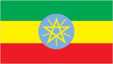
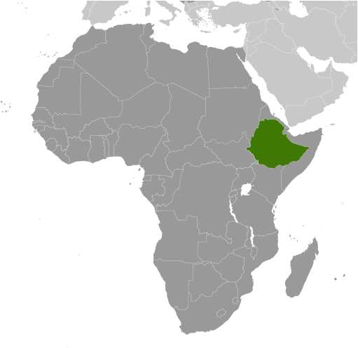
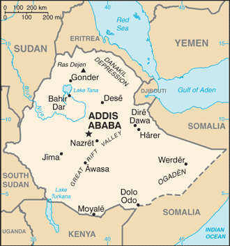

# Ethiopia

## Introduction

**_Background:_**   
Unique among African countries, the ancient Ethiopian monarchy maintained its freedom from colonial rule with the exception of a short-lived Italian occupation from 1936-41. In 1974, a military junta, the Derg, deposed Emperor Haile SELASSIE (who had ruled since 1930) and established a socialist state. Torn by bloody coups, uprisings, wide-scale drought, and massive refugee problems, the regime was finally toppled in 1991 by a coalition of rebel forces, the Ethiopian People's Revolutionary Democratic Front (EPRDF). A constitution was adopted in 1994, and Ethiopia's first multiparty elections were held in 1995. A border war with Eritrea late in the 1990s ended with a peace treaty in December 2000. In November 2007, the Eritrea-Ethiopia Border Commission (EEBC) issued specific coordinates as virtually demarcating the border and pronounced its work finished. Alleging that the EEBC acted beyond its mandate in issuing the coordinates, Ethiopia has not accepted them and has not withdrawn troops from previously contested areas pronounced by the EEBC as belonging to Eritrea. In August 2012, longtime leader Prime Minister MELES Zenawi died in office and was replaced by his Deputy Prime Minister HAILEMARIAM Desalegn, marking the first peaceful transition of power in decades.

## Geography

**_Location:_**   
Eastern Africa, west of Somalia

**_Geographic coordinates:_**   
8 00 N, 38 00 E

**_Map references:_**   
Africa

**_Area:_**   
**total:** 1,104,300 sq km   
**land:** 1 million sq km   
**water:** 104,300 sq km

**_Area - comparative:_**   
slightly less than twice the size of Texas

**_Land boundaries:_**   
**total:** 5,925 km   
**border countries:** Djibouti 342 km, Eritrea 1,033 km, Kenya 867 km, Somalia 1,640 km, South Sudan 1,299 km, Sudan 744 km

**_Coastline:_**   
0 km (landlocked)

**_Maritime claims:_**   
none (landlocked)

**_Climate:_**   
tropical monsoon with wide topographic-induced variation

**_Terrain:_**   
high plateau with central mountain range divided by Great Rift Valley

**_Elevation extremes:_**   
**lowest point:** Danakil Depression -125 m   
**highest point:** Ras Dejen 4,533 m

**_Natural resources:_**   
small reserves of gold, platinum, copper, potash, natural gas, hydropower

**_Land use:_**   
**arable land:** 13.19%   
**permanent crops:** 1.01%   
**other:** 85.8% (2011)

**_Irrigated land:_**   
2,896 sq km (2003)

**_Total renewable water resources:_**   
122 cu km (2011)

**_Freshwater withdrawal (domestic/industrial/agricultural):_**   
**total:** 5.56 cu km/yr (13%/1%/86%)   
**per capita:** 80.5 cu m/yr (2005)

**_Natural hazards:_**   
geologically active Great Rift Valley susceptible to earthquakes, volcanic eruptions; frequent droughts   
**volcanism:** volcanic activity in the Great Rift Valley; Erta Ale (elev. 613 m), which has caused frequent lava flows in recent years, is the country's most active volcano; Dabbahu became active in 2005, causing evacuations; other historically active volcanoes include Alayta, Dalaffilla, Dallol, Dama Ali, Fentale, Kone, Manda Hararo, and Manda-Inakir

**_Environment - current issues:_**   
deforestation; overgrazing; soil erosion; desertification; water shortages in some areas from water-intensive farming and poor management

**_Environment - international agreements:_**   
**party to:** Biodiversity, Climate Change, Climate Change-Kyoto Protocol, Desertification, Endangered Species, Hazardous Wastes, Ozone Layer Protection   
**signed, but not ratified:** Environmental Modification, Law of the Sea

**_Geography - note:_**   
landlocked - entire coastline along the Red Sea was lost with the de jure independence of Eritrea on 24 May 1993; Ethiopia is, therefore, the most populous landlocked country in the world; the Blue Nile, the chief headstream of the Nile by water volume, rises in T'ana Hayk (Lake Tana) in northwest Ethiopia; three major crops are believed to have originated in Ethiopia: coffee, grain sorghum, and castor bean

## People and Society

**_Nationality:_**   
**noun:** Ethiopian(s)   
**adjective:** Ethiopian

**_Ethnic groups:_**   
Oromo 34.4%, Amhara (Amara) 27%, Somali (Somalie) 6.2%, Tigray (Tigrinya) 6.1%, Sidama 4%, Gurage 2.5%, Welaita 2.3%, Hadiya 1.7%, Afar (Affar) 1.7%, Gamo 1.5%, Gedeo 1.3%, Silte 1.3%, Kefficho 1.2%, other 10.5% (2007 est.)

**_Languages:_**   
Oromo (official working language in the State of Oromiya) 33.8%, Amharic (official national language) 29.3%, Somali (official working language of the State of Sumale) 6.2%, Tigrigna (Tigrinya) (official working language of the State of Tigray) 5.9%, Sidamo 4%, Wolaytta 2.2%, Gurage 2%, Afar (official working language of the State of Afar) 1.7%, Hadiyya 1.7%, Gamo 1.5%, Gedeo 1.3%, Opuuo 1.2%, Kafa 1.1%, other 8.1%, English (major foreign language taught in schools), Arabic (2007 est.)

**_Religions:_**   
Ethiopian Orthodox 43.5%, Muslim 33.9%, Protestant 18.5%, traditional 2.7%, Catholic 0.7%, other 0.6% (2007 est.)

**_Population:_**   
96,633,458   
**note:** estimates for this country explicitly take into account the effects of excess mortality due to AIDS; this can result in lower life expectancy, higher infant mortality, higher death rates, lower population growth rates, and changes in the distribution of population by age and sex than would otherwise be expected (July 2014 est.)

**_Age structure:_**   
**0-14 years:** 44.2% (male 21,376,243/female 21,308,454)   
**15-24 years:** 19.9% (male 9,557,462/female 9,692,275)   
**25-54 years:** 29.2% (male 14,023,218/female 14,176,263)   
**55-64 years:** 3.9% (male 1,826,602/female 1,919,212)   
**65 years and over:** 2.8% (male 1,242,171/female 1,511,558) (2014 est.)

**_Dependency ratios:_**   
**total dependency ratio:** 83.5 %   
**youth dependency ratio:** 77.2 %   
**elderly dependency ratio:** 6.3 %   
**potential support ratio:** 15.8 (2014 est.)

**_Median age:_**   
**total:** 17.6 years   
**male:** 17.4 years   
**female:** 17.7 years (2014 est.)

**_Population growth rate:_**   
2.89% (2014 est.)

**_Birth rate:_**   
37.66 births/1,000 population (2014 est.)

**_Death rate:_**   
8.52 deaths/1,000 population (2014 est.)

**_Net migration rate:_**   
-0.23 migrant(s)/1,000 population   
**note:** repatriation of Ethiopian refugees residing in Sudan is expected to continue for several years; some Sudanese, Somali, and Eritrean refugees, who fled to Ethiopia from the fighting or famine in their own countries, continue to return to their homes (2014 est.)

**_Urbanization:_**   
**urban population:** 17% of total population (2011)   
**rate of urbanization:** 3.57% annual rate of change (2010-15 est.)

**_Major urban areas - population:_**   
ADDIS ABABA (capital) 2.979 million (2011)

**_Sex ratio:_**   
**at birth:** 1.03 male(s)/female   
**0-14 years:** 1 male(s)/female   
**15-24 years:** 0.99 male(s)/female   
**25-54 years:** 0.99 male(s)/female   
**55-64 years:** 0.99 male(s)/female   
**65 years and over:** 0.83 male(s)/female   
**total population:** 0.99 male(s)/female (2014 est.)

**_Mother's mean age at first birth:_**   
19.6   
**note:** median age at first birth among women 25-29 (2011 est.)

**_Maternal mortality rate:_**   
350 deaths/100,000 live births (2010)

**_Infant mortality rate:_**   
**total:** 55.77 deaths/1,000 live births   
**male:** 63.77 deaths/1,000 live births   
**female:** 47.53 deaths/1,000 live births (2014 est.)

**_Life expectancy at birth:_**   
**total population:** 60.75 years   
**male:** 58.43 years   
**female:** 63.15 years (2014 est.)

**_Total fertility rate:_**   
5.23 children born/woman (2014 est.)

**_Contraceptive prevalence rate:_**   
28.6% (2010/11)

**_Health expenditures:_**   
4.7% of GDP (2011)

**_Physicians density:_**   
0.03 physicians/1,000 population (2009)

**_Hospital bed density:_**   
6.3 beds/1,000 population (2011)

**_Drinking water source:_**   
**improved:** urban: 96.8% of population; rural: 42.1% of population; total: 51.5% of population   
**unimproved:** urban: 3.2% of population; rural: 57.9% of population; total: 48.5% of population (2012 est.)

**_Sanitation facility access:_**   
**improved:** urban: 27.4% of population; rural: 22.8% of population; total: 23.6% of population   
**unimproved:** urban: 72.6% of population; rural: 77.2% of population; total: 76.4% of population (2012 est.)

**_HIV/AIDS - adult prevalence rate:_**   
1.3% (2012 est.)

**_HIV/AIDS - people living with HIV/AIDS:_**   
758,600 (2012 est.)

**_HIV/AIDS - deaths:_**   
47,200 (2012 est.)

**_Major infectious diseases:_**   
**degree of risk:** very high   
**food or waterborne diseases:** bacterial and protozoal diarrhea, hepatitis A, and typhoid fever   
**vectorborne diseases:** malaria and dengue fever   
**respiratory disease:** meningococcal meningitis   
**animal contact disease:** rabies   
**water contact disease:** schistosomiasis (2013)

**_Obesity - adult prevalence rate:_**   
1.1% (2008)

**_Children under the age of 5 years underweight:_**   
29.2% (2011)

**_Education expenditures:_**   
4.7% of GDP (2010)

**_Literacy:_**   
**definition:** age 15 and over can read and write   
**total population:** 39%   
**male:** 49.1%   
**female:** 28.9% (2007 est.)

**_School life expectancy (primary to tertiary education):_**   
**total:** 7 years   
**male:** 8 years   
**female:** 6 years (2005)

**_Child labor - children ages 5-14:_**   
**total number:** 10,693,164   
**percentage:** 53 % (2005 est.)

**_Unemployment, youth ages 15-24:_**   
**total:** 24.9%   
**male:** 19.5%   
**female:** 29.4% (2006)

## Government

**_Country name:_**   
**conventional long form:** Federal Democratic Republic of Ethiopia   
**conventional short form:** Ethiopia   
**local long form:** Ityop'iya Federalawi Demokrasiyawi Ripeblik   
**local short form:** Ityop'iya   
**former:** Abyssinia, Italian East Africa   
**abbreviation:** FDRE

**_Government type:_**   
federal republic

**_Capital:_**   
**name:** Addis Ababa   
**geographic coordinates:** 9 02 N, 38 42 E   
**time difference:** UTC+3 (8 hours ahead of Washington, DC, during Standard Time)

**_Administrative divisions:_**   
9 ethnically based states (kililoch, singular - kilil) and 2 self-governing administrations\* (astedaderoch, singular - astedader); Adis Abeba\* (Addis Ababa), Afar, Amara (Amhara), Binshangul Gumuz, Dire Dawa\*, Gambela Hizboch (Gambela Peoples), Hareri Hizb (Harari People), Oromiya (Oromia), Sumale (Somali), Tigray, Ye Debub Biheroch Bihereseboch na Hizboch (Southern Nations, Nationalities, and Peoples)

**_Independence:_**   
oldest independent country in Africa and one of the oldest in the world - at least 2,000 years (may be traced to the Aksumite Kingdom, which coalesced in the first century B.C.)

**_National holiday:_**   
National Day (defeat of MENGISTU regime), 28 May (1991)

**_Constitution:_**   
several previous; latest drafted June 1994, adopted 8 December 1994, entered into force 21 August 1995 (2013)

**_Legal system:_**   
civil law system

**_International law organization participation:_**   
has not submitted an ICJ jurisdiction declaration; non-party state to the ICCt

**_Suffrage:_**   
18 years of age; universal

**_Executive branch:_**   
**chief of state:** President MULATU Teshome Wirtu (since 7 October 2013)   
**head of government:** Prime Minister HAILEMARIAM Desalegn (since 21 September 2012); Deputy Prime Ministers ASTER Mamo, DEBRETSION Gebre-Michael, DEMEKE Mekonnen Hassen; note - prior to his approval as prime minister, HAILEMARIAM had been acting prime minister due to the death of former Prime Minister MELES   
**cabinet:** Council of Ministers - ministers selected by the prime minister and approved by the House of People's Representatives   
**elections:** president elected by both chambers of Parliament for a six-year term (eligible for a second term); election last held on 7 October 2013 (next to be held in October 2019); prime minister designated by the party in power following legislative elections   
**election results:** MULATU Teshome Wirtu elected president by acclamation

**_Legislative branch:_**   
bicameral Parliament consists of the House of Federation (or upper chamber responsible for interpreting the constitution and federal-regional issues) (108 seats; members chosen by state assemblies to serve five-year terms) and the House of People's Representatives (or lower chamber responsible for passing legislation) (547 seats; members directly elected by popular vote from single-member districts to serve five-year terms)   
**elections:** last held on 23 May 2010 (next to be held in 2015)   
**election results:** percent of vote - NA; seats by party - EPRDF 499, SPDP 24, BGPDP 9, ANDP 8, GPUDM 3, HNL 1, FORUM 1, APDO 1, independent 1

**_Judicial branch:_**   
**highest court(s):** Federal Supreme Court or Supreme Imperial Court (consists of 11 judges); note - the Federal Supreme Court has jurisdiction for all constitutional issues   
**judge selection and term of office:** president and vice president of Federal Supreme Court nominated by the prime minister and appointed by the House of People's Representatives; other Supreme Court judges nominated by the Federal Judicial Administrative Council and appointed by the House of People's Representatives; judges serve until retirement at age 60   
**subordinate courts:** federal high courts and federal courts of first instance; state court systems (mirror structure of federal system); sharia courts and customary and traditional courts

**_Political parties and leaders:_**   
Afar National Democratic Party or ANDP [Mohammed KEDIR]   
All Ethiopian Unity Organization or AEUO [Hailu SHAWEL]   
Arena Tigray [GEBRU Asrat]   
Argoba People's Democratic Organization or APDO [Abdulkader MOHAMMED]   
Benishangul Gumuz People's Democratic Party or BGPDP [Mulualem BESSE]   
Coalition for Unity and Democratic Party or CUDP [AYELE Chamiso]   
Ethiopian Democratic Party or EDP [MUSHE Semu]   
Ethiopian Federal Democratic Forum or FORUM (a UDJ-led 6-party alliance established for the 2010 parliamentary elections) [Dr. Moga FRISSA]   
Ethiopian People's Revolutionary Democratic Front or EPRDF (including the following organizations: Amhara National Democratic Movement or ANDM; Oromo People's Democratic Organization or OPDO; Southern Ethiopian People's Democratic Movement or SEPDM; and Tigray People's Liberation Front or TPLF)   
Gambella Peoples Unity Democratic Movement or GPUDM   
Gurage Peoples Democratic Front [GIRMA Bogale]   
Harari National League or HNL [YASIN Husein]   
Oromo Federalist Democratic Movement or OFDM   
Oromo People's Congress or OPC [IMERERA Gudina]   
Somali Democratic Alliance Forces or SODAF [BUH Hussien]   
Somali People's Democratic Party or SPDP [Abdulfetah Sheck ABDULAHI]   
South Ethiopian People's Democratic Union or SEPDU [TILAHUN Endeshaw]   
United Ethiopian Democratic Forces or UEDF [BEYENE Petros]   
Unity for Democracy and Justice or UDJ [Dr. NEGASSO Gidada]

**_Political pressure groups and leaders:_**   
Ethiopian People's Patriotic Front or EPPF   
Ogaden National Liberation Front or ONLF   
Oromo Liberation Front or OLF [DAOUD Ibsa]

**_International organization participation:_**   
ACP, AfDB, AU, COMESA, FAO, G-24, G-77, IAEA, IBRD, ICAO, ICRM, IDA, IFAD, IFC, IFRCS, IGAD, ILO, IMF, IMO, Interpol, IOC, IOM, IPU, ISO, ITSO, ITU, ITUC (NGOs), MIGA, NAM, OPCW, PCA, UN, UNAMID, UNCTAD, UNESCO, UNHCR, UNIDO, UNISFA, UNMIL, UNOCI, UNWTO, UPU, WCO, WFTU (NGOs), WHO, WIPO, WMO, WTO (observer)

**_Diplomatic representation in the US:_**   
**chief of mission:** Ambassador GIRMA Birru (since 6 January 2011)   
**chancery:** 3506 International Drive NW, Washington, DC 20008   
**telephone:** [1] (202) 364-1200   
**FAX:** [1] (202) 587-0195   
**consulate(s) general:** Los Angeles   
**consulate(s):** New York

**_Diplomatic representation from the US:_**   
**chief of mission:** Ambassador Patricia Marie HASLACH (since 14 August 2013)   
**embassy:** Entoto Street, Addis Ababa   
**mailing address:** P. O. Box 1014, Addis Ababa   
**telephone:** 130-6000   
**FAX:** 124-2401

**_Flag description:_**   
three equal horizontal bands of green (top), yellow, and red, with a yellow pentagram and single yellow rays emanating from the angles between the points on a light blue disk centered on the three bands; green represents hope and the fertility of the land, yellow symbolizes justice and harmony, while red stands for sacrifice and heroism in the defense of the land; the blue of the disk symbolizes peace and the pentagram represents the unity and equality of the nationalities and peoples of Ethiopia   
**note:** Ethiopia is the oldest independent country in Africa, and the three main colors of her flag (adopted ca. 1895) were so often adopted by other African countries upon independence that they became known as the Pan-African colors; the emblem in the center of the current flag was added in 1996

**_National symbol(s):_**   
Abyssinian lion

**_National anthem:_**   
**name:** "Whedefit Gesgeshi Woud Enat Ethiopia" (March Forward, Dear Mother Ethiopia)   
**lyrics/music:** DEREJE Melaku Mengesha/SOLOMON Lulu   
**note:** adopted 1992

## Economy

**_Economy - overview:_**   
Ethiopia's economy is based on agriculture but the government is pushing to diversify into manufacturing, textiles, and energy generation.. Coffee is a major export crop. The agricultural sector suffers from poor cultivation practices and frequent drought, but recent joint efforts by the Government of Ethiopia and donors have strengthened Ethiopia's agricultural resilience, contributing to a reduction in the number of Ethiopians threatened with starvation. The banking, insurance, telecommunications, and micro-credit industries are restricted to domestic investors, but Ethiopia has attracted significant foreign investment in textiles, leather, commercial agriculture and manufacturing. Under Ethiopia's constitution, the state owns all land and provides long-term leases to the tenants; land use certificates are now being issued in some areas so that tenants have more recognizable rights to continued occupancy and hence make more concerted efforts to improve their leaseholds. While GDP growth has remained high, per capita income is among the lowest in the world. Ethiopia's economy continues on its state-led Growth and Transformation Plan under the new collective leadership that followed Prime Minister MELES’s death. The five-year economic plan has achieved high single-digit growth rates through government-led infrastructure expansion and commercial agriculture development. Ethiopia in 2014 will continue construction of its Grand Renaissance Dam on the Nile – a controversial five billion dollar effort to develop electricity for domestic consumption and export.

**_GDP (purchasing power parity):_**   
$118.2 billion (2013 est.)   
$110.4 billion (2012 est.)   
$101.8 billion (2011 est.)   
**note:** data are in 2013 US dollars

**_GDP (official exchange rate):_**   
$47.34 billion (2013 est.)

**_GDP - real growth rate:_**   
7% (2013 est.)   
8.5% (2012 est.)   
11.4% (2011 est.)

**_GDP - per capita (PPP):_**   
$1,300 (2013 est.)   
$1,300 (2012 est.)   
$1,200 (2011 est.)   
**note:** data are in 2013 US dollars

**_Gross national saving:_**   
18.8% of GDP (2013 est.)   
18.2% of GDP (2012 est.)   
22.9% of GDP (2011 est.)

**_GDP - composition, by end use:_**   
**household consumption:** 83.1%   
**government consumption:** 8.6%   
**investment in fixed capital:** 26.1%   
**investment in inventories:** 0%   
**exports of goods and services:** 11.5%   
**imports of goods and services:** -29.3%; (2013 est.)

**_GDP - composition, by sector of origin:_**   
**agriculture:** 47%   
**industry:** 10.8%   
**services:** 42.2% (2013 est.)

**_Agriculture - products:_**   
cereals, pulses, coffee, oilseed, cotton, sugarcane, potatoes, khat, cut flowers; hides, cattle, sheep, goats; fish

**_Industries:_**   
food processing, beverages, textiles, leather, chemicals, metals processing, cement

**_Industrial production growth rate:_**   
9% (2013 est.)

**_Labor force:_**   
45.65 million (2013 est.)

**_Labor force - by occupation:_**   
**agriculture:** 85%   
**industry:** 5%   
**services:** 10% (2009 est.)

**_Unemployment rate:_**   
17.5% (2012 est.)   
18% (2011 est.)

**_Population below poverty line:_**   
39% (2012 est.)

**_Household income or consumption by percentage share:_**   
**lowest 10%:** 4.1%   
**highest 10%:** 25.6% (2005)

**_Distribution of family income - Gini index:_**   
33 (2011)   
30 (2000)

**_Budget:_**   
**revenues:** $6.702 billion   
**expenditures:** $8.042 billion (2013 est.)

**_Taxes and other revenues:_**   
14.2% of GDP (2013 est.)

**_Budget surplus (+) or deficit (-):_**   
-2.8% of GDP (2013 est.)

**_Public debt:_**   
50.4% of GDP (2013 est.)   
39.7% of GDP (2012 est.)   
**note:** official data cover central government debt, including debt instruments issued (or owned) by government entities other than the treasury and treasury debt owned by foreign entities; the data exclude debt issued by subnational entities, as well as intragovernmental debt; debt instruments for the social funds are not sold at public auctions

**_Fiscal year:_**   
8 July - 7 July

**_Inflation rate (consumer prices):_**   
8.4% (2013 est.)   
22.9% (2012 est.)

**_Central bank discount rate:_**   
NA%

**_Commercial bank prime lending rate:_**   
12% (31 December 2013 est.)   
14.5% (31 December 2012 est.)

**_Stock of narrow money:_**   
$9.006 billion (31 December 2013 est.)   
$9.107 billion (31 December 2012 est.)

**_Stock of broad money:_**   
$15.43 billion (31 December 2013 est.)   
$15.45 billion (31 December 2012 est.)

**_Stock of domestic credit:_**   
$16.07 billion (31 December 2013 est.)   
$16.09 billion (31 December 2012 est.)

**_Market value of publicly traded shares:_**   
$NA

**_Current account balance:_**   
-$2.744 billion (2013 est.)   
-$2.031 billion (2012 est.)

**_Exports:_**   
$3.214 billion (2013 est.)   
$3.039 billion (2012 est.)

**_Exports - commodities:_**   
coffee, khat, gold, leather products, live animals, oilseeds

**_Exports - partners:_**   
China 13%, Germany 10.8%, US 8%, Belgium 7.7%, Saudi Arabia 7.6% (2012)

**_Imports:_**   
$10.68 billion (2013 est.)   
$10.25 billion (2012 est.)

**_Imports - commodities:_**   
food and live animals, petroleum and petroleum products, chemicals, machinery, motor vehicles, cereals, textiles

**_Imports - partners:_**   
China 13.1%, US 11%, Saudi Arabia 8.4%, India 5.4% (2012)

**_Reserves of foreign exchange and gold:_**   
$3.382 billion (31 December 2013 est.)   
$3.272 billion (31 December 2012 est.)

**_Debt - external:_**   
$11.99 billion (31 December 2013 est.)   
$10.03 billion (31 December 2012 est.)

**_Exchange rates:_**   
birr (ETB) per US dollar -   
19.92 (2013 est.)   
17.705 (2012 est.)   
14.41 (2010 est.)   
11.78 (2009)   
9.57 (2008)

## Energy

**_Electricity - production:_**   
4.929 billion kWh (2010 est.)

**_Electricity - consumption:_**   
4.451 billion kWh (2010 est.)

**_Electricity - exports:_**   
0 kWh (2012 est.)

**_Electricity - imports:_**   
0 kWh (2012 est.)

**_Electricity - installed generating capacity:_**   
2.061 million kW (2010 est.)

**_Electricity - from fossil fuels:_**   
9.9% of total installed capacity (2010 est.)

**_Electricity - from nuclear fuels:_**   
0% of total installed capacity (2010 est.)

**_Electricity - from hydroelectric plants:_**   
89.7% of total installed capacity (2010 est.)

**_Electricity - from other renewable sources:_**   
0.4% of total installed capacity (2010 est.)

**_Crude oil - production:_**   
100 bbl/day (2012 est.)

**_Crude oil - exports:_**   
0 bbl/day (2010 est.)

**_Crude oil - imports:_**   
0 bbl/day (2010 est.)

**_Crude oil - proved reserves:_**   
430,000 bbl (1 January 2013 est.)

**_Refined petroleum products - production:_**   
0 bbl/day (2010 est.)

**_Refined petroleum products - consumption:_**   
49,080 bbl/day (2011 est.)

**_Refined petroleum products - exports:_**   
0 bbl/day (2010 est.)

**_Refined petroleum products - imports:_**   
42,500 bbl/day (2010 est.)

**_Natural gas - production:_**   
0 cu m (2011 est.)

**_Natural gas - consumption:_**   
0 cu m (2010 est.)

**_Natural gas - exports:_**   
0 cu m (2011 est.)

**_Natural gas - imports:_**   
0 cu m (2011 est.)

**_Natural gas - proved reserves:_**   
24.92 billion cu m (1 January 2013 est.)

**_Carbon dioxide emissions from consumption of energy:_**   
6.703 million Mt (2011 est.)

## Communications

**_Telephones - main lines in use:_**   
797,500 (2012)

**_Telephones - mobile cellular:_**   
20.524 million (2012)

**_Telephone system:_**   
**general assessment:** inadequate telephone system with the Ethio Telecom maintaining a monopoly over telecommunication services; open-wire, microwave radio relay; radio communication in the HF, VHF, and UHF frequencies; 2 domestic satellites provide the national trunk service   
**domestic:** the number of fixed lines and mobile telephones is increasing from a small base; combined fixed and mobile-cellular teledensity is roughly 15 per 100 persons   
**international:** country code - 251; open-wire to Sudan and Djibouti; microwave radio relay to Kenya and Djibouti; satellite earth stations - 3 Intelsat (1 Atlantic Ocean and 2 Pacific Ocean) (2011)

**_Broadcast media:_**   
1 public TV station broadcasting nationally and 1 public radio broadcaster with stations in each of the 13 administrative districts; a few commercial radio stations and roughly a dozen community radio stations (2009)

**_Internet country code:_**   
.et

**_Internet hosts:_**   
179 (2012)

**_Internet users:_**   
447,300 (2009)

## Transportation

**_Airports:_**   
57 (2013)

**_Airports - with paved runways:_**   
**total:** 17   
**over 3,047 m:** 3   
**2,438 to 3,047 m:** 8   
**1,524 to 2,437 m:** 4   
**under 914 m:** 2 (2013)

**_Airports - with unpaved runways:_**   
**total:** 40   
**2,438 to 3,047 m:** 3   
**1,524 to 2,437 m:** 9   
**914 to 1,523 m:** 20   
**under 914 m:** 8 (2013)

**_Railways:_**   
**total:** 681 km (Ethiopian segment of the 781 km Addis Ababa-Djibouti railroad)   
**narrow gauge:** 681 km 1.000-m gauge   
**note:** railway is under joint control of Djibouti and Ethiopia but is largely inoperable (2008)

**_Roadways:_**   
**total:** 44,359 km   
**paved:** 6,064 km   
**unpaved:** 38,295 km (2007)

**_Merchant marine:_**   
**total:** 8   
**by type:** cargo 8 (2010)

**_Ports and terminals:_**   
Ethiopia is landlocked and uses the ports of Djibouti in Djibouti and Berbera in Somalia

## Military

**_Military branches:_**   
Ethiopian National Defense Force (ENDF): Ground Forces, Ethiopian Air Force (Ye Ityopya Ayer Hayl, ETAF) (2013)

**_Military service age and obligation:_**   
18 years of age for voluntary military service; no compulsory military service, but the military can conduct callups when necessary and compliance is compulsory (2012)

**_Manpower available for military service:_**   
**males age 16-49:** 19,067,499   
**females age 16-49:** 19,726,816 (2010 est.)

**_Manpower fit for military service:_**   
**males age 16-49:** 11,868,084   
**females age 16-49:** 12,889,260 (2010 est.)

**_Manpower reaching militarily significant age annually:_**   
**male:** 967,411   
**female:** 981,714 (2010 est.)

**_Military expenditures:_**   
0.91% of GDP (2012)   
1.1% of GDP (2011)   
0.91% of GDP (2010)

## Transnational Issues

**_Disputes - international:_**   
Eritrea and Ethiopia agreed to abide by the 2002 Eritrea-Ethiopia Boundary Commission's (EEBC) delimitation decision, but neither party responded to the revised line detailed in the November 2006 EEBC Demarcation Statement; the undemarcated former British administrative line has little meaning as a political separation to rival clans within Ethiopia's Ogaden and southern Somalia's Oromo region; Ethiopian forces invaded southern Somalia and routed Islamist Courts from Mogadishu in January 2007; "Somaliland" secessionists provide port facilities in Berbera and trade ties to landlocked Ethiopia; civil unrest in eastern Sudan has hampered efforts to demarcate the porous boundary with Ethiopia

**_Refugees and internally displaced persons:_**   
**refugees (country of origin):** 244,956 (Somalia); 191,303 (South Sudan); 84,271 (Eritrea); 40,781 (Sudan) (2014)   
**IDPs:** 316,000 (border war with Eritrea from 1998-2000; ethnic clashes; and ongoing fighting between the Ethiopian military and separatist rebel groups in the Sumale and Oromiya regions; natural disasters; most IDPs live in Sumale state) (2013)

**_Illicit drugs:_**   
transit hub for heroin originating in Southwest and Southeast Asia and destined for Europe, as well as cocaine destined for markets in southern Africa; cultivates qat (khat) for local use and regional export, principally to Djibouti and Somalia (legal in all three countries); the lack of a well-developed financial system limits the country's utility as a money laundering center

............................................................   
_Page last updated on June 22, 2014_
