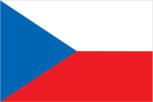
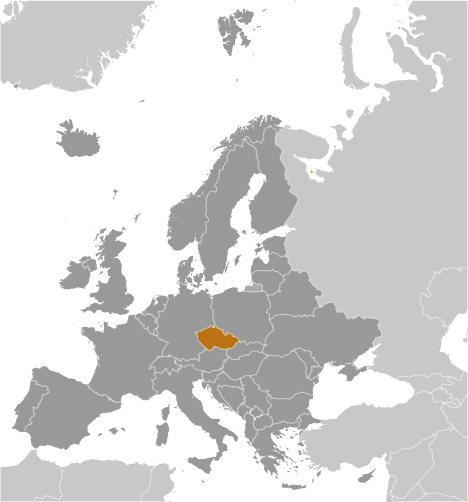
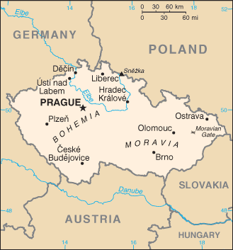

# Czech Republic

## Introduction

**_Background:_**   
At the close of World War I, the Czechs and Slovaks of the former Austro-Hungarian Empire merged to form Czechoslovakia. During the interwar years, having rejected a federal system, the new country's predominantly Czech leaders were frequently preoccupied with meeting the increasingly strident demands of other ethnic minorities within the republic, most notably the Slovaks, the Sudeten Germans, and the Ruthenians (Ukrainians). On the eve of World War II, Nazi Germany occupied the territory that today comprises the Czech Republic and Slovakia became an independent state allied with Germany. After the war, a reunited but truncated Czechoslovakia (less Ruthenia) fell within the Soviet sphere of influence. In 1968, an invasion by Warsaw Pact troops ended the efforts of the country's leaders to liberalize communist rule and create "socialism with a human face," ushering in a period of repression known as "normalization." The peaceful "Velvet Revolution" swept the Communist Party from power at the end of 1989 and inaugurated a return to democratic rule and a market economy. On 1 January 1993, the country underwent a nonviolent "velvet divorce" into its two national components, the Czech Republic and Slovakia. The Czech Republic joined NATO in 1999 and the European Union in 2004.

## Geography

**_Location:_**   
Central Europe, between Germany, Poland, Slovakia, and Austria

**_Geographic coordinates:_**   
49 45 N, 15 30 E

**_Map references:_**   
Europe

**_Area:_**   
**total:** 78,867 sq km   
**land:** 77,247 sq km   
**water:** 1,620 sq km

**_Area - comparative:_**   
slightly smaller than South Carolina

**_Land boundaries:_**   
**total:** 2,046 km   
**border countries:** Austria 402 km, Germany 704 km, Poland 699 km, Slovakia 241 km

**_Coastline:_**   
0 km (landlocked)

**_Maritime claims:_**   
none (landlocked)

**_Climate:_**   
temperate; cool summers; cold, cloudy, humid winters

**_Terrain:_**   
Bohemia in the west consists of rolling plains, hills, and plateaus surrounded by low mountains; Moravia in the east consists of very hilly country

**_Elevation extremes:_**   
**lowest point:** Labe (Elbe) River 115 m   
**highest point:** Snezka 1,602 m

**_Natural resources:_**   
hard coal, soft coal, kaolin, clay, graphite, timber

**_Land use:_**   
**arable land:** 40.12%   
**permanent crops:** 0.96%   
**other:** 58.92% (2011)

**_Irrigated land:_**   
385.3 sq km (2007)

**_Total renewable water resources:_**   
13.15 cu km (2011)

**_Freshwater withdrawal (domestic/industrial/agricultural):_**   
**total:** 1.7 cu km/yr (41%/56%/2%)   
**per capita:** 164.7 cu m/yr (2009)

**_Natural hazards:_**   
flooding

**_Environment - current issues:_**   
air and water pollution in areas of northwest Bohemia and in northern Moravia around Ostrava present health risks; acid rain damaging forests; efforts to bring industry up to EU code should improve domestic pollution

**_Environment - international agreements:_**   
**party to:** Air Pollution, Air Pollution-Nitrogen Oxides, Air Pollution-Persistent Organic Pollutants, Air Pollution-Sulfur 85, Air Pollution-Sulfur 94, Air Pollution-Volatile Organic Compounds, Antarctic-Environmental Protocol, Antarctic Treaty, Biodiversity, Climate Change, Climate Change-Kyoto Protocol, Desertification, Endangered Species, Environmental Modification, Hazardous Wastes, Law of the Sea, Ozone Layer Protection, Ship Pollution, Wetlands, Whaling   
**signed, but not ratified:** none of the selected agreements

**_Geography - note:_**   
landlocked; strategically located astride some of oldest and most significant land routes in Europe; Moravian Gate is a traditional military corridor between the North European Plain and the Danube in central Europe

## People and Society

**_Nationality:_**   
**noun:** Czech(s)   
**adjective:** Czech

**_Ethnic groups:_**   
Czech 64.3%, Moravian 5%, Slovak 1.4%, other 1.8%, unspecified 27.5% (2011 est.)

**_Languages:_**   
Czech 95.4%, Slovak 1.6%, other 3% (2011 census)

**_Religions:_**   
Roman Catholic 10.4%, Protestant (includes Czech Brethren and Hussite) 1.1%, other and unspecified 54%, none 34.5% (2011 est.)

**_Population:_**   
10,627,448 (July 2014 est.)

**_Age structure:_**   
**0-14 years:** 14.9% (male 812,503/female 769,849)   
**15-24 years:** 10.6% (male 576,304/female 547,765)   
**25-54 years:** 43.6% (male 2,377,962/female 2,256,989)   
**55-64 years:** 13.4% (male 687,155/female 735,277)   
**65 years and over:** 17.6% (male 766,402/female 1,097,242) (2014 est.)

**_Dependency ratios:_**   
**total dependency ratio:** 47.7 %   
**youth dependency ratio:** 22.4 %   
**elderly dependency ratio:** 25.4 %   
**potential support ratio:** 3.9 (2014 est.)

**_Median age:_**   
**total:** 40.9 years   
**male:** 39.6 years   
**female:** 42.3 years (2014 est.)

**_Population growth rate:_**   
0.17% (2014 est.)

**_Birth rate:_**   
9.79 births/1,000 population (2014 est.)

**_Death rate:_**   
10.29 deaths/1,000 population (2014 est.)

**_Net migration rate:_**   
2.15 migrant(s)/1,000 population (2014 est.)

**_Urbanization:_**   
**urban population:** 73.4% of total population (2011)   
**rate of urbanization:** 0.24% annual rate of change (2010-15 est.)

**_Major urban areas - population:_**   
PRAGUE (capital) 1.276 million (2011)

**_Sex ratio:_**   
**at birth:** 1.06 male(s)/female   
**0-14 years:** 1.06 male(s)/female   
**15-24 years:** 1.05 male(s)/female   
**25-54 years:** 1.05 male(s)/female   
**55-64 years:** 0.97 male(s)/female   
**65 years and over:** 0.67 male(s)/female   
**total population:** 0.95 male(s)/female (2014 est.)

**_Mother's mean age at first birth:_**   
27.8 (2011 est.)

**_Maternal mortality rate:_**   
5 deaths/100,000 live births (2010)

**_Infant mortality rate:_**   
**total:** 2.63 deaths/1,000 live births   
**male:** 2.76 deaths/1,000 live births   
**female:** 2.49 deaths/1,000 live births (2014 est.)

**_Life expectancy at birth:_**   
**total population:** 78.31 years   
**male:** 75.34 years   
**female:** 81.45 years (2014 est.)

**_Total fertility rate:_**   
1.43 children born/woman (2014 est.)

**_Contraceptive prevalence rate:_**   
86.3%   
**note:** percent of women aged 18-49 (2008)

**_Health expenditures:_**   
7.4% of GDP (2011)

**_Physicians density:_**   
3.71 physicians/1,000 population (2010)

**_Hospital bed density:_**   
7 beds/1,000 population (2010)

**_Drinking water source:_**   
**improved:** urban: 99.9% of population; rural: 99.6% of population; total: 99.8% of population   
**unimproved:** urban: 0.1% of population; rural: 0.4% of population; total: 0.2% of population (2012 est.)

**_Sanitation facility access:_**   
**improved:** urban: 100% of population; rural: 100% of population; total: 100% of population   
**unimproved:** urban: 0% of population; rural: 0% of population; total: 0% of population (2012 est.)

**_HIV/AIDS - adult prevalence rate:_**   
less than 0.1% (2009 est.)

**_HIV/AIDS - people living with HIV/AIDS:_**   
2,000 (2009 est.)

**_HIV/AIDS - deaths:_**   
fewer than 100 (2009 est.)

**_Obesity - adult prevalence rate:_**   
32.7% (2008)

**_Children under the age of 5 years underweight:_**   
2% (2007)

**_Education expenditures:_**   
4.2% of GDP (2010)

**_Literacy:_**   
**definition:** NA   
**total population:** 99%   
**male:** 99%   
**female:** 99% (2011 est.)

**_School life expectancy (primary to tertiary education):_**   
**total:** 16 years   
**male:** 16 years   
**female:** 17 years (2011)

**_Unemployment, youth ages 15-24:_**   
**total:** 19.5%   
**male:** 19.9%   
**female:** 19% (2012)

## Government

**_Country name:_**   
**conventional long form:** Czech Republic   
**conventional short form:** Czech Republic   
**local long form:** Ceska republika   
**local short form:** Cesko

**_Government type:_**   
parliamentary democracy

**_Capital:_**   
**name:** Prague   
**geographic coordinates:** 50 05 N, 14 28 E   
**time difference:** UTC+1 (6 hours ahead of Washington, DC, during Standard Time)   
**daylight saving time:** +1hr, begins last Sunday in March; ends last Sunday in October

**_Administrative divisions:_**   
13 regions (kraje, singular - kraj) and 1 capital city\* (hlavni mesto); Jihocesky (South Bohemia), Jihomoravsky (South Moravia), Karlovarsky (Karlovy Vary), Kralovehradecky (Hradec Kralove), Liberecky (Liberec), Moravskoslezsky (Moravia-Silesia), Olomoucky (Olomouc), Pardubicky (Pardubice), Plzensky (Pilsen), Praha (Prague)\*, Stredocesky (Central Bohemia), Ustecky (Usti), Vysocina (Highlands), Zlinsky (Zlin)

**_Independence:_**   
1 January 1993 (Czechoslovakia split into the Czech Republic and Slovakia); note - although 1 January is the day the Czech Republic came into being, the Czechs commemorate 28 October 1918, the day the former Czechoslovakia declared its independence from the Austro-Hungarian Empire, as their independence day

**_National holiday:_**   
Czechoslovak Founding Day, 28 October (1918)

**_Constitution:_**   
previous 1960; latest ratified 16 December 1992, effective 1 January 1993; amended several times, last in 2013 (2013)

**_Legal system:_**   
in 2014, a new civil code will replace the existing civil law system, which is based on former Austro-Hungarian civil codes and socialist theory and has been amended 40 times since the Communist regime fell in 1989

**_International law organization participation:_**   
has not submitted an ICJ jurisdiction declaration; accepts ICCt jurisdiction

**_Suffrage:_**   
18 years of age; universal

**_Executive branch:_**   
**chief of state:** President Milos ZEMAN (since 8 March 2013)   
**head of government:** Prime Minister Bohuslav SOBOTKA (since 17 January 2014); First Deputy Prime Minister Andrej BABIS and Deputy Prime Minister Pavel BELOBRADEK (both since 29 January 2014)   
**cabinet:** Cabinet appointed by the president on the recommendation of the prime minister   
**elections:** constitutional amendment passed in 2012 introduced presidential election by popular vote instead of by Parliament; president elected for a five-year term (may not serve more than two consecutive terms); elections last held on 11-12 January 2013 with a runoff on 25-26 January 2013 (next to be held in January 2018); prime minister appointed by the president   
**election results:** Milos ZEMAN elected president; percent of popular vote - Milos ZEMAN 54.8%, Karel SCHWARZENBERG 45.2%

**_Legislative branch:_**   
bicameral Parliament or Parlament consists of the Senate or Senat (81 seats; members elected by popular vote to serve six-year terms; one-third elected every two years) and the Chamber of Deputies or Poslanecka Snemovna (200 seats; members elected by popular vote to serve four-year terms)   
**elections:** Senate - last held in two rounds on 12-13 and 19-20 October 2012 (next to be held in October 2014); Chamber of Deputies - last held on 25-26 October 2013 (next to be held in 2017)   
**election results:** Senate - percent of vote by party - NA; seats by party - CSSD 48, ODS 15, KDU-CSL 4, TOP 09 4, North Bohemians 2, KSCM 2, Green 1, Ostravak 1, Pirate 1, independent 3; Chamber of Deputies - percent of vote by party - CSSD 20.5%, ANO 2011 18.7%, KSCM 14.9%, TOP 09 12%, ODS 7.7%, Usvit 6.9%, KDU-CSL 6.8% other 12.5%; seats by party - CSSD 50, ANO 2011 47, KSCM 33, TOP 09 26, ODS 16, Usvit 14, KDU-CSL 14

**_Judicial branch:_**   
**highest court(s):** Supreme Court (organized into Civil Law and Commercial Division, and Criminal Division each with a court chief justice, vice justice, and several judges); Constitutional Court (consists of 15 justices); Supreme Administrative Court (consists of 28 judges)   
**judge selection and term of office:** Supreme Court judges proposed by the Chamber of Deputies and appointed by the president; judges appointed for life; Constitutional Court judges appointed by the president and confirmed by the Senate; judges appointed for 10-year, renewable terms; Supreme Administrative Court judges selected by the president of the Court; judge term NA   
**subordinate courts:** High Court; superior, regional, and district courts

**_Political parties and leaders:_**   
Association of Independent Candidates-European Democrats or SNK-ED [Zdenka MARKOVA]   
Christian Democratic Union-Czechoslovak People's Party or KDU-CSL [Pavel BELOBRADEK]   
Civic Democratic Party or ODS [Petr FIALA]   
Communist Party of Bohemia and Moravia or KSCM [Vojtech FILIP]   
Czech Pirate Party [Ivan BARTOS]   
Czech Social Democratic Party or CSSD [Bohuslav SOBOTKA]   
Dawn of Direct Democracy or Usvit [Tomio OKAMURA]   
Green Party [Ondrej LISKA]   
Liberal Democrats or LIDEM [Dagmar NAVRATILOVA]   
Liberal Environmental Party or LES [Martin BURSYK]   
Movement of Dissatisfied Citizens or ANO [Andrej BABIS]   
North Bohemians   
Ostravak Movement   
Public Affairs or VV [Radek JOHN]   
Tradition Responsibility Prosperity 09 or TOP 09 [Karel SCHWARZENBERG]

**_Political pressure groups and leaders:_**   
Czech-Moravian Confederation of Trade Unions or CMKOS [Jaroslav ZAVADIL]

**_International organization participation:_**   
Australia Group, BIS, BSEC (observer), CD, CE, CEI, CERN, EAPC, EBRD, EIB, ESA, EU, FAO, IAEA, IBRD, ICAO, ICC (national committees), ICRM, IDA, IEA, IFC, IFRCS, ILO, IMF, IMO, IMSO, Interpol, IOC, IOM, IPU, ISO, ITSO, ITU, ITUC (NGOs), MIGA, MONUSCO, NATO, NEA, NSG, OAS (observer), OECD, OIF (observer), OPCW, OSCE, PCA, Schengen Convention, SELEC (observer), UN, UNCTAD, UNESCO, UNIDO, UNWTO, UPU, WCO, WFTU (NGOs), WHO, WIPO, WMO, WTO, ZC

**_Diplomatic representation in the US:_**   
**chief of mission:** Ambassador Petr GANDALOVIC (since 23 May 2011)   
**chancery:** 3900 Spring of Freedom Street NW, Washington, DC 20008   
**telephone:** [1] (202) 274-9100   
**FAX:** [1] (202) 966-8540   
**consulate(s) general:** Chicago, Los Angeles, New York

**_Diplomatic representation from the US:_**   
**chief of mission:** Ambassador Norman L. EISEN (since 14 January 2011)   
**embassy:** Trziste 15, 118 01 Prague 1 - Mala Strana   
**mailing address:** use embassy street address   
**telephone:** [420] 257 022 000   
**FAX:** [420] 257 022 809

**_Flag description:_**   
two equal horizontal bands of white (top) and red with a blue isosceles triangle based on the hoist side   
**note:** is identical to the flag of the former Czechoslovakia

**_National symbol(s):_**   
double-tailed lion

**_National anthem:_**   
**name:** "Kde domov muj?" (Where is My Home?)   
**lyrics/music:** Josef Kajetan TYL/Frantisek Jan SKROUP   
**note:** adopted 1993; the anthem is a verse from the former Czechoslovak anthem originally written as part of the opera "Fidlovacka"

## Economy

**_Economy - overview:_**   
The Czech Republic is a stable and prosperous market economy closely integrated with the EU, especially since the country's EU accession in 2004. The auto industry is the largest single industry, and, together with its upstream suppliers, accounts for nearly 24% of Czech manufacturing. The Czech Republic produced more than a million cars for the first time in 2010, over 80% of which were exported. While the conservative, inward-looking Czech financial system has remained relatively healthy, the small, open, export-driven Czech economy remains sensitive to changes in the economic performance of its main export markets, especially Germany. When Western Europe and Germany fell into recession in late 2008, demand for Czech goods plunged, leading to double digit drops in industrial production and exports. As a result, real GDP fell sharply in 2009. The economy slowly recovered in the second half of 2009 and registered weak growth in the next two years. In 2012, however, the economy fell into a recession again, due both to a slump in external demand and to the government’s austerity measures. The country pulled out of recession in the second half of 2013, and most analysts expect modest, but steady, growth through 2014. Foreign and domestic businesses alike voice concerns about corruption, especially in public procurement. Other long term challenges include dealing with a rapidly aging population, funding an unsustainable pension and health care system, and diversifying away from manufacturing and toward a more high-tech, services-based, knowledge economy.

**_GDP (purchasing power parity):_**   
$285.6 billion (2013 est.)   
$288.2 billion (2012 est.)   
$291.1 billion (2011 est.)   
**note:** data are in 2013 US dollars

**_GDP (official exchange rate):_**   
$194.8 billion (2013 est.)

**_GDP - real growth rate:_**   
-0.9% (2013 est.)   
-1% (2012 est.)   
1.8% (2011 est.)

**_GDP - per capita (PPP):_**   
$26,300 (2013 est.)   
$26,500 (2012 est.)   
$28,300 (2011 est.)   
**note:** data are in 2013 US dollars

**_Gross national saving:_**   
21.1% of GDP (2013 est.)   
20.7% of GDP (2012 est.)   
21.2% of GDP (2011 est.)

**_GDP - composition, by end use:_**   
**household consumption:** 45.1%   
**government consumption:** 18.3%   
**investment in fixed capital:** 27%   
**investment in inventories:** 0.1%   
**exports of goods and services:** 81.1%   
**imports of goods and services:** -71.5%; (2013 est.)

**_GDP - composition, by sector of origin:_**   
**agriculture:** 2.4%   
**industry:** 37.3%   
**services:** 60.3% (2012 est.)

**_Agriculture - products:_**   
wheat, potatoes, sugar beets, hops, fruit; pigs, poultry

**_Industries:_**   
motor vehicles, metallurgy, machinery and equipment, glass, armaments

**_Industrial production growth rate:_**   
0.5% (2013 est.)

**_Labor force:_**   
5.304 million (2013 est.)

**_Labor force - by occupation:_**   
**agriculture:** 2.6%   
**industry:** 37.4%   
**services:** 60% (2012)

**_Unemployment rate:_**   
7.1% (2013 est.)   
7% (2012 est.)

**_Population below poverty line:_**   
9.8% (2011 est.)

**_Household income or consumption by percentage share:_**   
**lowest 10%:** 1.5%   
**highest 10%:** 29.1% NA% (2012 est.)

**_Distribution of family income - Gini index:_**   
24.9 (2012)   
25.4 (1996)

**_Budget:_**   
**revenues:** $55.81 billion   
**expenditures:** $59.96 billion (2013 est.)

**_Taxes and other revenues:_**   
28.6% of GDP (2013 est.)

**_Budget surplus (+) or deficit (-):_**   
-2.1% of GDP (2013 est.)

**_Public debt:_**   
48.8% of GDP (2013 est.)   
46.2% of GDP (2012 est.)

**_Fiscal year:_**   
calendar year

**_Inflation rate (consumer prices):_**   
1.4% (2013 est.)   
3.3% (2012 est.)

**_Central bank discount rate:_**   
0.05% (31 December 2013 est.)   
0.05% (31 December 2012)   
**note:** this is the two-week repo, the main rate CNB uses

**_Commercial bank prime lending rate:_**   
5.1% (31 December 2013 est.)   
5.41% (31 December 2012 est.)

**_Stock of narrow money:_**   
$124.1 billion (30 September 2013 est.)   
$114.2 billion (30 September 2012 est.)

**_Stock of broad money:_**   
$154 billion (30 September 2013 est.)   
$146.5 billion (30 September 2012 est.)

**_Stock of domestic credit:_**   
NA% (30 September 2012 est.)   
$130.2 billion (31 December 2011 est.)

**_Market value of publicly traded shares:_**   
$54.92 billion (30 December 3013 est.)   
$59.88 billion (28 December 2012)   
$53.2 billion (30 December 2011 est.)

**_Current account balance:_**   
-$3.27 billion (2013 est.)   
-$4.798 billion (2012 est.)

**_Exports:_**   
$161.4 billion (2013 est.)   
$157 billion (2012 est.)

**_Exports - commodities:_**   
machinery and transport equipment, raw materials and fuel, chemicals

**_Exports - partners:_**   
Germany 31.8%, Slovakia 9.1%, Poland 6.1%, France 5.1%, UK 4.9%, Austria 4.7% (2012)

**_Imports:_**   
$143.4 billion (2013 est.)   
$141.4 billion (2012 est.)

**_Imports - commodities:_**   
machinery and transport equipment, raw materials and fuels, chemicals

**_Imports - partners:_**   
Germany 29.5%, Poland 7.7%, Slovakia 7.4%, China 6.3%, Netherlands 5.8%, Russia 5.3%, Austria 4.3% (2012)

**_Reserves of foreign exchange and gold:_**   
$56.22 billion (31 December 2013 est.)   
$44.88 billion (31 December 2012 est.)

**_Debt - external:_**   
$102.1 billion (30 September 2013 est.)   
$101.9 billion (31 December 2012 est.)

**_Stock of direct foreign investment - at home:_**   
$144.2 billion (31 December 2013 est.)   
$136.5 billion (31 December 2012 est.)

**_Stock of direct foreign investment - abroad:_**   
$16.63 billion (31 December 2013 est.)   
$17.37 billion (31 December 2012 est.)

**_Exchange rates:_**   
koruny (CZK) per US dollar -   
19.57 (2013 est.)   
19.59 (2012 est.)   
19.098 (2010 est.)   
19.063 (2009)   
17.064 (2008)

## Energy

**_Electricity - production:_**   
87.57 billion kWh (2012 est.)

**_Electricity - consumption:_**   
70.45 billion kWh (2012 est.)

**_Electricity - exports:_**   
27.45 billion kWh (2012 est.)

**_Electricity - imports:_**   
10.33 billion kWh (2012 est.)

**_Electricity - installed generating capacity:_**   
20.52 million kW (2012 est.)

**_Electricity - from fossil fuels:_**   
63.6% of total installed capacity (2012 est.)

**_Electricity - from nuclear fuels:_**   
19.7% of total installed capacity (2012 est.)

**_Electricity - from hydroelectric plants:_**   
5.2% of total installed capacity (2012 est.)

**_Electricity - from other renewable sources:_**   
11.5% of total installed capacity (2012 est.)

**_Crude oil - production:_**   
10,010 bbl/day (2012 est.)

**_Crude oil - exports:_**   
403.8 bbl/day (2010 est.)

**_Crude oil - imports:_**   
154,000 bbl/day (2010 est.)

**_Crude oil - proved reserves:_**   
15 million bbl (1 January 2013 est.)

**_Refined petroleum products - production:_**   
178,900 bbl/day (2010 est.)

**_Refined petroleum products - consumption:_**   
199,000 bbl/day (2011 est.)

**_Refined petroleum products - exports:_**   
35,720 bbl/day (2010 est.)

**_Refined petroleum products - imports:_**   
54,240 bbl/day (2010 est.)

**_Natural gas - production:_**   
200 million cu m (2012 est.)

**_Natural gas - consumption:_**   
8.158 billion cu m (2012 est.)

**_Natural gas - exports:_**   
7.4 million cu m (2012 est.)

**_Natural gas - imports:_**   
7.471 billion cu m (2012 est.)

**_Natural gas - proved reserves:_**   
1.922 billion cu m (1 January 2013 est.)

**_Carbon dioxide emissions from consumption of energy:_**   
106.3 million Mt (2011 est.)

## Communications

**_Telephones - main lines in use:_**   
2.1 million (2012)

**_Telephones - mobile cellular:_**   
12.973 million (2012)

**_Telephone system:_**   
**general assessment:** privatization and modernization of the Czech telecommunication system got a late start but is advancing steadily; virtually all exchanges now digital; existing copper subscriber systems enhanced with Asymmetric Digital Subscriber Line (ADSL) equipment to accommodate Internet and other digital signals; trunk systems include fiber-optic cable and microwave radio relay   
**domestic:** access to the fixed-line telephone network expanded throughout the 1990s but the number of fixed line connections has been dropping since then; mobile telephone usage increased sharply beginning in the mid-1990s and the number of cellular telephone subscriptions now greatly exceeds the population   
**international:** country code - 420; satellite earth stations - 6 (2 Intersputnik - Atlantic and Indian Ocean regions, 1 Intelsat, 1 Eutelsat, 1 Inmarsat, 1 Globalstar) (2011)

**_Broadcast media:_**   
roughly 130 TV broadcasters operating some 350 channels with 4 publicly operated and the remainder in private hands; 16 TV stations have national coverage with 4 being publicly operated; cable and satellite TV subscription services are available; 63 radio broadcasters are registered operating roughly 80 radio stations with 15 stations publicly operated; 10 radio stations provide national coverage with the remainder local or regional (2008)

**_Internet country code:_**   
.cz

**_Internet hosts:_**   
4.148 million (2012)

**_Internet users:_**   
6.681 million (2009)

## Transportation

**_Airports:_**   
128 (2013)

**_Airports - with paved runways:_**   
**total:** 41   
**over 3,047 m:** 2   
**2,438 to 3,047 m:** 9   
**1,524 to 2,437 m:** 12   
**914 to 1,523 m:** 2   
**under 914 m:** 16 (2013)

**_Airports - with unpaved runways:_**   
**total:** 87   
**1,524 to 2,437 m:** 1   
**914 to 1,523 m:** 25   
**under 914 m:** 61 (2013)

**_Heliports:_**   
1 (2013)

**_Pipelines:_**   
gas 7,160 km; oil 536 km; refined products 94 km (2013)

**_Railways:_**   
**total:** 9,469 km   
**standard gauge:** 9,449 km 1.435-m gauge (3,165 km electrified)   
**narrow gauge:** 20 km 0.750-m gauge (2008)

**_Roadways:_**   
**total:** 130,671 km (includes urban roads)   
**paved:** 130,671 km (includes 730 km of expressways) (2010)

**_Waterways:_**   
664 km (principally on Elbe, Vltava, Oder, and other navigable rivers, lakes, and canals) (2010)

**_Merchant marine:_**   
**registered in other countries:** 1 (Saint Vincent and the Grenadines 1) (2010)

**_Ports and terminals:_**   
**river port(s):** Prague (Vltava); Decin, Usti nad Labem (Elbe)

## Military

**_Military branches:_**   
Army of the Czech Republic (Armada Ceske Republiky): Joint Forces Command (Spolocene Sily; includes Land Forces (Pozemni Sily) and Air Forces (Vzdusne Sily)) (2013)

**_Military service age and obligation:_**   
18-28 years of age for male and female voluntary military service; no conscription (2012)

**_Manpower available for military service:_**   
**males age 16-49:** 2,506,826   
**females age 16-49:** 2,407,634 (2010 est.)

**_Manpower fit for military service:_**   
**males age 16-49:** 2,072,267   
**females age 16-49:** 1,988,839 (2010 est.)

**_Manpower reaching militarily significant age annually:_**   
**male:** 49,999   
**female:** 47,501 (2010 est.)

**_Military expenditures:_**   
1.08% of GDP (2013)   
1.13% of GDP (2012)   
1.15% of GDP (2011)   
1.13% of GDP (2010)

## Transnational Issues

**_Disputes - international:_**   
while threats of international legal action never materialized in 2007, 915,220 Austrians, with the support of the popular Freedom Party, signed a petition in January 2008, demanding that Austria block the Czech Republic's accession to the EU unless Prague closes its controversial Soviet-style nuclear plant in Temelin, bordering Austria

**_Refugees and internally displaced persons:_**   
**stateless persons:** 1,502 (2012)

**_Illicit drugs:_**   
transshipment point for Southwest Asian heroin and minor transit point for Latin American cocaine to Western Europe; producer of synthetic drugs for local and regional markets; susceptible to money laundering related to drug trafficking, organized crime; significant consumer of ecstasy (2008)

............................................................   
_Page last updated on June 22, 2014_
