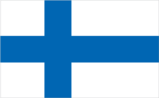
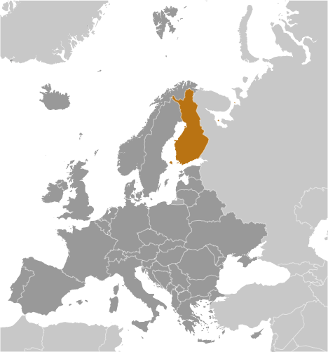
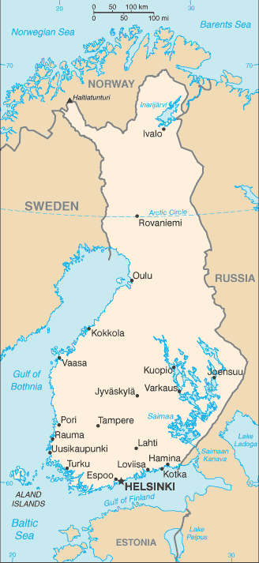

# Finland

## Introduction

**_Background:_**   
Finland was a province and then a grand duchy under Sweden from the 12th to the 19th centuries, and an autonomous grand duchy of Russia after 1809. It gained complete independence in 1917. During World War II, it successfully defended its independence through cooperation with Germany and resisted subsequent invasions by the Soviet Union - albeit with some loss of territory. In the subsequent half century, Finland transformed from a farm/forest economy to a diversified modern industrial economy; per capita income is among the highest in Western Europe. A member of the European Union since 1995, Finland was the only Nordic state to join the euro single currency at its initiation in January 1999. In the 21st century, the key features of Finland's modern welfare state are high quality education, promotion of equality, and a national social welfare system - currently challenged by an aging population and the fluctuations of an export-driven economy.

## Geography

**_Location:_**   
Northern Europe, bordering the Baltic Sea, Gulf of Bothnia, and Gulf of Finland, between Sweden and Russia

**_Geographic coordinates:_**   
64 00 N, 26 00 E

**_Map references:_**   
Europe

**_Area:_**   
**total:** 338,145 sq km   
**land:** 303,815 sq km   
**water:** 34,330 sq km

**_Area - comparative:_**   
slightly smaller than Montana

**_Land boundaries:_**   
**total:** 2,563 km   
**border countries:** Norway 709 km, Sweden 545 km, Russia 1,309 km

**_Coastline:_**   
1,250 km

**_Maritime claims:_**   
**territorial sea:** 12 nm (in the Gulf of Finland - 3 nm)   
**contiguous zone:** 24 nm   
**exclusive fishing zone:** 12 nm; extends to continental shelf boundary with Sweden   
**continental shelf:** 200 m depth or to the depth of exploitation

**_Climate:_**   
cold temperate; potentially subarctic but comparatively mild because of moderating influence of the North Atlantic Current, Baltic Sea, and more than 60,000 lakes

**_Terrain:_**   
mostly low, flat to rolling plains interspersed with lakes and low hills

**_Elevation extremes:_**   
**lowest point:** Baltic Sea 0 m   
**highest point:** Halti (alternatively Haltia, Haltitunturi, Haltiatunturi) 1,328 m

**_Natural resources:_**   
timber, iron ore, copper, lead, zinc, chromite, nickel, gold, silver, limestone

**_Land use:_**   
**arable land:** 6.65%   
**permanent crops:** 0.01%   
**other:** 93.34% (2011)

**_Irrigated land:_**   
685.8 sq km (2010)

**_Total renewable water resources:_**   
110 cu km (2011)

**_Freshwater withdrawal (domestic/industrial/agricultural):_**   
**total:** 1.63 cu km/yr (25%/72%/3%)   
**per capita:** 308.9 cu m/yr (2005)

**_Natural hazards:_**   
NA

**_Environment - current issues:_**   
air pollution from manufacturing and power plants contributing to acid rain; water pollution from industrial wastes, agricultural chemicals; habitat loss threatens wildlife populations

**_Environment - international agreements:_**   
**party to:** Air Pollution, Air Pollution-Nitrogen Oxides, Air Pollution-Persistent Organic Pollutants, Air Pollution-Sulfur 85, Air Pollution-Sulfur 94, Air Pollution-Volatile Organic Compounds, Antarctic-Environmental Protocol, Antarctic-Marine Living Resources, Antarctic Treaty, Biodiversity, Climate Change, Climate Change-Kyoto Protocol, Desertification, Endangered Species, Environmental Modification, Hazardous Wastes, Law of the Sea, Marine Dumping, Marine Life Conservation, Ozone Layer Protection, Ship Pollution, Tropical Timber 83, Tropical Timber 94, Wetlands, Whaling   
**signed, but not ratified:** none of the selected agreements

**_Geography - note:_**   
long boundary with Russia; Helsinki is northernmost national capital on European continent; population concentrated on small southwestern coastal plain

## People and Society

**_Nationality:_**   
**noun:** Finn(s)   
**adjective:** Finnish

**_Ethnic groups:_**   
Finn 93.4%, Swede 5.6%, Russian 0.5%, Estonian 0.3%, Roma (Gypsy) 0.1%, Sami 0.1% (2006)

**_Languages:_**   
Finnish (official) 94.2%, Swedish (official) 5.5%, other (small Sami- and Russian-speaking minorities) 0.2% (2012 est.)

**_Religions:_**   
Lutheran 78.4%, Orthodox 1.1%, other Christian 1.1%, other 0.2%, none 19.2% (2010 est.)

**_Population:_**   
5,268,799 (July 2014 est.)

**_Age structure:_**   
**0-14 years:** 15.8% (male 423,011/female 408,664)   
**15-24 years:** 12.1% (male 326,140/female 313,621)   
**25-54 years:** 38.1% (male 1,021,798/female 983,423)   
**55-64 years:** 14.2% (male 368,355/female 379,957)   
**65 years and over:** 19.2% (male 439,014/female 604,816) (2014 est.)

**_Dependency ratios:_**   
**total dependency ratio:** 56.8 %   
**youth dependency ratio:** 25.8 %   
**elderly dependency ratio:** 31 %   
**potential support ratio:** 3.2 (2014 est.)

**_Median age:_**   
**total:** 43.2 years   
**male:** 41.2 years   
**female:** 45 years (2014 est.)

**_Population growth rate:_**   
0.05% (2014 est.)

**_Birth rate:_**   
10.35 births/1,000 population (2014 est.)

**_Death rate:_**   
10.51 deaths/1,000 population (2014 est.)

**_Net migration rate:_**   
0.62 migrant(s)/1,000 population (2014 est.)

**_Urbanization:_**   
**urban population:** 83.7% of total population (2011)   
**rate of urbanization:** 0.47% annual rate of change (2010-15 est.)

**_Major urban areas - population:_**   
HELSINKI (capital) 1.134 million (2011)

**_Sex ratio:_**   
**at birth:** 1.04 male(s)/female   
**0-14 years:** 1.04 male(s)/female   
**15-24 years:** 1.04 male(s)/female   
**25-54 years:** 1.04 male(s)/female   
**55-64 years:** 0.96 male(s)/female   
**65 years and over:** 0.71 male(s)/female   
**total population:** 0.96 male(s)/female (2014 est.)

**_Mother's mean age at first birth:_**   
28.4 (2011 est.)

**_Maternal mortality rate:_**   
5 deaths/100,000 live births (2010)

**_Infant mortality rate:_**   
**total:** 3.36 deaths/1,000 live births   
**male:** 3.65 deaths/1,000 live births   
**female:** 3.06 deaths/1,000 live births (2014 est.)

**_Life expectancy at birth:_**   
**total population:** 79.69 years   
**male:** 76.24 years   
**female:** 83.29 years (2014 est.)

**_Total fertility rate:_**   
1.73 children born/woman (2014 est.)

**_Health expenditures:_**   
8.9% of GDP (2011)

**_Physicians density:_**   
2.9 physicians/1,000 population (2010)

**_Hospital bed density:_**   
5.9 beds/1,000 population (2010)

**_Drinking water source:_**   
**improved:** urban: 100% of population; rural: 100% of population; total: 100% of population   
**unimproved:** urban: 0% of population; rural: 0% of population; total: 0% of population (2012 est.)

**_Sanitation facility access:_**   
**improved:** urban: 100% of population; rural: 100% of population; total: 100% of population   
**unimproved:** urban: 0% of population; rural: 0% of population; total: 0% of population (2012 est.)

**_HIV/AIDS - adult prevalence rate:_**   
0.1% (2009 est.)

**_HIV/AIDS - people living with HIV/AIDS:_**   
2,600 (2009 est.)

**_HIV/AIDS - deaths:_**   
fewer than 100 (2009 est.)

**_Obesity - adult prevalence rate:_**   
23% (2008)

**_Education expenditures:_**   
6.8% of GDP (2010)

**_Literacy:_**   
**definition:** age 15 and over can read and write   
**total population:** 100%   
**male:** 100%   
**female:** 100% (2000 est.)

**_School life expectancy (primary to tertiary education):_**   
**total:** 17 years   
**male:** 16 years   
**female:** 18 years (2011)

**_Unemployment, youth ages 15-24:_**   
**total:** 17.7%   
**male:** 17.6%   
**female:** 17.9% (2012)

## Government

**_Country name:_**   
**conventional long form:** Republic of Finland   
**conventional short form:** Finland   
**local long form:** Suomen tasavalta/Republiken Finland   
**local short form:** Suomi/Finland

**_Government type:_**   
republic

**_Capital:_**   
**name:** Helsinki   
**geographic coordinates:** 60 10 N, 24 56 E   
**time difference:** UTC+2 (7 hours ahead of Washington, DC, during Standard Time)   
**daylight saving time:** +1hr, begins last Sunday in March; ends last Sunday in October

**_Administrative divisions:_**   
19 regions (maakunnat, singular - maakunta (Finnish); landskapen, singular - landskapet (Swedish)); Aland (Swedish), Ahvenanmaa (Finnish); Etela-Karjala (Finnish), Sodra Karelen (Swedish) [South Karelia]; Etela-Pohjanmaa (Finnish), Sodra Osterbotten (Swedish) [South Ostrobothnia]; Etela-Savo (Finnish), Sodra Savolax (Swedish) [South Savo]; Kanta-Hame (Finnish), Egentliga Tavastland (Swedish); Kainuu (Finnish), Kajanaland (Swedish); Keski-Pohjanmaa (Finnish), Mellersta Osterbotten (Swedish) [Central Ostrobothnia]; Keski-Suomi (Finnish), Mellersta Finland (Swedish) [Central Finland]; Kymenlaakso (Finnish), Kymmenedalen (Swedish); Lappi (Finnish), Lappland (Swedish); Paijat-Hame (Finnish), Paijanne-Tavastland (Swedish); Pirkanmaa (Finnish), Birkaland (Swedish) [Tampere]; Pohjanmaa (Finnish), Osterbotten (Swedish) [Ostrobothnia]; Pohjois-Karjala (Finnish), Norra Karelen (Swedish) [North Karelia]; Pohjois-Pohjanmaa (Finnish), Norra Osterbotten (Swedish) [North Ostrobothnia]; Pohjois-Savo (Finnish), Norra Savolax (Swedish) [North Savo]; Satakunta (Finnish and Swedish); Uusimaa (Finnish), Nyland (Swedish) [Newland]; Varsinais-Suomi (Finnish), Egentliga Finland (Swedish) [Southwest Finland]

**_Independence:_**   
6 December 1917 (from Russia)

**_National holiday:_**   
Independence Day, 6 December (1917)

**_Constitution:_**   
previous 1906, 1919; latest drafted 17 June 1997, approved by Parliament 11 June 1999, entered into force 1 March 2000; amended several times, last in 2011 (2011)

**_Legal system:_**   
civil law system based on the Swedish model

**_International law organization participation:_**   
accepts compulsory ICJ jurisdiction with reservations; accepts ICCt jurisdiction

**_Suffrage:_**   
18 years of age; universal

**_Executive branch:_**   
**chief of state:** President Sauli NIINISTO (since 1 March 2012)   
**head of government:** Prime Minister Jyrki KATAINEN (since 22 June 2011)   
**cabinet:** Council of State or Valtioneuvosto appointed by the president, responsible to parliament   
**elections:** president elected by popular vote for a six-year term (eligible for a second term); election last held on 5 February 2012 (next to be held in February 2018); the parliament elects a prime minister who is then appointed to office by the president   
**election results:** percent of vote - Sauli NIINISTO (Kok) 36.96%, Pekka HAAVISTO (Vihr) 18.76%, Paavo VAYRYNEN (Kesk) 17.53%, Timo SOINI (TF) 9.4%, Paavo LIPPONEN (SDP) 6.7%, Paavo ARHINMÄKI (Vas) 5.48%, Eva BIAUDET (SFP) 2.7%, Sari ESSAYAH (KD) 2.47%; a runoff election between NIINISTO and HAAVISTO was held 5 February 2012 - NIINISTO 62.59%, HAAVISTO 37.41%; Jyrki KATAINEN elected prime minister; election results 118-72   
**note:** government coalition - Kok, SDP, Vihr, SFP, Vas, and KD (2013)

**_Legislative branch:_**   
unicameral Parliament or Eduskunta (200 seats; members elected by popular vote on a proportional basis to serve four-year terms)   
**elections:** last held on 17 April 2011 (next to be held in April 2015)   
**election results:** percent of vote by party - Kok 20.4%, SDP 19.1%, PS 19.1%, Kesk 15.8%, Vas 8.1%, Vihr 7.3%, SFP 4.3%, KD 4%, other 1.9%; seats by party - Kok 44, SDP 42, TF 39, Kesk 35, Vas 14, Vihr 10, SFP 9, KD 6, other 1 (the constituency of Aland)

**_Judicial branch:_**   
**highest court(s):** Supreme Court or Korkein Oikeus (consists of the court president and 18 judges); Supreme Administrative Court (consists of 21 judges including the court president and organized into 3 chambers); note - Finland has a dual judicial system - courts with civil and criminal jurisdiction, and administrative courts with jurisdiction for litigation between individuals and administrative organs of the state and communities   
**judge selection and term of office:** Supreme Court and Supreme Administrative Court judges appointed by the president of the republic; judges serve until mandatory retirement at age 65   
**subordinate courts:** 6 Courts of Appeal; 8 regional administrative courts; 27 district courts; special courts for issues relating to markets, labor, insurance, impeachment, land, tenancy, and water rights

**_Political parties and leaders:_**   
Center Party or Kesk [Juha SIPILA]   
Christian Democrats or KD [Paivi RASANEN]   
Green League or Vihr [Ville NIINISTO]   
Left Alliance or Vas [Paavo ARHINMAKI]   
National Coalition Party or Kok [Jyrki KATAINEN]   
Social Democratic Party or SDP [Jutta URPILAINEN]   
Swedish People's Party or SFP [Carl HAGLUND]   
The Finns Party or PS [Timo SOINI]

**_International organization participation:_**   
ADB (nonregional member), AfDB (nonregional member), Arctic Council, Australia Group, BIS, CBSS, CD, CE, CERN, EAPC, EBRD, ECB, EIB, EITI (implementing country), EMU, ESA, EU, FAO, FATF, G-9, IADB, IAEA, IBRD, ICAO, ICC (national committees), ICRM, IDA, IEA, IFAD, IFC, IFRCS, IHO, ILO, IMF, IMO, IMSO, Interpol, IOC, IOM, IPU, ISO, ITSO, ITU, ITUC (NGOs), MIGA, MINUSMA, NC, NEA, NIB, NSG, OAS (observer), OECD, OPCW, OSCE, Pacific Alliance (observer), Paris Club, PCA, PFP, Schengen Convention, UN, UNCTAD, UNESCO, UNHCR, UNIDO, UNIFIL, UNMIL, UNMOGIP, UNRWA, UNTSO, UPU, WCO, WFTU (NGOs), WHO, WIPO, WMO, WTO, ZC

**_Diplomatic representation in the US:_**   
**chief of mission:** Ambassador Ritva KOUKKU-RONDE (since 1 September 2011)   
**chancery:** 3301 Massachusetts Avenue NW, Washington, DC 20008   
**telephone:** [1] (202) 298-5800   
**FAX:** [1] (202) 298-6030   
**consulate(s) general:** Los Angeles (Juha Pekka MARKKANEN), New York (Jukka PIETIKAINEN)

**_Diplomatic representation from the US:_**   
**chief of mission:** Ambassador Bruce J. ORECK (since 12 August 2009)   
**embassy:** Itainen Puistotie 14B, 00140 Helsinki   
**mailing address:** APO AE 09723   
**telephone:** [358] (9) 616250   
**FAX:** [358] (9) 6162 5800

**_Flag description:_**   
white with a blue cross extending to the edges of the flag; the vertical part of the cross is shifted to the hoist side in the style of the Dannebrog (Danish flag); the blue represents the thousands of lakes scattered across the country, while the white is for the snow that covers the land in winter

**_National symbol(s):_**   
lion

**_National anthem:_**   
**name:** "Maamme" (Our Land)   
**lyrics/music:** Johan Ludvig RUNEBERG/Fredrik PACIUS   
**note:** in use since 1848; although never officially adopted by law, the anthem has been popular since it was first sung by a student group in 1848; Estonia's anthem uses the same melody as that of Finland

## Economy

**_Economy - overview:_**   
Finland has a highly industrialized, largely free-market economy with per capita output almost as high as that of Austria, Belgium, the Netherlands, or Sweden. Trade is important, with exports accounting for over one-third of GDP in recent years. Finland is historically competitive in manufacturing - principally the wood, metals, engineering, telecommunications, and electronics industries. Finland excels in export of technology for mobile phones as well as promotion of startups in the ICT, gaming, cleantech, and biotechnology sectors. Except for timber and several minerals, Finland depends on imports of raw materials, energy, and some components for manufactured goods. Because of the climate, agricultural development is limited to maintaining self-sufficiency in basic products. Forestry, an important export earner, provides a secondary occupation for the rural population. Finland had been one of the best performing economies within the EU in recent years and its banks and financial markets avoided the worst of global financial crisis. However, the world slowdown hit exports and domestic demand hard in 2009, with Finland experiencing one of the deepest contractions in the euro zone. A recovery of exports, domestic trade, and household consumption stimulated economic growth in 2010-11, however, continued recession within the EU dampened the economy in 2012-13. The recession affected general government finances and the debt ratio, turning previously strong budget surpluses into deficits, but Finland took action to ensure it that it met the EU deficit targets in 2013 and retained its triple-A credit rating. Finland's main challenge will be to stimulate growth while faced with weak export demand in the EU and its own government austerity measures. Longer-term, Finland must address a rapidly aging population and decreasing productivity in traditional industries that threaten competitiveness, fiscal sustainability, and economic growth.

**_GDP (purchasing power parity):_**   
$195.5 billion (2013 est.)   
$196.8 billion (2012 est.)   
$198.4 billion (2011 est.)   
**note:** data are in 2013 US dollars

**_GDP (official exchange rate):_**   
$259.6 billion (2013 est.)

**_GDP - real growth rate:_**   
-0.6% (2013 est.)   
-0.8% (2012 est.)   
2.7% (2011 est.)

**_GDP - per capita (PPP):_**   
$35,900 (2013 est.)   
$36,300 (2012 est.)   
$36,700 (2011 est.)   
**note:** data are in 2013 US dollars

**_Gross national saving:_**   
17.9% of GDP (2013 est.)   
19.6% of GDP (2012 est.)   
21.2% of GDP (2011 est.)

**_GDP - composition, by end use:_**   
**household consumption:** 56.3%   
**government consumption:** 24.3%   
**investment in fixed capital:** 18.3%   
**investment in inventories:** 0.3%   
**exports of goods and services:** 38%   
**imports of goods and services:** -37.3%; (2013 est.)

**_GDP - composition, by sector of origin:_**   
**agriculture:** 2.9%   
**industry:** 25.1%   
**services:** 71.9% (2013 est.)

**_Agriculture - products:_**   
barley, wheat, sugar beets, potatoes; dairy cattle; fish

**_Industries:_**   
metals and metal products, electronics, machinery and scientific instruments, shipbuilding, pulp and paper, foodstuffs, chemicals, textiles, clothing

**_Industrial production growth rate:_**   
-4.2% (2013 est.)

**_Labor force:_**   
2.685 million (2013 est.)

**_Labor force - by occupation:_**   
**agriculture and forestry:** 4.4%   
**industry:** 15.5%   
**construction:** 7.1%   
**commerce:** 21.3%   
**finance, insurance, and business services:** 13.3%   
**transport and communications:** 9.9%   
**public services:** 28.5% (2011)

**_Unemployment rate:_**   
8.1% (2013 est.)   
7.8% (2012 est.)

**_Population below poverty line:_**   
NA%

**_Household income or consumption by percentage share:_**   
**lowest 10%:** 3.6%   
**highest 10%:** 24.7% (2007)

**_Distribution of family income - Gini index:_**   
26.8 (2008)   
25.6 (1991)

**_Budget:_**   
**revenues:** $139.4 billion   
**expenditures:** $145.3 billion   
**note:** Central Government Budget (2013 est.)

**_Taxes and other revenues:_**   
53.7% of GDP (2013 est.)

**_Budget surplus (+) or deficit (-):_**   
-2.3% of GDP (2013 est.)

**_Public debt:_**   
56.5% of GDP (2013 est.)   
53.1% of GDP (2012 est.)   
**note:** data cover general government debt, and includes debt instruments issued (or owned) by government entities other than the treasury; the data include treasury debt held by foreign entities; the data include debt issued by subnational entities, as well as intra-governmental debt; intra-governmental debt consists of treasury borrowings from surpluses in the social funds, such as for retirement, medical care, and unemployment; debt instruments for the social funds are not sold at public auctions

**_Fiscal year:_**   
calendar year

**_Inflation rate (consumer prices):_**   
2.2% (2013 est.)   
3.2% (2012 est.)

**_Central bank discount rate:_**   
0.75% (31 December 2013)   
1.5% (31 December 2010)   
**note:** this is the European Central Bank's rate on the marginal lending facility, which offers overnight credit to banks in the euro area

**_Commercial bank prime lending rate:_**   
2% (31 December 2013 est.)   
2.06% (31 December 2012 est.)

**_Stock of narrow money:_**   
$130.8 billion (31 December 2013 est.)   
$126.5 billion (31 December 2012 est.)   
**note:** see entry for the European Union for money supply in the euro area; the European Central Bank (ECB) controls monetary policy for the 17 members of the Economic and Monetary Union (EMU); individual members of the EMU do not control the quantity of money circulating within their own borders

**_Stock of broad money:_**   
$183.3 billion (31 December 2013 est.)   
$182.4 billion (31 December 2012 est.)

**_Stock of domestic credit:_**   
$267.8 billion (31 December 2013 est.)   
$265.3 billion (31 December 2012 est.)

**_Market value of publicly traded shares:_**   
$158.7 billion (31 December 2012 est.)   
$143.1 billion (31 December 2011)   
$118.2 billion (31 December 2010 est.)

**_Current account balance:_**   
-$2 billion (2013 est.)   
-$3.679 billion (2012 est.)

**_Exports:_**   
$75.7 billion (2013 est.)   
$76.46 billion (2012 est.)

**_Exports - commodities:_**   
electrical and optical equipment, machinery, transport equipment, paper and pulp, chemicals, basic metals; timber

**_Exports - partners:_**   
Sweden 11.1%, Russia 9.9%, Germany 9.3%, Netherlands 6.3%, US 6.2%, UK 5.1%, China 4.6% (2012)

**_Imports:_**   
$70.67 billion (2013 est.)   
$72.13 billion (2012 est.)

**_Imports - commodities:_**   
foodstuffs, petroleum and petroleum products, chemicals, transport equipment, iron and steel, machinery, computers, electronic industry products, textile yarn and fabrics, grains

**_Imports - partners:_**   
Russia 17.7%, Sweden 14.8%, Germany 13.9%, Netherlands 8.1%, China 4.4% (2012)

**_Reserves of foreign exchange and gold:_**   
$10.6 billion (31 December 2013 est.)   
$11.08 billion (31 December 2012 est.)

**_Debt - external:_**   
$586.9 billion (31 December 2012 est.)   
$478.5 billion (31 December 2011)

**_Stock of direct foreign investment - at home:_**   
$138.7 billion (31 December 2013 est.)   
$134.4 billion (31 December 2012 est.)

**_Stock of direct foreign investment - abroad:_**   
$197.2 billion (31 December 2013 est.)   
$186.7 billion (31 December 2012 est.)

**_Exchange rates:_**   
euros (EUR) per US dollar -   
0.7634 (2013 est.)   
0.7752 (2012 est.)   
0.755 (2010 est.)   
0.7198 (2009 est.)   
0.6827 (2008 est.)

## Energy

**_Electricity - production:_**   
70.34 billion kWh (2011 est.)

**_Electricity - consumption:_**   
84.83 billion kWh (2010 est.)

**_Electricity - exports:_**   
1.645 billion kWh (2012 est.)

**_Electricity - imports:_**   
19.09 billion kWh (2012 est.)

**_Electricity - installed generating capacity:_**   
16.68 million kW (2010 est.)

**_Electricity - from fossil fuels:_**   
52.3% of total installed capacity (2010 est.)

**_Electricity - from nuclear fuels:_**   
16.2% of total installed capacity (2010 est.)

**_Electricity - from hydroelectric plants:_**   
18.8% of total installed capacity (2010 est.)

**_Electricity - from other renewable sources:_**   
12.7% of total installed capacity (2010 est.)

**_Crude oil - production:_**   
13,530 bbl/day (2012 est.)

**_Crude oil - exports:_**   
0 bbl/day (2010 est.)

**_Crude oil - imports:_**   
214,700 bbl/day (2010 est.)

**_Crude oil - proved reserves:_**   
0 bbl (1 January 2013 est.)

**_Refined petroleum products - production:_**   
282,300 bbl/day (2010 est.)

**_Refined petroleum products - consumption:_**   
204,800 bbl/day (2011 est.)

**_Refined petroleum products - exports:_**   
144,400 bbl/day (2010 est.)

**_Refined petroleum products - imports:_**   
113,800 bbl/day (2010 est.)

**_Natural gas - production:_**   
0 cu m (2011 est.)

**_Natural gas - consumption:_**   
4.7 billion cu m (2010 est.)

**_Natural gas - exports:_**   
0 cu m (2011 est.)

**_Natural gas - imports:_**   
3.661 billion cu m (2012 est.)

**_Natural gas - proved reserves:_**   
0 cu m (1 January 2013 est.)

**_Carbon dioxide emissions from consumption of energy:_**   
54.06 million Mt (2011 est.)

## Communications

**_Telephones - main lines in use:_**   
890,000 (2012)

**_Telephones - mobile cellular:_**   
9.32 million (2012)

**_Telephone system:_**   
**general assessment:** modern system with excellent service   
**domestic:** digital fiber-optic fixed-line network and an extensive mobile-cellular network provide domestic needs   
**international:** country code - 358; submarine cables provide links to Estonia and Sweden; satellite earth stations - access to Intelsat transmission service via a Swedish satellite earth station, 1 Inmarsat (Atlantic and Indian Ocean regions); note - Finland shares the Inmarsat earth station with the other Nordic countries (Denmark, Iceland, Norway, and Sweden) (2011)

**_Broadcast media:_**   
a mix of publicly operated TV stations and privately owned TV stations; the 2 publicly owned TV stations recently expanded services and the largest private TV station has introduced several special-interest pay-TV channels; cable and satellite multi-channel subscription services are available; all TV signals have been broadcast digitally since September 2007; analog broadcasts via cable networks were terminated in February 2008; public broadcasting maintains a network of 13 national and 25 regional radio stations; a large number of private radio broadcasters (2008)

**_Internet country code:_**   
.fi; note - Aland Islands assigned .ax

**_Internet hosts:_**   
4.763 million (2012)

**_Internet users:_**   
4.393 million (2009)

## Transportation

**_Airports:_**   
148 (2013)

**_Airports - with paved runways:_**   
**total:** 74   
**over 3,047 m:** 3   
**2,438 to 3,047 m:** 26   
**1,524 to 2,437 m:** 10   
**914 to 1,523 m:** 21   
**under 914 m:** 14 (2013)

**_Airports - with unpaved runways:_**   
**total:** 74   
**914 to 1,523 m:** 3   
**under 914 m:** 71 (2013)

**_Pipelines:_**   
gas 1,689 km (2010)

**_Railways:_**   
**total:** 5,944 km   
**broad gauge:** 5,944 km 1.524-m gauge (3,067 km electrified) (2013)

**_Roadways:_**   
**total:** 78,000 km   
**paved:** 50,000 km (includes 700 km of expressways)   
**unpaved:** 28,000 km   
**note:** there 78,000 km of highways, 350,000 km of private and forest roads, and 26,000 km of urban roads giving Finland a total road network of 450,000 km (2012)

**_Waterways:_**   
8,000 km (includes Saimaa Canal system of 3,577 km; southern part leased from Russia; water transport is used frequently in the summer and is widely replaced with sledges on the ice in winter; there are 187,888 lakes in Finland that cover 31,500 km); Finand also maintains 8,200 km of coastal fairways (2013)

**_Merchant marine:_**   
**total:** 97   
**by type:** bulk carrier 2, cargo 25, carrier 1, chemical tanker 6, container 3, passenger 5, passenger/cargo 16, petroleum tanker 5, roll on/roll off 31, vehicle carrier 3   
**foreign-owned:** 5 (Cyprus 1, Estonia 2, Iceland 1, Sweden 1)   
**registered in other countries:** 47 (Bahamas 8, Germany 3, Gibraltar 2, Malta 3, Netherlands 13, Panama 2, Sweden 16) (2010)

**_Ports and terminals:_**   
**major seaport(s):** Helsinki, Kotka, Naantali, Porvoo, Raahe, Rauma

## Military

**_Military branches:_**   
Finnish Defense Forces (FDF): Army (Puolustusvoimat), Navy (Merivoimat; includes Coastal Defense Forces), Air Force (Ilmavoimat) (2013)

**_Military service age and obligation:_**   
18 years of age for male voluntary and compulsory - and female voluntary - national military and nonmilitary service; service obligation 6-12 months; military obligation to age 60 (2012)

**_Manpower available for military service:_**   
**males age 16-49:** 1,155,368   
**females age 16-49:** 1,106,193 (2010 est.)

**_Manpower fit for military service:_**   
**males age 16-49:** 955,151   
**females age 16-49:** 912,983 (2010 est.)

**_Manpower reaching militarily significant age annually:_**   
**male:** 32,599   
**female:** 31,416 (2010 est.)

**_Military expenditures:_**   
1.47% of GDP (2012)   
1.42% of GDP (2011)   
1.47% of GDP (2010)

## Transnational Issues

**_Disputes - international:_**   
various groups in Finland advocate restoration of Karelia and other areas ceded to the Soviet Union, but the Finnish Government asserts no territorial demands

............................................................   
_Page last updated on June 22, 2014_
