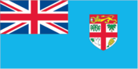
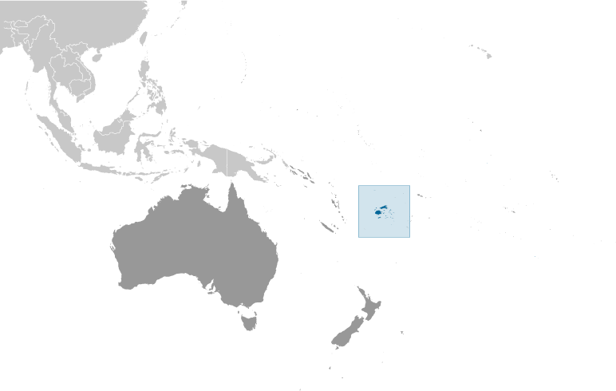
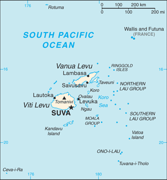

# Fiji

## Introduction

**_Background:_**   
Fiji became independent in 1970 after nearly a century as a British colony. Democratic rule was interrupted by two military coups in 1987 caused by concern over a government perceived as dominated by the Indian community (descendants of contract laborers brought to the islands by the British in the 19th century). The coups and a 1990 constitution that cemented native Melanesian control of Fiji led to heavy Indian emigration; the population loss resulted in economic difficulties, but ensured that Melanesians became the majority. A new constitution enacted in 1997 was more equitable. Free and peaceful elections in 1999 resulted in a government led by an Indo-Fijian, but a civilian-led coup in May 2000 ushered in a prolonged period of political turmoil. Parliamentary elections held in August 2001 provided Fiji with a democratically elected government led by Prime Minister Laisenia QARASE. Re-elected in May 2006, QARASE was ousted in a December 2006 military coup led by Commodore Voreqe BAINIMARAMA, who initially appointed himself acting president but in January 2007 became interim prime minister. Since taking power BAINIMARAMA has neutralized his opponents, crippled Fiji's democratic institutions, and initially refused to hold elections. In 2012, he promised to hold elections in 2014.

## Geography

**_Location:_**   
Oceania, island group in the South Pacific Ocean, about two-thirds of the way from Hawaii to New Zealand

**_Geographic coordinates:_**   
18 00 S, 175 00 E

**_Map references:_**   
Oceania

**_Area:_**   
**total:** 18,274 sq km   
**land:** 18,274 sq km   
**water:** 0 sq km

**_Area - comparative:_**   
slightly smaller than New Jersey

**_Land boundaries:_**   
0 km

**_Coastline:_**   
1,129 km

**_Maritime claims:_**   
measured from claimed archipelagic straight baselines   
**territorial sea:** 12 nm   
**exclusive economic zone:** 200 nm   
**continental shelf:** 200 m depth or to the depth of exploitation; rectilinear shelf claim added

**_Climate:_**   
tropical marine; only slight seasonal temperature variation

**_Terrain:_**   
mostly mountains of volcanic origin

**_Elevation extremes:_**   
**lowest point:** Pacific Ocean 0 m   
**highest point:** Tomanivi 1,324 m

**_Natural resources:_**   
timber, fish, gold, copper, offshore oil potential, hydropower

**_Land use:_**   
**arable land:** 9.17%   
**permanent crops:** 4.65%   
**other:** 86.17% (2011)

**_Irrigated land:_**   
30 sq km (2003)

**_Total renewable water resources:_**   
28.55 cu km (2011)

**_Freshwater withdrawal (domestic/industrial/agricultural):_**   
**total:** 0.08 cu km/yr (30%/11%/59%)   
**per capita:** 100.1 cu m/yr (2005)

**_Natural hazards:_**   
cyclonic storms can occur from November to January

**_Environment - current issues:_**   
deforestation; soil erosion

**_Environment - international agreements:_**   
**party to:** Biodiversity, Climate Change, Climate Change-Kyoto Protocol, Desertification, Endangered Species, Law of the Sea, Marine Life Conservation, Ozone Layer Protection, Tropical Timber 83, Tropical Timber 94, Wetlands   
**signed, but not ratified:** none of the selected agreements

**_Geography - note:_**   
includes 332 islands; approximately 110 are inhabited

## People and Society

**_Nationality:_**   
**noun:** Fijian(s)   
**adjective:** Fijian

**_Ethnic groups:_**   
iTaukei 56.8% (predominantly Melanesian with a Polynesian admixture), Indian 37.5%, Rotuman 1.2%, other 4.5% (European, part European, other Pacific Islanders, Chinese)   
**note:** a 2010 law replaces 'Fijian' with 'iTuakei' when referring to the original and native settlers of Fiji (2007 est.)

**_Languages:_**   
English (official), Fijian (official), Hindustani

**_Religions:_**   
Protestant 45% (Methodist 34.6%, Assembly of God 5.7%, Seventh Day Adventist 3.9%, and Anglican 0.8%), Hindu 27.9%, other Christian 10.4%, Roman Catholic 9.1%, Muslim 6.3%, Sikh 0.3%, other 0.3%, none 0.8% (2007 est.)

**_Population:_**   
903,207 (July 2014 est.)

**_Age structure:_**   
**0-14 years:** 28.2% (male 130,013/female 124,423)   
**15-24 years:** 17.1% (male 78,751/female 75,358)   
**25-54 years:** 41.1% (male 190,035/female 181,268)   
**55-64 years:** 7.8% (male 35,616/female 34,920)   
**65 years and over:** 5.6% (male 24,282/female 28,541) (2014 est.)

**_Dependency ratios:_**   
**total dependency ratio:** 52.5 %   
**youth dependency ratio:** 43.9 %   
**elderly dependency ratio:** 8.6 %   
**potential support ratio:** 11.6 (2014 est.)

**_Median age:_**   
**total:** 27.9 years   
**male:** 27.7 years   
**female:** 28.1 years (2014 est.)

**_Population growth rate:_**   
0.7% (2014 est.)

**_Birth rate:_**   
19.86 births/1,000 population (2014 est.)

**_Death rate:_**   
6 deaths/1,000 population (2014 est.)

**_Net migration rate:_**   
-6.86 migrant(s)/1,000 population (2014 est.)

**_Urbanization:_**   
**urban population:** 52.2% of total population (2011)   
**rate of urbanization:** 1.55% annual rate of change (2010-15 est.)

**_Major urban areas - population:_**   
SUVA (capital) 177,000 (2011)

**_Sex ratio:_**   
**at birth:** 1.05 male(s)/female   
**0-14 years:** 1.05 male(s)/female   
**15-24 years:** 1.05 male(s)/female   
**25-54 years:** 1.05 male(s)/female   
**55-64 years:** 1.03 male(s)/female   
**65 years and over:** 0.85 male(s)/female   
**total population:** 1.03 male(s)/female (2014 est.)

**_Maternal mortality rate:_**   
26 deaths/100,000 live births (2010)

**_Infant mortality rate:_**   
**total:** 10.2 deaths/1,000 live births   
**male:** 11.24 deaths/1,000 live births   
**female:** 9.1 deaths/1,000 live births (2014 est.)

**_Life expectancy at birth:_**   
**total population:** 72.15 years   
**male:** 69.53 years   
**female:** 74.91 years (2014 est.)

**_Total fertility rate:_**   
2.51 children born/woman (2014 est.)

**_Health expenditures:_**   
3.8% of GDP (2011)

**_Physicians density:_**   
0.43 physicians/1,000 population (2009)

**_Hospital bed density:_**   
2.1 beds/1,000 population (2009)

**_Drinking water source:_**   
**improved:** urban: 100% of population; rural: 92.2% of population; total: 96.3% of population   
**unimproved:** urban: 0% of population; rural: 7.8% of population; total: 3.7% of population (2012 est.)

**_Sanitation facility access:_**   
**improved:** urban: 92.1% of population; rural: 81.7% of population; total: 87.2% of population   
**unimproved:** urban: 7.9% of population; rural: 18.3% of population; total: 12.8% of population (2012 est.)

**_HIV/AIDS - adult prevalence rate:_**   
0.2% (2012 est.)

**_HIV/AIDS - people living with HIV/AIDS:_**   
900 (2012 est.)

**_HIV/AIDS - deaths:_**   
fewer than 100 (2009 est.)

**_Obesity - adult prevalence rate:_**   
30.6% (2008)

**_Children under the age of 5 years underweight:_**   
5.3% (2004)

**_Education expenditures:_**   
4.2% of GDP (2011)

**_Literacy:_**   
**definition:** age 15 and over can read and write   
**total population:** 93.7%   
**male:** 95.5%   
**female:** 91.9% (2003 est.)

**_School life expectancy (primary to tertiary education):_**   
**total:** 16 years (2011)

## Government

**_Country name:_**   
**conventional long form:** Republic of Fiji   
**conventional short form:** Fiji   
**local long form:** Republic of Fiji/Matanitu ko Viti   
**local short form:** Fiji/Viti

**_Government type:_**   
republic

**_Capital:_**   
**name:** Suva (on Viti Levu)   
**geographic coordinates:** 18 08 S, 178 25 E   
**time difference:** UTC+12 (17 hours ahead of Washington, DC, during Standard Time)   
**daylight saving time:** +1hr, begins fourth Sunday in October; ends third Sunday in January

**_Administrative divisions:_**   
14 provinces and 1 dependency\*; Ba, Bua, Cakaudrove, Kadavu, Lau, Lomaiviti, Macuata, Nadroga and Navosa, Naitasiri, Namosi, Ra, Rewa, Rotuma\*, Serua, Tailevu

**_Independence:_**   
10 October 1970 (from the UK)

**_National holiday:_**   
Independence Day, second Monday of October (1970)

**_Constitution:_**   
several previous; latest signed into law September 2013 (2013)

**_Legal system:_**   
common law system based on the English model

**_International law organization participation:_**   
has not submitted an ICJ jurisdiction declaration; accepts ICCt jurisdiction

**_Suffrage:_**   
18 years of age; universal

**_Executive branch:_**   
**chief of state:** President Ratu Epeli NAILATIKAU (since 30 July 2009)   
**head of government:** Prime Minister Laisenia QARASE (since 10 September 2000); note - although QARASE is still the legal prime minister, he has been confined to his home island; former President ILOILOVATU appointed Commodore Voreqe "Frank" BAINIMARAMA interim prime minister under the military regime   
**cabinet:** Cabinet appointed by the prime minister from among the members of Parliament and responsible to Parliament; note - coup leader Commodore Voreqe BAINIMARAMA has appointed an interim cabinet   
**elections:** under the constitution, president elected by the Great Council of Chiefs for a five-year term (eligible for a second term); in 2007 the Great Council of Chiefs was suspended from its role in electing the president; prime minister appointed by the president   
**election results:** Ratu Epeli NAILATIKAU was appointed by Chief Justice Anthony GATES

**_Legislative branch:_**   
bicameral Parliament consists of the Senate (32 seats; 14 members appointed by the president on the advice of the Great Council of Chiefs, 9 appointed by the president on the advice of the Prime Minister, 8 on the advice of the opposition leader, and 1 appointed on the advice of the council of Rotuma) and the House of Representatives (71 seats; 23 members reserved for ethnic Fijians, 19 reserved for ethnic Indians, 3 reserved for other ethnic groups, 1 reserved for the council of Rotuma constituency encompassing the whole of Fiji, and 25 open seats; members serve five-year terms)   
**elections:** House of Representatives - last held on 6-13 May 2006 (long delayed, the next elections will be held 17 September 2014)   
**election results:** House of Representatives - percent of vote by party - SDL 44.6%, FLP 39.2%, UPP 0.8%, independents 4.9%, other 10.5%; seats by party - SDL 36, FLP 31, UPP 2, independents 2

**_Judicial branch:_**   
**highest court(s):** Supreme Court (consists of the chief justice, all justices of the Court of Appeal, and judges appointed specifically as Supreme Court judges); Court of Appeal (consists of the court president, all puisne judges of the High Court, and judges specifically appointed to the Court of Appeal); High Court (chaired by the chief justice and includes a minimum of 10 puisne judges; High Court organized into civil, criminal, family, employment, and tax divisions); note - in 1987, the Supreme Court assumed functions formerly performed by the Judicial Committee of the Privy Council (in London)   
**judge selection and term of office:** chief justice appointed by the president of Fiji on the advice of the prime minister following consultation with the parliamentary leader of the opposition; judges of the Supreme Court, the president of the Court of Appeal, the justices of the Court of Appeal, and puisne judges of the High Court are appointed by the president of Fiji, upon the nomination of the Judicial Service Commission, after consulting with the cabinet minister and the committee of the House of Representatives responsible for the administration of justice; the chief justice, Supreme Court judges, and justices of Appeal generally required to retire at age 70, but may be waived for one or more sessions of the court; puisine judges appointed for not less than 4 years nor more than 7 years with mandatory retirement at age 65   
**subordinate courts:** Magistrates' Court (organized into civil, criminal, juvenile, and small claims divisions)

**_Political parties and leaders:_**   
Dodonu Ni Taukei Party or DNT [Fereti S. DEWA]   
Fiji Democratic Party or FDP [Filipe BOLE] (a merger of the Christian Democrat Alliance or VLV [Poesci Waqalevu BUNE], Fijian Association Party or FAP, Fijian Political Party or SVT [Sitiveni RABUKA] (primarily Fijian), and New Labor Unity Party or NLUP [Ofa SWANN])   
Fiji Labor Party or FLP [Mahendra CHAUDHRY]   
General Voters Party or GVP (became part of United General Party)   
Girmit Heritage Party or GHP   
Justice and Freedom Party or AIM   
Lio 'On Famor Rotuma Party or LFR   
National Federation Party or NFP [Pramond RAE] (primarily Indian)   
Nationalist Vanua Takolavo Party or NVTLP [Saula TELAWA]   
Party of National Unity or PANU [Ponipate LESAVUA]   
Party of the Truth or POTT   
United Fiji Party/Sogosogo Duavata ni Lewenivanua or SDL [Laisenia QARASE]   
United Peoples Party or UPP [Millis Mick BEDDOES]

**_Political pressure groups and leaders:_**   
Group Against Racial Discrimination or GARD [Dr. Anirudk SINGH] (for restoration of a democratic government)   
Viti Landowners Association

**_International organization participation:_**   
ACP, ADB, AOSIS, C (suspended), CP, FAO, G-77, IAEA, IBRD, ICAO, ICRM, IDA, IFAD, IFC, IFRCS, IHO, ILO, IMF, IMO, Interpol, IOC, ISO, ITSO, ITU, ITUC (NGOs), MIGA, NAM, OPCW, PCA, PIF, Sparteca (suspended), SPC, UN, UNCTAD, UNESCO, UNIDO, UNMISS, UNMIT, UNWTO, UPU, WCO, WFTU (NGOs), WHO, WIPO, WMO, WTO

**_Diplomatic representation in the US:_**   
**chief of mission:** Ambassador Winston THOMPSON (since 20 April 2009)   
**chancery:** 2000 M Street, NW, Suite 710, Washington, DC 20036   
**telephone:** [1] (202) 466-8320   
**FAX:** [1] (202) 466-8325

**_Diplomatic representation from the US:_**   
**chief of mission:** Ambassador Frankie A. REED (since 15 October 2011) note - also accredited to Kiribati, Nauru, Tonga, and Tuvalu   
**embassy:** 158 Princes Rd, Tamavua   
**mailing address:** P. O. Box 218, Suva   
**telephone:** [679] 331-4466   
**FAX:** [679] 330-2267

**_Flag description:_**   
light blue with the flag of the UK in the upper hoist-side quadrant and the Fijian shield centered on the outer half of the flag; the blue symbolizes the Pacific ocean and the Union Jack reflects the links with Great Britain; the shield - taken from Fiji's coat of arms - depicts a yellow lion above a white field quartered by the cross of Saint George; the four quarters depict stalks of sugarcane, a palm tree, bananas, and a white dove

**_National anthem:_**   
**name:** "God Bless Fiji"   
**lyrics/music:** Michael Francis Alexander PRESCOTT/C. Austin MILES (adapted by Michael Francis Alexander PRESCOTT)   
**note:** adopted 1970; the anthem is known in Fijian as "Meda Dau Doka" (Let Us Show Pride); adapted from the hymn, "Dwelling in Beulah Land," the anthem's English lyrics are generally sung, although they differ in meaning from the official Fijian lyrics

## Economy

**_Economy - overview:_**   
Fiji, endowed with forest, mineral, and fish resources, is one of the most developed of the Pacific island economies though still with a large subsistence sector. Sugar exports, remittances from Fijians working abroad, and a growing tourist industry - with 400,000 to 500,000 tourists annually - are the major sources of foreign exchange. Fiji's sugar has special access to European Union markets but will be harmed by the EU's decision to cut sugar subsidies. Sugar processing makes up one-third of industrial activity but is not efficient. Fiji's tourism industry was damaged by the December 2006 coup and is facing an uncertain recovery time. In 2007 tourist arrivals were down almost 6%, with substantial job losses in the service sector, and GDP dipped. The coup has created a difficult business climate. The EU has suspended all aid until the interim government takes steps toward new elections. Long-term problems include low investment, uncertain land ownership rights, and the government's inability to manage its budget. Overseas remittances from Fijians working in Kuwait and Iraq have decreased significantly. Fiji's current account deficit peaked at 23% of GDP in 2006, and declined to less than 12% of GDP in 2013.

**_GDP (purchasing power parity):_**   
$4.45 billion (2013 est.)   
$4.319 billion (2012 est.)   
$4.226 billion (2011 est.)   
**note:** data are in 2013 US dollars

**_GDP (official exchange rate):_**   
$4.218 billion (2013 est.)

**_GDP - real growth rate:_**   
3% (2013 est.)   
2.2% (2012 est.)   
1.9% (2011 est.)

**_GDP - per capita (PPP):_**   
$4,900 (2013 est.)   
$4,800 (2012 est.)   
$4,700 (2011 est.)   
**note:** data are in 2013 US dollars

**_GDP - composition, by end use:_**   
**household consumption:** 90.4%   
**government consumption:** 16%   
**investment in fixed capital:** 22.7%   
**investment in inventories:** 0%   
**exports of goods and services:** 39.7%   
**imports of goods and services:** -68.8%; (2013 est.)

**_GDP - composition, by sector of origin:_**   
**agriculture:** 11.7%   
**industry:** 18.1%   
**services:** 70.2% (2013 est.)

**_Agriculture - products:_**   
sugarcane, coconuts, cassava (manioc, tapioca), rice, sweet potatoes, bananas; cattle, pigs, horses, goats; fish

**_Industries:_**   
tourism, sugar, clothing, copra, gold, silver, lumber, small cottage industries

**_Industrial production growth rate:_**   
2.5% (2013 est.)

**_Labor force:_**   
335,000 (2007 est.)

**_Labor force - by occupation:_**   
**agriculture:** 70%   
**industry and services:** 30% (2001 est.)

**_Unemployment rate:_**   
7.6% (1999)

**_Population below poverty line:_**   
31% (2009 est.)

**_Household income or consumption by percentage share:_**   
**lowest 10%:** 2.6%   
**highest 10%:** 34.9% (2009 est.)

**_Budget:_**   
**revenues:** $1.084 billion   
**expenditures:** $1.192 billion (2013 est.)

**_Taxes and other revenues:_**   
25.7% of GDP (2013 est.)

**_Budget surplus (+) or deficit (-):_**   
-2.6% of GDP (2013 est.)

**_Public debt:_**   
56.2% of GDP (2013 est.)   
53.5% of GDP (2012 est.)

**_Fiscal year:_**   
calendar year

**_Inflation rate (consumer prices):_**   
3% (2013 est.)   
4.4% (2012 est.)

**_Central bank discount rate:_**   
1.75% (31 December 2010 est.)   
3% (31 December 2009 est.)

**_Commercial bank prime lending rate:_**   
6.2% (31 December 2013 est.)   
7% (31 December 2012 est.)

**_Stock of narrow money:_**   
$1.549 billion (31 December 2013 est.)   
$1.453 billion (31 December 2012 est.)

**_Stock of broad money:_**   
$2.697 billion (31 December 2013 est.)   
$2.578 billion (31 December 2012 est.)

**_Stock of domestic credit:_**   
$2.168 billion (31 December 2013 est.)   
$1.958 billion (31 December 2012 est.)

**_Market value of publicly traded shares:_**   
$452.5 million (31 December 2012 est.)   
$392.2 million (31 December 2011)   
$418.8 million (31 December 2010 est.)

**_Current account balance:_**   
-$492.3 million (2013 est.)   
-$425.1 million (2012 est.)

**_Exports:_**   
$1.026 billion (2013 est.)   
$932.4 million (2012 est.)

**_Exports - commodities:_**   
sugar, garments, gold, timber, fish, molasses, coconut oil

**_Exports - partners:_**   
US 14.6%, Australia 13.2%, Japan 6.9%, Samoa 5.8%, Tonga 5.1% (2012)

**_Imports:_**   
$2.054 billion (2013 est.)   
$1.867 billion (2012 est.)

**_Imports - commodities:_**   
manufactured goods, machinery and transport equipment, petroleum products, food, chemicals

**_Imports - partners:_**   
Singapore 32.8%, Australia 15.5%, NZ 14.5%, China 10.7% (2012)

**_Reserves of foreign exchange and gold:_**   
$963.7 million (31 December 2013 est.)   
$921.4 million (31 December 2012 est.)

**_Debt - external:_**   
$779.9 million (31 December 2013 est.)   
$685.5 million (31 December 2012 est.)

**_Stock of direct foreign investment - at home:_**   
$3.17 billion (31 December 2013 est.)   
$2.903 billion (31 December 2012 est.)

**_Stock of direct foreign investment - abroad:_**   
$43.03 million (31 December 2013 est.)   
$44.08 million (31 December 2012 est.)

**_Exchange rates:_**   
Fijian dollars (FJD) per US dollar -   
1.845 (2013 est.)   
1.7899 (2012 est.)   
1.9183 (2010 est.)

## Energy

**_Electricity - production:_**   
836.1 million kWh (2011 est.)

**_Electricity - consumption:_**   
808.3 million kWh (2010 est.)

**_Electricity - exports:_**   
0 kWh (2012 est.)

**_Electricity - imports:_**   
0 kWh (2012 est.)

**_Electricity - installed generating capacity:_**   
245,100 kW (2010 est.)

**_Electricity - from fossil fuels:_**   
49% of total installed capacity (2010 est.)

**_Electricity - from nuclear fuels:_**   
0% of total installed capacity (2010 est.)

**_Electricity - from hydroelectric plants:_**   
45.3% of total installed capacity (2010 est.)

**_Electricity - from other renewable sources:_**   
5.7% of total installed capacity (2010 est.)

**_Crude oil - production:_**   
30 bbl/day (2012 est.)

**_Crude oil - exports:_**   
0 bbl/day (2010 est.)

**_Crude oil - imports:_**   
0 bbl/day (2010 est.)

**_Crude oil - proved reserves:_**   
0 bbl (1 January 2013 est.)

**_Refined petroleum products - production:_**   
0 bbl/day (2010 est.)

**_Refined petroleum products - consumption:_**   
17,810 bbl/day (2011 est.)

**_Refined petroleum products - exports:_**   
692 bbl/day (2010 est.)

**_Refined petroleum products - imports:_**   
10,050 bbl/day (2010 est.)

**_Natural gas - production:_**   
0 cu m (2011 est.)

**_Natural gas - consumption:_**   
0 cu m (2010 est.)

**_Natural gas - exports:_**   
0 cu m (2011 est.)

**_Natural gas - imports:_**   
0 cu m (2011 est.)

**_Natural gas - proved reserves:_**   
0 cu m (1 January 2013 est.)

**_Carbon dioxide emissions from consumption of energy:_**   
1.445 million Mt (2011 est.)

## Communications

**_Telephones - main lines in use:_**   
88,400 (2012)

**_Telephones - mobile cellular:_**   
858,800 (2012)

**_Telephone system:_**   
**general assessment:** modern local, interisland, and international (wire/radio integrated) public and special-purpose telephone, telegraph, and teleprinter facilities; regional radio communications center   
**domestic:** telephone or radio telephone links to almost all inhabited islands; most towns and large villages have automatic telephone exchanges and direct dialing; combined fixed and mobile-cellular teledensity roughly 100 per 100 persons   
**international:** country code - 679; access to important cable links between US and Canada as well as between NZ and Australia; satellite earth stations - 2 Inmarsat (Pacific Ocean) (2011)

**_Broadcast media:_**   
Fiji TV, a publicly traded company, operates a free-to-air channel as well as Sky Fiji and Sky Pacific multi-channel pay-TV services; state-owned commercial company, Fiji Broadcasting Corporation, Ltd, operates 6 radio stations - 2 public broadcasters and 4 commercial broadcasters with multiple repeaters; 5 radio stations with repeaters operated by Communications Fiji, Ltd; transmissions of multiple international broadcasters are available (2009)

**_Internet country code:_**   
.fj

**_Internet hosts:_**   
21,739 (2012)

**_Internet users:_**   
114,200 (2009)

## Transportation

**_Airports:_**   
28 (2013)

**_Airports - with paved runways:_**   
**total:** 4   
**over 3,047 m:** 1   
**1,524 to 2,437 m:** 1   
**914 to 1,523 m:** 2 (2013)

**_Airports - with unpaved runways:_**   
**total:** 24   
**914 to 1,523 m:** 5   
**under 914 m:** 19 (2013)

**_Railways:_**   
**total:** 597 km   
**narrow gauge:** 597 km 0.600-m gauge   
**note:** belongs to the government-owned Fiji Sugar Corporation; used to haul sugarcane during the harvest season, which runs from May to December (2008)

**_Roadways:_**   
**total:** 3,440 km   
**paved:** 1,686 km   
**unpaved:** 1,754 km (2011)

**_Waterways:_**   
203 km (122 km are navigable by motorized craft and 200-metric-ton barges) (2012)

**_Merchant marine:_**   
**total:** 11   
**by type:** passenger 4, passenger/cargo 4, refrigerated cargo 1, roll on/roll off 2   
**foreign-owned:** 2 (Australia 2) (2010)

**_Ports and terminals:_**   
**major seaport(s):** Lautoka, Levuka, Suva

## Military

**_Military branches:_**   
Republic of Fiji Military Forces (RFMF): Land Forces, Naval Forces (2011)

**_Military service age and obligation:_**   
18 years of age for voluntary military service; mandatory retirement at age 55 (2013)

**_Manpower available for military service:_**   
**males age 16-49:** 233,240   
**females age 16-49:** 222,587 (2010 est.)

**_Manpower fit for military service:_**   
**males age 16-49:** 183,730   
**females age 16-49:** 188,325 (2010 est.)

**_Manpower reaching militarily significant age annually:_**   
**male:** 8,403   
**female:** 8,039 (2010 est.)

**_Military expenditures:_**   
1.47% of GDP (2012)   
1.44% of GDP (2011)   
1.47% of GDP (2010)

## Transnational Issues

**_Disputes - international:_**   
none

............................................................   
_Page last updated on June 20, 2014_
