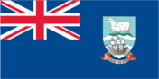
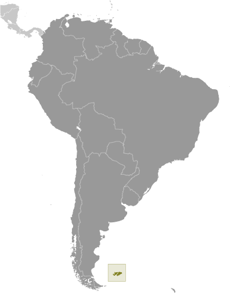
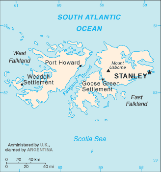

# Falkland Islands (Islas Malvinas)

_overseas territory of the UK; also claimed by Argentina_

## Introduction

**_Background:_**   
Although first sighted by an English navigator in 1592, the first landing (English) did not occur until almost a century later in 1690, and the first settlement (French) was not established until 1764. The colony was turned over to Spain two years later and the islands have since been the subject of a territorial dispute, first between Britain and Spain, then between Britain and Argentina. The UK asserted its claim to the islands by establishing a naval garrison there in 1833. Argentina invaded the islands on 2 April 1982. The British responded with an expeditionary force that landed seven weeks later and after fierce fighting forced an Argentine surrender on 14 June 1982. With hostilities ended and Argentine forces withdrawn, UK administration resumed. In response to renewed calls from Argentina for Britain to relinquish control of the islands, a referendum was held in March 2013, which resulted in 99.8% of the population voting to remain a part of the UK.

## Geography

**_Location:_**   
Southern South America, islands in the South Atlantic Ocean, about 500 km east of southern Argentina

**_Geographic coordinates:_**   
51 45 S, 59 00 W

**_Map references:_**   
South America

**_Area:_**   
**total:** 12,173 sq km   
**land:** 12,173 sq km   
**water:** 0 sq km   
**note:** includes the two main islands of East and West Falkland and about 200 small islands

**_Area - comparative:_**   
slightly smaller than Connecticut

**_Land boundaries:_**   
0 km

**_Coastline:_**   
1,288 km

**_Maritime claims:_**   
**territorial sea:** 12 nm   
**continental shelf:** 200 nm   
**exclusive fishing zone:** 200 nm

**_Climate:_**   
cold marine; strong westerly winds, cloudy, humid; rain occurs on more than half of days in year; average annual rainfall is 24 inches in Stanley; occasional snow all year, except in January and February, but typically does not accumulate

**_Terrain:_**   
rocky, hilly, mountainous with some boggy, undulating plains

**_Elevation extremes:_**   
**lowest point:** Atlantic Ocean 0 m   
**highest point:** Mount Usborne 705 m

**_Natural resources:_**   
fish, squid, wildlife, calcified seaweed, sphagnum moss

**_Land use:_**   
**arable land:** 0%   
**permanent crops:** 0%   
**other:** 100% (99% permanent pastures, 1% other) (2011)

**_Irrigated land:_**   
NA

**_Natural hazards:_**   
strong winds persist throughout the year

**_Environment - current issues:_**   
overfishing by unlicensed vessels is a problem; reindeer were introduced to the islands in 2001 for commercial reasons; this is the only commercial reindeer herd in the world unaffected by the 1986 Chornobyl disaster

**_Geography - note:_**   
deeply indented coast provides good natural harbors; short growing season

## People and Society

**_Nationality:_**   
**noun:** Falkland Islander(s)   
**adjective:** Falkland Island

**_Ethnic groups:_**   
Falkland Islander 57%, British 24.6%, St. Helenian 9.8%, Chilean 5.3%, other 3.4% (2012 est.)

**_Languages:_**   
English 89%, Spanish 7.7%, other 3.3% (2006 est.)

**_Religions:_**   
Christian 66%, none 32%, other 2% (2012 est.)

**_Population:_**   
2,840 (July 2012 est.)

**_Population growth rate:_**   
0.01% (2009 est.)

**_Birth rate:_**   
NA

**_Net migration rate:_**   
NA

**_Urbanization:_**   
**urban population:** 74.1% of total population (2011)   
**rate of urbanization:** 0.92% annual rate of change (2010-15 est.)

**_Major urban areas - population:_**   
STANLEY (capital) 2,000 (2011)

**_Sex ratio:_**   
**total population:** 1.11 male(s)/female   
**note:** sex ratio is somewhat skewed by the high proportion of males at the Royal Air Force station, Mount Pleasant Airport (MPA); excluding MPA, the sex ratio of the total population would be 1.01 (2012 est.)

**_Infant mortality rate:_**   
**total:** NA   
**male:** NA   
**female:** NA

**_Life expectancy at birth:_**   
**total population:** NA   
**male:** NA   
**female:** NA

**_Total fertility rate:_**   
NA

**_HIV/AIDS - adult prevalence rate:_**   
NA

**_HIV/AIDS - people living with HIV/AIDS:_**   
NA

**_HIV/AIDS - deaths:_**   
NA

**_Literacy:_**   
NA

## Government

**_Country name:_**   
**conventional long form:** none   
**conventional short form:** Falkland Islands (Islas Malvinas)

**_Dependency status:_**   
overseas territory of the UK; also claimed by Argentina

**_Government type:_**   
NA

**_Capital:_**   
**name:** Stanley   
**geographic coordinates:** 51 42 S, 57 51 W   
**time difference:** UTC-4 (1 hour ahead of Washington, DC, during Standard Time)   
**daylight saving time:** none scheduled for 2014

**_Administrative divisions:_**   
none (overseas territory of the UK; also claimed by Argentina)

**_Independence:_**   
none (overseas territory of the UK; also claimed by Argentina)

**_National holiday:_**   
Liberation Day, 14 June (1982)

**_Constitution:_**   
previous 1985; latest entered into force 1 January 2009 (2011)

**_Legal system:_**   
English common law and local statutes

**_Suffrage:_**   
18 years of age; universal

**_Executive branch:_**   
**chief of state:** Queen ELIZABETH II (since 6 February 1952)   
**head of government:** Governor Nigel HAYWOOD (since 16 October 2010) is the Queen's representative; Chief Executive Keith PADGETT (since 1 February 2012)   
**cabinet:** Executive Council; three members elected by the Legislative Council, two ex officio members (chief executive and the financial secretary), and the governor; the governor must obey the rulings of the Executive Council on domestic affairs   
**elections:** the monarchy is hereditary; governor appointed by the monarch; chief executive appointed by the governor

**_Legislative branch:_**   
unicameral Legislative Assembly (10 seats; 2 members are ex officio and 8 are elected by popular vote; members to serve four-year terms); presided over by the governor   
**elections:** last held on 7 November 2013 (next to be held in November 2017)   
**election results:** percent of vote - NA; seats - independents 8

**_Judicial branch:_**   
**highest court(s):** Court of Appeal (consists of the court president, the chief justice as an ex officio, non-resident member, and 2 justices of appeal); Supreme Court (consists of the chief justice); note - appeals beyond the Court of Appeal are referred to the Judicial Committee of the Privy Council (in London)   
**judge selection and term of office:** all justices appointed by the governor; tenure specified in each justice's instrument of appointment   
**subordinate courts:** Magistrate's Court (senior magistrate presides over civil and criminal divisions); Court of Summary Jurisdiction

**_Political parties and leaders:_**   
none; all independents

**_Political pressure groups and leaders:_**   
Falkland Islands Association (supports freedom of the people from external causes)

**_International organization participation:_**   
UPU

**_Diplomatic representation in the US:_**   
none (overseas territory of the UK)

**_Diplomatic representation from the US:_**   
none (overseas territory of the UK; also claimed by Argentina)

**_Flag description:_**   
blue with the flag of the UK in the upper hoist-side quadrant and the Falkland Island coat of arms centered on the outer half of the flag; the coat of arms contains a white ram (sheep raising was once the major economic activity) above the sailing ship Desire (whose crew discovered the islands) with a scroll at the bottom bearing the motto DESIRE THE RIGHT

**_National symbol(s):_**   
ram

**_National anthem:_**   
**name:** "Song of the Falklands""   
**lyrics/music:** Christopher LANHAM   
**note:** adopted 1930s; the song is the local unofficial anthem; as a territory of the United Kingdom, "God Save the Queen" is official (see United Kingdom)

## Economy

**_Economy - overview:_**   
The economy was formerly based on agriculture, mainly sheep farming but fishing and tourism currently comprise the bulk of economic activity. In 1987, the government began selling fishing licenses to foreign trawlers operating within the Falkland Islands' exclusive fishing zone. These license fees net more than $40 million per year, which help support the island's health, education, and welfare system. The waters around the Falkland Islands are known for their squid, which account for around 75% of the annual 200,000 ton fish catch. Dairy farming supports domestic consumption; crops furnish winter fodder. Foreign exchange earnings come from shipments of high-grade wool to the UK and from the sale of postage stamps and coins. In 2001, the government purchased 100 reindeer with the intent to increase the number to 10,000 over the following 20 years so that venison could be exported to Scandinavia and Chile. Tourism, especially eco-tourism, is increasing rapidly, with about 69,000 visitors in 2009. The British military presence also provides a sizeable economic boost. The islands are now self-financing except for defense. In 1993 the British Geological Survey announced a 200-mile oil exploration zone around the islands, and early seismic surveys suggest substantial reserves capable of producing 500,000 barrels per day. Political tensions between the UK and Argentina remain high following the start of oil drilling activities in the waters. In September 2011, a British exploration firm announced that it plans to commence oil production in 2016.

**_GDP (purchasing power parity):_**   
$164.5 million (2007 est.)   
$105.1 million (2002 est.)

**_GDP (official exchange rate):_**   
$164.5 million (2007 est.)

**_GDP - per capita (PPP):_**   
$55,400 (2002 est.)

**_GDP - composition, by sector of origin:_**   
**agriculture:** 95%   
**industry:** NA%   
**services:** NA% (1996)

**_Agriculture - products:_**   
fodder and vegetable crops; venison, sheep, dairy products; fish, squid

**_Industries:_**   
fish and wool processing; tourism

**_Industrial production growth rate:_**   
NA%

**_Labor force:_**   
5,246 (2006)

**_Labor force - by occupation:_**   
**agriculture:** 95% (mostly sheepherding and fishing)   
**industry and services:** 5% (1996)

**_Unemployment rate:_**   
4.1% (2010)

**_Population below poverty line:_**   
NA%

**_Household income or consumption by percentage share:_**   
**lowest 10%:** NA%   
**highest 10%:** NA%

**_Budget:_**   
**revenues:** $67.1 million   
**expenditures:** $75.3 million (FY09/10)

**_Taxes and other revenues:_**   
40.8% of GDP (FY09/10)

**_Budget surplus (+) or deficit (-):_**   
-5% of GDP (FY09/10)

**_Fiscal year:_**   
1 April - 31 March

**_Inflation rate (consumer prices):_**   
1.2% (2003)   
3.6% (1998)

**_Exports:_**   
$125 million (2004 est.)

**_Exports - commodities:_**   
wool, hides, meat, venison, fish, squid

**_Imports:_**   
$90 million (2004 est.)

**_Imports - commodities:_**   
fuel, food and drink, building materials, clothing

**_Debt - external:_**   
$NA

**_Exchange rates:_**   
Falkland pounds (FKP) per US dollar -   
0.6307 (2014)   
0.6391 (2013)   
0.6472 (2010)   
0.6175 (2009)

## Energy

**_Electricity - production:_**   
19 million kWh (2010 est.)

**_Electricity - consumption:_**   
17.67 million kWh (2010 est.)

**_Electricity - exports:_**   
0 kWh (2012 est.)

**_Electricity - imports:_**   
0 kWh (2012 est.)

**_Electricity - installed generating capacity:_**   
10,000 kW (2010 est.)

**_Electricity - from fossil fuels:_**   
90% of total installed capacity (2010 est.)

**_Electricity - from nuclear fuels:_**   
0% of total installed capacity (2010 est.)

**_Electricity - from hydroelectric plants:_**   
0% of total installed capacity (2010 est.)

**_Electricity - from other renewable sources:_**   
10% of total installed capacity (2010 est.)

**_Crude oil - production:_**   
0 bbl/day (2012 est.)

**_Crude oil - exports:_**   
0 bbl/day (2010 est.)

**_Crude oil - imports:_**   
0 bbl/day (2010 est.)

**_Crude oil - proved reserves:_**   
0 bbl (1 January 2013 est.)

**_Refined petroleum products - production:_**   
0 bbl/day (2010 est.)

**_Refined petroleum products - consumption:_**   
300 bbl/day (2011 est.)

**_Refined petroleum products - exports:_**   
0 bbl/day (2010 est.)

**_Refined petroleum products - imports:_**   
313 bbl/day (2010 est.)

**_Natural gas - production:_**   
0 cu m (2011 est.)

**_Natural gas - consumption:_**   
0 cu m (2010 est.)

**_Natural gas - exports:_**   
0 cu m (2011 est.)

**_Natural gas - imports:_**   
0 cu m (2011 est.)

**_Natural gas - proved reserves:_**   
0 cu m (1 January 2013 est.)

**_Carbon dioxide emissions from consumption of energy:_**   
45,740 Mt (2011 est.)

## Communications

**_Telephones - main lines in use:_**   
1,980 (2012)

**_Telephones - mobile cellular:_**   
3,450 (2012)

**_Telephone system:_**   
**domestic:** government-operated radiotelephone and private VHF/CB radiotelephone networks provide effective service to almost all points on both islands   
**international:** country code - 500; satellite earth station - 1 Intelsat (Atlantic Ocean) with links through London to other countries (2011)

**_Broadcast media:_**   
TV service provided by a multi-channel service provider; radio services provided by the public broadcaster, Falkland Islands Radio Service, broadcasting on both AM and FM frequencies, and by the British Forces Broadcasting Service (BFBS) (2007)

**_Internet country code:_**   
.fk

**_Internet hosts:_**   
110 (2012)

**_Internet users:_**   
2,900 (2009)

## Transportation

**_Airports:_**   
7 (2013)

**_Airports - with paved runways:_**   
**total:** 2   
**2,438 to 3,047 m:** 1   
**914 to 1,523 m:** 1 (2013)

**_Airports - with unpaved runways:_**   
**total:** 5   
**under 914 m:** 5 (2013)

**_Roadways:_**   
**total:** 440 km   
**paved:** 50 km   
**unpaved:** 390 km (2008)

**_Ports and terminals:_**   
**major seaport(s):** Stanley

## Military

**_Military branches:_**   
no regular military forces

**_Military - note:_**   
defense is the responsibility of the UK

## Transnational Issues

**_Disputes - international:_**   
Argentina, which claims the islands in its constitution and briefly occupied them by force in 1982, agreed in 1995 to no longer seek settlement by force; UK continues to reject Argentine requests for sovereignty talks

............................................................   
_Page last updated on June 20, 2014_
