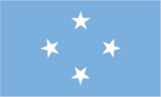
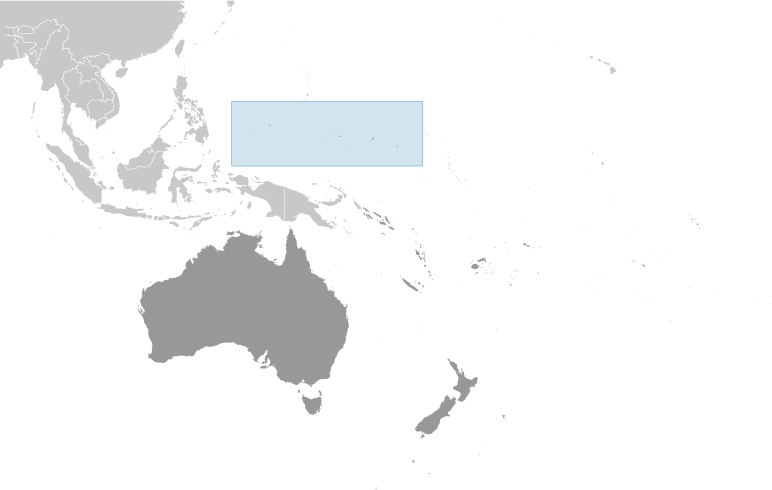
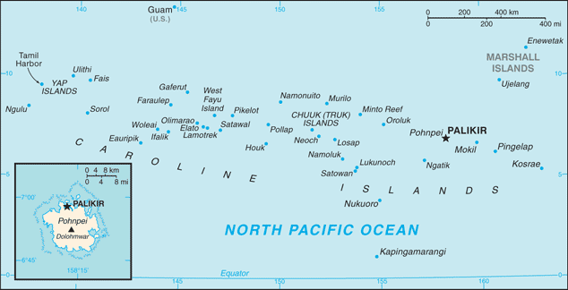

# Micronesia, Federated States of

## Introduction

**_Background:_**   
The Caroline Islands are a widely scattered archipelago in the western Pacific Ocean; they became part of a UN Trust Territory under US administration following World War II. The eastern four island groups adopted a constitution in 1979 and chose to become the Federated States of Micronesia. (The fifth, westernmost island group became Palau.) Independence came in 1986 under a Compact of Free Association with the US, which was amended and renewed in 2004. Present concerns include large-scale unemployment, overfishing, and overdependence on US aid.

## Geography

**_Location:_**   
Oceania, island group in the North Pacific Ocean, about three-quarters of the way from Hawaii to Indonesia

**_Geographic coordinates:_**   
6 55 N, 158 15 E

**_Map references:_**   
Oceania

**_Area:_**   
**total:** 702 sq km   
**land:** 702 sq km   
**water:** 0 sq km (fresh water only)   
**note:** includes Pohnpei (Ponape), Chuuk (Truk) Islands, Yap Islands, and Kosrae (Kosaie)

**_Area - comparative:_**   
four times the size of Washington, DC (land area only)

**_Land boundaries:_**   
0 km

**_Coastline:_**   
6,112 km

**_Maritime claims:_**   
**territorial sea:** 12 nm   
**exclusive economic zone:** 200 nm

**_Climate:_**   
tropical; heavy year-round rainfall, especially in the eastern islands; located on southern edge of the typhoon belt with occasionally severe damage

**_Terrain:_**   
islands vary geologically from high mountainous islands to low, coral atolls; volcanic outcroppings on Pohnpei, Kosrae, and Chuuk

**_Elevation extremes:_**   
**lowest point:** Pacific Ocean 0 m   
**highest point:** Dolohmwar (Totolom) 791 m

**_Natural resources:_**   
timber, marine products, deep-seabed minerals, phosphate

**_Land use:_**   
**arable land:** 2.86%   
**permanent crops:** 24.29%   
**other:** 72.86% (2011)

**_Irrigated land:_**   
NA

**_Natural hazards:_**   
typhoons (June to December)

**_Environment - current issues:_**   
overfishing, climate change, pollution

**_Environment - international agreements:_**   
**party to:** Biodiversity, Climate Change, Climate Change-Kyoto Protocol, Desertification, Hazardous Wastes, Law of the Sea, Ozone Layer Protection   
**signed, but not ratified:** none of the selected agreements

**_Geography - note:_**   
four major island groups totaling 607 islands

## People and Society

**_Nationality:_**   
**noun:** Micronesian(s)   
**adjective:** Micronesian; Chuukese, Kosraen(s), Pohnpeian(s), Yapese

**_Ethnic groups:_**   
Chuukese/Mortlockese 49.3%, Pohnpeian 29.8%, Kosraean 6.3%, Yapese 5.7%, Yap outer islanders 5.1%, Polynesian 1.6%, Asian 1.4%, other 0.8% (2010 est.)

**_Languages:_**   
English (official and common language), Chuukese, Kosrean, Pohnpeian, Yapese, Ulithian, Woleaian, Nukuoro, Kapingamarangi

**_Religions:_**   
Roman Catholic 54.7%, Protestant 41.1% (includes Congregational 38.5%, Baptist 1.1%, Seventh Day Adventist 0.8%, Assembly of God .7%), Mormon 1.5%, other 1.9%, none 0.7%, unspecified 0.1% (2010 est.)

**_Population:_**   
105,681 (July 2014 est.)

**_Age structure:_**   
**0-14 years:** 31.9% (male 17,120/female 16,561)   
**15-24 years:** 20.2% (male 10,755/female 10,609)   
**25-54 years:** 38% (male 19,483/female 20,686)   
**55-64 years:** 6.5% (male 3,440/female 3,477)   
**65 years and over:** 3.2% (male 1,576/female 1,974) (2014 est.)

**_Dependency ratios:_**   
**total dependency ratio:** 63.3 %   
**youth dependency ratio:** 56.4 %   
**elderly dependency ratio:** 6.9 %   
**potential support ratio:** 14.6 (2014 est.)

**_Median age:_**   
**total:** 23.8 years   
**male:** 23.2 years   
**female:** 24.4 years (2014 est.)

**_Population growth rate:_**   
-0.42% (2014 est.)

**_Birth rate:_**   
20.97 births/1,000 population (2014 est.)

**_Death rate:_**   
4.25 deaths/1,000 population (2014 est.)

**_Net migration rate:_**   
-20.93 migrant(s)/1,000 population (2014 est.)

**_Urbanization:_**   
**urban population:** 22.6% of total population (2011)   
**rate of urbanization:** 0.98% annual rate of change (2010-15 est.)

**_Major urban areas - population:_**   
PALIKIR (capital) 7,000 (2011)

**_Sex ratio:_**   
**at birth:** 1.05 male(s)/female   
**0-14 years:** 1.03 male(s)/female   
**15-24 years:** 1.01 male(s)/female   
**25-54 years:** 0.94 male(s)/female   
**55-64 years:** 0.98 male(s)/female   
**65 years and over:** 0.77 male(s)/female   
**total population:** 0.99 male(s)/female (2014 est.)

**_Maternal mortality rate:_**   
100 deaths/100,000 live births (2010)

**_Infant mortality rate:_**   
**total:** 21.93 deaths/1,000 live births   
**male:** 24.28 deaths/1,000 live births   
**female:** 19.47 deaths/1,000 live births (2014 est.)

**_Life expectancy at birth:_**   
**total population:** 72.35 years   
**male:** 70.34 years   
**female:** 74.45 years (2014 est.)

**_Total fertility rate:_**   
2.55 children born/woman (2014 est.)

**_Health expenditures:_**   
13.4% of GDP (2011)

**_Physicians density:_**   
0.18 physicians/1,000 population (2009)

**_Hospital bed density:_**   
3.2 beds/1,000 population (2009)

**_Drinking water source:_**   
**improved:** urban: 94.8% of population; rural: 87.4% of population; total: 89% of population   
**unimproved:** urban: 5.2% of population; rural: 12.6% of population; total: 11% of population (2012 est.)

**_Sanitation facility access:_**   
**improved:** urban: 85.1% of population; rural: 49% of population; total: 57.2% of population   
**unimproved:** urban: 14.9% of population; rural: 51% of population; total: 42.8% of population (2012 est.)

**_HIV/AIDS - adult prevalence rate:_**   
NA

**_HIV/AIDS - people living with HIV/AIDS:_**   
NA

**_HIV/AIDS - deaths:_**   
NA

**_Obesity - adult prevalence rate:_**   
40.6% (2008)

**_Education expenditures:_**   
NA

**_Literacy:_**   
**definition:** age 15 and over can read and write   
**total population:** 89%   
**male:** 91%   
**female:** 88% (1980 est.)

## Government

**_Country name:_**   
**conventional long form:** Federated States of Micronesia   
**conventional short form:** none   
**local long form:** Federated States of Micronesia   
**local short form:** none   
**former:** Trust Territory of the Pacific Islands, Ponape, Truk, and Yap Districts   
**abbreviation:** FSM

**_Government type:_**   
constitutional government in free association with the US; the Compact of Free Association entered into force on 3 November 1986 and the Amended Compact entered into force in May 2004

**_Capital:_**   
**name:** Palikir   
**geographic coordinates:** 6 55 N, 158 09 E   
**time difference:** UTC+11 (16 hours ahead of Washington, DC, during Standard Time)

**_Administrative divisions:_**   
4 states; Chuuk (Truk), Kosrae (Kosaie), Pohnpei (Ponape), Yap

**_Independence:_**   
3 November 1986 (from the US-administered UN trusteeship)

**_National holiday:_**   
Constitution Day, 10 May (1979)

**_Constitution:_**   
drafted June 1975, ratified 1 October 1978, entered into force 10 May 1979; amended 1990 (2012)

**_Legal system:_**   
mixed legal system of common and customary law

**_International law organization participation:_**   
has not submitted an ICJ jurisdiction declaration; non-party state to the ICCt

**_Suffrage:_**   
18 years of age; universal

**_Executive branch:_**   
**chief of state:** President Emanuel MORI (since 11 May 2007); Vice President Alik L. ALIK (since 11 May 2007); note - the president is both chief of state and head of government   
**head of government:** President Emanuel MORI (since 11 May 2007); Vice President Alik L. ALIK (since 11 May 2007)   
**cabinet:** Cabinet includes the vice president and the heads of the eight executive departments   
**elections:** president and vice president elected by Congress from among the four senators at large for a four-year term (eligible for a second term); election last held on 11 May 2011 (next to be held in May 2015)   
**election results:** Emanuel MORI re-elected president by Congress unopposed; Alik L. ALIK reelected vice president

**_Legislative branch:_**   
unicameral Congress (14 seats; 4 - one elected from each state to serve four-year terms and 10 - elected from single-member districts delineated by population to serve two-year terms; members elected by popular vote)   
**elections:** last held on 5 March 2013 (next to be held in March 2015)   
**election results:** percent of vote - NA; seats - independents 14

**_Judicial branch:_**   
**highest court(s):** Federated States of Micronesia (FSM) Supreme Court (consists of the chief justice and not more than 5 associate justices and organized into appellate and criminal divisions)   
**judge selection and term of office:** justices appointed by the president of the Federated States of Micronesia with the approval of two-thirds of Congress; justices appointed for life   
**subordinate courts:** the highest state-level courts are: Chuuk Supreme Court; Korsae State Court; Pohnpei State Court; Yap State Court

**_Political parties and leaders:_**   
no formal parties

**_Political pressure groups and leaders:_**   
NA

**_International organization participation:_**   
ACP, ADB, AOSIS, FAO, G-77, IBRD, ICAO, ICRM, IDA, IFC, IFRCS, IMF, IOC, IOM, IPU, ITSO, ITU, MIGA, OPCW, PIF, Sparteca, SPC, UN, UNCTAD, UNESCO, WHO, WMO

**_Diplomatic representation in the US:_**   
**chief of mission:** Ambassador Asterio R. TAKESY (since 13 January 2012)   
**chancery:** 1725 N Street NW, Washington, DC 20036   
**telephone:** [1] (202) 223-4383   
**FAX:** [1] (202) 223-4391   
**consulate(s) general:** Honolulu, Tamuning (Guam)

**_Diplomatic representation from the US:_**   
**chief of mission:** Ambassador Dorothea-Maria (Doria) ROSEN (since 9 August 2012)   
**embassy:** 101 Upper Pics Road, Kolonia   
**mailing address:** P. O. Box 1286, Kolonia, Pohnpei, 96941; U.S. Embassy in Micronesia, 4120 Kolonia Place, Washington, D.C. 20521-4120   
**telephone:** [691] 320-2187   
**FAX:** [691] 320-2186

**_Flag description:_**   
light blue with four white five-pointed stars centered; the stars are arranged in a diamond pattern; blue symbolizes the Pacific Ocean, the stars represent the four island groups of Chuuk, Kosrae, Pohnpei, and Yap

**_National anthem:_**   
**name:** "Patriots of Micronesia"   
**lyrics/music:** unknown   
**note:** adopted 1991; the anthem is also known as "Across All Micronesia;" the music is based on the 1820 German patriotic song "Ich hab mich ergeben," which was the West German national anthem from 1949-1950; variants of this tune are used in Johannes Brahms' "Festival Overture" and Gustav Mahler's "Third Symphony"

## Economy

**_Economy - overview:_**   
Economic activity consists of subsistence farming and fishing and government which is funded largely by Compact of Free Association (Compact) assistance provided by the US. The islands have few known mineral deposits worth commercial exploration. The potential for tourism is also limited by isolation, lack of adequate facilities, and limited air and water connections hinder development. Under the terms of the original Compact, the US provided $1.3 billion in grants and aid in 1986-2001. The US and the Federated States of Micronesia (FSM) negotiated a second (amended) Compact agreement in 2002-2003 that took effect in 2004. The amended Compact runs for a 20-year period to 2024; during which the US will provide roughly $2.1 billion to the FSM. The amended Compact also includes a Trust Fund for the people of the FSM which is to provide an income stream beyond 2024 when Compact grants are to end. The country's medium-term economic outlook appears fragile because of reduced US assistance and lackluster performance of its small and stagnant private sector.

**_GDP (purchasing power parity):_**   
$754 million (2013 est.)   
$749.1 million (2012 est.)   
$746.8 million (2011 est.)   
**note:** data are in 2013 US dollars; GDP supplemented by grant aid, averaging perhaps $100 million annually

**_GDP (official exchange rate):_**   
$339 million (2013 est.)

**_GDP - real growth rate:_**   
0.6% (2013 est.)   
2.1% (2011 est.)

**_GDP - per capita (PPP):_**   
$7,300 (2013 est.)   
$7,200 (2012 est.)   
$7,200 (2011 est.)   
**note:** data are in 2013 US dollars

**_GDP - composition, by sector of origin:_**   
**agriculture:** 14%   
**industry:** 12%   
**services:** 74% (2011 est.)

**_Agriculture - products:_**   
black pepper, tropical fruits and vegetables, coconuts, bananas, cassava (manioc, tapioca), sakau (kava), Kosraen citrus, betel nuts, sweet potatoes; pigs, chickens; fish

**_Industries:_**   
tourism, construction; fish processing, specialized aquaculture; craft items (from shell, wood, and pearls)

**_Industrial production growth rate:_**   
NA%

**_Labor force:_**   
15,920 (2011)

**_Labor force - by occupation:_**   
**agriculture:** 0.9%   
**industry:** 20.6%   
**services:** 78.5%   
**note:** two-thirds of the labor force are government employees (2011 est.)

**_Unemployment rate:_**   
22% (2000 est.)

**_Population below poverty line:_**   
26.7% (2000)

**_Household income or consumption by percentage share:_**   
**lowest 10%:** NA%   
**highest 10%:** NA%

**_Budget:_**   
**revenues:** $107 million   
**expenditures:** $102 million (FY10/11 est.)

**_Taxes and other revenues:_**   
31.6% of GDP (FY10/11 est.)

**_Budget surplus (+) or deficit (-):_**   
1.5% of GDP (FY10/11 est.)

**_Fiscal year:_**   
1 October - 30 September

**_Inflation rate (consumer prices):_**   
3.4% (2011 est.)   
3.5% (2010 est.)

**_Commercial bank prime lending rate:_**   
14.35% (31 December 2013 est.)   
14.35% (31 December 2012 est.)

**_Stock of narrow money:_**   
$27.22 million (31 December 2011 est.)   
$27.22 million

**_Stock of broad money:_**   
$118.4 million (31 December 2011 est.)   
$113.9 million (31 December 2010 est.)

**_Stock of domestic credit:_**   
$-56.77 million (31 December 2011 est.)   
$56.77 million

**_Current account balance:_**   
-$34.3 million (FY05 est.)

**_Exports:_**   
$24.9 million (2009 est.)   
$14 million (2004 est.)

**_Exports - commodities:_**   
fish, garments, bananas, black pepper, sakau (kava), betel nuts

**_Imports:_**   
$132.7 million (2004)

**_Imports - commodities:_**   
food, manufactured goods, machinery and equipment, beverages

**_Reserves of foreign exchange and gold:_**   
$75.06 million (31 December 2011 est.)   
$75.06 million

**_Debt - external:_**   
$60.8 million (FY05 est.)

**_Exchange rates:_**   
the US dollar is used

## Energy

**_Electricity - production:_**   
192 million kWh (2002)

**_Electricity - consumption:_**   
178.6 million kWh (2002)

**_Electricity - exports:_**   
0 kWh (2002)

**_Electricity - imports:_**   
0 kWh (2002)

## Communications

**_Telephones - main lines in use:_**   
8,400 (2012)

**_Telephones - mobile cellular:_**   
27,600 (2012)

**_Telephone system:_**   
**general assessment:** adequate system   
**domestic:** islands interconnected by shortwave radiotelephone (used mostly for government purposes), satellite (Intelsat) ground stations, and some coaxial and fiber-optic cable; mobile-cellular service available on Kosrae, Pohnpei, and Yap   
**international:** country code - 691; satellite earth stations - 5 Intelsat (Pacific Ocean) (2002)

**_Broadcast media:_**   
no TV broadcast stations; each state has a multi-channel cable service with TV transmissions carrying roughly 95% imported programming and 5% local programming; about a half dozen radio stations (2009)

**_Internet country code:_**   
.fm

**_Internet hosts:_**   
4,668 (2012)

**_Internet users:_**   
17,000 (2009)

## Transportation

**_Airports:_**   
6 (2013)

**_Airports - with paved runways:_**   
**total:** 6   
**1,524 to 2,437 m:** 4   
**914 to 1,523 m:** 2 (2013)

**_Roadways:_**   
**total:** 240 km   
**paved:** 42 km   
**unpaved:** 198 km (2000)

**_Merchant marine:_**   
**total:** 3   
**by type:** cargo 1, passenger/cargo 2 (2010)

**_Ports and terminals:_**   
**major seaport(s):** Colonia (Tomil Harbor), Lele Harbor, Pohnepi Harbor

## Military

**_Military branches:_**   
no regular military forces (2012)

**_Manpower available for military service:_**   
**males age 16-49:** 26,712 (2010 est.)

**_Manpower fit for military service:_**   
**males age 16-49:** 22,008   
**females age 16-49:** 23,501 (2010 est.)

**_Manpower reaching militarily significant age annually:_**   
**male:** 1,276   
**female:** 1,253 (2010 est.)

**_Military - note:_**   
defense is the responsibility of the US

## Transnational Issues

**_Disputes - international:_**   
none

**_Trafficking in persons:_**   
**current situation:** Micronesia is a source, and to a limited extent, destination country for women subjected to sex trafficking; Micronesian women are fraudulently recruited for jobs in the US and its territories only to be forced into prostitution or labor upon arrival; Micronesian and foreign women and children are also reportedly prostituted on fishing vessels in Micronesia or its territorial waters, as well as restaurants and clubs frequented by fishermen; complaints of nonpayment and inhuman treatment on fishing boats has led to investigations of labor trafficking   
**tier rating:** Tier 2 Watch List - Micronesia does not fully comply with the minimum standards for the elimination of trafficking; however, it is making significant efforts to do so; despite passage of implementing regulations for Micronesia's 2012 trafficking law, the government has not reported any investigations, prosecutions, or convictions for sex or labor trafficking; the government also makes no efforts to identify trafficking victims and refer them to protective services; no NGOs provide services to victims; limited efforts are made to increase the public's awareness of human trafficking (2013)

**_Illicit drugs:_**   
major consumer of cannabis

............................................................   
_Page last updated on June 20, 2014_
