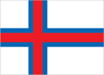
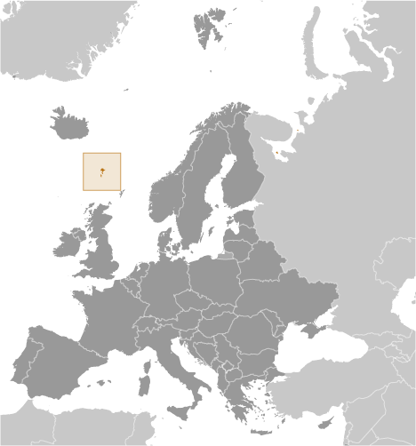
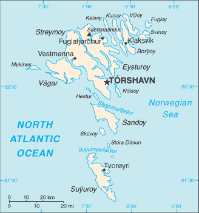

# Faroe Islands

_part of the Kingdom of Denmark_

## Introduction

**_Background:_**   
The population of the Faroe Islands is largely descended from Viking settlers who arrived in the 9th century. The islands have been connected politically to Denmark since the 14th century. A high degree of self-government was granted the Faroese in 1948, who have autonomy over most internal affairs while Denmark is responsible for justice, defense, and foreign affairs. The Faroe Islands are not part of the European Union.

## Geography

**_Location:_**   
Northern Europe, island group between the Norwegian Sea and the North Atlantic Ocean, about half way between Iceland and Norway

**_Geographic coordinates:_**   
62 00 N, 7 00 W

**_Map references:_**   
Europe

**_Area:_**   
**total:** 1,393 sq km   
**land:** 1,393 sq km   
**water:** 0 sq km (some lakes and streams)

**_Area - comparative:_**   
eight times the size of Washington, DC

**_Land boundaries:_**   
0 km

**_Coastline:_**   
1,117 km

**_Maritime claims:_**   
**territorial sea:** 3 nm   
**continental shelf:** 200 nm or agreed boundaries or median line   
**exclusive fishing zone:** 200 nm or agreed boundaries or median line

**_Climate:_**   
mild winters, cool summers; usually overcast; foggy, windy

**_Terrain:_**   
rugged, rocky, some low peaks; cliffs along most of coast

**_Elevation extremes:_**   
**lowest point:** Atlantic Ocean 0 m   
**highest point:** Slaettaratindur 882 m

**_Natural resources:_**   
fish, whales, hydropower, possible oil and gas

**_Land use:_**   
**arable land:** 2.15%   
**permanent crops:** 0%   
**other:** 97.85% (2011)

**_Irrigated land:_**   
0 sq km (2011)

**_Natural hazards:_**   
NA

**_Environment - current issues:_**   
NA

**_Environment - international agreements:_**   
**party to:** Marine Dumping - associate member to the London Convention and Ship Pollution

**_Geography - note:_**   
archipelago of 17 inhabited islands and one uninhabited island, and a few uninhabited islets; strategically located along important sea lanes in northeastern Atlantic; precipitous terrain limits habitation to small coastal lowlands

## People and Society

**_Nationality:_**   
**noun:** Faroese (singular and plural)   
**adjective:** Faroese

**_Ethnic groups:_**   
Scandinavian

**_Languages:_**   
Faroese (derived from Old Norse), Danish

**_Religions:_**   
Evangelical Lutheran 83.8%, other and unspecified 16.2% (2006 census)

**_Population:_**   
49,947 (July 2014 est.)

**_Age structure:_**   
**0-14 years:** 20.3% (male 5,251/female 4,877)   
**15-24 years:** 15.3% (male 3,942/female 3,701)   
**25-54 years:** 36.8% (male 9,958/female 8,445)   
**55-64 years:** 11.8% (male 3,035/female 2,859)   
**65 years and over:** 15.4% (male 3,819/female 4,060) (2014 est.)

**_Median age:_**   
**total:** 37.7 years   
**male:** 37.1 years   
**female:** 38.4 years (2014 est.)

**_Population growth rate:_**   
0.49% (2014 est.)

**_Birth rate:_**   
13.57 births/1,000 population (2014 est.)

**_Death rate:_**   
8.71 deaths/1,000 population (2014 est.)

**_Net migration rate:_**   
0 migrant(s)/1,000 population (2014 est.)

**_Urbanization:_**   
**urban population:** 41.1% of total population (2011)   
**rate of urbanization:** 0.97% annual rate of change (2010-15 est.)

**_Major urban areas - population:_**   
TORSHAVN (capital) 20,000 (2011)

**_Sex ratio:_**   
**at birth:** 1.07 male(s)/female   
**0-14 years:** 1.08 male(s)/female   
**15-24 years:** 1.07 male(s)/female   
**25-54 years:** 1.18 male(s)/female   
**55-64 years:** 1.09 male(s)/female   
**65 years and over:** 0.93 male(s)/female   
**total population:** 1.09 male(s)/female (2014 est.)

**_Infant mortality rate:_**   
**total:** 5.71 deaths/1,000 live births   
**male:** 5.97 deaths/1,000 live births   
**female:** 5.43 deaths/1,000 live births (2014 est.)

**_Life expectancy at birth:_**   
**total population:** 80.11 years   
**male:** 77.61 years   
**female:** 82.79 years (2014 est.)

**_Total fertility rate:_**   
2.38 children born/woman (2014 est.)

**_Hospital bed density:_**   
4.7 beds/1,000 population (2012)

**_HIV/AIDS - adult prevalence rate:_**   
NA

**_HIV/AIDS - people living with HIV/AIDS:_**   
NA

**_HIV/AIDS - deaths:_**   
NA

**_Literacy:_**   
NA; note - probably 99%, the same as Denmark proper

**_Unemployment, youth ages 15-24:_**   
**total:** 9.4%   
**male:** 6.9%   
**female:** 12.5% (2005)

## Government

**_Country name:_**   
**conventional long form:** none   
**conventional short form:** Faroe Islands   
**local long form:** none   
**local short form:** Foroyar

**_Dependency status:_**   
part of the Kingdom of Denmark; self-governing overseas administrative division of Denmark since 1948

**_Government type:_**   
NA

**_Capital:_**   
**name:** Torshavn   
**geographic coordinates:** 62 00 N, 6 46 W   
**time difference:** UTC 0 (5 hours ahead of Washington, DC, during Standard Time)   
**daylight saving time:** +1hr, begins last Sunday in March; ends last Sunday in October

**_Administrative divisions:_**   
none (part of the Kingdom of Denmark; self-governing overseas administrative division of Denmark); there are no first-order administrative divisions as defined by the US Government, but there are 34 municipalities

**_Independence:_**   
none (part of the Kingdom of Denmark; self-governing overseas administrative division of Denmark)

**_National holiday:_**   
Olaifest (Olavsoka), 29 July

**_Constitution:_**   
5 June 1953 (Danish Constitution), 23 March 1948 (Home Rule Act), and 24 June 2005 (Takeover Act ) serve as the Faroe Islands’ constitutional position in the Unity of the Realm (2013)

**_Legal system:_**   
the laws of Denmark, where applicable, apply

**_Suffrage:_**   
18 years of age; universal

**_Executive branch:_**   
**chief of state:** Queen MARGRETHE II of Denmark (since 14 January 1972), represented by High Commissioner Dan Michael KNUDSEN, chief administrative officer (since 2008)   
**head of government:** Prime Minister Kaj Leo JOHANNESSEN (since 26 September 2008)   
**cabinet:** Landsstyri appointed by the prime minister   
**elections:** the monarchy is hereditary; high commissioner appointed by the monarch; following legislative elections, the leader of the majority party or the leader of the majority coalition is usually elected prime minister by the Faroese Parliament; election last held on 14 November 2011 (next to be held no later than November 2015)   
**election results:** Kaj Leo JOHANNESSEN reelected prime minister in 2011

**_Legislative branch:_**   
unicameral Faroese Parliament or Logting (33 seats; members elected by popular vote on a proportional basis from the seven constituencies to serve four-year terms)   
**elections:** last held on 29 October 2011 (next to be held no later than October 2015)   
**election results:** percent of vote by party - Union Party 24.7%, People's Party 22.5%, Republican Party 18.3%, Social Democratic Party 17.7%, Progressive Party 6.3%, Center Party 6.2%, Independence Party 4.2%, other 0.1%; seats by party - Union Party 8, People's Party 8, Republican Party 6, Social Democratic Party 6, Progressive Party 2, Center Party 2, Independence Party 1   
**note:** election of two seats to the Danish Parliament was last held on 15 September 2011 (next to be held no later than September 2015); results - percent of vote by party - NA; seats by party - Social Democratic Party 1, Union Party 1

**_Judicial branch:_**   
the Faroese Court or Raett (Rett - Danish) decides both civil and criminal cases; the Court is part of the Danish legal system

**_Political parties and leaders:_**   
Center Party (Midflokkurin) [Jenis av RANA]   
Independence Party (Sjalvstyrisflokkurin) [Kari P. HOJGAARD]   
People's Party (Folkaflokkurin) [Jorgen NICLASEN]   
Progressive Party (Framsokn) [Poul MICHELSEN]   
Republican Party (Tjodveldi) [Hogni HOYDAL]   
Social Democratic Party (Javnadarflokkurin) [Aksel JOHANNESEN]   
Union Party (Sambandsflokkurin) [Kaj Leo JOHANNESEN]

**_Political pressure groups and leaders:_**   
conservationists

**_International organization participation:_**   
Arctic Council, IMO (associate), NC, NIB, UNESCO (associate), UPU

**_Diplomatic representation in the US:_**   
none (self-governing overseas administrative division of Denmark)

**_Diplomatic representation from the US:_**   
none (self-governing overseas administrative division of Denmark)

**_Flag description:_**   
white with a red cross outlined in blue extending to the edges of the flag; the vertical part of the cross is shifted toward the hoist side in the style of the Dannebrog (Danish flag); referred to as Merkid, meaning "the banner" or "the mark," the flag resembles those of neighboring Iceland and Norway, and uses the same three colors - but in a different sequence; white represents the clear Faroese sky as well as the foam of the waves; red and blue are traditional Faroese colors

**_National symbol(s):_**   
ram

**_National anthem:_**   
**name:** "Mitt alfagra land" (My Fairest Land)   
**lyrics/music:** Simun av SKAROI/Peter ALBERG   
**note:** adopted 1948; the anthem is also known as "Tu alfagra land mitt" (Thou Fairest Land of Mine); as an autonomous overseas division of Denmark, the Faroe Islands are permitted their own national anthem

## Economy

**_Economy - overview:_**   
The Faroese economy is dependent on fishing, which makes the economy vulnerable to price fluctuations. The sector normally accounts for about 95% of exports and nearly half of GDP. In early 2008 the Faroese economy began to slow as a result of smaller catches and historically high oil prices. The slowdown in the Faroese economy followed a strong performance since the mid-1990s with annual growth rates averaging close to 6%, mostly a result of increased fish landings and salmon farming, and high export prices. Unemployment reached its lowest level in June 2008 at 1.1% but gradually increased to about 5.5% in 2012. The Faroese Home Rule Government produced increasing budget surpluses in that period, which helped to reduce the large public debt, most of it to Denmark. However, total dependence on fishing and salmon farming make the Faroese economy vulnerable to fluctuations in world demand. Initial discoveries of oil in the Faroese area give hope for eventual oil production, which may provide a foundation for a more diversified economy and less dependence on Danish economic assistance. Aided by an annual subsidy from Denmark amounting to about 3% of Faroese GDP, the Faroese have a standard of living almost equal to that of Denmark and Greenland. The Faroese Government ran relatively large deficits from 2008 to 2010 and budget deficits are forecast for several years ahead. At year-end 2010 gross external debt had reached approximately US$900 million.

**_GDP (purchasing power parity):_**   
$1.471 billion (2010 est.)   
$1.389 billion (2008 est.)

**_GDP (official exchange rate):_**   
$2.32 billion (2010 est.)

**_GDP - real growth rate:_**   
2.9% (2010 est.)   
0.5% (2008 est.)

**_GDP - per capita (PPP):_**   
$30,500 (2008 est.)

**_GDP - composition, by sector of origin:_**   
**agriculture:** 16%   
**industry:** 29%   
**services:** 55% (2007 est.)

**_Agriculture - products:_**   
milk, potatoes, vegetables; sheep; salmon, other fish

**_Industries:_**   
fishing, fish processing, small ship repair and refurbishment, handicrafts

**_Industrial production growth rate:_**   
3.4% (2009 est.)

**_Labor force:_**   
34,710 (November 2010)

**_Labor force - by occupation:_**   
**agriculture:** 10.7%   
**industry:** 18.9%   
**services:** 70.3% (November 2010)

**_Unemployment rate:_**   
6.8% (2011)   
5.7% (2010)

**_Population below poverty line:_**   
NA%

**_Household income or consumption by percentage share:_**   
**lowest 10%:** NA%   
**highest 10%:** NA%

**_Budget:_**   
**revenues:** $1.025 billion   
**expenditures:** $1.301 billion   
**note:** Denmark supplies the Faroe Islands with almost one-third of their public funds (2010 est.)

**_Taxes and other revenues:_**   
44.2% of GDP (2010 est.)

**_Budget surplus (+) or deficit (-):_**   
-11.9% of GDP (2010 est.)

**_Fiscal year:_**   
calendar year

**_Inflation rate (consumer prices):_**   
2.3% (2011)   
0.4% (2010)

**_Exports:_**   
$824 million (2010)   
$767 million (2009)

**_Exports - commodities:_**   
fish and fish products 94%, stamps, ships

**_Exports - partners:_**   
Denmark 23.4%, UK 21%, Nigeria 13.4%, US 8.9%, Netherlands 8.4%, Russia 7%, China 4.4% (2012)

**_Imports:_**   
$776 million (2010)   
$786 million (2009)

**_Imports - commodities:_**   
goods for household consumption 24%, machinery and transport equipment 23.5%, fuels 21.4%, raw materials and semi-manufactures, salt

**_Imports - partners:_**   
Denmark 42%, Norway 32%, Germany 8.7%, Iceland 5.3% (2012)

**_Debt - external:_**   
$888.8 million (2010)   
$68.1 million (2006)

**_Exchange rates:_**   
Danish kroner (DKK) per US dollar -   
5.695 (2011)   
5.6241 (2011 est.)   
5.6241 (2010 est.)   
5.361 (2009)   
5.0236 (2008)

## Energy

**_Electricity - production:_**   
261 million kWh (2011 est.)

**_Electricity - consumption:_**   
249 million kWh (2010 est.)

**_Electricity - exports:_**   
0 kWh (2012 est.)

**_Electricity - imports:_**   
0 kWh (2012 est.)

**_Electricity - installed generating capacity:_**   
100,100 kW (2010 est.)

**_Electricity - from fossil fuels:_**   
64.9% of total installed capacity (2010 est.)

**_Electricity - from nuclear fuels:_**   
0% of total installed capacity (2010 est.)

**_Electricity - from hydroelectric plants:_**   
31% of total installed capacity (2010 est.)

**_Electricity - from other renewable sources:_**   
4.1% of total installed capacity (2010 est.)

**_Crude oil - production:_**   
0 bbl/day (2012 est.)

**_Crude oil - exports:_**   
0 bbl/day (2010 est.)

**_Crude oil - imports:_**   
0 bbl/day (2010 est.)

**_Crude oil - proved reserves:_**   
0 bbl (1 January 2013 est.)

**_Refined petroleum products - production:_**   
0 bbl/day (2010 est.)

**_Refined petroleum products - consumption:_**   
4,871 bbl/day (2011 est.)

**_Refined petroleum products - exports:_**   
0 bbl/day (2010 est.)

**_Refined petroleum products - imports:_**   
4,661 bbl/day (2010 est.)

**_Natural gas - production:_**   
0 cu m (2011 est.)

**_Natural gas - consumption:_**   
0 cu m (2010 est.)

**_Natural gas - exports:_**   
0 cu m (2011 est.)

**_Natural gas - imports:_**   
0 cu m (2011 est.)

**_Natural gas - proved reserves:_**   
0 cu m (1 January 2013 est.)

**_Carbon dioxide emissions from consumption of energy:_**   
785,300 Mt (2011 est.)

## Communications

**_Telephones - main lines in use:_**   
24,000 (2012)

**_Telephones - mobile cellular:_**   
61,000 (2012)

**_Telephone system:_**   
**general assessment:** good international communications; good domestic facilities   
**domestic:** conversion to digital system completed in 1998; both NMT (analog) and GSM (digital) mobile telephone systems are installed   
**international:** country code - 298; satellite earth stations - 1 Orion; 1 fiber-optic submarine cable to the Shetland Islands, linking the Faroe Islands with Denmark and Iceland; fiber-optic submarine cable connection to Canada-Europe cable (2011)

**_Broadcast media:_**   
1 publicly owned TV station; the Faroese telecommunications company distributes local and international channels through its digital terrestrial network; publicly owned radio station supplemented by 2 privately owned stations broadcasting over multiple frequencies (2008)

**_Internet country code:_**   
.fo

**_Internet hosts:_**   
7,575 (2012)

**_Internet users:_**   
37,500 (2009)

## Transportation

**_Airports:_**   
1 (2013)

**_Airports - with paved runways:_**   
**total:** 1   
**1,524 to 2,437 m:** 1 (2013)

**_Roadways:_**   
**total:** 463 km (2006)

**_Merchant marine:_**   
**total:** 37   
**by type:** cargo 20, chemical tanker 7, container 2, passenger/cargo 3, refrigerated cargo 3, roll on/roll off 2   
**foreign-owned:** 28 (Iceland 4, Norway 13, Sweden 11) (2010)

**_Ports and terminals:_**   
**major seaport(s):** Fuglafjordur, Torshavn, Vagur

## Military

**_Military branches:_**   
no regular military forces (2012)

**_Manpower available for military service:_**   
**males age 16-49:** 11,831 (2010 est.)

**_Manpower fit for military service:_**   
**males age 16-49:** 9,827   
**females age 16-49:** 8,418 (2010 est.)

**_Manpower reaching militarily significant age annually:_**   
**male:** 372   
**female:** 373 (2010 est.)

**_Military - note:_**   
defense is the responsibility of Denmark

## Transnational Issues

**_Disputes - international:_**   
because anticipated offshore hydrocarbon resources have not been realized, earlier Faroese proposals for full independence have been deferred; Iceland, the UK, and Ireland dispute Denmark's claim that the Faroe Islands' continental shelf extends beyond 200 nm

............................................................   
_Page last updated on June 9, 2014_
