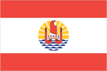
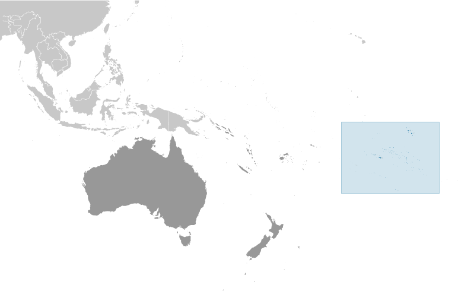
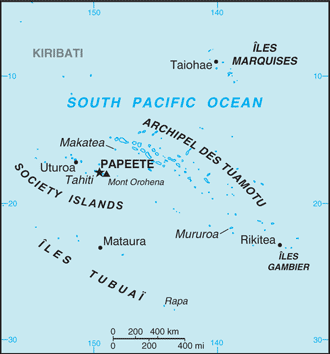

# French Polynesia

_overseas lands of France_

## Introduction

**_Background:_**   
The French annexed various Polynesian island groups during the 19th century. In September 1995, France stirred up widespread protests by resuming nuclear testing on the Mururoa atoll after a three-year moratorium. The tests were halted in January 1996. In recent years, French Polynesia's autonomy has been considerably expanded.

## Geography

**_Location:_**   
Oceania, five archipelagoes (Archipel des Tuamotu, Iles Gambier, Iles Marquises, Iles Tubuai, Society Islands) in the South Pacific Ocean about half way between South America and Australia

**_Geographic coordinates:_**   
15 00 S, 140 00 W

**_Map references:_**   
Oceania

**_Area:_**   
**total:** 4,167 sq km (118 islands and atolls)   
**land:** 3,827 sq km   
**water:** 340 sq km

**_Area - comparative:_**   
slightly less than one-third the size of Connecticut

**_Land boundaries:_**   
0 km

**_Coastline:_**   
2,525 km

**_Maritime claims:_**   
**territorial sea:** 12 nm   
**exclusive economic zone:** 200 nm

**_Climate:_**   
tropical, but moderate

**_Terrain:_**   
mixture of rugged high islands and low islands with reefs

**_Elevation extremes:_**   
**lowest point:** Pacific Ocean 0 m   
**highest point:** Mont Orohena 2,241 m

**_Natural resources:_**   
timber, fish, cobalt, hydropower

**_Land use:_**   
**arable land:** 0.68%   
**permanent crops:** 6.28%   
**other:** 93.03% (2011)

**_Irrigated land:_**   
10 sq km (2003)

**_Natural hazards:_**   
occasional cyclonic storms in January

**_Environment - current issues:_**   
NA

**_Geography - note:_**   
includes five archipelagoes: four volcanic (Iles Gambier, Iles Marquises, Iles Tubuai, Society Islands) and one coral (Archipel des Tuamotu); Makatea in French Polynesia is one of the three great phosphate rock islands in the Pacific Ocean - the others are Banaba (Ocean Island) in Kiribati and Nauru

## People and Society

**_Nationality:_**   
**noun:** French Polynesian(s)   
**adjective:** French Polynesian

**_Ethnic groups:_**   
Polynesian 78%, Chinese 12%, local French 6%, metropolitan French 4%

**_Languages:_**   
French (official) 61.1%, Polynesian (official) 31.4%, Asian languages 1.2%, other 0.3%, unspecified 6% (2002 census)

**_Religions:_**   
Protestant 54%, Roman Catholic 30%, other 10%, no religion 6%

**_Population:_**   
280,026 (July 2014 est.)

**_Age structure:_**   
**0-14 years:** 23.7% (male 34,182/female 32,276)   
**15-24 years:** 16.7% (male 24,219/female 22,559)   
**25-54 years:** 43.9% (male 63,034/female 59,859)   
**55-64 years:** 8.5% (male 12,305/female 11,599)   
**65 years and over:** 6.9% (male 9,713/female 10,280) (2014 est.)

**_Dependency ratios:_**   
**total dependency ratio:** 42.5 %   
**youth dependency ratio:** 32 %   
**elderly dependency ratio:** 10.5 %   
**potential support ratio:** 9.6 (2014 est.)

**_Median age:_**   
**total:** 30.6 years   
**male:** 30.5 years   
**female:** 30.7 years (2014 est.)

**_Population growth rate:_**   
0.97% (2014 est.)

**_Birth rate:_**   
15.47 births/1,000 population (2014 est.)

**_Death rate:_**   
4.93 deaths/1,000 population (2014 est.)

**_Net migration rate:_**   
-0.87 migrant(s)/1,000 population (2014 est.)

**_Urbanization:_**   
**urban population:** 51.4% of total population (2011)   
**rate of urbanization:** 1.07% annual rate of change (2010-15 est.)

**_Major urban areas - population:_**   
PAPEETE (capital) 137,000 (2011)

**_Sex ratio:_**   
**at birth:** 1.05 male(s)/female   
**0-14 years:** 1.06 male(s)/female   
**15-24 years:** 1.07 male(s)/female   
**25-54 years:** 1.05 male(s)/female   
**55-64 years:** 1.05 male(s)/female   
**65 years and over:** 0.95 male(s)/female   
**total population:** 1.05 male(s)/female (2014 est.)

**_Infant mortality rate:_**   
**total:** 4.78 deaths/1,000 live births   
**male:** 5.31 deaths/1,000 live births   
**female:** 4.22 deaths/1,000 live births (2014 est.)

**_Life expectancy at birth:_**   
**total population:** 76.79 years   
**male:** 74.54 years   
**female:** 79.15 years (2014 est.)

**_Total fertility rate:_**   
1.95 children born/woman (2014 est.)

**_Drinking water source:_**   
**improved:** urban: 100% of population; rural: 100% of population; total: 100% of population   
**unimproved:** urban: 0% of population; rural: 0% of population; total: 0% of population (2012 est.)

**_Sanitation facility access:_**   
**improved:** urban: 97.1% of population; rural: 97.1% of population; total: 97.1% of population   
**unimproved:** urban: 2.9% of population; rural: 2.9% of population; total: 2.9% of population (2012 est.)

**_HIV/AIDS - adult prevalence rate:_**   
NA

**_HIV/AIDS - people living with HIV/AIDS:_**   
NA

**_HIV/AIDS - deaths:_**   
NA

**_Literacy:_**   
**definition:** age 14 and over can read and write   
**total population:** 98%   
**male:** 98%   
**female:** 98% (1977 est.)

**_Unemployment, youth ages 15-24:_**   
**total:** 33.2%   
**male:** 29.3%   
**female:** 39.1% (2002)

## Government

**_Country name:_**   
**conventional long form:** Overseas Lands of French Polynesia   
**conventional short form:** French Polynesia   
**local long form:** Pays d'outre-mer de la Polynesie Francaise   
**local short form:** Polynesie Francaise   
**former:** French Colony of Oceania

**_Dependency status:_**   
overseas lands of France; overseas territory of France from 1946-2003; overseas collectivity of France since 2003, though it is often referred to as an overseas country due to its degree of autonomy

**_Government type:_**   
parliamentary representative democratic French overseas collectivity

**_Capital:_**   
**name:** Papeete (located on Tahiti)   
**geographic coordinates:** 17 32 S, 149 34 W   
**time difference:** UTC-10 (5 hours behind Washington, DC, during Standard Time)

**_Administrative divisions:_**   
none (overseas lands of France); there are no first-order administrative divisions as defined by the US Government, but there are five second order administrative units named Iles Australes, Iles du Vent, Iles Marquises, Iles Sous le Vent, Iles Tuamotu et Gambier

**_Independence:_**   
none (overseas lands of France)

**_National holiday:_**   
Fete de la Federation, 14 July (1789); note - the local holiday is Internal Autonomy Day, 29 June (1880)

**_Constitution:_**   
4 October 1958 (French Constitution)

**_Legal system:_**   
the laws of France, where applicable, apply

**_Suffrage:_**   
18 years of age; universal

**_Executive branch:_**   
**chief of state:** President Francois HOLLANDE (since 15 May 2012), represented by High Commissioner of the Republic Lionel BEFFRE (since 16 September 2013)   
**head of government:** President of French Polynesia Gaston FLOSS (since 17 May 2013); President of the Assembly of French Polynesia L. Edouard FRITCH (since 16 May 2013)   
**cabinet:** Council of Ministers; president submits a list of members of the Assembly for approval by them to serve as ministers   
**elections:** French president elected by popular vote for a five-year term; high commissioner appointed by the French president on the advice of the French Ministry of Interior; president of the French Polynesia government and the president of the Assembly of French Polynesia elected by the members of the assembly for five-year terms (no term limits)

**_Legislative branch:_**   
unicameral Assembly of French Polynesia or Assemblee de la Polynesia francaise (57 seats; members elected by popular vote to serve five-year terms)   
**elections:** last held on 21 April 2013 (first round) and 5 May 2013 (second round) (next to be held in 2018)   
**election results:** percent of vote by party - Popular Rally 45.1%, Union for Democracy alliance 29.3%, A Tia Porinetia 25.6%, other 15.8%; seats by party - Popular Rally 38, Union for Democracy alliance 11, A Tia Porinetia 8   
**note:** two seats were elected to the French Senate on 21 September 2008 (next to be held in September 2014); results - percent of vote by party - NA; seats by party - UMP 1, independent 1; three seats were elected to the French National Assembly on 17 June 2012 (next to be held by June 2017); results - percent of vote by party - NA; seats by party - UMP 3

**_Judicial branch:_**   
**highest court(s):** Court of Appeal or Cour d'Appel (composition NA); note - appeals beyond the French Polynesia Court of Appeal are heard by the Court of Cassation (in Paris)   
**judge selection and term of office:** NA   
**subordinate courts:** Court of the First Instance or Tribunal de Premiere Instance; Court of Administrative Law or Tribunal Administratif

**_Political parties and leaders:_**   
A Tia Porinetia [Teva ROHFRITSCH]   
Alliance for a New Democracy or ADN (includes the parties The New Star and This Country is Yours)   
New Fatherland Party (Ai'a Api) [Emile Vernaudon]   
Our Home alliance   
People's Servant Party (Tavini Huiraatira) [Oscar TEMARU]   
Popular Rally (Tahoeraa Huiraatira) [Gaston FLOSSE]   
Union for Democracy alliance or UPD [Oscar TEMARU]

**_Political pressure groups and leaders:_**   
NA

**_International organization participation:_**   
ITUC (NGOs), PIF (associate member), SPC, UPU

**_Diplomatic representation in the US:_**   
none (overseas lands of France)

**_Diplomatic representation from the US:_**   
none (overseas lands of France)

**_Flag description:_**   
two red horizontal bands encase a wide white band in a 1:2:1 ratio; centered on the white band is a disk with a blue and white wave pattern depicting the sea on the lower half and a gold and white ray pattern depicting the sun on the upper half; a Polynesian canoe rides on the wave pattern; the canoe has a crew of five represented by five stars that symbolize the five island groups; red and white are traditional Polynesian colors   
**note:** similar to the red-white-red flag of Tahiti, the largest of the islands in French Polynesia, which has no emblem in the white band; the flag of France is used for official occasions

**_National symbol(s):_**   
outrigger canoe

**_National anthem:_**   
**name:** "Ia Ora 'O Tahiti Nui" (Long Live Tahiti Nui)   
**lyrics/music:** Maeva BOUGES, Irmine TEHEI, Angele TEROROTUA, Johanna NOUVEAU, Patrick AMARU, Louis MAMATUI and Jean-Pierre CELESTIN   
**note:** adopted 1993; serves as a local anthem; as a territory of France, "La Marseillaise" is official (see France)

**_Government - note:_**   
under certain acts of France, French Polynesia has acquired autonomy in all areas except those relating to police and justice, monetary policy, tertiary education, immigration, and defense and foreign affairs; the duties of its president are fashioned after those of the French prime minister

## Economy

**_Economy - overview:_**   
Since 1962, when France stationed military personnel in the region, French Polynesia has changed from a subsistence agricultural economy to one in which a high proportion of the work force is either employed by the military or supports the tourist industry. With the halt of French nuclear testing in 1996, the military contribution to the economy fell sharply. Tourism accounts for about one-fourth of GDP and is a primary source of hard currency earnings. Other sources of income are handicrafts, public works projects, aquaculture, pearl farming and deep-sea commercial fishing. The small manufacturing sector primarily processes agricultural products. The territory benefits substantially from development agreements with France aimed principally at creating new businesses and strengthening social services.

**_GDP (purchasing power parity):_**   
$5.65 billion (2006 est.)   
$5.674 billion (2005 est.)   
$5.525 billion (2004 est.)

**_GDP (official exchange rate):_**   
$5.65 billion (2006)

**_GDP - real growth rate:_**   
-0.4% (2006)   
2.7% (2005)

**_GDP - per capita (PPP):_**   
$22,000 (2006 est.)   
$18,000 (2004 est.)

**_GDP - composition, by sector of origin:_**   
**agriculture:** 3.1%   
**industry:** 20%   
**services:** 76.9% (2006)

**_Agriculture - products:_**   
coconuts, vanilla, vegetables, fruits, coffee; poultry, beef, dairy products; fish

**_Industries:_**   
tourism, pearls, agricultural processing, handicrafts, phosphates

**_Industrial production growth rate:_**   
NA%

**_Labor force:_**   
116,000 (2007)

**_Labor force - by occupation:_**   
**agriculture:** 13%   
**industry:** 19%   
**services:** 68% (2002)

**_Unemployment rate:_**   
11.7% (2010)   
11.7% (2005)

**_Population below poverty line:_**   
19.7% (2009)

**_Household income or consumption by percentage share:_**   
**lowest 10%:** NA%   
**highest 10%:** NA%

**_Budget:_**   
**revenues:** $865 million   
**expenditures:** $644.1 million (1999)

**_Taxes and other revenues:_**   
15.3% of GDP (1999)

**_Budget surplus (+) or deficit (-):_**   
3.9% of GDP (1999)

**_Fiscal year:_**   
calendar year

**_Inflation rate (consumer prices):_**   
1.1% (2007)   
1.1% (2006 est.)

**_Market value of publicly traded shares:_**   
$NA

**_Exports:_**   
$200 million (2008 est.)   
$211 million (2005 est.)

**_Exports - commodities:_**   
cultured pearls, coconut products, mother-of-pearl, vanilla, shark meat

**_Imports:_**   
$2.2 billion (2008 est.)   
$1.706 billion (2005 est.)

**_Imports - commodities:_**   
fuels, foodstuffs, machinery and equipment

**_Debt - external:_**   
$NA

**_Exchange rates:_**   
Comptoirs Francais du Pacifique francs (XPF) per US dollar -   
90.01 (2010 est.)   
87.59 (2007)

## Energy

**_Electricity - production:_**   
672 million kWh (2010 est.)

**_Electricity - consumption:_**   
625 million kWh (2010 est.)

**_Electricity - exports:_**   
0 kWh (2012 est.)

**_Electricity - imports:_**   
0 kWh (2012 est.)

**_Electricity - installed generating capacity:_**   
186,000 kW (2010 est.)

**_Electricity - from fossil fuels:_**   
74.7% of total installed capacity (2010 est.)

**_Electricity - from nuclear fuels:_**   
0% of total installed capacity (2010 est.)

**_Electricity - from hydroelectric plants:_**   
25.3% of total installed capacity (2010 est.)

**_Electricity - from other renewable sources:_**   
0% of total installed capacity (2010 est.)

**_Crude oil - production:_**   
0 bbl/day (2012 est.)

**_Crude oil - exports:_**   
0 bbl/day (2010 est.)

**_Crude oil - imports:_**   
0 bbl/day (2010 est.)

**_Crude oil - proved reserves:_**   
0 bbl (1 January 2013 est.)

**_Refined petroleum products - production:_**   
0 bbl/day (2010 est.)

**_Refined petroleum products - consumption:_**   
8,000 bbl/day (2011 est.)

**_Refined petroleum products - exports:_**   
0 bbl/day (2010 est.)

**_Refined petroleum products - imports:_**   
7,190 bbl/day (2010 est.)

**_Natural gas - production:_**   
0 cu m (2011 est.)

**_Natural gas - consumption:_**   
0 cu m (2010 est.)

**_Natural gas - exports:_**   
0 cu m (2011 est.)

**_Natural gas - imports:_**   
0 cu m (2011 est.)

**_Natural gas - proved reserves:_**   
0 cu m (1 January 2013 est.)

**_Carbon dioxide emissions from consumption of energy:_**   
1.22 million Mt (2011 est.)

## Communications

**_Telephones - main lines in use:_**   
55,000 (2012)

**_Telephones - mobile cellular:_**   
226,000 (2012)

**_Telephone system:_**   
**domestic:** combined fixed and mobile-cellular density is roughly 100 per 100 persons   
**international:** country code - 689; satellite earth station - 1 Intelsat (Pacific Ocean) (2011)

**_Broadcast media:_**   
the publicly owned French Overseas Network (RFO), which operates in France's overseas departments and territories, broadcasts on 2 TV channels and 1 radio station; 1 government-owned TV station; a small number of privately owned radio stations (2008)

**_Internet country code:_**   
.pf

**_Internet hosts:_**   
37,949 (2012)

**_Internet users:_**   
120,000 (2009)

## Transportation

**_Airports:_**   
54 (2013)

**_Airports - with paved runways:_**   
**total:** 45   
**over 3,047 m:** 2   
**1,524 to 2,437 m:** 5   
**914 to 1,523 m:** 33   
**under 914 m:** 5 (2013)

**_Airports - with unpaved runways:_**   
**total:** 9   
**914 to 1,523 m:** 4   
**under 914 m:** 5 (2013)

**_Heliports:_**   
1 (2013)

**_Roadways:_**   
**total:** 2,590 km   
**paved:** 1,735 km   
**unpaved:** 855 km (1999)

**_Merchant marine:_**   
**registered in other countries:** 12 (Cambodia 1, France 11) (2010)

**_Ports and terminals:_**   
**major seaport(s):** Papeete

## Military

**_Military branches:_**   
no regular military forces (2011)

**_Manpower available for military service:_**   
**males age 16-49:** 82,722 (2010 est.)

**_Manpower fit for military service:_**   
**males age 16-49:** 67,363   
**females age 16-49:** 66,053 (2010 est.)

**_Manpower reaching militarily significant age annually:_**   
**male:** 2,498   
**female:** 2,390 (2010 est.)

**_Military - note:_**   
defense is the responsibility of France

## Transnational Issues

**_Disputes - international:_**   
none

............................................................   
_Page last updated on June 20, 2014_
