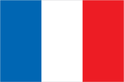
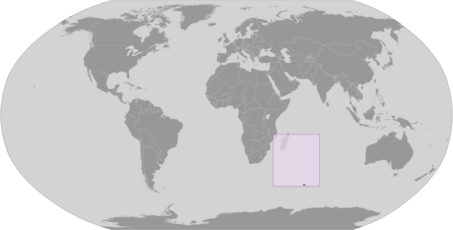
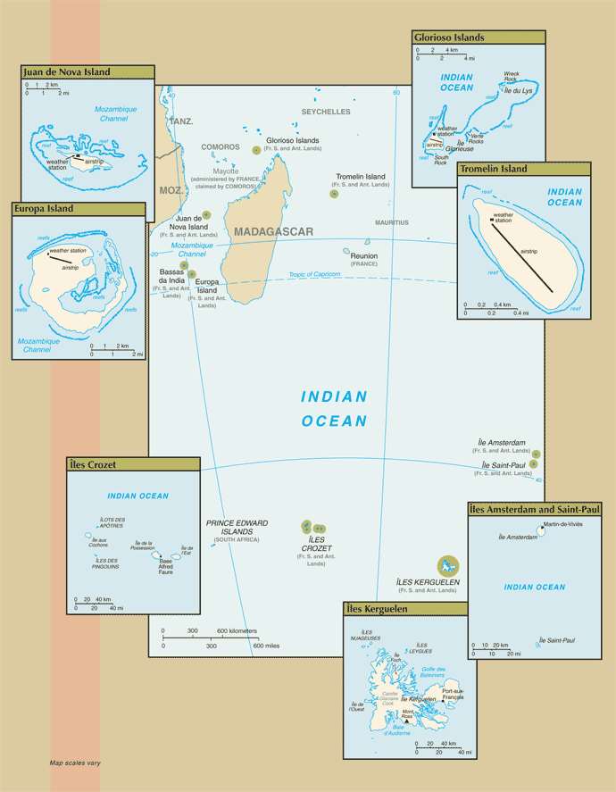

# French Southern and Antarctic Lands

_overseas territory of France_

## Introduction

**_Background:_**   
In February 2007, the Iles Eparses became an integral part of the French Southern and Antarctic Lands (TAAF). The Southern Lands are now divided into five administrative districts, two of which are archipelagos, Iles Crozet and Iles Kerguelen; the third is a district composed of two volcanic islands, Ile Saint-Paul and Ile Amsterdam; the fourth, Iles Eparses, consists of five scattered tropical islands around Madagascar. They contain no permanent inhabitants and are visited only by researchers studying the native fauna, scientists at the various scientific stations, fishermen, and military personnel. The fifth district is the Antarctic portion, which consists of "Adelie Land," a thin slice of the Antarctic continent discovered and claimed by the French in 1840.   
**Ile Amsterdam:** Discovered but not named in 1522 by the Spanish, the island subsequently received the appellation of Nieuw Amsterdam from a Dutchman; it was claimed by France in 1843. A short-lived attempt at cattle farming began in 1871. A French meteorological station established on the island in 1949 is still in use.   
**Ile Saint Paul:** Claimed by France since 1893, the island was a fishing industry center from 1843 to 1914. In 1928, a spiny lobster cannery was established, but when the company went bankrupt in 1931, seven workers were abandoned. Only two survived until 1934 when rescue finally arrived.   
**Iles Crozet:** A large archipelago formed from the Crozet Plateau, Iles Crozet is divided into two main groups: L'Occidental (the West), which includes Ile aux Cochons, Ilots des Apotres, Ile des Pingouins, and the reefs Brisants de l'Heroine; and L'Oriental (the East), which includes Ile d'Est and Ile de la Possession (the largest island of the Crozets). Discovered and claimed by France in 1772, the islands were used for seal hunting and as a base for whaling. Originally administered as a dependency of Madagascar, they became part of the TAAF in 1955.   
**Iles Kerguelen:** This island group, discovered in 1772, is made up of one large island (Ile Kerguelen) and about 300 smaller islands. A permanent group of 50 to 100 scientists resides at the main base at Port-aux-Francais.   
**Adelie Land:** The only non-insular district of the TAAF is the Antarctic claim known as "Adelie Land." The US Government does not recognize it as a French dependency.   
**Bassas da India:** A French possession since 1897, this atoll is a volcanic rock surrounded by reefs and is awash at high tide.   
**Europa Island:** This heavily wooded island has been a French possession since 1897; it is the site of a small military garrison that staffs a weather station.   
**Glorioso Islands:** A French possession since 1892, the Glorioso Islands are composed of two lushly vegetated coral islands (Ile Glorieuse and Ile du Lys) and three rock islets. A military garrison operates a weather and radio station on Ile Glorieuse.   
**Juan de Nova Island:** Named after a famous 15th century Spanish navigator and explorer, the island has been a French possession since 1897. It has been exploited for its guano and phosphate. Presently a small military garrison oversees a meteorological station.   
**Tromelin Island:** First explored by the French in 1776, the island came under the jurisdiction of Reunion in 1814. At present, it serves as a sea turtle sanctuary and is the site of an important meteorological station.

## Geography

**_Location:_**   
southeast and east of Africa, islands in the southern Indian Ocean, some near Madagascar and others about equidistant between Africa, Antarctica, and Australia; note - French Southern and Antarctic Lands include Ile Amsterdam, Ile Saint-Paul, Iles Crozet, Iles Kerguelen, Bassas da India, Europa Island, Glorioso Islands, Juan de Nova Island, and Tromelin Island in the southern Indian Ocean, along with the French-claimed sector of Antarctica, "Adelie Land"; the US does not recognize the French claim to "Adelie Land"

**_Geographic coordinates:_**   
**Ile Amsterdam (Ile Amsterdam et Ile Saint-Paul):** 37 50 S, 77 32 E   
**Ile Saint-Paul (Ile Amsterdam et Ile Saint-Paul):** 38 72 S, 77 53 E   
**Iles Crozet:** 46 25 S, 51 00 E   
**Iles Kerguelen:** 49 15 S, 69 35 E   
**Bassas da India (Iles Eparses):** 21 30 S, 39 50 E   
**Europa Island (Iles Eparses):** 22 20 S, 40 22 E   
**Glorioso Islands (Iles Eparses):** 11 30 S, 47 20 E   
**Juan de Nova Island (Iles Eparses):** 17 03 S, 42 45 E   
**Tromelin Island (Iles Eparses):** 15 52 S, 54 25 E

**_Map references:_**   
Antarctic Region

**_Area:_**   
**Ile Amsterdam (Ile Amsterdam et Ile Saint-Paul):** total - 55 sq km; land - 55 sq km; water - 0 sq km   
**Ile Saint-Paul (Ile Amsterdam et Ile Saint-Paul):** total - 7 sq km; land - 7 sq km; water - 0 sq km   
**Iles Crozet:** total - 352 sq km; land - 352 sq km; water - 0 sq km   
**Iles Kerguelen:** total - 7,215 sq km; land - 7,215 sq km; water - 0 sq km   
**Bassas da India (Iles Eparses):** total - 80 sq km; land - 0.2 sq km; water - 79.8 sq km (lagoon)   
**Europa Island (Iles Eparses):** total - 28 sq km; land - 28 sq km; water - 0 sq km   
**Glorioso Islands (Iles Eparses):** total - 5 sq km; land - 5 sq km; water - 0 sq km   
**Juan de Nova Island (Iles Eparses):** total - 4.4 sq km; land - 4.4 sq km; water - 0 sq km   
**Tromelin Island (Iles Eparses):** total - 1 sq km; land - 1 sq km; water - 0 sq km   
**note:** excludes "Adelie Land" claim of about 500,000 sq km in Antarctica that is not recognized by the US

**_Area - comparative:_**   
**Ile Amsterdam (Ile Amsterdam et Ile Saint-Paul):** less than one-half the size of Washington, DC   
**Ile Saint-Paul (Ile Amsterdam et Ile Saint-Paul):** more than 10 times the size of The Mall in Washington, DC   
**Iles Crozet:** about twice the size of Washington, DC   
**Iles Kerguelen:** slightly larger than Delaware   
**Bassas da India (Iles Eparses):** land area about one-third the size of The Mall in Washington, DC   
**Europa Island (Iles Eparses):** about one-sixth the size of Washington, DC   
**Glorioso Islands (Iles Eparses):** about eight times the size of The Mall in Washington, DC   
**Juan de Nova Island (Iles Eparses):** about seven times the size of The Mall in Washington, DC   
**Tromelin Island (Iles Eparses):** about 1.7 times the size of The Mall in Washington, DC

**_Land boundaries:_**   
0 km

**_Coastline:_**   
**Ile Amsterdam (Ile Amsterdam et Ile Saint-Paul):** 28 km   
**Ile Saint-Paul (Ile Amsterdam et Ile Saint-Paul):**    
**Iles Kerguelen:** 2,800 km   
**Bassas da India (Iles Eparses):** 35.2 km   
**Europa Island (Iles Eparses):** 22.2 km   
**Glorioso Islands (Iles Eparses):** 35.2 km   
**Juan de Nova Island (Iles Eparses):** 24.1 km   
**Tromelin Island (Iles Eparses):** 3.7 km

**_Maritime claims:_**   
**territorial sea:** 12 nm   
**exclusive economic zone:** 200 nm from Iles Kerguelen and Iles Eparses (does not include the rest of French Southern and Antarctic Lands); Juan de Nova Island and Tromelin Island claim a continental shelf of 200-m depth or to the depth of exploitation

**_Climate:_**   
**Ile Amsterdam et Ile Saint-Paul:** oceanic with persistent westerly winds and high humidity   
**Iles Crozet:** windy, cold, wet, and cloudy   
**Iles Kerguelen:** oceanic, cold, overcast, windy   
**Iles Eparses:** tropical

**_Terrain:_**   
**Ile Amsterdam (Ile Amsterdam et Ile Saint-Paul):** a volcanic island with steep coastal cliffs; the center floor of the volcano is a large plateau   
**Ile Saint-Paul (Ile Amsterdam et Ile Saint-Paul):** triangular in shape, the island is the top of a volcano, rocky with steep cliffs on the eastern side; has active thermal springs   
**Iles Crozet:** a large archipelago formed from the Crozet Plateau is divided into two groups of islands   
**Iles Kerguelen:** the interior of the large island of Ile Kerguelen is composed of rugged terrain of high mountains, hills, valleys, and plains with a number of peninsulas stretching off its coasts   
**Bassas da India (Iles Eparses):** atoll, awash at high tide; shallow (15 m) lagoon   
**Europa Island, Glorioso Islands, Juan de Nova Island:** low, flat, and sandy   
**Tromelin Island (Iles Eparses):** low, flat, sandy; likely volcanic seamount

**_Elevation extremes:_**   
**lowest point:** Indian Ocean 0 m   
**highest point:** Mont de la Dives on Ile Amsterdam (Ile Amsterdam et Ile Saint-Paul) 867 m; unnamed location on Ile Saint-Paul (Ile Amsterdam et Ile Saint-Paul) 272 m; Pic Marion-Dufresne in Iles Crozet 1,090 m; Mont Ross in Iles Kerguelen 1,850 m; unnamed location on Bassas de India (Iles Eparses) 2.4 m; unnamed location on Europa Island (Iles Eparses) 24 m; unnamed location on Glorioso Islands (Iles Eparses) 12 m; unnamed location on Juan de Nova Island (Iles Eparses) 10 m; unnamed location on Tromelin Island (Iles Eparses) 7 m

**_Natural resources:_**   
fish, crayfish   
**note:** Glorioso Islands and Tromelin Island (Iles Eparses) have guano, phosphates, and coconuts

**_Land use:_**   
Ile Amsterdam (Ile Amsterdam et Ile Saint-Paul) - 100% trees, grasses, ferns, and moss; Ile Saint-Paul (Ile Amsterdam et Ile Saint-Paul) - 100% grass, ferns, and moss; Iles Crozet - 100% tossock grass, heath, and fern; Iles Kerguelen - 100% tossock grass and Kerguelen cabbage; Bassas da India (Iles Eparses) - 100% rock, coral reef, and sand; Europa Island (Iles Eparses) - 100% mangrove swamp and dry woodlands; Glorioso Islands (Iles Eparses) - 100% lush vegetation and coconut palms; Juan de Nova Island (Iles Eparses) - 90% forest, 10% other; Tromelin Island (Iles Eparses) - 100% grasses and scattered brush (2011)

**_Irrigated land:_**   
0 sq km (2011)

**_Natural hazards:_**   
Ile Amsterdam and Ile Saint-Paul are inactive volcanoes; Iles Eparses subject to periodic cyclones; Bassas da India is a maritime hazard since it is under water for a period of three hours prior to and following the high tide and surrounded by reefs   
**volcanism:** Reunion Island - Piton de la Fournaise (elev. 2,632 m, ), which has erupted many times in recent years including 2010, is one of the world's most active volcanoes; although rare, eruptions outside the volcano's caldera could threaten nearby cities

**_Environment - current issues:_**   
introduction of foreign species on Iles Crozet has caused severe damage to the original ecosystem; overfishing of Patagonian toothfish around Iles Crozet and Iles Kerguelen

**_Geography - note:_**   
islands component is widely scattered across remote locations in the southern Indian Ocean   
**Bassas da India (Iles Eparses):** the atoll is a circular reef that sits atop a long-extinct, submerged volcano   
**Europa Island and Juan de Nova Island (Iles Eparses):** wildlife sanctuary for seabirds and sea turtles   
**Glorioso Island (Iles Eparses):** the islands and rocks are surrounded by an extensive reef system   
**Tromelin Island (Iles Eparses):** climatologically important location for forecasting cyclones in the western Indian Ocean; wildlife sanctuary (seabirds, tortoises)

## People and Society

**_Population:_**   
no indigenous inhabitants   
**Ile Amsterdam (Ile Amsterdam et Ile Saint-Paul):** has no permanent residents but has a meteorological station   
**Ile Saint-Paul (Ile Amsterdam et Ile Saint-Paul):** is uninhabited but is frequently visited by fishermen and has a scientific research cabin for short stays   
**Iles Crozet:** are uninhabited except for 18 to 30 people staffing the Alfred Faure research station on Ile del la Possession   
**Iles Kerguelen:** 50 to 100 scientists are located at the main base at Port-aux-Francais on Ile Kerguelen   
**Bassas da India (Iles Eparses):** uninhabitable   
**Europa Island, Glorioso Islands, Juan de Nova Island (Iles Eparses):** a small French military garrison and a few meteorologists on each possession; visited by scientists   
**Tromelin Island (Iles Eparses):** uninhabited, except for visits by scientists

## Government

**_Country name:_**   
**conventional long form:** Territory of the French Southern and Antarctic Lands   
**conventional short form:** French Southern and Antarctic Lands   
**local long form:** Territoire des Terres Australes et Antarctiques Francaises   
**local short form:** Terres Australes et Antarctiques Francaises   
**abbreviation:** TAAF

**_Dependency status:_**   
overseas territory of France since 1955

**_Administrative divisions:_**   
none (overseas territory of France); there are no first-order administrative divisions as defined by the US Government, but there are five administrative districts named Iles Crozet, Iles Eparses, Iles Kerguelen, Ile Saint-Paul et Ile Amsterdam; the fifth district is the "Adelie Land" claim in Antarctica that is not recognized by the US

**_Legal system:_**   
the laws of France, where applicable, apply

**_Executive branch:_**   
**chief of state:** President Francois HOLLANDE (since 15 May 2012), represented by Senior Administrator Pascal BOLOT (since 29 February 2012)

**_International organization participation:_**   
UPU

**_Diplomatic representation in the US:_**   
none (overseas territory of France)

**_Diplomatic representation from the US:_**   
none (overseas territory of France)

**_Flag description:_**   
the flag of France is used

**_National symbol(s):_**   
sea lion

**_National anthem:_**   
**note:** as a territory of France, "La Marseillaise" is official (see France)

## Economy

**_Economy - overview:_**   
Economic activity is limited to servicing meteorological and geophysical research stations, military bases, and French and other fishing fleets. The fish catches landed on Iles Kerguelen by foreign ships are exported to France and Reunion.

## Communications

**_Internet country code:_**   
.tf

**_Internet hosts:_**   
53 (2012)

**_Communications - note:_**   
has one or more meteorological stations on each possession

## Transportation

**_Airports:_**   
4; note - one each on Europa Island, Glorioso Islands, Juan de Nova Island, and Tromelin Island in the Iles Eparses district (2013)

**_Ports and terminals:_**   
none; offshore anchorage only

## Military

**_Military - note:_**   
defense is the responsibility of France

## Transnational Issues

**_Disputes - international:_**   
French claim to "Adelie Land" in Antarctica is not recognized by the US   
**Bassas da India, Europa Island, Glorioso Islands, Juan de Nova Island (Iles Eparses):** claimed by Madagascar; the vegetated drying cays of Banc du Geyser, which were claimed by Madagascar in 1976, also fall within the EEZ claims of the Comoros and France (Glorioso Islands)

............................................................   
_Page last updated on March 27, 2014_
