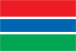
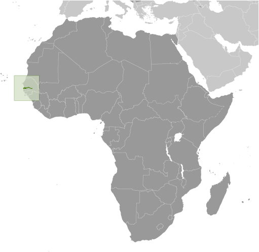
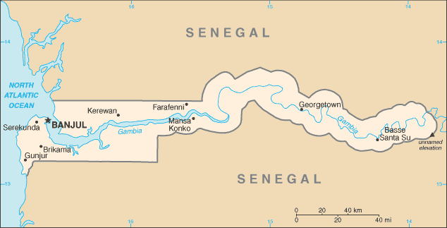

# Gambia, The

## Introduction

**_Background:_**   
The Gambia gained its independence from the UK in 1965. Geographically surrounded by Senegal, it formed a short-lived federation of Senegambia between 1982 and 1989. In 1991 the two nations signed a friendship and cooperation treaty, but tensions have flared up intermittently since then. Yahya JAMMEH led a military coup in 1994 that overthrew the president and banned political activity. A new constitution and presidential elections in 1996, followed by parliamentary balloting in 1997, completed a nominal return to civilian rule. JAMMEH has been elected president in all subsequent elections including most recently in late 2011.

## Geography

**_Location:_**   
Western Africa, bordering the North Atlantic Ocean and Senegal

**_Geographic coordinates:_**   
13 28 N, 16 34 W

**_Map references:_**   
Africa

**_Area:_**   
**total:** 11,295 sq km   
**land:** 10,000 sq km   
**water:** 1,295 sq km

**_Area - comparative:_**   
slightly less than twice the size of Delaware

**_Land boundaries:_**   
**total:** 749 km   
**border countries:** Senegal 749 km

**_Coastline:_**   
80 km

**_Maritime claims:_**   
**territorial sea:** 12 nm   
**contiguous zone:** 18 nm   
**exclusive fishing zone:** 200 nm   
**continental shelf:** extent not specified

**_Climate:_**   
tropical; hot, rainy season (June to November); cooler, dry season (November to May)

**_Terrain:_**   
flood plain of the Gambia River flanked by some low hills

**_Elevation extremes:_**   
**lowest point:** Atlantic Ocean 0 m   
**highest point:** unnamed elevation 53 m

**_Natural resources:_**   
fish, clay, silica sand, titanium (rutile and ilmenite), tin, zircon

**_Land use:_**   
**arable land:** 39.82%   
**permanent crops:** 0.44%   
**other:** 59.73% (2011)

**_Irrigated land:_**   
50 sq km (2011)

**_Total renewable water resources:_**   
8 cu km (2011)

**_Freshwater withdrawal (domestic/industrial/agricultural):_**   
**total:** 0.09 cu km/yr (41%/21%/39%)   
**per capita:** 65.77 cu m/yr (2005)

**_Natural hazards:_**   
drought (rainfall has dropped by 30% in the last 30 years)

**_Environment - current issues:_**   
deforestation; desertification; water-borne diseases prevalent

**_Environment - international agreements:_**   
**party to:** Biodiversity, Climate Change, Climate Change-Kyoto Protocol, Desertification, Endangered Species, Hazardous Wastes, Law of the Sea, Ozone Layer Protection, Ship Pollution, Wetlands, Whaling   
**signed, but not ratified:** none of the selected agreements

**_Geography - note:_**   
almost an enclave of Senegal; smallest country on the continent of Africa

## People and Society

**_Nationality:_**   
**noun:** Gambian(s)   
**adjective:** Gambian

**_Ethnic groups:_**   
African 99% (Mandinka 42%, Fula 18%, Wolof 16%, Jola 10%, Serahuli 9%, other 4%), non-African 1% (2003 census)

**_Languages:_**   
English (official), Mandinka, Wolof, Fula, other indigenous vernaculars

**_Religions:_**   
Muslim 90%, Christian 8%, indigenous beliefs 2%

**_Population:_**   
1,925,527 (July 2014 est.)

**_Age structure:_**   
**0-14 years:** 38.7% (male 374,353/female 371,488)   
**15-24 years:** 21% (male 199,306/female 204,324)   
**25-54 years:** 33% (male 310,901/female 324,227)   
**55-64 years:** 4% (male 37,506/female 39,958)   
**65 years and over:** 3.2% (male 29,793/female 33,671) (2014 est.)

**_Dependency ratios:_**   
**total dependency ratio:** 93 %   
**youth dependency ratio:** 88.4 %   
**elderly dependency ratio:** 4.5 %   
**potential support ratio:** 22 (2014 est.)

**_Median age:_**   
**total:** 20.2 years   
**male:** 19.9 years   
**female:** 20.5 years (2014 est.)

**_Population growth rate:_**   
2.23% (2014 est.)

**_Birth rate:_**   
31.75 births/1,000 population (2014 est.)

**_Death rate:_**   
7.26 deaths/1,000 population (2014 est.)

**_Net migration rate:_**   
-2.23 migrant(s)/1,000 population (2014 est.)

**_Urbanization:_**   
**urban population:** 57.3% of total population (2011)   
**rate of urbanization:** 3.63% annual rate of change (2010-15 est.)

**_Major urban areas - population:_**   
BANJUL (capital) 506,000 (2011)

**_Sex ratio:_**   
**at birth:** 1.03 male(s)/female   
**0-14 years:** 1.01 male(s)/female   
**15-24 years:** 0.98 male(s)/female   
**25-54 years:** 0.96 male(s)/female   
**55-64 years:** 0.98 male(s)/female   
**65 years and over:** 0.9 male(s)/female   
**total population:** 0.98 male(s)/female (2014 est.)

**_Maternal mortality rate:_**   
360 deaths/100,000 live births (2010)

**_Infant mortality rate:_**   
**total:** 65.74 deaths/1,000 live births   
**male:** 71.21 deaths/1,000 live births   
**female:** 60.11 deaths/1,000 live births (2014 est.)

**_Life expectancy at birth:_**   
**total population:** 64.36 years   
**male:** 62.04 years   
**female:** 66.74 years (2014 est.)

**_Total fertility rate:_**   
3.85 children born/woman (2014 est.)

**_Contraceptive prevalence rate:_**   
13.3% (2010)

**_Health expenditures:_**   
4.4% of GDP (2011)

**_Physicians density:_**   
0.11 physicians/1,000 population (2008)

**_Hospital bed density:_**   
1.1 beds/1,000 population (2011)

**_Drinking water source:_**   
**improved:** urban: 94.2% of population; rural: 84.4% of population; total: 90.1% of population   
**unimproved:** urban: 5.8% of population; rural: 15.6% of population; total: 9.9% of population (2012 est.)

**_Sanitation facility access:_**   
**improved:** urban: 64% of population; rural: 55% of population; total: 60.2% of population   
**unimproved:** urban: 36% of population; rural: 45% of population; total: 39.8% of population (2012 est.)

**_HIV/AIDS - adult prevalence rate:_**   
1.3% (2012 est.)

**_HIV/AIDS - people living with HIV/AIDS:_**   
14,300 (2012 est.)

**_HIV/AIDS - deaths:_**   
500 (2012 est.)

**_Major infectious diseases:_**   
**degree of risk:** very high   
**food or waterborne diseases:** bacterial and protozoal diarrhea, hepatitis A, and typhoid fever   
**vectorborne diseases:** malaria and dengue fever   
**water contact disease:** schistosomiasis   
**respiratory disease:** meningococcal meningitis   
**animal contact disease:** rabies (2013)

**_Obesity - adult prevalence rate:_**   
7.9% (2008)

**_Children under the age of 5 years underweight:_**   
15.8% (2006)

**_Education expenditures:_**   
4.1% of GDP (2012)

**_Literacy:_**   
**definition:** age 15 and over can read and write   
**total population:** 51.1%   
**male:** 60.9%   
**female:** 41.9% (2011 est.)

**_School life expectancy (primary to tertiary education):_**   
**total:** 9 years (2008)

**_Child labor - children ages 5-14:_**   
**total number:** 103,389   
**percentage:** 25 % (2006 est.)

## Government

**_Country name:_**   
**conventional long form:** Republic of The Gambia   
**conventional short form:** The Gambia

**_Government type:_**   
republic

**_Capital:_**   
**name:** Banjul   
**geographic coordinates:** 13 27 N, 16 34 W   
**time difference:** UTC 0 (5 hours ahead of Washington, DC, during Standard Time)

**_Administrative divisions:_**   
5 divisions and 1 city\*; Banjul\*, Central River, Lower River, North Bank, Upper River, Western

**_Independence:_**   
18 February 1965 (from the UK)

**_National holiday:_**   
Independence Day, 18 February (1965)

**_Constitution:_**   
previous 1970; latest adopted 8 April 1996, approved by referendum 8 August 1996, effective 16 January 1997; amended several times, last in 2009 (2009)

**_Legal system:_**   
mixed legal system of English common law, Islamic law, and customary law

**_International law organization participation:_**   
accepts compulsory ICJ jurisdiction with reservations; accepts ICCt jurisdiction

**_Suffrage:_**   
18 years of age; universal

**_Executive branch:_**   
**chief of state:** President Yahya JAMMEH (since 18 October 1996); note - from 1994 to 1996 he was chairman of the junta; Vice President Isatou NJIE-SAIDY (since 20 March 1997); note - the president is both chief of state and head of government   
**head of government:** President Yahya JAMMEH (since 18 October 1996); Vice President Isatou NJIE-SAIDY (since 20 March 1997)   
**cabinet:** Cabinet appointed by the president   
**elections:** president elected by popular vote for a five-year term (no term limits); election last held on 24 November 2011 (next to be held in 2016)   
**election results:** Yahya JAMMEH reelected president; percent of vote - Yahya JAMMEH 71.5%, Ousainou DARBOE 17.4%, Hamat BAH 11.1%

**_Legislative branch:_**   
unicameral National Assembly (53 seats; 48 members elected by popular vote, 5 appointed by the president; members to serve five-year terms)   
**elections:** last held on 29 March 2012 (next to be held in 2017)   
**election results:** percent of vote by party - APRC 51.8%, independents 38.8%, NRP 9.4%; seats by party - APRC 43, independents 4, NRP 1   
**note:** except for the NRP, all opposition parties boycotted the 29 March 2012 legislative elections

**_Judicial branch:_**   
**highest court(s):** Supreme Court of The Gambia (consists of the chief justice and 6 other justices); note - court sessions held with 5 justices   
**judge selection and term of office:** justices appointed by the president after consultation with the Judicial Service Commission, a 6-member independent body of high-level judicial officials, a presidential appointee, and a National Assembly appointee; justices appointed for life or until mandatory retirement age   
**subordinate courts:** Court of Appeal; High Court; Special Criminal Court; Khadis or Muslim courts; district tribunals; magistrates courts

**_Political parties and leaders:_**   
Alliance for Patriotic Reorientation and Construction or APRC [Yahya JAMMEH] (the ruling party)   
Gambia People's Democratic Party or GPDP [Henry GOMEZ]   
National Alliance for Democracy and Development or NADD [Halifa SALLAH]   
National Convention Party or NCP [Sheriff DIBBA]   
National Reconciliation Party or NRP [Hamat BAH]   
People's Democratic Organization for Independence and Socialism or PDOIS [Halifa SALLAH]   
United Democratic Party or UDP [Ousainou DARBOE]

**_Political pressure groups and leaders:_**   
National Environment Agency or NEA   
West African Peace Building Network-Gambian Chapter or WANEB-GAMBIA   
Youth Employment Network Gambia or YENGambia   
**other:** special needs group advocates; teachers and principals

**_International organization participation:_**   
ACP, AfDB, AU, ECOWAS, FAO, G-77, IBRD, ICAO, ICRM, IDA, IDB, IFAD, IFC, IFRCS, ILO, IMF, IMO, Interpol, IOC, IOM, IPU, ISO (correspondent), ITSO, ITU, ITUC (NGOs), MIGA, MINUSMA, NAM, OIC, OPCW, UN, UNAMID, UNCTAD, UNESCO, UNIDO, UNMIL, UNOCI, UNWTO, UPU, WCO, WFTU (NGOs), WHO, WIPO, WMO, WTO

**_Diplomatic representation in the US:_**   
**chief of mission:** Ambassador (vacant); Charge d'Affaires Baboucarr JALLOW (since 25 June 2013)   
**chancery:** Suite 240, Georgetown Plaza, 2233 Wisconsin Avenue NW, Washington, DC 20007   
**telephone:** [1] (202) 785-1379, 1399, 1425   
**FAX:** [1] (202) 342-0240

**_Diplomatic representation from the US:_**   
**chief of mission:** Ambassador (vacant); Charge d'Affaires Michael ARIETTI (since 2014)   
**embassy:** Kairaba Avenue, Fajara, Banjul   
**mailing address:** P. M. B. No. 19, Banjul   
**telephone:** [220] 439-2856, 437-6169, 437-6170   
**FAX:** [220] 439-2475

**_Flag description:_**   
three equal horizontal bands of red (top), blue with white edges, and green; red stands for the sun and the savannah, blue represents the Gambia River, and green symbolizes forests and agriculture; the white stripes denote unity and peace

**_National symbol(s):_**   
lion

**_National anthem:_**   
**name:** "For The Gambia, Our Homeland"   
**lyrics/music:** Virginia Julie HOWE/adapted by Jeremy Frederick HOWE   
**note:** adopted 1965; the music is an adaptation of the traditional Mandinka song "Foday Kaba Dumbuya"

## Economy

**_Economy - overview:_**   
The Gambia has sparse natural resource deposits and a limited agricultural base, and relies in part on remittances from workers overseas and tourist receipts. About three-quarters of the population depends on the agricultural sector for its livelihood and the sector provides for about one-fifth of GDP. The agricultural sector has untapped potential - less than half of arable land is cultivated. Small-scale manufacturing activity features the processing of peanuts, fish, and hides. The Gambia's natural beauty and proximity to Europe has made it one of the larger markets for tourism in West Africa, boosted by government and private sector investments in eco-tourism and upscale facilities. In 2012, however, sluggish tourism led to a decline in GDP. Tourism brings in about one-fifth of GDP. Agriculture also took a hit in 2012 due to unfavorable weather patterns. The Gambia's re-export trade accounts for almost 80% of goods exports. Unemployment and underemployment rates remain high. Economic progress depends on sustained bilateral and multilateral aid, on responsible government economic management, and on continued technical assistance from multilateral and bilateral donors. International donors and lenders continue to be concerned about the quality of fiscal management and The Gambia's debt burden.

**_GDP (purchasing power parity):_**   
$3.678 billion (2013 est.)   
$3.456 billion (2012 est.)   
$3.283 billion (2011 est.)   
**note:** data are in 2013 US dollars

**_GDP (official exchange rate):_**   
$896 million (2013 est.)

**_GDP - real growth rate:_**   
6.4% (2013 est.)   
5.3% (2012 est.)   
-4.3% (2011 est.)

**_GDP - per capita (PPP):_**   
$2,000 (2013 est.)   
$1,900 (2012 est.)   
$1,800 (2011 est.)   
**note:** data are in 2013 US dollars

**_Gross national saving:_**   
16.3% of GDP (2013 est.)   
17.5% of GDP (2012 est.)   
23.6% of GDP (2011 est.)

**_GDP - composition, by end use:_**   
**household consumption:** 89.2%   
**government consumption:** 10.9%   
**investment in fixed capital:** 19.1%   
**investment in inventories:** 0%   
**exports of goods and services:** 28%   
**imports of goods and services:** -47.3%; (2013 est.)

**_GDP - composition, by sector of origin:_**   
**agriculture:** 19.7%   
**industry:** 12.6%   
**services:** 67.7% (2013 est.)

**_Agriculture - products:_**   
rice, millet, sorghum, peanuts, corn, sesame, cassava (manioc, tapioca), palm kernels; cattle, sheep, goats

**_Industries:_**   
peanuts, fish, hides, tourism, beverages, agricultural machinery assembly, woodworking, metalworking, clothing

**_Industrial production growth rate:_**   
3.4% (2013 est.)

**_Labor force:_**   
777,100 (2007)

**_Labor force - by occupation:_**   
**agriculture:** 75%   
**industry:** 19%   
**services:** 6% (1996)

**_Unemployment rate:_**   
NA%

**_Population below poverty line:_**   
48.4% (2010 est.)

**_Household income or consumption by percentage share:_**   
**lowest 10%:** 2%   
**highest 10%:** 36.9% (2003)

**_Distribution of family income - Gini index:_**   
50.2 (1998)

**_Budget:_**   
**revenues:** $229.6 million   
**expenditures:** $265.1 million (2013 est.)

**_Taxes and other revenues:_**   
25.6% of GDP (2013 est.)

**_Budget surplus (+) or deficit (-):_**   
-4% of GDP (2013 est.)

**_Fiscal year:_**   
calendar year

**_Inflation rate (consumer prices):_**   
6% (2013 est.)   
4.6% (2012 est.)

**_Central bank discount rate:_**   
9% (31 December 2009)   
11% (31 December 2008)

**_Commercial bank prime lending rate:_**   
30.5% (31 December 2013 est.)   
28% (31 December 2012 est.)

**_Stock of narrow money:_**   
$207.1 million (31 December 2013 est.)   
$217.9 million (31 December 2012 est.)

**_Stock of broad money:_**   
$479.8 million (31 December 2013 est.)   
$494.1 million (31 December 2012 est.)

**_Stock of domestic credit:_**   
$375 million (31 December 2013 est.)   
$386.2 million (31 December 2012 est.)

**_Market value of publicly traded shares:_**   
$NA

**_Current account balance:_**   
-$163.7 million (2013 est.)   
-$152.5 million (2012 est.)

**_Exports:_**   
$113.2 million (2013 est.)   
$111.8 million (2012 est.)

**_Exports - commodities:_**   
peanut products, fish, cotton lint, palm kernels

**_Exports - partners:_**   
China 57.1%, India 18.6%, France 4.6%, UK 4% (2012)

**_Imports:_**   
$359.7 million (2013 est.)   
$365.8 million (2012 est.)

**_Imports - commodities:_**   
foodstuffs, manufactures, fuel, machinery and transport equipment

**_Imports - partners:_**   
China 27.6%, Senegal 8.5%, Brazil 8.1%, UK 6.4%, India 6.1%, Indonesia 4.1% (2012)

**_Reserves of foreign exchange and gold:_**   
$251.2 million (31 December 2013 est.)   
$236.2 million (31 December 2012 est.)

**_Debt - external:_**   
$517.7 million (31 December 2013 est.)   
$481.5 million (31 December 2012 est.)

**_Exchange rates:_**   
dalasis (GMD) per US dollar -   
36.59 (2013 est.)   
32.0771 (2012 est.)   
28.012 (2010 est.)   
26.6444 (2009)   
22.75 (2008)

## Energy

**_Electricity - production:_**   
230 million kWh (2010 est.)

**_Electricity - consumption:_**   
213.9 million kWh (2010 est.)

**_Electricity - exports:_**   
0 kWh (2012 est.)

**_Electricity - imports:_**   
0 kWh (2012 est.)

**_Electricity - installed generating capacity:_**   
62,000 kW (2010 est.)

**_Electricity - from fossil fuels:_**   
100% of total installed capacity (2010 est.)

**_Electricity - from nuclear fuels:_**   
0% of total installed capacity (2010 est.)

**_Electricity - from hydroelectric plants:_**   
0% of total installed capacity (2010 est.)

**_Electricity - from other renewable sources:_**   
0% of total installed capacity (2010 est.)

**_Crude oil - production:_**   
0 bbl/day (2012 est.)

**_Crude oil - exports:_**   
0 bbl/day (2010 est.)

**_Crude oil - imports:_**   
0 bbl/day (2010 est.)

**_Crude oil - proved reserves:_**   
0 bbl (1 January 2013 est.)

**_Refined petroleum products - production:_**   
0 bbl/day (2010 est.)

**_Refined petroleum products - consumption:_**   
3,181 bbl/day (2011 est.)

**_Refined petroleum products - exports:_**   
42 bbl/day (2010 est.)

**_Refined petroleum products - imports:_**   
3,434 bbl/day (2010 est.)

**_Natural gas - production:_**   
0 cu m (2011 est.)

**_Natural gas - consumption:_**   
0 cu m (2010 est.)

**_Natural gas - exports:_**   
0 cu m (2011 est.)

**_Natural gas - imports:_**   
0 cu m (2011 est.)

**_Natural gas - proved reserves:_**   
0 cu m (1 January 2013 est.)

**_Carbon dioxide emissions from consumption of energy:_**   
425,600 Mt (2011 est.)

## Communications

**_Telephones - main lines in use:_**   
64,200 (2012)

**_Telephones - mobile cellular:_**   
1.526 million (2012)

**_Telephone system:_**   
**general assessment:** adequate microwave radio relay and open-wire network; state-owned Gambia Telecommunications partially privatized in 2007   
**domestic:** combined fixed-line and mobile-cellular teledensity, aided by multiple mobile-cellular providers, is roughly 80 per 100 persons   
**international:** country code - 220; microwave radio relay links to Senegal and Guinea-Bissau; a landing station for the Africa Coast to Europe (ACE) undersea fiber-optic cable is scheduled for completion in 2011; satellite earth station - 1 Intelsat (Atlantic Ocean) (2011)

**_Broadcast media:_**   
state-owned, single-channel TV service; state-owned radio station and 4 privately owned radio stations; transmissions of multiple international broadcasters are available, some via shortwave radio; cable and satellite TV subscription services are obtainable in some parts of the country (2007)

**_Internet country code:_**   
.gm

**_Internet hosts:_**   
656 (2012)

**_Internet users:_**   
130,100 (2009)

## Transportation

**_Airports:_**   
1 (2013)

**_Airports - with paved runways:_**   
**total:** 1   
**over 3,047 m:** 1 (2013)

**_Roadways:_**   
**total:** 3,740 km   
**paved:** 711 km   
**unpaved:** 3,029 km (2011)

**_Waterways:_**   
390 km (on River Gambia; small ocean-going vessels can reach 190 km) (2010)

**_Merchant marine:_**   
**total:** 4   
**by type:** passenger/cargo 3, petroleum tanker 1 (2010)

**_Ports and terminals:_**   
**major seaport(s):** Banjul

## Military

**_Military branches:_**   
Office of the Chief of Defense Staff: Gambian National Army (GNA), Gambian Navy (GN), Republican National Guard (RNG) (2010)

**_Military service age and obligation:_**   
18 years of age for male and female voluntary military service; no conscription; service obligation 6 months (2012)

**_Manpower available for military service:_**   
**males age 16-49:** 423,306   
**females age 16-49:** 438,641 (2010 est.)

**_Manpower fit for military service:_**   
**males age 16-49:** 315,176   
**females age 16-49:** 347,017 (2010 est.)

**_Manpower reaching militarily significant age annually:_**   
**male:** 20,508   
**female:** 20,853 (2010 est.)

## Transnational Issues

**_Disputes - international:_**   
attempts to stem refugees, cross-border raids, arms smuggling, and other illegal activities by separatists from southern Senegal's Casamance region, as well as from conflicts in other west African states

**_Refugees and internally displaced persons:_**   
**refugees (country of origin):** 9,025 (Senegal) (2013)

**_Trafficking in persons:_**   
**current situation:** The Gambia is a source, transit, and destination country for women and children subjected to forced labor and sex trafficking; Gambian women, children, and, to a lesser extent, boys are exploited for prostitution and domestic servitude; women, girls, and boys from West African countries are trafficked to the Gambia for sexual exploitation, particularly catering to European tourists seeking sex with children; some Gambian trafficking victims have been identified in neighboring West African countries and the UK; boys in some Koranic schools are forced into street vending or begging

............................................................   
_Page last updated on June 22, 2014_
