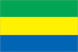
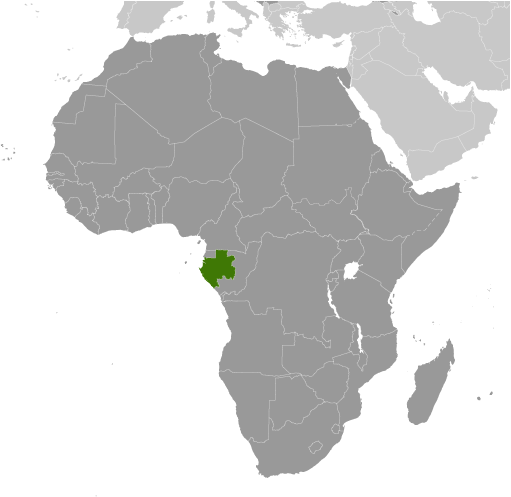
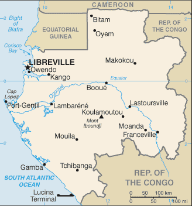

# Gabon

## Introduction

**_Background:_**   
El Hadj Omar BONGO Ondimba - one of the longest-serving heads of state in the world - dominated the country's political scene for four decades (1967-2009) following independence from France in 1960. President BONGO introduced a nominal multiparty system and a new constitution in the early 1990s. However, allegations of electoral fraud during local elections in December 2002 and the presidential elections in 2005 exposed the weaknesses of formal political structures in Gabon. Following President BONGO's death in 2009, new elections brought Ali BONGO Ondimba, son of the former president, to power. Despite constrained political conditions, Gabon's small population, abundant natural resources, and considerable foreign support have helped make it one of the more stable African countries.

## Geography

**_Location:_**   
Central Africa, bordering the Atlantic Ocean at the Equator, between Republic of the Congo and Equatorial Guinea

**_Geographic coordinates:_**   
1 00 S, 11 45 E

**_Map references:_**   
Africa

**_Area:_**   
**total:** 267,667 sq km   
**land:** 257,667 sq km   
**water:** 10,000 sq km

**_Area - comparative:_**   
slightly smaller than Colorado

**_Land boundaries:_**   
**total:** 3,261 km   
**border countries:** Cameroon 349 km, Republic of the Congo 2,567 km, Equatorial Guinea 345 km

**_Coastline:_**   
885 km

**_Maritime claims:_**   
**territorial sea:** 12 nm   
**contiguous zone:** 24 nm   
**exclusive economic zone:** 200 nm

**_Climate:_**   
tropical; always hot, humid

**_Terrain:_**   
narrow coastal plain; hilly interior; savanna in east and south

**_Elevation extremes:_**   
**lowest point:** Atlantic Ocean 0 m   
**highest point:** Mont Iboundji 1,575 m

**_Natural resources:_**   
petroleum, natural gas, diamond, niobium, manganese, uranium, gold, timber, iron ore, hydropower

**_Land use:_**   
**arable land:** 1.21%   
**permanent crops:** 0.64%   
**other:** 98.15% (2011)

**_Irrigated land:_**   
44.5 sq km (2003)

**_Total renewable water resources:_**   
164 cu km (2011)

**_Freshwater withdrawal (domestic/industrial/agricultural):_**   
**total:** 0.14 cu km/yr (61%/10%/29%)   
**per capita:** 97.68 cu m/yr (2005)

**_Natural hazards:_**   
NA

**_Environment - current issues:_**   
deforestation; poaching

**_Environment - international agreements:_**   
**party to:** Biodiversity, Climate Change, Climate Change-Kyoto Protocol, Desertification, Endangered Species, Hazardous Wastes, Law of the Sea, Marine Dumping, Ozone Layer Protection, Ship Pollution, Tropical Timber 83, Tropical Timber 94, Wetlands, Whaling   
**signed, but not ratified:** none of the selected agreements

**_Geography - note:_**   
a small population and oil and mineral reserves have helped Gabon become one of Africa's wealthier countries; in general, these circumstances have allowed the country to maintain and conserve its pristine rain forest and rich biodiversity

## People and Society

**_Nationality:_**   
**noun:** Gabonese (singular and plural)   
**adjective:** Gabonese

**_Ethnic groups:_**   
Bantu tribes, including four major tribal groupings (Fang, Bapounou, Nzebi, Obamba); other Africans and Europeans, 154,000, including 10,700 French and 11,000 persons of dual nationality

**_Languages:_**   
French (official), Fang, Myene, Nzebi, Bapounou/Eschira, Bandjabi

**_Religions:_**   
Christian 55%-75%, animist, Muslim less than 1%

**_Population:_**   
1,672,597   
**note:** estimates for this country explicitly take into account the effects of excess mortality due to AIDS; this can result in lower life expectancy, higher infant mortality, higher death rates, lower population growth rates, and changes in the distribution of population by age and sex than would otherwise be expected (July 2014 est.)

**_Age structure:_**   
**0-14 years:** 42.1% (male 353,863/female 350,456)   
**15-24 years:** 20.3% (male 169,681/female 169,082)   
**25-54 years:** 29.7% (male 248,328/female 248,063)   
**55-64 years:** 4.2% (male 33,608/female 35,838)   
**65 years and over:** 3.8% (male 27,117/female 36,561) (2014 est.)

**_Dependency ratios:_**   
**total dependency ratio:** 77 %   
**youth dependency ratio:** 68 %   
**elderly dependency ratio:** 9 %   
**potential support ratio:** 11.1 (2014 est.)

**_Median age:_**   
**total:** 18.6 years   
**male:** 18.4 years   
**female:** 18.8 years (2014 est.)

**_Population growth rate:_**   
1.94% (2014 est.)

**_Birth rate:_**   
34.64 births/1,000 population (2014 est.)

**_Death rate:_**   
13.13 deaths/1,000 population (2014 est.)

**_Net migration rate:_**   
-2.07 migrant(s)/1,000 population (2014 est.)

**_Urbanization:_**   
**urban population:** 86.2% of total population (2011)   
**rate of urbanization:** 2.27% annual rate of change (2010-15 est.)

**_Major urban areas - population:_**   
LIBREVILLE (capital) 686,000 (2011)

**_Sex ratio:_**   
**at birth:** 1.03 male(s)/female   
**0-14 years:** 1.01 male(s)/female   
**15-24 years:** 1 male(s)/female   
**25-54 years:** 1 male(s)/female   
**55-64 years:** 0.99 male(s)/female   
**65 years and over:** 0.73 male(s)/female   
**total population:** 0.99 male(s)/female (2014 est.)

**_Mother's mean age at first birth:_**   
20.3   
**note:** median age at first birth among women 25-29 (2012 est.)

**_Maternal mortality rate:_**   
230 deaths/100,000 live births (2010)

**_Infant mortality rate:_**   
**total:** 47.03 deaths/1,000 live births   
**male:** 54.27 deaths/1,000 live births   
**female:** 39.57 deaths/1,000 live births (2014 est.)

**_Life expectancy at birth:_**   
**total population:** 52.06 years   
**male:** 51.54 years   
**female:** 52.6 years (2014 est.)

**_Total fertility rate:_**   
4.49 children born/woman (2014 est.)

**_Contraceptive prevalence rate:_**   
31.1% (2012)

**_Health expenditures:_**   
3.2% of GDP (2011)

**_Physicians density:_**   
0.29 physicians/1,000 population (2004)

**_Hospital bed density:_**   
6.3 beds/1,000 population (2010)

**_Drinking water source:_**   
**improved:** urban: 96.8% of population; rural: 63% of population; total: 92.2% of population   
**unimproved:** urban: 3.2% of population; rural: 37% of population; total: 7.8% of population (2012 est.)

**_Sanitation facility access:_**   
**improved:** urban: 42.9% of population; rural: 32% of population; total: 41.4% of population   
**unimproved:** urban: 57.1% of population; rural: 68% of population; total: 58.6% of population (2012 est.)

**_HIV/AIDS - adult prevalence rate:_**   
4% (2012 est.)

**_HIV/AIDS - people living with HIV/AIDS:_**   
40,700 (2012 est.)

**_HIV/AIDS - deaths:_**   
2,300 (2012 est.)

**_Major infectious diseases:_**   
**degree of risk:** very high   
**food or waterborne diseases:** bacterial diarrhea, hepatitis A, and typhoid fever   
**vectorborne disease:** malaria and dengue fever   
**water contact disease:** schistosomiasis   
**animal contact disease:** rabies (2013)

**_Obesity - adult prevalence rate:_**   
13.9% (2008)

**_Children under the age of 5 years underweight:_**   
6.5% (2012)

**_Education expenditures:_**   
NA

**_Literacy:_**   
**definition:** age 15 and over can read and write   
**total population:** 89%   
**male:** 92.3%   
**female:** 85.6% (2011 est.)

## Government

**_Country name:_**   
**conventional long form:** Gabonese Republic   
**conventional short form:** Gabon   
**local long form:** Republique Gabonaise   
**local short form:** Gabon

**_Government type:_**   
republic; multiparty presidential regime

**_Capital:_**   
**name:** Libreville   
**geographic coordinates:** 0 23 N, 9 27 E   
**time difference:** UTC+1 (6 hours ahead of Washington, DC, during Standard Time)

**_Administrative divisions:_**   
9 provinces; Estuaire, Haut-Ogooue, Moyen-Ogooue, Ngounie, Nyanga, Ogooue-Ivindo, Ogooue-Lolo, Ogooue-Maritime, Woleu-Ntem

**_Independence:_**   
17 August 1960 (from France)

**_National holiday:_**   
Independence Day, 17 August (1960)

**_Constitution:_**   
previous 1961; latest drafted May 1990, adopted 15 March 1991, promulgated 26 March 1991; amended several times, last in 2011 (2013)

**_Legal system:_**   
mixed legal system of French civil law and customary law

**_International law organization participation:_**   
has not submitted an ICJ jurisdiction declaration; accepts ICCt jurisdiction

**_Suffrage:_**   
18 years of age; universal

**_Executive branch:_**   
**chief of state:** President Ali BONGO ONDIMBA (since 16 October 2009)   
**head of government:** Prime Minister Daniel ONA ONDO (since 27 January 2014)   
**cabinet:** Council of Ministers appointed by the prime minister in consultation with the president   
**elections:** president elected by popular vote for a seven-year term (no term limits); election last held on 30 August 2009 (next to be held in 2016); prime minister appointed by the president   
**election results:** President Ali BONGO ONDIMBA elected; percent of vote - Ali BONGO ONDIMBA 41.7%, Andre MBA OBAME 25.9%, Pierre MAMBOUNDOU 25.2%, Zacharie MYBOTO 3.9%, other 3.3%   
**note:** President BONGO died on 8 June 2009 after serving as president for 32 years; in accordance with the constitution he was replaced on an interim basis by the president of the Senate, Rose Francine ROGOMBE on 10 June 2009; new elections were held on 30 August 2009 and the son of the former president, Ali BONGO Ondimba, was elected president

**_Legislative branch:_**   
bicameral legislature consists of the Senate (102 seats; members elected by members of municipal councils and departmental assemblies to serve six-year terms) and the National Assembly or Assemblee Nationale (120 seats; members are elected by direct, popular vote to serve five-year terms)   
**elections:** Senate - last held on 18 January 2009 (next to be held in January 2015); National Assembly - last held on 17 December 2011 (next to be held in December 2016)   
**election results:** Senate - percent of vote by party - NA; seats by party - PDG 75, RPG 6, UGDD 3, CLR 2, PGCI 2, PSD 2, UPG 2, ADERE 1, independents 9; National Assembly - percent of vote by party - NA; seats by party - PDG 114, RPG 3, others 3

**_Judicial branch:_**   
**highest court(s):** Supreme Court (organized into Judicial, Administrative, and Accounts chambers and consists of NA judges); Constitutional Court (consists of 9 judges)   
**judge selection and term of office:** Supreme Court judges appointment and tenure NA; Constitutional Court judges appointed - 3 by the national president, 3 by the president of the Senate, and 3 by the president of the National Assembly; judges serve 7-year, single renewable terms   
**subordinate courts:** Courts of Appeal; Court of State Security; county courts; military courts

**_Political parties and leaders:_**   
Alliance for National Rebirth or ARENA [Richard MOULOMBA]   
Circle of Liberal Reformers or CLR [General Jean Boniface ASSELE]   
Congress for Democracy and Justice or CDJ [Jules Aristide Bourdes OGOULIGUENDE]   
Democratic and Republican Alliance or ADERE [Divungui-di-Ndinge DIDJOB]   
Gabonese Democratic Party or PDG [Ali BONGO ONDIMBA]   
Gabonese Party for Progress or PGP [Benoit Mouity NZAMBA]   
Gabonese Union for Democracy and Development or UGDD [Zacharie MYBOTO]   
Independent Center Party of Gabon or PGCI [Luccheri GAHILA]   
National Rally of Woodcutters-Democratic or RNB-D [Pierre Andre KOMBILA]   
National Rally of Woodcutters-Rally for Gabon or RNB-RPG (Bucherons) [Fr. Paul M'BA-ABESSOLE]   
Party of Development and Social Solidarity or PDS [Seraphin Ndoat REMBOGO]   
Social Democratic Party or PSD [Pierre Claver MAGANGA-MOUSSAVOU]   
Union for Democracy and Social Integration or UDIS   
Union for the New Republic or UPRN [Louis Gaston MAYILA]   
Union of Gabonese People or UPG [Mathieu Mboumba NZIENGUI (until the next Congress)]

**_Political pressure groups and leaders:_**   
NA

**_International organization participation:_**   
ACP, AfDB, AU, BDEAC, CEMAC, FAO, FZ, G-24, G-77, IAEA, IBRD, ICAO, ICRM, IDA, IDB, IFAD, IFC, IFRCS, ILO, IMF, IMO, IMSO, Interpol, IOC, IOM, IPU, ISO, ITSO, ITU, ITUC (NGOs), MIGA, NAM, OIC, OIF, OPCW, UN, UNCTAD, UNESCO, UNIDO, UNWTO, UPU, WCO, WHO, WIPO, WMO, WTO

**_Diplomatic representation in the US:_**   
**chief of mission:** Ambassador Michael MOUSSA-ADAMO (since 2 September 2011)   
**chancery:** Suite 200, 2034 20th Street NW, Washington, DC 20009   
**telephone:** [1] (202) 797-1000   
**FAX:** [1] (202) 332-0668   
**consulate(s):** New York

**_Diplomatic representation from the US:_**   
**chief of mission:** Ambassador (vacant); Charge d'Affaires Dante PARADISO; note - also accredited to Sao Tome and Principe   
**embassy:** Boulevard du Bord de Mer, Libreville   
**mailing address:** Centre Ville, B. P. 4000, Libreville; pouch: 2270 Libreville Place, Washington, DC 20521-2270   
**telephone:** [241] 01-45-71-00, after hours - 07380171   
**FAX:** [241] 74 55 07

**_Flag description:_**   
three equal horizontal bands of green (top), yellow, and blue; green represents the country's forests and natural resources, gold represents the equator (which transects Gabon) as well as the sun, blue represents the sea

**_National symbol(s):_**   
black panther

**_National anthem:_**   
**name:** "La Concorde" (The Concorde)   
**lyrics/music:** Georges Aleka DAMAS   
**note:** adopted 1960

## Economy

**_Economy - overview:_**   
Gabon enjoys a per capita income four times that of most sub-Saharan African nations, but because of high income inequality, a large proportion of the population remains poor. Gabon depended on timber and manganese until oil was discovered offshore in the early 1970s. The economy was reliant on oil for about 50% of its GDP, about 70% of revenues, and 87% of goods exports for 2010, although some fields have passed their peak production. A rebound of oil prices from 1999 to 2008 helped growth, but declining production has hampered Gabon from fully realizing potential gains. Gabon signed a 14-month Stand-By Arrangement with the IMF in May 2007, and later that year issued a $1 billion sovereign bond to buy back a sizable portion of its Paris Club debt. Gabon continues to face fluctuating prices for its oil, timber, and manganese exports. Despite the abundance of natural wealth, poor fiscal management has stifled the economy. However, President BONGO ONDIMBA has made efforts to increase transparency and is taking steps to make Gabon a more attractive investment destination to diversify the economy. BONGO ONDIMBA has attempted to boost growth by increasing government investment in human resources and infrastructure. GDP grew more than 6% per year over the 2010-13 period.

**_GDP (purchasing power parity):_**   
$30.06 billion (2013 est.)   
$28.19 billion (2012 est.)   
$26.7 billion (2011 est.)   
**note:** data are in 2013 US dollars

**_GDP (official exchange rate):_**   
$19.97 billion (2013 est.)

**_GDP - real growth rate:_**   
6.6% (2013 est.)   
5.6% (2012 est.)   
7.1% (2011 est.)

**_GDP - per capita (PPP):_**   
$19,200 (2013 est.)   
$18,300 (2012 est.)   
$17,600 (2011 est.)   
**note:** data are in 2013 US dollars

**_Gross national saving:_**   
44.7% of GDP (2013 est.)   
47.1% of GDP (2012 est.)   
44.9% of GDP (2011 est.)

**_GDP - composition, by end use:_**   
**household consumption:** 39.1%   
**government consumption:** 10.5%   
**investment in fixed capital:** 33.7%   
**investment in inventories:** 0%   
**exports of goods and services:** 58.1%   
**imports of goods and services:** -41.4%; (2013 est.)

**_GDP - composition, by sector of origin:_**   
**agriculture:** 3.6%   
**industry:** 63.9%   
**services:** 32.5% (2013 est.)

**_Agriculture - products:_**   
cocoa, coffee, sugar, palm oil, rubber; cattle; okoume (a tropical softwood); fish

**_Industries:_**   
petroleum extraction and refining; manganese, gold; chemicals, ship repair, food and beverages, textiles, lumbering and plywood, cement

**_Industrial production growth rate:_**   
4.4% (2013 est.)

**_Labor force:_**   
629,100 (2013 est.)

**_Labor force - by occupation:_**   
**agriculture:** 60%   
**industry:** 15%   
**services:** 25% (2000 est.)

**_Unemployment rate:_**   
21% (2006 est.)

**_Population below poverty line:_**   
NA%

**_Household income or consumption by percentage share:_**   
**lowest 10%:** 2.5%   
**highest 10%:** 32.7% (2005)

**_Budget:_**   
**revenues:** $5.031 billion   
**expenditures:** $6.599 billion (2013 est.)

**_Taxes and other revenues:_**   
25.2% of GDP (2013 est.)

**_Budget surplus (+) or deficit (-):_**   
-7.9% of GDP (2013 est.)

**_Public debt:_**   
23.2% of GDP (2013 est.)   
22.2% of GDP (2012 est.)

**_Fiscal year:_**   
calendar year

**_Inflation rate (consumer prices):_**   
1.2% (2013 est.)   
2.7% (2012 est.)

**_Central bank discount rate:_**   
3% (31 December 2010 est.)   
4.25% (31 December 2009 est.)

**_Commercial bank prime lending rate:_**   
15% (31 December 2013 est.)   
15% (31 December 2012 est.)

**_Stock of narrow money:_**   
$2.497 billion (31 December 2013 est.)   
$2.552 billion (31 December 2012 est.)

**_Stock of broad money:_**   
$3.973 billion (31 December 2013 est.)   
$3.908 billion (31 December 2012 est.)

**_Stock of domestic credit:_**   
$1.7 billion (31 December 2013 est.)   
$1.672 billion (31 December 2012 est.)

**_Market value of publicly traded shares:_**   
$NA

**_Current account balance:_**   
$1.783 billion (2013 est.)   
$2.687 billion (2012 est.)

**_Exports:_**   
$9.777 billion (2013 est.)   
$10.2 billion (2012 est.)

**_Exports - commodities:_**   
crude oil, timber, manganese, uranium

**_Exports - partners:_**   
Japan 24.1%, US 17%, Australia 11.3%, India 7.4%, China 5.4%, Spain 4.1% (2012)

**_Imports:_**   
$3.934 billion (2013 est.)   
$3.638 billion (2012 est.)

**_Imports - commodities:_**   
machinery and equipment, foodstuffs, chemicals, construction materials

**_Imports - partners:_**   
France 28.2%, China 12.6%, US 9.4%, Belgium 5.8%, Cameroon 4.3% (2012)

**_Reserves of foreign exchange and gold:_**   
$2.47 billion (31 December 2013 est.)   
$2.373 billion (31 December 2012 est.)

**_Debt - external:_**   
$3.433 billion (31 December 2013 est.)   
$3.196 billion (31 December 2012 est.)

**_Exchange rates:_**   
Cooperation Financiere en Afrique Centrale francs (XAF) per US dollar -   
504.9 (2013 est.)   
510.53 (2012 est.)   
495.28 (2010 est.)   
472.19 (2009)   
447.81 (2008)

## Energy

**_Electricity - production:_**   
1.777 billion kWh (2010 est.)

**_Electricity - consumption:_**   
1.442 billion kWh (2010 est.)

**_Electricity - exports:_**   
0 kWh (2012 est.)

**_Electricity - imports:_**   
0 kWh (2012 est.)

**_Electricity - installed generating capacity:_**   
415,000 kW (2010 est.)

**_Electricity - from fossil fuels:_**   
59% of total installed capacity (2010 est.)

**_Electricity - from nuclear fuels:_**   
0% of total installed capacity (2010 est.)

**_Electricity - from hydroelectric plants:_**   
41% of total installed capacity (2010 est.)

**_Electricity - from other renewable sources:_**   
0% of total installed capacity (2010 est.)

**_Crude oil - production:_**   
242,000 bbl/day (2012 est.)

**_Crude oil - exports:_**   
225,300 bbl/day (2010 est.)

**_Crude oil - imports:_**   
0 bbl/day (2010 est.)

**_Crude oil - proved reserves:_**   
2 billion bbl (1 January 2013 est.)

**_Refined petroleum products - production:_**   
19,280 bbl/day (2010 est.)

**_Refined petroleum products - consumption:_**   
15,800 bbl/day (2011 est.)

**_Refined petroleum products - exports:_**   
7,670 bbl/day (2010 est.)

**_Refined petroleum products - imports:_**   
4,594 bbl/day (2010 est.)

**_Natural gas - production:_**   
70 million cu m (2011 est.)

**_Natural gas - consumption:_**   
80 million cu m (2010 est.)

**_Natural gas - exports:_**   
0 cu m (2011 est.)

**_Natural gas - imports:_**   
0 cu m (2011 est.)

**_Natural gas - proved reserves:_**   
28.32 billion cu m (1 January 2013 est.)

**_Carbon dioxide emissions from consumption of energy:_**   
4.758 million Mt (2011 est.)

## Communications

**_Telephones - main lines in use:_**   
17,000 (2012)

**_Telephones - mobile cellular:_**   
2.93 million (2012)

**_Telephone system:_**   
**general assessment:** adequate system of cable, microwave radio relay, tropospheric scatter, radiotelephone communication stations, and a domestic satellite system with 12 earth stations   
**domestic:** a growing mobile-cellular network with multiple providers is making telephone service more widely available with mobile-cellular teledensity exceeding 100 per 100 persons   
**international:** country code - 241; landing point for the SAT-3/WASC fiber-optic submarine cable that provides connectivity to Europe and Asia; satellite earth stations - 3 Intelsat (Atlantic Ocean) (2011)

**_Broadcast media:_**   
state owns and operates 2 TV stations and 2 radio broadcast stations; a few private radio and TV stations; transmissions of at least 2 international broadcasters are accessible; satellite service subscriptions are available (2007)

**_Internet country code:_**   
.ga

**_Internet hosts:_**   
127 (2012)

**_Internet users:_**   
98,800 (2009)

## Transportation

**_Airports:_**   
44 (2013)

**_Airports - with paved runways:_**   
**total:** 14   
**over 3,047 m:** 1   
**2,438 to 3,047 m:** 2   
**1,524 to 2,437 m:** 9   
**914 to 1,523 m:** 1   
**under 914 m:** 1 (2013)

**_Airports - with unpaved runways:_**   
**total:** 30   
**1,524 to 2,437 m:** 7   
**914 to 1,523 m:** 9   
**under 914 m:** 14 (2013)

**_Pipelines:_**   
gas 807 km; oil 1,639 km; water 3 km (2013)

**_Railways:_**   
**total:** 649 km   
**standard gauge:** 649 km 1.435-m gauge (2008)

**_Roadways:_**   
**total:** 9,170 km   
**paved:** 1,097 km   
**unpaved:** 8,073 km (2007)

**_Waterways:_**   
1,600 km (310 km on Ogooue River) (2010)

**_Merchant marine:_**   
**registered in other countries:** 2 (Cambodia 1, Panama 1) (2010)

**_Ports and terminals:_**   
**major seaport(s):** Libreville, Owendo, Port-Gentil   
**oil/gas terminal(s):** Gamba, Lucina

## Military

**_Military branches:_**   
Gabonese Defense Forces (Forces de Defense Gabonaise): Land Force (Force Terrestre), Gabonese Navy (Marine Gabonaise), Gabonese Air Forces (Forces Aerienne Gabonaises, FAG) (2012)

**_Military service age and obligation:_**   
20 years of age for voluntary military service; no conscription (2012)

**_Manpower available for military service:_**   
**males age 16-49:** 350,640   
**females age 16-49:** 351,718 (2010 est.)

**_Manpower fit for military service:_**   
**males age 16-49:** 202,404   
**females age 16-49:** 195,389 (2010 est.)

**_Manpower reaching militarily significant age annually:_**   
**male:** 17,638   
**female:** 17,614 (2010 est.)

**_Military expenditures:_**   
1.34% of GDP (2012)   
NA% (2011)   
1.34% of GDP (2010)

## Transnational Issues

**_Disputes - international:_**   
UN urges Equatorial Guinea and Gabon to resolve the sovereignty dispute over Gabon-occupied Mbane Island and lesser islands and to establish a maritime boundary in hydrocarbon-rich Corisco Bay

............................................................   
_Page last updated on June 22, 2014_
