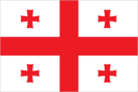
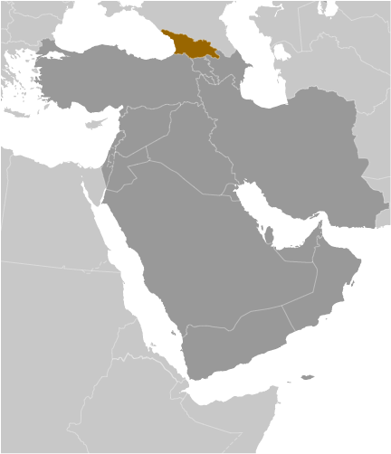
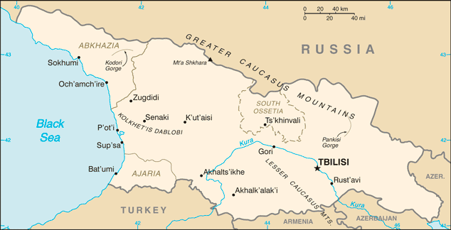

# Georgia

## Introduction

**_Background:_**   
The region of present day Georgia contained the ancient kingdoms of Colchis and Kartli-Iberia. The area came under Roman influence in the first centuries A.D., and Christianity became the state religion in the 330s. Domination by Persians, Arabs, and Turks was followed by a Georgian golden age (11th-13th centuries) that was cut short by the Mongol invasion of 1236. Subsequently, the Ottoman and Persian empires competed for influence in the region. Georgia was absorbed into the Russian Empire in the 19th century. Independent for three years (1918-1921) following the Russian revolution, it was forcibly incorporated into the USSR in 1921 and regained its independence when the Soviet Union dissolved in 1991. Mounting public discontent over rampant corruption and ineffective government services, followed by an attempt by the incumbent Georgian Government to manipulate national legislative elections in November 2003 touched off widespread protests that led to the resignation of Eduard SHEVARDNADZE, president since 1995. In the aftermath of that popular movement, which became known as the "Rose Revolution," new elections in early 2004 swept Mikheil SAAKASHVILI into power along with his United National Movement (UNM) party. Progress on market reforms and democratization has been made in the years since independence, but this progress has been complicated by Russian assistance and support to the separatist regions of Abkhazia and South Ossetia. Periodic flare-ups in tension and violence culminated in a five-day conflict in August 2008 between Russia and Georgia, including the invasion of large portions of undisputed Georgian territory. Russian troops pledged to pull back from most occupied Georgian territory, but in late August 2008 Russia unilaterally recognized the independence of Abkhazia and South Ossetia, and Russian military forces remain in those regions. Billionaire philanthropist Bidzina IVANISHVILI's unexpected entry into politics in October 2011 brought the divided opposition together under his Georgian Dream coalition, which won a majority of seats in the October 2012 parliamentary election and removed UNM from power. Conceding defeat, SAAKASHVILI named IVANISHVILI as prime minister and allowed Georgian Dream to create a new government. Georgian Dream's Giorgi MARGVELASHVILI was inaugurated as president on 17 November 2013, ending a tense year of power-sharing between SAAKASHVILI and IVANISHVILI. IVANISHVILI voluntarily resigned from office after the presidential succession, and Georgia's legislature on 20 November 2013 confirmed Irakli GARIBASHVILI as his replacement. Georgia's recent elections represent unique examples of a former Soviet state that emerged to conduct democratic and peaceful government transitions of power. Popular and government support for integration with the West is high in Georgia. Joining the EU and NATO are among the country's top foreign policy goals.

## Geography

**_Location:_**   
Southwestern Asia, bordering the Black Sea, between Turkey and Russia, with a sliver of land north of the Caucasus extending into Europe; note - Georgia views itself as part of Europe

**_Geographic coordinates:_**   
42 00 N, 43 30 E

**_Map references:_**   
Middle East

**_Area:_**   
**total:** 69,700 sq km   
**land:** 69,700 sq km   
**water:** 0 sq km

**_Area - comparative:_**   
slightly smaller than South Carolina

**_Land boundaries:_**   
**total:** 1,814 km   
**border countries:** Armenia 219 km, Azerbaijan 428 km, Russia 894 km, Turkey 273 km

**_Coastline:_**   
310 km

**_Maritime claims:_**   
**territorial sea:** 12 nm   
**exclusive economic zone:** 200 nm

**_Climate:_**   
warm and pleasant; Mediterranean-like on Black Sea coast

**_Terrain:_**   
largely mountainous with Great Caucasus Mountains in the north and Lesser Caucasus Mountains in the south; Kolkhet'is Dablobi (Kolkhida Lowland) opens to the Black Sea in the west; Mtkvari River Basin in the east; good soils in river valley flood plains, foothills of Kolkhida Lowland

**_Elevation extremes:_**   
**lowest point:** Black Sea 0 m   
**highest point:** Mt'a Shkhara 5,201 m

**_Natural resources:_**   
timber, hydropower, manganese deposits, iron ore, copper, minor coal and oil deposits; coastal climate and soils allow for important tea and citrus growth

**_Land use:_**   
**arable land:** 5.94%   
**permanent crops:** 1.65%   
**other:** 92.41% (2011)

**_Irrigated land:_**   
4,328 sq km (2007)

**_Total renewable water resources:_**   
63.33 cu km (2011)

**_Freshwater withdrawal (domestic/industrial/agricultural):_**   
**total:** 1.81 cu km/yr (20%/22%/58%)   
**per capita:** 410.6 cu m/yr (2005)

**_Natural hazards:_**   
earthquakes

**_Environment - current issues:_**   
air pollution, particularly in Rust'avi; heavy pollution of Mtkvari River and the Black Sea; inadequate supplies of potable water; soil pollution from toxic chemicals

**_Environment - international agreements:_**   
**party to:** Air Pollution, Biodiversity, Climate Change, Climate Change-Kyoto Protocol, Desertification, Endangered Species, Hazardous Wastes, Law of the Sea, Ozone Layer Protection, Ship Pollution, Wetlands   
**signed, but not ratified:** none of the selected agreements

**_Geography - note:_**   
strategically located east of the Black Sea; Georgia controls much of the Caucasus Mountains and the routes through them

## People and Society

**_Nationality:_**   
**noun:** Georgian(s)   
**adjective:** Georgian

**_Ethnic groups:_**   
Georgian 83.8%, Azeri 6.5%, Armenian 5.7%, Russian 1.5%, other 2.5% (2002 census)

**_Languages:_**   
Georgian (official) 71%, Russian 9%, Armenian 7%, Azeri 6%, other 7%   
**note:** Abkhaz is the official language in Abkhazia

**_Religions:_**   
Orthodox Christian (official) 83.9%, Muslim 9.9%, Armenian-Gregorian 3.9%, Catholic 0.8%, other 0.8%, none 0.7% (2002 census)

**_Population:_**   
4,935,880 (July 2014 est.)

**_Age structure:_**   
**0-14 years:** 17.6% (male 459,334/female 410,494)   
**15-24 years:** 14% (male 359,559/female 332,182)   
**25-54 years:** 40.9% (male 976,129/female 1,042,898)   
**55-64 years:** 12.2% (male 269,367/female 330,386)   
**65 years and over:** 16.2% (male 295,673/female 459,858) (2014 est.)

**_Dependency ratios:_**   
**total dependency ratio:** 48.6 %   
**youth dependency ratio:** 27 %   
**elderly dependency ratio:** 21.7 %   
**potential support ratio:** 4.6 (2014 est.)

**_Median age:_**   
**total:** 37.7 years   
**male:** 34.9 years   
**female:** 40.4 years (2014 est.)

**_Population growth rate:_**   
-0.11% (2014 est.)

**_Birth rate:_**   
12.93 births/1,000 population (2014 est.)

**_Death rate:_**   
10.77 deaths/1,000 population (2014 est.)

**_Net migration rate:_**   
-3.25 migrant(s)/1,000 population (2014 est.)

**_Urbanization:_**   
**urban population:** 52.8% of total population (2011)   
**rate of urbanization:** -0.37% annual rate of change (2010-15 est.)

**_Major urban areas - population:_**   
TBILISI (capital) 1.121 million (2011)

**_Sex ratio:_**   
**at birth:** 1.08 male(s)/female   
**0-14 years:** 1.12 male(s)/female   
**15-24 years:** 1.08 male(s)/female   
**25-54 years:** 0.94 male(s)/female   
**55-64 years:** 0.92 male(s)/female   
**65 years and over:** 0.66 male(s)/female   
**total population:** 0.91 male(s)/female (2014 est.)

**_Mother's mean age at first birth:_**   
24   
**note:** data do not cover Abkhazia and South Ossetia (2011 est.)

**_Maternal mortality rate:_**   
67 deaths/100,000 live births (2010)

**_Infant mortality rate:_**   
**total:** 16.68 deaths/1,000 live births   
**male:** 18.86 deaths/1,000 live births   
**female:** 14.32 deaths/1,000 live births (2014 est.)

**_Life expectancy at birth:_**   
**total population:** 75.72 years   
**male:** 71.62 years   
**female:** 80.17 years (2014 est.)

**_Total fertility rate:_**   
1.77 children born/woman (2014 est.)

**_Contraceptive prevalence rate:_**   
53.4%   
**note:** percent of women aged 15-44 (2010)

**_Health expenditures:_**   
9.4% of GDP (2011)

**_Physicians density:_**   
4.24 physicians/1,000 population (2011)

**_Hospital bed density:_**   
2.9 beds/1,000 population (2011)

**_Drinking water source:_**   
**improved:** urban: 100% of population; rural: 97.3% of population; total: 98.7% of population   
**unimproved:** urban: 0% of population; rural: 2.7% of population; total: 1.3% of population (2012 est.)

**_Sanitation facility access:_**   
**improved:** urban: 95.5% of population; rural: 90.7% of population; total: 93.3% of population   
**unimproved:** urban: 4.5% of population; rural: 9.3% of population; total: 6.7% of population (2012 est.)

**_HIV/AIDS - adult prevalence rate:_**   
0.3% (2012 est.)

**_HIV/AIDS - people living with HIV/AIDS:_**   
6,600 (2012 est.)

**_HIV/AIDS - deaths:_**   
200 (2012 est.)

**_Obesity - adult prevalence rate:_**   
22.1% (2008)

**_Children under the age of 5 years underweight:_**   
1.1% (2009)

**_Education expenditures:_**   
2% of GDP (2012)

**_Literacy:_**   
**definition:** age 15 and over can read and write   
**total population:** 99.7%   
**male:** 99.8%   
**female:** 99.7% (2011 est.)

**_School life expectancy (primary to tertiary education):_**   
**total:** 13 years   
**male:** 13 years   
**female:** 13 years (2008)

**_Child labor - children ages 5-14:_**   
**total number:** 113,106   
**percentage:** 18 % (2005 est.)

**_Unemployment, youth ages 15-24:_**   
**total:** 33.3% (2012)

## Government

**_Country name:_**   
**conventional long form:** none   
**conventional short form:** Georgia   
**local long form:** none   
**local short form:** Sak'art'velo   
**former:** Georgian Soviet Socialist Republic

**_Government type:_**   
republic

**_Capital:_**   
**name:** Tbilisi   
**geographic coordinates:** 41 41 N, 44 50 E   
**time difference:** UTC+4 (9 hours ahead of Washington, DC, during Standard Time)

**_Administrative divisions:_**   
9 regions (mkharebi, singular - mkhare), 1 city (kalaki), and 2 autonomous republics (avtomnoy respubliki, singular - avtom respublika)   
**regions:** Guria, Imereti, Kakheti, Kvemo Kartli, Mtskheta-Mtianeti, Racha-Lechkhumi and Kvemo Svaneti, Samegrelo and Zemo Svaneti, Samtskhe-Javakheti, Shida Kartli   
**city:** Tbilisi   
**autonomous republics:** Abkhazia or Ap'khazet'is Avtonomiuri Respublika (Sokhumi), Ajaria or Acharis Avtonomiuri Respublika (Bat'umi)   
**note:** the administrative centers of the two autonomous republics are shown in parentheses

**_Independence:_**   
9 April 1991 (from the Soviet Union); notable earlier date: A.D. 1008 (Georgia unified under King BAGRAT III)

**_National holiday:_**   
Independence Day, 26 May (1918); note - 26 May 1918 was the date of independence from Soviet Russia, 9 April 1991 was the date of independence from the Soviet Union

**_Constitution:_**   
previous 1921, 1978 (based on 1977 Soviet Union constitution); latest approved 24 August 1995, effective 17 October 1995; amended several times, last in 2013 (2013)

**_Legal system:_**   
civil law system

**_International law organization participation:_**   
accepts compulsory ICJ jurisdiction; accepts ICCt jurisdiction

**_Suffrage:_**   
18 years of age; universal

**_Executive branch:_**   
**chief of state:** President Giorgi MARGVELASHVILI (since 17 November 2013)   
**head of government:** Prime Minister Irakli GARIBASHVILI (since 20 November 2013)   
**cabinet:** Cabinet of Ministers   
**elections:** president elected by popular vote for a five-year term (eligible for a second term); election last held on 27 October 2013 (next to be held in October 2018)   
**election results:** Giorgi MARGVELASHVILI elected president; percent of vote - Giorgi MARGVELASHVILI 62.1%, Davit BAKRADZE 21.7%, Nino BURJANADZE 10.2%, other 6%

**_Legislative branch:_**   
unicameral Parliament or Parlamenti (150 seats; 77 members elected by proportional representation, 73 elected in single-member constituencies; members to serve four-year terms)   
**elections:** last held on 1 October 2012 (next to be held in 2016)   
**election results:** percent of vote by party - Georgian Dream 55%, United National Movement 40.3%, other 4.7%; seats by party - Georgian Dream 85, United National Movement 65

**_Judicial branch:_**   
**highest court(s):** Supreme Court (organized into several specialized judicial chambers; number of judges determined by the president of Georgia); Constitutional Court (consists of 9 judges); note - the Abkhazian and Ajarian Autonomous republics each have a supreme court and a hierarchy of lower courts   
**judge selection and term of office:** Supreme Court judges nominated by the president and appointed by the Parliament; judges serve not less than 10-year terms; Constitutional Court judges appointed by the president following candidate selection by the Justice Council of Georgia, a 12-member consultative body of high-level judges, and presidential and parliamentary appointees; judges appointed for 10-year terms   
**subordinate courts:** Courts of Appeal; regional (town) and district courts

**_Political parties and leaders:_**   
Christian Democratic Movement [Giorgi AKHVELDIANI]   
Conservative Party [Zviad DZIDZIGURI]   
European Democrats [Paata DAVITAIA]   
For Fair Georgia [Zurab NOGAIDELI]   
Free Georgia [Kakha KUKAVA]   
Georgian Dream (a six-party coalition composed of Georgian Dream-Democratic Georgia, Republican Party, Our Georgia-Free Democrats, National Forum, Conservative Party, and Industry Will Save Georgia)   
Georgian Dream-Democratic Georgia [Irakli GARIBASHVILI]   
Georgian People's Front [Nodar NATADZE]   
Georgian Troupe [Jondi BAGHTURIA]   
Industry Will Save Georgia (Industrialists) or IWSG [Georgi TOPADZE]   
Labor Party [Shalva NATELASHVILI]   
National Democratic Party or NDP [Bachuki KARDAVA]   
National Forum [Kakhaber SHARTAVA]   
New Rights [Pikria CHIKHRADZE]   
Our Georgia-Free Democrats (OGFD) [Irakli KADAGIDZE]   
People's Party [Koba DAVITASHVILI   
Republican Party [Khatuna SAMNIDZE]   
Traditionalists [Akaki ASATIANI]   
United National Movement or UNM [Vano MERABISHVILI]

**_Political pressure groups and leaders:_**   
separatists in the Russian-occupied regions of Abkhazia and South Ossetia

**_International organization participation:_**   
ADB, BSEC, CD, CE, EAPC, EBRD, FAO, G-11, GCTU, GUAM, IAEA, IBRD, ICAO, ICC (national committees), ICRM, IDA, IFAD, IFC, IFRCS, ILO, IMF, IMO, Interpol, IOC, IOM, IPU, ISO (correspondent), ITSO, ITU, ITUC (NGOs), MIGA, OAS (observer), OIF (observer), OPCW, OSCE, PFP, SELEC (observer), UN, UNCTAD, UNESCO, UNIDO, UNWTO, UPU, WCO, WHO, WIPO, WMO, WTO

**_Diplomatic representation in the US:_**   
**chief of mission:** Ambassador Archil GEGESHIDZE (since 12 April 2013)   
**chancery:** 2209 Massachusetts Avenue NW, Washington, DC 20008   
**telephone:** [1] (202) 387-2390   
**FAX:** [1] (202) 387-0864   
**consulate(s) general:** New York

**_Diplomatic representation from the US:_**   
**chief of mission:** Ambassador Richard NORLAND (since 25 July 2012)   
**embassy:** 11 George Balanchine Street, T'bilisi 0131   
**mailing address:** 7060 T'bilisi Place, Washington, DC 20521-7060   
**telephone:** [995] (32) 227-70-00   
**FAX:** [995] (32) 253-23-10

**_Flag description:_**   
white rectangle with a central red cross extending to all four sides of the flag; each of the four quadrants displays a small red bolnur-katskhuri cross; sometimes referred to as the Five-Cross Flag; although adopted as the official Georgian flag in 2004, the five-cross design appears to date back to the 14th century

**_National symbol(s):_**   
Saint George; lion

**_National anthem:_**   
**name:** "Tavisupleba" (Liberty)   
**lyrics/music:** Davit MAGRADSE/Zakaria PALIASHVILI (adapted by Joseb KETSCHAKMADSE)   
**note:** adopted 2004; after the Rose Revolution, a new anthem with music based on the operas "Abesalom da Eteri" and "Daisi" was adopted

## Economy

**_Economy - overview:_**   
Georgia's main economic activities include cultivation of agricultural products such as grapes, citrus fruits, and hazelnuts; mining of manganese, copper, and gold; and producing alcoholic and nonalcoholic beverages, metals, machinery, and chemicals in small-scale industries. The country imports nearly all its needed supplies of natural gas and oil products. It has sizeable hydropower capacity that now provides most of its energy needs. Georgia has overcome the chronic energy shortages and gas supply interruptions of the past by renovating hydropower plants and by increasingly relying on natural gas imports from Azerbaijan instead of from Russia. Construction of the Baku-T'bilisi-Ceyhan oil pipeline, the South Caucasus gas pipeline, and the Kars-Akhalkalaki Railroad are part of a strategy to capitalize on Georgia's strategic location between Europe and Asia and develop its role as a transit point for gas, oil, and other goods. The expansion of the South Caucasus pipeline, as part of the Shah Deniz II Southern Gas Corridor project, will result in a $2 billion foreign investment in Georgia, the largest ever in the country. Gas from Shah Deniz II is expected to begin flowing in 2019. Georgia's economy sustained GDP growth of more than 10% in 2006-07, based on strong inflows of foreign investment and robust government spending. However, GDP growth slowed following the August 2008 conflict with Russia, and sunk to negative 4% in 2009 as foreign direct investment and workers' remittances declined in the wake of the global financial crisis. The economy rebounded in 2010-13, but FDI inflows, the engine of Georgian economic growth prior to the 2008 conflict, have not recovered fully. Unemployment has also remained high. Georgia has historically suffered from a chronic failure to collect tax revenues; however, since 2004 the government has simplified the tax code, improved tax administration, increased tax enforcement, and cracked down on petty corruption, leading to higher revenues. The country is pinning its hopes for renewed growth on a determined effort to continue to liberalize the economy by reducing regulation, taxes, and corruption in order to attract foreign investment, with a focus on hydropower, agriculture, tourism, and textiles production. The government has received high marks from the World Bank for its anti-corruption efforts. Over the past year the Georgian Dream-led government continued the previous administration's low-regulation, low-tax, free market policies, while modestly increasing social spending, strengthening anti-trust policy, and amending the labor code to comply with International Labor Standards. The government is finalizing its 2020 Economic Development Strategy and has launched the Georgia Co-Investment Fund, a $6 billion private equity fund that will invest in tourism, agriculture, logistics, energy, infrastructure, and manufacturing.

**_GDP (purchasing power parity):_**   
$27.3 billion (2013 est.)   
$26.64 billion (2012 est.)   
$25.1 billion (2011 est.)   
**note:** data are in 2013 US dollars

**_GDP (official exchange rate):_**   
$15.95 billion (2013 est.)

**_GDP - real growth rate:_**   
2.5% (2013 est.)   
6.1% (2012 est.)   
7.2% (2011 est.)

**_GDP - per capita (PPP):_**   
$6,100 (2013 est.)   
$5,900 (2012 est.)   
$5,600 (2011 est.)   
**note:** data are in 2013 US dollars

**_Gross national saving:_**   
18% of GDP (2013 est.)   
17.1% of GDP (2012 est.)   
12.6% of GDP (2011 est.)

**_GDP - composition, by end use:_**   
**household consumption:** 68.6%   
**government consumption:** 19%   
**investment in fixed capital:** 23.6%   
**investment in inventories:** 3.2%   
**exports of goods and services:** 39.9%   
**imports of goods and services:** -54.4%; (2013 est.)

**_GDP - composition, by sector of origin:_**   
**agriculture:** 8.5%   
**industry:** 21.6%   
**services:** 69.9% (2013 est.)

**_Agriculture - products:_**   
citrus, grapes, tea, hazelnuts, vegetables; livestock

**_Industries:_**   
steel, machine tools, electrical appliances, mining (manganese, copper, gold), chemicals, wood products, wine

**_Industrial production growth rate:_**   
3% (2013 est.)

**_Labor force:_**   
1.959 million (2011 est.)

**_Labor force - by occupation:_**   
**agriculture:** 55.6%   
**industry:** 8.9%   
**services:** 35.5% (2006 est.)

**_Unemployment rate:_**   
15% (2013 est.)   
15.1% (2011 est.)

**_Population below poverty line:_**   
9.2% (2010)

**_Household income or consumption by percentage share:_**   
**lowest 10%:** 2%   
**highest 10%:** 31.3% (2008)

**_Distribution of family income - Gini index:_**   
46 (2011)   
37.1 (1996)

**_Budget:_**   
**revenues:** $4.834 billion   
**expenditures:** $5.257 billion (2013 est.)

**_Taxes and other revenues:_**   
30.3% of GDP (2013 est.)

**_Budget surplus (+) or deficit (-):_**   
-2.7% of GDP (2013 est.)

**_Public debt:_**   
36.3% of GDP (2012 est.)   
36.5% of GDP (2011 est.)   
**note:** data cover general government debt, and includes debt instruments issued (or owned) by government entities other than the treasury; the data include treasury debt held by foreign entities; the data include debt issued by subnational entities; Georgia does not maintain intra-governmental debt or social funds

**_Fiscal year:_**   
calendar year

**_Inflation rate (consumer prices):_**   
-0.5% (2013 est.)   
-0.9% (2012 est.)

**_Central bank discount rate:_**   
3.75% (15 January 2013)   
5.25% (31 December 2012)   
**note:** this is the Refinancing Rate, the key monetary policy rate of the National Bank of Georgia

**_Commercial bank prime lending rate:_**   
20.7% (31 December 2013 est.)   
22.08% (31 December 2012 est.)

**_Stock of narrow money:_**   
$2.025 billion (31 December 2013 est.)   
$1.965 billion (31 December 2012 est.)

**_Stock of broad money:_**   
$4.72 billion (31 September 2012 est.)   
$4.249 billion (31 December 2011 est.)

**_Stock of domestic credit:_**   
$5.96 billion (31 December 2013 est.)   
$5.518 billion (31 December 2012 est.)

**_Market value of publicly traded shares:_**   
$943.4 million (31 December 2012 est.)   
$NA (31 December 2011)   
$NA (31 December 2010 est.)

**_Current account balance:_**   
-$1.375 billion (2013 est.)   
-$1.875 billion (2012 est.)

**_Exports:_**   
$2.618 billion (2013 est.)   
$2.377 billion (2012 est.)

**_Exports - commodities:_**   
vehicles, ferro-alloys, fertilizers, nuts, scrap metal, gold, copper ores

**_Exports - partners:_**   
Azerbaijan 25%, Armenia 11%, Ukraine 7%, Turkey 6%, Russia 6% (2013 est.)

**_Imports:_**   
$7.064 billion (2013 est.)   
$7.842 billion (2012 est.)

**_Imports - commodities:_**   
fuels, vehicles, machinery and parts, grain and other foods, pharmaceuticals

**_Imports - partners:_**   
Turkey 17%, Ukraine 8%, Azerbaijan 8%, Russia 7%, China 7% (2013 est.)

**_Reserves of foreign exchange and gold:_**   
$3.317 billion (31 December 2013 est.)   
$2.873 billion (31 December 2012 est.)

**_Debt - external:_**   
$11.74 billion (31 December 2013 est.)   
$11.67 billion (31 December 2012 est.)

**_Stock of direct foreign investment - at home:_**   
$11.19 billion (31 December 2013 est.)   
$10.49 billion (31 December 2012 est.)

**_Stock of direct foreign investment - abroad:_**   
$1.359 billion (31 December 2013 est.)   
$1.329 billion (31 December 2012 est.)

**_Exchange rates:_**   
laris (GEL) per US dollar -   
1.655 (2013 est.)   
1.6513 (2012 est.)   
1.7823 (2010 est.)   
1.6705 (2009 est.)   
1.47 (2008 est.)

## Energy

**_Electricity - production:_**   
9.694 billion kWh (2012 est.)

**_Electricity - consumption:_**   
9.379 billion kWh (2012 est.)

**_Electricity - exports:_**   
1.492 billion kWh (2010 est.)

**_Electricity - imports:_**   
614 million kWh (2012 est.)

**_Electricity - installed generating capacity:_**   
4.538 million kW (2010 est.)

**_Electricity - from fossil fuels:_**   
37.2% of total installed capacity (2010 est.)

**_Electricity - from nuclear fuels:_**   
0% of total installed capacity (2010 est.)

**_Electricity - from hydroelectric plants:_**   
62.8% of total installed capacity (2010 est.)

**_Electricity - from other renewable sources:_**   
0% of total installed capacity (2010 est.)

**_Crude oil - production:_**   
979.5 bbl/day (2012 est.)

**_Crude oil - exports:_**   
531 bbl/day (2012 est.)

**_Crude oil - imports:_**   
0 bbl/day (2013 est.)

**_Crude oil - proved reserves:_**   
35 million bbl (1 January 2013 est.)

**_Refined petroleum products - production:_**   
0 bbl/day (2013 est.)

**_Refined petroleum products - consumption:_**   
17,280 bbl/day (2011 est.)

**_Refined petroleum products - exports:_**   
0 bbl/day (2011 est.)

**_Refined petroleum products - imports:_**   
18,500 bbl/day (2010 est.)

**_Natural gas - production:_**   
9.151 million cu m (2012 est.)

**_Natural gas - consumption:_**   
1.97 billion cu m (2012 est.)

**_Natural gas - exports:_**   
0 cu m (2012 est.)

**_Natural gas - imports:_**   
1.96 billion cu m (2012 est.)

**_Natural gas - proved reserves:_**   
8.495 billion cu m (1 January 2013 est.)

**_Carbon dioxide emissions from consumption of energy:_**   
5.868 million Mt (2011 est.)

## Communications

**_Telephones - main lines in use:_**   
1.276 million (2012)

**_Telephones - mobile cellular:_**   
4.699 million (2012)

**_Telephone system:_**   
**general assessment:** fixed-line telecommunications network has limited coverage outside Tbilisi; multiple mobile-cellular providers provide services to an increasing subscribership throughout the country   
**domestic:** cellular telephone networks cover the entire country; mobile-cellular teledensity roughly 100 per 100 people; intercity facilities include a fiber-optic line between T'bilisi and K'ut'aisi   
**international:** country code - 995; the Georgia-Russia fiber-optic submarine cable provides connectivity to Russia; international service is available by microwave, landline, and satellite through the Moscow switch; international electronic mail and telex service are available (2011)

**_Broadcast media:_**   
1 public broadcaster in Tbilisi, 1 state-owned broadcaster in Ajaria Autonomous Republic; 8 privately owned TV stations; state run public broadcaster operates 2 TV stations; dozens of cable TV operators, several major commercial TV stations, and several dozen private radio stations; state run public broadcaster operates 2 radio stations (2012)

**_Internet country code:_**   
.ge

**_Internet hosts:_**   
357,864 (2012)

**_Internet users:_**   
1.3 million (2009)

## Transportation

**_Airports:_**   
22 (2013)

**_Airports - with paved runways:_**   
**total:** 18   
**over 3,047 m:** 1   
**2,438 to 3,047 m:** 7   
**1,524 to 2,437 m:** 3   
**914 to 1,523 m:** 5   
**under 914 m:** 2 (2013)

**_Airports - with unpaved runways:_**   
**total:** 4   
**1,524 to 2,437 m:** 1   
**914 to 1,523 m:** 2   
**under 914 m:** 1 (2013)

**_Heliports:_**   
2 (2013)

**_Pipelines:_**   
gas 1,596 km; oil 1,175 km (2013)

**_Railways:_**   
**total:** 1,612 km   
**broad gauge:** 1,575 km 1.520-m gauge (1,575 km electrified)   
**narrow gauge:** 37 km 0.912-m gauge (37 km electrified) (2008)

**_Roadways:_**   
**total:** 19,109 km   
**paved:** 19,109 km (includes 69 km of expressways) (2010)

**_Merchant marine:_**   
**total:** 142   
**by type:** bulk carrier 13, cargo 114, chemical tanker 1, container 1, liquefied gas 1, passenger/cargo 1, petroleum tanker 3, refrigerated cargo 1, roll on/roll off 5, vehicle carrier 2   
**foreign-owned:** 95 (Bulgaria 1, China 10, Egypt 7, Hong Kong 3, Israel 1, Italy 2, Latvia 1, Lebanon 1, Romania 7, Russia 6, Syria 24, Turkey 14, UAE 2, UK 5, Ukraine 10, US 1)   
**registered in other countries:** 1 (unknown 1) (2010)

**_Ports and terminals:_**   
**major seaport(s):** Black Sea - Bat'umi, P'ot'i

## Military

**_Military branches:_**   
Georgian Armed Forces: Land Forces (include Air and Air Defense Forces); separatist Abkhazia Armed Forces: Ground Forces, Air Forces; separatist South Ossetia Armed Forces   
**note:** Georgian naval forces have been incorporated into the coast guard, which is not part of the Defense Ministry (2011)

**_Military service age and obligation:_**   
18 to 34 years of age for compulsory and voluntary active duty military service; conscript service obligation is 18 months (2012)

**_Manpower available for military service:_**   
**males age 16-49:** 1,080,840   
**females age 16-49:** 1,122,031 (2010 est.)

**_Manpower fit for military service:_**   
**males age 16-49:** 893,003   
**females age 16-49:** 931,683 (2010 est.)

**_Manpower reaching militarily significant age annually:_**   
**male:** 29,723   
**female:** 27,242 (2010 est.)

**_Military expenditures:_**   
2.88% of GDP (2012)   
3.25% of GDP (2011)   
2.88% of GDP (2010)

## Transnational Issues

**_Disputes - international:_**   
Russia's military support and subsequent recognition of Abkhazia and South Ossetia independence in 2008 continue to sour relations with Georgia

**_Refugees and internally displaced persons:_**   
**IDPs:** up to 206,600 (displaced in the 1990s as a result of armed conflict in the breakaway republics of Abkhazia and South Ossetia; displaced in 2008 by fighting between Georgia and Russia over South Ossetia) (2013 est.)   
**stateless persons:** 1,156 (2012)

**_Illicit drugs:_**   
limited cultivation of cannabis and opium poppy, mostly for domestic consumption; used as transshipment point for opiates via Central Asia to Western Europe and Russia

............................................................   
_Page last updated on June 22, 2014_
