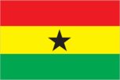
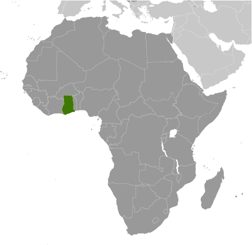
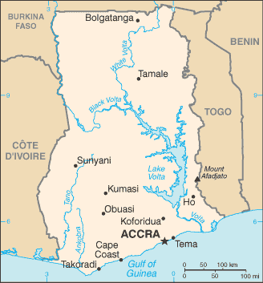

# Ghana

## Introduction

**_Background:_**   
Formed from the merger of the British colony of the Gold Coast and the Togoland trust territory, Ghana in 1957 became the first sub-Saharan country in colonial Africa to gain its independence. Ghana endured a long series of coups before Lt. Jerry RAWLINGS took power in 1981 and banned political parties. After approving a new constitution and restoring multiparty politics in 1992, RAWLINGS won presidential elections in 1992 and 1996 but was constitutionally prevented from running for a third term in 2000. John KUFUOR succeeded him and was reelected in 2004. John Atta MILLS won the 2008 presidential election and took over as head of state, but he died in July 2012 and was constitutionally succeeded by his vice president John Dramani MAHAMA, who subsequently won the December 2012 presidential election.

## Geography

**_Location:_**   
Western Africa, bordering the Gulf of Guinea, between Cote d'Ivoire and Togo

**_Geographic coordinates:_**   
8 00 N, 2 00 W

**_Map references:_**   
Africa

**_Area:_**   
**total:** 238,533 sq km   
**land:** 227,533 sq km   
**water:** 11,000 sq km

**_Area - comparative:_**   
slightly smaller than Oregon

**_Land boundaries:_**   
**total:** 2,420 km   
**border countries:** Burkina Faso 602 km, Cote d'Ivoire 720 km, Togo 1,098 km

**_Coastline:_**   
539 km

**_Maritime claims:_**   
**territorial sea:** 12 nm   
**contiguous zone:** 24 nm   
**exclusive economic zone:** 200 nm   
**continental shelf:** 200 nm

**_Climate:_**   
tropical; warm and comparatively dry along southeast coast; hot and humid in southwest; hot and dry in north

**_Terrain:_**   
mostly low plains with dissected plateau in south-central area

**_Elevation extremes:_**   
**lowest point:** Atlantic Ocean 0 m   
**highest point:** Mount Afadjato 885 m

**_Natural resources:_**   
gold, timber, industrial diamonds, bauxite, manganese, fish, rubber, hydropower, petroleum, silver, salt, limestone

**_Land use:_**   
**arable land:** 20.12%   
**permanent crops:** 11.74%   
**other:** 68.14% (2011)

**_Irrigated land:_**   
309 sq km (2003)

**_Total renewable water resources:_**   
53.2 cu km (2011)

**_Freshwater withdrawal (domestic/industrial/agricultural):_**   
**total:** 0.98 cu km/yr (24%/10%/66%)   
**per capita:** 48.82 cu m/yr (2000)

**_Natural hazards:_**   
dry, dusty, northeastern harmattan winds from January to March; droughts

**_Environment - current issues:_**   
recurrent drought in north severely affects agricultural activities; deforestation; overgrazing; soil erosion; poaching and habitat destruction threatens wildlife populations; water pollution; inadequate supplies of potable water

**_Environment - international agreements:_**   
**party to:** Biodiversity, Climate Change, Climate Change-Kyoto Protocol, Desertification, Endangered Species, Environmental Modification, Hazardous Wastes, Law of the Sea, Ozone Layer Protection, Ship Pollution, Tropical Timber 83, Tropical Timber 94, Wetlands   
**signed, but not ratified:** Marine Life Conservation

**_Geography - note:_**   
Lake Volta is the world's largest artificial lake by surface area (8,482 sq km; 3,275 sq mi)

## People and Society

**_Nationality:_**   
**noun:** Ghanaian(s)   
**adjective:** Ghanaian

**_Ethnic groups:_**   
Akan 47.5%, Mole-Dagbon 16.6%, Ewe 13.9%, Ga-Dangme 7.4%, Gurma 5.7%, Guan 3.7%, Grusi 2.5%, Mande-Busanga 1.1%, other 1.6% (2010 census)

**_Languages:_**   
Asante 14.8%, Ewe 12.7%, Fante 9.9%, Boron (Brong) 4.6%, Dagomba 4.3%, Dangme 4.3%, Dagarte (Dagaba) 3.7%, Akyem 3.4%, Ga 3.4%, Akuapem 2.9%, other (includes English (official)) 36.1% (2000 census)

**_Religions:_**   
Christian 71.2% (Pentecostal/Charismatic 28.3%, Protestant 18.4%, Catholic 13.1%, other 11.4%), Muslim 17.6%, traditional 5.2%, other 0.8%, none 5.2% (2010 census)

**_Population:_**   
25,758,108   
**note:** estimates for this country explicitly take into account the effects of excess mortality due to AIDS; this can result in lower life expectancy, higher infant mortality, higher death rates, lower population growth rates, and changes in the distribution of population by age and sex than would otherwise be expected (July 2014 est.)

**_Age structure:_**   
**0-14 years:** 38.6% (male 4,988,823/female 4,943,451)   
**15-24 years:** 18.7% (male 2,403,526/female 2,426,076)   
**25-54 years:** 33.8% (male 4,228,326/female 4,480,090)   
**55-64 years:** 4.8% (male 599,510/female 633,688)   
**65 years and over:** 4.1% (male 489,566/female 565,052) (2014 est.)

**_Dependency ratios:_**   
**total dependency ratio:** 71.6 %   
**youth dependency ratio:** 65.6 %   
**elderly dependency ratio:** 5.9 %   
**potential support ratio:** 16.8 (2014 est.)

**_Median age:_**   
**total:** 20.8 years   
**male:** 20.4 years   
**female:** 21.3 years (2014 est.)

**_Population growth rate:_**   
2.19% (2014 est.)

**_Birth rate:_**   
31.4 births/1,000 population (2014 est.)

**_Death rate:_**   
7.37 deaths/1,000 population (2014 est.)

**_Net migration rate:_**   
-2.13 migrant(s)/1,000 population (2014 est.)

**_Urbanization:_**   
**urban population:** 51.9% of total population (2011)   
**rate of urbanization:** 3.5% annual rate of change (2010-15 est.)

**_Major urban areas - population:_**   
ACCRA (capital) 2.573 million; Kumasi 2.019 million (2011)

**_Sex ratio:_**   
**at birth:** 1.03 male(s)/female   
**0-14 years:** 1.01 male(s)/female   
**15-24 years:** 0.99 male(s)/female   
**25-54 years:** 0.94 male(s)/female   
**55-64 years:** 0.97 male(s)/female   
**65 years and over:** 0.88 male(s)/female   
**total population:** 0.98 male(s)/female (2014 est.)

**_Mother's mean age at first birth:_**   
21.8   
**note:** median age at first birth among women 25-29 (2008 est.)

**_Maternal mortality rate:_**   
350 deaths/100,000 live births (2010)

**_Infant mortality rate:_**   
**total:** 38.52 deaths/1,000 live births   
**male:** 42.58 deaths/1,000 live births   
**female:** 34.34 deaths/1,000 live births (2014 est.)

**_Life expectancy at birth:_**   
**total population:** 65.75 years   
**male:** 63.38 years   
**female:** 68.19 years (2014 est.)

**_Total fertility rate:_**   
4.09 children born/woman (2014 est.)

**_Contraceptive prevalence rate:_**   
23.5% (2008)

**_Health expenditures:_**   
4.8% of GDP (2011)

**_Physicians density:_**   
0.09 physicians/1,000 population (2009)

**_Hospital bed density:_**   
0.9 beds/1,000 population (2011)

**_Drinking water source:_**   
**improved:** urban: 92.5% of population; rural: 81.3% of population; total: 87.2% of population   
**unimproved:** urban: 7.5% of population; rural: 18.7% of population; total: 12.8% of population (2012 est.)

**_Sanitation facility access:_**   
**improved:** urban: 19.9% of population; rural: 8.4% of population; total: 14.4% of population   
**unimproved:** urban: 80.1% of population; rural: 91.6% of population; total: 85.6% of population (2012 est.)

**_HIV/AIDS - adult prevalence rate:_**   
1.4% (2012 est.)

**_HIV/AIDS - people living with HIV/AIDS:_**   
235,800 (2012 est.)

**_HIV/AIDS - deaths:_**   
11,600 (2012 est.)

**_Major infectious diseases:_**   
**degree of risk:** very high   
**food or waterborne diseases:** bacterial and protozoal diarrhea, hepatitis A, and typhoid fever   
**vectorborne diseases:** malaria, dengue fever, and yellow fever   
**water contact disease:** schistosomiasis   
**respiratory disease:** meningococcal meningitis   
**animal contact disease:** rabies   
**note:** highly pathogenic H5N1 avian influenza has been identified in this country; it poses a negligible risk with extremely rare cases possible among US citizens who have close contact with birds (2013)

**_Obesity - adult prevalence rate:_**   
7.5% (2008)

**_Children under the age of 5 years underweight:_**   
14.3% (2008)

**_Education expenditures:_**   
8.1% of GDP (2011)

**_Literacy:_**   
**definition:** age 15 and over can read and write   
**total population:** 71.5%   
**male:** 78.3%   
**female:** 65.3% (2010 est.)

**_School life expectancy (primary to tertiary education):_**   
**total:** 12 years   
**male:** 12 years   
**female:** 11 years (2012)

**_Child labor - children ages 5-14:_**   
**total number:** 1,806,750   
**percentage:** 34 % (2006 est.)

**_Unemployment, youth ages 15-24:_**   
**total:** 16.6%   
**male:** 16.4%   
**female:** 16.7% (2000)

## Government

**_Country name:_**   
**conventional long form:** Republic of Ghana   
**conventional short form:** Ghana   
**former:** Gold Coast

**_Government type:_**   
constitutional democracy

**_Capital:_**   
**name:** Accra   
**geographic coordinates:** 5 33 N, 0 13 W   
**time difference:** UTC 0 (5 hours ahead of Washington, DC, during Standard Time)

**_Administrative divisions:_**   
10 regions; Ashanti, Brong-Ahafo, Central, Eastern, Greater Accra, Northern, Upper East, Upper West, Volta, Western

**_Independence:_**   
6 March 1957 (from the UK)

**_National holiday:_**   
Independence Day, 6 March (1957)

**_Constitution:_**   
several previous; latest drafted 31 March 1992, approved and promulgated 28 April 1992, entered into force 7 January 1993; amended 1996 (2012)

**_Legal system:_**   
mixed system of English common law and customary law

**_International law organization participation:_**   
has not submitted an ICJ jurisdiction declaration; accepts ICCt jurisdiction

**_Suffrage:_**   
18 years of age; universal

**_Executive branch:_**   
**chief of state:** President John Dramani MAHAMA (since 24 July 2012); Vice President Kwesi Bekoe AMISSAH-ARTHUR (since 6 August 2012); note - President MAHAMA assumed office due to the death of former president John Atta MILLS and subsequently won the December 2012 presidential election; the president is both the chief of state and head of government   
**head of government:** President John Dramani MAHAMA (since 24 July 2012); Vice President Kwesi Bekoe AMISSAH-ARTHUR (since 6 August 2012);   
**cabinet:** Council of Ministers; president nominates members subject to approval by Parliament   
**elections:** president and vice president elected on the same ticket by popular vote for four-year terms (eligible for a second term); election last held on 7 December 2012, extended to 8 December because of technical difficulties (next to be held in December 2016)   
**election results:** John Dramani MAHAMA elected president; percent of vote - John Dramani MAHAMA 50.7%, Nana Addo Dankwa AKUFO-ADDO 47.7%, other 1.6%

**_Legislative branch:_**   
unicameral Parliament (275 seats; members elected by direct, popular vote in single-seat constituencies to serve four-year terms)   
**elections:** last held on 7 and 8 December 2012 (next to be held in December 2016)   
**election results:** percent of vote by party - NPP 47.5%, NDC 46.4%, PNC 0.6%, independent 2.5%, other 3.0%; seats by party - NDC 151, NPP 120, PNC 1, independent 3

**_Judicial branch:_**   
**highest court(s):** Supreme Court (consists of a chief justice and 12 justices)   
**judge selection and term of office:** chief justice appointed by the president in consultation with the Council of State (a small advisory body of prominent citizens) and with the approval of Parliament; other justices appointed by the president upon the advice of the Judicial Council (an 18-member independent body of judicial, military and police officials, and presidential nominees) and on the advice of the Council of State; justices can retire at age 60, with compulsory retirement at age 70   
**subordinate courts:** Court of Appeal; High Court; Circuit Court; District Court; regional tribunals

**_Political parties and leaders:_**   
Convention People's Party or CPP [Samia NKRUMAH]   
National Democratic Congress or NDC [John Dramani MAHAMA]   
New Patriotic Party or NPP [Paul AFOKO]   
People's National Convention or PNC [Alhaji Amed RAMADAN]   
note - listed are four of the more popular political parties as of December 2012; there are more than 20 registered parties

**_Political pressure groups and leaders:_**   
Christian Aid (water rights)   
Committee for Joint Action or CJA (education reform)   
National Coalition Against the Privatization of Water or CAP (water rights)   
Oxfam (water rights)   
Public Citizen (water rights)   
Students Coalition Against EPA [Kwabena Ososukene OKAI] (education reform)   
Third World Network (education reform)

**_International organization participation:_**   
ACP, AfDB, AU, C, ECOWAS, EITI (compliant country), FAO, G-24, G-77, IAEA, IBRD, ICAO, ICC (national committees), ICRM, IDA, IFAD, IFC, IFRCS, ILO, IMF, IMO, IMSO, Interpol, IOC, IOM, IPU, ISO, ITSO, ITU, ITUC (NGOs), MIGA, MINURSO, MINUSMA, MONUSCO, NAM, OAS (observer), OIF, OPCW, UN, UNAMID, UNCTAD, UNESCO, UNHCR, UNIDO, UNIFIL, UNISFA, UNMIL, UNMISS, UNOCI, UNWTO, UPU, WCO, WFTU (NGOs), WHO, WIPO, WMO, WTO

**_Diplomatic representation in the US:_**   
**chief of mission:** Ambassador (vacant); Amma Adamaa Twum AMOAH, Charge d'Affaires (since 11 February 2014)   
**chancery:** 3512 International Drive NW, Washington, DC 20008   
**telephone:** [1] (202) 686-4520   
**FAX:** [1] (202) 686-4527   
**consulate(s) general:** New York

**_Diplomatic representation from the US:_**   
**chief of mission:** Ambassador Gene A. CRETZ (since 11 September 2012)   
**embassy:** 24 Fourth Circular Rd., Cantonments, Accra   
**mailing address:** P. O. Box 194, Accra   
**telephone:** [233] 30-2741-000   
**FAX:** [233] 30-2741-389

**_Flag description:_**   
three equal horizontal bands of red (top), yellow, and green, with a large black five-pointed star centered in the yellow band; red symbolizes the blood shed for independence, yellow represents the country's mineral wealth, while green stands for its forests and natural wealth; the black star is said to be the lodestar of African freedom   
**note:** uses the popular Pan-African colors of Ethiopia; similar to the flag of Bolivia, which has a coat of arms centered in the yellow band

**_National symbol(s):_**   
black star; golden eagle

**_National anthem:_**   
**name:** "God Bless Our Homeland Ghana"   
**lyrics/music:** unknown/Philip GBEHO   
**note:** music adopted 1957, lyrics adopted 1966; the lyrics were changed twice, once when a republic was declared in 1960 and again after a 1966 coup

## Economy

**_Economy - overview:_**   
Ghana's economy has been strengthened by a quarter century of relatively sound management, a competitive business environment, and sustained reductions in poverty levels. In late 2010, Ghana was recategorized as a lower middle-income country. Ghana is well-endowed with natural resources and agriculture accounts for roughly one-quarter of GDP and employs more than half of the workforce, mainly small landholders. The services sector accounts for 50% of GDP. Gold and cocoa production and individual remittances are major sources of foreign exchange. Oil production at Ghana's offshore Jubilee field began in mid-December 2010,and is producing close to target levels. Additional oil projects are being developed and are expected to come on line in a few years. Estimated oil reserves have jumped to almost 700 million barrels and Ghana’s growing oil industry is expected to boost economic growth as the country faces the consequences of two years of loose fiscal policy, high budget and current account deficits, and a depreciating currency. President MAHAMA faces challenges in managing a population that is unhappy with living standards and that perceives they are not reaping the benefits of oil production because of political corruption.

**_GDP (purchasing power parity):_**   
$90.41 billion (2013 est.)   
$83.79 billion (2012 est.)   
$77.64 billion (2011 est.)   
**note:** data are in 2013 US dollars

**_GDP (official exchange rate):_**   
$45.55 billion (2013 est.)

**_GDP - real growth rate:_**   
7.9% (2013 est.)   
7.9% (2012 est.)   
15% (2011 est.)

**_GDP - per capita (PPP):_**   
$3,500 (2013 est.)   
$3,400 (2012 est.)   
$3,200 (2011 est.)   
**note:** data are in 2013 US dollars

**_Gross national saving:_**   
21.1% of GDP (2013 est.)   
17.9% of GDP (2012 est.)   
17.5% of GDP (2011 est.)

**_GDP - composition, by end use:_**   
**household consumption:** 64.2%   
**government consumption:** 14.2%   
**investment in fixed capital:** 31.7%   
**investment in inventories:** 0.7%   
**exports of goods and services:** 50.2%   
**imports of goods and services:** -61%; (2013 est.)

**_GDP - composition, by sector of origin:_**   
**agriculture:** 21.5%   
**industry:** 28.7%   
**services:** 49.8% (2013 est.)

**_Agriculture - products:_**   
cocoa, rice, cassava (manioc, tapioca), peanuts, corn, shea nuts, bananas; timber

**_Industries:_**   
mining, lumbering, light manufacturing, aluminum smelting, food processing, cement, small commercial ship building, petroleum

**_Industrial production growth rate:_**   
10.5% (2013 est.)

**_Labor force:_**   
12.07 million (2013 est.)

**_Labor force - by occupation:_**   
**agriculture:** 56%   
**industry:** 15%   
**services:** 29% (2005 est.)

**_Unemployment rate:_**   
11% (2000 est.)

**_Population below poverty line:_**   
28.5% (2007 est.)

**_Household income or consumption by percentage share:_**   
**lowest 10%:** 2%   
**highest 10%:** 32.8% (2006)

**_Distribution of family income - Gini index:_**   
39.4 (2005-06)   
40.7 (1999)

**_Budget:_**   
**revenues:** $10.56 billion   
**expenditures:** $14.87 billion (2013 est.)

**_Taxes and other revenues:_**   
23.2% of GDP (2013 est.)

**_Budget surplus (+) or deficit (-):_**   
-9.5% of GDP (2013 est.)

**_Public debt:_**   
53.1% of GDP (2013 est.)   
50% of GDP (2012 est.)

**_Fiscal year:_**   
calendar year

**_Inflation rate (consumer prices):_**   
11% (2013 est.)   
9.2% (2012 est.)

**_Central bank discount rate:_**   
18% (31 December 2009)   
17% (31 December 2008)

**_Commercial bank prime lending rate:_**   
27% (31 December 2013 est.)   
22.8% (31 December 2012 est.)

**_Stock of narrow money:_**   
$6.256 billion (31 December 2013 est.)   
$6.153 billion (31 December 2012 est.)

**_Stock of broad money:_**   
$12.59 billion (31 December 2013 est.)   
$12.17 billion (31 December 2012 est.)

**_Stock of domestic credit:_**   
$13.31 billion (31 December 2013 est.)   
$12.56 billion (31 December 2012 est.)

**_Market value of publicly traded shares:_**   
$3.465 billion (31 December 2012 est.)   
$3.097 billion (31 December 2011)   
$3.531 billion (31 December 2010 est.)

**_Current account balance:_**   
-$5.149 billion (2013 est.)   
-$4.778 billion (2012 est.)

**_Exports:_**   
$13.37 billion (2013 est.)   
$13.54 billion (2012 est.)

**_Exports - commodities:_**   
oil, gold, cocoa, timber, tuna, bauxite, aluminum, manganese ore, diamonds, horticultural products

**_Exports - partners:_**   
France 13.6%, Italy 12.4%, Netherlands 8.9%, China 7.4%, Germany 4.3% (2012)

**_Imports:_**   
$18.49 billion (2013 est.)   
$17.76 billion (2012 est.)

**_Imports - commodities:_**   
capital equipment, refined petroleum, foodstuffs

**_Imports - partners:_**   
China 25.6%, Nigeria 11%, US 7%, Netherlands 6.2%, Singapore 4.5%, UK 4.1%, India 4% (2012)

**_Reserves of foreign exchange and gold:_**   
$6.016 billion (31 December 2013 est.)   
$5.705 billion (31 December 2012 est.)

**_Debt - external:_**   
$14.68 billion (31 December 2013 est.)   
$12.64 billion (31 December 2012 est.)

**_Stock of direct foreign investment - at home:_**   
$NA

**_Stock of direct foreign investment - abroad:_**   
$NA

**_Exchange rates:_**   
cedis (GHC) per US dollar -   
2.018 (2013 est.)   
1.796 (2012 est.)   
1.431 (2010 est.)   
1.409 (2009)   
1.1 (2008)

## Energy

**_Electricity - production:_**   
8.213 billion kWh (2010 est.)

**_Electricity - consumption:_**   
5.311 billion kWh (2010 est.)

**_Electricity - exports:_**   
1.036 billion kWh (2010 est.)

**_Electricity - imports:_**   
106 million kWh (2010 est.)

**_Electricity - installed generating capacity:_**   
1.985 million kW (2010 est.)

**_Electricity - from fossil fuels:_**   
40.6% of total installed capacity (2010 est.)

**_Electricity - from nuclear fuels:_**   
0% of total installed capacity (2010 est.)

**_Electricity - from hydroelectric plants:_**   
59.4% of total installed capacity (2010 est.)

**_Electricity - from other renewable sources:_**   
0% of total installed capacity (2010 est.)

**_Crude oil - production:_**   
79,630 bbl/day (2012 est.)

**_Crude oil - exports:_**   
0 bbl/day (2010 est.)

**_Crude oil - imports:_**   
32,060 bbl/day (2010 est.)

**_Crude oil - proved reserves:_**   
660 million bbl (1 January 2013 est.)

**_Refined petroleum products - production:_**   
22,130 bbl/day (2010 est.)

**_Refined petroleum products - consumption:_**   
61,590 bbl/day (2011 est.)

**_Refined petroleum products - exports:_**   
9,977 bbl/day (2010 est.)

**_Refined petroleum products - imports:_**   
37,240 bbl/day (2010 est.)

**_Natural gas - production:_**   
50 million cu m (2010 est.)

**_Natural gas - consumption:_**   
120 million cu m (2010 est.)

**_Natural gas - exports:_**   
0 cu m (2011 est.)

**_Natural gas - imports:_**   
830 million cu m (2011 est.)

**_Natural gas - proved reserves:_**   
22.65 billion cu m (1 January 2013 est.)

**_Carbon dioxide emissions from consumption of energy:_**   
9.005 million Mt (2011 est.)

## Communications

**_Telephones - main lines in use:_**   
285,000 (2012)

**_Telephones - mobile cellular:_**   
25.618 million (2012)

**_Telephone system:_**   
**general assessment:** primarily microwave radio relay; wireless local loop has been installed; outdated and unreliable fixed-line infrastructure heavily concentrated in Accra   
**domestic:** competition among multiple mobile-cellular providers has spurred growth with a subscribership of more than 80 per 100 persons and rising   
**international:** country code - 233; landing point for the SAT-3/WASC, Main One, and GLO-1 fiber-optic submarine cables that provide connectivity to South Africa, Europe, and Asia; satellite earth stations - 4 Intelsat (Atlantic Ocean); microwave radio relay link to Panaftel system connects Ghana to its neighbors (2009)

**_Broadcast media:_**   
state-owned TV station, 2 state-owned radio networks; several privately owned TV stations and a large number of privately owned radio stations; transmissions of multiple international broadcasters are accessible; several cable and satellite TV subscription services are obtainable (2007)

**_Internet country code:_**   
.gh

**_Internet hosts:_**   
59,086 (2012)

**_Internet users:_**   
1.297 million (2009)

## Transportation

**_Airports:_**   
10 (2013)

**_Airports - with paved runways:_**   
**total:** 7   
**over 3,047 m:** 1   
**2,438 to 3,047 m:** 1   
**1,524 to 2,437 m:** 3   
**914 to 1,523 m:** 2 (2013)

**_Airports - with unpaved runways:_**   
**total:** 3   
**914 to 1,523 m:** 3 (2013)

**_Pipelines:_**   
gas 394 km; oil 20 km; refined products 361 km (2013)

**_Railways:_**   
**total:** 947 km   
**narrow gauge:** 947 km 1.067-m gauge (2008)

**_Roadways:_**   
**total:** 109,515 km   
**paved:** 13,787 km   
**unpaved:** 95,728 km (2009)

**_Waterways:_**   
1,293 km (168 km for launches and lighters on Volta, Ankobra, and Tano rivers; 1,125 km of arterial and feeder waterways on Lake Volta) (2011)

**_Merchant marine:_**   
**total:** 4   
**by type:** petroleum tanker 1, refrigerated cargo 3   
**foreign-owned:** 2 (Brazil 1, South Korea 1) (2010)

**_Ports and terminals:_**   
**major seaport(s):** Takoradi, Tema

## Military

**_Military branches:_**   
Ghana Army, Ghana Navy, Ghana Air Force (2012)

**_Military service age and obligation:_**   
18-26 years of age for voluntary military service, with basic education certificate; no conscription; must be HIV/AIDS negative (2012)

**_Manpower available for military service:_**   
**males age 16-49:** 6,268,191   
**females age 16-49:** 6,194,339 (2010 est.)

**_Manpower fit for military service:_**   
**males age 16-49:** 4,136,406   
**females age 16-49:** 4,220,761 (2010 est.)

**_Manpower reaching militarily significant age annually:_**   
**male:** 267,896   
**female:** 260,992 (2010 est.)

**_Military expenditures:_**   
0.27% of GDP (2012)   
0.25% of GDP (2011)   
0.27% of GDP (2010)

## Transnational Issues

**_Disputes - international:_**   
disputed maritime border between Ghana and Cote d'Ivoire

**_Refugees and internally displaced persons:_**   
**refugees (country of origin):** 9,567 (Cote d'Ivoire; flight from 2010 post-election fighting); 5,249 (Liberia) (2013)

**_Illicit drugs:_**   
illicit producer of cannabis for the international drug trade; major transit hub for Southwest and Southeast Asian heroin and, to a lesser extent, South American cocaine destined for Europe and the US; widespread crime and money laundering problem, but the lack of a well-developed financial infrastructure limits the country's utility as a money laundering center; significant domestic cocaine and cannabis use

............................................................   
_Page last updated on June 22, 2014_
