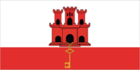
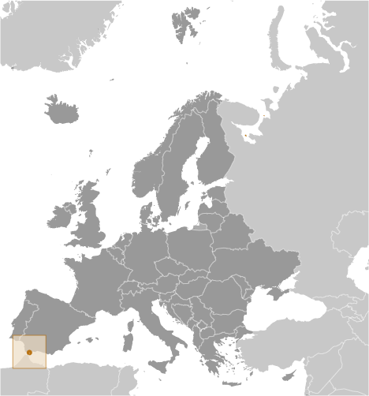
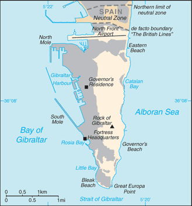

# Gibraltar

_overseas territory of the UK_

## Introduction

**_Background:_**   
Strategically important, Gibraltar was reluctantly ceded to Great Britain by Spain in the 1713 Treaty of Utrecht; the British garrison was formally declared a colony in 1830. In a referendum held in 1967, Gibraltarians voted overwhelmingly to remain a British dependency. The subsequent granting of autonomy in 1969 by the UK led to Spain closing the border and severing all communication links. Between 1997 and 2002, the UK and Spain held a series of talks on establishing temporary joint sovereignty over Gibraltar. In response to these talks, the Gibraltar Government called a referendum in late 2002 in which the majority of citizens voted overwhelmingly against any sharing of sovereignty with Spain. Since late 2004, Spain, the UK, and Gibraltar have held tripartite talks with the aim of cooperatively resolving problems that affect the local population, and work continues on cooperation agreements in areas such as taxation and financial services; communications and maritime security; policy, legal and customs services; environmental protection; and education and visa services. Throughout 2009, a dispute over Gibraltar's claim to territorial waters extending out three miles gave rise to periodic non-violent maritime confrontations between Spanish and UK naval patrols and in 2013, the British reported a record number of entries by Spanish vessels into waters claimed by Gibraltar following a dispute over Gibraltar's creation of an artificial reef in those waters. A new noncolonial constitution came into effect in 2007, and the European Court of First Instance recognized Gibraltar's right to regulate its own tax regime in December 2008. The UK retains responsibility for defense, foreign relations, internal security, and financial stability.

## Geography

**_Location:_**   
Southwestern Europe, bordering the Strait of Gibraltar, which links the Mediterranean Sea and the North Atlantic Ocean, on the southern coast of Spain

**_Geographic coordinates:_**   
36 08 N, 5 21 W

**_Map references:_**   
Europe

**_Area:_**   
**total:** 6.5 sq km   
**land:** 6.5 sq km   
**water:** 0 sq km

**_Area - comparative:_**   
more than 10 times the size of The National Mall in Washington, D.C.

**_Land boundaries:_**   
**total:** 1 km   
**border countries:** Spain 1 km

**_Coastline:_**   
12 km

**_Maritime claims:_**   
**territorial sea:** 3 nm

**_Climate:_**   
Mediterranean with mild winters and warm summers

**_Terrain:_**   
a narrow coastal lowland borders the Rock of Gibraltar

**_Elevation extremes:_**   
**lowest point:** Mediterranean Sea 0 m   
**highest point:** Rock of Gibraltar 426 m

**_Natural resources:_**   
none

**_Land use:_**   
**arable land:** 0%   
**permanent crops:** 0%   
**other:** 100% (2011)

**_Irrigated land:_**   
NA

**_Natural hazards:_**   
NA

**_Environment - current issues:_**   
limited natural freshwater resources: large concrete or natural rock water catchments collect rainwater (no longer used for drinking water) and adequate desalination plant

**_Geography - note:_**   
strategic location on Strait of Gibraltar that links the North Atlantic Ocean and Mediterranean Sea

## People and Society

**_Nationality:_**   
**noun:** Gibraltarian(s)   
**adjective:** Gibraltar

**_Ethnic groups:_**   
Spanish, Italian, English, Maltese, Portuguese, German, North Africans

**_Languages:_**   
English (used in schools and for official purposes), Spanish, Italian, Portuguese

**_Religions:_**   
Roman Catholic 78.1%, Church of England 7%, other Christian 3.2%, Muslim 4%, Jewish 2.1%, Hindu 1.8%, other or unspecified 0.9%, none 2.9% (2001 census)

**_Population:_**   
29,185 (July 2014 est.)

**_Age structure:_**   
**0-14 years:** 20.1% (male 3,009/female 2,862)   
**15-24 years:** 16% (male 2,433/female 2,225)   
**25-54 years:** 38.1% (male 5,593/female 5,524)   
**55-64 years:** 10.8% (male 1,488/female 1,664)   
**65 years and over:** 14.6% (male 2,156/female 2,231) (2014 est.)

**_Median age:_**   
**total:** 34 years   
**male:** 33.1 years   
**female:** 35 years (2014 est.)

**_Population growth rate:_**   
0.25% (2014 est.)

**_Birth rate:_**   
14.15 births/1,000 population (2014 est.)

**_Death rate:_**   
8.33 deaths/1,000 population (2014 est.)

**_Net migration rate:_**   
-3.29 migrant(s)/1,000 population (2014 est.)

**_Urbanization:_**   
**urban population:** 100% of total population (2011)   
**rate of urbanization:** 0.08% annual rate of change (2010-15 est.)

**_Sex ratio:_**   
**at birth:** 1.07 male(s)/female   
**0-14 years:** 1.05 male(s)/female   
**15-24 years:** 1.09 male(s)/female   
**25-54 years:** 1.01 male(s)/female   
**55-64 years:** 1.01 male(s)/female   
**65 years and over:** 0.95 male(s)/female   
**total population:** 1.01 male(s)/female (2014 est.)

**_Infant mortality rate:_**   
**total:** 6.29 deaths/1,000 live births   
**male:** 6.99 deaths/1,000 live births   
**female:** 5.53 deaths/1,000 live births (2014 est.)

**_Life expectancy at birth:_**   
**total population:** 79.13 years   
**male:** 76.28 years   
**female:** 82.18 years (2014 est.)

**_Total fertility rate:_**   
1.92 children born/woman (2014 est.)

**_HIV/AIDS - adult prevalence rate:_**   
NA

**_HIV/AIDS - people living with HIV/AIDS:_**   
NA

**_HIV/AIDS - deaths:_**   
NA

**_Education expenditures:_**   
NA

**_Literacy:_**   
**definition:** NA   
**total population:** above 80%   
**male:** NA   
**female:** NA

## Government

**_Country name:_**   
**conventional long form:** none   
**conventional short form:** Gibraltar

**_Dependency status:_**   
overseas territory of the UK

**_Government type:_**   
NA

**_Capital:_**   
**name:** Gibraltar   
**geographic coordinates:** 36 08 N, 5 21 W   
**time difference:** UTC+1 (6 hours ahead of Washington, DC, during Standard Time)   
**daylight saving time:** +1hr, begins last Sunday in March; ends last Sunday in October

**_Administrative divisions:_**   
none (overseas territory of the UK)

**_Independence:_**   
none (overseas territory of the UK)

**_National holiday:_**   
National Day, 10 September (1967); note - day of the national referendum to decide whether to remain with the UK or join Spain

**_Constitution:_**   
previous 1969; latest passed by referendum 30 November 2006, entered into effect 14 December 2006, entered into force 2 January 2007; amended 2009 (2009)

**_Legal system:_**   
the laws of the UK, where applicable, apply

**_Suffrage:_**   
18 years of age; universal; and British citizens with six months residence or more

**_Executive branch:_**   
**chief of state:** Queen ELIZABETH II (since 6 February 1952); represented by Governor Sir James DUTTON (since 6 December 2013)   
**head of government:** Chief Minister Fabian PICARDO (since 9 December 2011)   
**cabinet:** Council of Ministers appointed from among the 17 elected members of the Parliament by the governor in consultation with the chief minister   
**elections:** the monarchy is hereditary; governor appointed by the monarch; following legislative elections, the leader of the majority party or the leader of the majority coalition is usually appointed chief minister by the governor

**_Legislative branch:_**   
unicameral Parliament (18 seats: 17 members elected by popular vote, 1 for the speaker appointed by Parliament; members serve four-year terms)   
**elections:** last held on 8 December 2011 (next to be held not later than 8 December 2015)   
**election results:** percent of vote by party - GSD 48%, GSLP 46.8%, Progressive Democratic Party 4.4%, other 0.8%; seats by party - GSD 10, GSLP 7

**_Judicial branch:_**   
**highest court(s):** Court of Appeal (consists of at least three judges, including the court president); Supreme Court of Gibraltar (consists of the chief justice and 3 judges); note - appeals beyond the Court of Appeal are heard by the Judicial Committee of the Privy Council (in London)   
**judge selection and term of office:** Court of Appeal and Supreme Court judges appointed by the governor upon the advice of the Judicial Service Commission, a 7-member body of judges and appointees of the governor; tenure of the Court of Appeal president based on terms of appointment; Supreme Court chief justice and judge normally appointed until retirement at age 67, but can be extended 3 years   
**subordinate courts:** Court of First Instance; Magistrates' Court; specialized tribunals for issues relating to social security, taxes, and employment

**_Political parties and leaders:_**   
Gibraltar Liberal Party [Joseph GARCIA]   
Gibraltar Social Democrats or GSD [Daniel FEETHAM]   
Gibraltar Socialist Labor Party or GSLP [Fabian PICARDO]   
Progressive Democratic Party [Nick CRUZ]

**_Political pressure groups and leaders:_**   
Chamber of Commerce   
Gibraltar Representatives Organization   
Women's Association

**_International organization participation:_**   
ICC (NGOs), Interpol (subbureau), UPU

**_Diplomatic representation in the US:_**   
none (overseas territory of the UK)

**_Diplomatic representation from the US:_**   
none (overseas territory of the UK)

**_Flag description:_**   
two horizontal bands of white (top, double width) and red with a three-towered red castle in the center of the white band; hanging from the castle gate is a gold key centered in the red band; the design is that of Gibraltar's coat of arms granted on 10 July 1502 by King Ferdinand and Queen Isabella of Spain; the castle symbolizes Gibraltar as a fortress, while the key represents Gibraltar's strategic importance - the key to the Mediterranean

**_National symbol(s):_**   
Barbary macaque

**_National anthem:_**   
**name:** "Gibraltar Anthem"   
**lyrics/music:** Peter EMBERLEY   
**note:** adopted 1994; serves as a local anthem; as a territory of the United Kingdom, "God Save the Queen" remains official (see United Kingdom)

## Economy

**_Economy - overview:_**   
Self-sufficient Gibraltar benefits from an extensive shipping trade, offshore banking, and its position as an international conference center. Tax rates are low to attract foreign investment. The British military presence has been sharply reduced and now contributes about 7% to the local economy, compared with 60% in 1984. The financial sector, tourism (over 11 million visitors in 2012), gaming revenues, shipping services fees, and duties on consumer goods also generate revenue. The financial sector, tourism, and the shipping sector contribute 30%, 30%, and 25%, respectively, of GDP. Telecommunications, e-commerce, and e-gaming account for the remaining 15%. In recent years, Gibraltar has seen major structural change from a public to a private sector economy, but changes in government spending still have a major impact on the level of employment.

**_GDP (purchasing power parity):_**   
$1.275 billion (2008 est.)   
$1.203 billion (2007 est.)   
$1.106 billion (2006 est.)

**_GDP (official exchange rate):_**   
$1.106 billion (2006 est.)

**_GDP - real growth rate:_**   
6% (2008 est.)   
8.8% (2007 est.)   
0% (2006 est.)

**_GDP - per capita (PPP):_**   
$43,000 (2008 est.)   
$41,200 (2007 est.)   
$38,400 (2006 est.)

**_GDP - composition, by sector of origin:_**   
**agriculture:** 0%   
**industry:** 0%   
**services:** 100% (2008 est.)

**_Agriculture - products:_**   
none

**_Industries:_**   
tourism, banking and finance, ship repairing, tobacco

**_Industrial production growth rate:_**   
NA%

**_Labor force:_**   
12,690 (2001) (2001)

**_Labor force - by occupation:_**   
**agriculture:** negligible   
**industry:** 40%   
**services:** 60% (2001)

**_Unemployment rate:_**   
3% (2005 est.)

**_Population below poverty line:_**   
NA%

**_Household income or consumption by percentage share:_**   
**lowest 10%:** NA%   
**highest 10%:** NA%

**_Budget:_**   
**revenues:** $475.8 million   
**expenditures:** $452.3 million (2008 est.)

**_Taxes and other revenues:_**   
43% of GDP (2008 est.)

**_Budget surplus (+) or deficit (-):_**   
2.1% of GDP (2008 est.)

**_Public debt:_**   
7.5% of GDP (2008 est.)   
13.5% of GDP (2006 est.)

**_Fiscal year:_**   
1 July - 30 June

**_Inflation rate (consumer prices):_**   
2.8% (2008)   
2.6% (2006)

**_Exports:_**   
$271 million (2004 est.)

**_Exports - commodities:_**   
(principally reexports) petroleum 51%, manufactured goods

**_Imports:_**   
$2.967 billion (2004 est.)

**_Imports - commodities:_**   
fuels, manufactured goods, foodstuffs

**_Debt - external:_**   
$NA

**_Exchange rates:_**   
Gibraltar pounds (GIP) per US dollar -   
0.6307 (2014)   
0.6391 (2013)   
0.6472 (2010)   
0.6175 (2009)   
0.5302 (2008)

## Energy

**_Electricity - production:_**   
166.4 million kWh (2010 est.)

**_Electricity - consumption:_**   
154.7 million kWh (2010 est.)

**_Electricity - exports:_**   
0 kWh (2012 est.)

**_Electricity - imports:_**   
0 kWh (2012 est.)

**_Electricity - installed generating capacity:_**   
43,000 kW (2010 est.)

**_Electricity - from fossil fuels:_**   
100% of total installed capacity (2010 est.)

**_Electricity - from nuclear fuels:_**   
0% of total installed capacity (2010 est.)

**_Electricity - from hydroelectric plants:_**   
0% of total installed capacity (2010 est.)

**_Electricity - from other renewable sources:_**   
0% of total installed capacity (2010 est.)

**_Crude oil - production:_**   
0 bbl/day (2012 est.)

**_Crude oil - exports:_**   
0 bbl/day (2010 est.)

**_Crude oil - imports:_**   
0 bbl/day (2010 est.)

**_Crude oil - proved reserves:_**   
0 bbl (1 January 2013 est.)

**_Refined petroleum products - production:_**   
0 bbl/day (2010 est.)

**_Refined petroleum products - consumption:_**   
24,920 bbl/day (2011 est.)

**_Refined petroleum products - exports:_**   
0 bbl/day (2010 est.)

**_Refined petroleum products - imports:_**   
28,380 bbl/day (2008 est.)

**_Natural gas - production:_**   
0 cu m (2011 est.)

**_Natural gas - consumption:_**   
0 cu m (2010 est.)

**_Natural gas - exports:_**   
0 cu m (2011 est.)

**_Natural gas - imports:_**   
0 cu m (2011 est.)

**_Natural gas - proved reserves:_**   
0 cu m (1 January 2013 est.)

**_Carbon dioxide emissions from consumption of energy:_**   
4.905 million Mt (2011 est.)

## Communications

**_Telephones - main lines in use:_**   
23,100 (2012)

**_Telephones - mobile cellular:_**   
34,750 (2012)

**_Telephone system:_**   
**general assessment:** adequate, automatic domestic system and adequate international facilities   
**domestic:** automatic exchange facilities   
**international:** country code - 350; radiotelephone; microwave radio relay; satellite earth station - 1 Intelsat (Atlantic Ocean)

**_Broadcast media:_**   
Gibraltar Broadcasting Corporation (GBC) provides TV and radio broadcasting services via 1 TV station and 4 radio stations; British Forces Broadcasting Service (BFBS) operates 1 radio station; broadcasts from Spanish radio and TV stations are accessible (2008)

**_Internet country code:_**   
.gi

**_Internet hosts:_**   
3,509 (2012)

**_Internet users:_**   
20,200 (2009)

## Transportation

**_Airports:_**   
1 (2013)

**_Airports - with paved runways:_**   
**total:** 1   
**1,524 to 2,437 m:** 1 (2013)

**_Roadways:_**   
**total:** 29 km   
**paved:** 29 km (2007)

**_Merchant marine:_**   
**total:** 267   
**by type:** bulk carrier 3, cargo 146, chemical tanker 64, container 28, liquefied gas 2, petroleum tanker 14, roll on/roll off 2, vehicle carrier 8   
**foreign-owned:** 254 (Belgium 1, Cyprus 1, Denmark 7, Finland 2, Germany 123, Greece 8, Iceland 1, Italy 4, Jersey 1, Morocco 4, Netherlands 34, Norway 46, Sweden 11, UAE 5, UK 6)   
**registered in other countries:** 6 (Liberia 5, Panama 1) (2010)

**_Ports and terminals:_**   
**major seaport(s):** Gibraltar

## Military

**_Military branches:_**   
Royal Gibraltar Regiment (2013)

**_Manpower available for military service:_**   
**males age 16-49:** 7,037 (2010 est.)

**_Manpower fit for military service:_**   
**males age 16-49:** 6,017   
**females age 16-49:** 5,706 (2010 est.)

**_Manpower reaching militarily significant age annually:_**   
**male:** 228   
**female:** 220 (2010 est.)

**_Military - note:_**   
defense is the responsibility of the UK; the Royal Gibraltar Regiment replaced the last British regular infantry forces in 1992

## Transnational Issues

**_Disputes - international:_**   
in 2002, Gibraltar residents voted overwhelmingly by referendum to reject any "shared sovereignty" arrangement; the Government of Gibraltar insists on equal participation in talks between the UK and Spain; Spain disapproves of UK plans to grant Gibraltar even greater autonomy

............................................................   
_Page last updated on June 22, 2014_
