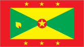
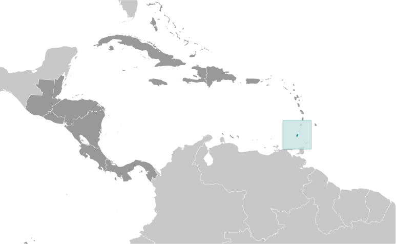
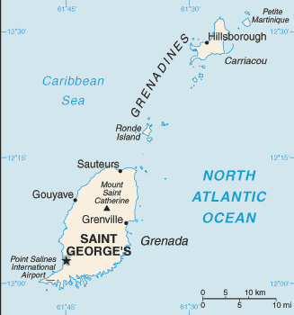

# Grenada

## Introduction

**_Background:_**   
Carib Indians inhabited Grenada when Christopher COLUMBUS discovered the island in 1498, but it remained uncolonized for more than a century. The French settled Grenada in the 17th century, established sugar estates, and imported large numbers of African slaves. Britain took the island in 1762 and vigorously expanded sugar production. In the 19th century, cacao eventually surpassed sugar as the main export crop; in the 20th century, nutmeg became the leading export. In 1967, Britain gave Grenada autonomy over its internal affairs. Full independence was attained in 1974 making Grenada one of the smallest independent countries in the Western Hemisphere. Grenada was seized by a Marxist military council on 19 October 1983. Six days later the island was invaded by US forces and those of six other Caribbean nations, which quickly captured the ringleaders and their hundreds of Cuban advisers. Free elections were reinstituted the following year and have continued since that time.

## Geography

**_Location:_**   
Caribbean, island between the Caribbean Sea and Atlantic Ocean, north of Trinidad and Tobago

**_Geographic coordinates:_**   
12 07 N, 61 40 W

**_Map references:_**   
Central America and the Caribbean

**_Area:_**   
**total:** 344 sq km   
**land:** 344 sq km   
**water:** 0 sq km

**_Area - comparative:_**   
twice the size of Washington, DC

**_Land boundaries:_**   
0 km

**_Coastline:_**   
121 km

**_Maritime claims:_**   
**territorial sea:** 12 nm   
**exclusive economic zone:** 200 nm

**_Climate:_**   
tropical; tempered by northeast trade winds

**_Terrain:_**   
volcanic in origin with central mountains

**_Elevation extremes:_**   
**lowest point:** Caribbean Sea 0 m   
**highest point:** Mount Saint Catherine 840 m

**_Natural resources:_**   
timber, tropical fruit, deepwater harbors

**_Land use:_**   
**arable land:** 8.82%   
**permanent crops:** 20.59%   
**other:** 70.59% (2011)

**_Irrigated land:_**   
2.19 sq km (2003)

**_Total renewable water resources:_**   
NA

**_Natural hazards:_**   
lies on edge of hurricane belt; hurricane season lasts from June to November

**_Environment - current issues:_**   
NA

**_Environment - international agreements:_**   
**party to:** Biodiversity, Climate Change, Climate Change-Kyoto Protocol, Desertification, Endangered Species, Law of the Sea, Ozone Layer Protection, Whaling   
**signed, but not ratified:** none of the selected agreements

**_Geography - note:_**   
the administration of the islands of the Grenadines group is divided between Saint Vincent and the Grenadines and Grenada

## People and Society

**_Nationality:_**   
**noun:** Grenadian(s)   
**adjective:** Grenadian

**_Ethnic groups:_**   
black 82%, mixed black and European 13%, European and East Indian 5%, and trace of Arawak/Carib Amerindian

**_Languages:_**   
English (official), French patois

**_Religions:_**   
Roman Catholic 53%, Anglican 13.8%, other Protestant 33.2%

**_Population:_**   
110,152 (July 2014 est.)

**_Age structure:_**   
**0-14 years:** 24.5% (male 13,954/female 13,057)   
**15-24 years:** 16.5% (male 9,075/female 9,155)   
**25-54 years:** 40.3% (male 22,765/female 21,628)   
**55-64 years:** 9.2% (male 5,214/female 4,927)   
**65 years and over:** 9.2% (male 4,739/female 5,638) (2014 est.)

**_Dependency ratios:_**   
**total dependency ratio:** 50.9 %   
**youth dependency ratio:** 40.2 %   
**elderly dependency ratio:** 10.7 %   
**potential support ratio:** 9.3 (2014 est.)

**_Median age:_**   
**total:** 29.9 years   
**male:** 29.8 years   
**female:** 29.9 years (2014 est.)

**_Population growth rate:_**   
0.5% (2014 est.)

**_Birth rate:_**   
16.3 births/1,000 population (2014 est.)

**_Death rate:_**   
8.04 deaths/1,000 population (2014 est.)

**_Net migration rate:_**   
-3.24 migrant(s)/1,000 population (2014 est.)

**_Urbanization:_**   
**urban population:** 39.1% of total population (2011)   
**rate of urbanization:** 1.24% annual rate of change (2010-15 est.)

**_Major urban areas - population:_**   
SAINT GEORGE'S (capital) 41,000 (2011)

**_Sex ratio:_**   
**at birth:** 1.1 male(s)/female   
**0-14 years:** 1.07 male(s)/female   
**15-24 years:** 0.99 male(s)/female   
**25-54 years:** 1.05 male(s)/female   
**55-64 years:** 1.03 male(s)/female   
**65 years and over:** 0.83 male(s)/female   
**total population:** 1.02 male(s)/female (2014 est.)

**_Maternal mortality rate:_**   
24 deaths/100,000 live births (2010)

**_Infant mortality rate:_**   
**total:** 10.5 deaths/1,000 live births   
**male:** 9.82 deaths/1,000 live births   
**female:** 11.26 deaths/1,000 live births (2014 est.)

**_Life expectancy at birth:_**   
**total population:** 73.8 years   
**male:** 71.24 years   
**female:** 76.62 years (2014 est.)

**_Total fertility rate:_**   
2.09 children born/woman (2014 est.)

**_Contraceptive prevalence rate:_**   
54.3%   
**note:** percent of women aged 15-44 (1990)

**_Health expenditures:_**   
6.2% of GDP (2011)

**_Physicians density:_**   
0.66 physicians/1,000 population (2006)

**_Hospital bed density:_**   
3.5 beds/1,000 population (2011)

**_Drinking water source:_**   
**improved:** urban: 99% of population; rural: 95.3% of population; total: 96.8% of population   
**unimproved:** urban: 1% of population; rural: 4.7% of population; total: 3.2% of population (2012 est.)

**_Sanitation facility access:_**   
**improved:** urban: 97.5% of population; rural: 98.3% of population; total: 98% of population   
**unimproved:** urban: 2.5% of population; rural: 1.7% of population; total: 2% of population (2012 est.)

**_HIV/AIDS - adult prevalence rate:_**   
NA

**_HIV/AIDS - people living with HIV/AIDS:_**   
NA

**_HIV/AIDS - deaths:_**   
NA

**_Obesity - adult prevalence rate:_**   
22.5% (2008)

**_Education expenditures:_**   
3.9% of GDP (2003)

**_Literacy:_**   
**definition:** age 15 and over can read and write   
**total population:** 96%   
**male:** NA   
**female:** NA (2003 est.)

**_School life expectancy (primary to tertiary education):_**   
**total:** 16 years   
**male:** 15 years   
**female:** 16 years (2009)

## Government

**_Country name:_**   
**conventional long form:** none   
**conventional short form:** Grenada

**_Government type:_**   
parliamentary democracy and a Commonwealth realm

**_Capital:_**   
**name:** Saint George's   
**geographic coordinates:** 12 03 N, 61 45 W   
**time difference:** UTC-4 (1 hour ahead of Washington, DC, during Standard Time)

**_Administrative divisions:_**   
6 parishes and 1 dependency\*; Carriacou and Petite Martinique\*, Saint Andrew, Saint David, Saint George, Saint John, Saint Mark, Saint Patrick

**_Independence:_**   
7 February 1974 (from the UK)

**_National holiday:_**   
Independence Day, 7 February (1974)

**_Constitution:_**   
previous 1967; latest presented 19 December 1973, came into operation 7 February 1974, some provisions suspended 1979; amended 1991 (Constitutional Judicature Act, 1991 - restored provisions suspended in 1979), 1992 (2008)

**_Legal system:_**   
common law based on English model

**_International law organization participation:_**   
has not submitted an ICJ jurisdiction declaration; non-party state to the ICCt

**_Suffrage:_**   
18 years of age; universal

**_Executive branch:_**   
**chief of state:** Queen ELIZABETH II (since 6 February 1952); represented by Governor General Cecile LA GRENADE (since 7 May 2013)   
**head of government:** Prime Minister Keith MITCHELL (since 20 February 2013)   
**cabinet:** Cabinet appointed by the governor general on the advice of the prime minister   
**elections:** the monarchy is hereditary; governor general appointed by the monarch; following legislative elections, the leader of the majority party or the leader of the majority coalition is usually appointed prime minister by the governor general

**_Legislative branch:_**   
bicameral Parliament consists of the Senate (13 seats, 10 members appointed by the government and 3 by the leader of the opposition) and the House of Representatives (15 seats; members elected by popular vote to serve five-year terms)   
**elections:** last held on 19 February 2013 (next to be held in 2018)   
**election results:** House of Representatives - percent of vote by party - NNP 59%, NDC 41%; seats by party - NNP 15

**_Judicial branch:_**   
**highest court(s):** Supreme Court of Grenada (consists of the High Court with 3 justices and a 2-tier Court of Appeal with NA justices); note - the Eastern Caribbean Supreme Court (ECSC) is the itinerant superior court of record for the 9-member Organization of Eastern Caribbean States to include Grenada; the ECSC - with its headquarters on St. Lucia - is headed by the chief justice and is compri   
**judge selection and term of office:** justice selection and tenure NA   
**subordinate courts:** magistrates' courts; Court of Magisterial Appeals

**_Political parties and leaders:_**   
Grenada United Labor Party or GULP [Wilfred HAYES]   
National Democratic Congress or NDC [Tillman THOMAS]   
New National Party or NNP [Keith MITCHELL]

**_Political pressure groups and leaders:_**   
Committee for Human Rights in Grenada or CHRG   
New Jewel Movement Support Group   
The British Grenada Friendship Society   
The New Jewel 19 Committee

**_International organization participation:_**   
ACP, AOSIS, C, Caricom, CDB, CELAC, FAO, G-77, IBRD, ICAO, ICRM, IDA, IFAD, IFC, IFRCS, ILO, IMF, IMO, Interpol, IOC, ITU, ITUC, LAES, MIGA, NAM, OAS, OECS, OPANAL, OPCW, Petrocaribe, UN, UNCTAD, UNESCO, UNIDO, UPU, WHO, WIPO, WTO

**_Diplomatic representation in the US:_**   
**chief of mission:** Ambassador Ethelstan A. FRIDAY (since 3 September 2013)   
**chancery:** 1701 New Hampshire Avenue NW, Washington, DC 20009   
**telephone:** [1] (202) 265-2561   
**FAX:** [1] (202) 265-2468   
**consulate(s) general:** New York

**_Diplomatic representation from the US:_**   
**chief of mission:** the US does not have an embassy in Grenada; the US Ambassador to Barbados is accredited to Grenada   
**embassy:** Lance-aux-Epines Stretch, Saint George's   
**mailing address:** P. O. Box 54, Saint George's   
**telephone:** [1] (473) 444-1173 through 1177   
**FAX:** [1] (473) 444-4820

**_Flag description:_**   
a rectangle divided diagonally into yellow triangles (top and bottom) and green triangles (hoist side and outer side), with a red border around the flag; there are seven yellow, five-pointed stars with three centered in the top red border, three centered in the bottom red border, and one on a red disk superimposed at the center of the flag; there is also a symbolic nutmeg pod on the hoist-side triangle (Grenada is the world's second-largest producer of nutmeg, after Indonesia); the seven stars stand for the seven administrative divisions, with the central star denoting the capital, St. George; yellow represents the sun and the warmth of the people, green stands for vegetation and agriculture, and red symbolizes harmony, unity, and courage

**_National anthem:_**   
**name:** "Hail Grenada"   
**lyrics/music:** Irva Merle BAPTISTE/Louis Arnold MASANTO   
**note:** adopted 1974

## Economy

**_Economy - overview:_**   
Grenada relies on tourism as its main source of foreign exchange especially since the construction of an international airport in 1985. Hurricanes Ivan (2004) and Emily (2005) severely damaged the agricultural sector - particularly nutmeg and cocoa cultivation - which had been a key driver of economic growth. Grenada has rebounded from the devastating effects of the hurricanes but is now saddled with the debt burden from the rebuilding process. Public debt-to-GDP is nearly 110%, leaving the MITCHELL administration limited room to engage in public investments and social spending. MITCHELL in 2013 announced a structural adjustment program that includes a plan to increase tax revenue. Strong performances in construction and manufacturing, together with the development of tourism and higher education - especially in medicine - have contributed to growth in national output; however, economic growth remained stagnant in 2010-13 after a sizeable contraction in 2009, because of the global economic slowdown's effects on tourism and remittances.

**_GDP (purchasing power parity):_**   
$1.458 billion (2013 est.)   
$1.447 billion (2012 est.)   
$1.458 billion (2011 est.)   
**note:** data are in 2013 US dollars

**_GDP (official exchange rate):_**   
$811 million (2013 est.)

**_GDP - real growth rate:_**   
0.8% (2013 est.)   
-0.8% (` est.)   
1% (2011 est.)

**_GDP - per capita (PPP):_**   
$13,800 (2013 est.)   
$13,700 (2012 est.)   
$13,900 (2011 est.)   
**note:** data are in 2013 US dollars

**_Gross national saving:_**   
-3.6% of GDP (2013 est.)   
-7.2% of GDP (2012 est.)   
-2.1% of GDP (2011 est.)

**_GDP - composition, by end use:_**   
**household consumption:** 91.6%   
**government consumption:** 15.8%   
**investment in fixed capital:** 16.8%   
**investment in inventories:** 0%   
**exports of goods and services:** 21.9%   
**imports of goods and services:** -46.1%; (2013 est.)

**_GDP - composition, by sector of origin:_**   
**agriculture:** 5.6%   
**industry:** 15.8%   
**services:** 78.5% (2013 est.)

**_Agriculture - products:_**   
bananas, cocoa, nutmeg, mace, citrus, avocados, root crops, sugarcane, corn, vegetables

**_Industries:_**   
food and beverages, textiles, light assembly operations, tourism, construction

**_Industrial production growth rate:_**   
-2% (2013 est.)

**_Labor force:_**   
59,900 (2013 est.)

**_Labor force - by occupation:_**   
**agriculture:** 11%   
**industry:** 20%   
**services:** 69% (2008 est.)

**_Unemployment rate:_**   
33.5% (2013)   
25% (2008)

**_Population below poverty line:_**   
38% (2008)

**_Household income or consumption by percentage share:_**   
**lowest 10%:** NA%   
**highest 10%:** NA%

**_Budget:_**   
**revenues:** $163 million   
**expenditures:** $196.3 million (2012 est.)

**_Taxes and other revenues:_**   
20.1% of GDP (2012 est.)

**_Budget surplus (+) or deficit (-):_**   
-4.1% of GDP (2012 est.)

**_Public debt:_**   
110% of GDP (2012 est.)

**_Fiscal year:_**   
calendar year

**_Inflation rate (consumer prices):_**   
2.4% (2013 est.)   
2.4% (2012 est.)

**_Central bank discount rate:_**   
6.5% (31 December 2009)   
6.5% (31 December 2008)

**_Commercial bank prime lending rate:_**   
9.4% (31 December 2013 est.)   
9.75% (31 December 2012 est.)

**_Stock of narrow money:_**   
$131.7 million (31 December 2013 est.)   
$123.3 million (31 December 2012 est.)

**_Stock of broad money:_**   
$697.4 million (31 December 2013 est.)   
$689.7 million (31 December 2012 est.)

**_Stock of domestic credit:_**   
$744.9 million (31 December 2013 est.)   
$729.5 million (31 December 2012 est.)

**_Market value of publicly traded shares:_**   
$NA

**_Current account balance:_**   
-$214.4 million (2012 est.)   
-$204.5 million (2011 est.)

**_Exports:_**   
$40.5 million (2012 est.)   
$34.9 million (2011 est.)

**_Exports - commodities:_**   
nutmeg, bananas, cocoa, fruit and vegetables, clothing, mace

**_Exports - partners:_**   
Nigeria 40.2%, St. Lucia 10.7%, Antigua and Barbuda 7.3%, US 6.6%, St. Kitts and Nevis 6.5%, Dominica 6.5%, Switzerland 4.3% (2012)

**_Imports:_**   
$297 million (2012 est.)   
$290.4 million (2011 est.)

**_Imports - commodities:_**   
food, manufactured goods, machinery, chemicals, fuel

**_Imports - partners:_**   
Trinidad and Tobago 44.3%, US 16.4%, China 4.6% (2012)

**_Debt - external:_**   
$679 million (2013 est.)   
$538 million (2010 est.)

**_Exchange rates:_**   
East Caribbean dollars (XCD) per US dollar -   
2.7 (2013 est.)   
2.7 (2012 est.)   
2.7 (2010 est.)   
2.7 (2009)

## Energy

**_Electricity - production:_**   
201.4 million kWh (2010 est.)

**_Electricity - consumption:_**   
178.4 million kWh (2010 est.)

**_Electricity - exports:_**   
0 kWh (2012 est.)

**_Electricity - imports:_**   
0 kWh (2012 est.)

**_Electricity - installed generating capacity:_**   
49,700 kW (2010 est.)

**_Electricity - from fossil fuels:_**   
98.6% of total installed capacity (2010 est.)

**_Electricity - from nuclear fuels:_**   
0% of total installed capacity (2010 est.)

**_Electricity - from hydroelectric plants:_**   
0% of total installed capacity (2010 est.)

**_Electricity - from other renewable sources:_**   
1.4% of total installed capacity (2010 est.)

**_Crude oil - production:_**   
0 bbl/day (2012 est.)

**_Crude oil - exports:_**   
0 bbl/day (2010 est.)

**_Crude oil - imports:_**   
0 bbl/day (2010 est.)

**_Crude oil - proved reserves:_**   
0 bbl (1 January 2013 est.)

**_Refined petroleum products - production:_**   
0 bbl/day (2010 est.)

**_Refined petroleum products - consumption:_**   
2,803 bbl/day (2011 est.)

**_Refined petroleum products - exports:_**   
0 bbl/day (2010 est.)

**_Refined petroleum products - imports:_**   
2,004 bbl/day (2010 est.)

**_Natural gas - production:_**   
0 cu m (2011 est.)

**_Natural gas - consumption:_**   
0 cu m (2010 est.)

**_Natural gas - exports:_**   
0 cu m (2011 est.)

**_Natural gas - imports:_**   
0 cu m (2011 est.)

**_Natural gas - proved reserves:_**   
0 cu m (1 January 2013 est.)

**_Carbon dioxide emissions from consumption of energy:_**   
269,000 Mt (2011 est.)

## Communications

**_Telephones - main lines in use:_**   
28,500 (2012)

**_Telephones - mobile cellular:_**   
128,000 (2012)

**_Telephone system:_**   
**general assessment:** automatic, island-wide telephone system   
**domestic:** interisland VHF and UHF radiotelephone links   
**international:** country code - 1-473; landing point for the East Caribbean Fiber Optic System (ECFS) submarine cable with links to 13 other islands in the eastern Caribbean extending from the British Virgin Islands to Trinidad; SHF radiotelephone links to Trinidad and Tobago and Saint Vincent; VHF and UHF radio links to Trinidad (2009)

**_Broadcast media:_**   
the Grenada Broadcasting Network, jointly owned by the government and the Caribbean Communications Network of Trinidad and Tobago, operates a TV station and 2 radio stations; multi-channel cable TV subscription service is available; a dozen private radio stations also broadcast (2007)

**_Internet country code:_**   
.gd

**_Internet hosts:_**   
80 (2012)

**_Internet users:_**   
25,000 (2009)

## Transportation

**_Airports:_**   
3 (2013)

**_Airports - with paved runways:_**   
**total:** 3   
**2,438 to 3,047 m:** 1   
**1,524 to 2,437 m:** 1   
**under 914 m:** 1 (2013)

**_Roadways:_**   
**total:** 1,127 km   
**paved:** 687 km   
**unpaved:** 440 km (2001)

**_Ports and terminals:_**   
**major seaport(s):** Saint George's

## Military

**_Military branches:_**   
no regular military forces; Royal Grenada Police Force (includes Coast Guard) (2010)

**_Manpower available for military service:_**   
**males age 16-49:** 27,468 (2010 est.)

**_Manpower fit for military service:_**   
**males age 16-49:** 22,596   
**females age 16-49:** 22,588 (2010 est.)

**_Manpower reaching militarily significant age annually:_**   
**male:** 995   
**female:** 1,002 (2010 est.)

## Transnational Issues

**_Disputes - international:_**   
none

**_Illicit drugs:_**   
small-scale cannabis cultivation; lesser transshipment point for marijuana and cocaine to US

............................................................   
_Page last updated on June 20, 2014_
