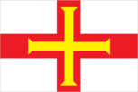
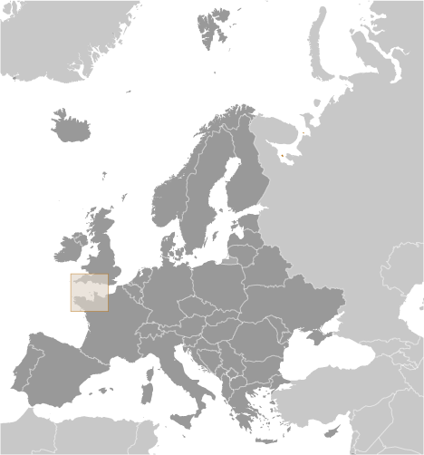
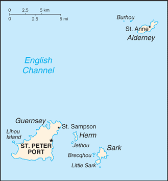

# Guernsey

_British crown dependency_

## Introduction

**_Background:_**   
Guernsey and the other Channel Islands represent the last remnants of the medieval Dukedom of Normandy, which held sway in both France and England. The islands were the only British soil occupied by German troops in World War II. Guernsey is a British crown dependency but is not part of the UK or of the European Union. However, the UK Government is constitutionally responsible for its defense and international representation.

## Geography

**_Location:_**   
Western Europe, islands in the English Channel, northwest of France

**_Geographic coordinates:_**   
49 28 N, 2 35 W

**_Map references:_**   
Europe

**_Area:_**   
**total:** 78 sq km   
**land:** 78 sq km   
**water:** 0 sq km   
**note:** includes Alderney, Guernsey, Herm, Sark, and some other smaller islands

**_Area - comparative:_**   
about one-half the size of Washington, DC

**_Land boundaries:_**   
0 km

**_Coastline:_**   
50 km

**_Maritime claims:_**   
**territorial sea:** 3 nm   
**exclusive fishing zone:** 12 nm

**_Climate:_**   
temperate with mild winters and cool summers; about 50% of days are overcast

**_Terrain:_**   
mostly level with low hills in southwest

**_Elevation extremes:_**   
**lowest point:** Atlantic Ocean 0 m   
**highest point:** unnamed elevation on Sark 114 m

**_Natural resources:_**   
cropland

**_Land use:_**   
**arable land:** NA   
**permanent crops:** NA   
**other:** NA

**_Irrigated land:_**   
NA

**_Natural hazards:_**   
NA

**_Environment - current issues:_**   
NA

**_Geography - note:_**   
large, deepwater harbor at Saint Peter Port

## People and Society

**_Nationality:_**   
**noun:** Channel Islander(s)   
**adjective:** Channel Islander

**_Ethnic groups:_**   
British and Norman-French descent with small percentages from other European countries

**_Languages:_**   
English, French, Norman-French dialect spoken in country districts

**_Religions:_**   
Protestant (Anglican, Presbyterian, Baptist, Congregational, Methodist), Roman Catholic

**_Population:_**   
65,849 (July 2014 est.)

**_Age structure:_**   
**0-14 years:** 14.6% (male 4,967/female 4,629)   
**15-24 years:** 11.9% (male 3,993/female 3,854)   
**25-54 years:** 42.2% (male 13,991/female 13,800)   
**55-64 years:** 12.9% (male 4,229/female 4,249)   
**65 years and over:** 17.9% (male 5,469/female 6,668) (2014 est.)

**_Dependency ratios:_**   
**total dependency ratio:** 46.4 %   
**youth dependency ratio:** 21.7 %   
**elderly dependency ratio:** 24.7 %   
**potential support ratio:** 4   
**note:** data represents the Channel Islands (2014 est.)

**_Median age:_**   
**total:** 43.1 years   
**male:** 41.9 years   
**female:** 44.2 years (2014 est.)

**_Population growth rate:_**   
0.36% (2014 est.)

**_Birth rate:_**   
9.89 births/1,000 population (2014 est.)

**_Death rate:_**   
8.69 deaths/1,000 population (2014 est.)

**_Net migration rate:_**   
2.4 migrant(s)/1,000 population (2014 est.)

**_Urbanization:_**   
**urban population:** 31.2% of total population (2011)   
**rate of urbanization:** 0.63% annual rate of change (2010-15 est.)

**_Sex ratio:_**   
**at birth:** 1.05 male(s)/female   
**0-14 years:** 1.07 male(s)/female   
**15-24 years:** 1.04 male(s)/female   
**25-54 years:** 1.01 male(s)/female   
**55-64 years:** 0.98 male(s)/female   
**65 years and over:** 0.81 male(s)/female   
**total population:** 0.98 male(s)/female (2014 est.)

**_Infant mortality rate:_**   
**total:** 3.47 deaths/1,000 live births   
**male:** 3.77 deaths/1,000 live births   
**female:** 3.15 deaths/1,000 live births (2014 est.)

**_Life expectancy at birth:_**   
**total population:** 82.39 years   
**male:** 79.72 years   
**female:** 85.2 years (2014 est.)

**_Total fertility rate:_**   
1.55 children born/woman (2014 est.)

**_HIV/AIDS - adult prevalence rate:_**   
NA

**_HIV/AIDS - people living with HIV/AIDS:_**   
NA

**_HIV/AIDS - deaths:_**   
NA

**_Literacy:_**   
NA

## Government

**_Country name:_**   
**conventional long form:** Bailiwick of Guernsey   
**conventional short form:** Guernsey

**_Dependency status:_**   
British crown dependency

**_Government type:_**   
parliamentary democracy

**_Capital:_**   
**name:** Saint Peter Port   
**geographic coordinates:** 49 27 N, 2 32 W   
**time difference:** UTC 0 (5 hours ahead of Washington, DC, during Standard Time)   
**daylight saving time:** +1hr, begins last Sunday in March; ends last Sunday in October

**_Administrative divisions:_**   
none (British crown dependency); there are no first-order administrative divisions as defined by the US Government, but there are 10 parishes: Castel, Forest, Saint Andrew, Saint Martin, Saint Peter Port, Saint Pierre du Bois, Saint Sampson, Saint Saviour, Torteval, Vale

**_Independence:_**   
none (British crown dependency)

**_National holiday:_**   
Liberation Day, 9 May (1945)

**_Constitution:_**   
unwritten; includes royal charters, statutes, and common law and practice

**_Legal system:_**   
customary legal system based on Norman customary law, and includes elements of the French Civil Code and English common law

**_Suffrage:_**   
16 years of age; universal

**_Executive branch:_**   
**chief of state:** Queen ELIZABETH II (since 6 February 1952), represented by Lieutenant Governor Air Marshall Peter WALKER (since 15 April 2011)   
**head of government:** Chief Minister Jonathan LE TOCQ (since 12 March 2014); Bailiff Richard COLLAS (since 23 March 2012) note - Chief Minister Peter HARWOOD resigned 25 February 2014   
**cabinet:** Policy Council elected by the States of Deliberation   
**elections:** the monarchy is hereditary; lieutenant governor and bailiff appointed by the monarch; chief minister elected by States of Deliberation   
**election results:** Peter HARWOOD elected chief minister, percent of vote NA

**_Legislative branch:_**   
unicameral States of Deliberation (45 seats; members elected by popular vote to serve four-year terms; note - there are also 10 Douzaine representatives - one from each parish, 2 representatives from Alderney and the appointed attorney general and soliciter general); note - Alderney and Sark have parliaments   
**elections:** last held on 18 April 2012 (next to be held in 2016)   
**election results:** percent of vote - NA; seats - all independents

**_Judicial branch:_**   
**highest court(s):** Guernsey Court of Appeal (consists of the Bailiff of Guernsey, who is the ex-officio president of the Guernsey Court of Appeal, and at least 12 judges); Royal Court (organized into 3 divisions - Full Court sits with 1 judge and 7 to 12 jurats acting as judges of fact, Ordinary Court sits with 1 judge and normally 3 jurats, and Matrimonial Causes Division sits with a 1 judge and 4 jurats); note - appeals beyond Guernsey courts are heard by the Judicial Committee of the Privy Council (in London)   
**judge selection and term of office:** Royal Court Balliff, Deputy Balliff and Court of Appeal justices appointed by the British Crown and hold office at Her Majesty's pleasure; jurats elected by the States of Election, a body chaired by the Balliff and a number of jurats   
**subordinate courts:** Court of Alderney; Court of the Seneschal of Sark; Magistrate's Court (includes Juvenile Court); Contracts Court; Ecclesiastical Court; Court of Chief Pleas

**_Political parties and leaders:_**   
none; all independents

**_Political pressure groups and leaders:_**   
Stop Traffic Endangering Pedestrian Safety or STEPS   
No More Masts [Colin FALLAIZE]

**_International organization participation:_**   
UPU

**_Diplomatic representation in the US:_**   
none (British crown dependency)

**_Diplomatic representation from the US:_**   
none (British crown dependency)

**_Flag description:_**   
white with the red cross of Saint George (patron saint of England) extending to the edges of the flag and a yellow equal-armed cross of William the Conqueror superimposed on the Saint George cross; the red cross represents the old ties with England and the fact that Guernsey is a British Crown dependency; the gold cross is a replica of the one used by Duke William of Normandy at the Battle of Hastings

**_National symbol(s):_**   
Guernsey cow; donkey

**_National anthem:_**   
**name:** "Sarnia Cherie" (Guernsey Dear)   
**lyrics/music:** George DEIGHTON/Domencio SANTANGELO   
**note:** adopted 1911; serves as a local anthem; as a British crown dependency, "God Save the Queen" remains official (see United Kingdom)

## Economy

**_Economy - overview:_**   
Financial services - banking, fund management, insurance - account for about 23% of employment and about 55% of total income in this tiny, prosperous Channel Island economy. Tourism, manufacturing, and horticulture, mainly tomatoes and cut flowers, have been declining. Financial services, construction, retail, and the public sector have been growing. Light tax and death duties make Guernsey a popular tax haven. In January 2013, Guernsey signed a tax agreement with Jersey and the Isle of Man, in order to enable the islands' authorities to end tax avoidance and evasion. The evolving economic integration of the EU nations is changing the environment under which Guernsey operates.

**_GDP (purchasing power parity):_**   
$2.742 billion (2005 est.)

**_GDP (official exchange rate):_**   
$2.742 billion (2005 est.)

**_GDP - real growth rate:_**   
3% (2005 est.)

**_GDP - per capita (PPP):_**   
$44,600 (2005)

**_GDP - composition, by sector of origin:_**   
**agriculture:** 3%   
**industry:** 10%   
**services:** 87% (2000)

**_Agriculture - products:_**   
tomatoes, greenhouse flowers, sweet peppers, eggplant, fruit; Guernsey cattle

**_Industries:_**   
tourism, banking

**_Industrial production growth rate:_**   
NA%

**_Labor force:_**   
31,470 (March 2006)

**_Unemployment rate:_**   
0.9% (March 2006 est.)

**_Population below poverty line:_**   
NA%

**_Household income or consumption by percentage share:_**   
**lowest 10%:** NA%   
**highest 10%:** NA%

**_Budget:_**   
**revenues:** $563.6 million   
**expenditures:** $530.9 million (2005)

**_Taxes and other revenues:_**   
20.6% of GDP (2005)

**_Budget surplus (+) or deficit (-):_**   
1.2% of GDP (2005)

**_Fiscal year:_**   
calendar year

**_Inflation rate (consumer prices):_**   
3.4% (June 2006)

**_Exports:_**   
$NA

**_Exports - commodities:_**   
tomatoes, flowers and ferns, sweet peppers, eggplant, other vegetables

**_Imports:_**   
$NA

**_Imports - commodities:_**   
coal, gasoline, oil, machinery and equipment

**_Debt - external:_**   
$NA

**_Exchange rates:_**   
Guernsey pound per US dollar   
0.6307 (2014)   
0.6391 (2013)   
0.6472 (2010)   
0.6175 (2009)   
0.5302 (2008)

## Communications

**_Telephones - main lines in use:_**   
45,100 (2010)

**_Telephones - mobile cellular:_**   
43,800 (2004)

**_Telephone system:_**   
**domestic:** fixed-line and mobile-cellular services widely available; combined fixed and mobile-cellular teledensity exceeds 100 per 100 persons   
**international:** country code - 44; 1 submarine cable (2011)

**_Broadcast media:_**   
multiple UK terrestrial TV broadcasts are received via a transmitter in Jersey with relays in Jersey, Guernsey, and Alderney; satellite packages are available; BBC Radio Guernsey and 1 other radio station operating (2009)

**_Internet country code:_**   
.gg

**_Internet hosts:_**   
239 (2012)

**_Internet users:_**   
48,300 (2009)

## Transportation

**_Airports:_**   
2 (2013)

**_Airports - with paved runways:_**   
**total:** 2   
**1,524 to 2,437 m:** 1   
**under 914 m:** 1 (2013)

**_Ports and terminals:_**   
**major seaport(s):** Braye Bay, Saint Peter Port

## Military

**_Manpower fit for military service:_**   
**males age 16-49:** 12,493   
**females age 16-49:** 12,272 (2010 est.)

**_Manpower reaching militarily significant age annually:_**   
**male:** 354   
**female:** 342 (2010 est.)

**_Military - note:_**   
defense is the responsibility of the UK

## Transnational Issues

**_Disputes - international:_**   
none

............................................................   
_Page last updated on June 18, 2014_
