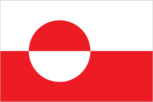
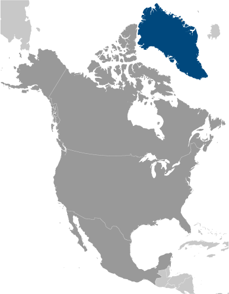
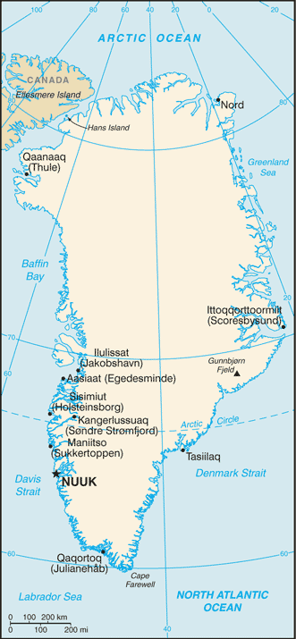

# Greenland

_part of the Kingdom of Denmark_

## Introduction

**_Background:_**   
Greenland, the world's largest island, is about 81% ice-capped. Vikings reached the island in the 10th century from Iceland; Danish colonization began in the 18th century, and Greenland was made an integral part of Denmark in 1953. It joined the European Community (now the EU) with Denmark in 1973 but withdrew in 1985 over a dispute centered on stringent fishing quotas. Greenland was granted self-government in 1979 by the Danish parliament; the law went into effect the following year. Greenland voted in favor of increased self-rule in November 2008 and acquired greater responsibility for internal affairs when the Act on Greenland Self-Government was signed into law in June 2009. Denmark, however, continues to exercise control over several policy areas on behalf of Greenland including foreign affairs, security, and financial policy in consultation with Greenland's Self-Rule Government.

## Geography

**_Location:_**   
Northern North America, island between the Arctic Ocean and the North Atlantic Ocean, northeast of Canada

**_Geographic coordinates:_**   
72 00 N, 40 00 W

**_Map references:_**   
North America

**_Area:_**   
**total:** 2,166,086 sq km   
**land:** 2,166,086 sq km (410,449 sq km ice-free, 1,755,637 sq km ice-covered)

**_Area - comparative:_**   
slightly more than three times the size of Texas

**_Land boundaries:_**   
0 km

**_Coastline:_**   
44,087 km

**_Maritime claims:_**   
**territorial sea:** 3 nm   
**exclusive fishing zone:** 200 nm or agreed boundaries or median line   
**continental shelf:** 200 nm or agreed boundaries or median line

**_Climate:_**   
arctic to subarctic; cool summers, cold winters

**_Terrain:_**   
flat to gradually sloping icecap covers all but a narrow, mountainous, barren, rocky coast

**_Elevation extremes:_**   
**lowest point:** Atlantic Ocean 0 m   
**highest point:** Gunnbjorn Fjeld 3,700 m

**_Natural resources:_**   
coal, iron ore, lead, zinc, molybdenum, diamonds, gold, platinum, niobium, tantalite, uranium, fish, seals, whales, hydropower, possible oil and gas

**_Land use:_**   
**arable land:** 0%   
**permanent crops:** 0%   
**other:** 100% (2011)

**_Irrigated land:_**   
NA

**_Natural hazards:_**   
continuous permafrost over northern two-thirds of the island

**_Environment - current issues:_**   
protection of the arctic environment; preservation of the Inuit traditional way of life, including whaling and seal hunting

**_Geography - note:_**   
dominates North Atlantic Ocean between North America and Europe; sparse population confined to small settlements along coast; close to one-quarter of the population lives in the capital, Nuuk; world's second largest ice cap

## People and Society

**_Nationality:_**   
**noun:** Greenlander(s)   
**adjective:** Greenlandic

**_Ethnic groups:_**   
Inuit 89%, Danish and other 11% (2009)

**_Languages:_**   
Greenlandic (East Inuit) (official), Danish (official), English

**_Religions:_**   
Evangelical Lutheran, traditional Inuit spiritual beliefs

**_Population:_**   
57,728 (July 2014 est.)

**_Age structure:_**   
**0-14 years:** 21.5% (male 6,287/female 6,099)   
**15-24 years:** 16.5% (male 4,843/female 4,702)   
**25-54 years:** 42.5% (male 12,928/female 11,590)   
**55-64 years:** 11.3% (male 3,681/female 2,818)   
**65 years and over:** 8.1% (male 2,550/female 2,230) (2014 est.)

**_Median age:_**   
**total:** 33.6 years   
**male:** 34.9 years   
**female:** 32.3 years (2014 est.)

**_Population growth rate:_**   
0.02% (2014 est.)

**_Birth rate:_**   
14.53 births/1,000 population (2014 est.)

**_Death rate:_**   
8.38 deaths/1,000 population (2014 est.)

**_Net migration rate:_**   
-5.98 migrant(s)/1,000 population (2014 est.)

**_Urbanization:_**   
**urban population:** 84.7% of total population (2011)   
**rate of urbanization:** 0.32% annual rate of change (2010-15 est.)

**_Major urban areas - population:_**   
NUUK (capital) 16,000 (2011)

**_Sex ratio:_**   
**at birth:** 1.05 male(s)/female   
**0-14 years:** 1.03 male(s)/female   
**15-24 years:** 1.03 male(s)/female   
**25-54 years:** 1.12 male(s)/female   
**55-64 years:** 1.1 male(s)/female   
**65 years and over:** 1.1 male(s)/female   
**total population:** 1.11 male(s)/female (2014 est.)

**_Infant mortality rate:_**   
**total:** 9.42 deaths/1,000 live births   
**male:** 10.76 deaths/1,000 live births   
**female:** 8.02 deaths/1,000 live births (2014 est.)

**_Life expectancy at birth:_**   
**total population:** 71.82 years   
**male:** 69.15 years   
**female:** 74.63 years (2014 est.)

**_Total fertility rate:_**   
2.06 children born/woman (2014 est.)

**_Physicians density:_**   
1.67 physicians/1,000 population (2009)

**_Hospital bed density:_**   
5.8 beds/1,000 population (2009)

**_Drinking water source:_**   
**improved:** urban: 100% of population; rural: 100% of population; total: 100% of population   
**unimproved:** urban: 0% of population; rural: 0% of population; total: 0% of population (2012 est.)

**_Sanitation facility access:_**   
**improved:** urban: 100% of population; rural: 100% of population; total: 100% of population   
**unimproved:** urban: 0% of population; rural: 0% of population; total: 0% of population (2012 est.)

**_HIV/AIDS - adult prevalence rate:_**   
NA

**_HIV/AIDS - people living with HIV/AIDS:_**   
NA

**_HIV/AIDS - deaths:_**   
NA

**_Literacy:_**   
**definition:** age 15 and over can read and write   
**total population:** 100%   
**male:** 100%   
**female:** 100% (2001 est.)

## Government

**_Country name:_**   
**conventional long form:** none   
**conventional short form:** Greenland   
**local long form:** none   
**local short form:** Kalaallit Nunaat

**_Dependency status:_**   
part of the Kingdom of Denmark; self-governing overseas administrative division of Denmark since 1979

**_Government type:_**   
parliamentary democracy within a constitutional monarchy

**_Capital:_**   
**name:** Nuuk (Godthab)   
**geographic coordinates:** 64 11 N, 51 45 W   
**time difference:** UTC-3 (2 hours ahead of Washington, DC, during Standard Time)   
**daylight saving time:** +1hr, begins last Sunday in March; ends last Sunday in October   
**note:** Greenland has four time zones

**_Administrative divisions:_**   
4 municipalities (kommuner, singular kommune); Kujalleq, Qaasuitsup, Qeqqata, Sermersooq   
**note:** the North and East Greenland National Park (Avannaarsuani Tunumilu Nuna Allanngutsaaliugaq) and the Thule Air Base in Pituffik (in northwest Greenland) are two unincorporated areas; the national park's 972,000 sq km - about 46% of the island - make it the largest national park in the world and also the most northerly

**_Independence:_**   
none (extensive self-rule as part of the Kingdom of Denmark; foreign affairs is the responsibility of Denmark, but Greenland actively participates in international agreements relating to Greenland)

**_National holiday:_**   
June 21 (longest day)

**_Constitution:_**   
previous 1953 (Greenland established as a constituency in the Danish constitution), 1979 (Greenland Home Rule Act); latest 21 June 2009 (Greenland Self-Government Act) (2009)

**_Legal system:_**   
the laws of Denmark apply

**_Suffrage:_**   
18 years of age; universal

**_Executive branch:_**   
**chief of state:** Queen MARGRETHE II of Denmark (since 14 January 1972), represented by High Commissioner Mikaela ENGELL (since April 2011)   
**head of government:** Prime Minister Aleqa HAMMOND (since 13 March 2013)   
**cabinet:** Home Rule Government elected by the Parliament (Landsting) on the basis of the strength of parties   
**elections:** the monarchy is hereditary; high commissioner appointed by the monarch; prime minister elected by parliament (usually the leader of the majority party)   
**election results:** Aleqa HAMMOND elected prime minister

**_Legislative branch:_**   
unicameral Parliament or Inatsisartut (Landsting) (31 seats; members elected by popular vote on the basis of proportional representation to serve four-year terms)   
**elections:** last held on 13 March 2013 (next to be held by 2017)   
**election results:** percent of vote by party - S 42.8%, IA 34.4%, A 8.1%, PI 6.4%; D 6.2%; other 2.1%; seats by party - S 14, IA 11, A 2, PI 2, D 2   
**note:** two representatives were elected to the Danish Parliament or Folketing on 15 September 2011 (next to be held by September 2015); percent of vote by party - NA; seats by party - Siumut 1, Inuit Ataqatigiit 1 (2013)

**_Judicial branch:_**   
**highest court(s):** High Court of Greenland (consists of the presiding professional judge and 2 lay assessors); note - appeals beyond the High Court of Greenland can be heard by the Supreme Court (in Copenhagen)   
**judge selection and term of office:** judges appointed by the monarch upon the recommendation of the Judicial Appointments Council, a 6-member independent body of judges and lawyers; judges appointed for life with retirement at age 70   
**subordinate courts:** Court of Greenland; 18 district or magistrates' courts

**_Political parties and leaders:_**   
Candidate List (Kattusseqatigiit) or K [Anthon FREDERIKSEN]   
Democrats Party (Demokraatit) or D [Jens B. FREDERIKSEN]   
Forward Party (Siumut) or S [Aleqa HAMMOND]   
Inuit Community (Inuit Ataqatigiit) or IA [Kuupik KLEIST]   
Inuit Party (Partii Inuit) or PI [Nikku OLSEN]   
Solidarity Party (Atassut) or A [Gerhardt PETERSEN]

**_Political pressure groups and leaders:_**   
conservationists; environmentalists

**_International organization participation:_**   
Arctic Council, ICC, NC, NIB, UPU

**_Diplomatic representation in the US:_**   
none (self-governing overseas administrative division of Denmark)

**_Diplomatic representation from the US:_**   
none (self-governing overseas administrative division of Denmark)

**_Flag description:_**   
two equal horizontal bands of white (top) and red with a large disk slightly to the hoist side of center - the top half of the disk is red, the bottom half is white; the design represents the sun reflecting off a field of ice; the colors are the same as those of the Danish flag and symbolize Greenland's links to the Kingdom of Denmark

**_National symbol(s):_**   
polar bear

**_National anthem:_**   
**name:** "Nunarput utoqqarsuanngoravit" ("Our Country, Who's Become So Old" also translated as "You Our Ancient Land")   
**lyrics/music:** Henrik LUND/Jonathan PETERSEN   
**note:** adopted 1916; the government also recognizes "Nuna asiilasooq" as a secondary anthem

## Economy

**_Economy - overview:_**   
The economy remains critically dependent on exports of shrimp and fish, income from resource exploration and extraction, and on a substantial subsidy from the Danish Government. The subsidy was budgeted to be about $651 million in 2012, approximately 56% of government revenues that year. The public sector, including publicly owned enterprises and the municipalities, plays the dominant role in Greenland's economy. Greenland's real GDP contracted about 1% in 2009 as a result of the global economic slowdown, but is estimated to have grown marginally in 2010-13. The relative ease with which Greenland has weathered the economic crisis is due to increased hydrocarbon and mineral exploration and extraction activities, a high level of construction activity in the Nuuk area and the increasing price of fish and shrimp. During the last decade the Greenland Home Rule Government (GHRG) pursued conservative fiscal and monetary policies, but public pressure has increased for better schools, health care and retirement systems. The Greenlandic economy has benefited from increasing catches and exports of shrimp, Greenland halibut and, more recently, crabs. Due to Greenland's continued dependence on exports of fish - which accounted for 89% of exports in 2010 - the economy remains very sensitive to foreign developments. International consortia are increasingly active in exploring for hydrocarbon resources off Greenland's western coast, and international studies indicate the potential for oil and gas fields in northern and northeastern Greenland. In May 2007 a US aluminum producer concluded a memorandum of understanding with the Greenland Home Rule Government to build an aluminum smelter and a power generation facility, which takes advantage of Greenland's abundant hydropower potential. Within the area of mining, olivine sand continues to be produced and gold production has resumed in south Greenland, while rare-earth and iron ore mineral projects have been proposed or planned elsewhere on the island. Tourism also offers another avenue of economic growth for Greenland, with increasing numbers of cruise lines now operating in Greenland's western and southern waters during the peak summer tourism season.

**_GDP (purchasing power parity):_**   
$2.133 billion (2011 est.)   
$2.071 billion (2010 est.)   
$1.974 billion (2009 est.)   
**note:** data are in 2011 US dollars

**_GDP (official exchange rate):_**   
$2.16 billion (2011 est.)

**_GDP - real growth rate:_**   
3% (2011 est.)   
4.9% (2010 est.)   
-2.7% (2009 est.)

**_GDP - per capita (PPP):_**   
$38,400 (2008 est.)   
$36,600 (2007 est.)

**_GDP - composition, by sector of origin:_**   
**agriculture:** 4%   
**industry:** 29%   
**services:** 67% (2009 est.)

**_Agriculture - products:_**   
forage crops, garden and greenhouse vegetables; sheep, reindeer; fish

**_Industries:_**   
fish processing (mainly shrimp and Greenland halibut); gold, niobium, tantalite, uranium, iron and diamond mining; handicrafts, hides and skins, small shipyards

**_Industrial production growth rate:_**   
NA%

**_Labor force:_**   
28,600 (2011)

**_Labor force - by occupation:_**   
**agriculture:** 4%   
**industry:** 29%   
**services:** 67% (2009 est.)

**_Unemployment rate:_**   
9.4% (2013 est.)   
4.2% (2010 est.)

**_Population below poverty line:_**   
9.2% (2007 est.)

**_Household income or consumption by percentage share:_**   
**lowest 10%:** NA%   
**highest 10%:** NA%

**_Budget:_**   
**revenues:** $1.72 billion   
**expenditures:** $1.68 billion (2010)

**_Taxes and other revenues:_**   
79.6% of GDP (2010)

**_Budget surplus (+) or deficit (-):_**   
1.9% of GDP (2010)

**_Fiscal year:_**   
calendar year

**_Inflation rate (consumer prices):_**   
2.8% (2011 est.)   
1.7% (2010 est.)

**_Exports:_**   
$384.3 million (2010)   
$358 million (2009)

**_Exports - commodities:_**   
fish and fish products 89%, metals 10% (2008)

**_Exports - partners:_**   
Denmark 60.4%, Japan 14.6%, China 7.9% (2012)

**_Imports:_**   
$814.2 million (2010)   
$726 million (2009)

**_Imports - commodities:_**   
machinery and transport equipment, manufactured goods, food, petroleum products

**_Imports - partners:_**   
Denmark 65.4%, Sweden 17.5%, Netherlands 5.5% (2012)

**_Debt - external:_**   
$36.4 million (2010)   
$58 million (2009)

**_Exchange rates:_**   
Danish kroner (DKK) per US dollar -   
5.695 (2011)   
5.6241 (2012)   
5.6241 (2010)   
5.361 (2009)   
5.0236 (2008)

## Energy

**_Electricity - production:_**   
276.6 million kWh (2010 est.)

**_Electricity - consumption:_**   
279 million kWh (2010 est.)

**_Electricity - exports:_**   
0 kWh (2012 est.)

**_Electricity - imports:_**   
0 kWh (2012 est.)

**_Electricity - installed generating capacity:_**   
137,000 kW (2010 est.)

**_Electricity - from fossil fuels:_**   
100% of total installed capacity (2010 est.)

**_Electricity - from nuclear fuels:_**   
0% of total installed capacity (2010 est.)

**_Electricity - from hydroelectric plants:_**   
0% of total installed capacity (2010 est.)

**_Electricity - from other renewable sources:_**   
0% of total installed capacity (2010 est.)

**_Crude oil - production:_**   
0 bbl/day (2012 est.)

**_Crude oil - exports:_**   
0 bbl/day (2010 est.)

**_Crude oil - imports:_**   
0 bbl/day (2010 est.)

**_Crude oil - proved reserves:_**   
0 bbl (1 January 2013 est.)

**_Refined petroleum products - production:_**   
0 bbl/day (2010 est.)

**_Refined petroleum products - consumption:_**   
3,897 bbl/day (2011 est.)

**_Refined petroleum products - exports:_**   
920 bbl/day (2010 est.)

**_Refined petroleum products - imports:_**   
5,164 bbl/day (2010 est.)

**_Natural gas - production:_**   
0 cu m (2011 est.)

**_Natural gas - consumption:_**   
0 cu m (2010 est.)

**_Natural gas - exports:_**   
0 cu m (2011 est.)

**_Natural gas - imports:_**   
0 cu m (2011 est.)

**_Natural gas - proved reserves:_**   
0 cu m (1 January 2013 est.)

**_Carbon dioxide emissions from consumption of energy:_**   
611,100 Mt (2011 est.)

## Communications

**_Telephones - main lines in use:_**   
18,900 (2012)

**_Telephones - mobile cellular:_**   
59,455 (2012)

**_Telephone system:_**   
**general assessment:** adequate domestic and international service provided by satellite, cables and microwave radio relay; totally digital since 1995   
**domestic:** microwave radio relay and satellite   
**international:** country code - 299; satellite earth stations - 15 (12 Intelsat, 1 Eutelsat, 2 Americom GE-2 (all Atlantic Ocean)) (2000)

**_Broadcast media:_**   
the Greenland Broadcasting Company provides public radio and TV services throughout the island with a broadcast station and a series of repeaters; a few private local TV and radio stations; Danish public radio rebroadcasts are available (2007)

**_Internet country code:_**   
.gl

**_Internet hosts:_**   
15,645 (2012)

**_Internet users:_**   
36,000 (2009)

## Transportation

**_Airports:_**   
15 (2013)

**_Airports - with paved runways:_**   
**total:** 10   
**2,438 to 3,047 m:** 2   
**1,524 to 2,437 m:** 1   
**914 to 1,523 m:** 1   
**under 914 m:** 6 (2013)

**_Airports - with unpaved runways:_**   
**total:** 5   
**1,524 to 2,437 m:** 1   
**914 to 1,523 m:** 2   
**under 914 m:** 2 (2013)

**_Roadways:_**   
**note:** although there are short roads in towns, there are no roads between towns; inter-urban transport takes place either by sea or air (2012)

**_Merchant marine:_**   
**registered in other countries:** 1 (Denmark 1) (2010)

**_Ports and terminals:_**   
**major seaport(s):** Sisimiut

## Military

**_Military branches:_**   
no regular military forces

**_Manpower available for military service:_**   
**males age 16-49:** 15,280 (2010 est.)

**_Manpower fit for military service:_**   
**males age 16-49:** 10,765   
**females age 16-49:** 11,399 (2010 est.)

**_Manpower reaching militarily significant age annually:_**   
**male:** 488   
**female:** 478 (2010 est.)

**_Military - note:_**   
defense is the responsibility of Denmark

## Transnational Issues

**_Disputes - international:_**   
managed dispute between Canada and Denmark over Hans Island in the Kennedy Channel between Canada's Ellesmere Island and Greenland; Denmark (Greenland) and Norway have made submissions to the Commission on the Limits of the Continental shelf (CLCS) and Russia is collecting additional data to augment its 2001 CLCS submission

............................................................   
_Page last updated on June 20, 2014_
