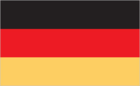
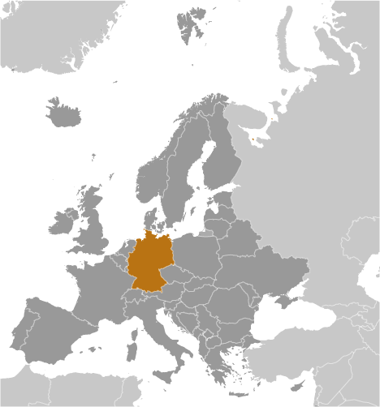
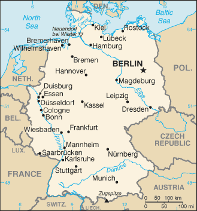

# Germany

## Introduction

**_Background:_**   
As Europe's largest economy and second most populous nation (after Russia), Germany is a key member of the continent's economic, political, and defense organizations. European power struggles immersed Germany in two devastating World Wars in the first half of the 20th century and left the country occupied by the victorious Allied powers of the US, UK, France, and the Soviet Union in 1945. With the advent of the Cold War, two German states were formed in 1949: the western Federal Republic of Germany (FRG) and the eastern German Democratic Republic (GDR). The democratic FRG embedded itself in key Western economic and security organizations, the EC, which became the EU, and NATO, while the communist GDR was on the front line of the Soviet-led Warsaw Pact. The decline of the USSR and the end of the Cold War allowed for German unification in 1990. Since then, Germany has expended considerable funds to bring Eastern productivity and wages up to Western standards. In January 1999, Germany and 10 other EU countries introduced a common European exchange currency, the euro.

## Geography

**_Location:_**   
Central Europe, bordering the Baltic Sea and the North Sea, between the Netherlands and Poland, south of Denmark

**_Geographic coordinates:_**   
51 00 N, 9 00 E

**_Map references:_**   
Europe

**_Area:_**   
**total:** 357,022 sq km   
**land:** 348,672 sq km   
**water:** 8,350 sq km

**_Area - comparative:_**   
three times the size of Pennsylvania; slightly smaller than Montana

**_Land boundaries:_**   
**total:** 3,694 km   
**border countries:** Austria 801 km, Belgium 133 km, Czech Republic 704 km, Denmark 140 km, France 418 km, Luxembourg 128 km, Netherlands 575 km, Poland 447 km, Switzerland 348 km

**_Coastline:_**   
2,389 km

**_Maritime claims:_**   
**territorial sea:** 12 nm   
**exclusive economic zone:** 200 nm   
**continental shelf:** 200 m depth or to the depth of exploitation

**_Climate:_**   
temperate and marine; cool, cloudy, wet winters and summers; occasional warm mountain (foehn) wind

**_Terrain:_**   
lowlands in north, uplands in center, Bavarian Alps in south

**_Elevation extremes:_**   
**lowest point:** Neuendorf bei Wilster -3.54 m   
**highest point:** Zugspitze 2,963 m

**_Natural resources:_**   
coal, lignite, natural gas, iron ore, copper, nickel, uranium, potash, salt, construction materials, timber, arable land

**_Land use:_**   
**arable land:** 33.25%   
**permanent crops:** 0.56%   
**other:** 66.19% (2011)

**_Irrigated land:_**   
5,157 sq km (2006)

**_Total renewable water resources:_**   
154 cu km (2011)

**_Freshwater withdrawal (domestic/industrial/agricultural):_**   
**total:** 32.3 cu km/yr (16%/84%/0%)   
**per capita:** 391.4 cu m/yr (2007)

**_Natural hazards:_**   
flooding

**_Environment - current issues:_**   
emissions from coal-burning utilities and industries contribute to air pollution; acid rain, resulting from sulfur dioxide emissions, is damaging forests; pollution in the Baltic Sea from raw sewage and industrial effluents from rivers in eastern Germany; hazardous waste disposal; government established a mechanism for ending the use of nuclear power over the next 15 years; government working to meet EU commitment to identify nature preservation areas in line with the EU's Flora, Fauna, and Habitat directive

**_Environment - international agreements:_**   
**party to:** Air Pollution, Air Pollution-Nitrogen Oxides, Air Pollution-Persistent Organic Pollutants, Air Pollution-Sulfur 85, Air Pollution-Sulfur 94, Air Pollution-Volatile Organic Compounds, Antarctic-Environmental Protocol, Antarctic-Marine Living Resources, Antarctic Seals, Antarctic Treaty, Biodiversity, Climate Change, Climate Change-Kyoto Protocol, Desertification, Endangered Species, Environmental Modification, Hazardous Wastes, Law of the Sea, Marine Dumping, Ozone Layer Protection, Ship Pollution, Tropical Timber 83, Tropical Timber 94, Wetlands, Whaling   
**signed, but not ratified:** none of the selected agreements

**_Geography - note:_**   
strategic location on North European Plain and along the entrance to the Baltic Sea

## People and Society

**_Nationality:_**   
**noun:** German(s)   
**adjective:** German

**_Ethnic groups:_**   
German 91.5%, Turkish 2.4%, other 6.1% (made up largely of Greek, Italian, Polish, Russian, Serbo-Croatian, Spanish)

**_Languages:_**   
German (official)   
**note:** Lower Sorbian, North Frisian, Sater Frisian, and Upper Sorbian are recognized as regional languages under the European Charter for Regional or Minority Languages

**_Religions:_**   
Protestant 34%, Roman Catholic 34%, Muslim 3.7%, unaffiliated or other 28.3%

**_Population:_**   
80,996,685 (July 2014 est.)

**_Age structure:_**   
**0-14 years:** 13% (male 5,386,525/female 5,107,336)   
**15-24 years:** 10.6% (male 4,367,713/female 4,188,566)   
**25-54 years:** 41.7% (male 17,116,346/female 16,664,995)   
**55-64 years:** 13.6% (male 5,463,221/female 5,574,166)   
**65 years and over:** 20.9% (male 7,468,552/female 9,659,265) (2014 est.)

**_Dependency ratios:_**   
**total dependency ratio:** 52.1 %   
**youth dependency ratio:** 19.8 %   
**elderly dependency ratio:** 32.3 %   
**potential support ratio:** 3.1 (2014 est.)

**_Median age:_**   
**total:** 46.1 years   
**male:** 45.1 years   
**female:** 47.2 years (2014 est.)

**_Population growth rate:_**   
-0.18% (2014 est.)

**_Birth rate:_**   
8.42 births/1,000 population (2014 est.)

**_Death rate:_**   
11.29 deaths/1,000 population (2014 est.)

**_Net migration rate:_**   
1.06 migrant(s)/1,000 population (2014 est.)

**_Urbanization:_**   
**urban population:** 73.9% of total population (2011)   
**rate of urbanization:** -0.03% annual rate of change (2010-15 est.)

**_Major urban areas - population:_**   
BERLIN (capital) 3.462 million; Hamburg 1.796 million; Munich 1.364 million; Cologne 1.006 million (2011)

**_Sex ratio:_**   
**at birth:** 1.06 male(s)/female   
**0-14 years:** 1.06 male(s)/female   
**15-24 years:** 1.04 male(s)/female   
**25-54 years:** 1.03 male(s)/female   
**55-64 years:** 0.97 male(s)/female   
**65 years and over:** 0.76 male(s)/female   
**total population:** 0.97 male(s)/female (2014 est.)

**_Mother's mean age at first birth:_**   
29.2 (2012 est.)

**_Maternal mortality rate:_**   
7 deaths/100,000 live births (2010)

**_Infant mortality rate:_**   
**total:** 3.46 deaths/1,000 live births   
**male:** 3.75 deaths/1,000 live births   
**female:** 3.14 deaths/1,000 live births (2014 est.)

**_Life expectancy at birth:_**   
**total population:** 80.44 years   
**male:** 78.15 years   
**female:** 82.86 years (2014 est.)

**_Total fertility rate:_**   
1.43 children born/woman (2014 est.)

**_Contraceptive prevalence rate:_**   
66.2%   
**note:** percent of women aged 18-49 (2005)

**_Health expenditures:_**   
11.1% of GDP (2011)

**_Physicians density:_**   
3.69 physicians/1,000 population (2010)

**_Hospital bed density:_**   
8.3 beds/1,000 population (2010)

**_Drinking water source:_**   
**improved:** urban: 100% of population; rural: 100% of population; total: 100% of population   
**unimproved:** urban: 0% of population; rural: 0% of population; total: 0% of population (2012 est.)

**_Sanitation facility access:_**   
**improved:** urban: 100% of population; rural: 100% of population; total: 100% of population   
**unimproved:** urban: 0% of population; rural: 0% of population; total: 0% of population (2012 est.)

**_HIV/AIDS - adult prevalence rate:_**   
0.1% (2009 est.)

**_HIV/AIDS - people living with HIV/AIDS:_**   
67,000 (2009 est.)

**_HIV/AIDS - deaths:_**   
fewer than 1,000 (2009 est.)

**_Obesity - adult prevalence rate:_**   
25.1% (2008)

**_Children under the age of 5 years underweight:_**   
1.1% (2006)

**_Education expenditures:_**   
5.1% of GDP (2010)

**_Literacy:_**   
**definition:** age 15 and over can read and write   
**total population:** 99%   
**male:** 99%   
**female:** 99% (2003 est.)

**_School life expectancy (primary to tertiary education):_**   
**total:** 16 years   
**male:** 16 years   
**female:** 16 years (2011)

**_Unemployment, youth ages 15-24:_**   
**total:** 8.1%   
**male:** 8.8%   
**female:** 7.4% (2012)

## Government

**_Country name:_**   
**conventional long form:** Federal Republic of Germany   
**conventional short form:** Germany   
**local long form:** Bundesrepublik Deutschland   
**local short form:** Deutschland   
**former:** German Empire, German Republic, German Reich

**_Government type:_**   
federal republic

**_Capital:_**   
**name:** Berlin   
**geographic coordinates:** 52 31 N, 13 24 E   
**time difference:** UTC+1 (6 hours ahead of Washington, DC, during Standard Time)   
**daylight saving time:** +1hr, begins last Sunday in March; ends last Sunday in October

**_Administrative divisions:_**   
16 states (Laender, singular - Land); Baden-Wuerttemberg, Bayern (Bavaria), Berlin, Brandenburg, Bremen, Hamburg, Hessen (Hesse), Mecklenburg-Vorpommern (Mecklenburg-Western Pomerania), Niedersachsen (Lower Saxony), Nordrhein-Westfalen (North Rhine-Westphalia), Rheinland-Pfalz (Rhineland-Palatinate), Saarland, Sachsen (Saxony), Sachsen-Anhalt (Saxony-Anhalt), Schleswig-Holstein, Thueringen (Thuringia); note - Bayern, Sachsen, and Thueringen refer to themselves as free states (Freistaaten, singular - Freistaat)

**_Independence:_**   
18 January 1871 (establishment of the German Empire); divided into four zones of occupation (UK, US, USSR, and France) in 1945 following World War II; Federal Republic of Germany (FRG or West Germany) proclaimed on 23 May 1949 and included the former UK, US, and French zones; German Democratic Republic (GDR or East Germany) proclaimed on 7 October 1949 and included the former USSR zone; West Germany and East Germany unified on 3 October 1990; all four powers formally relinquished rights on 15 March 1991; notable earlier dates: 10 August 843 (Eastern Francia established from the division of the Carolingian Empire); 2 February 962 (crowning of OTTO I, recognized as the first Holy Roman Emperor)

**_National holiday:_**   
Unity Day, 3 October (1990)

**_Constitution:_**   
previous 1919 (Weimar Constitution); latest drafted 10 to 23 August 1948, approved 12 May 1949, promulgated 23 May 1949, entered into force 24 May 1949; amended many times, last in 2012 (2012)

**_Legal system:_**   
civil law system

**_International law organization participation:_**   
accepts compulsory ICJ jurisdiction with reservations; accepts ICCt jurisdiction

**_Suffrage:_**   
18 years of age; universal

**_Executive branch:_**   
**chief of state:** President Joachim GAUCK (since 23 March 2012)   
**head of government:** Chancellor Angela MERKEL (since 22 November 2005)   
**cabinet:** Cabinet or Bundesminister (Federal Ministers) appointed by the president on the recommendation of the chancellor   
**elections:** president elected for a five-year term (eligible for a second term) by a Federal Convention, including all members of the Federal Parliament (Bundestag) and an equal number of delegates elected by the state parliaments; election last held on 19 February 2012 (next to be held by June 2017); chancellor elected by an absolute majority of the Federal Parliament for a four-year term; Federal Parliament vote for Chancellor last held on 17 December 2013 (next to be held after the September 2017 elections)   
**election results:** Joachim GAUCK elected president; received 991 votes of the Federal Convention against 126 for Beate KLARSFELD and 3 for Olaf ROSE; Angela MERKEL reelected chancellor; vote by Federal Parliament 462 to 150 with four abstentions

**_Legislative branch:_**   
bicameral legislature consists of the Federal Council or Bundesrat (69 votes; state governments sit in the Council; each has three to six votes in proportion to population and is required to vote as a block) and the Federal Parliament or Bundestag (630 seats; members elected by popular vote for a four-year term under a system of personalized proportional representation; a party must win 5% of the national vote or three direct mandates to gain proportional representation and caucus recognition)   
**elections:** Bundestag - last held on 22 September 2013 (next to be held no later than autumn 2017); most all postwar German governments have been coalitions; note - there are no elections for the Bundesrat; composition is determined by the composition of the state-level governments; the composition of the Bundesrat has the potential to change any time one of the 16 states holds an election   
**election results:** Bundestag - percent of vote by party - CDU/CSU 41.5%, SPD 25.7%, Left 8.6%, Greens 8.4%, FDP 4.8%, other 10.9%; seats by party - CDU/CSU 311, SPD 193, Left 64, Greens 63

**_Judicial branch:_**   
**highest court(s):** Federal Court of Justice (court consists of 127 judges including the court president, vice-presidents, presiding judges, and other judges, and organized into 25 Senates subdivided into 12 civil panels, 5 criminal panels, and 8 special panels; Federal Constitutional Court or Bundesverfassungsgericht (consists of 2 Senates each subdivided into 3 chambers, each with a chairman and 8 members)   
**judge selection and term of office:** Federal Court of Justice judges selected by the Judges Election Committee, which consists of the Secretaries of Justice from each of the 16 federated States and 16 members appointed by the Federal Parliament; judges appointed by the president of Germany; judges serve until mandatory retirement at age 65; Federal Constitutional Court judges - one-half elected by the House of Representatives and one-half by the Senate; judges appointed for 12-year terms with mandatory retirement at age 68   
**subordinate courts:** Federal Administrative Court; Federal Finance Court; Federal Labor Court; Federal Social Court; each of the 16 German states or Land has its own constitutional court and a hierarchy of ordinary (civil, criminal, family) and specialized (administrative, finance, labor, social) courts

**_Political parties and leaders:_**   
Alliance '90/Greens [Cem OEZDEMIR and Simone PETER]   
Christian Democratic Union or CDU [Angela MERKEL]   
Christian Social Union or CSU [Horst SEEHOFER]   
Free Democratic Party or FDP [Christian LINDNER]   
Left Party or Die Linke [Katia KIPPING and Bernd RIEXINGER]   
Social Democratic Party or SPD [Sigmar GABRIEL]

**_Political pressure groups and leaders:_**   
business associations and employers' organizations   
trade unions; religious, immigrant, expellee, and veterans groups

**_International organization participation:_**   
ADB (nonregional member), AfDB (nonregional member), Arctic Council (observer), Australia Group, BIS, BSEC (observer), CBSS, CD, CDB, CE, CERN, EAPC, EBRD, ECB, EIB, EITI (implementing country), EMU, ESA, EU, FAO, FATF, G-20, G-5, G-7, G-8, G-10, IADB, IAEA, IBRD, ICAO, ICC (national committees), ICRM, IDA, IEA, IFAD, IFC, IFRCS, IGAD (partners), IHO, ILO, IMF, IMO, IMSO, Interpol, IOC, IOM, IPU, ISO, ITSO, ITU, ITUC (NGOs), MIGA, MINUSMA, NATO, NEA, NSG, OAS (observer), OECD, OPCW, OSCE, Pacific Alliance (observer), Paris Club, PCA, Schengen Convention, SELEC (observer), SICA (observer), UN, UNAMID, UNCTAD, UNESCO, UNHCR, UNIDO, UNIFIL, UNMIL, UNMISS, UNRWA, UNWTO, UPU, WCO, WHO, WIPO, WMO, WTO, ZC

**_Diplomatic representation in the US:_**   
**chief of mission:** Ambassador Hans Peter WITTIG (since 21 May 2014)   
**chancery:** 2300 M Street NW, Washington, DC 20037   
**telephone:** [1] (202) 298-4000   
**FAX:** [1] (202) 298-4261   
**consulate(s) general:** Atlanta, Boston, Chicago, Houston, Los Angeles, Miami, New York, San Francisco

**_Diplomatic representation from the US:_**   
**chief of mission:** Ambassador John B. EMERSON (since 7 August 2013)   
**embassy:** Pariser Platz 2, 10117 Berlin   
**mailing address:** Unit 5090, Box 1000, DPO AE09265   
**telephone:** [49] (30) 48305-0   
**FAX:** [49] (30) 8305-1215   
**consulate(s) general:** Duesseldorf, Frankfurt am Main, Hamburg, Leipzig, Munich

**_Flag description:_**   
three equal horizontal bands of black (top), red, and gold; these colors have played an important role in German history and can be traced back to the medieval banner of the Holy Roman Emperor - a black eagle with red claws and beak on a gold field

**_National symbol(s):_**   
golden eagle

**_National anthem:_**   
**name:** "Das Lied der Deutschen" (Song of the Germans)   
**lyrics/music:** August Heinrich HOFFMANN VON FALLERSLEBEN/Franz Joseph HAYDN   
**note:** adopted 1922; the anthem, also known as "Deutschlandlied" (Song of Germany), was originally adopted for its connection to the March 1848 liberal revolution; following appropriation by the Nazis of the first verse, specifically the phrase, "Deutschland, Deutschland ueber alles" (Germany, Germany above all) to promote nationalism, it was banned after 1945; in 1952, its third verse was adopted by West Germany as its national anthem; in 1990, it became the national anthem for the reunited Germany

## Economy

**_Economy - overview:_**   
The German economy - the fifth largest economy in the world in PPP terms and Europe's largest - is a leading exporter of machinery, vehicles, chemicals, and household equipment and benefits from a highly skilled labor force. Like its Western European neighbors, Germany faces significant demographic challenges to sustained long-term growth. Low fertility rates and declining net immigration are increasing pressure on the country's social welfare system and necessitate structural reforms. Reforms launched by the government of Chancellor Gerhard SCHROEDER (1998-2005), deemed necessary to address chronically high unemployment and low average growth, has contributed to strong growth and falling unemployment. These advances, as well as a government subsidized, reduced working hour scheme, help explain the relatively modest increase in unemployment during the 2008-09 recession - the deepest since World War II - and its decrease to 5.3% in 2013. The new German government introduced a minimum wage of $11 per hour to take effect in 2015. Stimulus and stabilization efforts initiated in 2008 and 2009 and tax cuts introduced in Chancellor Angela MERKEL's second term increased Germany's total budget deficit - including federal, state, and municipal - to 4.1% in 2010, but slower spending and higher tax revenues reduced the deficit to 0.8% in 2011 and in 2012 Germany reached a budget surplus of 0.1%. A constitutional amendment approved in 2009 limits the federal government to structural deficits of no more than 0.35% of GDP per annum as of 2016 though the target was already reached in 2012. Following the March 2011 Fukushima nuclear disaster, Chancellor Angela MERKEL announced in May 2011 that eight of the country's 17 nuclear reactors would be shut down immediately and the remaining plants would close by 2022. Germany hopes to replace nuclear power with renewable energy. Before the shutdown of the eight reactors, Germany relied on nuclear power for 23% of its electricity generating capacity and 46% of its base-load electricity production.

**_GDP (purchasing power parity):_**   
$3.227 trillion (2013 est.)   
$3.211 trillion (2012 est.)   
$3.182 trillion (2011 est.)   
**note:** data are in 2013 US dollars

**_GDP (official exchange rate):_**   
$3.593 trillion (2013 est.)

**_GDP - real growth rate:_**   
0.5% (2013 est.)   
0.9% (2012 est.)   
3.4% (2011 est.)

**_GDP - per capita (PPP):_**   
$39,500 (2013 est.)   
$39,200 (2012 est.)   
$38,900 (2011 est.)   
**note:** data are in 2013 US dollars

**_Gross national saving:_**   
24.7% of GDP (2013 est.)   
24.3% of GDP (2012 est.)   
24.4% of GDP (2011 est.)

**_GDP - composition, by end use:_**   
**household consumption:** 57.6%   
**government consumption:** 19.4%   
**investment in fixed capital:** 17.5%   
**investment in inventories:** 0.1%   
**exports of goods and services:** 49.5%   
**imports of goods and services:** -44.1%; (2013 est.)

**_GDP - composition, by sector of origin:_**   
**agriculture:** 0.8%   
**industry:** 30.1%   
**services:** 69%; (2013 est.)

**_Agriculture - products:_**   
potatoes, wheat, barley, sugar beets, fruit, cabbages; milk products; cattle, pigs, poultry

**_Industries:_**   
among the world's largest and most technologically advanced producers of iron, steel, coal, cement, chemicals, machinery, vehicles, machine tools, electronics, automobiles, food and beverages, shipbuilding, textiles

**_Industrial production growth rate:_**   
-0.3% (2013 est.)

**_Labor force:_**   
44.2 million (2013 est.)

**_Labor force - by occupation:_**   
**agriculture:** 1.6%   
**industry:** 24.6%   
**services:** 73.8%; (2011)

**_Unemployment rate:_**   
5.3% (2013 est.)   
5.5% (2012 est.)

**_Population below poverty line:_**   
15.5% (2010 est.)

**_Household income or consumption by percentage share:_**   
**lowest 10%:** 3.6%   
**highest 10%:** 24% (2000)

**_Distribution of family income - Gini index:_**   
27 (2006)   
30 (1994)

**_Budget:_**   
**revenues:** $1.626 trillion   
**expenditures:** $1.624 trillion (2013 est.)

**_Taxes and other revenues:_**   
45.3% of GDP (2013 est.)

**_Budget surplus (+) or deficit (-):_**   
0.1% of GDP (2013 est.)

**_Public debt:_**   
79.9% of GDP (2013 est.)   
81% of GDP (2012 est.)   
**note:** general government gross debt is defined in the Maastricht Treaty as consolidated general government gross debt at nominal value, outstanding at the end of the year in the following categories of government liabilities (as defined in ESA95): currency and deposits (AF.2), securities other than shares excluding financial derivatives (AF.3, excluding AF.34), and loans (AF.4); the general government sector comprises the sub-sectors of central government, state government, local government and social security funds; the series are presented as a percentage of GDP and in millions of euro; GDP used as a denominator is the gross domestic product at current market prices; data expressed in national currency are converted into euro using end-of-year exchange rates provided by the European Central Bank

**_Fiscal year:_**   
calendar year

**_Inflation rate (consumer prices):_**   
1.6% (2013 est.)   
2.1% (2012 est.)

**_Central bank discount rate:_**   
0.75% (31 December 2013)   
1.5% (31 December 2010)   
**note:** this is the European Central Bank's rate on the marginal lending facility, which offers overnight credit to banks in the euro area

**_Commercial bank prime lending rate:_**   
2.8% (31 December 2013 est.)   
3.07% (31 December 2012 est.)

**_Stock of narrow money:_**   
$2.158 trillion (31 December 2013 est.)   
$2.025 trillion (31 December 2012 est.)   
**note:** see entry for the European Union for money supply in the euro area; the European Central Bank (ECB) controls monetary policy for the 17 members of the Economic and Monetary Union (EMU); individual members of the EMU do not control the quantity of money circulating within their own borders

**_Stock of broad money:_**   
$4.551 trillion (31 December 2013 est.)   
$4.342 trillion (31 December 2012 est.)

**_Stock of domestic credit:_**   
$4.457 trillion (31 December 2013 est.)   
$4.277 trillion (31 December 2012 est.)

**_Market value of publicly traded shares:_**   
$1.486 trillion (31 December 2012 est.)   
$1.184 trillion (31 December 2011)   
$1.43 trillion (31 December 2010 est.)

**_Current account balance:_**   
$257.1 billion (2013 est.)   
$238.5 billion (2012 est.)

**_Exports:_**   
$1.493 trillion (2013 est.)   
$1.46 trillion (2012 est.)

**_Exports - commodities:_**   
motor vehicles, machinery, chemicals, computer and electronic products, electrical equipment, pharmaceuticals, metals, transport equipment, foodstuffs, textiles, rubber and plastic products

**_Exports - partners:_**   
France 9.21%, United States 7.85%, United Kingdom 6.53%, Netherlands 6.33%, China 5.91%, Italy 5.05%, Austria 5.03%, Switzerland 4.3%, Belgium 4.04% (2013 est.)

**_Imports:_**   
$1.233 trillion (2013 est.)   
$1.222 trillion (2012 est.)

**_Imports - commodities:_**   
machinery, data processing equipment, vehicles, chemicals, oil and gas, metals, electric equipment, pharmaceuticals, foodstuffs, agricultural products

**_Imports - partners:_**   
Netherlands 12.88%, France 7.61%, China 6.25%, Belgium 6.13%, Italy 5.31%, United Kingdom 4.61%, Austria 4.33%, United States 4.19%, Switzerland 4.3%, Austria 4.1%, Poland 4% (2013 est.)

**_Reserves of foreign exchange and gold:_**   
$248.9 billion (31 December 2012 est.)   
$238.9 billion (31 December 2011 est.)

**_Debt - external:_**   
$5.717 trillion (31 December 2012 est.)   
$5.338 trillion (31 December 2011)

**_Stock of direct foreign investment - at home:_**   
$1.335 trillion (31 December 2013 est.)   
$1.307 trillion (31 December 2012 est.)

**_Stock of direct foreign investment - abroad:_**   
$1.871 trillion (31 December 2013 est.)   
$1.788 trillion (31 December 2012 est.)

**_Exchange rates:_**   
euros (EUR) per US dollar -   
0.7634 (2013 est.)   
0.7752 (2012 est.)   
0.755 (2010 est.)   
0.7198 (2009 est.)   
0.6827 (2008 est.)

## Energy

**_Electricity - production:_**   
526.6 billion kWh (2012 est.)

**_Electricity - consumption:_**   
582.5 billion kWh (2012 est.)

**_Electricity - exports:_**   
66.81 billion kWh (2012 est.)

**_Electricity - imports:_**   
46.27 billion kWh (2012 est.)

**_Electricity - installed generating capacity:_**   
178.4 million kW (2012 est.)

**_Electricity - from fossil fuels:_**   
51% of total installed capacity (2012 est.)

**_Electricity - from nuclear fuels:_**   
7% of total installed capacity (2012 est.)

**_Electricity - from hydroelectric plants:_**   
6% of total installed capacity (2012 est.)

**_Electricity - from other renewable sources:_**   
36% of total installed capacity (2012 est.)

**_Crude oil - production:_**   
169,500 bbl/day (2012 est.)

**_Crude oil - exports:_**   
14,260 bbl/day (2010 est.)

**_Crude oil - imports:_**   
1.876 million bbl/day (2010 est.)

**_Crude oil - proved reserves:_**   
254.2 million bbl (1 January 2013 est.)

**_Refined petroleum products - production:_**   
2.198 million bbl/day (2010 est.)

**_Refined petroleum products - consumption:_**   
2.4 million bbl/day (2011 est.)

**_Refined petroleum products - exports:_**   
376,600 bbl/day (2010 est.)

**_Refined petroleum products - imports:_**   
758,100 bbl/day (2010 est.)

**_Natural gas - production:_**   
9 billion cu m (2012 est.)

**_Natural gas - consumption:_**   
75.2 billion cu m (2012 est.)

**_Natural gas - exports:_**   
18.17 billion cu m (2012 est.)

**_Natural gas - imports:_**   
87.96 billion cu m (2012 est.)

**_Natural gas - proved reserves:_**   
125 billion cu m (1 January 2013 est.)

**_Carbon dioxide emissions from consumption of energy:_**   
814 million Mt (2012 est.)

## Communications

**_Telephones - main lines in use:_**   
50.7 million (2012)

**_Telephones - mobile cellular:_**   
107.7 million (2012)

**_Telephone system:_**   
**general assessment:** Germany has one of the world's most technologically advanced telecommunications systems; as a result of intensive capital expenditures since reunification, the formerly backward system of the eastern part of the country, dating back to World War II, has been modernized and integrated with that of the western part   
**domestic:** Germany is served by an extensive system of automatic telephone exchanges connected by modern networks of fiber-optic cable, coaxial cable, microwave radio relay, and a domestic satellite system; cellular telephone service is widely available, expanding rapidly, and includes roaming service to many foreign countries   
**international:** country code - 49; Germany's international service is excellent worldwide, consisting of extensive land and undersea cable facilities as well as earth stations in the Inmarsat, Intelsat, Eutelsat, and Intersputnik satellite systems (2011)

**_Broadcast media:_**   
a mixture of publicly operated and privately owned TV and radio stations; national and regional public broadcasters compete with nearly 400 privately owned national and regional TV stations; more than 90% of households have cable or satellite TV; hundreds of radio stations including multiple national radio networks, regional radio networks, and a large number of local radio stations (2008)

**_Internet country code:_**   
.de

**_Internet hosts:_**   
20.043 million (2012)

**_Internet users:_**   
65.125 million (2009)

## Transportation

**_Airports:_**   
539 (2013)

**_Airports - with paved runways:_**   
**total:** 318   
**over 3,047 m:** 14   
**2,438 to 3,047 m:** 49   
**1,524 to 2,437 m:** 60   
**914 to 1,523 m:** 70   
**under 914 m:** 125 (2013)

**_Airports - with unpaved runways:_**   
**total:** 221   
**1,524 to 2,437 m:** 1   
**914 to 1,523 m:** 35   
**under 914 m:** 185 (2013)

**_Heliports:_**   
23 (2013)

**_Pipelines:_**   
condensate 37 km; gas 26,985 km; oil 2,826 km; refined products 4,479 km; water 8 km (2013)

**_Railways:_**   
**total:** 41,981 km   
**standard gauge:** 41,722 km 1.435-m gauge (20,053 km electrified)   
**narrow gauge:** 220 km 1.000-m gauge (75 km electrified); 39 km 0.750-m gauge (24 km electrified) (2008)

**_Roadways:_**   
**total:** 645,000 km   
**paved:** 645,000 km (includes 12,800 km of expressways)   
**note:** includes local roads (2010)

**_Waterways:_**   
7,467 km (Rhine River carries most goods; Main-Danube Canal links North Sea and Black Sea) (2012)

**_Merchant marine:_**   
**total:** 427   
**by type:** barge carrier 2, bulk carrier 6, cargo 51, carrier 1, chemical tanker 15, container 298, liquefied gas 6, passenger 4, passenger/cargo 24, petroleum tanker 10, refrigerated cargo 3, roll on/roll off 6, vehicle carrier 1   
**foreign-owned:** 6 (Finland 3, Netherlands 1, Switzerland 2)   
**registered in other countries:** 3,420 (Antigua and Barbuda 1094, Australia 2, Bahamas 30, Bermuda 14, Brazil 6, Bulgaria 12, Burma 1, Cayman Islands 3, Cook Islands 1, Curacao 25, Cyprus 192, Denmark 9, Dominica 5, Estonia 1, France 1, Gibraltar 123, Hong Kong 10, Isle of Man 56, Jamaica 10, Liberia 1185, Luxembourg 9, Malta 135, Marshall Islands 248, Morocco 1, Netherlands 86, NZ 2, Panama 24, Papua New Guinea 1, Philippines 2, Portugal 14, Saint Vincent and the Grenadines 3, Singapore 32, Slovakia 3, Spain 4, Sri Lanka 8, Sweden 3, UK 59, US 5, Venezuela 1) (2010)

**_Ports and terminals:_**   
**major seaport(s):** Baltic Sea - Rostock; North Sea - Wilhelmshaven   
**river port(s):** Bremen (Weser); Bremerhaven (Geeste); Duisburg, Karlsruhe, Neuss-Dusseldorf (Rhine); Brunsbuttel, Hamburg (Elbe); Lubeck (Wakenitz)   
**oil/gas terminal(s):** Brunsbuttel Canal terminals   
**container port(s):** Bremen/Bremerhaven (5,915,487), Hamburg (9,014,165)(2011)

## Military

**_Military branches:_**   
Federal Armed Forces (Bundeswehr): Army (Heer); Navy (Deutsche Marine, includes naval air arm); Air Force (Luftwaffe); Joint Support Services (Streitkraeftebasis, SKB); Central Medical Service (Zentraler Sanitaetsdienst, ZSanDstBw) (2013)

**_Military service age and obligation:_**   
17-23 years of age for male and female voluntary military service; conscription ended 1 July 2011; service obligation 8-23 months or 12 years; women have been eligible for voluntary service in all military branches and positions since 2001 (2013)

**_Manpower available for military service:_**   
**males age 16-49:** 18,529,299   
**females age 16-49:** 17,888,543 (2010 est.)

**_Manpower fit for military service:_**   
**males age 16-49:** 15,027,886   
**females age 16-49:** 14,510,527 (2010 est.)

**_Manpower reaching militarily significant age annually:_**   
**male:** 405,438   
**female:** 384,930 (2010 est.)

**_Military expenditures:_**   
1.35% of GDP (2012)   
1.34% of GDP (2011)   
1.35% of GDP (2010)

## Transnational Issues

**_Disputes - international:_**   
none

**_Refugees and internally displaced persons:_**   
**refugees (country of origin):** 40,230 (Iraq); 24,449 (Turkey); 24,203 (Afghanistan); 21,253 (Syria); 17,150 (Iran); 8,410 (Serbia) (2013)   
**stateless persons:** 5,683 (2012)

**_Illicit drugs:_**   
source of precursor chemicals for South American cocaine processors; transshipment point for and consumer of Southwest Asian heroin, Latin American cocaine, and European-produced synthetic drugs; major financial center

............................................................   
_Page last updated on June 22, 2014_
