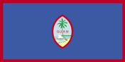
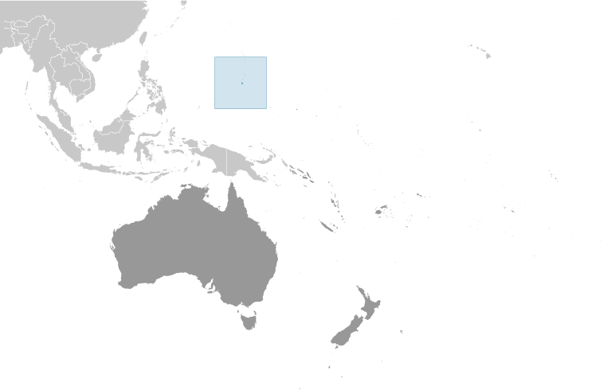
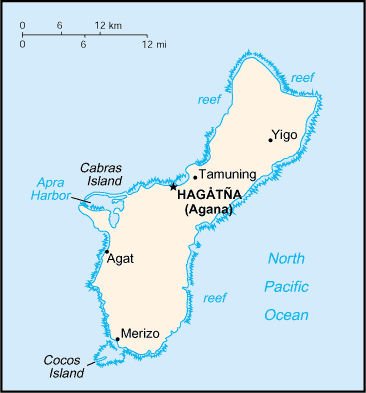

# Guam

_territory of the US_

## Introduction

**_Background:_**   
Spain ceded Guam to the US in 1898. Captured by the Japanese in 1941, it was retaken by the US three years later. The military installations on the island are some of the most strategically important US bases in the Pacific.

## Geography

**_Location:_**   
Oceania, island in the North Pacific Ocean, about three-quarters of the way from Hawaii to the Philippines

**_Geographic coordinates:_**   
13 28 N, 144 47 E

**_Map references:_**   
Oceania

**_Area:_**   
**total:** 544 sq km   
**land:** 544 sq km   
**water:** 0 sq km

**_Area - comparative:_**   
three times the size of Washington, DC

**_Land boundaries:_**   
0 km

**_Coastline:_**   
125.5 km

**_Maritime claims:_**   
**territorial sea:** 12 nm   
**exclusive economic zone:** 200 nm

**_Climate:_**   
tropical marine; generally warm and humid, moderated by northeast trade winds; dry season (January to June), rainy season (July to December); little seasonal temperature variation

**_Terrain:_**   
volcanic origin, surrounded by coral reefs; relatively flat coralline limestone plateau (source of most fresh water), with steep coastal cliffs and narrow coastal plains in north, low hills in center, mountains in south

**_Elevation extremes:_**   
**lowest point:** Pacific Ocean 0 m   
**highest point:** Mount Lamlam 406 m

**_Natural resources:_**   
aquatic wildlife (supporting tourism), fishing (largely undeveloped)

**_Land use:_**   
**arable land:** 1.85%   
**permanent crops:** 16.67%   
**other:** 81.48% (2011)

**_Irrigated land:_**   
2 sq km (2011)

**_Natural hazards:_**   
frequent squalls during rainy season; relatively rare but potentially destructive typhoons (June to December)

**_Environment - current issues:_**   
extirpation of native bird population by the rapid proliferation of the brown tree snake, an exotic, invasive species

**_Geography - note:_**   
largest and southernmost island in the Mariana Islands archipelago; strategic location in western North Pacific Ocean

## People and Society

**_Nationality:_**   
**noun:** Guamanian(s) (US citizens)   
**adjective:** Guamanian

**_Ethnic groups:_**   
Chamorro 37.3%, Filipino 26.3%, white 7.1%, Chuukese 7%, Korean 2.2%, other Pacific Islander 2%, other Asian 2%, Chinese 1.6%, Palauan 1.6%, Japanese 1.5%, Pohnpeian 1.4%, mixed 9.4%, other 0.6% (2010 est.)

**_Languages:_**   
English 43.6%, Filipino 21.2%, Chamorro 17.8%, other Pacific island languages 10%, Asian languages 6.3%, other 1.1% (2010 est.)

**_Religions:_**   
Roman Catholic 85%, other 15% (1999 est.)

**_Population:_**   
161,001 (July 2014 est.)

**_Age structure:_**   
**0-14 years:** 26% (male 21,520/female 20,279)   
**15-24 years:** 16.9% (male 14,109/female 13,164)   
**25-54 years:** 39.3% (male 32,285/female 31,058)   
**55-64 years:** 9.3% (male 7,483/female 7,411)   
**65 years and over:** 8.2% (male 6,228/female 7,464) (2014 est.)

**_Dependency ratios:_**   
**total dependency ratio:** 52.1 %   
**youth dependency ratio:** 39.3 %   
**elderly dependency ratio:** 12.8 %   
**potential support ratio:** 7.8 (2014 est.)

**_Median age:_**   
**total:** 29.9 years   
**male:** 29.4 years   
**female:** 30.4 years (2014 est.)

**_Population growth rate:_**   
0.44% (2014 est.)

**_Birth rate:_**   
17.01 births/1,000 population (2014 est.)

**_Death rate:_**   
5.04 deaths/1,000 population (2014 est.)

**_Net migration rate:_**   
-7.61 migrant(s)/1,000 population (2014 est.)

**_Urbanization:_**   
**urban population:** 93.2% of total population (2011)   
**rate of urbanization:** 1.23% annual rate of change (2010-15 est.)

**_Major urban areas - population:_**   
HAGATNA (capital) 169,000 (2011)

**_Sex ratio:_**   
**at birth:** 1.06 male(s)/female   
**0-14 years:** 1.06 male(s)/female   
**15-24 years:** 1.07 male(s)/female   
**25-54 years:** 1.04 male(s)/female   
**55-64 years:** 1.03 male(s)/female   
**65 years and over:** 0.84 male(s)/female   
**total population:** 1.03 male(s)/female (2014 est.)

**_Infant mortality rate:_**   
**total:** 5.51 deaths/1,000 live births   
**male:** 5.91 deaths/1,000 live births   
**female:** 5.08 deaths/1,000 live births (2014 est.)

**_Life expectancy at birth:_**   
**total population:** 78.82 years   
**male:** 75.78 years   
**female:** 82.05 years (2014 est.)

**_Total fertility rate:_**   
2.38 children born/woman (2014 est.)

**_Contraceptive prevalence rate:_**   
66.6%   
**note:** percent of women aged 18-44 (2002)

**_Drinking water source:_**   
**improved:** urban: 99.5% of population; rural: 99.5% of population; total: 99.5% of population   
**unimproved:** urban: 0.5% of population; rural: 0.5% of population; total: 0.5% of population (2012 est.)

**_Sanitation facility access:_**   
**improved:** urban: 89.8% of population; rural: 89.8% of population; total: 89.8% of population   
**unimproved:** urban: 10.2% of population; rural: 10.2% of population; total: 10.2% of population (2012 est.)

**_HIV/AIDS - adult prevalence rate:_**   
NA

**_HIV/AIDS - people living with HIV/AIDS:_**   
NA

**_HIV/AIDS - deaths:_**   
NA

**_Literacy:_**   
**definition:** age 15 and over can read and write   
**total population:** 99%   
**male:** 99%   
**female:** 99% (1990 est.)

**_Unemployment, youth ages 15-24:_**   
**total:** 29.4%   
**male:** 29.7%   
**female:** 28.9% (2011)

## Government

**_Country name:_**   
**conventional long form:** Territory of Guam   
**conventional short form:** Guam   
**local long form:** Guahan   
**local short form:** Guahan

**_Dependency status:_**   
organized, unincorporated territory of the US with policy relations between Guam and the US under the jurisdiction of the Office of Insular Affairs, US Department of the Interior

**_Government type:_**   
NA

**_Capital:_**   
**name:** Hagatna (Agana)   
**geographic coordinates:** 13 28 N, 144 44 E   
**time difference:** UTC+10 (15 hours ahead of Washington, DC, during Standard Time)

**_Administrative divisions:_**   
none (territory of the US)

**_Independence:_**   
none (territory of the US)

**_National holiday:_**   
Discovery Day, first Monday in March (1521)

**_Constitution:_**   
effective 1 July 1950; amended many times, last in 2012 (2013)

**_Legal system:_**   
common law modeled on US system; US federal laws apply

**_Suffrage:_**   
18 years of age; universal; note - Guamanians are US citizens but do not vote in US presidential elections

**_Executive branch:_**   
**chief of state:** President Barack H. OBAMA (since 20 January 2009); Vice President Joseph R. BIDEN (since 20 January 2009)   
**head of government:** Governor Eddie CALVO (since 3 January 2011); Lieutenant Governor Ray TENORIO (since 3 January 2011)   
**cabinet:** heads of executive departments; appointed by the governor with the consent of the Guam legislature   
**elections:** under the US Constitution, residents of unincorporated territories, such as Guam, do not vote in elections for US president and vice president; however, they may vote in Democratic and Republican presidential primary elections; governor and lieutenant governor elected on the same ticket by popular vote for a four-year term (can serve two consecutive terms, then must wait a full term before running again); election last held on 2 November 2010 (next to be held in November 2014)   
**election results:** Eddie CALVO elected governor with 50.6% percent of vote against 49.4% for Carl GUTIERREZ; Ray TENORIO elected lieutenant governor

**_Legislative branch:_**   
unicameral Legislature (15 seats; members elected by popular vote to serve two-year terms)   
**elections:** last held on 6 November 2012 (next to be held in November 2014)   
**election results:** percent of vote by party - NA; seats by party - Democratic Party 9, Republican Party 6   
**note:** Guam elects one nonvoting delegate to the US House of Representatives; election last held on 6 November 2012 (next to be held in November 2014); results - percent of vote by party - NA; seats by party - Democratic Party 1

**_Judicial branch:_**   
**highest court(s):** Supreme Court of Guam (consists of 3 justices); note - appeals beyond the Supreme Court of Guam are heard by the US Supreme Court   
**judge selection and term of office:** justices appointed by the governor and confirmed by the Guam legislature; justices appointed for life subject to retention election every 10 years   
**subordinate courts:** Superior Court of Guam - includes several divisions; US Federal District Court for the District of Guam (a US territorial court; appeals beyond this court are heard before the US Court of Appeals for the Ninth Circuit)

**_Political parties and leaders:_**   
Democratic Party [Carlo BRANCH]   
Republican Party [Mike BENITO]

**_Political pressure groups and leaders:_**   
Guam Commission on Decolonization   
Guam Federation of Teachers' Union   
Guam Waterworks Authority Workers   
We Are Guahan

**_International organization participation:_**   
IOC, PIF (observer), SPC, UPU

**_Diplomatic representation in the US:_**   
none (territory of the US)

**_Diplomatic representation from the US:_**   
none (territory of the US)

**_Flag description:_**   
territorial flag is dark blue with a narrow red border on all four sides; centered is a red-bordered, pointed, vertical ellipse containing a beach scene, a proa or outrigger canoe with sail, and a palm tree with the word GUAM superimposed in bold red letters; the proa is sailing in Agana Bay with the promontory of Punta Dos Amantes, near the capital, in the background; blue represents the sea and red the blood shed in the struggle against oppression   
**note:** the US flag is the national flag

**_National symbol(s):_**   
coconut tree

**_National anthem:_**   
**name:** "Fanohge Chamoru" (Stand Ye Guamanians)   
**lyrics/music:** Ramon Manalisay SABLAN [English], Lagrimas UNTALAN [Chamoru]/Ramon Manalisay SABLAN   
**note:** adopted 1919; the local anthem is also known as "Guam Hymn"; as a territory of the United States, "The Star-Spangled Banner," which generally follows the playing of "Stand Ye Guamanians," is official (see United States)

## Economy

**_Economy - overview:_**   
The economy depends largely on US national defense spending, tourism, other services. Total US grants, wages and salaries, and procurement outlays amounted to approximately $1.6 billion in 2010. Over the past 30 years, tourism has grown to become the largest income source following national defense.

**_GDP (purchasing power parity):_**   
$4.6 billion (2010 est.)

**_GDP (official exchange rate):_**   
$4.6 billion (2010 est.)

**_GDP - real growth rate:_**   
1.3% (2002-10 average est.)

**_GDP - per capita (PPP):_**   
$28,700 (2010 est.)

**_GDP - composition, by sector of origin:_**   
**agriculture:** NA%   
**industry:** NA%   
**services:** NA%

**_Agriculture - products:_**   
fruits, copra, vegetables; eggs, pork, poultry, beef

**_Industries:_**   
national defense, tourism, construction, transshipment services, concrete products, printing and publishing, food processing, textiles

**_Industrial production growth rate:_**   
NA%

**_Labor force:_**   
69,390   
**note:** this number is for the civilian labor force only (2010 est.)

**_Labor force - by occupation:_**   
**agriculture:** 0.3%   
**industry:** (2004 est.)   
**services:** NA% (2004 est.)

**_Unemployment rate:_**   
8.2% (2010 est.)

**_Population below poverty line:_**   
23% (2001 est.)

**_Household income or consumption by percentage share:_**   
**lowest 10%:** NA%   
**highest 10%:** NA%

**_Budget:_**   
**revenues:** $942.6 million   
**expenditures:** $1.082 billion (FY10/11 est.)

**_Taxes and other revenues:_**   
20.5% of GDP (FY10/11 est.)

**_Budget surplus (+) or deficit (-):_**   
-3% of GDP (FY10/11 est.)

**_Fiscal year:_**   
1 October - 30 September

**_Inflation rate (consumer prices):_**   
4% (2011 est.)

**_Exports:_**   
$44 million (2011 est.)

**_Exports - commodities:_**   
transshipments of refined petroleum products, construction materials, fish, food and beverage products

**_Imports:_**   
$901 million (2011 est.)

**_Imports - commodities:_**   
petroleum and petroleum products, food, manufactured goods

**_Debt - external:_**   
$NA

**_Exchange rates:_**   
the US dollar is used

## Energy

**_Electricity - production:_**   
1.734 billion kWh (2011 est.)

**_Electricity - consumption:_**   
1.635 billion kWh (2010 est.)

**_Electricity - exports:_**   
0 kWh (2012 est.)

**_Electricity - imports:_**   
0 kWh (2012 est.)

**_Electricity - installed generating capacity:_**   
552,000 kW (2010 est.)

**_Electricity - from fossil fuels:_**   
100% of total installed capacity (2010 est.)

**_Electricity - from nuclear fuels:_**   
0% of total installed capacity (2010 est.)

**_Electricity - from hydroelectric plants:_**   
0% of total installed capacity (2010 est.)

**_Electricity - from other renewable sources:_**   
0% of total installed capacity (2010 est.)

**_Crude oil - production:_**   
0 bbl/day (2012 est.)

**_Crude oil - exports:_**   
0 bbl/day (2010 est.)

**_Crude oil - imports:_**   
0 bbl/day (2010 est.)

**_Crude oil - proved reserves:_**   
0 bbl (1 January 2013 est.)

**_Refined petroleum products - production:_**   
0 bbl/day (2010 est.)

**_Refined petroleum products - consumption:_**   
14,490 bbl/day (2011 est.)

**_Refined petroleum products - exports:_**   
0 bbl/day (2010 est.)

**_Refined petroleum products - imports:_**   
6,579 bbl/day (2010 est.)

**_Natural gas - production:_**   
0 cu m (2011 est.)

**_Natural gas - consumption:_**   
0 cu m (2010 est.)

**_Natural gas - exports:_**   
0 cu m (2011 est.)

**_Natural gas - imports:_**   
0 cu m (2011 est.)

**_Natural gas - proved reserves:_**   
0 cu m (1 January 2013 est.)

**_Carbon dioxide emissions from consumption of energy:_**   
1.103 million Mt (2011 est.)

## Communications

**_Telephones - main lines in use:_**   
67,000 (2012)

**_Telephones - mobile cellular:_**   
98,000 (2004)

**_Telephone system:_**   
**general assessment:** modern system, integrated with US facilities for direct dialing, including free use of 800 numbers   
**domestic:** digital system, including mobile-cellular service and local access to the Internet   
**international:** country code - 1-671; major landing point for submarine cables between Asia and the US (Guam is a transpacific communications hub for major carriers linking the US and Asia); satellite earth stations - 2 Intelsat (Pacific Ocean) (2011)

**_Broadcast media:_**   
about a dozen TV channels, including digital channels; multi-channel cable TV services are available; roughly 20 radio stations (2009)

**_Internet country code:_**   
.gu

**_Internet hosts:_**   
23 (2012)

**_Internet users:_**   
90,000 (2009)

## Transportation

**_Airports:_**   
5 (2013)

**_Airports - with paved runways:_**   
**total:** 4   
**over 3,047 m:** 2   
**2,438 to 3,047 m:** 1   
**914 to 1,523 m:** 1 (2013)

**_Airports - with unpaved runways:_**   
**total:** 1   
**under 914 m:** 1 (2013)

**_Roadways:_**   
**total:** 1,045 km (2008)

**_Ports and terminals:_**   
**major seaport(s):** Apra Harbor

## Military

**_Manpower fit for military service:_**   
**males age 16-49:** 38,358   
**females age 16-49:** 36,869 (2010 est.)

**_Manpower reaching militarily significant age annually:_**   
**male:** 1,701   
**female:** 1,608 (2010 est.)

**_Military - note:_**   
defense is the responsibility of the US

## Transnational Issues

**_Disputes - international:_**   
none

............................................................   
_Page last updated on June 20, 2014_
