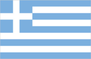
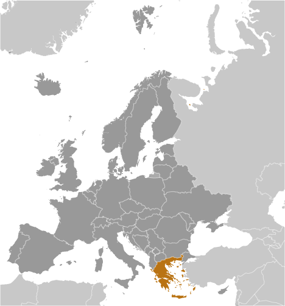
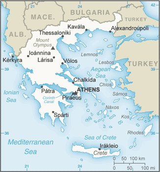

# Greece

## Introduction

**_Background:_**   
Greece achieved independence from the Ottoman Empire in 1830. During the second half of the 19th century and the first half of the 20th century, it gradually added neighboring islands and territories, most with Greek-speaking populations. In World War II, Greece was first invaded by Italy (1940) and subsequently occupied by Germany (1941-44); fighting endured in a protracted civil war between supporters of the king and other anti-communist and communist rebels. Following the latter's defeat in 1949, Greece joined NATO in 1952. In 1967, a group of military officers seized power, establishing a military dictatorship that suspended many political liberties and forced the king to flee the country. In 1974, democratic elections and a referendum created a parliamentary republic and abolished the monarchy. In 1981, Greece joined the EC (now the EU); it became the 12th member of the European Economic and Monetary Union in 2001. In 2010, the prospect of a Greek default on its euro-denominated debt created severe strains within the EMU and raised the question of whether a member country might voluntarily leave the common currency or be removed.

## Geography

**_Location:_**   
Southern Europe, bordering the Aegean Sea, Ionian Sea, and the Mediterranean Sea, between Albania and Turkey

**_Geographic coordinates:_**   
39 00 N, 22 00 E

**_Map references:_**   
Europe

**_Area:_**   
**total:** 131,957 sq km   
**land:** 130,647 sq km   
**water:** 1,310 sq km

**_Area - comparative:_**   
slightly smaller than Alabama

**_Land boundaries:_**   
**total:** 1,110 km   
**border countries:** Albania 212 km, Bulgaria 472 km, Macedonia 234 km, Turkey 192 km

**_Coastline:_**   
13,676 km

**_Maritime claims:_**   
**territorial sea:** 12 nm   
**continental shelf:** 200 m depth or to the depth of exploitation

**_Climate:_**   
temperate; mild, wet winters; hot, dry summers

**_Terrain:_**   
mostly mountains with ranges extending into the sea as peninsulas or chains of islands

**_Elevation extremes:_**   
**lowest point:** Mediterranean Sea 0 m   
**highest point:** Mount Olympus 2,917 m

**_Natural resources:_**   
lignite, petroleum, iron ore, bauxite, lead, zinc, nickel, magnesite, marble, salt, hydropower potential

**_Land use:_**   
**arable land:** 18.95%   
**permanent crops:** 8.73%   
**other:** 72.32% (2011)

**_Irrigated land:_**   
15,550 sq km (2007)

**_Total renewable water resources:_**   
74.25 cu km (2011)

**_Freshwater withdrawal (domestic/industrial/agricultural):_**   
**total:** 9.47 cu km/yr (9%/2%/89%)   
**per capita:** 841.4 cu m/yr (2007)

**_Natural hazards:_**   
severe earthquakes   
**volcanism:** Santorini (elev. 367 m) has been deemed a Decade Volcano by the International Association of Volcanology and Chemistry of the Earth's Interior, worthy of study due to its explosive history and close proximity to human populations; although there have been very few eruptions in recent centuries, Methana and Nisyros in the Aegean are classified as historically active

**_Environment - current issues:_**   
air pollution; water pollution

**_Environment - international agreements:_**   
**party to:** Air Pollution, Air Pollution-Nitrogen Oxides, Air Pollution-Sulfur 94, Antarctic-Environmental Protocol, Antarctic-Marine Living Resources, Antarctic Treaty, Biodiversity, Climate Change, Climate Change-Kyoto Protocol, Desertification, Endangered Species, Environmental Modification, Hazardous Wastes, Law of the Sea, Marine Dumping, Ozone Layer Protection, Ship Pollution, Tropical Timber 83, Tropical Timber 94, Wetlands   
**signed, but not ratified:** Air Pollution-Persistent Organic Pollutants, Air Pollution-Volatile Organic Compounds

**_Geography - note:_**   
strategic location dominating the Aegean Sea and southern approach to Turkish Straits; a peninsular country, possessing an archipelago of about 2,000 islands

## People and Society

**_Nationality:_**   
**noun:** Greek(s)   
**adjective:** Greek

**_Ethnic groups:_**   
population: Greek 93%, other (foreign citizens) 7% (2001 census)   
**note:** percents represent citizenship, since Greece does not collect data on ethnicity

**_Languages:_**   
Greek (official) 99%, other (includes English and French) 1%

**_Religions:_**   
Greek Orthodox (official) 98%, Muslim 1.3%, other 0.7%

**_Population:_**   
10,775,557 (July 2014 est.)

**_Age structure:_**   
**0-14 years:** 14.1% (male 781,151/female 735,444)   
**15-24 years:** 9.8% (male 537,849/female 515,359)   
**25-54 years:** 43.2% (male 2,321,709/female 2,337,502)   
**55-64 years:** 12.7% (male 670,270/female 694,399)   
**65 years and over:** 20.1% (male 954,605/female 1,227,269) (2014 est.)

**_Dependency ratios:_**   
**total dependency ratio:** 52.9 %   
**youth dependency ratio:** 22.4 %   
**elderly dependency ratio:** 30.5 %   
**potential support ratio:** 3.3 (2014 est.)

**_Median age:_**   
**total:** 43.5 years   
**male:** 42.4 years   
**female:** 44.6 years (2014 est.)

**_Population growth rate:_**   
0.01% (2014 est.)

**_Birth rate:_**   
8.8 births/1,000 population (2014 est.)

**_Death rate:_**   
11 deaths/1,000 population (2014 est.)

**_Net migration rate:_**   
2.32 migrant(s)/1,000 population (2014 est.)

**_Urbanization:_**   
**urban population:** 61.4% of total population (2011)   
**rate of urbanization:** 0.63% annual rate of change (2010-15 est.)

**_Major urban areas - population:_**   
ATHENS (capital) 3.414 million; Thessaloniki 883,000 (2011)

**_Sex ratio:_**   
**at birth:** 1.06 male(s)/female   
**0-14 years:** 1.06 male(s)/female   
**15-24 years:** 1.04 male(s)/female   
**25-54 years:** 0.99 male(s)/female   
**55-64 years:** 0.96 male(s)/female   
**65 years and over:** 0.78 male(s)/female   
**total population:** 0.96 male(s)/female (2014 est.)

**_Mother's mean age at first birth:_**   
31.2 (2010 est.)

**_Maternal mortality rate:_**   
3 deaths/100,000 live births (2010)

**_Infant mortality rate:_**   
**total:** 4.78 deaths/1,000 live births   
**male:** 5.24 deaths/1,000 live births   
**female:** 4.28 deaths/1,000 live births (2014 est.)

**_Life expectancy at birth:_**   
**total population:** 80.3 years   
**male:** 77.71 years   
**female:** 83.06 years (2014 est.)

**_Total fertility rate:_**   
1.41 children born/woman (2014 est.)

**_Contraceptive prevalence rate:_**   
76.2%   
**note:** percent of women aged 16-45 (2001)

**_Health expenditures:_**   
9% of GDP (2011)

**_Physicians density:_**   
6.04 physicians/1,000 population (2008)

**_Hospital bed density:_**   
4.9 beds/1,000 population (2009)

**_Drinking water source:_**   
**improved:** urban: 100% of population; rural: 99.4% of population; total: 99.8% of population   
**unimproved:** urban: 0% of population; rural: 0.6% of population; total: 0.2% of population (2012 est.)

**_Sanitation facility access:_**   
**improved:** urban: 99.4% of population; rural: 97.5% of population; total: 98.6% of population   
**unimproved:** urban: 0.6% of population; rural: 2.5% of population; total: 1.4% of population (2012 est.)

**_HIV/AIDS - adult prevalence rate:_**   
0.1% (2009 est.)

**_HIV/AIDS - people living with HIV/AIDS:_**   
8,800 (2009 est.)

**_HIV/AIDS - deaths:_**   
fewer than 500 (2009 est.)

**_Obesity - adult prevalence rate:_**   
20.1% (2008)

**_Education expenditures:_**   
4.1% of GDP (2005)

**_Literacy:_**   
**definition:** age 15 and over can read and write   
**total population:** 97.3%   
**male:** 98.4%   
**female:** 96.3% (2011 est.)

**_School life expectancy (primary to tertiary education):_**   
**total:** 17 years   
**male:** 16 years   
**female:** 17 years (2007)

**_Unemployment, youth ages 15-24:_**   
**total:** 55.3%   
**male:** 48.4%   
**female:** 63.2% (2012)

## Government

**_Country name:_**   
**conventional long form:** Hellenic Republic   
**conventional short form:** Greece   
**local long form:** Elliniki Dimokratia   
**local short form:** Ellas or Ellada   
**former:** Kingdom of Greece

**_Government type:_**   
parliamentary republic

**_Capital:_**   
**name:** Athens   
**geographic coordinates:** 37 59 N, 23 44 E   
**time difference:** UTC+2 (7 hours ahead of Washington, DC, during Standard Time)   
**daylight saving time:** +1hr, begins last Sunday in March; ends last Sunday in October

**_Administrative divisions:_**   
13 regions (perifereies, singular - perifereia) and 1 autonomous monastic state\* (aftonomi monastiki politeia); Agion Oros\* (Mount Athos), Anatoliki Makedonia kai Thraki (East Macedonia and Thrace), Attiki (Attica), Dytiki Ellada (West Greece), Dytiki Makedonia (West Macedonia), Ionia Nisia (Ionian Islands), Ipeiros (Epirus), Kentriki Makedonia (Central Macedonia), Kriti (Crete), Notio Aigaio (South Aegean), Peloponnisos (Peloponnese), Sterea Ellada (Central Greece), Thessalia (Thessaly), Voreio Aigaio (North Aegean)

**_Independence:_**   
1830 (from the Ottoman Empire)

**_National holiday:_**   
Independence Day, 25 March (1821)

**_Constitution:_**   
many previous; latest entered into force 11 June 1975; amended 1986, 2001, 2008 (2013)

**_Legal system:_**   
civil legal system based on Roman law

**_International law organization participation:_**   
accepts compulsory ICJ jurisdiction with reservations; accepts ICCt jurisdiction

**_Suffrage:_**   
18 years of age; universal and compulsory

**_Executive branch:_**   
**chief of state:** President Karolos PAPOULIAS (since 12 March 2005)   
**head of government:** Prime Minister Antonis SAMARAS (since 20 June 2012)   
**cabinet:** Cabinet appointed by the president on the recommendation of the prime minister   
**elections:** president elected by parliament for a five-year term (eligible for a second term); election last held on 3 February 2010 (next to be held by February 2015); president appoints leader of the party securing plurality of vote in election to become prime minister and form a government   
**election results:** Karolos PAPOULIAS reelected president; number of parliamentary votes - 266 out of 300

**_Legislative branch:_**   
unicameral Hellenic Parliament or Vouli ton Ellinon (300 seats; members elected by direct popular vote to serve four-year terms)   
**elections:** last held on 17 June 2012 (next scheduled to be held by 2016); note - there was a legislative election on 6 May 2012 in which none of the leaders of the top three parties (New Democracy, Coalition of the Radical Left, and the Panhellenic Socialist Movement) were able to form a government   
**election results:** percent of vote by party - ND 29.7%, SYRIZA 26.9%, PASOK 12.3%, ANEL 7.5%, Golden Dawn 6.9%, DIMAR 6.3%, KKE 4.5%, other 6.0%; seats by party - ND 129, SYRIZA 71, PASOK 33, ANEL 20, Golden Dawn 18, DIMAR 17, KKE 12; note - only parties surpassing a 3% threshold are entitled to parliamentary seats; parties need 10 seats to become formal parliamentary groups, but can retain that status if the party participated in the last election and received the minimum 3% threshold; note - as of 20 January 2014 the composition of the Parliament was ND 126, SYRIZA 71, PASOK 27, ANEL 17, Golden Dawn 18, DIMAR 14, KKE 12, Independent Democratic Deputies 11, independents 4

**_Judicial branch:_**   
**highest court(s):** Hellenic Supreme Court of Civil and Penal Law (consists of 56 judges)   
**judge selection and term of office:** judges selected by the Supreme Judicial Council which includes the president of the Supreme Court, other judges, and the prosecutor of the Supreme Court; judges appointed for life following a 2-year probationary period   
**subordinate courts:** Supreme Administrative Court; Courts of Appeal; Courts of First Instance; Court of Auditors

**_Political parties and leaders:_**   
Anticapitalist Left Cooperation for the Overthrow or ANTARSYA [Petros KONSTANTINOU]   
Coalition of the Radical Left or SYRIZA [Alexis TSIPRAS]   
Communist Party of Greece or KKE [Dimitris KOUTSOUMBAS]   
Democratic Left or DIMAR [Fotis KOUVELIS]   
Ecologist Greens [Nikos CHRYSOGELOS]   
Golden Dawn [Nikolaos MICHALOLIAKOS]   
Independent Greeks or ANEL [Panagiotis (Panos) KAMMENOS]   
New Democracy or ND [Antonis SAMARAS]   
Panhellenic Socialist Movement or PASOK [Evangelos VENIZELOS]   
Popular Orthodox Rally or LAOS [Georgios KARATZAFERIS]

**_Political pressure groups and leaders:_**   
Supreme Administration of Civil Servants Unions or ADEDY [Spyros PAPASPYROS]   
Federation of Greek Industries or SEV [Dimitris DASKALOPOULOS]   
General Confederation of Greek Workers or GSEE [Ioannis PANAGOPOULOS]

**_International organization participation:_**   
Australia Group, BIS, BSEC, CD, CE, CERN, EAPC, EBRD, ECB, EIB, EMU, ESA, EU, FAO, FATF, IAEA, IBRD, ICAO, ICC (national committees), ICRM, IDA, IEA, IFAD, IFC, IFRCS, IGAD (partners), IHO, ILO, IMF, IMO, IMSO, Interpol, IOC, IOM, IPU, ISO, ITSO, ITU, ITUC (NGOs), MIGA, NATO, NEA, NSG, OAS (observer), OECD, OIF, OPCW, OSCE, PCA, Schengen Convention, SELEC, UN, UNCTAD, UNESCO, UNHCR, UNIDO, UNIFIL, UNMISS, UNWTO, UPU, WCO, WFTU (NGOs), WHO, WIPO, WMO, WTO, ZC

**_Diplomatic representation in the US:_**   
**chief of mission:** Ambassador Christos P. PANAGOPOULOUS (since 17 September 2012)   
**chancery:** 2217 Massachusetts Avenue NW, Washington, DC 20008   
**telephone:** [1] (202) 939-1300   
**FAX:** [1] (202) 939-1324   
**consulate(s) general:** Boston, Chicago, Los Angeles, New York, Tampa (FL), San Francisco   
**consulate(s):** Atlanta, Houston, New Orleans

**_Diplomatic representation from the US:_**   
**chief of mission:** Ambassador David D. PEARCE (since 5 September 2013)   
**embassy:** 91 Vasillisis Sophias Avenue, 10160 Athens   
**mailing address:** PSC 108, APO AE 09842-0108   
**telephone:** [30] (210) 721-2951   
**FAX:** [30] (210) 645-6282   
**consulate(s) general:** Thessaloniki (2012)

**_Flag description:_**   
nine equal horizontal stripes of blue alternating with white; a blue square bearing a white cross appears in the upper hoist-side corner; the cross symbolizes Greek Orthodoxy, the established religion of the country; there is no agreed upon meaning for the nine stripes or for the colors; the exact shade of blue has never been set by law and has varied from a light to a dark blue over time

**_National symbol(s):_**   
Greek cross (white cross on blue field; arms equal length)

**_National anthem:_**   
**name:** "Ymnos eis tin Eleftherian" (Hymn to Liberty)   
**lyrics/music:** Dionysios SOLOMOS/Nikolaos MANTZAROS   
**note:** adopted 1864; the anthem is based on a 158 verse poem by the same name, which was inspired by the Greek Revolution of 1821 against the Ottomans; Cyprus also uses "Hymn to Liberty" as its anthem

## Economy

**_Economy - overview:_**   
Greece has a capitalist economy with a public sector accounting for about 40% of GDP and with per capita GDP about two-thirds that of the leading euro-zone economies. Tourism provides 18% of GDP. Immigrants make up nearly one-fifth of the work force, mainly in agricultural and unskilled jobs. Greece is a major beneficiary of EU aid, equal to about 3.3% of annual GDP. The Greek economy averaged growth of about 4% per year between 2003 and 2007, but the economy went into recession in 2009 as a result of the world financial crisis, tightening credit conditions, and Athens' failure to address a growing budget deficit. By 2013 the economy had contracted 26%, compared with the pre-crisis level of 2007. Greece met the EU's Growth and Stability Pact budget deficit criterion of no more than 3% of GDP in 2007-08, but violated it in 2009, with the deficit reaching 15% of GDP. Austerity measures have reduced the deficit to about 4% in 2013, including government debt payments. Deteriorating public finances, inaccurate and misreported statistics, and consistent underperformance on reforms prompted major credit rating agencies to downgrade Greece's international debt rating in late 2009, and led the country into a financial crisis. Under intense pressure from the EU and international market participants, the government adopted a medium-term austerity program that includes cutting government spending, decreasing tax evasion, overhauling the health-care and pension systems, and reforming the labor and product markets. Athens, however, faces long-term challenges to continue pushing through unpopular reforms in the face of widespread unrest from the country's powerful labor unions and the general public. In April 2010 a leading credit agency assigned Greek debt its lowest possible credit rating; in May 2010, the International Monetary Fund and Euro-Zone governments provided Greece emergency short- and medium-term loans worth $147 billion so that the country could make debt repayments to creditors. In exchange for the largest bailout ever assembled, the government announced combined spending cuts and tax increases totaling $40 billion over three years, on top of the tough austerity measures already taken. Greece, however, struggled to meet 2010 targets set by the EU and the IMF, especially after Eurostat - the EU's statistical office - revised upward Greece's deficit and debt numbers for 2009 and 2010. European leaders and the IMF agreed in October 2011 to provide Athens a second bailout package of $169 billion. The second deal however, called for holders of Greek government bonds to write down a significant portion of their holdings. As Greek banks held a significant portion of sovereign debt, the banking system was adversely affected by the write down and €41 billion of the second bailout package was set aside to ensure the banking system was adequately capitalized. In exchange for the second loan Greece promised to introduce an additional $7.8 billion in austerity measures during 2013-15. However, the massive austerity cuts have prolonged Greece's economic recession and depressed tax revenues. Throughout 2013, Greece's lenders called on Athens to step up efforts to increase tax collection, dismiss public servants, privatize public enterprises, and rein in health spending. In June 2013 Prime Minister Antonis SAMARAS's efforts to meet bailout conditions led to the departure of one party, the Democratic Left, from the governing coalition when his government made the controversial decision to shut down and restructure the state-owned television and radio company. Subsequent reluctance to institute further cuts and delays in meeting public sector reform targets prompted Greek lenders to withhold bailout fund disbursements until December 2013. However, investor confidence began to show signs of strengthening by the end of 2013 as leading macroeconomic indicators suggested the economy’s freefall had been arrested.

**_GDP (purchasing power parity):_**   
$267.1 billion (2013 est.)   
$277.7 billion (2012 est.)   
$296.6 billion (2011 est.)   
**note:** data are in 2013 US dollars

**_GDP (official exchange rate):_**   
$243.3 billion (2013 est.)

**_GDP - real growth rate:_**   
-3.8% (2013 est.)   
-6.4% (2012 est.)   
-7.1% (2011 est.)

**_GDP - per capita (PPP):_**   
$23,600 (2013 est.)   
$24,600 (2012 est.)   
$26,200 (2011 est.)   
**note:** data are in 2013 US dollars

**_Gross national saving:_**   
12.2% of GDP (2013 est.)   
10.2% of GDP (2012 est.)   
6.2% of GDP (2011 est.)

**_GDP - composition, by end use:_**   
**household consumption:** 72.7%   
**government consumption:** 17.4%   
**investment in fixed capital:** 12.3%   
**investment in inventories:** 0.9%   
**exports of goods and services:** 28.4%   
**imports of goods and services:** -31.7%; (2013 est.)

**_GDP - composition, by sector of origin:_**   
**agriculture:** 3.5%   
**industry:** 16%   
**services:** 80.5% (2013 est.)

**_Agriculture - products:_**   
wheat, corn, barley, sugar beets, olives, tomatoes, wine, tobacco, potatoes; beef, dairy products

**_Industries:_**   
tourism, food and tobacco processing, textiles, chemicals, metal products; mining, petroleum

**_Industrial production growth rate:_**   
-3.5% (2013 est.)

**_Labor force:_**   
4.918 million (2013 est.)

**_Labor force - by occupation:_**   
**agriculture:** 12.4%   
**industry:** 22.4%   
**services:** 65.1% (2005 est.)

**_Unemployment rate:_**   
27.9% (2013 est.)   
24.3% (2012 est.)

**_Population below poverty line:_**   
20% (2009 est.)

**_Household income or consumption by percentage share:_**   
**lowest 10%:** 2.5%   
**highest 10%:** 26% (2000 est.)

**_Distribution of family income - Gini index:_**   
34.3 (2012 est.)   
33.5 (2011 est.)

**_Budget:_**   
**revenues:** $106.2 billion   
**expenditures:** $116 billion (2013 est.)

**_Taxes and other revenues:_**   
43.7% of GDP (2013 est.)

**_Budget surplus (+) or deficit (-):_**   
-4% of GDP (2013 est.)

**_Public debt:_**   
175% of GDP (2013 est.)   
156.9% of GDP (2012 est.)

**_Fiscal year:_**   
calendar year

**_Inflation rate (consumer prices):_**   
-0.8% (2013 est.)   
1.5% (2012 est.)

**_Central bank discount rate:_**   
0.75% (31 December 2013)   
1.5% (31 December 2010)   
**note:** this is the European Central Bank's rate on the marginal lending facility, which offers overnight credit to banks in the euro area

**_Commercial bank prime lending rate:_**   
7.1% (31 December 2013 est.)   
7.33% (31 December 2012 est.)

**_Stock of narrow money:_**   
$112.1 billion (31 December 2013 est.)   
$116.2 billion (31 December 2012 est.)   
**note:** see entry for the European Union for money supply in the euro area; the European Central Bank (ECB) controls monetary policy for the 17 members of the Economic and Monetary Union (EMU); individual members of the EMU do not control the quantity of money circulating within their own borders

**_Stock of broad money:_**   
$247.4 billion (31 December 2013 est.)   
$250 billion (31 December 2012 est.)

**_Stock of domestic credit:_**   
$325.1 billion (31 December 2013 est.)   
$343.9 billion (31 December 2012 est.)

**_Market value of publicly traded shares:_**   
$44.58 billion (31 December 2012 est.)   
$33.65 billion (31 December 2011)   
$NA (31 December 2010 est.)

**_Current account balance:_**   
$2.021 billion (2013 est.)   
-$5.933 billion (2012 est.)

**_Exports:_**   
$30.39 billion (2013 est.)   
$28.31 billion (2012 est.)

**_Exports - commodities:_**   
food and beverages, manufactured goods, petroleum products, chemicals, textiles

**_Exports - partners:_**   
Turkey 11.6%, Italy 9.9%, Germany 6.5%, Bulgaria 4.9% (2013 est.)

**_Imports:_**   
$50.58 billion (2013 est.)   
$53.53 billion (2012 est.)

**_Imports - commodities:_**   
machinery, transport equipment, fuels, chemicals

**_Imports - partners:_**   
Russia 13.8%, Germany 9.5%, Italy 7.9%, Iraq 7.8%, Netherlands 4.7%, France 4.5%, China 4.5% (2013 est.)

**_Reserves of foreign exchange and gold:_**   
$7.255 billion (31 December 2012 est.)   
$7.255 billion (31 December 2012 est.)

**_Debt - external:_**   
$568.7 billion (30 September 2013 est.)   
$577.2 billion (2012)

**_Stock of direct foreign investment - at home:_**   
$40.1 billion (31 December 2013 est.)   
$37.8 billion (31 December 2012 est.)

**_Stock of direct foreign investment - abroad:_**   
$43.31 billion (31 December 2013 est.)   
$43.46 billion (31 December 2012 est.)

**_Exchange rates:_**   
euros (EUR) per US dollar -   
0.7634 (2013 est.)   
0.7752 (2012 est.)   
0.755 (2010 est.)   
0.7198 (2009 est.)   
0.6827 (2008 est.)

## Energy

**_Electricity - production:_**   
56.2 billion kWh (2012 est.)

**_Electricity - consumption:_**   
56.4 billion kWh (2010 est.)

**_Electricity - exports:_**   
4.122 billion kWh (2012 est.)

**_Electricity - imports:_**   
5.946 billion kWh (2012 est.)

**_Electricity - installed generating capacity:_**   
15.12 million kW (2010 est.)

**_Electricity - from fossil fuels:_**   
69.5% of total installed capacity (2010 est.)

**_Electricity - from nuclear fuels:_**   
0% of total installed capacity (2010 est.)

**_Electricity - from hydroelectric plants:_**   
16.2% of total installed capacity (2010 est.)

**_Electricity - from other renewable sources:_**   
10.5% of total installed capacity (2010 est.)

**_Crude oil - production:_**   
7,497 bbl/day (2012 est.)

**_Crude oil - exports:_**   
17,020 bbl/day (2010 est.)

**_Crude oil - imports:_**   
405,500 bbl/day (2010 est.)

**_Crude oil - proved reserves:_**   
10 million bbl (1 January 2013 est.)

**_Refined petroleum products - production:_**   
462,000 bbl/day (2010 est.)

**_Refined petroleum products - consumption:_**   
343,400 bbl/day (2011 est.)

**_Refined petroleum products - exports:_**   
183,100 bbl/day (2010 est.)

**_Refined petroleum products - imports:_**   
133,100 bbl/day (2010 est.)

**_Natural gas - production:_**   
6 million cu m (2011 est.)

**_Natural gas - consumption:_**   
4.2 billion cu m (2012 est.)

**_Natural gas - exports:_**   
0 cu m (2011 est.)

**_Natural gas - imports:_**   
4.376 billion cu m (2012 est.)

**_Natural gas - proved reserves:_**   
991.1 million cu m (1 January 2013 est.)

**_Carbon dioxide emissions from consumption of energy:_**   
85.6 million Mt (2012 est.)

## Communications

**_Telephones - main lines in use:_**   
5.461 million (2012)

**_Telephones - mobile cellular:_**   
13.354 million (2012)

**_Telephone system:_**   
**general assessment:** adequate, modern networks reach all areas; good mobile telephone and international service   
**domestic:** microwave radio relay trunk system; extensive open-wire connections; submarine cable to offshore islands   
**international:** country code - 30; landing point for the SEA-ME-WE-3 optical telecommunications submarine cable that provides links to Europe, Middle East, and Asia; a number of smaller submarine cables provide connectivity to various parts of Europe, the Middle East, and Cyprus; tropospheric scatter; satellite earth stations - 4 (2 Intelsat - 1 Atlantic Ocean and 1 Indian Ocean, 1 Eutelsat, and 1 Inmarsat - Indian Ocean region)

**_Broadcast media:_**   
Broadcast media dominated by the private sector; roughly 150 private TV channels, about ten of which broadcast nation-wide; 1 government owned terrestrial TV channel with national coverage; 3 privately owned satellite channels; multi-channel satellite and cable TV services available; upwards of 1,500 radio stations, all of them privately owned; government owned broadcaster has 2 national radio stations (2014)

**_Internet country code:_**   
.gr

**_Internet hosts:_**   
3.201 million (2012)

**_Internet users:_**   
4.971 million (2009)

## Transportation

**_Airports:_**   
77 (2013)

**_Airports - with paved runways:_**   
**total:** 68   
**over 3,047 m:** 6   
**2,438 to 3,047 m:** 15   
**1,524 to 2,437 m:** 19   
**914 to 1,523 m:** 18   
**under 914 m:** 10 (2013)

**_Airports - with unpaved runways:_**   
**total:** 9   
**914 to 1,523 m:** 2   
**under 914 m:** 7 (2013)

**_Heliports:_**   
9 (2013)

**_Pipelines:_**   
gas 1,329 km; oil 94 km (2013)

**_Railways:_**   
**total:** 2,548 km   
**standard gauge:** 1,565 km 1.435-m gauge (764 km electrified)   
**narrow gauge:** 961 km 1.000-m gauge; 22 km 0.750-m gauge (2008)

**_Roadways:_**   
**total:** 116,960 km   
**paved:** 41,357 km (includes 1,091 km of expressways)   
**unpaved:** 75,603 km (2010)

**_Waterways:_**   
6 km (the 6 km long Corinth Canal crosses the Isthmus of Corinth; it shortens a sea voyage by 325 km) (2012)

**_Merchant marine:_**   
**total:** 860   
**by type:** bulk carrier 262, cargo 49, carrier 1, chemical tanker 68, container 35, liquefied gas 13, passenger 7, passenger/cargo 109, petroleum tanker 302, roll on/roll off 14   
**foreign-owned:** 42 (Belgium 17, Bermuda 3, Cyprus 3, Italy 5, UK 6, US 8)   
**registered in other countries:** 2,459 (Antigua and Barbuda 4, Bahamas 225, Barbados 14, Belize 2, Bermuda 8, Brazil 1, Cabo Verde 1, Cambodia 2, Cayman Islands 9, Comoros 4, Curacao 1, Cyprus 201, Dominica 4, Egypt 8, Gibraltar 8, Honduras 4, Hong Kong 27, Indonesia 1, Isle of Man 62, Italy 7, Jamaica 3, Liberia 505, Malta 469, Marshall Islands 408, Mexico 2, Moldova 1, Panama 379, Philippines 5, Portugal 2, Saint Kitts and Nevis 2, Saint Vincent and the Grenadines 42, Sao Tome and Principe 1, Saudi Arabia 4, Singapore 22, UAE 3, Uruguay 1, Vanuatu 3, Venezuela 4, unknown 10) (2010)

**_Ports and terminals:_**   
**major seaport(s):** Aspropyrgos, Pachi, Piraeus, Thessaloniki   
**oil/gas terminal(s):** Agioi Theodoroi

## Military

**_Military branches:_**   
Hellenic Army (Ellinikos Stratos, ES), Hellenic Navy (Elliniko Polemiko Navtiko, EPN), Hellenic Air Force (Elliniki Polemiki Aeroporia, EPA) (2013)

**_Military service age and obligation:_**   
19-45 years of age for compulsory military service; during wartime the law allows for recruitment beginning January of the year of inductee's 18th birthday, thus including 17 year olds; 18 years of age for volunteers; conscript service obligation is 1 year for the Army and 9 months for the Air Force and Navy; women are eligible for voluntary military service (2014)

**_Manpower available for military service:_**   
**males age 16-49:** 2,485,389   
**females age 16-49:** 2,469,854 (2010 est.)

**_Manpower fit for military service:_**   
**males age 16-49:** 2,032,378   
**females age 16-49:** 2,016,552 (2010 est.)

**_Manpower reaching militarily significant age annually:_**   
**male:** 52,754   
**female:** 49,485 (2010 est.)

**_Military expenditures:_**   
1.72% of GDP (2012)   
2.31% of GDP (2011)   
2.63% of GDP (2010)

## Transnational Issues

**_Disputes - international:_**   
Greece and Turkey continue discussions to resolve their complex maritime, air, territorial, and boundary disputes in the Aegean Sea; Greece rejects the use of the name Macedonia or Republic of Macedonia; the mass migration of unemployed Albanians still remains a problem for developed countries, chiefly Greece and Italy

**_Refugees and internally displaced persons:_**   
**stateless persons:** 154 (2012)

**_Illicit drugs:_**   
a gateway to Europe for traffickers smuggling cannabis and heroin from the Middle East and Southwest Asia to the West and precursor chemicals to the East; some South American cocaine transits or is consumed in Greece; money laundering related to drug trafficking and organized crime

............................................................   
_Page last updated on June 22, 2014_
