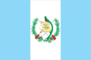
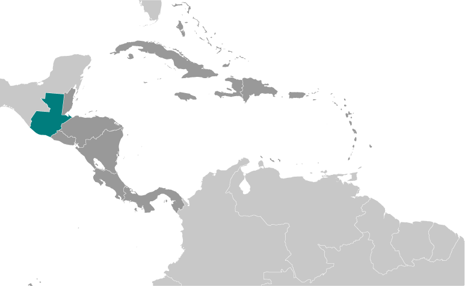
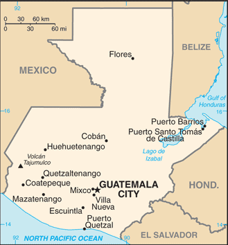

# Guatemala

## Introduction

**_Background:_**   
The Maya civilization flourished in Guatemala and surrounding regions during the first millennium A.D. After almost three centuries as a Spanish colony, Guatemala won its independence in 1821. During the second half of the 20th century, it experienced a variety of military and civilian governments, as well as a 36-year guerrilla war. In 1996, the government signed a peace agreement formally ending the internal conflict, which had left more than 200,000 people dead and had created, by some estimates, about 1 million refugees.

## Geography

**_Location:_**   
Central America, bordering the North Pacific Ocean, between El Salvador and Mexico, and bordering the Gulf of Honduras (Caribbean Sea) between Honduras and Belize

**_Geographic coordinates:_**   
15 30 N, 90 15 W

**_Map references:_**   
Central America and the Caribbean

**_Area:_**   
**total:** 108,889 sq km   
**land:** 107,159 sq km   
**water:** 1,730 sq km

**_Area - comparative:_**   
slightly smaller than Pennsylvania

**_Land boundaries:_**   
**total:** 1,667 km   
**border countries:** Belize 266 km, El Salvador 199 km, Honduras 244 km, Mexico 958 km

**_Coastline:_**   
400 km

**_Maritime claims:_**   
**territorial sea:** 12 nm   
**exclusive economic zone:** 200 nm   
**continental shelf:** 200 m depth or to the depth of exploitation

**_Climate:_**   
tropical; hot, humid in lowlands; cooler in highlands

**_Terrain:_**   
mostly mountains with narrow coastal plains and rolling limestone plateau

**_Elevation extremes:_**   
**lowest point:** Pacific Ocean 0 m   
**highest point:** Volcan Tajumulco 4,211 m   
**note:** highest point in Central America

**_Natural resources:_**   
petroleum, nickel, rare woods, fish, chicle, hydropower

**_Land use:_**   
**arable land:** 13.78%   
**permanent crops:** 8.68%   
**other:** 77.55% (2011)

**_Irrigated land:_**   
3,121 sq km (2003)

**_Total renewable water resources:_**   
111.3 cu km (2011)

**_Freshwater withdrawal (domestic/industrial/agricultural):_**   
**total:** 3.46 cu km/yr (15%/31%/54%)   
**per capita:** 259.1 cu m/yr (2006)

**_Natural hazards:_**   
numerous volcanoes in mountains, with occasional violent earthquakes; Caribbean coast extremely susceptible to hurricanes and other tropical storms   
**volcanism:** significant volcanic activity in the Sierra Madre range; Santa Maria (elev. 3,772 m) has been deemed a Decade Volcano by the International Association of Volcanology and Chemistry of the Earth's Interior, worthy of study due to its explosive history and close proximity to human populations; Pacaya (elev. 2,552 m), which erupted in May 2010 causing an ashfall on Guatemala City and prompting evacuations, is one of the country's most active volcanoes with frequent eruptions since 1965; other historically active volcanoes include Acatenango, Almolonga, Atitlan, Fuego, and Tacana

**_Environment - current issues:_**   
deforestation in the Peten rainforest; soil erosion; water pollution

**_Environment - international agreements:_**   
**party to:** Antarctic Treaty, Biodiversity, Climate Change, Climate Change-Kyoto Protocol, Desertification, Endangered Species, Environmental Modification, Hazardous Wastes, Law of the Sea, Marine Dumping, Ozone Layer Protection, Ship Pollution, Wetlands, Whaling   
**signed, but not ratified:** none of the selected agreements

**_Geography - note:_**   
no natural harbors on west coast

## People and Society

**_Nationality:_**   
**noun:** Guatemalan(s)   
**adjective:** Guatemalan

**_Ethnic groups:_**   
Mestizo (mixed Amerindian-Spanish - in local Spanish called Ladino) and European 59.4%, K'iche 9.1%, Kaqchikel 8.4%, Mam 7.9%, Q'eqchi 6.3%, other Mayan 8.6%, indigenous non-Mayan 0.2%, other 0.1% (2001 census)

**_Languages:_**   
Spanish (official) 60%, Amerindian languages 40%   
**note:** there are 23 officially recognized Amerindian languages, including Quiche, Cakchiquel, Kekchi, Mam, Garifuna, and Xinca

**_Religions:_**   
Roman Catholic, Protestant, indigenous Mayan beliefs

**_Demographic profile:_**   
Guatemala is a predominantly poor country that struggles in several areas of health and development, including infant, child, and maternal mortality, malnutrition, literacy, and contraceptive awareness and use. The country's large indigenous population is disproportionately affected. Guatemala is the most populous country in Central America and has the highest fertility rate in Latin America. It also has the highest population growth rate in Latin America, which is likely to continue because of its large reproductive-age population and high birth rate. Almost half of Guatemala's population is under age 19, making it the youngest population in Latin America. Guatemala's total fertility rate has slowly declined during the last few decades due in part to limited government-funded health programs. However, the birth rate is still more than three children per woman and is markedly higher among its rural and indigenous populations.   
Guatemalans have a history of emigrating legally and illegally to Mexico, the United States, and Canada because of a lack of economic opportunity, political instability, and natural disasters. Emigration, primarily to the United States, escalated during the 1960 to 1996 civil war and accelerated after a peace agreement was signed. Thousands of Guatemalans who fled to Mexico returned after the war, but labor migration to southern Mexico continues.

**_Population:_**   
14,647,083 (July 2014 est.)

**_Age structure:_**   
**0-14 years:** 36.2% (male 2,698,238/female 2,597,026)   
**15-24 years:** 22.1% (male 1,625,139/female 1,615,543)   
**25-54 years:** 32.4% (male 2,251,665/female 2,487,332)   
**55-64 years:** 5.2% (male 362,686/female 393,273)   
**65 years and over:** 4.1% (male 286,041/female 330,140) (2014 est.)

**_Dependency ratios:_**   
**total dependency ratio:** 80.7 %   
**youth dependency ratio:** 72.4 %   
**elderly dependency ratio:** 8.3 %   
**potential support ratio:** 12 (2014 est.)

**_Median age:_**   
**total:** 21 years   
**male:** 20.4 years   
**female:** 21.7 years (2014 est.)

**_Population growth rate:_**   
1.86% (2014 est.)

**_Birth rate:_**   
25.46 births/1,000 population (2014 est.)

**_Death rate:_**   
4.82 deaths/1,000 population (2014 est.)

**_Net migration rate:_**   
-2 migrant(s)/1,000 population (2014 est.)

**_Urbanization:_**   
**urban population:** 49.8% of total population (2011)   
**rate of urbanization:** 3.43% annual rate of change (2010-15 est.)

**_Major urban areas - population:_**   
GUATEMALA CITY (capital) 1.168 million (2011)

**_Sex ratio:_**   
**at birth:** 1.05 male(s)/female   
**0-14 years:** 1.04 male(s)/female   
**15-24 years:** 1.01 male(s)/female   
**25-54 years:** 0.91 male(s)/female   
**55-64 years:** 0.97 male(s)/female   
**65 years and over:** 0.87 male(s)/female   
**total population:** 0.97 male(s)/female (2014 est.)

**_Mother's mean age at first birth:_**   
20.3   
**note:** median age at first birth among women 25-29 (2008-09 est.)

**_Maternal mortality rate:_**   
120 deaths/100,000 live births (2010)

**_Infant mortality rate:_**   
**total:** 23.51 deaths/1,000 live births   
**male:** 25.57 deaths/1,000 live births   
**female:** 21.35 deaths/1,000 live births (2014 est.)

**_Life expectancy at birth:_**   
**total population:** 71.74 years   
**male:** 69.82 years   
**female:** 73.76 years (2014 est.)

**_Total fertility rate:_**   
2.99 children born/woman (2014 est.)

**_Contraceptive prevalence rate:_**   
43.3% (2002)

**_Health expenditures:_**   
6.7% of GDP (2011)

**_Physicians density:_**   
0.93 physicians/1,000 population (2009)

**_Hospital bed density:_**   
0.7 beds/1,000 population (2011)

**_Drinking water source:_**   
**improved:** urban: 99.1% of population; rural: 88.6% of population; total: 93.8% of population   
**unimproved:** urban: 0.9% of population; rural: 11.4% of population; total: 6.2% of population (2012 est.)

**_Sanitation facility access:_**   
**improved:** urban: 88.4% of population; rural: 72.1% of population; total: 80.3% of population   
**unimproved:** urban: 11.6% of population; rural: 27.9% of population; total: 19.7% of population (2012 est.)

**_HIV/AIDS - adult prevalence rate:_**   
0.7% (2012 est.)

**_HIV/AIDS - people living with HIV/AIDS:_**   
57,800 (2012 est.)

**_HIV/AIDS - deaths:_**   
3,400 (2012 est.)

**_Major infectious diseases:_**   
**degree of risk:** high   
**food or waterborne diseases:** bacterial diarrhea, hepatitis A, and typhoid fever   
**vectorborne disease:** dengue fever and malaria (2013)

**_Obesity - adult prevalence rate:_**   
19.2% (2008)

**_Children under the age of 5 years underweight:_**   
13% (2009)

**_Education expenditures:_**   
3% of GDP (2012)

**_Literacy:_**   
**definition:** age 15 and over can read and write   
**total population:** 75.9%   
**male:** 81.2%   
**female:** 71.1% (2011 est.)

**_School life expectancy (primary to tertiary education):_**   
**total:** 11 years   
**male:** 11 years   
**female:** 10 years (2007)

**_Child labor - children ages 5-14:_**   
**total number:** 929,852   
**percentage:** 21 %   
**note:** data represents children ages 5-17 (2006 est.)

**_Unemployment, youth ages 15-24:_**   
**total:** 7.5%   
**male:** 4.5%   
**female:** 13.6% (2011)

## Government

**_Country name:_**   
**conventional long form:** Republic of Guatemala   
**conventional short form:** Guatemala   
**local long form:** Republica de Guatemala   
**local short form:** Guatemala

**_Government type:_**   
constitutional democratic republic

**_Capital:_**   
**name:** Guatemala City   
**geographic coordinates:** 14 37 N, 90 31 W   
**time difference:** UTC-6 (1 hour behind Washington, DC, during Standard Time)

**_Administrative divisions:_**   
22 departments (departamentos, singular - departamento); Alta Verapaz, Baja Verapaz, Chimaltenango, Chiquimula, El Progreso, Escuintla, Guatemala, Huehuetenango, Izabal, Jalapa, Jutiapa, Peten, Quetzaltenango, Quiche, Retalhuleu, Sacatepequez, San Marcos, Santa Rosa, Solola, Suchitepequez, Totonicapan, Zacapa

**_Independence:_**   
15 September 1821 (from Spain)

**_National holiday:_**   
Independence Day, 15 September (1821)

**_Constitution:_**   
several previous; latest adopted 31 May 1985, effective 14 January 1986; suspended, reinstated, and amended in 1993 (2013)

**_Legal system:_**   
civil law system; judicial review of legislative acts

**_International law organization participation:_**   
has not submitted an ICJ jurisdiction declaration; the Congress ratified Statute of Rome on 18 January 2012, and ICCt jurisdiction entered into force on 23 February 2012

**_Suffrage:_**   
18 years of age; universal; note - active duty members of the armed forces and police by law cannot vote and are restricted to their barracks on election day

**_Executive branch:_**   
**chief of state:** President Otto Fernando PEREZ MOLINA (since 14 January 2012); Vice President Ingrid Roxana BALDETTI Elias (since 14 January 2012); note - the president is both chief of state and head of government   
**head of government:** President Otto Fernando PEREZ MOLINA (since 14 January 2012); Vice President Ingrid Roxana BALDETTI Elias (since 14 January 2012)   
**cabinet:** Council of Ministers appointed by the president   
**elections:** president and vice president elected on the same ticket by popular vote for a four-year term (may not serve consecutive terms); election last held on 11 September 2011; runoff held on 6 November 2011 (next to be held in September 2015)   
**election results:** Otto Fernando PEREZ MOLINA elected president in a runoff election; percent of vote - Otto Fernando PEREZ MOLINA 53.7%, Manuel BALDIZON 46.3%

**_Legislative branch:_**   
unicameral Congress of the Republic or Congreso de la Republica (158 seats; members elected through a party list proportional representation system)   
**elections:** last held on 11 September 2011 (next to be held in September 2015)   
**election results:** percent of vote by party - PP 26.62%, UNE-GANA 22.67%, UNC 9.50%, LIDER 8.87%, CREO 8.67%, VIVA-EG 7.87%, Winaq-URNG-ANN 3.23%, PAN 3.12%, FRG 2.74%, PU 2.70%, other 3.59%; seats by party - PP 57, UNE-GANA 48, LIDER 14, UCN 14, CREO 12, VIVA-EG 6, PAN 2, Winaq-URNG-ANN 2, FRG 1, PU 1, Victoria 1; note - changes in party affiliation now reflect the following seat distribution: as of 15 January 2014 - PP 55, LIDER 39, TODOS 18, independents 10, CREO 8, UNE 8, GANA 6, EG 3, PU 2, PRI (formerly FRG) 2, PAN 1, UCN 1, URNG 2, Victoria 1, VIVA 1, Winaq 1

**_Judicial branch:_**   
**highest court(s):** Supreme Court of Justice or Corte Suprema de Justicia (consists of 13 magistrates including the court president and organized into 3 chambers); note - the court president also supervises trial judges countrywide; Constitutional Court or Corte de Constitcionalidad (consists of 5 judges and 5 alternates)   
**judge selection and term of office:** Supreme Court magistrates elected by the Congress of the Republic from candidates proposed by the Postulation Committee, an independent body of deans of the country's university law schools, representatives of the country's law associations, and representatives of the Court of Appeal and other tribunals; magistrates elected for renewable 5-year terms; Constitutional Court judges - 1 elected by the Congress of the Republic, 1 by the Supreme Court, 1 by the president of the republic, 1 by the University of San Carlos, and 1 by a lawyers bar association; judges elected for concurrent 5-year terms; the presidency of the court rotates among the magistrates for a single 1-year term   
**subordinate courts:** numerous first instance and appellate courts

**_Political parties and leaders:_**   
Commitment, Renewal, and Order or CREO [Roberto GONZALEZ Diaz-Duran]   
Democratic Union or UD [Edwin Armando MARTINEZ Herrera]   
Encounter for Guatemala or EG [Nineth MONTENEGRO Cottom]   
Everyone Together for Guatemala or TODOS [Felipe ALEJOS]   
Grand National Alliance or GANA [Jaime Antonio MARTINEZ Lohayza]   
Guatemalan National Revolutionary Unity or URNG [Angel SANCHEZ Viesca]   
Institutional Republican Party (formerly the Guatemalan Republican Front) or PRI [Luis Fernando PEREZ]   
National Advancement Party or PAN [Juan GUTIERREZ Strauss]   
National Unity for Hope or UNE [Sandra TORRES]   
Nationalist Change Union or UCN [Mario ESTRADA]   
New National Alternative or ANN [Pablo MONSANTO]   
Patriot Party or PP [Ingrid Roxana BALDETTI Elias]   
Renewed Democratic Liberty or LIDER [Manuel BALDIZON]   
Unionista Party or PU [Alvaro ARZU Irigoyen]   
Victoria (Victory) [Amilcar RIVERA]   
Vision with Values or VIVA [Harold CABALLEROS] (part of a coalition with EG during the last legislative election)   
Winaq [Rigoberta MENCHU]

**_Political pressure groups and leaders:_**   
Alliance Against Impunity or AI (which includes among others Center for Legal Action on Human Rights (CALDH), and Family and Friends of the Disappeared of Guatemala (FAMDEGUA))   
Civic and Political Convergence of Women   
Committee for Campesino Unity or CUC   
Coordinating Committee of Agricultural, Commercial, Industrial, and Financial Associations or CACIF   
Foundation for the Development of Guatemala or FUNDESA   
Guatemala Visible   
Mutual Support Group or GAM   
Movimiento PRO-Justicia   
National Union of Agriculture Workers or UNAGRO

**_International organization participation:_**   
BCIE, CACM, CD, CELAC, EITI (candidate country), FAO, G-24, G-77, IADB, IAEA, IBRD, ICAO, ICC (national committees), ICRM, IDA, IFAD, IFC, IFRCS, IHO, ILO, IMF, IMO, Interpol, IOC, IOM, IPU, ISO (correspondent), ITSO, ITU, ITUC (NGOs), LAES, LAIA (observer), MIGA, MINUSTAH, MONUSCO, NAM, OAS, OPANAL, OPCW, Pacific Alliance (observer), PCA, Petrocaribe, SICA, UN, UNAMID, UNCTAD, UNESCO, UNIDO, UNIFIL, Union Latina, UNISFA, UNITAR, UNMISS, UNOCI, UNWTO, UPU, WCO, WFTU (NGOs), WHO, WIPO, WMO, WTO

**_Diplomatic representation in the US:_**   
**chief of mission:** Ambassador Jose Julio Alejandro LIGORRIA Carballido (since 5 September 2013)   
**chancery:** 2220 R Street NW, Washington, DC 20008   
**telephone:** [1] (202) 745-4952   
**FAX:** [1] (202) 745-1908   
**consulate(s) general:** Atlanta, Chicago, Denver, Houston, Los Angeles, McAllen (TX), Miami, New York, Phoenix, Providence (RI), San Francisco, Silver Spring (MD),

**_Diplomatic representation from the US:_**   
**chief of mission:** Ambassador (vacant), Chargé d'Affairs ad interim Bruce WILLIAMSON (since 5 March 2014)   
**embassy:** 7-01 Avenida Reforma, Zone 10, Guatemala City   
**mailing address:** DPO AA 34024   
**telephone:** [502] 2326-4000   
**FAX:** [502] 2326-4654

**_Flag description:_**   
three equal vertical bands of light blue (hoist side), white, and light blue, with the coat of arms centered in the white band; the coat of arms includes a green and red quetzal (the national bird) representing liberty and a scroll bearing the inscription LIBERTAD 15 DE SEPTIEMBRE DE 1821 (the original date of independence from Spain) all superimposed on a pair of crossed rifles signifying Guatemala's willingness to defend itself and a pair of crossed swords representing honor and framed by a laurel wreath symbolizing victory; the blue bands represent the Pacific Ocean and Caribbean Sea; the white band denotes peace and purity

**_National symbol(s):_**   
quetzal (bird)

**_National anthem:_**   
**name:** "Himno Nacional de Guatemala" (National Anthem of Guatemala)   
**lyrics/music:** Jose Joaquin PALMA/Rafael Alvarez OVALLE   
**note:** adopted 1897, modified lyrics adopted 1934; Cuban poet Jose Joaquin PALMA anonymously submitted lyrics to a public contest calling for a national anthem; his authorship was not discovered until 1911

## Economy

**_Economy - overview:_**   
Guatemala is the most populous country in Central America with a GDP per capita roughly one-half that of the average for Latin America and the Caribbean. The agricultural sector accounts for 13.5% of GDP and 30% of the labor force; key agricultural exports include coffee, sugar, bananas, and vegetables. The 1996 peace accords, which ended 36 years of civil war, removed a major obstacle to foreign investment, and since then Guatemala has pursued important reforms and macroeconomic stabilization. The Dominican Republic-Central America Free Trade Agreement (CAFTA-DR) entered into force in July 2006, spurring increased investment and diversification of exports, with the largest increases in ethanol and non-traditional agricultural exports. While CAFTA-DR has helped improve the investment climate, concerns over security, the lack of skilled workers, and poor infrastructure continue to hamper foreign direct investment. The distribution of income remains highly unequal with the richest 20% of the population accounting for more than 51% of Guatemala's overall consumption. More than half of the population is below the national poverty line, and 13% of the population lives in extreme poverty. Poverty among indigenous groups, which make up more than 40% of the population, averages 73%, with 22% of the indigenous population living in extreme poverty. Nearly one-half of Guatemala's children under age five are chronically malnourished, one of the highest malnutrition rates in the world. Guatemala is the top remittance recipient in Central America as a result of Guatemala's large expatriate community in the United States. These inflows are a primary source of foreign income, equivalent to one-half of the country's exports or one-tenth of its GDP.

**_GDP (purchasing power parity):_**   
$81.51 billion (2013 est.)   
$78.91 billion (2012 est.)   
$76.64 billion (2011 est.)   
**note:** data are in 2013 US dollars

**_GDP (official exchange rate):_**   
$53.9 billion (2013 est.)

**_GDP - real growth rate:_**   
3.3% (2013 est.)   
3% (2012 est.)   
4.2% (2011 est.)

**_GDP - per capita (PPP):_**   
$5,300 (2013 est.)   
$5,200 (2012 est.)   
$5,200 (2011 est.)   
**note:** data are in 2013 US dollars

**_GDP - composition, by end use:_**   
**household consumption:** 84.5%   
**government consumption:** 11%   
**investment in fixed capital:** 14.1%   
**investment in inventories:** 0.7%   
**exports of goods and services:** 25.1%   
**imports of goods and services:** -35.3%; (2013 est.)

**_GDP - composition, by sector of origin:_**   
**agriculture:** 13.5%   
**industry:** 23.8%   
**services:** 62.7% (2013 est.)

**_Agriculture - products:_**   
sugarcane, corn, bananas, coffee, beans, cardamom; cattle, sheep, pigs, chickens

**_Industries:_**   
sugar, textiles and clothing, furniture, chemicals, petroleum, metals, rubber, tourism

**_Industrial production growth rate:_**   
3.7% (2013 est.)

**_Labor force:_**   
4.465 million (2013 est.)

**_Labor force - by occupation:_**   
**agriculture:** 38%   
**industry:** 14%   
**services:** 48% (2011 est.)

**_Unemployment rate:_**   
4.1% (2011 est.)   
3.5% (2010 est.)

**_Population below poverty line:_**   
54% (2011 est.)

**_Household income or consumption by percentage share:_**   
**lowest 10%:** 1.3%   
**highest 10%:** 42.4% (2006)

**_Distribution of family income - Gini index:_**   
55.1 (2007)   
55.8 (1998)

**_Budget:_**   
**revenues:** $6.411 billion   
**expenditures:** $7.851 billion (2013 est.)

**_Taxes and other revenues:_**   
11.9% of GDP (2013 est.)

**_Budget surplus (+) or deficit (-):_**   
-2.7% of GDP (2013 est.)

**_Public debt:_**   
31% of GDP (2013 est.)   
29.5% of GDP (2012 est.)

**_Fiscal year:_**   
calendar year

**_Inflation rate (consumer prices):_**   
4.4% (2013 est.)   
3.8% (2012 est.)

**_Central bank discount rate:_**   
6.5% (31 December 2010 est.)

**_Commercial bank prime lending rate:_**   
13.4% (31 December 2013 est.)   
13.49% (31 December 2012 est.)

**_Stock of narrow money:_**   
$8.461 billion (31 December 2013 est.)   
$7.975 billion (31 December 2012 est.)

**_Stock of broad money:_**   
$23.83 billion (31 December 2013 est.)   
$22.3 billion (31 December 2012 est.)

**_Stock of domestic credit:_**   
$22.6 billion (31 December 2013 est.)   
$20.5 billion (31 December 2012 est.)

**_Market value of publicly traded shares:_**   
$NA

**_Current account balance:_**   
-$1.822 billion (2013 est.)   
-$1.489 billion (2012 est.)

**_Exports:_**   
$10.29 billion (2013 est.)   
$10.11 billion (2012 est.)

**_Exports - commodities:_**   
coffee, sugar, petroleum, apparel, bananas, fruits and vegetables, cardamom

**_Exports - partners:_**   
US 40.2%, El Salvador 11.1%, Honduras 8%, Mexico 5.5%, Nicaragua 4.7%, Costa Rica 4.3% (2012)

**_Imports:_**   
$16.7 billion (2013 est.)   
$15.84 billion (2012 est.)

**_Imports - commodities:_**   
fuels, machinery and transport equipment, construction materials, grain, fertilizers, electricity, mineral products, chemical products, plastic materials and products

**_Imports - partners:_**   
US 38%, Mexico 11.3%, China 7.4%, El Salvador 4.6% (2012)

**_Reserves of foreign exchange and gold:_**   
$7.118 billion (31 December 2013 est.)   
$6.694 billion (31 December 2012 est.)

**_Debt - external:_**   
$17.67 billion (31 December 2013 est.)   
$16.61 billion (31 December 2012 est.)

**_Exchange rates:_**   
quetzales (GTQ) per US dollar -   
7.883 (2013 est.)   
7.8336 (2012 est.)   
8.0578 (2010 est.)   
8.1616 (2009)   
7.5895 (2008)

## Energy

**_Electricity - production:_**   
8.146 billion kWh (2011 est.)

**_Electricity - consumption:_**   
8.161 billion kWh (2011 est.)

**_Electricity - exports:_**   
193.3 million kWh (2011 est.)

**_Electricity - imports:_**   
525.6 million kWh (2011 est.)

**_Electricity - installed generating capacity:_**   
2.745 million kW (2010 est.)

**_Electricity - from fossil fuels:_**   
56.5% of total installed capacity (2010 est.)

**_Electricity - from nuclear fuels:_**   
0% of total installed capacity (2010 est.)

**_Electricity - from hydroelectric plants:_**   
31.1% of total installed capacity (2010 est.)

**_Electricity - from other renewable sources:_**   
12.4% of total installed capacity (2010 est.)

**_Crude oil - production:_**   
14,020 bbl/day (2012 est.)

**_Crude oil - exports:_**   
10,960 bbl/day (2010 est.)

**_Crude oil - imports:_**   
0 bbl/day (2010 est.)

**_Crude oil - proved reserves:_**   
83.07 million bbl (1 January 2013 est.)

**_Refined petroleum products - production:_**   
1,253 bbl/day (2010 est.)

**_Refined petroleum products - consumption:_**   
80,810 bbl/day (2011 est.)

**_Refined petroleum products - exports:_**   
4,911 bbl/day (2010 est.)

**_Refined petroleum products - imports:_**   
71,390 bbl/day (2010 est.)

**_Natural gas - production:_**   
0 cu m (2011 est.)

**_Natural gas - consumption:_**   
0 cu m (2010 est.)

**_Natural gas - exports:_**   
0 cu m (2011 est.)

**_Natural gas - imports:_**   
0 cu m (2011 est.)

**_Natural gas - proved reserves:_**   
2.96 billion cu m (1 January 2006 est.)

**_Carbon dioxide emissions from consumption of energy:_**   
11.71 million Mt (2011 est.)

## Communications

**_Telephones - main lines in use:_**   
1.744 million (2012)

**_Telephones - mobile cellular:_**   
20.787 million (2012)

**_Telephone system:_**   
**general assessment:** fairly modern network centered in the city of Guatemala   
**domestic:** state-owned telecommunications company privatized in the late 1990s opening the way for competition; fixed-line teledensity roughly 10 per 100 persons; fixed-line investments are being concentrated on improving rural connectivity; mobile-cellular teledensity approaching 140 per 100 persons   
**international:** country code - 502; landing point for both the Americas Region Caribbean Ring System (ARCOS-1) and the SAM-1 fiber optic submarine cable system that, together, provide connectivity to South and Central America, parts of the Caribbean, and the US; connected to Central American Microwave System; satellite earth station - 1 Intelsat (Atlantic Ocean) (2013)

**_Broadcast media:_**   
4 privately owned national terrestrial TV channels dominate TV broadcasting; multi-channel satellite and cable services are available; 1 government-owned radio station and hundreds of privately owned radio stations (2007)

**_Internet country code:_**   
.gt

**_Internet hosts:_**   
357,552 (2012)

**_Internet users:_**   
2.279 million (2009)

## Transportation

**_Airports:_**   
291 (2013)

**_Airports - with paved runways:_**   
**total:** 16   
**2,438 to 3,047 m:** 2   
**1,524 to 2,437 m:** 4   
**914 to 1,523 m:** 6   
**under 914 m:** 4 (2013)

**_Airports - with unpaved runways:_**   
**total:** 275   
**2,438 to 3,047 m:** 1   
**1,524 to 2,437 m:** 2   
**914 to 1,523 m:** 77   
**under 914 m:** 195 (2013)

**_Heliports:_**   
1 (2013)

**_Pipelines:_**   
oil 480 km (2013)

**_Railways:_**   
**total:** 332 km   
**narrow gauge:** 332 km 0.914-m gauge (2008)

**_Roadways:_**   
**total:** 11,501 km   
**paved:** 6,797 km (includes 127 km of expressways)   
**unpaved:** 4,704 km (2010)

**_Waterways:_**   
990 km (260 km navigable year round; additional 730 km navigable during high-water season) (2012)

**_Ports and terminals:_**   
**major seaport(s):** Puerto Quetzal, Santo Tomas de Castilla

## Military

**_Military branches:_**   
National Army of Guatemala (Ejercito Nacional de Guatemala, ENG; includes Guatemalan Navy (Fuerza de Mar, including Marines) and Guatemalan Air Force (Fuerza Aerea Guatemalteca, FAG)) (2013)

**_Military service age and obligation:_**   
all male citizens between the ages of 18 and 50 are eligible for military service; in practice, most of the force is volunteer, however, a selective draft system is employed, resulting in a small portion of 17-21 year-olds conscripted; conscript service obligation varies from 1 to 2 years; women can serve as officers (2013)

**_Manpower available for military service:_**   
**males age 16-49:** 3,165,870   
**females age 16-49:** 3,371,217 (2010 est.)

**_Manpower fit for military service:_**   
**males age 16-49:** 2,590,843   
**females age 16-49:** 2,926,544 (2010 est.)

**_Manpower reaching militarily significant age annually:_**   
**male:** 171,092   
**female:** 168,151 (2010 est.)

**_Military expenditures:_**   
0.42% of GDP (2012)   
0.41% of GDP (2011)   
0.42% of GDP (2010)

## Transnational Issues

**_Disputes - international:_**   
annual ministerial meetings under the Organization of American States-initiated Agreement on the Framework for Negotiations and Confidence Building Measures continue to address Guatemalan land and maritime claims in Belize and the Caribbean Sea; Guatemala persists in its territorial claim to half of Belize, but agrees to Line of Adjacency to keep Guatemalan squatters out of Belize's forested interior; both countries agreed in April 2012 to hold simultaneous referenda, which was scheduled for 6 October 2013, to decide whether to refer the dispute to the ICJ for binding resolution, though this has been suspended indefinitely; Mexico must deal with thousands of impoverished Guatemalans and other Central Americans who cross the porous border looking for work in Mexico and the United States

**_Refugees and internally displaced persons:_**   
**IDPs:** undetermined (more than three decades of internal conflict that ended in 1996 displaced mainly the indigenous Maya population and rural peasants; ongoing drug cartel and gang violence) (2011)

**_Illicit drugs:_**   
major transit country for cocaine and heroin; in 2005, cultivated 100 hectares of opium poppy after reemerging as a potential source of opium in 2004; potential production of less than 1 metric ton of pure heroin; marijuana cultivation for mostly domestic consumption; proximity to Mexico makes Guatemala a major staging area for drugs (particularly for cocaine); money laundering is a serious problem; corruption is a major problem

............................................................   
_Page last updated on June 22, 2014_
