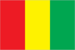
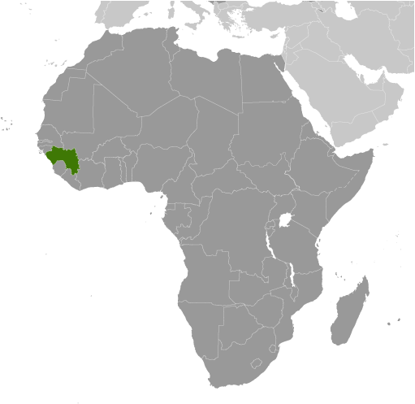
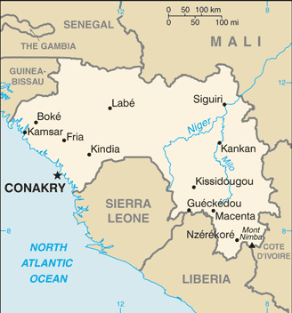

# Guinea

## Introduction

**_Background:_**   
Guinea is at a turning point after decades of authoritarian rule since gaining its independence from France in 1958. Guinea held its first free and competitive democratic presidential and legislative elections in 2010 and 2013 respectively. Alpha CONDE was elected to a five year term as president in 2010, and the National Assembly was seated in January 2014. CONDE's cabinet is the first all-civilian government in Guinea. Previously, Sekou TOURE ruled the country as president from independence to his death in 1984. Lansana CONTE came to power in 1984 when the military seized the government after TOURE's death. Gen. CONTE organized and won presidential elections in 1993, 1998, and 2003, though all the polls were rigged. Upon CONTE's death in December 2008, Capt. Moussa Dadis CAMARA led a military coup, seizing power and suspending the constitution. His unwillingness to yield to domestic and international pressure to step down led to heightened political tensions that culminated in September 2009 when presidential guards opened fire on an opposition rally killing more than 150 people, and in early December 2009 when CAMARA was wounded in an assassination attempt and exiled to Burkina Faso. A transitional government led by Gen. Sekouba KONATE paved the way for Guinea's transition to a fledgling democracy.

## Geography

**_Location:_**   
Western Africa, bordering the North Atlantic Ocean, between Guinea-Bissau and Sierra Leone

**_Geographic coordinates:_**   
11 00 N, 10 00 W

**_Map references:_**   
Africa

**_Area:_**   
**total:** 245,857 sq km   
**land:** 245,717 sq km   
**water:** 140 sq km

**_Area - comparative:_**   
slightly smaller than Oregon

**_Land boundaries:_**   
**total:** 4,046 km   
**border countries:** Cote d'Ivoire 816 km, Guinea-Bissau 421 km, Liberia 590 km, Mali 1,062 km, Senegal 363 km, Sierra Leone 794 km

**_Coastline:_**   
320 km

**_Maritime claims:_**   
**territorial sea:** 12 nm   
**exclusive economic zone:** 200 nm

**_Climate:_**   
generally hot and humid; monsoonal-type rainy season (June to November) with southwesterly winds; dry season (December to May) with northeasterly harmattan winds

**_Terrain:_**   
generally flat coastal plain, hilly to mountainous interior

**_Elevation extremes:_**   
**lowest point:** Atlantic Ocean 0 m   
**highest point:** Mont Nimba 1,752 m

**_Natural resources:_**   
bauxite, iron ore, diamonds, gold, uranium, hydropower, fish, salt

**_Land use:_**   
**arable land:** 11.59%   
**permanent crops:** 2.81%   
**other:** 85.6% (2011)

**_Irrigated land:_**   
949.2 sq km (2003)

**_Total renewable water resources:_**   
226 cu km (2011)

**_Freshwater withdrawal (domestic/industrial/agricultural):_**   
**total:** 0.55 cu km/yr (39%/10%/51%)   
**per capita:** 64.3 cu m/yr (2005)

**_Natural hazards:_**   
hot, dry, dusty harmattan haze may reduce visibility during dry season

**_Environment - current issues:_**   
deforestation; inadequate supplies of potable water; desertification; soil contamination and erosion; overfishing, overpopulation in forest region; poor mining practices have led to environmental damage

**_Environment - international agreements:_**   
**party to:** Biodiversity, Climate Change, Climate Change-Kyoto Protocol, Desertification, Endangered Species, Hazardous Wastes, Law of the Sea, Ozone Layer Protection, Ship Pollution, Wetlands, Whaling   
**signed, but not ratified:** none of the selected agreements

**_Geography - note:_**   
the Niger and its important tributary the Milo have their sources in the Guinean highlands

## People and Society

**_Nationality:_**   
**noun:** Guinean(s)   
**adjective:** Guinean

**_Ethnic groups:_**   
Peuhl 40%, Malinke 30%, Soussou 20%, smaller ethnic groups 10%

**_Languages:_**   
French (official)   
**note:** each ethnic group has its own language

**_Religions:_**   
Muslim 85%, Christian 8%, indigenous beliefs 7%

**_Population:_**   
11,474,383 (July 2014 est.)

**_Age structure:_**   
**0-14 years:** 42% (male 2,437,142/female 2,387,105)   
**15-24 years:** 19.5% (male 1,130,432/female 1,108,834)   
**25-54 years:** 30.4% (male 1,748,867/female 1,739,881)   
**55-64 years:** 4.4% (male 243,032/female 266,578)   
**65 years and over:** 3.6% (male 182,084/female 230,428) (2014 est.)

**_Dependency ratios:_**   
**total dependency ratio:** 82.4 %   
**youth dependency ratio:** 76.7 %   
**elderly dependency ratio:** 5.6 %   
**potential support ratio:** 17.7 (2014 est.)

**_Median age:_**   
**total:** 18.7 years   
**male:** 18.4 years   
**female:** 18.9 years (2014 est.)

**_Population growth rate:_**   
2.63% (2014 est.)

**_Birth rate:_**   
36.02 births/1,000 population (2014 est.)

**_Death rate:_**   
9.69 deaths/1,000 population (2014 est.)

**_Net migration rate:_**   
0 migrant(s)/1,000 population (2014 est.)

**_Urbanization:_**   
**urban population:** 35.4% of total population (2011)   
**rate of urbanization:** 3.86% annual rate of change (2010-15 est.)

**_Major urban areas - population:_**   
CONAKRY (capital) 1.786 million (2011)

**_Sex ratio:_**   
**at birth:** 1.03 male(s)/female   
**0-14 years:** 1.02 male(s)/female   
**15-24 years:** 1.02 male(s)/female   
**25-54 years:** 1.01 male(s)/female   
**55-64 years:** 1 male(s)/female   
**65 years and over:** 0.79 male(s)/female   
**total population:** 1 male(s)/female (2014 est.)

**_Mother's mean age at first birth:_**   
18.9   
**note:** median age at first birth among women 25-29 (2012 est.)

**_Maternal mortality rate:_**   
610 deaths/100,000 live births (2010)

**_Infant mortality rate:_**   
**total:** 55.24 deaths/1,000 live births   
**male:** 58.17 deaths/1,000 live births   
**female:** 52.22 deaths/1,000 live births (2014 est.)

**_Life expectancy at birth:_**   
**total population:** 59.6 years   
**male:** 58.08 years   
**female:** 61.17 years (2014 est.)

**_Total fertility rate:_**   
4.93 children born/woman (2014 est.)

**_Contraceptive prevalence rate:_**   
5.6% (2012)

**_Health expenditures:_**   
6% of GDP (2011)

**_Physicians density:_**   
0.1 physicians/1,000 population (2005)

**_Hospital bed density:_**   
0.3 beds/1,000 population (2011)

**_Drinking water source:_**   
**improved:** urban: 92.2% of population; rural: 65% of population; total: 74.8% of population   
**unimproved:** urban: 7.8% of population; rural: 35% of population; total: 25.2% of population (2012 est.)

**_Sanitation facility access:_**   
**improved:** urban: 32.7% of population; rural: 11.2% of population; total: 18.9% of population   
**unimproved:** urban: 67.3% of population; rural: 88.8% of population; total: 81.1% of population (2012 est.)

**_HIV/AIDS - adult prevalence rate:_**   
1.7% (2012 est.)

**_HIV/AIDS - people living with HIV/AIDS:_**   
118,100 (2012 est.)

**_HIV/AIDS - deaths:_**   
5,100 (2012 est.)

**_Major infectious diseases:_**   
**degree of risk:** very high   
**food or waterborne diseases:** bacterial and protozoal diarrhea, hepatitis A, and typhoid fever   
**vectorborne diseases:** malaria, dengue fever, and yellow fever   
**water contact disease:** schistosomiasis   
**aerosolized dust or soil contact disease:** Lassa fever   
**animal contact disease:** rabies (2013)

**_Obesity - adult prevalence rate:_**   
4.4% (2008)

**_Children under the age of 5 years underweight:_**   
16.3% (2012)

**_Education expenditures:_**   
2.5% of GDP (2012)

**_Literacy:_**   
**definition:** age 15 and over can read and write   
**total population:** 41%   
**male:** 52%   
**female:** 30% (2010 est.)

**_School life expectancy (primary to tertiary education):_**   
**total:** 9 years   
**male:** 10 years   
**female:** 7 years (2011)

**_Child labor - children ages 5-14:_**   
**total number:** 571,774   
**percentage:** 25 % (2003 est.)

## Government

**_Country name:_**   
**conventional long form:** Republic of Guinea   
**conventional short form:** Guinea   
**local long form:** Republique de Guinee   
**local short form:** Guinee   
**former:** French Guinea

**_Government type:_**   
republic

**_Capital:_**   
**name:** Conakry   
**geographic coordinates:** 9 30 N, 13 42 W   
**time difference:** UTC 0 (5 hours ahead of Washington, DC, during Standard Time)

**_Administrative divisions:_**   
7 regions and 1 governate\*; Boke, Conakry\*, Faranah, Kankan, Kindia, Labe, Mamou, N'Zerekore

**_Independence:_**   
2 October 1958 (from France)

**_National holiday:_**   
Independence Day, 2 October (1958)

**_Constitution:_**   
previous 1958, 1990; latest promulgated 19 April 2010, approved 7 May 2010 (2010)

**_Legal system:_**   
civil law system based on the French model

**_International law organization participation:_**   
accepts compulsory ICJ jurisdiction with reservations; accepts ICCt jurisdiction

**_Suffrage:_**   
18 years of age; universal

**_Executive branch:_**   
**chief of state:** President Alpha CONDE (since 21 December 2010)   
**head of government:** Prime Minister Prime Minister Mohamed Said FOFANA (since 24 December 2010)   
**cabinet:** Council of Ministers appointed by the president   
**elections:** president elected by popular vote for a five-year term (eligible for a second term); candidate must receive a majority of the votes cast to be elected president; election last held on 27 June 2010 with a runoff election held on 7 November 2010   
**election results:** Alpha CONDE elected president in a runoff election; percent of vote Alpha CONDE 52.5%, Cellou Dalein DIALLO 47.5%

**_Legislative branch:_**   
unicameral People's National Assembly or Assemblee Nationale Populaire (114 seats; members elected by a mixed system of direct popular vote and proportional party lists)   
**note:** the legislature was dissolved by junta leader Moussa Dadis CAMARA in December 2008 and in February 2010, the Transition Government appointed a 155 member National Transition Council (CNT) that has since acted in the legislature's place pending elections finally held on 28 September 2013; the Assembly can be dissolved one time by the President, with snap elections required within 90 days   
**elections:** last held on 28 September 2013 (next election scheduled for 2018)   
**election results:** percent of vote by party - NA; seats by party - RPG 53, UFDG 37, UFR 10, others 14

**_Judicial branch:_**   
**highest court(s):** Supreme Court or Cour Supreme (organized into Constitutional, Civil, Penal, Commercial, and Administrative Chambers, and Chamber of Accounts; court consists of the first president, chamber presidents, and NA members); note - the court is due to be reorganized by the New National Assembly in accordance with the 2010 constitution and democratic transition   
**judge selection and term of office:** court first president appointed by the national president after consultation with the National Assembly; other members appointed by presidential decree; member tenure NA   
**subordinate courts:** Courts of Appeal or Cour d'Appel; courts of first instance or Tribunal de Premiere Instance; High Court of Justice or Cour d'Assises; labor court; military tribunal; justices of the peace

**_Political parties and leaders:_**   
National Party for Hope and Development or PEDN [Lansana KOUYATE]   
Rally for the Guinean People or RPG [Alpha CONDE]   
Union for the Progress of Guinea or UPG [Jean Marie DORE]   
Union of Democratic Forces of Guinea or UFDG [Cellou Dalein DIALLO]   
Union of Republican Forces or UFR [Sidya TOURE]   
**note:** listed are the five most popular parties as of January 2014; overall, there are more than 140 registered parties

**_Political pressure groups and leaders:_**   
National Confederation of Guinean Workers-Labor Union of Guinean Workers or CNTG-USTG Alliance (includes National Confederation of Guinean Workers or CNTG and Labor Union of Guinean Workers or USTG); Syndicate of Guinean Teachers and Researchers or SLECG

**_International organization participation:_**   
ACP, AfDB, AU, ECOWAS, EITI (candidate country), FAO, G-77, IBRD, ICAO, ICRM, IDA, IDB, IFAD, IFC, IFRCS, ILO, IMF, IMO, Interpol, IOC, IOM, ISO (correspondent), ITSO, ITU, ITUC (NGOs), MIGA, MINURSO, MINUSMA, NAM, OIC, OIF, OPCW, UN, UNCTAD, UNESCO, UNHCR, UNIDO, UNISFA, UNMISS, UNOCI, UNWTO, UPU, WCO, WFTU (NGOs), WHO, WIPO, WMO, WTO

**_Diplomatic representation in the US:_**   
**chief of mission:** Ambassador Blaise CHERIF (since 2 September 2011)   
**chancery:** 2112 Leroy Place NW, Washington, DC 20008   
**telephone:** [1] (202) 986-4300   
**FAX:** [1] (202) 478-3010

**_Diplomatic representation from the US:_**   
**chief of mission:** Ambassador Alexander Mark LASKARIS (since 10 September 2012)   
**embassy:** Koloma, Conakry, east of Hamdallaye Circle   
**mailing address:** B. P. 603, Transversale No. 2, Centre Administratif de Koloma, Commune de Ratoma, Conakry   
**telephone:** [224] 655-10-40-00   
**FAX:** [224] 655-10-42-97

**_Flag description:_**   
three equal vertical bands of red (hoist side), yellow, and green; red represents the people's sacrifice for liberation and work; yellow stands for the sun, for the riches of the earth, and for justice; green symbolizes the country's vegetation and unity   
**note:** uses the popular Pan-African colors of Ethiopia; the colors from left to right are the reverse of those on the flags of neighboring Mali and Senegal

**_National anthem:_**   
**name:** "Liberte" (Liberty)   
**lyrics/music:** unknown/Fodeba KEITA   
**note:** adopted 1958

## Economy

**_Economy - overview:_**   
Guinea is a poor country that possesses major mineral, hydropower, solar power, and agricultural resources. Guinea has historically been an exporter of agricultural commodities, but in recent years has shifted to importing the majority of food crops. Bauxite is Guinea’s main mineral resource as well as its main source of foreign currency. Guinea is the second largest producer of bauxite in the world and has the largest reserves of bauxite, estimated at 29 billion tons. The country also has significant iron ore, gold, and diamond reserves. However, Guinea has been unable to profit from this potential, as rampant corruption, dilapidated infrastructure, and political uncertainty have drained investor confidence. In the time since a 2008 coup following the death of long-term President Lansana CONTE, international donors, including the G-8, the IMF, and the World Bank, significantly curtailed their development programs but, following the December 2010 presidential elections, the IMF approved a new 3-year ECF arrangement in 2012. Guinea in September 2012 reached HIPC completion point status. Further international assistance and investment are contingent on the ability of the government to be transparent, combat corruption, reform its banking system, improve its business environment, and build infrastructure. International investors have expressed keen interest in Guinea's vast iron ore reserves, which could propel the country's growth. The government in April 2013 amended the September 2011 mining code to reduce taxes and royalties. Longer range plans to deploy broadband Internet throughout the country could spur economic growth as well. The biggest threats to Guinea’s economy are political instability and low international commodity prices.

**_GDP (purchasing power parity):_**   
$12.56 billion (2013 est.)   
$12.21 billion (2012 est.)   
$11.74 billion (2011 est.)   
**note:** data are in 2013 US dollars

**_GDP (official exchange rate):_**   
$6.544 billion (2013 est.)

**_GDP - real growth rate:_**   
2.9% (2013 est.)   
3.9% (2012 est.)   
3.9% (2011 est.)

**_GDP - per capita (PPP):_**   
$1,100 (2013 est.)   
$1,100 (2012 est.)   
$1,100 (2011 est.)   
**note:** data are in 2013 US dollars

**_Gross national saving:_**   
NA% (2012 est.)   
-6.4% of GDP (2011 est.)

**_GDP - composition, by end use:_**   
**household consumption:** 84.7%   
**government consumption:** 12.4%   
**investment in fixed capital:** 37.1%   
**investment in inventories:** 0%   
**exports of goods and services:** 22.8%   
**imports of goods and services:** -57%; (2013 est.)

**_GDP - composition, by sector of origin:_**   
**agriculture:** 22.9%   
**industry:** 46.5%   
**services:** 30.5% (2013 est.)

**_Agriculture - products:_**   
rice, coffee, pineapples, palm kernels, cassava (manioc, tapioca), bananas, sweet potatoes; cattle, sheep, goats; timber

**_Industries:_**   
bauxite, gold, diamonds, iron ore; alumina refining; light manufacturing, agricultural processing

**_Industrial production growth rate:_**   
4.6% (2013 est.)

**_Labor force:_**   
5.409 million (2013 est.)

**_Labor force - by occupation:_**   
**agriculture:** 76%   
**industry and services:** 24% (2006 est.)

**_Unemployment rate:_**   
NA%

**_Population below poverty line:_**   
47% (2006 est.)

**_Household income or consumption by percentage share:_**   
**lowest 10%:** 2.7%   
**highest 10%:** 30.3% (2007)

**_Distribution of family income - Gini index:_**   
39.4 (2007)   
40.3 (1994)

**_Budget:_**   
**revenues:** $1.508 billion   
**expenditures:** $1.839 billion (2013 est.)

**_Taxes and other revenues:_**   
23% of GDP (2013 est.)

**_Budget surplus (+) or deficit (-):_**   
-5.1% of GDP (2013 est.)

**_Fiscal year:_**   
calendar year

**_Inflation rate (consumer prices):_**   
11.9% (2013 est.)   
15.2% (2012 est.)

**_Central bank discount rate:_**   
NA% (31 December 2010 est.)   
22.25% (31 December 2005)

**_Commercial bank prime lending rate:_**   
26% (31 December 2013 est.)   
27% (31 December 2012 est.)

**_Stock of narrow money:_**   
$1.533 billion (31 December 2013 est.)   
$1.492 billion (31 December 2012 est.)

**_Stock of broad money:_**   
$1.881 billion (31 December 2013 est.)   
$1.818 billion (31 December 2012 est.)

**_Stock of domestic credit:_**   
$1.518 billion (31 December 2013 est.)   
$1.539 billion (31 December 2012 est.)

**_Market value of publicly traded shares:_**   
$NA

**_Current account balance:_**   
-$1.754 billion (2012 est.)   
-$1.215 billion (2011 est.)

**_Exports:_**   
$1.31 billion (2013 est.)   
$1.348 billion (2012 est.)

**_Exports - commodities:_**   
bauxite, alumina, gold, diamonds, coffee, fish, agricultural products

**_Exports - partners:_**   
India 10.6%, Spain 9.6%, Chile 9.4%, US 7.1%, Ireland 6.3%, Germany 6.3%, Ukraine 5.7%, France 5% (2012)

**_Imports:_**   
$2.384 billion (2013 est.)   
$2.606 billion (2012 est.)

**_Imports - commodities:_**   
petroleum products, metals, machinery, transport equipment, textiles, grain and other foodstuffs

**_Imports - partners:_**   
China 14.2%, Netherlands 7.6% (2012)

**_Reserves of foreign exchange and gold:_**   
$183.1 million (31 December 2013 est.)   
$174.3 million (31 December 2012 est.)

**_Debt - external:_**   
$2.584 billion (31 December 2012 est.)   
$3.139 billion (31 December 2011 est.)

**_Stock of direct foreign investment - abroad:_**   
$145 million (31 December 2013 est.)   
$145 million

**_Exchange rates:_**   
Guinean francs (GNF) per US dollar -   
6,875 (2013 est.)   
6,986 (2012 est.)   
5,726.1 (2010 est.)   
5,500 (2009)   
5,500 (2008)

## Energy

**_Electricity - production:_**   
969 million kWh (2010 est.)

**_Electricity - consumption:_**   
901.2 million kWh (2010 est.)

**_Electricity - exports:_**   
0 kWh (2012 est.)

**_Electricity - imports:_**   
0 kWh (2012 est.)

**_Electricity - installed generating capacity:_**   
395,000 kW (2010 est.)

**_Electricity - from fossil fuels:_**   
68.4% of total installed capacity (2010 est.)

**_Electricity - from nuclear fuels:_**   
0% of total installed capacity (2010 est.)

**_Electricity - from hydroelectric plants:_**   
31.6% of total installed capacity (2010 est.)

**_Electricity - from other renewable sources:_**   
0% of total installed capacity (2010 est.)

**_Crude oil - production:_**   
0 bbl/day (2012 est.)

**_Crude oil - exports:_**   
0 bbl/day (2010 est.)

**_Crude oil - imports:_**   
0 bbl/day (2010 est.)

**_Crude oil - proved reserves:_**   
0 bbl (1 January 2013 est.)

**_Refined petroleum products - production:_**   
0 bbl/day (2010 est.)

**_Refined petroleum products - consumption:_**   
8,671 bbl/day (2011 est.)

**_Refined petroleum products - exports:_**   
0 bbl/day (2010 est.)

**_Refined petroleum products - imports:_**   
9,089 bbl/day (2010 est.)

**_Natural gas - production:_**   
0 cu m (2011 est.)

**_Natural gas - consumption:_**   
0 cu m (2010 est.)

**_Natural gas - exports:_**   
0 cu m (2011 est.)

**_Natural gas - imports:_**   
0 cu m (2011 est.)

**_Natural gas - proved reserves:_**   
0 cu m (1 January 2013 est.)

**_Carbon dioxide emissions from consumption of energy:_**   
1.419 million Mt (2011 est.)

## Communications

**_Telephones - main lines in use:_**   
18,000 (2012)

**_Telephones - mobile cellular:_**   
4.781 million (2012)

**_Telephone system:_**   
**general assessment:** inadequate system of open-wire lines, small radiotelephone communication stations, and new microwave radio relay system   
**domestic:** Conakry reasonably well-served; coverage elsewhere remains inadequate and large companies tend to rely on their own systems for nationwide links; fixed-line teledensity less than 1 per 100 persons; mobile-cellular subscribership is expanding and exceeds 40 per 100 persons   
**international:** country code - 224; satellite earth station - 1 Intelsat (Atlantic Ocean) (2011)

**_Broadcast media:_**   
government maintains marginal control over broadcast media; single state-run TV station; state-run radio broadcast station also operates several stations in rural areas; a steadily increasing number of privately owned radio stations, nearly all in Conakry, and about a dozen community radio stations; foreign TV programming available via satellite and cable subscription services (2011)

**_Internet country code:_**   
.gn

**_Internet hosts:_**   
15 (2012)

**_Internet users:_**   
95,000 (2009)

## Transportation

**_Airports:_**   
16 (2013)

**_Airports - with paved runways:_**   
**total:** 4   
**over 3,047 m:** 1   
**1,524 to 2,437 m:** 3 (2013)

**_Airports - with unpaved runways:_**   
**total:** 12   
**1,524 to 2,437 m:** 7   
**914 to 1,523 m:** 3   
**under 914 m:** 2 (2013)

**_Railways:_**   
**total:** 1,185 km   
**standard gauge:** 238 km 1.435-m gauge   
**narrow gauge:** 947 km 1.000-m gauge (2008)

**_Roadways:_**   
**total:** 44,348 km   
**paved:** 4,342 km   
**unpaved:** 40,006 km (2003)

**_Waterways:_**   
1,300 km (navigable by shallow-draft native craft in the northern part of the Niger system) (2011)

**_Ports and terminals:_**   
**major seaport(s):** Conakry, Kamsar

## Military

**_Military branches:_**   
National Armed Forces: Army, Guinean Navy (Armee de Mer or Marine Guineenne, includes Marines), Guinean Air Force (Force Aerienne de Guinee) (2009)

**_Military service age and obligation:_**   
18-25 years of age for compulsory and voluntary military service; 18-month conscript service obligation (2012)

**_Manpower available for military service:_**   
**males age 16-49:** 2,359,203   
**females age 16-49:** 2,329,784 (2010 est.)

**_Manpower fit for military service:_**   
**males age 16-49:** 1,493,991   
**females age 16-49:** 1,535,418 (2010 est.)

**_Manpower reaching militarily significant age annually:_**   
**male:** 118,443   
**female:** 115,901 (2010 est.)

## Transnational Issues

**_Disputes - international:_**   
conflicts among rebel groups, warlords, and youth gangs in neighboring states have spilled over into Guinea resulting in domestic instability; Sierra Leone considers Guinea's definition of the flood plain limits to define the left bank boundary of the Makona and Moa rivers excessive and protests Guinea's continued occupation of these lands, including the hamlet of Yenga, occupied since 1998

**_Refugees and internally displaced persons:_**   
**refugees (country of origin):** 6,493 (Cote d'Ivoire) (2013)

**_Trafficking in persons:_**   
**current situation:** Guinea is a source, transit, and, to a lesser extent, a destination country for men, women, and children subjected to forced labor and sex trafficking; the majority of trafficking victims are Guinean children; Guinean girls are subjected to domestic servitude and commercial sexual exploitation, while boys are forced to beg, work as street vendors or shoe shiners, or miners; some Guinean children are forced to mine in Senegal, Mali, and possibly other West African countries; Guinean women and girls are subjected to domestic servitude and sex trafficking in Nigeria, Cote d'Ivoire, Benin, Senegal, Greece, and Spain, while Chinese and Vietnamese women are reportedly forced into prostitution in Guinea

............................................................   
_Page last updated on June 22, 2014_
