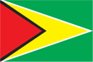
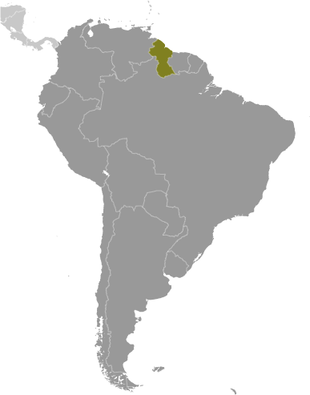
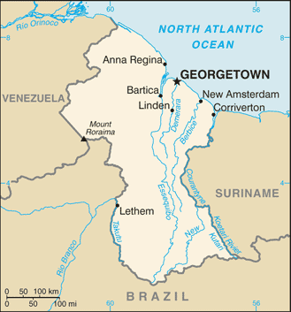

# Guyana

## Introduction

**_Background:_**   
Originally a Dutch colony in the 17th century, by 1815 Guyana had become a British possession. The abolition of slavery led to settlement of urban areas by former slaves and the importation of indentured servants from India to work the sugar plantations. The resulting ethnocultural divide has persisted and has led to turbulent politics. Guyana achieved independence from the UK in 1966, and since then it has been ruled mostly by socialist-oriented governments. In 1992, Cheddi JAGAN was elected president in what is considered the country's first free and fair election since independence. After his death five years later, his wife, Janet JAGAN, became president but resigned in 1999 due to poor health. Her successor, Bharrat JAGDEO, was reelected in 2001 and again in 2006. Donald RAMOTAR was elected president in 2011.

## Geography

**_Location:_**   
Northern South America, bordering the North Atlantic Ocean, between Suriname and Venezuela

**_Geographic coordinates:_**   
5 00 N, 59 00 W

**_Map references:_**   
South America

**_Area:_**   
**total:** 214,969 sq km   
**land:** 196,849 sq km   
**water:** 18,120 sq km

**_Area - comparative:_**   
slightly smaller than Idaho

**_Land boundaries:_**   
**total:** 2,933 km   
**border countries:** Brazil 1,308 km, Suriname 836 km, Venezuela 789 km

**_Coastline:_**   
459 km

**_Maritime claims:_**   
**territorial sea:** 12 nm   
**exclusive economic zone:** 200 nm   
**continental shelf:** 200 nm or to the outer edge of the continental margin

**_Climate:_**   
tropical; hot, humid, moderated by northeast trade winds; two rainy seasons (May to August, November to January)

**_Terrain:_**   
mostly rolling highlands; low coastal plain; savanna in south

**_Elevation extremes:_**   
**lowest point:** Atlantic Ocean 0 m   
**highest point:** Mount Roraima 2,835 m

**_Natural resources:_**   
bauxite, gold, diamonds, hardwood timber, shrimp, fish

**_Land use:_**   
**arable land:** 1.95%   
**permanent crops:** 0.13%   
**other:** 97.92% (2011)

**_Irrigated land:_**   
1,501 sq km (2003)

**_Total renewable water resources:_**   
241 cu km (2011)

**_Freshwater withdrawal (domestic/industrial/agricultural):_**   
**total:** 1.64 cu km/yr (4%/1%/94%)   
**per capita:** 2,222 cu m/yr (2010)

**_Natural hazards:_**   
flash flood threat during rainy seasons

**_Environment - current issues:_**   
water pollution from sewage and agricultural and industrial chemicals; deforestation

**_Environment - international agreements:_**   
**party to:** Biodiversity, Climate Change, Climate Change-Kyoto Protocol, Desertification, Endangered Species, Hazardous Wastes, Law of the Sea, Ozone Layer Protection, Ship Pollution, Tropical Timber 83, Tropical Timber 94   
**signed, but not ratified:** none of the selected agreements

**_Geography - note:_**   
the third-smallest country in South America after Suriname and Uruguay; substantial portions of its western and eastern territories are claimed by Venezuela and Suriname respectively

## People and Society

**_Nationality:_**   
**noun:** Guyanese (singular and plural)   
**adjective:** Guyanese

**_Ethnic groups:_**   
East Indian 43.5%, black (African) 30.2%, mixed 16.7%, Amerindian 9.1%, other 0.5% (2002 census)

**_Languages:_**   
English, Amerindian dialects, Creole, Caribbean Hindustani (a dialect of Hindi), Urdu

**_Religions:_**   
Protestant 30.5% (Pentecostal 16.9%, Anglican 6.9%, Seventh Day Adventist 5%, Methodist 1.7%), Hindu 28.4%, Roman Catholic 8.1%, Muslim 7.2%, Jehovah's Witnesses 1.1%, other Christian 17.7%, other 1.9%, none 4.3%, unspecified 0.9% (2002 est.)

**_Demographic profile:_**   
Guyana is the only English-speaking country in South America and shares cultural and historical bonds with the Anglophone Caribbean. Guyana's two largest ethnic groups are the Afro-Guyanese (descendants of African slaves) and the Indo-Guyanese (descendants of Indian indentured laborers), which together comprise about three quarters of Guyana's population. Tensions periodically have boiled over between the two groups, which back ethnically based political parties and vote along ethnic lines. Poverty reduction has stagnated since the late 1990s. About one-third of the Guyanese population lives below the poverty line; indigenous people are disproportionately affected. Although Guyana's literacy rate is reported to be among the highest in the Western Hemisphere, the level of functional literacy is considerably lower, which has been attributed to poor education quality, teacher training, and infrastructure.   
Guyana's emigration rate is among the highest in the world - more than 55% of its citizens reside abroad - and it is one of the largest recipients of remittances relative to GDP among Latin American and Caribbean counties. Although remittances are a vital source of income for most citizens, the pervasive emigration of skilled workers deprives Guyana of professionals in healthcare and other key sectors. More than 80% of Guyanese nationals with tertiary level educations have emigrated. Brain drain and the concentration of limited medical resources in Georgetown hamper Guyana's ability to meet the health needs of its predominantly rural population. Guyana has one of the highest HIV prevalence rates in the region and continues to rely on international support for its HIV treatment and prevention programs.

**_Population:_**   
735,554   
**note:** estimates for this country explicitly take into account the effects of excess mortality due to AIDS; this can result in lower life expectancy, higher infant mortality, higher death rates, lower population growth rates, and changes in the distribution of population by age and sex than would otherwise be expected (July 2014 est.)

**_Age structure:_**   
**0-14 years:** 29% (male 108,703/female 104,793)   
**15-24 years:** 21% (male 79,354/female 74,921)   
**25-54 years:** 37.2% (male 142,348/female 131,108)   
**55-64 years:** 7.5% (male 24,677/female 30,562)   
**65 years and over:** 5.1% (male 16,318/female 22,770) (2014 est.)

**_Dependency ratios:_**   
**total dependency ratio:** 63.5 %   
**youth dependency ratio:** 57.7 %   
**elderly dependency ratio:** 5.7 %   
**potential support ratio:** 17.5 (2014 est.)

**_Median age:_**   
**total:** 25 years   
**male:** 24.6 years   
**female:** 25.4 years (2014 est.)

**_Population growth rate:_**   
-0.11% (2014 est.)

**_Birth rate:_**   
15.9 births/1,000 population (2014 est.)

**_Death rate:_**   
7.3 deaths/1,000 population (2014 est.)

**_Net migration rate:_**   
-9.67 migrant(s)/1,000 population (2014 est.)

**_Urbanization:_**   
**urban population:** 28.4% of total population (2011)   
**rate of urbanization:** 0.53% annual rate of change (2010-15 est.)

**_Major urban areas - population:_**   
GEORGETOWN (capital) 127,000 (2011)

**_Sex ratio:_**   
**at birth:** 1.05 male(s)/female   
**0-14 years:** 1.04 male(s)/female   
**15-24 years:** 1.06 male(s)/female   
**25-54 years:** 1.09 male(s)/female   
**55-64 years:** 1.02 male(s)/female   
**65 years and over:** 0.69 male(s)/female   
**total population:** 0.99 male(s)/female (2014 est.)

**_Mother's mean age at first birth:_**   
20.8   
**note:** median age at first birth among women 25-29 (2009 est.)

**_Maternal mortality rate:_**   
280 deaths/100,000 live births (2010)

**_Infant mortality rate:_**   
**total:** 33.56 deaths/1,000 live births   
**male:** 37.57 deaths/1,000 live births   
**female:** 29.36 deaths/1,000 live births (2014 est.)

**_Life expectancy at birth:_**   
**total population:** 67.81 years   
**male:** 64.82 years   
**female:** 70.96 years (2014 est.)

**_Total fertility rate:_**   
2.14 children born/woman (2014 est.)

**_Contraceptive prevalence rate:_**   
42.5% (2009)

**_Health expenditures:_**   
5.9% of GDP (2011)

**_Physicians density:_**   
0.21 physicians/1,000 population (2010)

**_Hospital bed density:_**   
2 beds/1,000 population (2009)

**_Drinking water source:_**   
**improved:** urban: 96.6% of population; rural: 97.9% of population; total: 97.6% of population   
**unimproved:** urban: 3.4% of population; rural: 2.1% of population; total: 2.4% of population (2012 est.)

**_Sanitation facility access:_**   
**improved:** urban: 87.9% of population; rural: 82% of population; total: 83.6% of population   
**unimproved:** urban: 12.1% of population; rural: 18% of population; total: 16.4% of population (2012 est.)

**_HIV/AIDS - adult prevalence rate:_**   
1.3% (2012 est.)

**_HIV/AIDS - people living with HIV/AIDS:_**   
7,200 (2012 est.)

**_HIV/AIDS - deaths:_**   
100 (2012 est.)

**_Major infectious diseases:_**   
**degree of risk:** very high   
**food or waterborne diseases:** bacterial and protozoal diarrhea, hepatitis A, and typhoid fever   
**vectorborne diseases:** dengue fever and malaria (2013)

**_Obesity - adult prevalence rate:_**   
17.2% (2008)

**_Children under the age of 5 years underweight:_**   
11.1% (2009)

**_Education expenditures:_**   
3.2% of GDP (2012)

**_Literacy:_**   
**definition:** age 15 and over has ever attended school   
**total population:** 91.8%   
**male:** 92%   
**female:** 91.6% (2002 Census)

**_School life expectancy (primary to tertiary education):_**   
**total:** 10 years   
**male:** 9 years   
**female:** 11 years (2012)

**_Child labor - children ages 5-14:_**   
**total number:** 30,255   
**percentage:** 16 % (2006 est.)

**_Unemployment, youth ages 15-24:_**   
**total:** 46.05%   
**male:** 43.59%   
**female:** 50% (2011)

## Government

**_Country name:_**   
**conventional long form:** Cooperative Republic of Guyana   
**conventional short form:** Guyana   
**former:** British Guiana

**_Government type:_**   
republic

**_Capital:_**   
**name:** Georgetown   
**geographic coordinates:** 6 48 N, 58 09 W   
**time difference:** UTC-4 (1 hour ahead of Washington, DC, during Standard Time)

**_Administrative divisions:_**   
10 regions; Barima-Waini, Cuyuni-Mazaruni, Demerara-Mahaica, East Berbice-Corentyne, Essequibo Islands-West Demerara, Mahaica-Berbice, Pomeroon-Supenaam, Potaro-Siparuni, Upper Demerara-Berbice, Upper Takutu-Upper Essequibo

**_Independence:_**   
26 May 1966 (from the UK)

**_National holiday:_**   
Republic Day, 23 February (1970)

**_Constitution:_**   
several previous; latest promulgated 6 October 1980; amended many times, last in 2007 (2013)

**_Legal system:_**   
common law system, based on the English model, with some Roman-Dutch civil law influence

**_International law organization participation:_**   
has not submitted an ICJ jurisdiction declaration; accepts ICCt jurisdiction

**_Suffrage:_**   
18 years of age; universal

**_Executive branch:_**   
**chief of state:** President Donald RAMOTAR (since 03 December 2011)   
**head of government:** Prime Minister Samuel HINDS (since October 1992, except for a period as chief of state after the death of President Cheddi JAGAN on 6 March 1997)   
**cabinet:** Cabinet of Ministers appointed by the president, responsible to the legislature   
**elections:** president elected by popular vote as leader of a party list in parliamentary election, which must be held at least every five years (no term limits); elections last held on 28 November 2011 (next to be held by December 2016); prime minister appointed by the president   
**election results:** Donald RAMOTAR elected president; percent of vote 48.6%

**_Legislative branch:_**   
unicameral National Assembly (65 seats; members elected by popular vote, also not more than 4 non-elected non-voting ministers and 2 non-elected non-voting parliamentary secretaries appointed by the president; members to serve five-year terms)   
**elections:** last held on 28 November 2011 (next to be held by November 2016)   
**election results:** percent of vote by party - PPP/C 48.6%, APNU 40%, AFC 10.3%, other 1.1%; seats by party - PPP/C 32, APNU 26, AFC 7

**_Judicial branch:_**   
**highest court(s):** Supreme Court of Judicature (consists of the Court of Appeal with a chief justice and 3 justices, and the High Court with a chief justice and 10 justices organized into 3- or 5-judge panels); note - in 2009, Guyana ceased final appeals in civil and criminal cases to the Judicial Committee of the Privy Council (in London), replacing it with the Caribbean Court of Justice, the judicial organ of the Caribbean Community   
**judge selection and term of office:** Court of Appeal and High Court chief justices appointed by the president; other judges of both courts appointed by the Judicial Service Commission, a body appointed by the president; judges appointed for life with retirement at age 65   
**subordinate courts:** Land Court; magistrates' courts

**_Political parties and leaders:_**   
Alliance for Change or AFC [Khemraj RAMJATTAN]   
Justice for All Party [C.N. SHARMA]   
A Partnership for National Unity or APNU [David GRANGER]   
People's Progressive Party/Civic or PPP/C [Donald RAMOTAR]   
Rise, Organize, and Rebuild or ROAR [Ravi DEV]   
The United Force or TUF [Manzoor NADIR]   
The Unity Party [Joey JAGAN]   
Vision Guyana [Peter RAMSAROOP]

**_Political pressure groups and leaders:_**   
Amerindian People's Association   
Guyana Bar Association   
Guyana Citizens Initiative   
Guyana Human Rights Association   
Guyana Public Service Union or GPSU   
Private Sector Commission   
Trades Union Congress

**_International organization participation:_**   
ACP, AOSIS, C, Caricom, CD, CDB, CELAC, FAO, G-77, IADB, IBRD, ICAO, ICRM, IDA, IFAD, IFC, IFRCS, ILO, IMF, IMO, Interpol, IOC, IOM, ISO (correspondent), ITU, LAES, MIGA, NAM, OAS, OIC, OPANAL, OPCW, PCA, Petrocaribe, UN, UNASUR, UNCTAD, UNESCO, UNIDO, UPU, WCO, WFTU (NGOs), WHO, WIPO, WMO, WTO

**_Diplomatic representation in the US:_**   
**chief of mission:** Ambassador Bayney KARRAN (since 4 December 2003)   
**chancery:** 2490 Tracy Place NW, Washington, DC 20008   
**telephone:** [1] (202) 265-6900   
**FAX:** [1] (202) 232-1297   
**consulate(s) general:** New York

**_Diplomatic representation from the US:_**   
**chief of mission:** Ambassador D. Brent HARDT (since 19 August 2011)   
**embassy:** US Embassy, 100 Young and Duke Streets, Kingston, Georgetown   
**mailing address:** P. O. Box 10507, Georgetown; US Embassy, 3170 Georgetown Place, Washington DC 20521-3170   
**telephone:** [592] 225-4900 through 4909   
**FAX:** [592] 225-8497

**_Flag description:_**   
green, with a red isosceles triangle (based on the hoist side) superimposed on a long, yellow arrowhead; there is a narrow, black border between the red and yellow, and a narrow, white border between the yellow and the green; green represents forest and foliage; yellow stands for mineral resources and a bright future; white symbolizes Guyana's rivers; red signifies zeal and the sacrifice of the people; black indicates perseverance

**_National symbol(s):_**   
Canje pheasant (hoatzin); jaguar

**_National anthem:_**   
**name:** "Dear Land of Guyana, of Rivers and Plains"   
**lyrics/music:** Archibald Leonard LUKERL/Robert Cyril Gladstone POTTER   
**note:** adopted 1966

## Economy

**_Economy - overview:_**   
The Guyanese economy exhibited moderate economic growth in recent years and is based largely on agriculture and extractive industries. The economy is heavily dependent upon the export of six commodities - sugar, gold, bauxite, shrimp, timber, and rice - which represent nearly 60% of the country's GDP and are highly susceptible to adverse weather conditions and fluctuations in commodity prices. Guyana's entrance into the Caricom Single Market and Economy (CSME) in January 2006 has broadened the country's export market, primarily in the raw materials sector. Guyana has experienced positive growth almost every year over the past decade. Inflation has been kept under control. Recent years have seen the government's stock of debt reduced significantly - with external debt now less than half of what it was in the early 1990s. Chronic problems include a shortage of skilled labor and a deficient infrastructure. Despite recent improvements, the government is still juggling a sizable external debt against the urgent need for expanded public investment. In March 2007, the Inter-American Development Bank, Guyana's principal donor, canceled Guyana's nearly $470 million debt, equivalent to 21% of GDP, which along with other Highly Indebted Poor Country (HIPC) debt forgiveness brought the debt-to-GDP ratio down from 183% in 2006 to 60% in 2013. Guyana had become heavily indebted as a result of the inward-looking, state-led development model pursued in the 1970s and 1980s. Much of Guyana's growth in recent years has come from a surge in gold production in response to global prices, although downward trends in gold prices may threaten future growth. In 2013, production of sugar dropped to a 23-year low.

**_GDP (purchasing power parity):_**   
$6.593 billion (2013 est.)   
$6.26 billion (2012 est.)   
$5.972 billion (2011 est.)   
**note:** data are in 2013 US dollars

**_GDP (official exchange rate):_**   
$3.02 billion (2013 est.)

**_GDP - real growth rate:_**   
5.3% (2013 est.)   
4.8% (2012 est.)   
5.4% (2011 est.)

**_GDP - per capita (PPP):_**   
$8,500 (2013 est.)   
$8,100 (2012 est.)   
$7,700 (2011 est.)   
**note:** data are in 2013 US dollars

**_Gross national saving:_**   
6.2% of GDP (2013 est.)   
8.3% of GDP (2012 est.)   
9.4% of GDP (2011 est.)

**_GDP - composition, by end use:_**   
**household consumption:** 85.6%   
**government consumption:** 16.3%   
**investment in fixed capital:** 22.5%   
**investment in inventories:** -13.5%   
**exports of goods and services:** 59.9%   
**imports of goods and services:** -70.8%; (2013 est.)

**_GDP - composition, by sector of origin:_**   
**agriculture:** 20.7%   
**industry:** 38.5%   
**services:** 40.8% (2013 est.)

**_Agriculture - products:_**   
sugarcane, rice, edible oils; beef, pork, poultry; shrimp, fish

**_Industries:_**   
bauxite, sugar, rice milling, timber, textiles, gold mining

**_Industrial production growth rate:_**   
13.5% (2013 est.)

**_Labor force:_**   
313,100 (2009 est.)

**_Labor force - by occupation:_**   
**agriculture:** NA%   
**industry:** NA%   
**services:** NA%

**_Unemployment rate:_**   
11% (2007)

**_Population below poverty line:_**   
35% (2006)

**_Household income or consumption by percentage share:_**   
**lowest 10%:** 1.3%   
**highest 10%:** 33.8% (1999)

**_Distribution of family income - Gini index:_**   
44.6 (2007)   
43.2 (1999)

**_Budget:_**   
**revenues:** $756.7 million   
**expenditures:** $948.5 million (2013 est.)

**_Taxes and other revenues:_**   
25.1% of GDP (2013 est.)

**_Budget surplus (+) or deficit (-):_**   
-6.4% of GDP (2013 est.)

**_Public debt:_**   
59.9% of GDP (2013 est.)   
59.5% of GDP (2012 est.)

**_Fiscal year:_**   
calendar year

**_Inflation rate (consumer prices):_**   
3.9% (2013 est.)   
2.4% (2012 est.)

**_Central bank discount rate:_**   
5.5% (31 December 2011 est.)   
4.25% (31 December 2010 est.)

**_Commercial bank prime lending rate:_**   
13.8% (31 December 2013 est.)   
13.86% (31 December 2012 est.)

**_Stock of narrow money:_**   
$601.8 million (31 December 2013 est.)   
$550.4 million (31 December 2012 est.)

**_Stock of broad money:_**   
$1.617 billion (31 December 2013 est.)   
$1.49 billion (31 December 2012 est.)

**_Stock of domestic credit:_**   
$1.352 billion (31 December 2013 est.)   
$1.223 billion (31 December 2012 est.)

**_Market value of publicly traded shares:_**   
$610.9 million (31 December 2012 est.)   
$440.4 million (31 December 2011)   
$NA (31 December 2010 est.)

**_Current account balance:_**   
-$510.7 million (2013 est.)   
-$394.8 million (2012 est.)

**_Exports:_**   
$1.337 billion (2013 est.)   
$1.396 billion (2012 est.)

**_Exports - commodities:_**   
sugar, gold, bauxite, alumina, rice, shrimp, molasses, rum, timber

**_Exports - partners:_**   
US 30.8%, Canada 28.9%, UK 6.2% (2012)

**_Imports:_**   
$2.039 billion (2013 est.)   
$1.978 billion (2012 est.)

**_Imports - commodities:_**   
manufactures, machinery, petroleum, food

**_Imports - partners:_**   
US 22.2%, Trinidad and Tobago 21.9%, China 12.3%, Cuba 6.1%, Suriname 4% (2012)

**_Reserves of foreign exchange and gold:_**   
$854.7 million (31 December 2013 est.)   
$864 million (31 December 2012 est.)

**_Debt - external:_**   
$1.846 billion (31 December 2011 est.)   
$1.846 billion (31 December 2011 est.)

**_Exchange rates:_**   
Guyanese dollars (GYD) per US dollar -   
205.9 (2013 est.)   
204.36 (2012 est.)   
203.64 (2010 est.)   
203.95 (2009)   
203.86 (2008)

## Energy

**_Electricity - production:_**   
700 million kWh (2010 est.)

**_Electricity - consumption:_**   
512 million kWh (2010 est.)

**_Electricity - exports:_**   
0 kWh (2012 est.)

**_Electricity - imports:_**   
0 kWh (2012 est.)

**_Electricity - installed generating capacity:_**   
362,500 kW (2010 est.)

**_Electricity - from fossil fuels:_**   
96% of total installed capacity (2010 est.)

**_Electricity - from nuclear fuels:_**   
0% of total installed capacity (2010 est.)

**_Electricity - from hydroelectric plants:_**   
0.3% of total installed capacity (2010 est.)

**_Electricity - from other renewable sources:_**   
3.7% of total installed capacity (2010 est.)

**_Crude oil - production:_**   
0 bbl/day (2012 est.)

**_Crude oil - exports:_**   
0 bbl/day (2010 est.)

**_Crude oil - imports:_**   
0 bbl/day (2010 est.)

**_Crude oil - proved reserves:_**   
0 bbl (1 January 2013 est.)

**_Refined petroleum products - production:_**   
0 bbl/day (2010 est.)

**_Refined petroleum products - consumption:_**   
10,910 bbl/day (2011 est.)

**_Refined petroleum products - exports:_**   
0 bbl/day (2010 est.)

**_Refined petroleum products - imports:_**   
10,780 bbl/day (2010 est.)

**_Natural gas - production:_**   
0 cu m (2011 est.)

**_Natural gas - consumption:_**   
0 cu m (2010 est.)

**_Natural gas - exports:_**   
0 cu m (2011 est.)

**_Natural gas - imports:_**   
0 cu m (2011 est.)

**_Natural gas - proved reserves:_**   
0 cu m (1 January 2013 est.)

**_Carbon dioxide emissions from consumption of energy:_**   
1.673 million Mt (2011 est.)

## Communications

**_Telephones - main lines in use:_**   
154,200 (2012)

**_Telephones - mobile cellular:_**   
547,000 (2012)

**_Telephone system:_**   
**general assessment:** fair system for long-distance service; microwave radio relay network for trunk lines; many areas still lack fixed-line telephone services   
**domestic:** fixed-line teledensity is about 20 per 100 persons; mobile-cellular teledensity about 70 per 100 persons in 2011   
**international:** country code - 592; tropospheric scatter to Trinidad; satellite earth station - 1 Intelsat (Atlantic Ocean) (2011)

**_Broadcast media:_**   
government-dominated broadcast media; the National Communications Network (NCN) TV is state-owned; a few private TV stations relay satellite services; the state owns and operates 2 radio stations broadcasting on multiple frequencies capable of reaching the entire country; government limits on licensing of new private radio stations continue to constrain competition in broadcast media (2007)

**_Internet country code:_**   
.gy

**_Internet hosts:_**   
24,936 (2012)

**_Internet users:_**   
189,600 (2009)

## Transportation

**_Airports:_**   
117 (2013)

**_Airports - with paved runways:_**   
**total:** 11   
**1,524 to 2,437 m:** 2   
**914 to 1,523 m:** 1   
**under 914 m:** 8 (2013)

**_Airports - with unpaved runways:_**   
**total:** 106   
**1,524 to 2,437 m:** 1   
**914 to 1,523 m:** 16   
**under 914 m:** 89 (2013)

**_Roadways:_**   
**total:** 7,970 km   
**paved:** 590 km   
**unpaved:** 7,380 km (2000)

**_Waterways:_**   
330 km (the Berbice, Demerara, and Essequibo rivers are navigable by oceangoing vessels for 150 km, 100 km, and 80 km respectively) (2012)

**_Merchant marine:_**   
**total:** 10   
**by type:** cargo 7, petroleum tanker 2, refrigerated cargo 1   
**registered in other countries:** 3 (Saint Vincent and the Grenadines 2, unknown 1) (2010)

**_Ports and terminals:_**   
**major seaport(s):** Georgetown

## Military

**_Military branches:_**   
Guyana Defense Force: Army (includes Air Corps, Coast Guard) (2012)

**_Military service age and obligation:_**   
18 years of age or older for voluntary military service; no conscription (2014)

**_Manpower available for military service:_**   
**males age 16-49:** 189,840 (2010 est.)

**_Manpower fit for military service:_**   
**males age 16-49:** 133,239   
**females age 16-49:** 147,719 (2010 est.)

**_Manpower reaching militarily significant age annually:_**   
**male:** 8,849   
**female:** 8,460 (2010 est.)

**_Military expenditures:_**   
1.09% of GDP (2012)   
1.17% of GDP (2011)   
1.09% of GDP (2010)

## Transnational Issues

**_Disputes - international:_**   
all of the area west of the Essequibo River is claimed by Venezuela preventing any discussion of a maritime boundary; Guyana has expressed its intention to join Barbados in asserting claims before UN Convention on the Law of the Sea (UNCLOS) that Trinidad and Tobago's maritime boundary with Venezuela extends into their waters; Suriname claims a triangle of land between the New and Kutari/Koetari rivers in a historic dispute over the headwaters of the Courantyne; Guyana seeks arbitration under provisions of the UNCLOS to resolve the long-standing dispute with Suriname over the axis of the territorial sea boundary in potentially oil-rich waters

**_Trafficking in persons:_**   
**current situation:** Guyana is a source and destination country for men, women, and children subjected to sex trafficking and forced labor; Guyanese and foreign women and girls are forced into prostitution in Guyana; experts are concerned that Guyanese children are subjected to exploitive labor practices in the mining, agriculture, and forestry sectors; Indonesian workers are victims of forced labor on Guyanese-flagged fishing boats   
**tier rating:** Tier 2 Watch List - Guyana does not fully comply with the minimum standards for the elimination of trafficking; however, it is making significant efforts to do so; despite some progress in identifying and assisting some trafficking victims, the government has failed to increase its efforts to hold trafficking offenders accountable with jail time, creating an enabling environment for human trafficking; public comments from the government downplaying the scope of Guyana's trafficking problem diminishes the potential impact of its awareness campaigns; authorities operate a hotline for trafficking victims and conduct several awareness and sensitization sessions that target vulnerable communities (2013)

**_Illicit drugs:_**   
transshipment point for narcotics from South America - primarily Venezuela - to Europe and the US; producer of cannabis; rising money laundering related to drug trafficking and human smuggling

............................................................   
_Page last updated on June 22, 2014_
