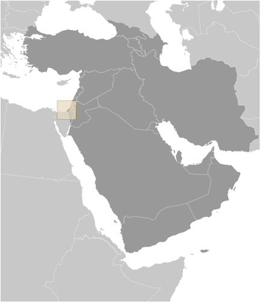
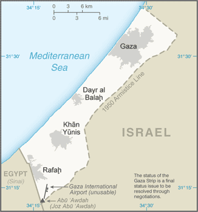

# Gaza Strip

## Introduction

**_Background:_**   
Inhabited since at least the 15th century B.C., Gaza has been dominated by many different peoples and empires throughout its history; it was incorporated into the Ottoman Empire in the early 16th century. Gaza fell to British forces during World War I, becoming a part of the British Mandate of Palestine. Following the 1948 Arab-Israeli War, Egypt administered the newly formed Gaza Strip; it was captured by Israel in the Six-Day War in 1967. Under a series of agreements signed between 1994 and 1999, Israel transferred to the Palestinian Authority (PA) security and civilian responsibility for many Palestinian-populated areas of the Gaza Strip as well as the West Bank. Negotiations to determine the permanent status of the West Bank and Gaza Strip stalled after the outbreak of an intifada in mid- 2000. In early 2003, the "Quartet" of the US, EU, UN, and Russia, presented a roadmap to a final peace settlement by 2005, calling for two states - Israel and a democratic Palestine. Following Palestinian leader Yasir ARAFAT's death in late 2004 and the subsequent election of Mahmud ABBAS (head of the Fatah political party) as the PA president, Israel and the PA agreed to move the peace process forward. Israel in late 2005 unilaterally withdrew all of its settlers and soldiers and dismantled its military facilities in the Gaza Strip, but continues to control maritime, airspace, and other access. In early 2006, the Islamic Resistance Movement, HAMAS, won the Palestinian Legislative Council election and took control of the PA government. Attempts to form a unity government between Fatah and HAMAS failed, and violent clashes between Fatah and HAMAS supporters ensued, culminating in HAMAS's violent seizure of all military and governmental institutions in the Gaza Strip in June 2007. Fatah and HAMAS in early 2011 agreed to reunify the Gaza Strip and West Bank, but the factions have struggled to implement details on governance and security. Brief periods of increased violence between Israel and Palestinian militants in the Gaza Strip in 2007-08 and again in 2012, both led to Egyptian-brokered truces. The status quo remains with HAMAS in control of the Gaza Strip and the PA governing the West Bank.

## Geography

**_Location:_**   
Middle East, bordering the Mediterranean Sea, between Egypt and Israel

**_Geographic coordinates:_**   
31 25 N, 34 20 E

**_Map references:_**   
Middle East

**_Area:_**   
**total:** 360 sq km   
**land:** 360 sq km   
**water:** 0 sq km

**_Area - comparative:_**   
slightly more than twice the size of Washington, DC

**_Land boundaries:_**   
**total:** 72 km   
**border countries:** Egypt 13 km, Israel 59 km

**_Coastline:_**   
40 km

**_Maritime claims:_**   
see entry for Israel   
**note:** effective 3 January 2009 the Gaza maritime area is closed to all maritime traffic and is under blockade imposed by Israeli Navy until further notice

**_Climate:_**   
temperate, mild winters, dry and warm to hot summers

**_Terrain:_**   
flat to rolling, sand- and dune-covered coastal plain

**_Elevation extremes:_**   
**lowest point:** Mediterranean Sea 0 m   
**highest point:** Abu 'Awdah (Joz Abu 'Awdah) 105 m

**_Natural resources:_**   
arable land, natural gas

**_Land use:_**   
**arable land:** 7.39%   
**permanent crops:** 10.96%   
**other:** 81.64% (2011)

**_Irrigated land:_**   
240 sq km; note - includes West Bank (2003)

**_Natural hazards:_**   
droughts

**_Environment - current issues:_**   
desertification; salination of fresh water; sewage treatment; water-borne disease; soil degradation; depletion and contamination of underground water resources

**_Geography - note:_**   
strategic strip of land along Mideast-North African trade routes has experienced an incredibly turbulent history; the town of Gaza itself has been besieged countless times in its history

## People and Society

**_Nationality:_**   
**noun:** NA   
**adjective:** NA

**_Ethnic groups:_**   
Palestinian Arab

**_Languages:_**   
Arabic, Hebrew (spoken by many Palestinians), English (widely understood)

**_Religions:_**   
Muslim 98.0 - 99.0% (predominantly Sunni), Christian note: dismantlement of Israeli settlements was completed in September 2005; Gaza has had no Jewish population since then (2012 est.)   
**note:** dismantlement of Israeli settlements was completed in September 2005; Gaza has had no Jewish population since then (2012 est.)

**_Population:_**   
1,816,379 (July 2014 est.)

**_Age structure:_**   
**0-14 years:** 43.2% (male 402,848/female 381,155)   
**15-24 years:** 20.6% (male 191,710/female 182,405)   
**25-54 years:** 30.1% (male 280,551/female 266,756)   
**55-64 years:** 3.5% (male 31,711/female 31,515)   
**65 years and over:** 2.6% (male 19,617/female 28,111) (2014 est.)

**_Dependency ratios:_**   
**total dependency ratio:** 74.1 %   
**youth dependency ratio:** 68.8 %   
**elderly dependency ratio:** 5.3 %   
**potential support ratio:** 19   
**note:** data represents the Palestinian Territories (2014 est.)

**_Median age:_**   
**total:** 18.2 years   
**male:** 18 years   
**female:** 18.4 years (2014 est.)

**_Population growth rate:_**   
2.91% (2014 est.)

**_Birth rate:_**   
32.2 births/1,000 population (2014 est.)

**_Death rate:_**   
3.09 deaths/1,000 population (2014 est.)

**_Net migration rate:_**   
0 migrant(s)/1,000 population (2014 est.)

**_Urbanization:_**   
**urban population:** 74.3% of total population (2011)   
**rate of urbanization:** 3.1% annual rate of change (2005-10 est.)

**_Sex ratio:_**   
**at birth:** 1.06 male(s)/female   
**0-14 years:** 1.06 male(s)/female   
**15-24 years:** 1.05 male(s)/female   
**25-54 years:** 1.05 male(s)/female   
**55-64 years:** 1.04 male(s)/female   
**65 years and over:** 0.68 male(s)/female   
**total population:** 1.04 male(s)/female (2014 est.)

**_Mother's mean age at first birth:_**   
19   
**note:** median age at first birth among women 25-29 (2004 est.)

**_Maternal mortality rate:_**   
64 deaths/100,000 live births (2010)

**_Infant mortality rate:_**   
**total:** 15.46 deaths/1,000 live births   
**male:** 16.51 deaths/1,000 live births   
**female:** 14.35 deaths/1,000 live births (2014 est.)

**_Life expectancy at birth:_**   
**total population:** 74.64 years   
**male:** 72.9 years   
**female:** 76.48 years (2014 est.)

**_Total fertility rate:_**   
4.24 children born/woman (2014 est.)

**_Drinking water source:_**   
**improved:** urban: 81.6% of population; rural: 82.3% of population; total: 81.8% of population   
**unimproved:** urban: 18.4% of population; rural: 17.7% of population; total: 18.2% of population;   
**note:** includes Gaza and the West Bank (2012 est.)

**_Sanitation facility access:_**   
**improved:** urban: 94.8% of population; rural: 92.8% of population; total: 94.3% of population   
**unimproved:** urban: 5.2% of population; rural: 7.2% of population; total: 5.7% of population;   
**note:** includes Gaza and the West Bank (2012 est.)

**_HIV/AIDS - adult prevalence rate:_**   
NA

**_HIV/AIDS - people living with HIV/AIDS:_**   
NA

**_HIV/AIDS - deaths:_**   
NA

**_Literacy:_**   
**definition:** age 15 and over can read and write   
**total population:** 95.3%   
**male:** 97.9%   
**female:** 92.6%   
**note:** estimates are for the Palestinian Territories (2011 est.)

**_Unemployment, youth ages 15-24:_**   
**total:** 38.8%   
**male:** 34.5%   
**female:** 62.2%   
**note:** includes West Bank (2012)

## Government

**_Country name:_**   
**conventional long form:** none   
**conventional short form:** Gaza Strip   
**local long form:** none   
**local short form:** Qita' Ghazzah

## Economy

**_Economy - overview:_**   
Israeli security controls imposed since the end of the second intifada have degraded economic conditions in the Gaza Strip, the smaller of the two areas comprising the Palestinian territories. Israeli-imposed border closures, which became more restrictive after HAMAS seized control of the territory in June 2007, have resulted in high unemployment, elevated poverty rates, and a sharp contraction of the private sector that had relied primarily on export markets. Gazans increasingly turned to tunnels that ran under the Egyptian border to bring in fuel, construction materials, and consumer goods. In July 2013, Egyptian authorities began a serious crackdown on the tunnels, causing shortages in Gaza. The population depends on government spending - by both the Palestinian Authority and HAMAS's de facto government - and humanitarian assistance. Changes to Israeli restrictions on imports in 2010 resulted in a rebound in some economic activity, but regular exports from Gaza still are not permitted. Standard-of-living measures remain below levels seen in the mid-1990s.

**_GDP (purchasing power parity):_**   
see entry for West Bank

**_GDP - real growth rate:_**   
see entry for West Bank

**_GDP - per capita (PPP):_**   
see entry for West Bank

**_GDP - composition, by end use:_**   
**household consumption:** 99.5%   
**government consumption:** 29.5%   
**investment in fixed capital:** 18%   
**investment in inventories:** 0%   
**exports of goods and services:** 14.9%   
**imports of goods and services:** -62%; (2013 est.)

**_GDP - composition, by sector of origin:_**   
see entry for West Bank

**_Agriculture - products:_**   
olives, fruit, vegetables, flowers; beef, dairy products

**_Industries:_**   
textiles, food processing, furniture

**_Labor force:_**   
348,200 (2010 est.)

**_Labor force - by occupation:_**   
**agriculture:** 5.1%   
**industry:** 15.6%   
**services:** 79.3% (2010 est.)

**_Unemployment rate:_**   
22.5% (2013 est.)   
23% (2012 est.)

**_Population below poverty line:_**   
38% (2010 est.)

**_Budget:_**   
see entry for West Bank

**_Fiscal year:_**   
calendar year

**_Inflation rate (consumer prices):_**   
1.7% (2013 est.)   
2.8% (2012 est.)   
**note:** includes West Bank

**_Commercial bank prime lending rate:_**   
see entry for West Bank

**_Stock of broad money:_**   
$2.1 billion (31 December 2013 est.)   
$1.814 billion (31 December 2012 est.)

**_Stock of domestic credit:_**   
$1.248 billion (31 December 2013 est.)   
$1.042 billion (31 December 2012 est.)

**_Current account balance:_**   
(2011 est.)

**_Exports:_**   
(2011 est.)

**_Exports - commodities:_**   
strawberries, carnations, vegetables (small and irregular shipments, as permitted to transit the Israeli-controlled Kerem Shalom crossing)

**_Imports:_**   
see entry for West Bank

**_Imports - commodities:_**   
food, consumer goods   
**note:** Israel permits basic commercial imports through the Kerem Shalom crossing, but many "dual use" goods, such as construction materials and electronics, are smuggled through tunnels beneath Gaza's border with Egypt

**_Debt - external:_**   
see entry for West Bank

**_Exchange rates:_**   
new Israeli shekels (ILS) per US dollar -   
3.621 (2012 est.)   
3.5781 (2012 est.)   
3.739 (2010 est.)   
3.9323 (2009)   
3.56 (2008)

## Energy

**_Electricity - production:_**   
51,000 kWh (2011 est.)

**_Electricity - consumption:_**   
202,000 kWh (2009)

**_Electricity - exports:_**   
0 kWh (2011 est.)

**_Electricity - imports:_**   
193,000 kWh (2011 est.)

**_Crude oil - proved reserves:_**   
0 bbl (1 January 2010 est.)

## Communications

**_Telephones - main lines in use:_**   
406,000 (includes West Bank) (2012)

**_Telephones - mobile cellular:_**   
3.041 million (includes West Bank) (2012)

**_Telephone system:_**   
**general assessment:** Gaza continues to repair the damage to its telecommunications infrastructure caused by fighting in 2009   
**domestic:** Israeli company BEZEK and the Palestinian company PALTEL are responsible for fixed-line services; the Palestinian JAWWAL company provides cellular services   
**international:** country code - 970 (2009)

**_Broadcast media:_**   
1 TV station and about 10 radio stations (2008)

**_Internet country code:_**   
.ps; note - same as West Bank

**_Internet users:_**   
1.379 million (includes West Bank) (2009)

## Transportation

**_Airports:_**   
1 (2013)

**_Airports - with paved runways:_**   
**total:** 1   
**over 3,047 m:** 1 (2013)

**_Heliports:_**   
1 (2013)

**_Roadways:_**   
**note:** see entry for West Bank

**_Ports and terminals:_**   
**major seaport(s):** Gaza

## Military

**_Military branches:_**   
Hamas does not have a conventional military in the Gaza Strip, but maintains security forces in addition to its military wing, the 'Izz al-Din al-Qassam Brigades; the military wing reports to the external Hamas Political Bureau leadership, which has been in exile in Cairo and Doha since closing its Damascus headquarters in late 2011 (2013)

**_Manpower available for military service:_**   
**males age 16-49:** 385,961 (2010 est.)

**_Manpower fit for military service:_**   
**males age 16-49:** 335,820   
**females age 16-49:** 319,847 (2010 est.)

**_Manpower reaching militarily significant age annually:_**   
**male:** 18,805   
**female:** 17,903 (2010 est.)

## Transnational Issues

**_Disputes - international:_**   
the status of the Gaza Strip is a final status issue to be resolved through negotiations; Israel removed settlers and military personnel from Gaza Strip in August 2005

**_Refugees and internally displaced persons:_**   
**refugees (country of origin):** 1,240,082 (Palestinian refugees (UNRWA)) (2014)

............................................................   
_Page last updated on June 22, 2014_
