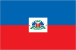
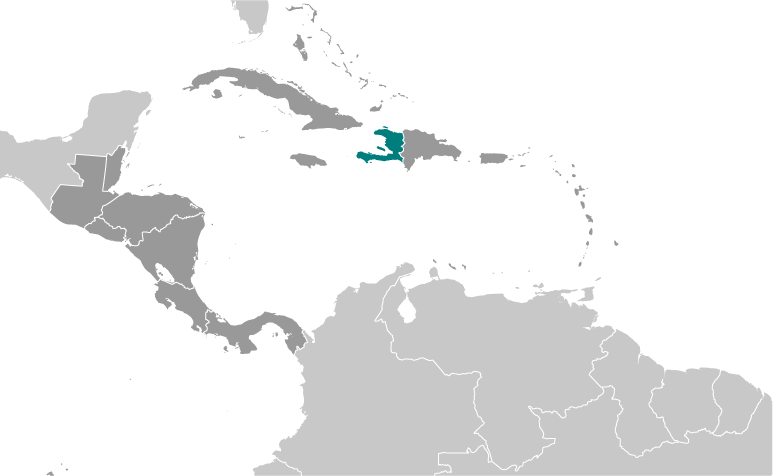
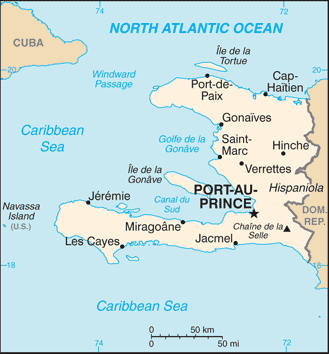

# Haiti

## Introduction

**_Background:_**   
The native Taino - who inhabited the island of Hispaniola when it was discovered by Christopher COLUMBUS in 1492 - were virtually annihilated by Spanish settlers within 25 years. In the early 17th century, the French established a presence on Hispaniola. In 1697, Spain ceded to the French the western third of the island, which later became Haiti. The French colony, based on forestry and sugar-related industries, became one of the wealthiest in the Caribbean but only through the heavy importation of African slaves and considerable environmental degradation. In the late 18th century, Haiti's nearly half million slaves revolted under Toussaint L'OUVERTURE. After a prolonged struggle, Haiti became the first post-colonial black-led nation in the world, declaring its independence in 1804. Currently the poorest country in the Western Hemisphere, Haiti has experienced political instability for most of its history. After an armed rebellion led to the forced resignation and exile of President Jean-Bertrand ARISTIDE in February 2004, an interim government took office to organize new elections under the auspices of the United Nations. Continued instability and technical delays prompted repeated postponements, but Haiti inaugurated a democratically elected president and parliament in May of 2006. This was followed by contested elections in 2010 that resulted in the election of Haiti's current President, Michel MARTELLY. A massive magnitude 7.0 earthquake struck Haiti in January 2010 with an epicenter about 25 km (15 mi) west of the capital, Port-au-Prince. Estimates are that over 300,000 people were killed and some 1.5 million left homeless. The earthquake was assessed as the worst in this region over the last 200 years.

## Geography

**_Location:_**   
Caribbean, western one-third of the island of Hispaniola, between the Caribbean Sea and the North Atlantic Ocean, west of the Dominican Republic

**_Geographic coordinates:_**   
19 00 N, 72 25 W

**_Map references:_**   
Central America and the Caribbean

**_Area:_**   
**total:** 27,750 sq km   
**land:** 27,560 sq km   
**water:** 190 sq km

**_Area - comparative:_**   
slightly smaller than Maryland

**_Land boundaries:_**   
**total:** 376 km   
**border countries:** Dominican Republic 376 km

**_Coastline:_**   
1,771 km

**_Maritime claims:_**   
**territorial sea:** 12 nm   
**contiguous zone:** 24 nm   
**exclusive economic zone:** 200 nm   
**continental shelf:** to depth of exploitation

**_Climate:_**   
tropical; semiarid where mountains in east cut off trade winds

**_Terrain:_**   
mostly rough and mountainous

**_Elevation extremes:_**   
**lowest point:** Caribbean Sea 0 m   
**highest point:** Chaine de la Selle 2,680 m

**_Natural resources:_**   
bauxite, copper, calcium carbonate, gold, marble, hydropower

**_Land use:_**   
**arable land:** 36.04%   
**permanent crops:** 10.09%   
**other:** 53.87% (2011)

**_Irrigated land:_**   
970 sq km (2009)

**_Total renewable water resources:_**   
14.03 cu km (2011)

**_Freshwater withdrawal (domestic/industrial/agricultural):_**   
**total:** 1.2 cu km/yr (17%/3%/80%)   
**per capita:** 134.3 cu m/yr (2009)

**_Natural hazards:_**   
lies in the middle of the hurricane belt and subject to severe storms from June to October; occasional flooding and earthquakes; periodic droughts

**_Environment - current issues:_**   
extensive deforestation (much of the remaining forested land is being cleared for agriculture and used as fuel); soil erosion; inadequate supplies of potable water

**_Environment - international agreements:_**   
**party to:** Biodiversity, Climate Change, Climate Change-Kyoto Protocol, Desertification, Law of the Sea, Marine Dumping, Marine Life Conservation, Ozone Layer Protection   
**signed, but not ratified:** Hazardous Wastes

**_Geography - note:_**   
shares island of Hispaniola with Dominican Republic (western one-third is Haiti, eastern two-thirds is the Dominican Republic)

## People and Society

**_Nationality:_**   
**noun:** Haitian(s)   
**adjective:** Haitian

**_Ethnic groups:_**   
black 95%, mulatto and white 5%

**_Languages:_**   
French (official), Creole (official)

**_Religions:_**   
Roman Catholic 80%, Protestant 16% (Baptist 10%, Pentecostal 4%, Adventist 1%, other 1%), none 1%, other 3%   
**note:** roughly half of the population practices voodoo

**_Population:_**   
9,996,731   
**note:** estimates for this country explicitly take into account the effects of excess mortality due to AIDS; this can result in lower life expectancy, higher infant mortality, higher death rates, lower population growth rates, and changes in the distribution of population by age and sex than would otherwise be expected (July 2014 est.)

**_Age structure:_**   
**0-14 years:** 34% (male 1,701,559/female 1,693,236)   
**15-24 years:** 21.6% (male 1,078,994/female 1,081,005)   
**25-54 years:** 35.3% (male 1,755,722/female 1,770,386)   
**55-64 years:** 5% (male 241,174/female 263,369)   
**65 years and over:** 4.1% (male 183,627/female 227,659) (2014 est.)

**_Dependency ratios:_**   
**total dependency ratio:** 64.2 %   
**youth dependency ratio:** 56.7 %   
**elderly dependency ratio:** 7.5 %   
**potential support ratio:** 13.4 (2014 est.)

**_Median age:_**   
**total:** 22.2 years   
**male:** 22 years   
**female:** 22.4 years (2014 est.)

**_Population growth rate:_**   
1.08%   
**note:** the preliminary 2011 numbers differ significantly from those of 2010, which were strongly influenced by the demographic effect of the January 2010 earthquake; the latest figures more closely correspond to those of 2009 (2014 est.)

**_Birth rate:_**   
22.83 births/1,000 population (2014 est.)

**_Death rate:_**   
7.91 deaths/1,000 population (2014 est.)

**_Net migration rate:_**   
-4.12 migrant(s)/1,000 population (2014 est.)

**_Urbanization:_**   
**urban population:** 53.4% of total population (2011)   
**rate of urbanization:** 3.68% annual rate of change (2010-15 est.)

**_Major urban areas - population:_**   
PORT-AU-PRINCE (capital) 2.207 million (2011)

**_Sex ratio:_**   
**at birth:** 1.01 male(s)/female   
**0-14 years:** 1.01 male(s)/female   
**15-24 years:** 1 male(s)/female   
**25-54 years:** 0.99 male(s)/female   
**55-64 years:** 0.99 male(s)/female   
**65 years and over:** 0.8 male(s)/female   
**total population:** 0.98 male(s)/female (2014 est.)

**_Mother's mean age at first birth:_**   
22.7   
**note:** median age at first birth among women 25-29 (2012)

**_Maternal mortality rate:_**   
350 deaths/100,000 live births (2010)

**_Infant mortality rate:_**   
**total:** 49.43 deaths/1,000 live births   
**male:** 53.26 deaths/1,000 live births   
**female:** 45.56 deaths/1,000 live births   
**note:** the preliminary 2011 numbers differ significantly from those of 2010, which were strongly influenced by the demographic effect of the January 2010 earthquake; the latest figures more closely correspond to those of 2009 (2014 est.)

**_Life expectancy at birth:_**   
**total population:** 63.18 years   
**male:** 61.77 years   
**female:** 64.6 years   
**note:** the preliminary 2011 numbers differ significantly from those of 2010, which were strongly influenced by the demographic effect of the January 2010 earthquake; the latest figures more closely correspond to those of 2009 (2014 est.)

**_Total fertility rate:_**   
2.79 children born/woman (2014 est.)

**_Contraceptive prevalence rate:_**   
34.5% (2012)

**_Health expenditures:_**   
7.9% of GDP (2011)

**_Physicians density:_**   
0.25 physicians/1,000 population (1998)

**_Hospital bed density:_**   
1.3 beds/1,000 population (2007)

**_Drinking water source:_**   
**improved:** urban: 74.6% of population; rural: 47.5% of population; total: 62.4% of population   
**unimproved:** urban: 25.4% of population; rural: 52.5% of population; total: 37.6% of population (2012 est.)

**_Sanitation facility access:_**   
**improved:** urban: 31% of population; rural: 16.3% of population; total: 24.4% of population   
**unimproved:** urban: 69% of population; rural: 83.7% of population; total: 75.6% of population (2012 est.)

**_HIV/AIDS - adult prevalence rate:_**   
2.1% (2012 est.)

**_HIV/AIDS - people living with HIV/AIDS:_**   
146,000 (2012 est.)

**_HIV/AIDS - deaths:_**   
7,500 (2012 est.)

**_Major infectious diseases:_**   
**degree of risk:** high   
**food or waterborne diseases:** bacterial and protozoal diarrhea, hepatitis A and E, and typhoid fever   
**vectorborne diseases:** dengue fever and malaria (2013)

**_Obesity - adult prevalence rate:_**   
7.9% (2008)

**_Children under the age of 5 years underweight:_**   
18.9% (2006)

**_Education expenditures:_**   
NA

**_Literacy:_**   
**definition:** age 15 and over can read and write   
**total population:** 48.7%   
**male:** 53.4%   
**female:** 44.6% (2006 est.)

**_Child labor - children ages 5-14:_**   
**total number:** 2,587,205   
**percentage:** 21 % (2006 est.)

## Government

**_Country name:_**   
**conventional long form:** Republic of Haiti   
**conventional short form:** Haiti   
**local long form:** Republique d'Haiti/Repiblik d'Ayiti   
**local short form:** Haiti/Ayiti

**_Government type:_**   
republic

**_Capital:_**   
**name:** Port-au-Prince   
**geographic coordinates:** 18 32 N, 72 20 W   
**time difference:** UTC-5 (same time as Washington, DC, during Standard Time)   
**daylight saving time:** +1hr, begins second Sunday in March; ends first Sunday in November

**_Administrative divisions:_**   
10 departments (departements, singular - departement); Artibonite, Centre, Grand'Anse, Nippes, Nord, Nord-Est, Nord-Ouest, Ouest, Sud, Sud-Est

**_Independence:_**   
1 January 1804 (from France)

**_National holiday:_**   
Independence Day, 1 January (1804)

**_Constitution:_**   
many previous (23 total); latest adopted 10 March 1987; amended 2012 (2013)

**_Legal system:_**   
civil law system strongly influenced by Napoleonic Code

**_International law organization participation:_**   
accepts compulsory ICJ jurisdiction; non-party state to the ICCt

**_Suffrage:_**   
18 years of age; universal

**_Executive branch:_**   
**chief of state:** President Michel MARTELLY (since 14 May 2011)   
**head of government:** Prime Minister Laurent LAMOTHE (since 16 May 2012)   
**cabinet:** Cabinet chosen by the prime minister in consultation with the president   
**elections:** president elected by popular vote for a five-year term (may not serve consecutive terms); election last held on 28 November 2010; runoff on 20 March 2011 (next to be held in 2015); prime minister appointed by the president, ratified by the National Assembly   
**election results:** Michel MARTELLY elected president in runoff with 67.6% of the vote against Mirlande MANIGAT with 31.7%

**_Legislative branch:_**   
bicameral National Assembly or Assemblee Nationale consists of the Senate (30 seats; members elected by popular vote to serve six-year terms; one-third elected every two years) and the Chamber of Deputies (99 seats; members elected by popular vote to serve four-year terms);   
**elections:** Senate - last held on 28 November 2010 with run-off elections on 20 March 2011 (next regular election, for one third of seats, scheduled for 2012 but delayed); Chamber of Deputies - last held on 28 November 2010 with run-off elections on 20 March 2011 (next regular election to be held in 2014)   
**election results:** 2010 Senate - percent of vote by party - NA; seats by party - Inite 6, ALTENATIV 4, LAVNI 1; 2010 Chamber of Deputies- percent of vote by party - NA; seats by party - Inite 32, Altenativ 11, Ansanm Nou Fo 10, AAA 8, LAVNI 7, RASANBLE 4, KONBIT 3, MOCHRENA 3, Platforme Liberation 3, PONT 3, Repons Peyizan 3, Independent 2, MAS 2, MODELH-PRDH 1, PLAPH 1, RESPE 1, Veye Yo 1, vacant 4

**_Judicial branch:_**   
**highest court(s):** Supreme Court or Cour de Cassation (consists of a chief judge and other judges); note - Haiti is a member of the Caribbean Court of Justice   
**judge selection and term of office:** judges appointed by the president from candidate lists submitted by the Senate of the National Assembly; note - Article 174 of the Haiti Constitution states "Judges of the Supreme Court.... are appointed for 10 years." whereas Article 177 states "Judges of the Supreme Court..... are appointed for life."   
**subordinate courts:** Courts of Appeal; Courts of First Instance; magistrates' courts; special courts

**_Political parties and leaders:_**   
Assembly of Progressive National Democrats or RDNP [Mirlande MANIGAT]   
Christian and Citizen For Haiti's Reconstruction or ACCRHA [Chavannes JEUNE]   
Convention for Democratic Unity or KID [Evans PAUL]   
Cooperative Action to Rebuild Haiti or KONBA [Jean William JEANTY]   
December 16 Platform or Platfom 16 Desanm [Dr. Gerard BLOT]   
Democratic Alliance or ALYANS [Evans PAUL] (coalition composed of KID and PPRH)   
Democratic Centers's National Council or CONACED [Osner FEVRY]   
Democratic Movement for the Liberation of Haiti-Revolutionary Party of Haiti or MODELH-PRDH   
Effort and Solidarity to Create an Alternative for the People or ESKAMP [Joseph JASME]   
Fanmi Lavalas or FL [Jean-Bertrand ARISTIDE]   
For Us All or PONT [Jean-Marie CHERESTAL]   
Grouping of Citizens for Hope or RESPE [Charles-Henri BAKER]   
Haiti in Action or AAA [Youri LATORTUE]   
Haitians for Haiti [Yvon NEPTUNE]   
Independent Movement for National Reconstruction or MIRN [Luc FLEURINORD]   
Konbit Pou refe Ayiti or KONBIT   
Lavni Organization or LAVNI [Yves CRISTALIN]   
Liberal Party of Haiti or PLH [Jean Andre VICTOR]   
Liberation Platform or PLATFORME LIBERATION   
Love Haiti or Renmen Ayiti [Jean-Henry CEANT and Camille LEBLANC]   
Merging of Haitian Social Democratics or FUSION [Edmonde Supplice BEAUZILE] (coalition of Ayiti Capable, Haitian National Revolutionary Party, and National Congress of Democratic Movements)   
Mobilization for National Development or MDN [Hubert de RONCERAY]   
National Front for the Reconstruction of Haiti or FRN [Guy PHILIPPE]   
New Christian Movement for a New Haiti or MOCHRENA [Luc MESADIEU]   
Peasant's Response or Repons Peyizan [Michel MARTELLY]   
Platform Alternative for Progress and Democracy or ALTENATIV [Victor BENOIT and Evans PAUL]   
Platform of Haitian Patriots or PLAPH [Dejean BELISAIRE and Himmler REBU]   
Popular Party for the Renewal of Haiti or PPRH [Claude ROMAIN]   
Rally or RASAMBLE   
Respect or RESPE   
Socialist Action Movement or MAS   
Strength in Unity or Ansanm Nou Fo [Leslie VOLTAIRE]   
Struggling People's Organization or OPL [Sauveur PIERRE-ETIENNE]   
Union [Chavannes JEUNE]   
Union of Haitian Citizens for Democracy, Development, and Education or UCADDE [Jeantel JOSEPH]   
Union of Nationalist and Progressive Haitians or UNPH [Edouard FRANCISQUE]   
Unity or Inite [Levaillant LOUIS-JEUNE] (coalition that includes Front for Hope or L'ESPWA)   
Vigilance or Veye Yo [Lavarice GAUDIN]   
Youth for People's Power or JPP [Rene CIVIL]

**_Political pressure groups and leaders:_**   
Autonomous Organizations of Haitian Workers or CATH [Fignole ST-CYR]   
Confederation of Haitian Workers or CTH   
Economic Forum of the Private Sector or EF [Reginald BOULOS]   
Federation of Workers Trade Unions or FOS   
General Organization of Independent Haitian Workers [Patrick NUMAS]   
Grand-Anse Resistance Committee, or KOREGA   
The Haitian Association of Industries or ADIH [Georges SASSINE]   
National Popular Assembly or APN   
Papaye Peasants Movement or MPP [Chavannes JEAN-BAPTISTE]   
Popular Organizations Gathering Power or PROP   
Protestant Federation of Haiti   
Roman Catholic Church

**_International organization participation:_**   
ACP, AOSIS, Caricom, CD, CDB, CELAC, FAO, G-77, IADB, IAEA, IBRD, ICAO, ICRM, IDA, IFAD, IFC, IFRCS, ILO, IMF, IMO, Interpol, IOC, IOM, IPU, ITSO, ITU, ITUC (NGOs), LAES, MIGA, NAM, OAS, OIF, OPANAL, OPCW, PCA, Petrocaribe, UN, UNCTAD, UNESCO, UNIDO, Union Latina, UNWTO, UPU, WCO, WFTU (NGOs), WHO, WIPO, WMO, WTO

**_Diplomatic representation in the US:_**   
**chief of mission:** Ambassador Paul Getty ALTIDOR (since 17 April 2012)   
**chancery:** 2311 Massachusetts Avenue NW, Washington, DC 20008   
**telephone:** [1] (202) 332-4090   
**FAX:** [1] (202) 745-7215   
**consulate(s) general:** Atlanta, Boston, Chicago, Miami, New York, San Juan (Puerto Rico)   
**consulate(s):** Orlando (FL)

**_Diplomatic representation from the US:_**   
**chief of mission:** Ambassador Pamela A. WHITE (since 18 July 2012)   
**embassy:** Tabarre 41, Route de Tabarre, Port-au-Prince   
**mailing address:** (in Haiti) P.O. Box 1634, Port-au-Prince, Haiti; (from abroad) 3400 Port-au-Prince, State Department, Washington, DC 20521-3400   
**telephone:** [509] 2229-8000   
**FAX:** [509] 229-8028

**_Flag description:_**   
two equal horizontal bands of blue (top) and red with a centered white rectangle bearing the coat of arms, which contains a palm tree flanked by flags and two cannons above a scroll bearing the motto L'UNION FAIT LA FORCE (Union Makes Strength); the colors are taken from the French Tricolor and represent the union of blacks and mulattoes

**_National symbol(s):_**   
Hispaniolan trogon (bird)

**_National anthem:_**   
**name:** "La Dessalinienne" (The Dessalines Song)   
**lyrics/music:** Justin LHERISSON/Nicolas GEFFRARD   
**note:** adopted 1904; the anthem is named for Jean-Jacques DESSALINES, a leader in the Haitian Revolution and first ruler of an independent Haiti

## Economy

**_Economy - overview:_**   
Haiti is a free market economy that enjoys the advantages of low labor costs and tariff-free access to the US for many of its exports. Poverty, corruption, vulnerability to natural disasters, and low levels of education for much of the population are among Haiti's most serious impediments to economic growth. Haiti's economy suffered a severe setback in January 2010 when a 7.0 magnitude earthquake destroyed much of its capital city, Port-au-Prince, and neighboring areas. Currently the poorest country in the Western Hemisphere with 80% of the population living under the poverty line and 54% in abject poverty, the earthquake further inflicted $7.8 billion in damage and caused the country's GDP to contract. In 2011, the Haitian economy began recovering from the earthquake. However, two hurricanes adversely affected agricultural output and the low public capital spending slowed the recovery in 2012. Two-fifths of all Haitians depend on the agricultural sector, mainly small-scale subsistence farming, and remain vulnerable to damage from frequent natural disasters, exacerbated by the country's widespread deforestation. US economic engagement under the Caribbean Basin Trade Preference Agreement (CBTPA) and the 2008 Haitian Hemispheric Opportunity through Partnership Encouragement (HOPE II) Act helped increase apparel exports and investment by providing duty-free access to the US. Congress voted in 2010 to extend the CBTPA and HOPE II until 2020 under the Haiti Economic Lift Program (HELP) Act; the apparel sector accounts for about 90% of Haitian exports and nearly one-twentieth of GDP. Remittances are the primary source of foreign exchange, equaling one-fifth of GDP and representing more than five times the earnings from exports in 2012. Haiti suffers from a lack of investment, partly because of weak infrastructure such as access to electricity. Haiti's outstanding external debt was cancelled by donor countries following the 2010 earthquake, but has since risen to $1.1 billion as of December 2013. The government relies on formal international economic assistance for fiscal sustainability, with over half of its annual budget coming from outside sources. The MARTELLY administration in 2011 launched a campaign aimed at drawing foreign investment into Haiti as a means for sustainable development. To that end, the MARTELLY government in 2012 created a Commission for Commercial Code Reform, effected reforms to the justice sector, and inaugurated the Caracol industrial park in Haiti's north coast. In 2012, private investment exceeded donor assistance for the first time since the 2010 earthquake.

**_GDP (purchasing power parity):_**   
$13.42 billion (2013 est.)   
$12.98 billion (2012 est.)   
$12.62 billion (2011 est.)   
**note:** data are in 2013 US dollars

**_GDP (official exchange rate):_**   
$8.287 billion (2013 est.)

**_GDP - real growth rate:_**   
3.4% (2013 est.)   
2.8% (2012 est.)   
5.6% (2011 est.)

**_GDP - per capita (PPP):_**   
$1,300 (2013 est.)   
$1,200 (2012 est.)   
$1,200 (2011 est.)   
**note:** data are in 2013 US dollars

**_Gross national saving:_**   
3.7% of GDP (2011 est.)

**_GDP - composition, by sector of origin:_**   
**agriculture:** 24.1%   
**industry:** 19.9%   
**services:** 56% (2013 est.)

**_Agriculture - products:_**   
coffee, mangoes, cocoa, sugarcane, rice, corn, sorghum; wood, vetiver

**_Industries:_**   
textiles, sugar refining, flour milling, cement, light assembly using imported parts

**_Industrial production growth rate:_**   
6% (2013 est.)

**_Labor force:_**   
4.81 million   
**note:** shortage of skilled labor, unskilled labor abundant (2010 est.)

**_Labor force - by occupation:_**   
**agriculture:** 38.1%   
**industry:** 11.5%   
**services:** 50.4% (2010)

**_Unemployment rate:_**   
40.6% (2010 est.)   
**note:** widespread unemployment and underemployment; more than two-thirds of the labor force do not have formal jobs

**_Population below poverty line:_**   
80% (2003 est.)

**_Household income or consumption by percentage share:_**   
**lowest 10%:** 0.7%   
**highest 10%:** 47.7% (2001)

**_Distribution of family income - Gini index:_**   
59.2 (2001)

**_Budget:_**   
**revenues:** $1.989 billion   
**expenditures:** $2.437 billion (2013 est.)

**_Taxes and other revenues:_**   
24% of GDP (2013 est.)

**_Budget surplus (+) or deficit (-):_**   
-5.4% of GDP (2013 est.)

**_Fiscal year:_**   
1 October - 30 September

**_Inflation rate (consumer prices):_**   
6.3% (2013 est.)   
6.3% (2012 est.)

**_Commercial bank prime lending rate:_**   
9.2% (31 December 2013 est.)   
8.93% (31 December 2012 est.)

**_Stock of narrow money:_**   
$1.151 billion (31 December 2013 est.)   
$1.107 billion (31 December 2012 est.)

**_Stock of broad money:_**   
$3.509 billion (31 October 2012 est.)   
$3.43 billion (31 December 2011 est.)

**_Stock of domestic credit:_**   
$1.725 billion (31 December 2013 est.)   
$1.515 billion (31 December 2012 est.)

**_Market value of publicly traded shares:_**   
$NA

**_Current account balance:_**   
-$1.278 billion (2013 est.)   
-$1.358 billion (2012 est.)

**_Exports:_**   
$876.8 million (2013 est.)   
$785 million (2012 est.)

**_Exports - commodities:_**   
apparel, manufactures, oils, cocoa, mangoes, coffee

**_Exports - partners:_**   
US 81.7% (2012)

**_Imports:_**   
$2.697 billion (2013 est.)   
$2.679 billion (2012 est.)

**_Imports - commodities:_**   
food, manufactured goods, machinery and transport equipment, fuels, raw materials

**_Imports - partners:_**   
Dominican Republic 34.5%, US 26.2%, Netherlands Antilles 9.4%, China 7% (2012)

**_Reserves of foreign exchange and gold:_**   
$1.335 billion (31 December 2013 est.)   
$1.287 billion (31 December 2012 est.)

**_Debt - external:_**   
$1.118 billion (31 December 2013 est.)   
$957.6 million (31 December 2012 est.)

**_Stock of direct foreign investment - at home:_**   
$1.123 billion (31 December 2013 est.)   
$963.1 million (31 December 2012 est.)

**_Exchange rates:_**   
gourdes (HTG) per US dollar -   
43.53 (2013 est.)   
41.95 (2012 est.)   
39.8 (2010 est.)   
42.02 (2009)   
39.216 (2008)

## Energy

**_Electricity - production:_**   
726 million kWh (2012 est.)

**_Electricity - consumption:_**   
208.5 million kWh (2012 est.)

**_Electricity - exports:_**   
0 kWh (2012 est.)

**_Electricity - imports:_**   
0 kWh (2012 est.)

**_Electricity - installed generating capacity:_**   
130,000 kW (2012 est.)

**_Electricity - from fossil fuels:_**   
79% of total installed capacity (2011 est.)

**_Electricity - from nuclear fuels:_**   
0% of total installed capacity (2011 est.)

**_Electricity - from hydroelectric plants:_**   
21% of total installed capacity (2011 est.)

**_Electricity - from other renewable sources:_**   
0% of total installed capacity (2011 est.)

**_Crude oil - production:_**   
0 bbl/day (2012 est.)

**_Crude oil - exports:_**   
0 bbl/day (2010 est.)

**_Crude oil - imports:_**   
0 bbl/day (2010 est.)

**_Crude oil - proved reserves:_**   
0 bbl (1 January 2013 est.)

**_Refined petroleum products - production:_**   
0 bbl/day (2011 est.)

**_Refined petroleum products - consumption:_**   
14,000 bbl/day (2011 est.)

**_Refined petroleum products - exports:_**   
0 bbl/day (2012 est.)

**_Refined petroleum products - imports:_**   
15,130 bbl/day (2011 est.)

**_Natural gas - production:_**   
0 cu m (2011 est.)

**_Natural gas - consumption:_**   
0 cu m (2010 est.)

**_Natural gas - exports:_**   
0 cu m (2011 est.)

**_Natural gas - imports:_**   
0 cu m (2011 est.)

**_Natural gas - proved reserves:_**   
0 cu m (1 January 2013 est.)

**_Carbon dioxide emissions from consumption of energy:_**   
2.103 million Mt (2011 est.)

## Communications

**_Telephones - main lines in use:_**   
50,000 (2012)

**_Telephones - mobile cellular:_**   
6.095 million (2012)

**_Telephone system:_**   
**general assessment:** telecommunications infrastructure is among the least developed in Latin America and the Caribbean; domestic facilities barely adequate; international facilities slightly better   
**domestic:** mobile-cellular telephone services are expanding rapidly due, in part, to the introduction of low-cost GSM phones; mobile-cellular teledensity exceeds 40 per 100 persons   
**international:** country code - 509; satellite earth station - 1 Intelsat (Atlantic Ocean) (2010)

**_Broadcast media:_**   
several TV stations, including 1 government-owned; cable TV subscription service available; government-owned radio network; more than 250 private and community radio stations with about 50 FM stations in Port-au-Prince alone (2007)

**_Internet country code:_**   
.ht

**_Internet hosts:_**   
555 (2012)

**_Internet users:_**   
1 million (2009)

## Transportation

**_Airports:_**   
14 (2013)

**_Airports - with paved runways:_**   
**total:** 4   
**2,438 to 3,047 m:** 2   
**914 to 1,523 m:** 2 (2013)

**_Airports - with unpaved runways:_**   
**total:** 10   
**914 to 1,523 m:** 2   
**under 914 m:** 8 (2013)

**_Roadways:_**   
**total:** 4,266 km   
**paved:** 768 km   
**unpaved:** 3,498 km (2009)

**_Ports and terminals:_**   
**major seaport(s):** Cap-Haitien, Gonaives, Jacmel, Port-au-Prince

## Military

**_Military branches:_**   
no regular military forces - small Coast Guard; a Ministry of National Defense established May 2012; the regular Haitian Armed Forces (FAdH) - Army, Navy, and Air Force - have been demobilized but still exist on paper until or unless they are constitutionally abolished (2011)

**_Manpower available for military service:_**   
**males age 16-49:** 2,398,804   
**females age 16-49:** 2,415,039 (2010 est.)

**_Manpower fit for military service:_**   
**males age 16-49:** 1,666,324   
**females age 16-49:** 1,704,364 (2010 est.)

**_Manpower reaching militarily significant age annually:_**   
**male:** 115,246   
**female:** 115,282 (2010 est.)

## Transnational Issues

**_Disputes - international:_**   
since 2004, peacekeepers from the UN Stabilization Mission in Haiti have assisted in maintaining civil order in Haiti; the mission currently includes 6,685 military, 2,607 police, and 443 civilian personnel; despite efforts to control illegal migration, Haitians cross into the Dominican Republic and sail to neighboring countries; Haiti claims US-administered Navassa Island

**_Refugees and internally displaced persons:_**   
**IDPs:** 137,000 (includes only IDPs from the 2010 earthquake living in camps or camp-like situations; information is lacking about IDPs living outside camps or who have left camps) (2014)

**_Trafficking in persons:_**   
**current situation:** Haiti is a source, transit, and destination country for men, women, and children subjected to forced labor and sex trafficking; many of Haiti's trafficking cases involve children recruited to live with families in other towns in the hope of going to school but who instead become forced domestic servants known as restaveks; restaveks are vulnerable to abuse and make up a large proportion of Haiti's population of street children, who are forced into prostitution, begging, and street crime by violent gangs; Haitians are exploited in forced labor in the Dominican Republic, elsewhere in the Caribbean, and the US, and some Dominican women are forced into prostitution in Haiti; women and children living in camps for internally displaced people are at increased risk of sex trafficking and forced labor   
**tier rating:** Tier 2 Watch List - Haiti does not fully comply with the minimum standards for the elimination of trafficking; however, it is making significant efforts to do so; the government has made no discernible progress in prosecuting trafficking offenders largely because Haiti does not have a law specifically prohibiting human trafficking; the government does not provide direct or specialized services for trafficking victims and refers suspected victims to donor-funded NGOs, which provide shelter, food, medical, and psychosocial support; no proactive identification or assistance for adult victims was reported; an inter-ministerial working-group on human trafficking and a national commission for the elimination of the worst forms of child labor hae been created (2013)

**_Illicit drugs:_**   
Caribbean transshipment point for cocaine en route to the US and Europe; substantial bulk cash smuggling activity; Colombian narcotics traffickers favor Haiti for illicit financial transactions; pervasive corruption; significant consumer of cannabis

............................................................   
_Page last updated on June 22, 2014_
