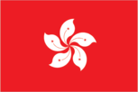
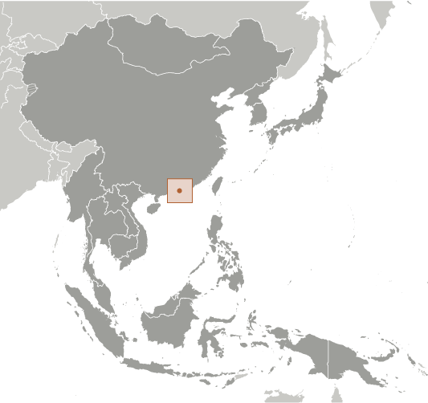
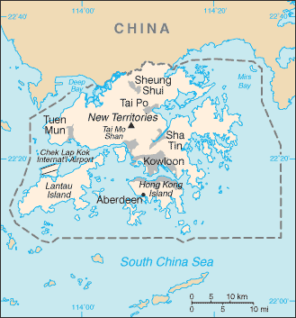

# Hong Kong

_special administrative region of China_

## Introduction

**_Background:_**   
Occupied by the UK in 1841, Hong Kong was formally ceded by China the following year; various adjacent lands were added later in the 19th century. Pursuant to an agreement signed by China and the UK on 19 December 1984, Hong Kong became the Hong Kong Special Administrative Region (SAR) of the People's Republic of China on 1 July 1997. In this agreement, China promised that, under its "one country, two systems" formula, China's socialist economic system would not be imposed on Hong Kong and that Hong Kong would enjoy a "high degree of autonomy" in all matters except foreign and defense affairs for the subsequent 50 years.

## Geography

**_Location:_**   
Eastern Asia, bordering the South China Sea and China

**_Geographic coordinates:_**   
22 15 N, 114 10 E

**_Map references:_**   
Southeast Asia

**_Area:_**   
**total:** 1,104 sq km   
**land:** 1,054 sq km   
**water:** 50 sq km

**_Area - comparative:_**   
six times the size of Washington, DC

**_Land boundaries:_**   
**total:** 33 km   
**regional border:** China 33 km

**_Coastline:_**   
733 km

**_Maritime claims:_**   
**territorial sea:** 3 nm

**_Climate:_**   
subtropical monsoon; cool and humid in winter, hot and rainy from spring through summer, warm and sunny in fall

**_Terrain:_**   
hilly to mountainous with steep slopes; lowlands in north

**_Elevation extremes:_**   
**lowest point:** South China Sea 0 m   
**highest point:** Tai Mo Shan 958 m

**_Natural resources:_**   
outstanding deepwater harbor, feldspar

**_Land use:_**   
**arable land:** 5.05%   
**permanent crops:** 1.01%   
**other:** 93.94% (2011)

**_Irrigated land:_**   
NA; note - included in the total for China

**_Natural hazards:_**   
occasional typhoons

**_Environment - current issues:_**   
air and water pollution from rapid urbanization

**_Environment - international agreements:_**   
**party to:** Marine Dumping (associate member), Ship Pollution (associate member)

**_Geography - note:_**   
composed of more than 200 islands

## People and Society

**_Nationality:_**   
**noun:** Chinese/Hong Konger   
**adjective:** Chinese/Hong Kong

**_Ethnic groups:_**   
Chinese 93.1%, Indonesian 1.9%, Filipino 1.9%, other 3% (2011 est.)

**_Languages:_**   
Cantonese (official) 89.5%, English (official) 3.5%, Putonghua (Mandarin) 1.4%, other Chinese dialects 4%, other 1.6% (2011 est.)

**_Religions:_**   
eclectic mixture of local religions 90%, Christian 10%

**_Population:_**   
7,112,688 (July 2014 est.)

**_Age structure:_**   
**0-14 years:** 12.1% (male 456,638/female 402,462)   
**15-24 years:** 11.5% (male 417,300/female 398,270)   
**25-54 years:** 46.9% (male 1,430,036/female 1,905,585)   
**55-64 years:** 14.8% (male 517,045/female 537,290)   
**65 years and over:** 14.4% (male 493,399/female 554,663) (2014 est.)

**_Dependency ratios:_**   
**total dependency ratio:** 35.5 %   
**youth dependency ratio:** 15.9 %   
**elderly dependency ratio:** 19.6 %   
**potential support ratio:** 5.1 (2014 est.)

**_Median age:_**   
**total:** 43.2 years   
**male:** 42.8 years   
**female:** 43.4 years (2014 est.)

**_Population growth rate:_**   
0.41% (2014 est.)

**_Birth rate:_**   
9.38 births/1,000 population (2014 est.)

**_Death rate:_**   
6.93 deaths/1,000 population (2014 est.)

**_Net migration rate:_**   
1.69 migrant(s)/1,000 population (2014 est.)

**_Urbanization:_**   
**urban population:** 100% of total population (2011)   
**rate of urbanization:** 1.04% annual rate of change (2010-15 est.)

**_Sex ratio:_**   
**at birth:** 1.13 male(s)/female   
**0-14 years:** 1.14 male(s)/female   
**15-24 years:** 1.05 male(s)/female   
**25-54 years:** 0.75 male(s)/female   
**55-64 years:** 0.87 male(s)/female   
**65 years and over:** 0.88 male(s)/female   
**total population:** 0.94 male(s)/female (2014 est.)

**_Mother's mean age at first birth:_**   
29.8 (2008 est.)

**_Infant mortality rate:_**   
**total:** 2.73 deaths/1,000 live births   
**male:** 2.97 deaths/1,000 live births   
**female:** 2.46 deaths/1,000 live births (2014 est.)

**_Life expectancy at birth:_**   
**total population:** 82.78 years   
**male:** 80.18 years   
**female:** 85.71 years (2014 est.)

**_Total fertility rate:_**   
1.17 children born/woman (2014 est.)

**_Contraceptive prevalence rate:_**   
79.5% (2007)

**_HIV/AIDS - adult prevalence rate:_**   
0.1% (2003 est.)

**_HIV/AIDS - people living with HIV/AIDS:_**   
2,600 (2003 est.)

**_HIV/AIDS - deaths:_**   
fewer than 200 (2003 est.)

**_Education expenditures:_**   
3.5% of GDP (2012)

**_Literacy:_**   
**definition:** age 15 and over has ever attended school   
**total population:** 93.5%   
**male:** 96.9%   
**female:** 89.6% (2002)

**_School life expectancy (primary to tertiary education):_**   
**total:** 16 years   
**male:** 15 years   
**female:** 15 years (2012)

**_Unemployment, youth ages 15-24:_**   
**total:** 9.3%   
**male:** 10.9%   
**female:** 7.8% (2012)

## Government

**_Country name:_**   
**conventional long form:** Hong Kong Special Administrative Region   
**conventional short form:** Hong Kong   
**official long form:** Xianggang Tebie Xingzhengqu   
**official short form:** Xianggang   
**abbreviation:** HK

**_Dependency status:_**   
special administrative region of China

**_Government type:_**   
limited democracy

**_Administrative divisions:_**   
none (special administrative region of China)

**_Independence:_**   
none (special administrative region of China)

**_National holiday:_**   
National Day (Anniversary of the Founding of the People's Republic of China), 1 October (1949); note - 1 July 1997 is celebrated as Hong Kong Special Administrative Region Establishment Day

**_Constitution:_**   
several previous (governance documents while under British authority); latest drafted April 1988 to February 1989, approved March 1990, promulgated 4 April 1990 (Basic Law of the Hong Kong Special Administrative Region of the People's Republic of China serves as the constitution); note - since 1990, China's National People's Congress has interpreted specific articles of the Basic Law (2013)

**_Legal system:_**   
mixed legal system of common law based on the English model and Chinese customary law (in matters of family and land tenure)

**_Suffrage:_**   
18 years of age in direct elections for half the legislature and a majority of seats in 18 district councils; universal for permanent residents living in the territory of Hong Kong for the past seven years; note - in indirect elections, suffrage is limited to about 220,000 members of functional constituencies for the other half of the legislature and a 1,200-member election committee for the chief executive drawn from broad sectoral groupings, central government bodies, municipal organizations, and elected Hong Kong officials

**_Executive branch:_**   
**chief of state:** President of China XI Jinping (since 14 March 2013)   
**head of government:** Chief Executive LEUNG Chun-ying [C.Y. LEUNG] (since 1 July 2012)   
**cabinet:** Executive Council or ExCo consists of 15 official members and 14 non-official members   
**elections:** chief executive elected for five-year term by a 1,200-member election committee; LEUNG Chun-ying [C.Y.LEUNG] was elected chief executiveon 25 March 2012 and took office on 1 July 2012; (next to be held in March 2017)   
**note:** the Legislative Council voted in June 2010 to expand the electoral committee to 1,200 seats for the 2012 selection   
**election results:** LEUNG Chun-ying was elected with 689 votes; Henry TANG with 285 votes, and Albert HO with 76 of the 1,132 votes cast; 82 ballots were deemed invalid; most were blank

**_Legislative branch:_**   
unicameral Legislative Council or LegCo (70 seats; 35 members indirectly elected by functional constituencies, 35 elected by popular vote; members serve four-year terms)   
**note:** the LegCo voted in June 2010 to expand to 70 seats for the 2012 election; the measure was approved by the National People's Congress Standing Committee in August 2010   
**elections:** last held on 9 September 2012 (next to be held in September 2016)   
**election results:** percent of vote by block - pro-democracy 56%; pro-Beijing 41%, independent 3%; seats by parties - (pro-Beijing 43) DAB 13, BPA 7, FTU 6, Liberal Party 5, NPP 2, others 10; (pro-democracy 27) Democratic Party 6, Civic Party 6, Labor Party 4, People Power 3, Professional Commons 2, League of Social Democrats 1, ADPL 1, PTU 1, Neo Democrats 1, NWSC 1; independent 2

**_Judicial branch:_**   
**highest court(s):** Court of Final Appeal (consists of the chief justice, 3 permanent judges and 20 non-permanent judges); note - a sitting bench consists of the chief justice and 3 permanent and 1 non-permanent judges   
**judge selection and term of office:** all judges appointed by the Hong Kong Chief Executive upon the recommendation of the Judicial Officers Recommendation Commission, an independent body consisting of the Secretary for Justice and other judges, judicial and legal professionals; permanent judges appointed until normal retirement at age 65, but can be extended; non-permanent judges appointed for renewable 3-year terms without age limit   
**subordinate courts:** High Court (consists of the Court of Appeal and Court of First Instance); District Courts (includes Family and Land Courts); magistrates' courts; specialized tribunals

**_Political parties and leaders:_**   
**parties:** Association for Democracy and People's Livelihood or ADPL [Bruce LIU Sing-lee]; Business and Professional Alliance or BPA [Andrew LEUNG]; Civic Party [EU Audrey]; Democratic Alliance for the Betterment and Progress of Hong Kong or DAB [TAM Yiu-chung]; Democratic Party [Emily LAU]; Labor Party [LEE Cheuk-yan]; League of Social Democrats or LSD [LEUNG Kwok-hung]; Liberal Party [James TIEN]; Neo Democrats [joint leaders]; New People's Party [Regina IP Lau Su-yee]; People Power [Erica YUEN Mi-ming];   
**others:** Confederation of Trade Unions or CTU; Federation of Trade Unions or FTU; Neighborhood and Workers Service Center or NWSC; Professional Commons (think tank) [Charles Peter MOK]; Professional Teachers Union or PTU;   
**note:** political blocs include: pro-democracy - ADPL, Civic Party, Democratic Party, Labor Party, LSD, People Power, Professional Commons; pro-Beijing - DAB, FTU, Liberal Party, New People's Party, BPA; there is no political party ordinance, so there are no registered political parties; politically active groups register as societies or companies

**_Political pressure groups and leaders:_**   
Chinese General Chamber of Commerce (pro-China); Chinese Manufacturers' Association of Hong Kong; Confederation of Trade Unions or CTU (pro-democracy) [LEE Cheuk-yan, general secretary]; Federation of Hong Kong Industries; Federation of Trade Unions or FTU (pro-China) [CHENG Yiu-tong, executive councilor]; Hong Kong Alliance in Support of the Patriotic Democratic Movement in China [LEE Cheuk-yan, chairman]; Hong Kong and Kowloon Trade Union Council (pro-Taiwan); Hong Kong General Chamber of Commerce; Hong Kong Professional Teachers' Union [FUNG Wai-wah, president]; Neighborhood and Workers' Service Center or NWSC [LEUNG Yiu-chung, LegCo member] (pro-democracy); Civic Act-up [Cyd HO Sau-lan, LegCo member] (pro-democracy)

**_International organization participation:_**   
ADB, APEC, BIS, FATF, ICC (national committees), IHO, IMF, IMO (associate), Interpol (subbureau), IOC, ISO (correspondent), ITUC (NGOs), UNWTO (associate), UPU, WCO, WTO

**_Diplomatic representation in the US:_**   
none (Special Administrative Region of China); Hong Kong Economic and Trade Office (HKETO) carries out normal liaison and communication with the US Government and other US entities   
**commissioner:** Clement C.M. LEUNG   
**office:** 1520 18th Street NW, Washington, DC 20036   
**telephone:** [1] 202 331-8947   
**FAX:** [1] 202 331-8958   
**HKETO offices:** New York, San Francisco

**_Diplomatic representation from the US:_**   
**chief of mission:** Consul General Clifford A. HART Jr. (since 30 July 2013); note - also accredited to Macau   
**consulate(s) general:** 26 Garden Road, Hong Kong   
**mailing address:** Unit 8000, Box 1, DPO AP 96521-0006   
**telephone:** [852] 2523-9011   
**FAX:** [852] 2845-1598

**_Flag description:_**   
red with a stylized, white, five-petal Bauhinia flower in the center; each petal contains a small, red, five-pointed star in its middle; the red color is the same as that on the Chinese flag and represents the motherland; the fragrant Bauhinia - developed in Hong Kong the late 19th century - has come to symbolize the region; the five stars echo those on the flag of China

**_National symbol(s):_**   
orchid tree flower

**_National anthem:_**   
**note:** as a Special Administrative Region of China, "Yiyongjun Jinxingqu" is the official anthem (see China)

## Economy

**_Economy - overview:_**   
Hong Kong has a free market economy, highly dependent on international trade and finance - the value of goods and services trade, including the sizable share of re-exports, is about four times GDP. Hong Kong has no tariffs on imported goods, and it levies excise duties on only four commodities, whether imported or produced locally: hard alcohol, tobacco, hydrocarbon oil, and methyl alcohol. There are no quotas or dumping laws. Hong Kong's open economy left it exposed to the global economic slowdown that began in 2008. Although increasing integration with China, through trade, tourism, and financial links, helped it to make an initial recovery more quickly than many observers anticipated, its continued reliance on foreign trade and investment leaves it vulnerable to renewed global financial market volatility or a slowdown in the global economy. The Hong Kong government is promoting the Special Administrative Region (SAR) as the site for Chinese renminbi (RMB) internationalization. Hong Kong residents are allowed to establish RMB-denominated savings accounts; RMB-denominated corporate and Chinese government bonds have been issued in Hong Kong; and RMB trade settlement is allowed. The territory far exceeded the RMB conversion quota set by Beijing for trade settlements in 2010 due to the growth of earnings from exports to the mainland. RMB deposits grew to roughly 12% of total system deposits in Hong Kong by the end of 2013. The government is pursuing efforts to introduce additional use of RMB in Hong Kong financial markets and is seeking to expand the RMB quota. The mainland has long been Hong Kong's largest trading partner, accounting for about half of Hong Kong's total trade by value. Hong Kong's natural resources are limited, and food and raw materials must be imported. As a result of China's easing of travel restrictions, the number of mainland tourists to the territory has surged from 4.5 million in 2001 to 34.9 million in 2012, outnumbering visitors from all other countries combined. Hong Kong has also established itself as the premier stock market for Chinese firms seeking to list abroad. In 2012 mainland Chinese companies constituted about 46.6% of the firms listed on the Hong Kong Stock Exchange and accounted for about 57.4% of the Exchange's market capitalization. During the past decade, as Hong Kong's manufacturing industry moved to the mainland, its service industry has grown rapidly. Credit expansion and tight housing supply conditions have caused Hong Kong property prices to rise rapidly; consumer prices increased by more than 4% in 2013. Lower and middle income segments of the population are increasingly unable to afford adequate housing. Hong Kong continues to link its currency closely to the US dollar, maintaining an arrangement established in 1983. In 2013, Hong Kong and China signed new agreements under the Closer Economic Partnership Agreement, adopted in 2003 to forge closer ties between Hong Kong and the mainland. The new measures, effective from January 2014, cover services and trade facilitation, and will improve access to the mainland's service sector for Hong Kong-based companies.

**_GDP (purchasing power parity):_**   
$381.3 billion (2013 est.)   
$370.6 billion (2012 est.)   
$365.1 billion (2011 est.)   
**note:** data are in 2013 US dollars

**_GDP (official exchange rate):_**   
$272.1 billion (2013 est.)

**_GDP - real growth rate:_**   
2.9% (2013 est.)   
1.5% (2012 est.)   
4.8% (2011 est.)

**_GDP - per capita (PPP):_**   
$52,700 (2013 est.)   
$51,600 (2012 est.)   
$51,300 (2011 est.)   
**note:** data are in 2013 US dollars

**_Gross national saving:_**   
28.6% of GDP (2013 est.)   
28.3% of GDP (2012 est.)   
29.7% of GDP (2011 est.)

**_GDP - composition, by end use:_**   
**household consumption:** 66.1%   
**government consumption:** 9.4%   
**investment in fixed capital:** 23.7%   
**investment in inventories:** 0.1%   
**exports of goods and services:** 230%   
**imports of goods and services:** -229%; (2013 est.)

**_GDP - composition, by sector of origin:_**   
**agriculture:** 0%   
**industry:** 6.9%   
**services:** 93% (2013 est.)

**_Agriculture - products:_**   
fresh vegetables and fruit; poultry, pork; fish

**_Industries:_**   
textiles, clothing, tourism, banking, shipping, electronics, plastics, toys, watches, clocks

**_Industrial production growth rate:_**   
0% (2013 est.)

**_Labor force:_**   
3.873 million (2013 est.)

**_Labor force - by occupation:_**   
**manufacturing:** 3.8%   
**construction:** 2.8%   
**wholesale and retail trade, restaurants, and hotels:** 53.3%   
**financing, insurance, and real estate:** 12.5%   
**transport and communications:** 10.1%   
**community and social services:** 17.1%   
**note:** above data exclude public sector (2013 est.)

**_Unemployment rate:_**   
3.1% (2013 est.)   
3.3% (2012 est.)

**_Population below poverty line:_**   
19.6% (2012)

**_Household income or consumption by percentage share:_**   
**lowest 10%:** NA%   
**highest 10%:** NA%

**_Distribution of family income - Gini index:_**   
53.7 (2011)   
53.3 (2007)

**_Budget:_**   
**revenues:** $59.33 billion   
**expenditures:** $54.23 billion (2013 est.)

**_Taxes and other revenues:_**   
21.2% of GDP (2013 est.)

**_Budget surplus (+) or deficit (-):_**   
1.8% of GDP (2013 est.)

**_Public debt:_**   
35.6% of GDP (2013 est.)   
37.8% of GDP (2012 est.)

**_Fiscal year:_**   
1 April - 31 March

**_Inflation rate (consumer prices):_**   
4.4% (2013 est.)   
4.1% (2012 est.)

**_Central bank discount rate:_**   
0.5% (31 December 2013)   
0.5% (31 December 2012)

**_Commercial bank prime lending rate:_**   
5% (31 December 2013 est.)   
5% (31 December 2012 est.)

**_Stock of narrow money:_**   
$193.7 billion (31 December 2013 est.)   
$176.6 billion (31 December 2012 est.)

**_Stock of broad money:_**   
$1.289 trillion (31 December 2013 est.)   
$1.148 trillion (31 December 2012 est.)

**_Stock of domestic credit:_**   
$827.9 billion (31 December 2013 est.)   
$714 billion (31 December 2012 est.)

**_Market value of publicly traded shares:_**   
$3.082 trillion (31 December 2013 est.)   
$2.814 trillion (31 December 2012)   
$2.248 trillion (31 December 2011 est.)

**_Current account balance:_**   
$5.614 billion (2013 est.)   
$4.122 billion (2012 est.)

**_Exports:_**   
$456.4 billion (2013 est.)   
$440.3 billion (2012 est.)

**_Exports - commodities:_**   
electrical machinery and appliances, textiles, apparel, footwear, watches and clocks, toys, plastics, precious stones, printed material

**_Exports - partners:_**   
China 57.7%, US 8.9%, Japan 4.2% (2012 est.)

**_Imports:_**   
$520.6 billion (2013 est.)   
$501.6 billion (2012 est.)

**_Imports - commodities:_**   
raw materials and semi-manufactures, consumer goods, capital goods, foodstuffs, fuel (most is reexported)

**_Imports - partners:_**   
China 44.5%, Japan 8%, Taiwan 6.8%, South Korea 5.5%, US 4.9% (2012 est.)

**_Reserves of foreign exchange and gold:_**   
$311.2 billion (31 December 2013 est.)   
$317.3 billion (31 December 2012 est.)

**_Debt - external:_**   
$1.159 trillion (31 December 2013 est.)   
$1.024 trillion (31 December 2012 est.)

**_Stock of direct foreign investment - at home:_**   
$1.502 trillion (31 December 2013 est.)   
$1.237 trillion (31 December 2012 est.)

**_Stock of direct foreign investment - abroad:_**   
$1.392 trillion (31 December 2013 est.)   
$1.155 trillion (31 December 2012 est.)

**_Exchange rates:_**   
Hong Kong dollars (HKD) per US dollar -   
7.772 (2013 est.)   
7.756 (2012 est.)   
7.77 (2010 est.)   
7.75 (2009)   
7.751 (2008)

## Energy

**_Electricity - production:_**   
39.97 billion kWh (2013 est.)

**_Electricity - consumption:_**   
44.21 billion kWh (2013 est.)

**_Electricity - exports:_**   
1.65 billion kWh (2013 est.)

**_Electricity - imports:_**   
11.47 billion kWh (2013 est.)

**_Electricity - installed generating capacity:_**   
10.67 million kW (2013 est.)

**_Electricity - from fossil fuels:_**   
100% of total installed capacity (2013 est.)

**_Electricity - from nuclear fuels:_**   
0% of total installed capacity (2013 est.)

**_Electricity - from hydroelectric plants:_**   
0% of total installed capacity (2013 est.)

**_Electricity - from other renewable sources:_**   
0% of total installed capacity (2013 est.)

**_Crude oil - production:_**   
0 bbl/day (2013 est.)

**_Crude oil - exports:_**   
0 bbl/day (2013 est.)

**_Crude oil - imports:_**   
0 bbl/day (2013 est.)

**_Crude oil - proved reserves:_**   
0 bbl (1 January 2013 est.)

**_Refined petroleum products - production:_**   
0 bbl/day (2013 est.)

**_Refined petroleum products - consumption:_**   
333,900 bbl/day (2013 est.)

**_Refined petroleum products - exports:_**   
12,010 bbl/day (2013 est.)

**_Refined petroleum products - imports:_**   
345,900 bbl/day (2013 est.)

**_Natural gas - production:_**   
0 cu m (2013 est.)

**_Natural gas - consumption:_**   
3.097 billion cu m (2013 est.)

**_Natural gas - exports:_**   
0 cu m (2013 est.)

**_Natural gas - imports:_**   
3.097 billion cu m (2013 est.)

**_Natural gas - proved reserves:_**   
0 cu m (1 January 2013 est.)

**_Carbon dioxide emissions from consumption of energy:_**   
92.91 million Mt (2011 est.)

## Communications

**_Telephones - main lines in use:_**   
4.362 million (2012)

**_Telephones - mobile cellular:_**   
16.403 million (2012)

**_Telephone system:_**   
**general assessment:** modern facilities provide excellent domestic and international services   
**domestic:** microwave radio relay links and extensive fiber-optic network   
**international:** country code - 852; multiple international submarine cables provide connections to Asia, US, Australia, the Middle East, and Western Europe; satellite earth stations - 3 Intelsat (1 Pacific Ocean and 2 Indian Ocean); coaxial cable to Guangzhou, China (2012)

**_Broadcast media:_**   
2 commercial terrestrial TV networks each with multiple stations; multi-channel satellite and cable TV systems available; 3 radio networks, one of which is government-funded, operate about 15 radio stations (2012)

**_Internet country code:_**   
.hk

**_Internet hosts:_**   
870,041 (2012)

**_Internet users:_**   
4.873 million (2009)

## Transportation

**_Airports:_**   
2 (2013)

**_Airports - with paved runways:_**   
**total:** 2   
**over 3,047 m:** 1   
**1,524 to 2,437 m:** 1 (2013)

**_Heliports:_**   
9 (2013)

**_Roadways:_**   
**total:** 2,090 km   
**paved:** 2,090 km (2012)

**_Merchant marine:_**   
**total:** 1,644   
**by type:** barge carrier 2, bulk carrier 785, cargo 198, carrier 10, chemical tanker 149, container 288, liquefied gas 31, passenger 4, passenger/cargo 9, petroleum tanker 156, roll on/roll off 5, vehicle carrier 7   
**foreign-owned:** 976 (Bangladesh 1, Belgium 26, Bermuda 20, Canada 77, China 500, Cyprus 3, Denmark 42, France 4, Germany 10, Greece 27, Indonesia 10, Iran 3, Japan 79, Libya 1, Norway 48, Russia 1, Singapore 13, South Korea 3, Switzerland 5, Taiwan 25, UAE 1, UK 33, US 44)   
**registered in other countries:** 341 (Bahamas 3, Bermuda 4, Cambodia 10, China 18, Curacao 1, Cyprus 2, Georgia 3, India 2, Kiribati 2, Liberia 48, Malaysia 8, Malta 4, Marshall Islands 3, NZ 1, Panama 144, Saint Vincent and the Grenadines 5, Seychelles 1, Sierra Leone 7, Singapore 46, Thailand 1, UK 12, unknown 16) (2010)

**_Ports and terminals:_**   
**major seaport(s):** Hong Kong

## Military

**_Military branches:_**   
no regular indigenous military forces; Hong Kong garrison of China's People's Liberation Army (PLA) includes elements of the PLA Ground Forces, PLA Navy, and PLA Air Force; these forces are under the direct leadership of the Central Military Commission in Beijing and under administrative control of the adjacent Guangzhou Military Region (2012)

**_Manpower available for military service:_**   
**males age 16-49:** 1,704,090   
**females age 16-49:** 1,873,175 (2010 est.)

**_Manpower fit for military service:_**   
**males age 16-49:** 1,387,213   
**females age 16-49:** 1,505,875 (2010 est.)

**_Manpower reaching militarily significant age annually:_**   
**male:** 39,579   
**female:** 36,554 (2010 est.)

**_Military - note:_**   
defense is the responsibility of China

## Transnational Issues

**_Disputes - international:_**   
Hong Kong plans to reduce its 2,800-hectare Frontier Closed Area (FCA) to 400 hectares by 2015; the FCA was established in 1951 as a buffer zone between Hong Kong and mainland China to prevent illegal migration from and the smuggling of goods

**_Illicit drugs:_**   
despite strenuous law enforcement efforts, faces difficult challenges in controlling transit of heroin and methamphetamine to regional and world markets; modern banking system provides conduit for money laundering; rising indigenous use of synthetic drugs, especially among young people

............................................................   
_Page last updated on June 22, 2014_
