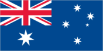

# Heard Island and McDonald Islands

_territory of Australia_

## Introduction

**_Background:_**   
The United Kingdom transferred these uninhabited, barren, sub-Antarctic islands to Australia in 1947. Populated by large numbers of seal and bird species, the islands have been designated a nature preserve.

## Geography

**_Location:_**   
islands in the Indian Ocean, about two-thirds of the way from Madagascar to Antarctica

**_Geographic coordinates:_**   
53 06 S, 72 31 E

**_Map references:_**   
Antarctic Region

**_Area:_**   
**total:** 412 sq km   
**land:** 412 sq km   
**water:** 0 sq km

**_Area - comparative:_**   
slightly more than two times the size of Washington, DC

**_Land boundaries:_**   
0 km

**_Coastline:_**   
101.9 km

**_Maritime claims:_**   
**territorial sea:** 12 nm   
**exclusive fishing zone:** 200 nm

**_Climate:_**   
antarctic

**_Terrain:_**   
Heard Island - 80% ice-covered, bleak and mountainous, dominated by a large massif (Big Ben) and an active volcano (Mawson Peak); McDonald Islands - small and rocky

**_Elevation extremes:_**   
**lowest point:** Indian Ocean 0 m   
**highest point:** Mawson Peak on Big Ben volcano 2,745 m

**_Natural resources:_**   
fish

**_Land use:_**   
**arable land:** 0%   
**permanent crops:** 0%   
**other:** 100% (2011)

**_Irrigated land:_**   
0 sq km (2011)

**_Natural hazards:_**   
Mawson Peak, an active volcano, is on Heard Island

**_Environment - current issues:_**   
NA

**_Geography - note:_**   
Mawson Peak on Heard Island is the highest Australian mountain (at 2,745 meters, it is taller than Mt. Kosciuszko in Australia proper), and one of only two active volcanoes located in Australian territory, the other being McDonald Island; in 1992, McDonald Island broke its dormancy and began erupting; it has erupted several times since, most recently in 2005

## People and Society

**_Population:_**   
uninhabited

## Government

**_Country name:_**   
**conventional long form:** Territory of Heard Island and McDonald Islands   
**conventional short form:** Heard Island and McDonald Islands   
**abbreviation:** HIMI

**_Dependency status:_**   
territory of Australia; administered from Canberra by the Department of Sustainability, Environment, Water, Population and Communities (Australian Antarctic Division)

**_Legal system:_**   
the laws of Australia, where applicable, apply

**_Diplomatic representation in the US:_**   
none (territory of Australia)

**_Diplomatic representation from the US:_**   
none (territory of Australia)

**_Flag description:_**   
the flag of Australia is used

## Economy

**_Economy - overview:_**   
The islands have no indigenous economic activity, but the Australian Government allows limited fishing in the surrounding waters. Visits to Heard Island typically focus on terrestrial and marine research and infrequent private expeditions.

## Communications

**_Internet country code:_**   
.hm

**_Internet hosts:_**   
102 (2012)

## Transportation

**_Ports and terminals:_**   
none; offshore anchorage only

## Military

**_Military - note:_**   
defense is the responsibility of Australia; Australia conducts fisheries patrols

## Transnational Issues

**_Disputes - international:_**   
none

............................................................   
_Page last updated on March 27, 2014_
