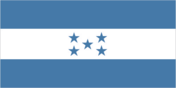
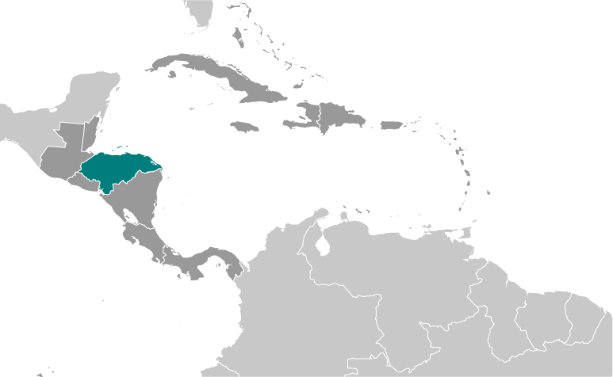
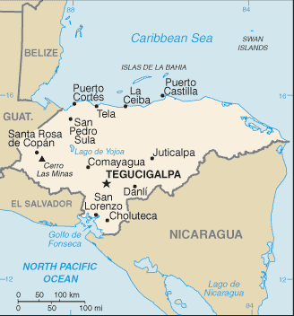

# Honduras

## Introduction

**_Background:_**   
Once part of Spain's vast empire in the New World, Honduras became an independent nation in 1821. After two and a half decades of mostly military rule, a freely elected civilian government came to power in 1982. During the 1980s, Honduras proved a haven for anti-Sandinista contras fighting the Marxist Nicaraguan Government and an ally to Salvadoran Government forces fighting leftist guerrillas. The country was devastated by Hurricane Mitch in 1998, which killed about 5,600 people and caused approximately $2 billion in damage. Since then, the economy has slowly rebounded.

## Geography

**_Location:_**   
Central America, bordering the Caribbean Sea, between Guatemala and Nicaragua and bordering the Gulf of Fonseca (North Pacific Ocean), between El Salvador and Nicaragua

**_Geographic coordinates:_**   
15 00 N, 86 30 W

**_Map references:_**   
Central America and the Caribbean

**_Area:_**   
**total:** 112,090 sq km   
**land:** 111,890 sq km   
**water:** 200 sq km

**_Area - comparative:_**   
slightly larger than Tennessee

**_Land boundaries:_**   
**total:** 1,575 km   
**border countries:** Guatemala 244 km, El Salvador 391 km, Nicaragua 940 km

**_Coastline:_**   
Caribbean Sea 669 km; Gulf of Fonseca 163 km

**_Maritime claims:_**   
**territorial sea:** 12 nm   
**contiguous zone:** 24 nm   
**exclusive economic zone:** 200 nm   
**continental shelf:** natural extension of territory or to 200 nm

**_Climate:_**   
subtropical in lowlands, temperate in mountains

**_Terrain:_**   
mostly mountains in interior, narrow coastal plains

**_Elevation extremes:_**   
**lowest point:** Caribbean Sea 0 m   
**highest point:** Cerro Las Minas 2,870 m

**_Natural resources:_**   
timber, gold, silver, copper, lead, zinc, iron ore, antimony, coal, fish, hydropower

**_Land use:_**   
**arable land:** 9.07%   
**permanent crops:** 3.91%   
**other:** 87.02% (2011)

**_Irrigated land:_**   
878.5 sq km (2007)

**_Total renewable water resources:_**   
95.93 cu km (2011)

**_Freshwater withdrawal (domestic/industrial/agricultural):_**   
**total:** 2.12 cu km/yr (16%/23%/61%)   
**per capita:** 295.6 cu m/yr (2006)

**_Natural hazards:_**   
frequent, but generally mild, earthquakes; extremely susceptible to damaging hurricanes and floods along the Caribbean coast

**_Environment - current issues:_**   
urban population expanding; deforestation results from logging and the clearing of land for agricultural purposes; further land degradation and soil erosion hastened by uncontrolled development and improper land use practices such as farming of marginal lands; mining activities polluting Lago de Yojoa (the country's largest source of fresh water), as well as several rivers and streams, with heavy metals

**_Environment - international agreements:_**   
**party to:** Biodiversity, Climate Change, Climate Change-Kyoto Protocol, Desertification, Endangered Species, Hazardous Wastes, Law of the Sea, Marine Dumping, Ozone Layer Protection, Ship Pollution, Tropical Timber 83, Tropical Timber 94, Wetlands   
**signed, but not ratified:** none of the selected agreements

**_Geography - note:_**   
has only a short Pacific coast but a long Caribbean shoreline, including the virtually uninhabited eastern Mosquito Coast

## People and Society

**_Nationality:_**   
**noun:** Honduran(s)   
**adjective:** Honduran

**_Ethnic groups:_**   
mestizo (mixed Amerindian and European) 90%, Amerindian 7%, black 2%, white 1%

**_Languages:_**   
Spanish (official), Amerindian dialects

**_Religions:_**   
Roman Catholic 97%, Protestant 3%

**_Demographic profile:_**   
Honduras is one of the poorest countries in Latin America and has the world's highest murder rate. More than half of the population lives in poverty and per capita income is one of the lowest in the region. Poverty rates are higher among rural and indigenous people and in the south, west, and along the eastern border than in the north and central areas where most of Honduras' industries and infrastructure are concentrated. The increased productivity needed to break Honduras' persistent high poverty rate depends, in part, on further improvements in educational attainment. Although primary-school enrollment is near 100%, educational quality is poor, the drop-out rate and grade repetition remain high, and teacher and school accountability is low.   
Honduras' population growth rate has slowed since the 1990s, but it remains high at nearly 2% annually because the birth rate averages approximately three children per woman and more among rural, indigenous, and poor women. Consequently, Honduras' young adult population - ages 15 to 29 - is projected to continue growing rapidly for the next three decades and then stabilize or slowly shrink. Population growth and limited job prospects outside of agriculture will continue to drive emigration. Remittances represent about a fifth of GDP.

**_Population:_**   
8,598,561   
**note:** estimates for this country explicitly take into account the effects of excess mortality due to AIDS; this can result in lower life expectancy, higher infant mortality, higher death rates, lower population growth rates, and changes in the distribution of population by age and sex than would otherwise be expected (July 2014 est.)

**_Age structure:_**   
**0-14 years:** 34.8% (male 1,529,578/female 1,465,188)   
**15-24 years:** 21.2% (male 928,756/female 892,629)   
**25-54 years:** 35.3% (male 1,530,429/female 1,502,916)   
**55-64 years:** 4.7% (male 187,771/female 217,093)   
**65 years and over:** 3.9% (male 150,681/female 193,520) (2014 est.)

**_Dependency ratios:_**   
**total dependency ratio:** 64.7 %   
**youth dependency ratio:** 57.2 %   
**elderly dependency ratio:** 7.4 %   
**potential support ratio:** 13.5 (2014 est.)

**_Median age:_**   
**total:** 21.9 years   
**male:** 21.6 years   
**female:** 22.3 years (2014 est.)

**_Population growth rate:_**   
1.74% (2014 est.)

**_Birth rate:_**   
23.66 births/1,000 population (2014 est.)

**_Death rate:_**   
5.13 deaths/1,000 population (2014 est.)

**_Net migration rate:_**   
-1.18 migrant(s)/1,000 population (2014 est.)

**_Urbanization:_**   
**urban population:** 52.2% of total population (2011)   
**rate of urbanization:** 3.06% annual rate of change (2010-15 est.)

**_Major urban areas - population:_**   
TEGUCIGALPA (capital) 1.088 million (2011)

**_Sex ratio:_**   
**at birth:** 1.05 male(s)/female   
**0-14 years:** 1.04 male(s)/female   
**15-24 years:** 1.04 male(s)/female   
**25-54 years:** 1.02 male(s)/female   
**55-64 years:** 1.01 male(s)/female   
**65 years and over:** 0.79 male(s)/female   
**total population:** 1.01 male(s)/female (2014 est.)

**_Mother's mean age at first birth:_**   
20.4   
**note:** median age a first birth among women 25-29 (2011-12 est.)

**_Maternal mortality rate:_**   
100 deaths/100,000 live births (2010)

**_Infant mortality rate:_**   
**total:** 18.72 deaths/1,000 live births   
**male:** 21.2 deaths/1,000 live births   
**female:** 16.13 deaths/1,000 live births (2014 est.)

**_Life expectancy at birth:_**   
**total population:** 70.91 years   
**male:** 69.24 years   
**female:** 72.65 years (2014 est.)

**_Total fertility rate:_**   
2.86 children born/woman (2014 est.)

**_Contraceptive prevalence rate:_**   
65.2% (2005/06)

**_Health expenditures:_**   
9.1% of GDP (2009)

**_Physicians density:_**   
0.37 physicians/1,000 population (2005)

**_Hospital bed density:_**   
0.7 beds/1,000 population (2011)

**_Drinking water source:_**   
**improved:** urban: 96.8% of population; rural: 81.5% of population; total: 89.6% of population   
**unimproved:** urban: 3.2% of population; rural: 18.5% of population; total: 10.4% of population (2012 est.)

**_Sanitation facility access:_**   
**improved:** urban: 85.3% of population; rural: 74% of population; total: 80% of population   
**unimproved:** urban: 14.7% of population; rural: 26% of population; total: 20% of population (2012 est.)

**_HIV/AIDS - adult prevalence rate:_**   
0.5% (2012 est.)

**_HIV/AIDS - people living with HIV/AIDS:_**   
25,600 (2012 est.)

**_HIV/AIDS - deaths:_**   
1,700 (2012 est.)

**_Major infectious diseases:_**   
**degree of risk:** high   
**food or waterborne diseases:** bacterial diarrhea, hepatitis A, and typhoid fever   
**vectorborne diseases:** dengue fever and malaria (2013)

**_Obesity - adult prevalence rate:_**   
18.4% (2008)

**_Children under the age of 5 years underweight:_**   
8.6% (2006)

**_Education expenditures:_**   
NA

**_Literacy:_**   
**definition:** age 15 and over can read and write   
**total population:** 85.1%   
**male:** 85.3%   
**female:** 84.9% (2011 est.)

**_School life expectancy (primary to tertiary education):_**   
**total:** 11 years   
**male:** 11 years   
**female:** 12 years (2012)

**_Child labor - children ages 5-14:_**   
**total number:** 280,809   
**percentage:** 16 % (2002 est.)

**_Unemployment, youth ages 15-24:_**   
**total:** 8%   
**male:** 5.5%   
**female:** 13.8% (2011)

## Government

**_Country name:_**   
**conventional long form:** Republic of Honduras   
**conventional short form:** Honduras   
**local long form:** Republica de Honduras   
**local short form:** Honduras

**_Government type:_**   
democratic constitutional republic

**_Capital:_**   
**name:** Tegucigalpa   
**geographic coordinates:** 14 06 N, 87 13 W   
**time difference:** UTC-6 (1 hour behind Washington, DC during Standard Time)   
**daylight saving time:** none scheduled for 2013

**_Administrative divisions:_**   
18 departments (departamentos, singular - departamento); Atlantida, Choluteca, Colon, Comayagua, Copan, Cortes, El Paraiso, Francisco Morazan, Gracias a Dios, Intibuca, Islas de la Bahia, La Paz, Lempira, Ocotepeque, Olancho, Santa Barbara, Valle, Yoro

**_Independence:_**   
15 September 1821 (from Spain)

**_National holiday:_**   
Independence Day, 15 September (1821)

**_Constitution:_**   
several previous; latest approved 11 January 1982, effective 20 January 1982; amended many times, last in 2012 (2013)

**_Legal system:_**   
civil law system

**_International law organization participation:_**   
accepts compulsory ICJ jurisdiction with reservations; accepts ICCt jurisdiction

**_Suffrage:_**   
18 years of age; universal and compulsory

**_Executive branch:_**   
**chief of state:** President Juan Orlando HERNANDEZ Alvarado (since 27 January 2014); Vice Presidents Ricardo ALVAREZ, Rossana GUEVARA, and Lorena HERRERA (since 27 January 2014); note - the president is both chief of state and head of government   
**head of government:** President Juan Orlando HERNANDEZ Alvarado (since 27 January 2014); Vice Presidents Ricardo ALVAREZ, Rossana GUEVARA, and Lorena HERRERA (since 27 January 2014)   
**cabinet:** Cabinet appointed by president   
**elections:** president elected by popular vote for a four-year term; election last held on 24 November 2013 (next to be held in November 2017)   
**election results:** Juan Orlando HERNANDEZ Alvarado elected president; percent of vote - Juan Orlando HERNANDEZ Alvarado 36.9%, Xiomara CASTRO 28.8%, Mauricio VILLEDA 20.3%, Salvador NASRALLA 13.4%

**_Legislative branch:_**   
unicameral National Congress or Congreso Nacional (128 seats; members elected proportionally by department to serve four-year terms)   
**elections:** last held on 24 November 2013 (next to be held in November 2017)   
**election results:** percent of vote by party - NA; seats by party - PNH 48, LIBRE 37, PL 27, PAC 13, DC 1, UD 1, PINU 1

**_Judicial branch:_**   
**highest court(s):** Supreme Court of Justice or Corte Suprema de Justicia (15 principal judges - including the court president - and 7 alternates; court organized into civil, criminal, and labor chambers); note - the court has both judicial and constitutional jurisdiction   
**judge selection and term of office:** court president elected by his peers; judges elected by the National Congress from candidates proposed by the Nominating Board, a diverse 7-member group of judicial officials, other government and non-government officials selected by each of their organizations; judges elected by Congress for renewable, 7-year terms   
**subordinate courts:** courts of appeal; courts of first instance; peace courts

**_Political parties and leaders:_**   
Anti-Corruption Party or PAC [Salvador NASRALLA]   
Christian Democratic Party or DC [Felicito AVILA Ordonez]   
Democratic Unification Party or UD [Cesar HAM]   
Freedom and Refounding Party or LIBRE [Jose Manuel ZELAYA Rosales]   
Liberal Party or PL [Mauricio VILLEDA Bermudez]   
National Party of Honduras or PNH [Gladys Aurora LOPEZ]   
Social Democratic Innovation and Unity Party or PINU [Jorge Rafael AGUILAR Paredes]

**_Political pressure groups and leaders:_**   
Beverage and Related Industries Syndicate or STIBYS   
Committee for the Defense of Human Rights in Honduras or CODEH   
Commiittee of the Relatives of the Disappeared in Honduras or COFADEH   
Confederation of Honduran Workers or CTH   
Coordinating Committee of Popular Organizations or CCOP   
General Workers Confederation or CGT   
Honduran Council of Private Enterprise or COHEP   
National Association of Honduran Campesinos or ANACH   
National Union of Campesinos or UNC   
Popular Bloc or BP   
United Confederation of Honduran Workers or CUTH   
United Farm Workers' Movement of the Aguan OR MUCA

**_International organization participation:_**   
BCIE, CACM, CD, CELAC, FAO, G-11, G-77, IADB, IAEA, IBRD, ICAO, ICRM, IDA, IFAD, IFC, IFRCS, ILO, IMF, IMO, Interpol, IOC (suspended), IOM, IPU, ISO (subscriber), ITSO, ITU, ITUC (NGOs), LAES, LAIA (observer), MIGA, MINURSO, NAM, OAS (suspended), OPANAL, OPCW, Pacific Alliance (observer), PCA, Petrocaribe, SICA, UN, UNCTAD, UNESCO, UNIDO, Union Latina, UNWTO, UPU, WCO (suspended), WFTU (NGOs), WHO, WIPO, WMO, WTO

**_Diplomatic representation in the US:_**   
**chief of mission:** Ambassador Jorge Alberto MILLA Reyes (since 21 May 2014)   
**chancery:** Suite 4-M, 3007 Tilden Street NW, Washington, DC 20008   
**telephone:** [1] (202) 966-2604   
**FAX:** [1] (202) 966-9751   
**consulate(s) general:** Atlanta, Chicago, Dallas, Houston, Los Angeles, McAllen (TX), Miami, New Orleans, New York, San Francisco

**_Diplomatic representation from the US:_**   
**chief of mission:** Ambassador Lisa J. KUBISKE (since 26 July 2011)   
**embassy:** Avenida La Paz, Apartado Postal No. 3453, Tegucigalpa   
**mailing address:** American Embassy, APO AA 34022, Tegucigalpa   
**telephone:** [504] 2236-9320, 2238-5114   
**FAX:** [504] 2236-9037

**_Flag description:_**   
three equal horizontal bands of blue (top), white, and blue, with five blue, five-pointed stars arranged in an X pattern centered in the white band; the stars represent the members of the former Federal Republic of Central America - Costa Rica, El Salvador, Guatemala, Honduras, and Nicaragua; the blue bands symbolize the Pacific Ocean and the Caribbean Sea; the white band represents the land between the two bodies of water and the peace and prosperity of its people   
**note:** similar to the flag of El Salvador, which features a round emblem encircled by the words REPUBLICA DE EL SALVADOR EN LA AMERICA CENTRAL centered in the white band; also similar to the flag of Nicaragua, which features a triangle encircled by the words REPUBLICA DE NICARAGUA on top and AMERICA CENTRAL on the bottom, centered in the white band

**_National symbol(s):_**   
scarlet macaw; white-tailed deer

**_National anthem:_**   
**name:** "Himno Nacional de Honduras" (National Anthem of Honduras)   
**lyrics/music:** Augusto Constancio COELLO/Carlos HARTLING   
**note:** adopted 1915; the anthem's seven verses chronicle Honduran history; on official occasions, only the chorus and last verse are sung

## Economy

**_Economy - overview:_**   
Honduras, the second poorest country in Central America, suffers from extraordinarily unequal distribution of income, as well as high underemployment. While historically dependent on the export of bananas and coffee, Honduras has diversified its export base to include apparel and automobile wire harnessing. Nearly half of Honduras's economic activity is directly tied to the US, with exports to the US accounting for 30% of GDP and remittances for another 20%. The US-Central America-Dominican Republic Free Trade Agreement (CAFTA-DR) came into force in 2006 and has helped foster foreign direct investment, but physical and political insecurity, as well as crime and perceptions of corruption, may deter potential investors; about 70% of FDI is from US firms. The economy registered modest economic growth of 3.0%-4.0% from 2010 to 2012, insufficient to improve living standards for the nearly 65% of the population in poverty. An 18-month IMF Standby Arrangement expired in March 2012 and was not renewed, due to the country's growing budget deficit and weak current account performance. Public sector workers complained of not receiving their salaries in November and December 2012, and government suppliers are owed at least several hundred million dollars in unpaid contracts. The government announced in January 2013 that loss-making public enterprises will be forced to submit financial rescue plans before receiving their budget allotments for 2013.

**_GDP (purchasing power parity):_**   
$39.23 billion (2013 est.)   
$38.16 billion (2012 est.)   
$36.74 billion (2011 est.)   
**note:** data are in 2013 US dollars

**_GDP (official exchange rate):_**   
$18.88 billion (2013 est.)

**_GDP - real growth rate:_**   
2.8% (2013 est.)   
3.9% (2012 est.)   
3.8% (2011 est.)

**_GDP - per capita (PPP):_**   
$4,800 (2013 est.)   
$4,800 (2012 est.)   
$4,700 (2011 est.)   
**note:** data are in 2013 US dollars

**_Gross national saving:_**   
17.7% of GDP (2013 est.)   
16.4% of GDP (2012 est.)   
17.5% of GDP (2011 est.)

**_GDP - composition, by end use:_**   
**household consumption:** 79.5%   
**government consumption:** 16.4%   
**investment in fixed capital:** 25.2%   
**investment in inventories:** 1.2%   
**exports of goods and services:** 51.5%   
**imports of goods and services:** -73.8%; (2013 est.)

**_GDP - composition, by sector of origin:_**   
**agriculture:** 14%   
**industry:** 28.2%   
**services:** 57.8% (2013 est.)

**_Agriculture - products:_**   
bananas, coffee, citrus, corn, African palm; beef; timber; shrimp, tilapia, lobster

**_Industries:_**   
sugar, coffee, woven and knit apparel, wood products, cigars

**_Industrial production growth rate:_**   
4.6% (2013 est.)

**_Labor force:_**   
3.507 million (2013 est.)

**_Labor force - by occupation:_**   
**agriculture:** 39.2%   
**industry:** 20.9%   
**services:** 39.8% (2005 est.)

**_Unemployment rate:_**   
4.5% (2013 est.)   
4.4% (2012 est.)   
**note:** about one-third of the people are underemployed

**_Population below poverty line:_**   
60% (2010 est.)

**_Household income or consumption by percentage share:_**   
**lowest 10%:** 0.4%   
**highest 10%:** 42.4% (2009 est.)

**_Distribution of family income - Gini index:_**   
57.7 (2007)   
53.8 (2003)

**_Budget:_**   
**revenues:** $3.113 billion   
**expenditures:** $4.285 billion (2013 est.)

**_Taxes and other revenues:_**   
16.5% of GDP (2013 est.)

**_Budget surplus (+) or deficit (-):_**   
-6.2% of GDP (2013 est.)

**_Public debt:_**   
40.6% of GDP (2013 est.)   
35.8% of GDP (2012 est.)

**_Fiscal year:_**   
calendar year

**_Inflation rate (consumer prices):_**   
5.2% (2013 est.)   
5.2% (2012 est.)

**_Central bank discount rate:_**   
6.25% (31 December 2010 est.)   
NA% (31 December 2009 est.)

**_Commercial bank prime lending rate:_**   
17.8% (31 December 2013 est.)   
18.45% (31 December 2012 est.)

**_Stock of narrow money:_**   
$1.781 billion (31 December 2013 est.)   
$1.913 billion (31 December 2012 est.)

**_Stock of broad money:_**   
$6.845 billion (31 December 2013 est.)   
$6.801 billion (31 December 2012 est.)

**_Stock of domestic credit:_**   
$10.5 billion (31 December 2013 est.)   
$10.43 billion (31 December 2012 est.)

**_Market value of publicly traded shares:_**   
$NA

**_Current account balance:_**   
-$1.636 billion (2013 est.)   
-$1.744 billion (2012 est.)

**_Exports:_**   
$7.881 billion (2013 est.)   
$7.931 billion (2012 est.)

**_Exports - commodities:_**   
apparel, coffee, shrimp, automobile wire harnesses, cigars, bananas, gold, palm oil, fruit, lobster, lumber

**_Exports - partners:_**   
US 34.5%, Germany 11.6%, Belgium 6.8%, El Salvador 6.6%, Guatemala 4.9%, Nicaragua 4.6% (2012)

**_Imports:_**   
$11.34 billion (2013 est.)   
$11.18 billion (2012 est.)

**_Imports - commodities:_**   
machinery and transport equipment, industrial raw materials, chemical products, fuels, foodstuffs

**_Imports - partners:_**   
US 44.3%, Guatemala 8.5%, El Salvador 5.7%, Mexico 5.6%, China 4.7%, Costa Rica 4.1% (2012)

**_Reserves of foreign exchange and gold:_**   
$2.414 billion (31 December 2013 est.)   
$2.533 billion (31 December 2012 est.)

**_Debt - external:_**   
$6.173 billion (31 December 2013 est.)   
$5.233 billion (31 December 2012 est.)

**_Exchange rates:_**   
lempiras (HNL) per US dollar -   
20.53 (2013 est.)   
19.638 (2012 est.)   
18.9 (2010 est.)   
18.9 (2009)   
18.983 (2008)

## Energy

**_Electricity - production:_**   
6.486 billion kWh (2010 est.)

**_Electricity - consumption:_**   
4.85 billion kWh (2010 est.)

**_Electricity - exports:_**   
22 million kWh (2010 est.)

**_Electricity - imports:_**   
22 million kWh (2010 est.)

**_Electricity - installed generating capacity:_**   
1.701 million kW (2010 est.)

**_Electricity - from fossil fuels:_**   
63.7% of total installed capacity (2010 est.)

**_Electricity - from nuclear fuels:_**   
0% of total installed capacity (2010 est.)

**_Electricity - from hydroelectric plants:_**   
30.9% of total installed capacity (2010 est.)

**_Electricity - from other renewable sources:_**   
5.4% of total installed capacity (2010 est.)

**_Crude oil - production:_**   
20 bbl/day (2012 est.)

**_Crude oil - exports:_**   
0 bbl/day (2010 est.)

**_Crude oil - imports:_**   
0 bbl/day (2010 est.)

**_Crude oil - proved reserves:_**   
0 bbl (1 January 2013 est.)

**_Refined petroleum products - production:_**   
0 bbl/day (2010 est.)

**_Refined petroleum products - consumption:_**   
58,150 bbl/day (2011 est.)

**_Refined petroleum products - exports:_**   
0 bbl/day (2010 est.)

**_Refined petroleum products - imports:_**   
46,370 bbl/day (2010 est.)

**_Natural gas - production:_**   
0 cu m (2011 est.)

**_Natural gas - consumption:_**   
0 cu m (2010 est.)

**_Natural gas - exports:_**   
0 cu m (2011 est.)

**_Natural gas - imports:_**   
0 cu m (2011 est.)

**_Natural gas - proved reserves:_**   
0 cu m (1 January 2013 est.)

**_Carbon dioxide emissions from consumption of energy:_**   
7.975 million Mt (2011 est.)

## Communications

**_Telephones - main lines in use:_**   
610,000 (2012)

**_Telephones - mobile cellular:_**   
7.37 million (2012)

**_Telephone system:_**   
**general assessment:** fixed-line connections are increasing but still limited; competition among multiple providers of mobile-cellular services is contributing to a sharp increase in subscribership   
**domestic:** beginning in 2003, private sub-operators allowed to provide fixed-lines in order to expand telephone coverage contributing to a small increase in fixed-line teledensity; mobile-cellular subscribership is roughly 100 per 100 persons   
**international:** country code - 504; landing point for both the Americas Region Caribbean Ring System (ARCOS-1) and the MAYA-1 fiber-optic submarine cable system that together provide connectivity to South and Central America, parts of the Caribbean, and the US; satellite earth stations - 2 Intelsat (Atlantic Ocean); connected to Central American Microwave System (2011)

**_Broadcast media:_**   
multiple privately owned terrestrial TV networks, supplemented by multiple cable TV networks; Radio Honduras is the lone government-owned radio network; roughly 300 privately owned radio stations (2007)

**_Internet country code:_**   
.hn

**_Internet hosts:_**   
30,955 (2012)

**_Internet users:_**   
731,700 (2009)

## Transportation

**_Airports:_**   
103 (2013)

**_Airports - with paved runways:_**   
**total:** 13   
**2,438 to 3,047 m:** 3   
**1,524 to 2,437 m:** 3   
**914 to 1,523 m:** 4   
**under 914 m:** 3 (2013)

**_Airports - with unpaved runways:_**   
**total:** 90   
**1,524 to 2,437 m:** 1   
**914 to 1,523 m:** 16   
**under 914 m:** 73 (2013)

**_Railways:_**   
**total:** 44 km   
**narrow gauge:** 44 km 1.067-m gauge   
**note:** (4 km are in use) (2012)

**_Roadways:_**   
**total:** 14,742 km   
**paved:** 3,367 km   
**unpaved:** 11,375 km (1,543 km summer only)   
**note:** there are another 8,951 km of non-offical roads used by the coffee industry (2012)

**_Waterways:_**   
465 km (most navigable only by small craft) (2012)

**_Merchant marine:_**   
**total:** 88   
**by type:** bulk carrier 5, cargo 39, carrier 2, chemical tanker 5, container 1, passenger 4, passenger/cargo 1, petroleum tanker 21, refrigerated cargo 7, roll on/roll off 3   
**foreign-owned:** 47 (Bahrain 5, Canada 1, Chile 1, China 2, Egypt 2, Greece 4, Israel 1, Japan 4, Lebanon 2, Montenegro 1, Panama 1, Singapore 11, South Korea 6, Taiwan 1, Thailand 2, UAE 1, UK 1, US 1) (2010)

**_Ports and terminals:_**   
**major seaport(s):** La Ceiba, Puerto Cortes, San Lorenzo, Tela

## Military

**_Military branches:_**   
Honduran Armed Forces (Fuerzas Armadas de Honduras, FFAA): Army, Navy (includes Naval Infantry), Honduran Air Force (Fuerza Aerea Hondurena, FAH) (2012)

**_Military service age and obligation:_**   
18 years of age for voluntary 2- to 3-year military service; no conscription (2012)

**_Manpower available for military service:_**   
**males age 16-49:** 2,045,914   
**females age 16-49:** 1,991,418 (2010 est.)

**_Manpower fit for military service:_**   
**males age 16-49:** 1,525,578   
**females age 16-49:** 1,539,688 (2010 est.)

**_Manpower reaching militarily significant age annually:_**   
**male:** 95,895   
**female:** 92,087 (2010 est.)

**_Military expenditures:_**   
1.05% of GDP (2012)   
1.13% of GDP (2011)   
1.05% of GDP (2010)

## Transnational Issues

**_Disputes - international:_**   
International Court of Justice (ICJ) ruled on the delimitation of "bolsones" (disputed areas) along the El Salvador-Honduras border in 1992 with final settlement by the parties in 2006 after an Organization of American States survey and a further ICJ ruling in 2003; the 1992 ICJ ruling advised a tripartite resolution to a maritime boundary in the Gulf of Fonseca with consideration of Honduran access to the Pacific; El Salvador continues to claim tiny Conejo Island, not mentioned in the ICJ ruling, off Honduras in the Gulf of Fonseca; Honduras claims the Belizean-administered Sapodilla Cays off the coast of Belize in its constitution, but agreed to a joint ecological park around the cays should Guatemala consent to a maritime corridor in the Caribbean under the OAS-sponsored 2002 Belize-Guatemala Differendum

**_Refugees and internally displaced persons:_**   
**IDPs:** 17,000 (violence, extortion, threats, forced recruitment by urban gangs) (2013 est.)

**_Trafficking in persons:_**   
**current situation:** Honduras is a source and transit country for men, women, and children subjected to sex trafficking and forced labor; Honduran women and girls, and, to a lesser extent, women and girls from neighboring countries, are forced into prostitution in urban and tourist centers; Honduran women and girls are also exploited in sex trafficking in other countries in the region, including Mexico, Guatemala, El Salvador, and the US; Honduran adults and children are subjected to forced labor in Guatemala, Mexico, and the US and domestically in agriculture and domestic service; gangs coerce some young men to transport drugs or be hit men   
**tier rating:** Tier 2 Watch List - Honduras does not fully comply with the minimum standards for the elimination of trafficking; however, it is making significant efforts to do so; the government maintains limited law enforcement efforts against child sex trafficking offenders but has held no offenders accountable for the forced labor or forced prostitution of adults; most trafficking offenders are prosecuted under non-trafficking statutes that prescribe lower penalties; government efforts to identify, refer, and assist trafficking victims are inadequate, and most services for victims are provided by NGOs without government funding (2013)

**_Illicit drugs:_**   
transshipment point for drugs and narcotics; illicit producer of cannabis, cultivated on small plots and used principally for local consumption; corruption is a major problem; some money-laundering activity

............................................................   
_Page last updated on June 22, 2014_
