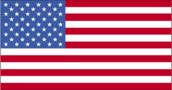
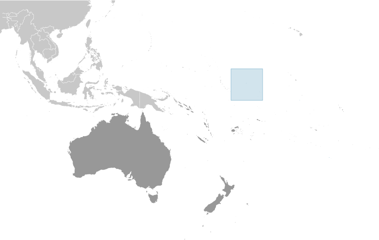
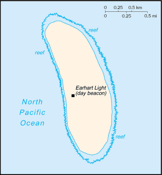

# Howland Island

_territory of the US_

## Introduction

**_Background:_**   
Discovered by the US early in the 19th century, the island was officially claimed by the US in 1857. Both US and British companies mined for guano until about 1890. Earhart Light is a day beacon near the middle of the west coast that was partially destroyed during World War II, but subsequently rebuilt; it is named in memory of the famed aviatrix Amelia EARHART. The island is administered by the US Department of the Interior as a National Wildlife Refuge.

## Geography

**_Location:_**   
Oceania, island in the North Pacific Ocean, about half way between Hawaii and Australia

**_Geographic coordinates:_**   
0 48 N, 176 38 W

**_Map references:_**   
Oceania

**_Area:_**   
**total:** 1.6 sq km   
**land:** 1.6 sq km   
**water:** 0 sq km

**_Area - comparative:_**   
about three times the size of The Mall in Washington, DC

**_Land boundaries:_**   
0 km

**_Coastline:_**   
6.4 km

**_Maritime claims:_**   
**territorial sea:** 12 nm   
**exclusive economic zone:** 200 nm

**_Climate:_**   
equatorial; scant rainfall, constant wind, burning sun

**_Terrain:_**   
low-lying, nearly level, sandy, coral island surrounded by a narrow fringing reef; depressed central area

**_Elevation extremes:_**   
**lowest point:** Pacific Ocean 0 m   
**highest point:** unnamed location 3 m

**_Natural resources:_**   
guano (deposits worked until late 1800s), terrestrial and aquatic wildlife

**_Land use:_**   
**arable land:** 0%   
**permanent crops:** 0%   
**other:** 100% (2001)

**_Irrigated land:_**   
0 sq km

**_Natural hazards:_**   
the narrow fringing reef surrounding the island can be a maritime hazard

**_Environment - current issues:_**   
no natural fresh water resources

**_Geography - note:_**   
almost totally covered with grasses, prostrate vines, and low-growing shrubs; small area of trees in the center; primarily a nesting, roosting, and foraging habitat for seabirds, shorebirds, and marine wildlife

## People and Society

**_Population:_**   
uninhabited   
**note:** American civilians evacuated in 1942 after Japanese air and naval attacks during World War II; occupied by US military during World War II, but abandoned after the war; public entry is by special-use permit from US Fish and Wildlife Service only and generally restricted to scientists and educators; visited annually by US Fish and Wildlife Service

## Government

**_Country name:_**   
**conventional long form:** none   
**conventional short form:** Howland Island

**_Dependency status:_**   
unincorporated territory of the US; administered from Washington, DC, by the Fish and Wildlife Service of the US Department of the Interior as part of the National Wildlife Refuge system

**_Legal system:_**   
the laws of the US, where applicable, apply

**_Flag description:_**   
the flag of the US is used

## Transportation

**_Ports and terminals:_**   
none; offshore anchorage only; note - there is one small boat landing area along the middle of the west coast

**_Transportation - note:_**   
Earhart Light, a day beacon near the middle of the west coast, was partially destroyed during World War II but rebuilt during the 1960s; today it is crumbling and in poor repair; named in memory of famed aviatrix Amelia EARHART

## Military

**_Military - note:_**   
defense is the responsibility of the US; visited annually by the US Coast Guard

## Transnational Issues

**_Disputes - international:_**   
none

............................................................   
_Page last updated on March 27, 2014_
