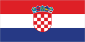
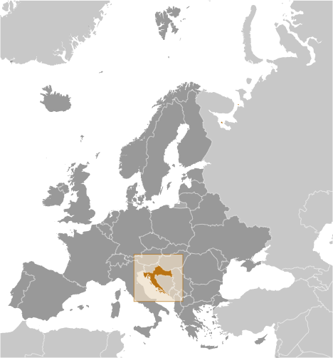
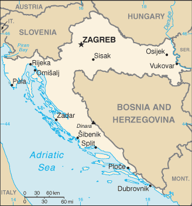

# Croatia

## Introduction

**_Background:_**   
The lands that today comprise Croatia were part of the Austro-Hungarian Empire until the close of World War I. In 1918, the Croats, Serbs, and Slovenes formed a kingdom known after 1929 as Yugoslavia. Following World War II, Yugoslavia became a federal independent communist state under the strong hand of Marshal TITO. Although Croatia declared its independence from Yugoslavia in 1991, it took four years of sporadic, but often bitter, fighting before occupying Serb armies were mostly cleared from Croatian lands, along with a majority of Croatia's ethnic Serb population. Under UN supervision, the last Serb-held enclave in eastern Slavonia was returned to Croatia in 1998. The country joined NATO in April 2009 and the EU in July 2013.

## Geography

**_Location:_**   
Southeastern Europe, bordering the Adriatic Sea, between Bosnia and Herzegovina and Slovenia

**_Geographic coordinates:_**   
45 10 N, 15 30 E

**_Map references:_**   
Europe

**_Area:_**   
**total:** 56,594 sq km   
**land:** 55,974 sq km   
**water:** 620 sq km

**_Area - comparative:_**   
slightly smaller than West Virginia

**_Land boundaries:_**   
**total:** 2,237 km   
**border countries:** Bosnia and Herzegovina 956 km, Hungary 348 km, Montenegro 19 km, Serbia 314 km, Slovenia 600 km

**_Coastline:_**   
5,835 km (mainland 1,777 km, islands 4,058 km)

**_Maritime claims:_**   
**territorial sea:** 12 nm   
**continental shelf:** 200 m depth or to the depth of exploitation

**_Climate:_**   
Mediterranean and continental; continental climate predominant with hot summers and cold winters; mild winters, dry summers along coast

**_Terrain:_**   
geographically diverse; flat plains along Hungarian border, low mountains and highlands near Adriatic coastline and islands

**_Elevation extremes:_**   
**lowest point:** Adriatic Sea 0 m   
**highest point:** Dinara 1,831 m

**_Natural resources:_**   
oil, some coal, bauxite, low-grade iron ore, calcium, gypsum, natural asphalt, silica, mica, clays, salt, hydropower

**_Land use:_**   
**arable land:** 15.85%   
**permanent crops:** 1.47%   
**other:** 82.69% (2011)

**_Irrigated land:_**   
36.27 sq km (2010)

**_Total renewable water resources:_**   
105.5 cu km (2011)

**_Natural hazards:_**   
destructive earthquakes

**_Environment - current issues:_**   
air pollution (from metallurgical plants) and resulting acid rain is damaging the forests; coastal pollution from industrial and domestic waste; landmine removal and reconstruction of infrastructure consequent to 1992-95 civil strife

**_Environment - international agreements:_**   
**party to:** Air Pollution, Air Pollution-Nitrogen Oxides, Air Pollution-Persistent Organic Pollutants, Air Pollution-Sulfur 94, Air Pollution-Volatile Organic Compounds, Biodiversity, Climate Change, Climate Change-Kyoto Protocol, Desertification, Endangered Species, Hazardous Wastes, Law of the Sea, Marine Dumping, Ozone Layer Protection, Ship Pollution, Wetlands, Whaling   
**signed, but not ratified:** none of the selected agreements

**_Geography - note:_**   
controls most land routes from Western Europe to Aegean Sea and Turkish Straits; most Adriatic Sea islands lie off the coast of Croatia - some 1,200 islands, islets, ridges, and rocks

## People and Society

**_Nationality:_**   
**noun:** Croat(s), Croatian(s)   
**adjective:** Croatian

**_Ethnic groups:_**   
Croat 90.4%, Serb 4.4%, other 4.4% (including Bosniak, Hungarian, Slovene, Czech, and Roma), unspecified 0.8% (2011 est.)

**_Languages:_**   
Croatian (official) 95.6%, Serbian 1.2%, other 3% (including Hungarian, Czech, Slovak, and Albanian), unspecified 0.2% (2011 est.)

**_Religions:_**   
Roman Catholic 86.3%, Orthodox 4.4%, Muslim 1.5%, other 1.5%, unspecified 2.5%, not religious or atheist 3.8% (2011 est.)

**_Population:_**   
4,470,534 (July 2014 est.)

**_Age structure:_**   
**0-14 years:** 14.5% (male 332,079/female 314,842)   
**15-24 years:** 12.1% (male 275,957/female 263,796)   
**25-54 years:** 41.1% (male 910,591/female 928,434)   
**55-64 years:** 14.5% (male 315,791/female 334,017)   
**65 years and over:** 17.4% (male 320,898/female 474,129) (2014 est.)

**_Dependency ratios:_**   
**total dependency ratio:** 50 %   
**youth dependency ratio:** 22 %   
**elderly dependency ratio:** 27.9 %   
**potential support ratio:** 3.6 (2014 est.)

**_Median age:_**   
**total:** 42.1 years   
**male:** 40.2 years   
**female:** 43.9 years (2014 est.)

**_Population growth rate:_**   
-0.12% (2014 est.)

**_Birth rate:_**   
9.49 births/1,000 population (2014 est.)

**_Death rate:_**   
12.13 deaths/1,000 population (2014 est.)

**_Net migration rate:_**   
1.43 migrant(s)/1,000 population (2014 est.)

**_Urbanization:_**   
**urban population:** 57.8% of total population (2011)   
**rate of urbanization:** 0.3% annual rate of change (2010-15 est.)

**_Major urban areas - population:_**   
ZAGREB (capital) 686,000 (2011)

**_Sex ratio:_**   
**at birth:** 1.06 male(s)/female   
**0-14 years:** 1.06 male(s)/female   
**15-24 years:** 1.05 male(s)/female   
**25-54 years:** 0.98 male(s)/female   
**55-64 years:** 0.93 male(s)/female   
**65 years and over:** 0.66 male(s)/female   
**total population:** 0.93 male(s)/female (2014 est.)

**_Mother's mean age at first birth:_**   
27.9 (2011 est.)

**_Maternal mortality rate:_**   
17 deaths/100,000 live births (2010)

**_Infant mortality rate:_**   
**total:** 5.87 deaths/1,000 live births   
**male:** 5.99 deaths/1,000 live births   
**female:** 5.73 deaths/1,000 live births (2014 est.)

**_Life expectancy at birth:_**   
**total population:** 76.41 years   
**male:** 72.81 years   
**female:** 80.2 years (2014 est.)

**_Total fertility rate:_**   
1.45 children born/woman (2014 est.)

**_Health expenditures:_**   
7.8% of GDP (2010)

**_Physicians density:_**   
2.72 physicians/1,000 population (2010)

**_Hospital bed density:_**   
6 beds/1,000 population (2011)

**_Drinking water source:_**   
**improved:** urban: 99.8% of population; rural: 96.8% of population; total: 98.6% of population   
**unimproved:** urban: 0.2% of population; rural: 3.2% of population; total: 1.4% of population (2012 est.)

**_Sanitation facility access:_**   
**improved:** urban: 98.6% of population; rural: 97.6% of population; total: 98.2% of population   
**unimproved:** urban: 1.4% of population; rural: 2.4% of population; total: 1.8% of population (2012 est.)

**_HIV/AIDS - adult prevalence rate:_**   
less than 0.1% (2009 est.)

**_HIV/AIDS - people living with HIV/AIDS:_**   
fewer than 1,000 (2009 est.)

**_HIV/AIDS - deaths:_**   
fewer than 100 (2009 est.)

**_Major infectious diseases:_**   
**degree of risk:** intermediate   
**vectorborne diseases:** tickborne encephalitis   
**note:** highly pathogenic H5N1 avian influenza has been identified in this country; it poses a negligible risk with extremely rare cases possible among US citizens who have close contact with birds (2013)

**_Obesity - adult prevalence rate:_**   
24.2% (2008)

**_Education expenditures:_**   
4.3% of GDP (2010)

**_Literacy:_**   
**definition:** age 15 and over can read and write   
**total population:** 98.9%   
**male:** 99.5%   
**female:** 98.3% (2011 est.)

**_School life expectancy (primary to tertiary education):_**   
**total:** 15 years   
**male:** 14 years   
**female:** 15 years (2011)

**_Unemployment, youth ages 15-24:_**   
**total:** 43.1%   
**male:** 42.3%   
**female:** 44.3% (2012)

## Government

**_Country name:_**   
**conventional long form:** Republic of Croatia   
**conventional short form:** Croatia   
**local long form:** Republika Hrvatska   
**local short form:** Hrvatska   
**former:** People's Republic of Croatia, Socialist Republic of Croatia

**_Government type:_**   
parliamentary democracy

**_Capital:_**   
**name:** Zagreb   
**geographic coordinates:** 45 48 N, 16 00 E   
**time difference:** UTC+1 (6 hours ahead of Washington, DC, during Standard Time)   
**daylight saving time:** +1hr, begins last Sunday in March; ends last Sunday in October

**_Administrative divisions:_**   
20 counties (zupanije, zupanija - singular) and 1 city\* (grad - singular) with special county status; Bjelovarsko-Bilogorska, Brodsko-Posavska, Dubrovacko-Neretvanska (Dubrovnik-Neretva), Istarska (Istria), Karlovacka, Koprivnicko-Krizevacka, Krapinsko-Zagorska, Licko-Senjska (Lika-Senj), Medimurska, Osjecko-Baranjska, Pozesko-Slavonska (Pozega-Slavonia), Primorsko-Goranska, Sibensko-Kninska, Sisacko-Moslavacka, Splitsko-Dalmatinska (Split-Dalmatia), Varazdinska, Viroviticko-Podravska, Vukovarsko-Srijemska (Vukovar-Syrmia), Zadarska, Zagreb\*, Zagrebacka (Zagreb county)

**_Independence:_**   
25 June 1991 (from Yugoslavia)

**_National holiday:_**   
Independence Day, 8 October (1991) and Statehood Day, 25 June (1991); note - 25 June 1991 was the day the Croatian parliament voted for independence; following a three-month moratorium to allow the European Community to solve the Yugoslav crisis peacefully, parliament adopted a decision on 8 October 1991 to sever constitutional relations with Yugoslavia

**_Constitution:_**   
several previous; latest adopted 22 December 1990; amended several times, last in December 2013 by referendum

**_Legal system:_**   
civil law system influenced by legal heritage of Austria-Hungary; note - Croatian law was fully harmonized with the European Community acquis as of the June 2010 completion of EU accession negotiations

**_International law organization participation:_**   
has not submitted an ICJ jurisdiction declaration; accepts ICCt jurisdiction

**_Suffrage:_**   
18 years of age, 16 if employed; universal

**_Executive branch:_**   
**chief of state:** President Ivo JOSIPOVIC (since 18 February 2010)   
**head of government:** Prime Minister Zoran MILANOVIC (since 23 December 2011); First Deputy Prime Minister Vesna PUSIC (since 16 November 2012)   
**cabinet:** Council of Ministers named by the prime minister and approved by the parliamentary assembly   
**elections:** president elected by popular vote for a five-year term (eligible for a second term); election last held on 10 January 2010 (next to be held in December 2014); the leader of the majority party or the leader of the majority coalition usually appointed prime minister by the president and then approved by the assembly   
**election results:** Ivo JOSIPOVIC elected president; percent of vote in the second round - Ivo JOSIPOVIC 60%, Milan BANDIC 40%

**_Legislative branch:_**   
unicameral Assembly or Sabor (151 seats; members elected from party lists by popular vote to serve four-year terms; each of 10 electoral districts elect 14 members, Croatian citizens abroad vote as an electoral district and elect 3 members, national minorities vote as an electoral district and elect 8 members)   
**elections:** last held on 4 December 2011 (next to be held in late 2015)   
**election results:** percent of vote by party/coalition - Kukuriku 40.0%, HDZ-led Coalitiion 23.8%, Croatian Laborists-Labor Party 5.1%, HSS 3.0%, HDSSB 2.9%, Independent list of Ivan Grubisic 2.8%, HCSP-HSP AS 2.8%, other 19.6%; number of seats by party/coalition - Kukuriku 80 (SDP 61, HNS 13, IDS 3, HSU 3), HDZ-led coalition 47 (HDZ 44, HGS 2, DC 1), Croatian Laborists-Labor Party 6, HDSSB 6, SDSS 3, Independent list of Ivan Grubisic 2, HSS 1, HCSP-HSP AS 1, other 5   
**note:** seats by party as of 25 March 2014 - SDP 58, HDZ 42, HNS 13, HDSSB 7, Croatian Laborists - Labor Party 6, HSU 4, SDSS 3, HGS 2, IDS 2, BDSH 1, DC 1, HSS 1, HSP AS 1, ORaH 1, independents 9

**_Judicial branch:_**   
**highest court(s):** Supreme Court (consists of the court president and vice president, 25 civil department justices, and 16 criminal department justices)   
**judge selection and term of office:** president of Supreme Court nominated by president of Croatia and elected by Croatian Sabor for a 4-year term; other Supreme Court justices appointed by National Judicial Council; all judges serve until age 70   
**subordinate courts:** Administrative Court; county, municipal, and specialized courts; note - there is an 11-member Constitutional Court with jurisdiction limited to constitutional issues but is outside Croatia's judicial system

**_Political parties and leaders:_**   
Bosniak Democratic Party of Croatia or BDSH [Medzad HODZIC]   
Croatian Civic Party or HGS [Zeljko KERUM]   
Croatian Democratic Congress of Slavonia and Baranja or HDSSB [Vladimir SISLJAGIC]   
Croatian Democratic Union or HDZ [Tomislav KARAMARKO]   
Croatian Laborists - Labor Party [Dragutin LESAR]   
Croatian Party of Rights - dr. Ante Starcevic or HSP AS [Ruza TOMASIC]   
Croatian Peasant Party or HSS [Branko HRG]   
Croatian Pensioner Party or HSU [Silvano HRELJA]   
Croatian People's Party - Liberal Democrats or HNS [Vesna PUSIC]   
Croatian Pure Party of Rights or HCSP [Josip MILJIC]   
Democratic Centre or DC [Vesna SKARE-OZBOLT]   
HDZ-led Coalition [Tomislav KARAMARKO] (includes HDZ, HGS, and DC)   
Independent Democratic Serb Party or SDSS [Vojislav STANIMIROVIC]   
Independent List of Ivan Grubisic [Ivan GRUBISIC]   
Istrian Democratic Assembly or IDS [Ivan JAKOVCIC]   
Kukuriku Coalition [Zoran MILANOVIC] (includes SDP, HNS, IDS, and HSU)   
Social Democratic Party of Croatia or SDP [Zoran MILANOVIC]   
Sustainable Development for Croatia or ORaH [Mirela HOLY]

**_Political pressure groups and leaders:_**   
**other:** human rights groups

**_International organization participation:_**   
Australia Group, BIS, BSEC (observer), CD, CE, CEI, EAPC, EBRD, EU, FAO, G-11, IADB, IAEA, IBRD, ICAO, ICC (national committees), ICRM, IDA, IFAD, IFC, IFRCS, IHO, ILO, IMF, IMO, IMSO, Interpol, IOC, IOM, IPU, ISO, ITSO, ITU, ITUC (NGOs), MIGA, MINURSO, MINUSTAH, NAM (observer), NATO, NSG, OAS (observer), OIF (observer), OPCW, OSCE, PCA, SELEC, UN, UNCTAD, UNDOF, UNESCO, UNFICYP, UNHCR, UNIDO, UNIFIL, UNMIL, UNMOGIP, UNWTO, UPU, WCO, WHO, WIPO, WMO, WTO, ZC

**_Diplomatic representation in the US:_**   
**chief of mission:** Ambassador Josko PARO (since 20 April 2012)   
**chancery:** 2343 Massachusetts Avenue NW, Washington, DC 20008   
**telephone:** [1] (202) 588-5899   
**FAX:** [1] (202) 588-8936   
**consulate(s) general:** Chicago, Los Angeles, New York

**_Diplomatic representation from the US:_**   
**chief of mission:** Ambassador Kenneth MERTEN (since 3 October 2012)   
**embassy:** 2 Thomas Jefferson Street, 10010 Zagreb   
**mailing address:** use street address   
**telephone:** [385] (1) 661-2200   
**FAX:** [385] (1) 661-2373

**_Flag description:_**   
three equal horizontal bands of red (top), white, and blue - the Pan-Slav colors - superimposed by the Croatian coat of arms; the coat of arms consists of one main shield (a checkerboard of 13 red and 12 silver (white) fields) surmounted by five smaller shields that form a crown over the main shield; the five small shields represent five historic regions, they are (from left to right): Croatia, Dubrovnik, Dalmatia, Istria, and Slavonia   
**note:** the Pan-Slav colors were inspired by the 19th-century flag of Russia

**_National symbol(s):_**   
red-white checkerboard

**_National anthem:_**   
**name:** "Lijepa nasa domovino" (Our Beautiful Homeland)   
**lyrics/music:** Antun MIHANOVIC/Josip RUNJANIN   
**note:** adopted 1972; "Lijepa nasa domovino," whose lyrics were written in 1835, served as an unofficial anthem beginning in 1891

## Economy

**_Economy - overview:_**   
Though still one of the wealthiest of the former Yugoslav republics, Croatia's economy suffered badly during the 1991-95 war. The country's output during that time collapsed and Croatia missed the early waves of investment in Central and Eastern Europe that followed the fall of the Berlin Wall. Between 2000 and 2007, however, Croatia's economic fortunes began to improve with moderate but steady GDP growth between 4% and 6% led by a rebound in tourism and credit-driven consumer spending. Inflation over the same period remained tame and the currency, the kuna, stable. Croatia experienced an abrupt slowdown in the economy in 2008 and has yet to recover; economic growth was stagnant or negative in each year since 2009. Difficult problems still remain, including a stubbornly high unemployment rate, uneven regional development, and a challenging investment climate. Croatia continues to face reduced foreign investment. On 1 July 2013 Croatia joined the EU, following a decade-long application process. Croatia will be a member of the European Exchange Rate Mechanism until it meets the criteria for joining the Economic and Monetary Union and adopts the euro as its currency. EU accession has increased pressure on the government to reduce Croatia’s relatively high public debt, which triggered the EU’s excessive deficit procedure for fiscal consolidation. Zagreb has cut spending since 2012, and the government also raised additional revenues through more stringent tax collection and by raising the Value Added Tax. The government has also sought to accelerate privatization of non-strategic assets, with mixed success.

**_GDP (purchasing power parity):_**   
$78.9 billion (2013 est.)   
$79.7 billion (2012 est.)   
$81.3 billion (2012 est.)   
**note:** data are in 2013 US dollars

**_GDP (official exchange rate):_**   
$59.14 billion (2013 est.)

**_GDP - real growth rate:_**   
-1% (2013 est.)   
-1.9% (2012 est.)   
-0.2% (2011 est.)

**_GDP - per capita (PPP):_**   
$17,800 (2013 est.)   
$17,900 (2012 est.)   
$18,200 (2011 est.)   
**note:** data are in 2013 US dollars

**_Gross national saving:_**   
19.9% of GDP (2013 est.)   
19.3% of GDP (2012 est.)   
19.5% of GDP (2011 est.)

**_GDP - composition, by end use:_**   
**household consumption:** 59.2%   
**government consumption:** 20%   
**investment in fixed capital:** 18.5%   
**investment in inventories:** 1.7%   
**exports of goods and services:** 44.4%   
**imports of goods and services:** -43.8%; (2013 est.)

**_GDP - composition, by sector of origin:_**   
**agriculture:** 5%   
**industry:** 25.8%   
**services:** 69.2% (2013 est.)

**_Agriculture - products:_**   
arable crops (wheat, corn, barley, sugar beet, sunflower, rapeseed, alfalfa, clover); vegetables (potatoes, cabbage, onion, tomato, pepper); fruits (apples, plum, mandarins, olives), grapes for wine; livestock (cattle, cows, pigs); dairy products

**_Industries:_**   
chemicals and plastics, machine tools, fabricated metal, electronics, pig iron and rolled steel products, aluminum, paper, wood products, construction materials, textiles, shipbuilding, petroleum and petroleum refining, food and beverages, tourism

**_Industrial production growth rate:_**   
-1.8% (2013 est.)

**_Labor force:_**   
1.715 million (2013 est.)

**_Labor force - by occupation:_**   
**agriculture:** 2.1%   
**industry:** 29%   
**services:** 69% (2012)

**_Unemployment rate:_**   
21.6% (2013 est.)   
19.1% (2012 est.)

**_Population below poverty line:_**   
21.1% (2011)

**_Household income or consumption by percentage share:_**   
**lowest 10%:** 3.3%   
**highest 10%:** 27.5% (2008 est.)

**_Distribution of family income - Gini index:_**   
32 (2010)   
29 (1998)

**_Budget:_**   
**revenues:** $17.87 billion   
**expenditures:** $20.43 billion (2013 est.)

**_Taxes and other revenues:_**   
36.9% of GDP (2013 est.)

**_Budget surplus (+) or deficit (-):_**   
-4.4% of GDP (2013 est.)

**_Public debt:_**   
66.2% of GDP (2013 est.)   
55.6% of GDP (2012 est.)

**_Fiscal year:_**   
calendar year

**_Inflation rate (consumer prices):_**   
2.2% (2013 est.)   
3.4% (2012 est.)

**_Central bank discount rate:_**   
7% (31 December 2013 est.)   
7% (31 December 2012 est.)

**_Commercial bank prime lending rate:_**   
9% (31 December 2013 est.)   
9.48% (31 December 2012 est.)

**_Stock of narrow money:_**   
$10.38 billion (31 January 2014 est.)   
$10.64 billion (31 December 2012 est.)

**_Stock of broad money:_**   
$49.3 billion (31 December 2013 est.)   
$493.7 billion (31 December 2012 est.)

**_Stock of domestic credit:_**   
$46.65 billion (31 December 2013 est.)   
$46.23 billion (31 December 2012 est.)

**_Market value of publicly traded shares:_**   
$21.63 billion (31 December 2013 est.)   
$23.24 billion (31 December 2012)   
$23.75 billion (31 December 2011 est.)

**_Current account balance:_**   
-$102.3 million (2013 est.)   
-$17.59 million (2012 est.)

**_Exports:_**   
$12.36 billion (2013 est.)   
$13.16 billion (2012 est.)

**_Exports - commodities:_**   
transport equipment, machinery, textiles, chemicals, foodstuffs, fuels

**_Exports - partners:_**   
Italy 14.1%, Bosnia Herzegovina 13.1%, Germany 11.1%, Slovenia 10.1%, Austria 6.3% (2012 est.)

**_Imports:_**   
$21.74 billion (2013 est.)   
$22.16 billion (2012 est.)

**_Imports - commodities:_**   
machinery, transport and electrical equipment; chemicals, fuels and lubricants; foodstuffs

**_Imports - partners:_**   
Germany 13.7%, Italy 12.5%, Slovenia 11.5%, Austria 9.1%, Hungary 6.2%, Russia 5.4% (2012 est.)

**_Reserves of foreign exchange and gold:_**   
$11.46 billion (31 December 2013 est.)   
$11.95 billion (31 December 2012 est.)

**_Debt - external:_**   
$60.47 billion (31 December 2013 est.)   
$61.39 billion (2012 est.)

**_Stock of direct foreign investment - at home:_**   
$37.5 billion (31 December 2013 est.)   
$36.08 billion (31 December 2012 est.)

**_Stock of direct foreign investment - abroad:_**   
$6.081 billion (31 December 2013 est.)   
$5.581 billion (31 December 2012 est.)

**_Exchange rates:_**   
kuna (HRK) per US dollar -   
5.775 (2013 est.)   
5.8503 (2012 est.)   
5.498 (2010 est.)   
5.2692 (2009)   
4.98 (2008)

## Energy

**_Electricity - production:_**   
14.24 billion kWh (2013 est.)

**_Electricity - consumption:_**   
16.7 billion kWh (2012 est.)

**_Electricity - exports:_**   
3.294 billion kWh (2013 est.)

**_Electricity - imports:_**   
6.844 billion kWh (2013 est.)

**_Electricity - installed generating capacity:_**   
4.132 million kW (2010 est.)

**_Electricity - from fossil fuels:_**   
45.9% of total installed capacity (2010 est.)

**_Electricity - from nuclear fuels:_**   
0% of total installed capacity (2010 est.)

**_Electricity - from hydroelectric plants:_**   
44.7% of total installed capacity (2010 est.)

**_Electricity - from other renewable sources:_**   
2.3% of total installed capacity (2010 est.)

**_Crude oil - production:_**   
11,930 bbl/day (2013 est.)

**_Crude oil - exports:_**   
0 bbl/day (2013 est.)

**_Crude oil - imports:_**   
51,470 bbl/day (2013 est.)

**_Crude oil - proved reserves:_**   
71 million bbl (1 January 2013 est.)

**_Refined petroleum products - production:_**   
65,410 bbl/day (2013 est.)

**_Refined petroleum products - consumption:_**   
74,410 bbl/day (2012 est.)

**_Refined petroleum products - exports:_**   
30,120 bbl/day (2013 est.)

**_Refined petroleum products - imports:_**   
26,670 bbl/day (2013 est.)

**_Natural gas - production:_**   
1.863 billion cu m (2013 est.)

**_Natural gas - consumption:_**   
2.755 billion cu m (2012 est.)

**_Natural gas - exports:_**   
392 million cu m (2013 est.)

**_Natural gas - imports:_**   
1.137 billion cu m (2013 est.)

**_Natural gas - proved reserves:_**   
24.92 billion cu m (1 January 2013 est.)

**_Carbon dioxide emissions from consumption of energy:_**   
22.35 million Mt (2011 est.)

## Communications

**_Telephones - main lines in use:_**   
1.64 million (2012)

**_Telephones - mobile cellular:_**   
4.97 million (2012)

**_Telephone system:_**   
**general assessment:** the telecommunications network has improved steadily since the mid-1990s, covering much of what were once inaccessible areas; local lines are digital   
**domestic:** fixed-line teledensity holding steady at about 40 per 100 persons; mobile-cellular telephone subscriptions exceed the population   
**international:** country code - 385; digital international service is provided through the main switch in Zagreb; Croatia participates in the Trans-Asia-Europe (TEL) fiber-optic project, which consists of 2 fiber-optic trunk connections with Slovenia and a fiber-optic trunk line from Rijeka to Split and Dubrovnik; the ADRIA-1 submarine cable provides connectivity to Albania and Greece (2011)

**_Broadcast media:_**   
the national state-owned public broadcaster, Croatian Radiotelevision (HRT), operates 4 terrestrial TV networks, a satellite channel that rebroadcasts programs for Croatians living abroad, and 6 regional TV centers; 2 private broadcasters operate national terrestrial networks; roughly 25 privately owned regional TV stations; multi-channel cable and satellite TV subscription services are available; state-owned public broadcaster operates 3 national radio networks and 9 regional radio stations; 2 privately owned national radio networks and more than 170 regional, county, city, and community radio stations (2012)

**_Internet country code:_**   
.hr

**_Internet hosts:_**   
729,420 (2012)

**_Internet users:_**   
2.234 million (2009)

## Transportation

**_Airports:_**   
69 (2013)

**_Airports - with paved runways:_**   
**total:** 24   
**over 3,047 m:** 2   
**2,438 to 3,047 m:** 6   
**1,524 to 2,437 m:** 3   
**914 to 1,523 m:** 3   
**under 914 m:** 10 (2013)

**_Airports - with unpaved runways:_**   
**total:** 45   
**1,524 to 2,437 m:** 1   
**914 to 1,523 m:** 6   
**under 914 m:** 38 (2013)

**_Heliports:_**   
1 (2013)

**_Pipelines:_**   
gas 2,410 km; oil 610 km (2011)

**_Railways:_**   
**total:** 2,722 km   
**standard gauge:** 2,722 km 1.435-m gauge (984 km electrified) (2011)

**_Roadways:_**   
**total:** 29,410 km (includes 1,254 km of expressways) (2011)

**_Waterways:_**   
785 km (2009)

**_Merchant marine:_**   
**total:** 77   
**by type:** bulk carrier 24, cargo 7, chemical tanker 8, passenger/cargo 27, petroleum tanker 10, refrigerated cargo 1   
**foreign-owned:** 2 (Norway 2)   
**registered in other countries:** 31 (Bahamas 1, Belize 1, Liberia 1, Malta 6, Marshall Islands 12, Panama 2, Saint Vincent and the Grenadines 8) (2010)

**_Ports and terminals:_**   
**major seaport(s):** Ploce, Rijeka, Sibernik, Split   
**river port(s):** Vukovar (Danube)   
**oil/gas terminal(s):** Omisalj

## Military

**_Military branches:_**   
Armed Forces of the Republic of Croatia (Oruzane Snage Republike Hrvatske, OSRH) consists of five major commands directly subordinate to a General Staff: Ground Forces (Hrvatska Kopnena Vojska, HKoV), Naval Forces (Hrvatska Ratna Mornarica, HRM; includes coast guard), Air Force and Air Defense Command (Hrvatsko Ratno Zrakoplovstvo I Protuzracna Obrana), Joint Education and Training Command, Logistics Command; Military Police Force supports each of the three Croatian military forces (2012)

**_Military service age and obligation:_**   
18-27 years of age for voluntary military service; 6-month service obligation (2012)

**_Manpower available for military service:_**   
**males age 16-49:** 1,016,234   
**females age 16-49:** 1,017,355 (2010 est.)

**_Manpower fit for military service:_**   
**males age 16-49:** 770,710   
**females age 16-49:** 839,732 (2010 est.)

**_Manpower reaching militarily significant age annually:_**   
**male:** 28,334   
**female:** 27,015 (2010 est.)

**_Military expenditures:_**   
1.7% of GDP (2012)   
1.77% of GDP (2011)   
1.7% of GDP (2010)

## Transnational Issues

**_Disputes - international:_**   
dispute remains with Bosnia and Herzegovina over several small sections of the boundary related to maritime access that hinders ratification of the 1999 border agreement; since the breakup of Yugoslavia in the early 1990s, Croatia and Slovenia have each claimed sovereignty over Pirin Bay and four villages, and Slovenia has objected to Croatia's claim of an exclusive economic zone in the Adriatic Sea; in 2009, however Croatia and Slovenia signed a binding international arbitration agreement to define their disputed land and maritime borders, which led to Slovenia lifting its objections to Croatia joining the EU; Slovenia continues to impose a hard border Schengen regime with Croatia, which joined the EU in 2013 but has not yet fulfilled Schengen requirements

**_Refugees and internally displaced persons:_**   
**stateless persons:** 2,886 (2012)

**_Illicit drugs:_**   
transit point along the Balkan route for Southwest Asian heroin to Western Europe; has been used as a transit point for maritime shipments of South American cocaine bound for Western Europe (2008)

............................................................   
_Page last updated on June 22, 2014_
