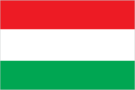
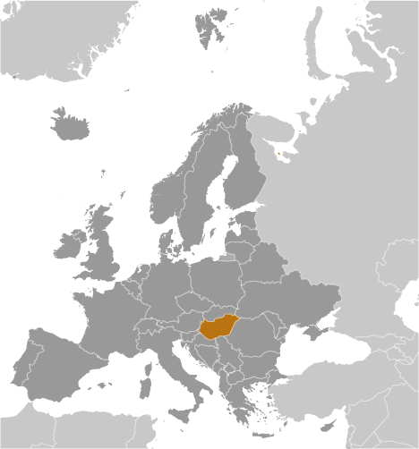
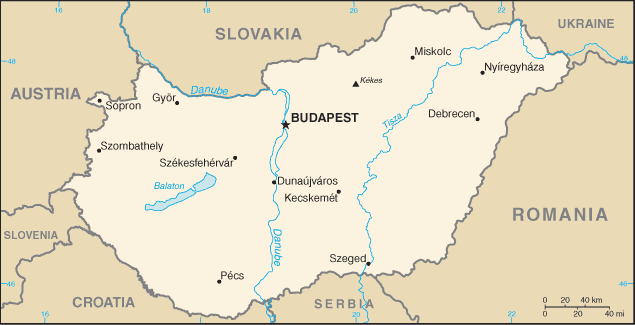

# Hungary

## Introduction

**_Background:_**   
Hungary became a Christian kingdom in A.D. 1000 and for many centuries served as a bulwark against Ottoman Turkish expansion in Europe. The kingdom eventually became part of the polyglot Austro-Hungarian Empire, which collapsed during World War I. The country fell under communist rule following World War II. In 1956, a revolt and an announced withdrawal from the Warsaw Pact were met with a massive military intervention by Moscow. Under the leadership of Janos KADAR in 1968, Hungary began liberalizing its economy, introducing so-called "Goulash Communism." Hungary held its first multiparty elections in 1990 and initiated a free market economy. It joined NATO in 1999 and the EU five years later. In 2011, Hungary assumed the six-month rotating presidency of the EU for the first time.

## Geography

**_Location:_**   
Central Europe, northwest of Romania

**_Geographic coordinates:_**   
47 00 N, 20 00 E

**_Map references:_**   
Europe

**_Area:_**   
**total:** 93,028 sq km   
**land:** 89,608 sq km   
**water:** 3,420 sq km

**_Area - comparative:_**   
slightly smaller than Indiana

**_Land boundaries:_**   
**total:** 2,106 km   
**border countries:** Austria 321 km, Croatia 348 km, Romania 424 km, Serbia 164 km, Slovakia 627 km, Slovenia 94 km, Ukraine 128 km

**_Coastline:_**   
0 km (landlocked)

**_Maritime claims:_**   
none (landlocked)

**_Climate:_**   
temperate; cold, cloudy, humid winters; warm summers

**_Terrain:_**   
mostly flat to rolling plains; hills and low mountains on the Slovakian border

**_Elevation extremes:_**   
**lowest point:** Tisza River 78 m   
**highest point:** Kekes 1,014 m

**_Natural resources:_**   
bauxite, coal, natural gas, fertile soils, arable land

**_Land use:_**   
**arable land:** 47.24%   
**permanent crops:** 1.97%   
**other:** 50.79% (2011)

**_Irrigated land:_**   
1,409 sq km (2007)

**_Total renewable water resources:_**   
104 cu km (2011)

**_Freshwater withdrawal (domestic/industrial/agricultural):_**   
**total:** 5.58 cu km/yr (12%/83%/5%)   
**per capita:** 555.9 cu m/yr (2007)

**_Environment - current issues:_**   
the upgrading of Hungary's standards in waste management, energy efficiency, and air, soil, and water pollution to meet EU requirements will require large investments

**_Environment - international agreements:_**   
**party to:** Air Pollution, Air Pollution-Nitrogen Oxides, Air Pollution-Persistent Organic Pollutants, Air Pollution-Sulfur 85, Air Pollution-Sulfur 94, Air Pollution-Volatile Organic Compounds, Antarctic Treaty, Biodiversity, Climate Change, Climate Change-Kyoto Protocol, Desertification, Endangered Species, Environmental Modification, Hazardous Wastes, Law of the Sea, Marine Dumping, Ozone Layer Protection, Ship Pollution, Wetlands, Whaling   
**signed, but not ratified:** none of the selected agreements

**_Geography - note:_**   
landlocked; strategic location astride main land routes between Western Europe and Balkan Peninsula as well as between Ukraine and Mediterranean basin; the north-south flowing Duna (Danube) and Tisza Rivers divide the country into three large regions

## People and Society

**_Nationality:_**   
**noun:** Hungarian(s)   
**adjective:** Hungarian

**_Ethnic groups:_**   
Hungarian 92.3%, Roma 1.9%, other or unknown 5.8% (2001 census)

**_Languages:_**   
Hungarian 84.6%, other or unspecified 16.4% (2011 est.)

**_Religions:_**   
Roman Catholic 37.2%, Calvinist 11.6%, Lutheran 2.2%, Greek Catholic 1.8%, other 1.9%, none 18.2%, unspecified 27.2% (2011 est.)

**_Population:_**   
9,919,128 (July 2014 est.)

**_Age structure:_**   
**0-14 years:** 14.8% (male 757,868/female 712,908)   
**15-24 years:** 11.7% (male 596,005/female 561,606)   
**25-54 years:** 41.6% (male 2,071,845/female 2,056,611)   
**55-64 years:** 14% (male 639,298/female 754,129)   
**65 years and over:** 17.5% (male 661,256/female 1,107,602) (2014 est.)

**_Dependency ratios:_**   
**total dependency ratio:** 47.4 %   
**youth dependency ratio:** 21.7 %   
**elderly dependency ratio:** 25.6 %   
**potential support ratio:** 3.9 (2014 est.)

**_Median age:_**   
**total:** 41.1 years   
**male:** 39.1 years   
**female:** 43.5 years (2014 est.)

**_Population growth rate:_**   
-0.21% (2014 est.)

**_Birth rate:_**   
9.26 births/1,000 population (2014 est.)

**_Death rate:_**   
12.72 deaths/1,000 population (2014 est.)

**_Net migration rate:_**   
1.34 migrant(s)/1,000 population (2014 est.)

**_Urbanization:_**   
**urban population:** 69.5% of total population (2011)   
**rate of urbanization:** 0.51% annual rate of change (2010-15 est.)

**_Major urban areas - population:_**   
BUDAPEST (capital) 1.737 million (2011)

**_Sex ratio:_**   
**at birth:** 1.06 male(s)/female   
**0-14 years:** 1.06 male(s)/female   
**15-24 years:** 1.06 male(s)/female   
**25-54 years:** 1.01 male(s)/female   
**55-64 years:** 0.91 male(s)/female   
**65 years and over:** 0.59 male(s)/female   
**total population:** 0.91 male(s)/female (2014 est.)

**_Mother's mean age at first birth:_**   
28.3 (2011 est.)

**_Maternal mortality rate:_**   
21 deaths/100,000 live births (2010)

**_Infant mortality rate:_**   
**total:** 5.09 deaths/1,000 live births   
**male:** 5.36 deaths/1,000 live births   
**female:** 4.81 deaths/1,000 live births (2014 est.)

**_Life expectancy at birth:_**   
**total population:** 75.46 years   
**male:** 71.73 years   
**female:** 79.41 years (2014 est.)

**_Total fertility rate:_**   
1.42 children born/woman (2014 est.)

**_Health expenditures:_**   
7.7% of GDP (2011)

**_Physicians density:_**   
3.41 physicians/1,000 population (2010)

**_Hospital bed density:_**   
7.2 beds/1,000 population (2010)

**_Drinking water source:_**   
**improved:** urban: 100% of population; rural: 100% of population; total: 100% of population   
**unimproved:** urban: 0% of population; rural: 0% of population; total: 0% of population (2012 est.)

**_Sanitation facility access:_**   
**improved:** urban: 100% of population; rural: 100% of population; total: 100% of population   
**unimproved:** urban: 0% of population; rural: 0% of population; total: 0% of population (2012 est.)

**_HIV/AIDS - adult prevalence rate:_**   
less than 0.1% (2009 est.)

**_HIV/AIDS - people living with HIV/AIDS:_**   
3,000 (2009 est.)

**_HIV/AIDS - deaths:_**   
fewer than 200 (2009 est.)

**_Major infectious diseases:_**   
**degree of risk:** intermediate   
**vectorborne diseases:** tickborne encephalitis (2013)

**_Obesity - adult prevalence rate:_**   
27.6% (2008)

**_Education expenditures:_**   
4.9% of GDP (2010)

**_Literacy:_**   
**definition:** age 15 and over can read and write   
**total population:** 99%   
**male:** 99.2%   
**female:** 98.9% (2011 est.)

**_School life expectancy (primary to tertiary education):_**   
**total:** 15 years   
**male:** 15 years   
**female:** 16 years (2011)

**_Unemployment, youth ages 15-24:_**   
**total:** 28.1%   
**male:** 28.8%   
**female:** 27.3% (2012)

## Government

**_Country name:_**   
**conventional long form:** none   
**conventional short form:** Hungary   
**local long form:** none   
**local short form:** Magyarorszag

**_Government type:_**   
parliamentary democracy

**_Capital:_**   
**name:** Budapest   
**geographic coordinates:** 47 30 N, 19 05 E   
**time difference:** UTC+1 (6 hours ahead of Washington, DC, during Standard Time)   
**daylight saving time:** +1hr, begins last Sunday in March; ends last Sunday in October

**_Administrative divisions:_**   
19 counties (megyek, singular - megye), 23 urban counties (singular - megyei varos), and 1 capital city (fovaros)   
**counties:** Bacs-Kiskun, Baranya, Bekes, Borsod-Abauj-Zemplen, Csongrad, Fejer, Gyor-Moson-Sopron, Hajdu-Bihar, Heves, Jasz-Nagykun-Szolnok, Komarom-Esztergom, Nograd, Pest, Somogy, Szabolcs-Szatmar-Bereg, Tolna, Vas, Veszprem, Zala   
**urban counties:** Bekescsaba, Debrecen, Dunaujvaros, Eger, Erd, Gyor, Hodmezovasarhely, Kaposvar, Kecskemet, Miskolc, Nagykanizsa, Nyiregyhaza, Pecs, Salgotarjan, Sopron, Szeged, Szekesfehervar, Szekszard, Szolnok, Szombathely, Tatabanya, Veszprem, Zalaegerszeg   
**capital city:** Budapest

**_Independence:_**   
16 November 1918 (republic proclaimed); notable earlier dates: 25 December 1000 (crowning of King STEPHEN I, traditional founding date); 30 March 1867 (Austro-Hungarian dual monarchy established)

**_National holiday:_**   
Saint Stephen's Day, 20 August; note - commemorates the date when his remains were transferred to Buda (now Budapest)

**_Constitution:_**   
previous 1949 (heavily amended in 1989 following collapse of communism); latest approved 18 April 2011, signed 25 April 2011, effective 1 January 2012; amended several times, last in 2013 (2013)

**_Legal system:_**   
civil legal system influenced by the German model

**_International law organization participation:_**   
accepts compulsory ICJ jurisdiction with reservations; accepts ICCt jurisdiction

**_Suffrage:_**   
18 years of age, 16 if married; universal

**_Executive branch:_**   
**chief of state:** Janos ADER (since 10 May 2012)   
**head of government:** Prime Minister Viktor ORBAN (since 29 May 2010)   
**cabinet:** Cabinet of Ministers prime minister elected by the National Assembly on the recommendation of the president; other ministers proposed by the prime minister and appointed and relieved of their duties by the president   
**elections:** president elected by the National Assembly for a five-year term (eligible for a second term); election last held on 2 May 2012 (next to be held by May 2017); prime minister elected by the National Assembly on the recommendation of the president; election following the formation of a new government held on 10 May 2014   
**election results:** Janos ADER elected president, National Assembly vote - 262 to 40; Viktor ORBAN elected prime minister, National Assembly vote - 130 to 57   
**note:** to be elected, the president must win two-thirds of legislative vote in the first round or a simple majority in the second round

**_Legislative branch:_**   
unicameral National Assembly or Orszaggyules (199 seats; 106 single-round, single-member district vote, 93 nationwide party list vote; members serve four-year terms)   
**elections:** last held on 6 April 2014 (next to be held in April 2018)   
**election results:** percent of vote by party - Fidesz-KNDP 66.8%, Unity 19.1%, Jobbik 11.6%, LMP 2.5%; seats by party - Fidesz-KNDP 133, Unity 38, Jobbik 23, LMP 5

**_Judicial branch:_**   
**highest court(s):** Curia or Supreme Judicial Court (consists of Curia president and 8 judges); Constitutional Court (consists of 15 members)   
**judge selection and term of office:** Curia president elected from among its members for 9 years by the National Assembly on the recommendation of the president of the republic; other Curia judges appointed by the president upon the recommendation of the National Council of Justice, a separate 15-member administrative body; all judges serve until the normal retirement age; Constitutional Court members elected by two-thirds vote of the National Assembly; members serve 12-year terms   
**subordinate courts:** regional courts of appeal; county courts, including the Municipal Court of Budapest; local courts

**_Political parties and leaders:_**   
Christian Democratic People's Party or KDNP [Zsolt SEMJEN]   
Democratic Coalition or DK [Ferenc GYURCSANY]   
Dialogue for Hungary or PM [Benedek JAVOR, Timea SZABO, co-chairs]   
Fidesz-Hungarian Civic Alliance or Fidesz [Viktor ORBAN, chairman]   
Hungarian Liberal Party or MLP [Gabor FODOR]   
Hungarian Socialist Party or MSZP [Attila MESTERHAZY]   
Movement for a Better Hungary or Jobbik [Gabor VONA]   
Politics Can Be Different or LMP [Andras SCHIFFER, Bernadett SZEL]   
Together or Egyutt [Gordon BAJNAI]   
Unity [a coalition of MSZP, Egyutt, DK, PM, and MLP]

**_Political pressure groups and leaders:_**   
Air Work Group (works to reduce air pollution in towns and cities)   
Danube Circle (protests the building of the Gabchikovo-Nagymaros dam)   
Fourth Republic (Negyedik Koztarsasag) or 4K! (anti-Orban, pro-democracy Facebook movement emerged from a Facebook group, One Million for Freedom of the Press or "Milla")   
Green Future (protests the impact of lead contamination of local factory on health of the people)   
Hungarian Civil Liberties Union (Tarsasag a Szabadsagjogokert) or TASZ (freedom of expression, information privacy)   
Hungarian Helsinki Committee (asylum seekers' rights, human rights in law enforcement and the judicial system)   
Szolidaritas ("Solidarity," formed in October 2011 by three trade unions and an NGO - anti-Orban government)   
"Egyutt 2014-Parbeszed Magyarorszagert" ("Together 2014-Dialogue for Hungary," a political electoral alliance bringing together Milla, Szolidaritas, and "Haza es Haladas," an association headed by former PM Gordon BAJNAI, to contest Fidesz and Viktor ORBAN in the 2014 parliamentary elections)   
Civil Osszefogas Forum ("Civil Unity Forum," nominally independent organization that serves as the steering committee for the pro-government mass organization Bekemenet (Peace March), supporting ORBAN government's policies)   
**environmentalists:** Hungarian Ornithological and Nature Conservation Society (Magyar Madartani Egyesulet) or MME; Green Alternative (Zold Alternativa)

**_International organization participation:_**   
Australia Group, BIS, CD, CE, CEI, CERN, EAPC, EBRD, EIB, ESA (cooperating state), EU, FAO, G-9, IAEA, IBRD, ICAO, ICC (national committees), ICRM, IDA, IEA, IFAD, IFC, IFRCS, ILO, IMF, IMO, IMSO, Interpol, IOC, IOM, IPU, ISO, ITSO, ITU, ITUC (NGOs), MIGA, MINURSO, NATO, NEA, NSG, OAS (observer), OECD, OIF (observer), OPCW, OSCE, PCA, Schengen Convention, SELEC, UN, UNCTAD, UNESCO, UNFICYP, UNHCR, UNIDO, UNIFIL, UNWTO, UPU, WCO, WFTU (NGOs), WHO, WIPO, WMO, WTO, ZC

**_Diplomatic representation in the US:_**   
**chief of mission:** Ambassador Gyorgy SZAPARY (since 31 January 2011)   
**chancery:** 3910 Shoemaker Street NW, Washington, DC 20008   
**telephone:** [1] (202) 362-6730   
**FAX:** [1] (202) 966-8135   
**consulate(s) general:** Chicago, Los Angeles, New York

**_Diplomatic representation from the US:_**   
**chief of mission:** Ambassador (vacant); Charge d'Affaires M. Andre GOODFRIEND (since August 2013)   
**embassy:** Szabadsag ter 12, H-1054 Budapest   
**mailing address:** pouch: American Embassy Budapest, 5270 Budapest Place, US Department of State, Washington, DC 20521-5270   
**telephone:** [36] (1) 475-4400   
**FAX:** [36] (1) 475-4764

**_Flag description:_**   
three equal horizontal bands of red (top), white, and green; the flag dates to the national movement of the 18th and 19th centuries, and fuses the medieval colors of the Hungarian coat of arms with the revolutionary tricolor form of the French flag; folklore attributes virtues to the colors: red for strength, white for faithfulness, and green for hope; alternatively, the red is seen as being for the blood spilled in defense of the land, white for freedom, and green for the pasturelands that make up so much of the country

**_National symbol(s):_**   
Holy Crown of Hungary (Crown of Saint Stephen); turul (falcon)

**_National anthem:_**   
**name:** "Himnusz" (Hymn)   
**lyrics/music:** Ferenc KOLCSEY/Ferenc ERKEL   
**note:** adopted 1844

## Economy

**_Economy - overview:_**   
Hungary has made the transition from a centrally planned to a market economy, with a per capita income nearly two-thirds that of the EU-28 average. In late 2008, Hungary's impending inability to service its short-term debt - brought on by the global financial crisis - led Budapest to obtain an IMF/EU/World Bank-arranged financial assistance package worth over $25 billion. The global economic downturn, declining exports, and low domestic consumption and fixed asset accumulation, dampened by government austerity measures, resulted in a severe economic contraction in 2009. In 2010 the new government implemented a number of changes including cutting business and personal income taxes, but imposed "crisis taxes" on financial institutions, energy and telecom companies, and retailers. The IMF/EU bail-out program lapsed at the end of the year and was replaced by Post Program Monitoring and Article IV Consultations on overall economic and fiscal processes. At the end of 2011 the government turned to the IMF and the EU to obtain financial backstop to support its efforts to refinance foreign currency debt and bond obligations in 2012 and beyond, but Budapest's rejection of EU and IMF economic policy recommendations led to a breakdown in talks with the lenders in late 2012. Global demand for high yield has since helped Hungary to obtain funds on international markets. Hungary’s progress reducing its deficit to under 3% of GDP led the European Commission in 2013 to permit Hungary for the first time since joining the EU in 2004 to exit the Excessive Deficit Procedure.

**_GDP (purchasing power parity):_**   
$196.6 billion (2013 est.)   
$196.3 billion (2012 est.)   
$199.8 billion (2011 est.)   
**note:** data are in 2013 US dollars

**_GDP (official exchange rate):_**   
$130.6 billion (2013 est.)

**_GDP - real growth rate:_**   
0.2% (2013 est.)   
-1.7% (2012 est.)   
1.6% (2011 est.)

**_GDP - per capita (PPP):_**   
$19,800 (2013 est.)   
$19,800 (2012 est.)   
$20,000 (2011 est.)   
**note:** data are in 2013 US dollars

**_Gross national saving:_**   
17.1% of GDP (2013 est.)   
19.3% of GDP (2012 est.)   
20.4% of GDP (2011 est.)

**_GDP - composition, by end use:_**   
**household consumption:** 55.5%   
**government consumption:** 20.4%   
**investment in fixed capital:** 16.4%   
**investment in inventories:** -0.7%   
**exports of goods and services:** 97.2%   
**imports of goods and services:** -88.8%; (2013 est.)

**_GDP - composition, by sector of origin:_**   
**agriculture:** 3.4%   
**industry:** 28%   
**services:** 68.7% (2013 est.)

**_Agriculture - products:_**   
wheat, corn, sunflower seed, potatoes, sugar beets; pigs, cattle, poultry, dairy products

**_Industries:_**   
mining, metallurgy, construction materials, processed foods, textiles, chemicals (especially pharmaceuticals), motor vehicles

**_Industrial production growth rate:_**   
1.8% (2013 est.)

**_Labor force:_**   
4.263 million (2013 est.)

**_Labor force - by occupation:_**   
**agriculture:** 7.1%   
**industry:** 29.7%   
**services:** 63.2% (2011)

**_Unemployment rate:_**   
10.5% (2013 est.)   
10.7% (2012 est.)

**_Population below poverty line:_**   
14% (2012)

**_Household income or consumption by percentage share:_**   
**lowest 10%:** 3.1%   
**highest 10%:** 22.6% (2009)

**_Distribution of family income - Gini index:_**   
24.7 (2009)   
24.4 (1998)

**_Budget:_**   
**revenues:** $62.24 billion   
**expenditures:** $66.01 billion (2013 est.)

**_Taxes and other revenues:_**   
47.7% of GDP (2013 est.)

**_Budget surplus (+) or deficit (-):_**   
-2.9% of GDP   
**note:** Hungary has been under the EU Excessive Deficit Procedure since it joined the EU in 2004; in March 2012 the EU elevated its Excessive Deficit Procedure against Hungary and proposed freezing 30% of the country's Cohesion Funds because 2011 deficit reductions were not achieved in a sustainable manner; in June 2012, the EU lifted the freeze, recognizing that steps had been taken to reduce the deficit; the latest EC forecasts project the Hungarian deficit to increase above 3% both in 2013 and in 2014 due to sluggish growth and the government's fiscal tightening (2013 est.)

**_Public debt:_**   
79.8% of GDP (2013 est.)   
79.3% of GDP (2012 est.)   
**note:** general government gross debt is defined in the Maastricht Treaty as consolidated general government gross debt at nominal value, outstanding at the end of the year in the following categories of government liabilities: currency and deposits, securities other than shares excluding financial derivatives, and government, state government, local government, and social security funds.

**_Fiscal year:_**   
calendar year

**_Inflation rate (consumer prices):_**   
1.9% (2013 est.)   
5.7% (2012 est.)

**_Central bank discount rate:_**   
5.75% (19 December 2012)   
7% (31 December 2011)

**_Commercial bank prime lending rate:_**   
6.5% (31 December 2013 est.)   
9.02% (31 December 2012 est.)

**_Stock of narrow money:_**   
$34.75 billion (31 December 2013 est.)   
$33.03 billion (31 December 2012 est.)

**_Stock of broad money:_**   
$67.47 billion (31 December 2013 est.)   
$68.7 billion (31 December 2012 est.)

**_Stock of domestic credit:_**   
$77.79 billion (31 December 2013 est.)   
$87.27 billion (31 December 2012 est.)

**_Market value of publicly traded shares:_**   
$22.9 billion (31 December 2012 est.)   
$22.8 billion (31 December 2011)   
$27.71 billion (31 December 2010 est.)

**_Current account balance:_**   
$1.722 billion (2013 est.)   
$2.087 billion (2012 est.)

**_Exports:_**   
$92.98 billion (2013 est.)   
$90.23 billion (2012 est.)

**_Exports - commodities:_**   
machinery and equipment 53.5%, other manufactures 31.2%, food products 8.7%, raw materials 3.4%, fuels and electricity 3.9% (2012)

**_Exports - partners:_**   
Germany 25.6%, Romania 6.2%, Slovakia 6.1%, Austria 6%, Italy 4.8%, France 4.8%, UK 4.2% (2012)

**_Imports:_**   
$89.52 billion (2013 est.)   
$87.37 billion (2012 est.)

**_Imports - commodities:_**   
machinery and equipment 45.4%, other manufactures 34.3%, fuels and electricity 12.6%, food products 5.3%, raw materials 2.5% (2012)

**_Imports - partners:_**   
Germany 25.1%, Russia 8.8%, China 7.4%, Austria 7.1%, Slovakia 5.6%, Poland 4.8%, Italy 4.5%, Netherlands 4.2% (2012)

**_Reserves of foreign exchange and gold:_**   
$38.49 billion (31 December 2013 est.)   
$44.67 billion (31 December 2012 est.)

**_Debt - external:_**   
$170.3 billion (31 December 2013 est.)   
$169.3 billion (31 December 2012 est.)

**_Stock of direct foreign investment - at home:_**   
$112 billion (31 December 2013 est.)   
$107 billion (31 December 2012 est.)

**_Stock of direct foreign investment - abroad:_**   
$45.95 billion (31 December 2013 est.)   
$41.82 billion (31 December 2012 est.)

**_Exchange rates:_**   
forints (HUF) per US dollar -   
227.8 (2013 est.)   
225.1 (2012 est.)   
207.94 (2010 est.)   
202.34 (2009)   
171.8 (2008)

## Energy

**_Electricity - production:_**   
34.28 billion kWh (2012 est.)

**_Electricity - consumption:_**   
36.13 billion kWh (2012 est.)

**_Electricity - exports:_**   
9 billion kWh (2012 est.)

**_Electricity - imports:_**   
16.97 billion kWh (2012 est.)

**_Electricity - installed generating capacity:_**   
9.9 million kW (2011 est.)

**_Electricity - from fossil fuels:_**   
72% of total installed capacity (2011 est.)

**_Electricity - from nuclear fuels:_**   
20% of total installed capacity (2011 est.)

**_Electricity - from hydroelectric plants:_**   
1% of total installed capacity (2011 est.)

**_Electricity - from other renewable sources:_**   
7% of total installed capacity (2011 est.)

**_Crude oil - production:_**   
27,990 bbl/day (2012 est.)

**_Crude oil - exports:_**   
0 bbl/day (2010 est.)

**_Crude oil - imports:_**   
114,800 bbl/day (2010 est.)

**_Crude oil - proved reserves:_**   
27.32 million bbl (1 January 2013 est.)

**_Refined petroleum products - production:_**   
177,500 bbl/day (2010 est.)

**_Refined petroleum products - consumption:_**   
141,100 bbl/day (2011 est.)

**_Refined petroleum products - exports:_**   
59,110 bbl/day (2010 est.)

**_Refined petroleum products - imports:_**   
171,600 bbl/day (2010 est.)

**_Natural gas - production:_**   
2.462 billion cu m (2012 est.)

**_Natural gas - consumption:_**   
11.9 billion cu m (2012 est.)

**_Natural gas - exports:_**   
2.837 billion cu m (2012 est.)

**_Natural gas - imports:_**   
10.18 billion cu m (2012 est.)

**_Natural gas - proved reserves:_**   
8.098 billion cu m (1 January 2013 est.)

**_Carbon dioxide emissions from consumption of energy:_**   
49.56 million Mt (2011 est.)

## Communications

**_Telephones - main lines in use:_**   
2.96 million (2012)

**_Telephones - mobile cellular:_**   
11.58 million (2012)

**_Telephone system:_**   
**general assessment:** the telephone system has been modernized; the system is digital and highly automated; trunk services are carried by fiber-optic cable and digital microwave radio relay; a program for fiber-optic subscriber connections was initiated in 1996   
**domestic:** competition among mobile-cellular service providers has led to a sharp increase in the use of mobile-cellular phones since 2000 and a decrease in the number of fixed-line connections   
**international:** country code - 36; Hungary has fiber-optic cable connections with all neighboring countries; the international switch is in Budapest; satellite earth stations - 2 Intelsat (Atlantic Ocean and Indian Ocean regions), 1 Inmarsat, 1 very small aperture terminal (VSAT) system of ground terminals (2011)

**_Broadcast media:_**   
mixed system of state-supported public service broadcast media and private broadcasters; the 3 publicly owned TV channels and the 2 main privately owned TV stations are the major national broadcasters; a large number of special interest channels; highly developed market for satellite and cable TV services with about two-thirds of viewers utilizing their services; 3 state-supported public-service radio networks and 2 major national commercial stations; a large number of local stations including commercial, public service, nonprofit, and community radio stations; digital transition postponed to the end of 2014 (2007)

**_Internet country code:_**   
.hu

**_Internet hosts:_**   
3.145 million (2012)

**_Internet users:_**   
6.176 million (2009)

## Transportation

**_Airports:_**   
41 (2013)

**_Airports - with paved runways:_**   
**total:** 20   
**over 3,047 m:** 2   
**2,438 to 3,047 m:** 6   
**1,524 to 2,437 m:** 6   
**914 to 1,523 m:** 5   
**under 914 m:** 1 (2013)

**_Airports - with unpaved runways:_**   
**total:** 21   
**1,524 to 2,437 m:** 2   
**914 to 1,523 m:** 8   
**under 914 m:** 11 (2013)

**_Heliports:_**   
3 (2013)

**_Pipelines:_**   
gas 19,028 km; oil 1,007 km; refined products 842 km (2013)

**_Railways:_**   
**total:** 8,057 km   
**broad gauge:** 36 km 1.524-m gauge   
**standard gauge:** 7,802 km 1.435-m gauge (2,911 km electrified)   
**narrow gauge:** 219 km 0.760-m gauge (2009)

**_Roadways:_**   
**total:** 199,567 km   
**paved:** 76,075 km (includes 1,477 km of expressways)   
**unpaved:** 123,492 km (2010)

**_Waterways:_**   
1,622 km (most on Danube River) (2011)

**_Ports and terminals:_**   
Budapest, Dunaujvaros, Gyor-Gonyu, Csepel, Baja, Mohacs

## Military

**_Military branches:_**   
Hungarian Defense Forces: Land Forces, Hungarian Air Force (Magyar Legiero, ML) (2011)

**_Military service age and obligation:_**   
18-25 years of age for voluntary military service; no conscription; 6-month service obligation (2012)

**_Manpower available for military service:_**   
**males age 16-49:** 2,349,948   
**females age 16-49:** 2,290,568 (2010 est.)

**_Manpower fit for military service:_**   
**males age 16-49:** 1,902,639   
**females age 16-49:** 1,897,378 (2010 est.)

**_Manpower reaching militarily significant age annually:_**   
**male:** 59,237   
**female:** 55,533 (2010 est.)

**_Military expenditures:_**   
0.83% of GDP (2012)   
0.99% of GDP (2011)   
0.83% of GDP (2010)

## Transnational Issues

**_Disputes - international:_**   
bilateral government, legal, technical and economic working group negotiations continue in 2006 with Slovakia over Hungary's failure to complete its portion of the Gabcikovo-Nagymaros hydroelectric dam project along the Danube; as a member state that forms part of the EU's external border, Hungary has implemented the strict Schengen border rules

**_Refugees and internally displaced persons:_**   
**stateless persons:** 111 (2012)

**_Illicit drugs:_**   
transshipment point for Southwest Asian heroin and cannabis and for South American cocaine destined for Western Europe; limited producer of precursor chemicals, particularly for amphetamine and methamphetamine; efforts to counter money laundering, related to organized crime and drug trafficking are improving but remain vulnerable; significant consumer of ecstasy

............................................................   
_Page last updated on June 22, 2014_
