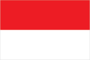
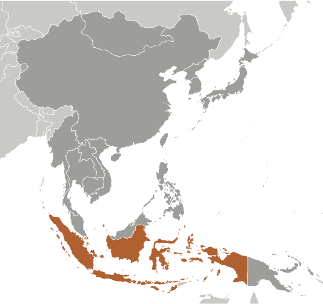
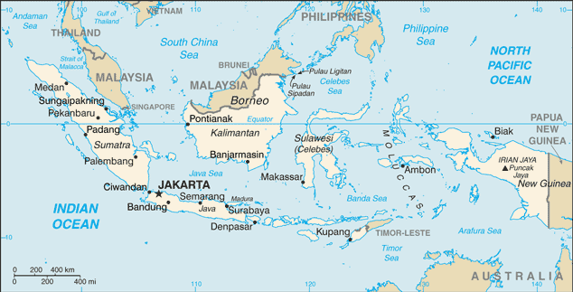

# Indonesia

## Introduction

**_Background:_**   
The Dutch began to colonize Indonesia in the early 17th century; Japan occupied the islands from 1942 to 1945. Indonesia declared its independence shortly before Japan's surrender, but it required four years of sometimes brutal fighting, intermittent negotiations, and UN mediation before the Netherlands agreed to transfer sovereignty in 1949. A period of sometimes unruly parliamentary democracy ended in 1957 when President SOEKARNO declared martial law and instituted "Guided Democracy." After an abortive coup in 1965 by alleged communist sympathizers, SOEKARNO was gradually eased from power. From 1967 until 1988, President SUHARTO ruled Indonesia with his "New Order" government. After rioting toppled Suharto in 1998, free and fair legislative elections took place in 1999. Indonesia is now the world's third most populous democracy, the world's largest archipelagic state, and the world's largest Muslim-majority nation. Current issues include: alleviating poverty, improving education, preventing terrorism, consolidating democracy after four decades of authoritarianism, implementing economic and financial reforms, stemming corruption, reforming the criminal justice system, holding the military and police accountable for human rights violations, addressing climate change, and controlling infectious diseases, particularly those of global and regional importance. In 2005, Indonesia reached a historic peace agreement with armed separatists in Aceh, which led to democratic elections in Aceh in December 2006. Indonesia continues to face low intensity armed resistance in Papua by the separatist Free Papua Movement.

## Geography

**_Location:_**   
Southeastern Asia, archipelago between the Indian Ocean and the Pacific Ocean

**_Geographic coordinates:_**   
5 00 S, 120 00 E

**_Map references:_**   
Southeast Asia

**_Area:_**   
**total:** 1,904,569 sq km   
**land:** 1,811,569 sq km   
**water:** 93,000 sq km

**_Area - comparative:_**   
slightly less than three times the size of Texas

**_Land boundaries:_**   
**total:** 2,958 km   
**border countries:** Timor-Leste 253 km, Malaysia 1,881 km, Papua New Guinea 824 km

**_Coastline:_**   
54,716 km

**_Maritime claims:_**   
measured from claimed archipelagic straight baselines   
**territorial sea:** 12 nm   
**exclusive economic zone:** 200 nm

**_Climate:_**   
tropical; hot, humid; more moderate in highlands

**_Terrain:_**   
mostly coastal lowlands; larger islands have interior mountains

**_Elevation extremes:_**   
**lowest point:** Indian Ocean 0 m   
**highest point:** Puncak Jaya 4,884 m

**_Natural resources:_**   
petroleum, tin, natural gas, nickel, timber, bauxite, copper, fertile soils, coal, gold, silver

**_Land use:_**   
**arable land:** 12.34%   
**permanent crops:** 10.5%   
**other:** 77.16% (2011)

**_Irrigated land:_**   
67,220 sq km (2005)

**_Total renewable water resources:_**   
2,019 cu km (2011)

**_Freshwater withdrawal (domestic/industrial/agricultural):_**   
**total:** 113.3 cu km/yr (11%/19%/71%)   
**per capita:** 517.3 cu m/yr (2005)

**_Natural hazards:_**   
occasional floods; severe droughts; tsunamis; earthquakes; volcanoes; forest fires   
**volcanism:** Indonesia contains the most volcanoes of any country in the world - some 76 are historically active; significant volcanic activity occurs on Java, Sumatra, the Sunda Islands, Halmahera Island, Sulawesi Island, Sangihe Island, and in the Banda Sea; Merapi (elev. 2,968 m), Indonesia's most active volcano and in eruption since 2010, has been deemed a Decade Volcano by the International Association of Volcanology and Chemistry of the Earth's Interior, worthy of study due to its explosive history and close proximity to human populations; other notable historically active volcanoes include Agung, Awu, Karangetang, Krakatau (Krakatoa), Makian, Raung, and Tambora

**_Environment - current issues:_**   
deforestation; water pollution from industrial wastes, sewage; air pollution in urban areas; smoke and haze from forest fires

**_Environment - international agreements:_**   
**party to:** Biodiversity, Climate Change, Climate Change-Kyoto Protocol, Desertification, Endangered Species, Hazardous Wastes, Law of the Sea, Ozone Layer Protection, Ship Pollution, Tropical Timber 83, Tropical Timber 94, Wetlands   
**signed, but not ratified:** Marine Life Conservation

**_Geography - note:_**   
archipelago of 17,508 islands, some 6,000 of which are inhabited (Indonesia is the world's largest country comprised solely of islands); straddles equator; strategic location astride or along major sea lanes from Indian Ocean to Pacific Ocean

## People and Society

**_Nationality:_**   
**noun:** Indonesian(s)   
**adjective:** Indonesian

**_Ethnic groups:_**   
Javanese 40.1%, Sundanese 15.5%, Malay 3.7%, Batak 3.6%, Madurese 3%, Betawi 2.9%, Minangkabau 2.7%, Buginese 2.7%, Bantenese 2%, Banjarese 1.7%, Balinese 1.7%, Acehnese 1.4%, Dayak 1.4%, Sasak 1.3%, Chinese 1.2%, other 15% (2010 est.)

**_Languages:_**   
Bahasa Indonesia (official, modified form of Malay), English, Dutch, local dialects (of which the most widely spoken is Javanese)   
**note:** more than 700 languages are used in Indonesia

**_Religions:_**   
Muslim 87.2%, Christian 7%, Roman Catholic 2.9%, Hindu 1.7%, other 0.9% (includes Buddhist and Confucian), unspecified 0.4% (2010 est.)

**_Population:_**   
253,609,643 (July 2014 est.)

**_Age structure:_**   
**0-14 years:** 26.2% (male 33,854,520/female 32,648,568)   
**15-24 years:** 17.1% (male 22,067,716/female 21,291,548)   
**25-54 years:** 42.3% (male 54,500,650/female 52,723,359)   
**55-64 years:** 7.9% (male 9,257,637/female 10,780,724)   
**65 years and over:** 6.4% (male 7,176,865/female 9,308,056) (2014 est.)

**_Dependency ratios:_**   
**total dependency ratio:** 51 %   
**youth dependency ratio:** 43 %   
**elderly dependency ratio:** 8 %   
**potential support ratio:** 12.5 (2014 est.)

**_Median age:_**   
**total:** 29.2 years   
**male:** 28.7 years   
**female:** 29.8 years (2014 est.)

**_Population growth rate:_**   
0.95% (2014 est.)

**_Birth rate:_**   
17.04 births/1,000 population (2014 est.)

**_Death rate:_**   
6.34 deaths/1,000 population (2014 est.)

**_Net migration rate:_**   
-1.18 migrant(s)/1,000 population (2014 est.)

**_Urbanization:_**   
**urban population:** 50.7% of total population (2011)   
**rate of urbanization:** 2.45% annual rate of change (2010-15 est.)

**_Major urban areas - population:_**   
JAKARTA (capital) 9.769 million; Surabaya 2.787 million; Bandung 2.429 million; Medan 2.118 million; Semarang 1.573 million; Palembang 1.455 million (2011)

**_Sex ratio:_**   
**at birth:** 1.05 male(s)/female   
**0-14 years:** 1.04 male(s)/female   
**15-24 years:** 1.04 male(s)/female   
**25-54 years:** 1.03 male(s)/female   
**55-64 years:** 1 male(s)/female   
**65 years and over:** 0.78 male(s)/female   
**total population:** 1 male(s)/female (2014 est.)

**_Mother's mean age at first birth:_**   
22.8   
**note:** median age at first birth among women 25-29 (2012 est.)

**_Maternal mortality rate:_**   
220 deaths/100,000 live births (2010)

**_Infant mortality rate:_**   
**total:** 25.16 deaths/1,000 live births   
**male:** 29.45 deaths/1,000 live births   
**female:** 20.66 deaths/1,000 live births (2014 est.)

**_Life expectancy at birth:_**   
**total population:** 72.17 years   
**male:** 69.59 years   
**female:** 74.88 years (2014 est.)

**_Total fertility rate:_**   
2.18 children born/woman (2014 est.)

**_Contraceptive prevalence rate:_**   
61.9% (2012)

**_Health expenditures:_**   
2.7% of GDP (2011)

**_Physicians density:_**   
0.2 physicians/1,000 population (2012)

**_Hospital bed density:_**   
0.6 beds/1,000 population (2010)

**_Drinking water source:_**   
**improved:** urban: 93% of population; rural: 76.4% of population; total: 84.9% of population   
**unimproved:** urban: 7% of population; rural: 23.6% of population; total: 15.1% of population (2012 est.)

**_Sanitation facility access:_**   
**improved:** urban: 71.4% of population; rural: 45.5% of population; total: 58.8% of population   
**unimproved:** urban: 28.6% of population; rural: 54.5% of population; total: 41.2% of population (2012 est.)

**_HIV/AIDS - adult prevalence rate:_**   
0.4% (2012 est.)

**_HIV/AIDS - people living with HIV/AIDS:_**   
605,500 (2012 est.)

**_HIV/AIDS - deaths:_**   
26,800 (2012 est.)

**_Major infectious diseases:_**   
**degree of risk:** very high   
**food or waterborne diseases:** bacterial diarrhea, hepatitis A, and typhoid fever   
**vectorborne diseases:** dengue fever and malaria   
**note:** highly pathogenic H5N1 avian influenza has been identified in this country; it poses a negligible risk with extremely rare cases possible among US citizens who have close contact with birds (2013)

**_Obesity - adult prevalence rate:_**   
4.8% (2008)

**_Children under the age of 5 years underweight:_**   
18.6% (2010)

**_Education expenditures:_**   
2.8% of GDP (2011)

**_Literacy:_**   
**definition:** age 15 and over can read and write   
**total population:** 92.8%   
**male:** 95.6%   
**female:** 90.1% (2011 est.)

**_School life expectancy (primary to tertiary education):_**   
**total:** 13 years   
**male:** 13 years   
**female:** 13 years (2011)

**_Child labor - children ages 5-14:_**   
**total number:** 4,026,285   
**percentage:** 7 %   
**note:** data represents children ages 5-17 (2009 est.)

**_Unemployment, youth ages 15-24:_**   
**total:** 22.2%   
**male:** 21.6%   
**female:** 23% (2009)

## Government

**_Country name:_**   
**conventional long form:** Republic of Indonesia   
**conventional short form:** Indonesia   
**local long form:** Republik Indonesia   
**local short form:** Indonesia   
**former:** Netherlands East Indies, Dutch East Indies

**_Government type:_**   
republic

**_Capital:_**   
**name:** Jakarta   
**geographic coordinates:** 6 10 S, 106 49 E   
**time difference:** UTC+7 (12 hours ahead of Washington, DC, during Standard Time)   
**note:** Indonesia has three time zones

**_Administrative divisions:_**   
31 provinces (provinsi-provinsi, singular - provinsi), 1 autonomous province\*, 1 special region\*\* (daerah-daerah istimewa, singular - daerah istimewa), and 1 national capital district\*\*\* (daerah khusus ibukota); Aceh\*, Bali, Banten, Bengkulu, Gorontalo, Jakarta Raya\*\*\*, Jambi, Jawa Barat (West Java), Jawa Tengah (Central Java), Jawa Timur (East Java), Kalimantan Barat (West Kalimantan), Kalimantan Selatan (South Kalimantan), Kalimantan Utara (North Kalimantan), Kalimantan Tengah (Central Kalimantan), Kalimantan Timur (East Kalimantan), Kepulauan Bangka Belitung (Bangka Belitung Islands), Kepulauan Riau (Riau Islands), Lampung, Maluku, Maluku Utara (North Maluku), Nusa Tenggara Barat (West Nusa Tenggara), Nusa Tenggara Timur (East Nusa Tenggara), Papua, Papua Barat (West Papua), Riau, Sulawesi Barat (West Sulawesi), Sulawesi Selatan (South Sulawesi), Sulawesi Tengah (Central Sulawesi), Sulawesi Tenggara (Southeast Sulawesi), Sulawesi Utara (North Sulawesi), Sumatera Barat (West Sumatra), Sumatera Selatan (South Sumatra), Sumatera Utara (North Sumatra), Yogyakarta\*\*   
**note:** following the implementation of decentralization beginning on 1 January 2001, regencies and municipalities have become the key administrative units responsible for providing most government services

**_Independence:_**   
17 August 1945 (declared)

**_National holiday:_**   
Independence Day, 17 August (1945)

**_Constitution:_**   
drafted July to August 1945, effective 17 August 1945, abrogated by 1949 and 1950 constitutions, 1945 constitution restored 5 July 1959; amended several times, last in 2002 (2013)

**_Legal system:_**   
civil law system based on the Roman-Dutch model and influenced by customary law

**_International law organization participation:_**   
has not submitted an ICJ jurisdiction declaration; non-party state to the ICCt

**_Suffrage:_**   
17 years of age; universal and married persons regardless of age

**_Executive branch:_**   
**chief of state:** President Susilo Bambang YUDHOYONO (since 20 October 2004); Vice President BOEDIONO (since 20 October 2009); note - the president is both chief of state and head of government   
**head of government:** President Susilo Bambang YUDHOYONO (since 20 October 2004); Vice President BOEDIONO (since 20 October 2009)   
**cabinet:** Cabinet appointed by the president   
**elections:** president and vice president elected for five-year terms (eligible for a second term) by direct vote; presidential election last held on 8 July 2009 (next to be held in 2014)   
**election results:** Susilo Bambang YUDHOYONO elected president; percent of vote - Susilo Bambang YUDHOYONO 60.8%, MEGAWATI Sukarnoputri 26.8%, Jusuf KALLA 12.4%

**_Legislative branch:_**   
People's Consultative Assembly (Majelis Permusyawaratan Rakyat or MPR) is the upper house; it consists of members of the DPR and DPD and has role in inaugurating and impeaching the president and in amending the constitution but does not formulate national policy; House of Representatives or Dewan Perwakilan Rakyat (DPR) (560 seats, members elected to serve five-year terms), formulates and passes legislation at the national level; House of Regional Representatives (Dewan Perwakilan Daerah or DPD), constitutionally mandated role includes providing legislative input to DPR on issues affecting regions (132 members, four from each of Indonesia's origianal 30 provinces, two special regions, and one special capital city district)   
**elections:** last held on 9 April 2009 (next to be held in 2014)   
**election results:** percent of vote by party - PD 20.9%, GOLKAR 14.5%, PDI-P 14.0%, PKS 7.9%, PAN 6.0%, PPP 5.3%, PKB 4.9%, GERINDRA 4.5%, HANURA 3.8%, others 18.2%; seats by party - PD 148, GOLKAR 107, PDI-P 94, PKS 57, PAN 46, PPP 37, PKB 28, GERINDRA 26, HANURA 17   
**note:** 29 other parties received less than 2.5% of the vote so did not obtain any seats; because of election rules, the number of seats won does not always follow the percentage of votes received by parties

**_Judicial branch:_**   
**highest court(s):** Supreme Court or Mahkamah Agung (51 judges divided into 8 chambers); Constitutional Court (consists of 9 judges)   
**judge selection and term of office:** Supreme Court judges nominated by Judicial Commission, appointed by president with concurrence of parliament; judges serve until retirement age; Constitutional Court judges - 3 nominated by president, 3 by Supreme Court, and 3 by parliament; judges appointed by the president; judges serve until mandatory retirement at age 70   
**subordinate courts:** High Courts of Appeal, district courts, religious courts

**_Political parties and leaders:_**   
Democrat Party or PD [Susilo Bambang YUDHOYONO]   
Functional Groups Party or GOLKAR [Aburizal BAKRIE]   
Great Indonesia Movement Party or GERINDRA [SUHARDI]   
Indonesia Democratic Party-Struggle or PDI-P [MEGAWATI Sukarnoputri]   
National Awakening Party or PKB [Muhaiman ISKANDAR]   
National Mandate Party or PAN [Hatta RAJASA]   
People's Conscience Party or HANURA [WIRANTO]   
Prosperous Justice Party or PKS [Anis MATTA]   
United Development Party or PPP [Suryadharma ALI]

**_Political pressure groups and leaders:_**   
Commission for the "Disappeared" and Victims of Violence or KontraS   
Indonesia Corruption Watch or ICW   
Indonesian Forum for the Environment or WALHI

**_International organization participation:_**   
ADB, APEC, ARF, ASEAN, BIS, CD, CICA (observer), CP, D-8, EAS, EITI (candidate country), FAO, G-11, G-15, G-20, G-77, IAEA, IBRD, ICAO, ICC (national committees), ICRM, IDA, IDB, IFAD, IFC, IFRCS, IHO, ILO, IMF, IMO, IMSO, Interpol, IOC, IOM (observer), IPU, ISO, ITSO, ITU, ITUC (NGOs), MIGA, MONUSCO, NAM, OECD (Enhanced Engagement, OIC, OPCW, PIF (partner), UN, UNAMID, UNCTAD, UNESCO, UNIDO, UNIFIL, UNISFA, UNMIL, UNMISS, UNWTO, UPU, WCO, WFTU (NGOs), WHO, WIPO, WMO, WTO

**_Diplomatic representation in the US:_**   
**chief of mission:** Ambassador Budi BOWOLEKSONO (since 21 May 2014)   
**chancery:** 2020 Massachusetts Avenue NW, Washington, DC 20036   
**telephone:** [1] (202) 775-5200   
**FAX:** [1] (202) 775-5365   
**consulate(s) general:** Chicago, Houston, Los Angeles, New York, San Francisco

**_Diplomatic representation from the US:_**   
**chief of mission:** Ambassador-designate Robert O. BLAKE (since 21 November 2013); Charge d'Affaires Kristen F. BAUER (since 18 July 2013)   
**embassy:** Jalan Medan Merdeka Selatan 3-5, Jakarta 10110   
**mailing address:** Unit 8129, Box 1, FPO AP 96520   
**telephone:** [62] (21) 3435-9000   
**FAX:** [62] (21) 386-2259   
**consulate general:** Surabaya   
**presence post:** Medan   
**consular agency:** Bali

**_Flag description:_**   
two equal horizontal bands of red (top) and white; the colors derive from the banner of the Majapahit Empire of the 13th-15th centuries; red symbolizes courage, white represents purity   
**note:** similar to the flag of Monaco, which is shorter; also similar to the flag of Poland, which is white (top) and red

**_National symbol(s):_**   
garuda (mythical bird)

**_National anthem:_**   
**name:** "Indonesia Raya" (Great Indonesia)   
**lyrics/music:** Wage Rudolf SOEPRATMAN   
**note:** adopted 1945

## Economy

**_Economy - overview:_**   
Indonesia, a vast polyglot nation, has grown strongly since 2010. During the global financial crisis, Indonesia outperformed its regional neighbors and joined China and India as the only G20 members posting growth. The government has promoted fiscally conservative policies, resulting in a debt-to-GDP ratio of less than 25% and historically low rates of inflation. Fitch and Moody's upgraded Indonesia's credit rating to investment grade in December 2011. Indonesia still struggles with poverty and unemployment, inadequate infrastructure, corruption, a complex regulatory environment, and unequal resource distribution among regions. The government also faces the challenges of quelling labor unrest and reducing fuel subsidies in the face of high oil prices.

**_GDP (purchasing power parity):_**   
$1.285 trillion (2013 est.)   
$1.22 trillion (2012 est.)   
$1.149 trillion (2011 est.)   
**note:** data are in 2013 US dollars

**_GDP (official exchange rate):_**   
$867.5 billion (2013 est.)

**_GDP - real growth rate:_**   
5.3% (2013 est.)   
6.2% (2012 est.)   
6.5% (2011 est.)

**_GDP - per capita (PPP):_**   
$5,200 (2013 est.)   
$5,000 (2012 est.)   
$4,800 (2011 est.)   
**note:** data are in 2013 US dollars

**_Gross national saving:_**   
31.5% of GDP (2013 est.)   
32.6% of GDP (2012 est.)   
33.1% of GDP (2011 est.)

**_GDP - composition, by end use:_**   
**household consumption:** 56%   
**government consumption:** 9.4%   
**investment in fixed capital:** 32.7%   
**investment in inventories:** 2%   
**exports of goods and services:** 23.5%   
**imports of goods and services:** -25.8%; (2013 est.)

**_GDP - composition, by sector of origin:_**   
**agriculture:** 14.3%   
**industry:** 46.6%   
**services:** 39.1% (2013 est.)

**_Agriculture - products:_**   
rubber and similar products, palm oil, poultry, beef, forest products, shrimp, cocoa, coffee, medicinal herbs, essential oil, fish and its similar products, and spices

**_Industries:_**   
petroleum and natural gas, textiles, automotive, electrical appliances, apparel, footwear, mining, cement, medical instuments and appliances, handicrafts, chemical fertilizers, plywood, rubber, processed food, jewelry, and tourism

**_Industrial production growth rate:_**   
4.3% (2013 est.)

**_Labor force:_**   
120 million (2013 est.)

**_Labor force - by occupation:_**   
**agriculture:** 38.9%   
**industry:** 13.2%   
**services:** 47.9% (2012 est.)

**_Unemployment rate:_**   
6.6% (2013 est.)   
6.1% (2012 est.)

**_Population below poverty line:_**   
11.7% (2012 est.)

**_Household income or consumption by percentage share:_**   
**lowest 10%:** 3.3%   
**highest 10%:** 29.9% (2009)

**_Distribution of family income - Gini index:_**   
36.8 (2009)   
39.4 (2005)

**_Budget:_**   
**revenues:** $137.5 billion   
**expenditures:** $166 billion (2013 est.)

**_Taxes and other revenues:_**   
15.8% of GDP (2013 est.)

**_Budget surplus (+) or deficit (-):_**   
-3.3% of GDP (2013 est.)

**_Public debt:_**   
24.2% of GDP (2013 est.)   
23% of GDP (2012 est.)

**_Fiscal year:_**   
calendar year

**_Inflation rate (consumer prices):_**   
7.7% (2013 est.)   
4.3% (2012 est.)

**_Central bank discount rate:_**   
6.37% (31 December 2010)   
6.46% (31 December 2009)   
**note:** this figure represents the 3-month SBI rate; the Bank of Indonesia has not employed the one-month SBI since September 2010

**_Commercial bank prime lending rate:_**   
12.1% (31 December 2013 est.)   
11.8% (31 December 2012 est.)   
**note:** these figures represent the average annualized rate on working capital loans

**_Stock of narrow money:_**   
$82.99 billion (31 December 2013 est.)   
$87.04 billion (31 December 2012 est.)

**_Stock of broad money:_**   
$325 billion (31 December 2013 est.)   
$342 billion (31 December 2012 est.)

**_Stock of domestic credit:_**   
$336.2 billion (31 December 2013 est.)   
$350 billion (31 December 2012 est.)

**_Market value of publicly traded shares:_**   
$396.8 billion (31 December 2012 est.)   
$390.1 billion (31 December 2011)   
$360.4 billion (31 December 2010 est.)

**_Current account balance:_**   
-$28.72 billion (2013 est.)   
-$24.07 billion (2012 est.)

**_Exports:_**   
$178.9 billion (2013 est.)   
$187.3 billion (2012 est.)

**_Exports - commodities:_**   
oil and gas, electrical appliances, plywood, textiles, rubber

**_Exports - partners:_**   
Japan 15.9%, China 11.4%, Singapore 9%, South Korea 7.9%, US 7.8%, India 6.6%, Malaysia 5.9% (2012)

**_Imports:_**   
$178.6 billion (2013 est.)   
$178.7 billion (2012 est.)

**_Imports - commodities:_**   
machinery and equipment, chemicals, fuels, foodstuffs

**_Imports - partners:_**   
China 15.3%, Singapore 13.6%, Japan 11.9%, Malaysia 6.4%, South Korea 6.2%, US 6.1%, Thailand 6% (2012)

**_Reserves of foreign exchange and gold:_**   
$83.45 billion (31 December 2013 est.)   
$112.8 billion (31 December 2012 est.)

**_Debt - external:_**   
$223.8 billion (31 December 2013 est.)   
$224.1 billion (31 December 2012 est.)

**_Stock of direct foreign investment - at home:_**   
$207.2 billion (31 December 2013 est.)   
$192.7 billion (31 December 2012 est.)

**_Stock of direct foreign investment - abroad:_**   
$17.41 billion (31 December 2013 est.)   
$14.81 billion (31 December 2012 est.)

**_Exchange rates:_**   
Indonesian rupiah (IDR) per US dollar -   
10,341.6 (2013 est.)   
9,386.63 (2012 est.)   
9,090.4 (2010 est.)   
10,389.9 (2009)   
9,698.9 (2008)

## Energy

**_Electricity - production:_**   
173.8 billion kWh (2011 est.)

**_Electricity - consumption:_**   
158 billion kWh (2011 est.)

**_Electricity - exports:_**   
0 kWh (2012 est.)

**_Electricity - imports:_**   
2.542 billion kWh (2011 est.)

**_Electricity - installed generating capacity:_**   
39.9 million kW (2011 est.)

**_Electricity - from fossil fuels:_**   
87% of total installed capacity (2011 est.)

**_Electricity - from nuclear fuels:_**   
0% of total installed capacity (2011 est.)

**_Electricity - from hydroelectric plants:_**   
9.9% of total installed capacity (2011 est.)

**_Electricity - from other renewable sources:_**   
3.1% of total installed capacity (2011 est.)

**_Crude oil - production:_**   
974,300 bbl/day (2012 est.)

**_Crude oil - exports:_**   
338,100 bbl/day (2010 est.)

**_Crude oil - imports:_**   
388,400 bbl/day (2010 est.)

**_Crude oil - proved reserves:_**   
4.03 billion bbl (1 January 2013 est.)

**_Refined petroleum products - production:_**   
935,300 bbl/day (2011 est.)

**_Refined petroleum products - consumption:_**   
1.322 million bbl/day (2011 est.)

**_Refined petroleum products - exports:_**   
142,400 bbl/day (2010 est.)

**_Refined petroleum products - imports:_**   
473,400 bbl/day (2011 est.)

**_Natural gas - production:_**   
76.25 billion cu m (2011 est.)

**_Natural gas - consumption:_**   
39.56 billion cu m (2010 est.)

**_Natural gas - exports:_**   
38.67 billion cu m (2011 est.)

**_Natural gas - imports:_**   
0 cu m (2011 est.)

**_Natural gas - proved reserves:_**   
3.069 trillion cu m (1 January 2013 est.)

**_Carbon dioxide emissions from consumption of energy:_**   
426.8 million Mt (2011 est.)

## Communications

**_Telephones - main lines in use:_**   
37.983 million (2012)

**_Telephones - mobile cellular:_**   
281.96 million (2012)

**_Telephone system:_**   
**general assessment:** domestic service includes an interisland microwave system, an HF radio police net, and a domestic satellite communications system; international service good   
**domestic:** coverage provided by existing network has been expanded by use of over 200,000 telephone kiosks many located in remote areas; mobile-cellular subscribership growing rapidly   
**international:** country code - 62; landing point for both the SEA-ME-WE-3 and SEA-ME-WE-4 submarine cable networks that provide links throughout Asia, the Middle East, and Europe; satellite earth stations - 2 Intelsat (1 Indian Ocean and 1 Pacific Ocean) (2011)

**_Broadcast media:_**   
mixture of about a dozen national TV networks - 2 public broadcasters, the remainder private broadcasters - each with multiple transmitters; more than 100 local TV stations; widespread use of satellite and cable TV systems; public radio broadcaster operates 6 national networks as well as regional and local stations; overall, more than 700 radio stations with more than 650 privately operated (2008)

**_Internet country code:_**   
.id

**_Internet hosts:_**   
1.344 million (2012)

**_Internet users:_**   
20 million (2009)

## Transportation

**_Airports:_**   
673 (2013)

**_Airports - with paved runways:_**   
**total:** 186   
**over 3,047 m:** 5   
**2,438 to 3,047 m:** 21   
**1,524 to 2,437 m:** 51   
**914 to 1,523 m:** 72   
**under 914 m:** 37 (2013)

**_Airports - with unpaved runways:_**   
**total:** 487   
**1,524 to 2,437 m:** 4   
**914 to 1,523 m:** 23   
**under 914 m:** 460 (2013)

**_Heliports:_**   
76 (2013)

**_Pipelines:_**   
condensate 1,064 km; condensate/gas 150 km; gas 11,702 km; liquid petroleum gas 119 km; oil 7,767 km; oil/gas/water 77 km; refined products 728 km; unknown 53 km; water 44 km (2013)

**_Railways:_**   
**total:** 5,042 km   
**narrow gauge:** 5,042 km 1.067-m gauge (565 km electrified) (2008)

**_Roadways:_**   
**total:** 496,607 km   
**paved:** 283,102 km   
**unpaved:** 213,505 km (2011)

**_Waterways:_**   
21,579 km (2011)

**_Merchant marine:_**   
**total:** 1,340   
**by type:** bulk carrier 105, cargo 618, chemical tanker 69, container 120, liquefied gas 28, passenger 49, passenger/cargo 77, petroleum tanker 244, refrigerated cargo 6, roll on/roll off 12, specialized tanker 1, vehicle carrier 11   
**foreign-owned:** 69 (China 1, France 1, Greece 1, Japan 8, Jordan 1, Malaysia 1, Norway 3, Singapore 46, South Korea 2, Taiwan 1, UK 2, US 2)   
**registered in other countries:** 95 (Bahamas 2, Cambodia 2, China 2, Hong Kong 10, Liberia 4, Marshall Islands 1, Mongolia 2, Panama 10, Singapore 60, Tuvalu 1, unknown 1) (2010)

**_Ports and terminals:_**   
**major seaport(s):** Banjarmasin, Belawan, Kotabaru, Krueg Geukueh, Palembang, Panjang, Sungai Pakning, Tanjung Perak, Tanjung Priok   
**container port(s) (TEUs):** Tanjung Priok (5,617,562)

**_Transportation - note:_**   
the International Maritime Bureau continues to report the territorial and offshore waters in the Strait of Malacca and South China Sea as high risk for piracy and armed robbery against ships; attacks have increased yearly since 2009; in 2012, 73 commercial vessels were boarded and 47 crew members taken hostage; hijacked vessels are often disguised and cargo diverted to ports in East Asia; crews have been murdered or cast adrift

## Military

**_Military branches:_**   
Indonesian Armed Forces (Tentara Nasional Indonesia, TNI): Army (TNI-Angkatan Darat (TNI-AD)), Navy (TNI-Angkatan Laut (TNI-AL); includes marines (Korps Marinir, KorMar), naval air arm), Air Force (TNI-Angkatan Udara (TNI-AU)), National Air Defense Command (Kommando Pertahanan Udara Nasional (Kohanudnas)) (2013)

**_Military service age and obligation:_**   
18-45 years of age for voluntary military service, with selective conscription authorized; 2-year service obligation, with reserve obligation to age 45 (officers); Indonesian citizens only (2012)

**_Manpower available for military service:_**   
**males age 16-49:** 65,847,171   
**females age 16-49:** 63,228,017 (2010 est.)

**_Manpower fit for military service:_**   
**males age 16-49:** 54,264,299   
**females age 16-49:** 53,274,361 (2010 est.)

**_Manpower reaching militarily significant age annually:_**   
**male:** 2,263,892   
**female:** 2,191,267 (2010 est.)

**_Military expenditures:_**   
0.78% of GDP (2012)   
0.67% of GDP (2011)   
0.78% of GDP (2010)

## Transnational Issues

**_Disputes - international:_**   
Indonesia has a stated foreign policy objective of establishing stable fixed land and maritime boundaries with all of its neighbors; three stretches of land borders with Timor-Leste have yet to be delimited, two of which are in the Oecussi exclave area, and no maritime or Exclusive Economic Zone (EEZ) boundaries have been established between the countries; many refugees from Timor-Leste who left in 2003 still reside in Indonesia and refuse repatriation; all borders between Indonesia and Australia have been agreed upon bilaterally, but a 1997 treaty that would settle the last of their maritime and EEZ boundary has yet to be ratified by Indonesia's legislature; Indonesian groups challenge Australia's claim to Ashmore Reef; Australia has closed parts of the Ashmore and Cartier Reserve to Indonesian traditional fishing and placed restrictions on certain catches; land and maritime negotiations with Malaysia are ongoing, and disputed areas include the controversial Tanjung Datu and Camar Wulan border area in Borneo and the maritime boundary in the Ambalat oil block in the Celebes Sea; Indonesia and Singapore continue to work on finalizing their 1973 maritime boundary agreement by defining unresolved areas north of Indonesia's Batam Island; Indonesian secessionists, squatters, and illegal migrants create repatriation problems for Papua New Guinea; maritime delimitation talks continue with Palau; EEZ negotiations with Vietnam are ongoing, and the two countries in Fall 2011 agreed to work together to reduce illegal fishing along their maritime boundary

**_Refugees and internally displaced persons:_**   
**IDPs:** at least 90,000 (inter-communal, inter-faith, and separatist violence between 1998 and 2004 in Aceh and Papua; religious attacks and land conflicts in 2012 and 2013; most IDPs in Aceh, Papua, West Papua, Central Kalimantan, Central Sulawesi Provinces, Maluku, North Maluku) (2014) (2011)

**_Illicit drugs:_**   
illicit producer of cannabis largely for domestic use; producer of methamphetamine and ecstasy

............................................................   
_Page last updated on June 22, 2014_
