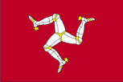
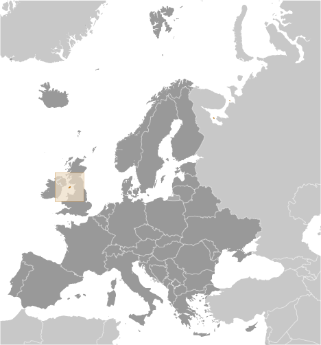
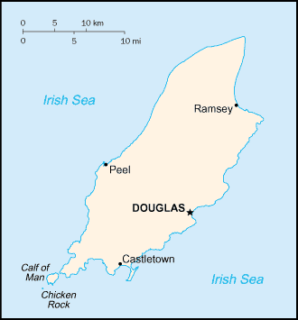

# Isle of Man

_British crown dependency_

## Introduction

**_Background:_**   
Part of the Norwegian Kingdom of the Hebrides until the 13th century when it was ceded to Scotland, the isle came under the British crown in 1765. Current concerns include reviving the almost extinct Manx Gaelic language. Isle of Man is a British crown dependency but is not part of the UK or of the European Union. However, the UK Government remains constitutionally responsible for its defense and international representation.

## Geography

**_Location:_**   
Western Europe, island in the Irish Sea, between Great Britain and Ireland

**_Geographic coordinates:_**   
54 15 N, 4 30 W

**_Map references:_**   
Europe

**_Area:_**   
**total:** 572 sq km   
**land:** 572 sq km   
**water:** 0 sq km

**_Area - comparative:_**   
slightly more than three times the size of Washington, DC

**_Land boundaries:_**   
0 km

**_Coastline:_**   
160 km

**_Maritime claims:_**   
**territorial sea:** 12 nm   
**exclusive fishing zone:** 12 nm

**_Climate:_**   
temperate; cool summers and mild winters; overcast about a third of the time

**_Terrain:_**   
hills in north and south bisected by central valley

**_Elevation extremes:_**   
**lowest point:** Irish Sea 0 m   
**highest point:** Snaefell 621 m

**_Natural resources:_**   
none

**_Land use:_**   
**arable land:** 43.86%   
**permanent crops:** 0%   
**other:** 56.14% (permanent pastures, forests, mountain, and heathland) (2011)

**_Irrigated land:_**   
0 sq km (2011)

**_Natural hazards:_**   
NA

**_Environment - current issues:_**   
waste disposal (both household and industrial); transboundary air pollution

**_Geography - note:_**   
one small islet, the Calf of Man, lies to the southwest and is a bird sanctuary

## People and Society

**_Nationality:_**   
**noun:** Manxman (men), Manxwoman (women)   
**adjective:** Manx

**_Ethnic groups:_**   
white 96.5%, Asian/Asian British 1.9%, other 1.5% (2011 est.)

**_Languages:_**   
English, Manx Gaelic (about 2% of the population has some knowledge)

**_Religions:_**   
Protestant (Anglican, Methodist, Baptist, Presbyterian, Society of Friends), Roman Catholic

**_Population:_**   
86,866 (July 2014 est.)

**_Age structure:_**   
**0-14 years:** 16.3% (male 7,457/female 6,721)   
**15-24 years:** 11.9% (male 5,371/female 4,990)   
**25-54 years:** 39.5% (male 17,110/female 17,209)   
**55-64 years:** 12.8% (male 5,605/female 5,519)   
**65 years and over:** 19.1% (male 7,839/female 9,045) (2014 est.)

**_Median age:_**   
**total:** 43.4 years   
**male:** 42.7 years   
**female:** 44.1 years (2014 est.)

**_Population growth rate:_**   
0.8% (2014 est.)

**_Birth rate:_**   
11.17 births/1,000 population (2014 est.)

**_Death rate:_**   
10.03 deaths/1,000 population (2014 est.)

**_Net migration rate:_**   
6.84 migrant(s)/1,000 population (2014 est.)

**_Urbanization:_**   
**urban population:** 50.5% of total population (2011)   
**rate of urbanization:** 0.38% annual rate of change (2010-15 est.)

**_Major urban areas - population:_**   
DOUGLAS (capital) 27,000 (2011)

**_Sex ratio:_**   
**at birth:** 1.08 male(s)/female   
**0-14 years:** 1.11 male(s)/female   
**15-24 years:** 1.08 male(s)/female   
**25-54 years:** 0.99 male(s)/female   
**55-64 years:** 1 male(s)/female   
**65 years and over:** 0.85 male(s)/female   
**total population:** 0.99 male(s)/female (2014 est.)

**_Infant mortality rate:_**   
**total:** 4.17 deaths/1,000 live births   
**male:** 4.12 deaths/1,000 live births   
**female:** 4.21 deaths/1,000 live births (2014 est.)

**_Life expectancy at birth:_**   
**total population:** 80.98 years   
**male:** 79.33 years   
**female:** 82.75 years (2014 est.)

**_Total fertility rate:_**   
1.94 children born/woman (2014 est.)

**_HIV/AIDS - adult prevalence rate:_**   
NA

**_HIV/AIDS - people living with HIV/AIDS:_**   
NA

**_HIV/AIDS - deaths:_**   
NA

**_Literacy:_**   
NA

**_Unemployment, youth ages 15-24:_**   
**total:** 7.2%   
**male:** 9.5%   
**female:** 5.1% (2006)

## Government

**_Country name:_**   
**conventional long form:** none   
**conventional short form:** Isle of Man   
**abbreviation:** I.O.M.

**_Dependency status:_**   
British crown dependency

**_Government type:_**   
parliamentary democracy

**_Capital:_**   
**name:** Douglas   
**geographic coordinates:** 54 09 N, 4 29 W   
**time difference:** UTC 0 (5 hours ahead of Washington, DC, during Standard Time)   
**daylight saving time:** +1hr, begins last Sunday in March; ends last Sunday in October

**_Administrative divisions:_**   
none; there are no first-order administrative divisions as defined by the US Government, but there are 24 local authorities each with its own elections

**_Independence:_**   
none (British crown dependency)

**_National holiday:_**   
Tynwald Day, 5 July

**_Constitution:_**   
several previous; latest announced 16 October 2006 (Isle of Man Constitution Act 2006) (2006)

**_Legal system:_**   
the laws of the UK where applicable apply and include Manx statutes

**_Suffrage:_**   
16 years of age; universal

**_Executive branch:_**   
**chief of state:** Lord of Mann Queen ELIZABETH II (since 6 February 1952); represented by Lieutenant Governor Adam WOOD (since 7 April 2011)   
**head of government:** Chief Minister Allan BELL (since 11 October 2011)   
**cabinet:** Council of Ministers   
**elections:** the monarchy is hereditary; lieutenant governor appointed by the monarch; the chief minister elected by the Tynwald for a five-year term; election last held on 11 October 2011 (next to be held in December 2016)   
**election results:** House of Keys speaker Allan BELL elected chief minister by the Tynwald with 27 votes out of 30

**_Legislative branch:_**   
bicameral Tynwald consists of the Legislative Council (11 seats; members composed of the President of Tynwald, the Lord Bishop of Sodor and Man, a nonvoting attorney general, and 8 others named by the House of Keys) and the House of Keys (24 seats; members elected by popular vote to serve five-year terms)   
**elections:** House of Keys - last held on 29 September 2011 (next to be held in September 2016)   
**election results:** House of Keys - percent of vote by party - NA; seats by party - Liberal Vannin Party 3, independents 21

**_Judicial branch:_**   
**highest court(s):** Isle of Man High Courts of Justice (consists of 3 permanent judges called "deemsters" and 1 judge of appeal; organized into the Staff of Government Division or Court of Appeal and the Civil Division); note - appeals beyond the High Court of Justice are referred to the Judicial Committee of the Privy Council (in London)   
**judge selection and term of office:** judges appointed by the Lord Chancellor of England on the nomination of the lieutenant governor; judge tenure NA   
**subordinate courts:** High Court; Court of Summary Gaol Delivery; Summary Courts; magistrate's Court; specialized courts

**_Political parties and leaders:_**   
Alliance for Progressive Government   
Liberal Vannin Party [Peter KARRAN]   
Manx Labor Party   
Mec Vannin [Bernard MOFFATT]; note - sometimes referred to as the Manx Nationalist Party   
**note:** most members sit as independents

**_Political pressure groups and leaders:_**   
Alliance for Progressive Government or APG (a government watchdog)   
Mec Vannin (political party advocating a sovereign state and environment policies); note - has only had one member elected to the Tynwald

**_International organization participation:_**   
UPU

**_Diplomatic representation in the US:_**   
none (British crown dependency)

**_Diplomatic representation from the US:_**   
none (British crown dependency)

**_Flag description:_**   
red with the Three Legs of Man emblem (triskelion), in the center; the three legs are joined at the thigh and bent at the knee; in order to have the toes pointing clockwise on both sides of the flag, a two-sided emblem is used; the flag is based on the coat-of-arms of the last recognized Norse King of Mann, Magnus III (r. 1252-65); the triskelion has its roots in an early Celtic sun symbol

**_National symbol(s):_**   
triskelion (a motif of three legs)

**_National anthem:_**   
**name:** "Arrane Ashoonagh dy Vannin" (O Land of Our Birth)   
**lyrics/music:** William Henry GILL [English], John J. KNEEN [Manx]/traditional   
**note:** adopted 2003, in use since 1907; serves as a local anthem; as a British crown dependency, "God Save the Queen" is official (see United Kingdom) and is played when the sovereign, members of the royal family, or the lieutenant governor are present

## Economy

**_Economy - overview:_**   
Offshore banking, manufacturing, and tourism are key sectors of the economy. The government offers low taxes and other incentives to high-technology companies and financial institutions to locate on the island; this has paid off in expanding employment opportunities in high-income industries. As a result, agriculture and fishing, once the mainstays of the economy, have declined in their contributions to GDP. The Isle of Man also attracts online gambling sites and the film industry. Trade is mostly with the UK. In January 2013, the Isle of Man signed a tax agreement with Guernsey and Jersey, in order to enable the islands' authorities to end tax avoidance and evasion. The Isle of Man enjoys free access to EU markets.

**_GDP (purchasing power parity):_**   
$4.076 billion (2007 est.)   
$2.719 billion (2005 est.)

**_GDP (official exchange rate):_**   
$4.076 billion (2007 est.)

**_GDP - real growth rate:_**   
5.2% (2005)

**_GDP - per capita (PPP):_**   
$53,800 (2007 est.)   
$35,000 (2005 est.)

**_GDP - composition, by sector of origin:_**   
**agriculture:** 1%   
**industry:** 11%   
**services:** 88% (FY08/09 est.)

**_Agriculture - products:_**   
cereals, vegetables; cattle, sheep, pigs, poultry

**_Industries:_**   
financial services, light manufacturing, tourism

**_Labor force:_**   
41,790 (2006)

**_Labor force - by occupation:_**   
**agriculture, forestry, and fishing:** 2%   
**manufacturing:** 5%   
**construction:** 8%   
**gas, electricity, and water:** 1%   
**transport and communication:** 9%   
**wholesale and retail distribution:** 11%   
**professional and scientific services:** 20%   
**public administration:** 7%   
**banking and finance:** 23%   
**tourism:** 1%   
**entertainment and catering:** 5%   
**miscellaneous services:** 8% (2006)

**_Unemployment rate:_**   
2% (April 2011 est.)   
1.8% (October 2010 est.)

**_Population below poverty line:_**   
NA%

**_Household income or consumption by percentage share:_**   
**lowest 10%:** NA%   
**highest 10%:** NA%

**_Budget:_**   
**revenues:** $965 million   
**expenditures:** $943 million (FY05/06 est.)

**_Taxes and other revenues:_**   
23.7% of GDP (FY05/06 est.)

**_Budget surplus (+) or deficit (-):_**   
0.5% of GDP (FY05/06 est.)

**_Fiscal year:_**   
1 April - 31 March

**_Inflation rate (consumer prices):_**   
5% (2010 est.)   
3.1% (2006)

**_Market value of publicly traded shares:_**   
$NA

**_Exports:_**   
$NA

**_Exports - commodities:_**   
tweeds, herring, processed shellfish, beef, lamb

**_Imports:_**   
$NA

**_Imports - commodities:_**   
timber, fertilizers, fish

**_Debt - external:_**   
$NA

**_Exchange rates:_**   
Manx pounds (IMP) per US dollar -   
0.6472 (2014)   
0.6391 (2013)   
0.6472 (2010)   
0.6175 (2009)   
0.5302 (2008)

## Communications

**_Telephone system:_**   
**domestic:** landline, telefax, mobile cellular telephone system   
**international:** country code - 44; fiber-optic cable, microwave radio relay, satellite earth station, submarine cable

**_Broadcast media:_**   
national public radio broadcasts over 3 FM stations and 1 AM station; 2 commercial broadcasters operating with 1 having multiple FM stations; receives radio and TV services via relays from British TV and radio broadcasters (2008)

**_Internet country code:_**   
.im

**_Internet hosts:_**   
895 (2012)

## Transportation

**_Airports:_**   
1 (2013)

**_Airports - with paved runways:_**   
**total:** 1   
**1,524 to 2,437 m:** 1 (2013)

**_Railways:_**   
**total:** 63 km   
**narrow gauge:** 6 km 1.076-m gauge (6 km electrified); 57 km 0.914-m gauge (29 km electrified)   
**note:** primarily summer tourist attractions (2008)

**_Roadways:_**   
**total:** 500 km (2008)

**_Merchant marine:_**   
**total:** 321   
**by type:** bulk carrier 59, cargo 55, chemical tanker 52, container 7, liquefied gas 43, passenger/cargo 2, petroleum tanker 93, roll on/roll off 5, vehicle carrier 5   
**foreign-owned:** 223 (Bermuda 7, Chile 9, Denmark 30, Germany 56, Greece 62, Ireland 1, Japan 19, Malaysia 6, Norway 30, South Africa 2, US 1) (2010)

**_Ports and terminals:_**   
**major seaport(s):** Douglas, Ramsey

## Military

**_Manpower fit for military service:_**   
**males age 16-49:** 15,206   
**females age 16-49:** 15,127 (2010 est.)

**_Manpower reaching militarily significant age annually:_**   
**male:** 507   
**female:** 494 (2010 est.)

**_Military - note:_**   
defense is the responsibility of the UK

## Transnational Issues

**_Disputes - international:_**   
none

............................................................   
_Page last updated on June 9, 2014_
