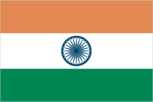
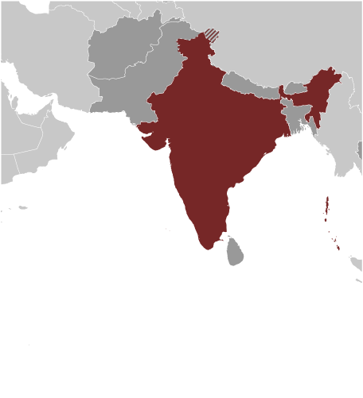
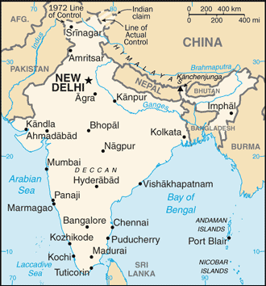

# India

## Introduction

**_Background:_**   
The Indus Valley civilization, one of the world's oldest, flourished during the 3rd and 2nd millennia B.C. and extended into northwestern India. Aryan tribes from the northwest infiltrated the Indian subcontinent about 1500 B.C.; their merger with the earlier Dravidian inhabitants created the classical Indian culture. The Maurya Empire of the 4th and 3rd centuries B.C. - which reached its zenith under ASHOKA - united much of South Asia. The Golden Age ushered in by the Gupta dynasty (4th to 6th centuries A.D.) saw a flowering of Indian science, art, and culture. Islam spread across the subcontinent over a period of 700 years. In the 10th and 11th centuries, Turks and Afghans invaded India and established the Delhi Sultanate. In the early 16th century, the Emperor BABUR established the Mughal Dynasty which ruled India for more than three centuries. European explorers began establishing footholds in India during the 16th century. By the 19th century, Great Britain had become the dominant political power on the subcontinent. The British Indian Army played a vital role in both World Wars. Years of nonviolent resistance to British rule, led by Mohandas GANDHI and Jawaharlal NEHRU, eventually resulted in Indian independence, which was granted in 1947. Large-scale communal violence took place before and after the subcontinent partition into two separate states - India and Pakistan. The neighboring nations have fought three wars since independence, the last of which was in 1971 and resulted in East Pakistan becoming the separate nation of Bangladesh. India's nuclear weapons tests in 1998 emboldened Pakistan to conduct its own tests that same year. In November 2008, terrorists originating from Pakistan conducted a series of coordinated attacks in Mumbai, India's financial capital. Despite pressing problems such as significant overpopulation, environmental degradation, extensive poverty, and widespread corruption, economic growth following the launch of economic reforms in 1991 and a massive youthful population are driving India's emergence as a regional and global power.

## Geography

**_Location:_**   
Southern Asia, bordering the Arabian Sea and the Bay of Bengal, between Burma and Pakistan

**_Geographic coordinates:_**   
20 00 N, 77 00 E

**_Map references:_**   
Asia

**_Area:_**   
**total:** 3,287,263 sq km   
**land:** 2,973,193 sq km   
**water:** 314,070 sq km

**_Area - comparative:_**   
slightly more than one-third the size of the US

**_Land boundaries:_**   
**total:** 13,888 km   
**border countries:** Bangladesh 4,142 km, Bhutan 659 km, Burma 1,468 km, China 2,659 km, Nepal 1,770 km, Pakistan 3,190 km

**_Coastline:_**   
7,000 km

**_Maritime claims:_**   
**territorial sea:** 12 nm   
**contiguous zone:** 24 nm   
**exclusive economic zone:** 200 nm   
**continental shelf:** 200 nm or to the edge of the continental margin

**_Climate:_**   
varies from tropical monsoon in south to temperate in north

**_Terrain:_**   
upland plain (Deccan Plateau) in south, flat to rolling plain along the Ganges, deserts in west, Himalayas in north

**_Elevation extremes:_**   
**lowest point:** Indian Ocean 0 m   
**highest point:** Kanchenjunga 8,598 m

**_Natural resources:_**   
coal (fourth-largest reserves in the world), iron ore, manganese, mica, bauxite, rare earth elements, titanium ore, chromite, natural gas, diamonds, petroleum, limestone, arable land

**_Land use:_**   
**arable land:** 47.87%   
**permanent crops:** 3.74%   
**other:** 48.39% (2011)

**_Irrigated land:_**   
663,340 sq km (2008)

**_Total renewable water resources:_**   
1,911 cu km (2011)

**_Freshwater withdrawal (domestic/industrial/agricultural):_**   
**total:** 761 cu km/yr (7%/2%/90%)   
**per capita:** 613 cu m/yr (2010)

**_Natural hazards:_**   
droughts; flash floods, as well as widespread and destructive flooding from monsoonal rains; severe thunderstorms; earthquakes   
**volcanism:** Barren Island (elev. 354 m) in the Andaman Sea has been active in recent years

**_Environment - current issues:_**   
deforestation; soil erosion; overgrazing; desertification; air pollution from industrial effluents and vehicle emissions; water pollution from raw sewage and runoff of agricultural pesticides; tap water is not potable throughout the country; huge and growing population is overstraining natural resources

**_Environment - international agreements:_**   
**party to:** Antarctic-Environmental Protocol, Antarctic-Marine Living Resources, Antarctic Treaty, Biodiversity, Climate Change, Climate Change-Kyoto Protocol, Desertification, Endangered Species, Environmental Modification, Hazardous Wastes, Law of the Sea, Ozone Layer Protection, Ship Pollution, Tropical Timber 83, Tropical Timber 94, Wetlands, Whaling   
**signed, but not ratified:** none of the selected agreements

**_Geography - note:_**   
dominates South Asian subcontinent; near important Indian Ocean trade routes; Kanchenjunga, third tallest mountain in the world, lies on the border with Nepal

## People and Society

**_Nationality:_**   
**noun:** Indian(s)   
**adjective:** Indian

**_Ethnic groups:_**   
Indo-Aryan 72%, Dravidian 25%, Mongoloid and other 3% (2000)

**_Languages:_**   
Hindi 41%, Bengali 8.1%, Telugu 7.2%, Marathi 7%, Tamil 5.9%, Urdu 5%, Gujarati 4.5%, Kannada 3.7%, Malayalam 3.2%, Oriya 3.2%, Punjabi 2.8%, Assamese 1.3%, Maithili 1.2%, other 5.9%   
**note:** English enjoys the status of subsidiary official language but is the most important language for national, political, and commercial communication; Hindi is the most widely spoken language and primary tongue of 41% of the people; there are 14 other official languages: Bengali, Telugu, Marathi, Tamil, Urdu, Gujarati, Malayalam, Kannada, Oriya, Punjabi, Assamese, Kashmiri, Sindhi, and Sanskrit; Hindustani is a popular variant of Hindi/Urdu spoken widely throughout northern India but is not an official language (2001 census)

**_Religions:_**   
Hindu 80.5%, Muslim 13.4%, Christian 2.3%, Sikh 1.9%, other 1.8%, unspecified 0.1% (2001 census)

**_Population:_**   
1,236,344,631 (July 2014 est.)

**_Age structure:_**   
**0-14 years:** 28.5% (male 187,016,401/female 165,048,695)   
**15-24 years:** 18.1% (male 118,696,540/female 105,342,764)   
**25-54 years:** 40.6% (male 258,202,535/female 243,293,143)   
**55-64 years:** 7% (male 43,625,668/female 43,175,111)   
**65 years and over:** 5.7% (male 34,133,175/female 37,810,599) (2014 est.)

**_Dependency ratios:_**   
**total dependency ratio:** 51.8 %   
**youth dependency ratio:** 43.6 %   
**elderly dependency ratio:** 8.1 %   
**potential support ratio:** 12.3 (2014 est.)

**_Median age:_**   
**total:** 27 years   
**male:** 26.4 years   
**female:** 27.7 years (2014 est.)

**_Population growth rate:_**   
1.25% (2014 est.)

**_Birth rate:_**   
19.89 births/1,000 population (2014 est.)

**_Death rate:_**   
7.35 deaths/1,000 population (2014 est.)

**_Net migration rate:_**   
-0.05 migrant(s)/1,000 population (2014 est.)

**_Urbanization:_**   
**urban population:** 31.3% of total population (2011)   
**rate of urbanization:** 2.47% annual rate of change (2010-15 est.)

**_Major urban areas - population:_**   
NEW DELHI (capital) 22.654 million; Mumbai 19.744 million; Kolkata 14.402 million; Chennai 8.784 million; Bangalore 8.614 million; Hyderabad 7.837 million (2011)

**_Sex ratio:_**   
**at birth:** 1.12 male(s)/female   
**0-14 years:** 1.13 male(s)/female   
**15-24 years:** 1.13 male(s)/female   
**25-54 years:** 1.06 male(s)/female   
**55-64 years:** 1.08 male(s)/female   
**65 years and over:** 0.91 male(s)/female   
**total population:** 1.08 male(s)/female (2014 est.)

**_Mother's mean age at first birth:_**   
19.9 (2005-06 est.)

**_Maternal mortality rate:_**   
200 deaths/100,000 live births (2010)

**_Infant mortality rate:_**   
**total:** 43.19 deaths/1,000 live births   
**male:** 41.9 deaths/1,000 live births   
**female:** 44.63 deaths/1,000 live births (2014 est.)

**_Life expectancy at birth:_**   
**total population:** 67.8 years   
**male:** 66.68 years   
**female:** 69.06 years (2014 est.)

**_Total fertility rate:_**   
2.51 children born/woman (2014 est.)

**_Contraceptive prevalence rate:_**   
54.8% (2007/08)

**_Health expenditures:_**   
3.9% of GDP (2011)

**_Physicians density:_**   
0.65 physicians/1,000 population (2009)

**_Hospital bed density:_**   
0.9 beds/1,000 population (2005)

**_Drinking water source:_**   
**improved:** urban: 96.7% of population; rural: 90.7% of population; total: 92.6% of population   
**unimproved:** urban: 3.3% of population; rural: 9.3% of population; total: 7.4% of population (2012 est.)

**_Sanitation facility access:_**   
**improved:** urban: 60.2% of population; rural: 24.7% of population; total: 36% of population   
**unimproved:** urban: 39.8% of population; rural: 75.3% of population; total: 64% of population (2012 est.)

**_HIV/AIDS - adult prevalence rate:_**   
0.3% (2012 est.)

**_HIV/AIDS - people living with HIV/AIDS:_**   
2.085 million (2012 est.)

**_HIV/AIDS - deaths:_**   
135,500 (2012 est.)

**_Major infectious diseases:_**   
**degree of risk:** very high   
**food or waterborne diseases:** bacterial diarrhea, hepatitis A and E, and typhoid fever   
**vectorborne diseases:** dengue fever, Japanese encephalitis, and malaria   
**water contact disease:** leptospirosis   
**animal contact disease:** rabies   
**note:** highly pathogenic H5N1 avian influenza has been identified in this country; it poses a negligible risk with extremely rare cases possible among US citizens who have close contact with birds (2013)

**_Obesity - adult prevalence rate:_**   
1.9% (2008)

**_Children under the age of 5 years underweight:_**   
43.5% (2006)

**_Education expenditures:_**   
3.2% of GDP (2011)

**_Literacy:_**   
**definition:** age 15 and over can read and write   
**total population:** 62.8%   
**male:** 75.2%   
**female:** 50.8% (2006 est.)

**_School life expectancy (primary to tertiary education):_**   
**total:** 12 years   
**male:** 12 years   
**female:** 11 years (2011)

**_Child labor - children ages 5-14:_**   
**total number:** 26,965,074   
**percentage:** 12 % (2006 est.)

**_Unemployment, youth ages 15-24:_**   
**total:** 10.7%   
**male:** 10.4%   
**female:** 11.6% (2012)

## Government

**_Country name:_**   
**conventional long form:** Republic of India   
**conventional short form:** India   
**local long form:** Republic of India/Bharatiya Ganarajya   
**local short form:** India/Bharat

**_Government type:_**   
federal republic

**_Capital:_**   
**name:** New Delhi   
**geographic coordinates:** 28 36 N, 77 12 E   
**time difference:** UTC+5.5 (10.5 hours ahead of Washington, DC, during Standard Time)

**_Administrative divisions:_**   
29 states and 7 union territories\*; Andaman and Nicobar Islands\*, Andhra Pradesh, Arunachal Pradesh, Assam, Bihar, Chandigarh\*, Chhattisgarh, Dadra and Nagar Haveli\*, Daman and Diu\*, Delhi\*, Goa, Gujarat, Haryana, Himachal Pradesh, Jammu and Kashmir, Jharkhand, Karnataka, Kerala, Lakshadweep\*, Madhya Pradesh, Maharashtra, Manipur, Meghalaya, Mizoram, Nagaland, Odisha, Puducherry\*, Punjab, Rajasthan, Sikkim, Tamil Nadu, Telangana, Tripura, Uttar Pradesh, Uttarakhand, West Bengal   
**note:** although its status is that of a union territory, the official name of Delhi is National Capital Territory of Delhi

**_Independence:_**   
15 August 1947 (from the UK)

**_National holiday:_**   
Republic Day, 26 January (1950)

**_Constitution:_**   
previous 1935 (preindependence); latest draft completed 4 November 1949, adopted 26 November 1949, effective 26 January 1950; amended many times, last in 2013 (2013)

**_Legal system:_**   
common law system based on the English model; separate personal law codes apply to Muslims, Christians, and Hindus; judicial review of legislative acts

**_International law organization participation:_**   
accepts compulsory ICJ jurisdiction with reservations; non-party state to the ICCt

**_Suffrage:_**   
18 years of age; universal

**_Executive branch:_**   
**chief of state:** President Pranab MUKHERJEE (since 22 July 2012); Vice President Mohammad Hamid ANSARI (since 11 August 2007)   
**head of government:** Prime Minister Narendra MODI (since 26 May 2014)   
**cabinet:** Union Council of Ministers appointed by the president on the recommendation of the prime minister   
**elections:** president elected by an electoral college consisting of elected members of both houses of Parliament and the legislatures of the states for a five-year term (no term limits); election last held in July 2012 (next to be held in July 2017); vice president elected by both houses of Parliament for a five-year term; election last held in August 2012 (next to be held in August 2017); prime minister chosen by parliamentary members of the majority party following legislative elections   
**election results:** Pranab MUKHERJEE elected president; percent of vote - Pranab MUKHERJEE 69.31%, Purno SANGMA - 30.69%

**_Legislative branch:_**   
bicameral Parliament or Sansad consists of the Council of States or Rajya Sabha (a body consisting of 245 seats up to 12 of which are appointed by the president, the remainder chosen in staggered elections by the elected members of the state and territorial assemblies; members serve six-year terms) and the People's Assembly or Lok Sabha (545 seats; 543 members elected by popular vote, 2 appointed by the president; members serve five-year terms)   
**elections:** People's Assembly - last held April-May 2014 in 9 phases; (next election must be held by May 2019)   
**election results:** People's Assembly - percent of vote by party - NA, ; seats by party - BJP 282, INC 44, AIADMK 37, AITC 34, BJD 20, SS 18, TDP 16, TRS 11, CPI(M) 9, YSRC 9, LJP 6, NCP 6, SP 5, AAP 4, RJD 4, SAD 4, independents 3, other 31

**_Judicial branch:_**   
**highest court(s):** Supreme Court (the chief justice and 25 associate justices); note - parliament approved an additional 5 judges in 2008; note - in mid-2011 India’s Cabinet approved the program, National Mission for Justice Delivery and Legal Reform, to eliminate judicial corruption and reduce the backlog of cases   
**judge selection and term of office:** justices appointed by the president to serve until age 65   
**subordinate courts:** High Courts; District Courts; Labour Court

**_Political parties and leaders:_**   
Aam Aadmi Party or AAP [Arvind KEJRIWAL]   
All India Anna Dravida Munnetra Kazhagam or AIADMK [J. JAYALALITHAA]   
All India Trinamool Congress or AITC [Mamata BANERJEE]   
Bahujan Samaj Party or BSP [MAYAWATI]   
Bharatiya Janata Party or BJP [Rajnath SINGH]   
Biju Janata Dal or BJD [Naveen PATNAIK]   
Communist Party of India or CPI [Suravaram Sudhakar REDDY, Secretary-General]   
Communist Party of India-Marxist or CPI(M) [Prakash KARAT]   
Dravida Munnetra Kazhagam or DMK [M.KARUNANIDHI]   
Indian National Congress or INC [Sonia GANDHI]   
Janata Dal (United) or JD(U) [Sharad YADAV]   
Lok Janshakti Party (LJP) [Ram Vilas PASWAN]   
Nationalist Congress Party or NCP [Sharad PAWAR]   
Rashtriya Janata Dal or RJD [Lalu Prasad YADAV]   
Rashtriya Lok Dal or RLD [Ajit SINGH]   
Samajwadi Party or SP [Mulayam Singh YADAV]   
Shiromani Akali Dal or SAD [Parkash Singh BADAL]   
Shiv Sena or SS [Uddhav THACKERAY]   
Telugu Desam Party or TDP [Chandrababu NAIDU]   
Telegana Rashtra Samithi (TRS) [K. Chandrashekar RAO]   
YSR Congress(YSRC) [Jaganmohan REDDY]   
**note:** India has dozens of national and regional political parties

**_Political pressure groups and leaders:_**   
All Parties Hurriyat Conference in the Kashmir Valley (separatist group)   
Bajrang Dal (religious organization)   
India Against Corruption [Anna HAZARE]   
Jamiat Ulema-e Hind (religious organization)   
Rashtriya Swayamsevak Sangh [Mohan BHAGWAT] (nationalist organization)   
Vishwa Hindu Parishad [Ashok SINGHAL] (religious organization)   
**other:** numerous religious or militant/chauvinistic organizations; hundreds of social reform, anti-corruption, and environmental groups at state and local level; various separatist groups seeking greater communal and/or regional autonomy

**_International organization participation:_**   
ABEDA, ADB, AfDB (nonregional member), ARF, ASEAN (dialogue partner), BIMSTEC, BIS, BRICS, C, CD, CERN (observer), CICA, CP, EAS, FAO, FATF, G-15, G-20, G-24, G-77, IAEA, IBRD, ICAO, ICC (national committees), ICRM, IDA, IFAD, IFC, IFRCS, IHO, ILO, IMF, IMO, IMSO, Interpol, IOC, IOM, IPU, ISO, ITSO, ITU, ITUC (NGOs), LAS (observer), MIGA, MONUSCO, NAM, OAS (observer), OECD, OPCW, Pacific Alliance (observer), PCA, PIF (partner), SAARC, SACEP, SCO (observer), UN, UNCTAD, UNDOF, UNESCO, UNHCR, UNIDO, UNIFIL, UNISFA, UNITAR, UNMISS, UNOCI, UNSC (temporary), UNWTO, UPU, WCO, WFTU (NGOs), WHO, WIPO, WMO, WTO

**_Diplomatic representation in the US:_**   
**chief of mission:** Ambassador Subrahmanyam JAISHANKAR (since 10 March 2014)   
**chancery:** 2107 Massachusetts Avenue NW, Washington, DC 20008; note - Consular Wing located at 2536 Massachusetts Avenue NW, Washington, DC 20008   
**telephone:** [1] (202) 939-7000   
**FAX:** [1] (202) 265-4351   
**consulate(s) general:** Atlanta, Chicago, Houston, New York, San Francisco

**_Diplomatic representation from the US:_**   
**chief of mission:** Ambassador Nancy J. POWELL (since 19 April 2012)   
**embassy:** Shantipath, Chanakyapuri, New Delhi 110021   
**mailing address:** use embassy street address   
**telephone:** [91] (11) 2419-8000   
**FAX:** [91] (11) 2419-0017   
**consulate(s) general:** Chennai (Madras), Hyderabad; Kolkata (Calcutta), Mumbai (Bombay)

**_Flag description:_**   
three equal horizontal bands of saffron (subdued orange) (top), white, and green, with a blue chakra (24-spoked wheel) centered in the white band; saffron represents courage, sacrifice, and the spirit of renunciation; white signifies purity and truth; green stands for faith and fertility; the blue chakra symbolizes the wheel of life in movement and death in stagnation   
**note:** similar to the flag of Niger, which has a small orange disk centered in the white band

**_National symbol(s):_**   
the Lion Capital of Ashoka, which depicts four Asiatic lions standing back to back mounted on a circular abacus, is the official emblem; the Bengal tiger is the national animal; the lotus is the national flower

**_National anthem:_**   
**name:** "Jana-Gana-Mana" (Thou Art the Ruler of the Minds of All People)   
**lyrics/music:** Rabindranath TAGORE   
**note:** adopted 1950; Rabindranath TAGORE, a Nobel laureate, also wrote Bangladesh's national anthem

## Economy

**_Economy - overview:_**   
India is developing into an open-market economy, yet traces of its past autarkic policies remain. Economic liberalization measures, including industrial deregulation, privatization of state-owned enterprises, and reduced controls on foreign trade and investment, began in the early 1990s and served to accelerate the country's growth, which averaged under 7% per year from 1997 to 2011. India's diverse economy encompasses traditional village farming, modern agriculture, handicrafts, a wide range of modern industries, and a multitude of services. Slightly less than half of the work force is in agriculture, but, services are the major source of economic growth, accounting for nearly two-thirds of India's output with less than one-third of its labor force. India has capitalized on its large educated English-speaking population to become a major exporter of information technology services, business outsourcing services, and software workers. India's economic growth began slowing in 2011 because of a decline in investment, caused by high interest rates, rising inflation, and investor pessimism about the government's commitment to further economic reforms and about the global situation. In late 2012, the Indian Government announced additional reforms and deficit reduction measures, including allowing higher levels of foreign participation in direct investment in the economy. The outlook for India's long-term growth is moderately positive due to a young population and corresponding low dependency ratio, healthy savings and investment rates, and increasing integration into the global economy. However, India has many challenges that it has yet to fully address, including poverty, corruption, violence and discrimination against women and girls, an inefficient power generation and distribution system, ineffective enforcement of intellectual property rights, decades-long civil litigation dockets, inadequate transport and agricultural infrastructure, limited non-agricultural employment opportunities, high spending and poorly-targeted subsidies, inadequate availability of quality basic and higher education, and accommodating rural-to-urban migration. Growth in 2013 fell to a decade low, as India's economic leaders struggled to improve the country's wide fiscal and current account deficits. Rising macroeconomic imbalances in India and improving economic conditions in Western countries, led investors to shift capital away from India, prompting a sharp depreciation of the rupee. However, investors' perceptions of India improved in early 2014, due to a reduction of the current account deficit and expectations of post-election economic reform, resulting in a surge of inbound capital flows and stabilization of the rupee.

**_GDP (purchasing power parity):_**   
$4.99 trillion (2013 est.)   
$4.833 trillion (2012 est.)   
$4.63 trillion (2011 est.)   
**note:** data are in 2013 US dollars

**_GDP (official exchange rate):_**   
$1.67 trillion (2013 est.)

**_GDP - real growth rate:_**   
3.2% (2013 est.)   
5.1% (2012 est.)   
7.5% (2011 est.)

**_GDP - per capita (PPP):_**   
$4,000 (2013 est.)   
$3,900 (2012 est.)   
$3,800 (2011 est.)   
**note:** data are in 2013 US dollars

**_Gross national saving:_**   
33.7% of GDP (2013 est.)   
28.8% of GDP (2012 est.)   
30.3% of GDP (2011 est.)

**_GDP - composition, by end use:_**   
**household consumption:** 56.4%   
**government consumption:** 12.4%   
**investment in fixed capital:** 29.6%   
**investment in inventories:** 8.2%   
**exports of goods and services:** 25.2%   
**imports of goods and services:** -31.8%; (2013 est.)

**_GDP - composition, by sector of origin:_**   
**agriculture:** 17.4%   
**industry:** 25.8%   
**services:** 56.9% (2013 est.)

**_Agriculture - products:_**   
rice, wheat, oilseed, cotton, jute, tea, sugarcane, lentils, onions, potatoes; dairy products, sheep, goats, poultry; fish

**_Industries:_**   
textiles, chemicals, food processing, steel, transportation equipment, cement, mining, petroleum, machinery, software, pharmaceuticals

**_Industrial production growth rate:_**   
0.9% (2013 est.)

**_Labor force:_**   
487.3 million (2013 est.)

**_Labor force - by occupation:_**   
**agriculture:** 49%   
**industry:** 20%   
**services:** 31% (2012 est.)

**_Unemployment rate:_**   
8.8% (2013 est.)   
8.5% (2012 est.)

**_Population below poverty line:_**   
29.8% (2010 est.)

**_Household income or consumption by percentage share:_**   
**lowest 10%:** 3.6%   
**highest 10%:** 31.1% (2005)

**_Distribution of family income - Gini index:_**   
36.8 (2004)   
37.8 (1997)

**_Budget:_**   
**revenues:** $181.3 billion   
**expenditures:** $281.6 billion (2013 est.)

**_Taxes and other revenues:_**   
10.3% of GDP (2013 est.)

**_Budget surplus (+) or deficit (-):_**   
-5.7% of GDP (2013 est.)

**_Public debt:_**   
51.8% of GDP (2013 est.)   
51.7% of GDP (2012 est.)   
**note:** data cover central government debt, and exclude debt instruments issued (or owned) by government entities other than the treasury; the data include treasury debt held by foreign entities; the data exclude debt issued by subnational entities, as well as intra-governmental debt; intra-governmental debt consists of treasury borrowings from surpluses in the social funds, such as for retirement, medical care, and unemployment; debt instruments for the social funds are not sold at public auctions

**_Fiscal year:_**   
1 April - 31 March

**_Inflation rate (consumer prices):_**   
9.6% (2013 est.)   
9.7% (2012 est.)

**_Central bank discount rate:_**   
7.75% (31 December 2013 est.)   
8% (31 December 2010 est.)   
**note:** this is the Indian central bank's policy rate - the repurchase rate

**_Commercial bank prime lending rate:_**   
10.6% (31 December 2013 est.)   
10.63% (31 December 2012 est.)

**_Stock of narrow money:_**   
$303.1 billion (31 December 2013 est.)   
$317.4 billion (31 December 2012 est.)

**_Stock of broad money:_**   
$1.376 trillion (31 December 2013 est.)   
$1.396 trillion (31 December 2012 est.)

**_Stock of domestic credit:_**   
$1.379 trillion (31 December 2013 est.)   
$1.401 trillion (31 December 2012 est.)

**_Market value of publicly traded shares:_**   
$1.263 trillion (31 December 2012 est.)   
$1.015 trillion (31 December 2011)   
$1.616 trillion (31 December 2010 est.)

**_Current account balance:_**   
-$74.79 billion (2013 est.)   
-$91.47 billion (2012 est.)

**_Exports:_**   
$313.2 billion (2013 est.)   
$296.8 billion (2012 est.)

**_Exports - commodities:_**   
petroleum products, precious stones, machinery, iron and steel, chemicals, vehicles, apparel

**_Exports - partners:_**   
UAE 12.3%, US 12.2%, China 5%, Singapore 4.9%, Hong Kong 4.1% (2012)

**_Imports:_**   
$467.5 billion (2013 est.)   
$488.9 billion (2012 est.)

**_Imports - commodities:_**   
crude oil, precious stones, machinery, fertilizer, iron and steel, chemicals

**_Imports - partners:_**   
China 10.7%, UAE 7.8%, Saudi Arabia 6.8%, Switzerland 6.2%, US 5.1% (2012)

**_Reserves of foreign exchange and gold:_**   
$295 billion (31 December 2013 est.)   
$296 billion (28 December 2012 est.)

**_Debt - external:_**   
$412.2 billion (31 December 2013 est.)   
$378.9 billion (31 December 2012 est.)

**_Stock of direct foreign investment - at home:_**   
$310 billion (30 November 2013 est.)   
$225.1 billion (31 December 2012 est.)

**_Stock of direct foreign investment - abroad:_**   
$120.1 billion (31 December 2013 est.)   
$118.1 billion (31 December 2012 est.)

**_Exchange rates:_**   
Indian rupees (INR) per US dollar -   
58.68 (2013 est.)   
53.437 (2012 est.)   
45.726 (2010 est.)   
48.405 (2009)   
43.319 (2008)

## Energy

**_Electricity - production:_**   
871 billion kWh (FY11/12 est.)

**_Electricity - consumption:_**   
698.8 billion kWh (2010 est.)

**_Electricity - exports:_**   
62 million kWh (2011 est.)

**_Electricity - imports:_**   
5.7 billion kWh (2011 est.)

**_Electricity - installed generating capacity:_**   
199.9 million kW (31 March 2012 est)

**_Electricity - from fossil fuels:_**   
65.8% of total installed capacity (31 March 2012 est)

**_Electricity - from nuclear fuels:_**   
2.4% of total installed capacity (31 March 2012 est)

**_Electricity - from hydroelectric plants:_**   
19.5% of total installed capacity (31 March 2012 est)

**_Electricity - from other renewable sources:_**   
12.3% of total installed capacity (31 March 2012 est)

**_Crude oil - production:_**   
990,200 bbl/day (2012 est.)

**_Crude oil - exports:_**   
0 bbl/day (2010 est.)

**_Crude oil - imports:_**   
3.272 million bbl/day (2010 est.)

**_Crude oil - proved reserves:_**   
5.476 billion bbl (1 January 2013 est.)

**_Refined petroleum products - production:_**   
4.216 million bbl/day (2010 est.)

**_Refined petroleum products - consumption:_**   
3.292 million bbl/day (2011 est.)

**_Refined petroleum products - exports:_**   
1.247 million bbl/day (2010 est.)

**_Refined petroleum products - imports:_**   
379,600 bbl/day (2010 est.)

**_Natural gas - production:_**   
40.38 billion cu m (2012 est.)

**_Natural gas - consumption:_**   
64.49 billion cu m (2010 est.)

**_Natural gas - exports:_**   
0 cu m (2011 est.)

**_Natural gas - imports:_**   
16.39 billion cu m (2011 est.)

**_Natural gas - proved reserves:_**   
1.241 trillion cu m (1 January 2013 est.)

**_Carbon dioxide emissions from consumption of energy:_**   
1.726 billion Mt (2011 est.)

## Communications

**_Telephones - main lines in use:_**   
31.08 million (2012)

**_Telephones - mobile cellular:_**   
893.862 million (2013)

**_Telephone system:_**   
**general assessment:** supported by recent deregulation and liberalization of telecommunications laws and policies, India has emerged as one of the fastest growing telecom markets in the world; total telephone subscribership base exceeded 900 million in 2011, an overall teledensity of roughly 75%, and subscribership is currently growing more than 20 million per month; urban teledensity now exceeds 100% and rural teledensity is steadily growing   
**domestic:** mobile cellular service introduced in 1994 and organized nationwide into four metropolitan areas and 19 telecom circles each with multiple private service providers and one or more state-owned service providers; in recent years significant trunk capacity added in the form of fiber-optic cable and one of the world's largest domestic satellite systems, the Indian National Satellite system (INSAT), with 6 satellites supporting 33,000 very small aperture terminals (VSAT)   
**international:** country code - 91; a number of major international submarine cable systems, including Sea-Me-We-3 with landing sites at Cochin and Mumbai (Bombay), Sea-Me-We-4 with a landing site at Chennai, Fiber-Optic Link Around the Globe (FLAG) with a landing site at Mumbai (Bombay), South Africa - Far East (SAFE) with a landing site at Cochin, the i2i cable network linking to Singapore with landing sites at Mumbai (Bombay) and Chennai (Madras), and Tata Indicom linking Singapore and Chennai (Madras), provide a significant increase in the bandwidth available for both voice and data traffic; satellite earth stations - 8 Intelsat (Indian Ocean) and 1 Inmarsat (Indian Ocean region); 9 gateway exchanges operating from Mumbai (Bombay), New Delhi, Kolkata (Calcutta), Chennai (Madras), Jalandhar, Kanpur, Gandhinagar, Hyderabad, and Ernakulam (2011)

**_Broadcast media:_**   
Doordarshan, India's public TV network, operates about 20 national, regional, and local services; a large and increasing number of privately owned TV stations are distributed by cable and satellite service providers; by 2011, more than 100 million homes had access to cable and satellite TV offering more than 700 TV channels; government controls AM radio with All India Radio operating domestic and external networks; news broadcasts via radio are limited to the All India Radio Network; since 2000, privately-owned FM stations have been permitted and their numbers have increased rapidly (2007)

**_Internet country code:_**   
.in

**_Internet hosts:_**   
6.746 million (2012)

**_Internet users:_**   
61.338 million (2009)

## Transportation

**_Airports:_**   
346 (2013)

**_Airports - with paved runways:_**   
**total:** 253   
**over 3,047 m:** 22   
**2,438 to 3,047 m:** 59   
**1,524 to 2,437 m:** 76   
**914 to 1,523 m:** 82   
**under 914 m:** 14 (2013)

**_Airports - with unpaved runways:_**   
**total:** 93   
**over 3,047 m:** 1   
**2,438 to 3,047 m:** 3   
**1,524 to 2,437 m:** 6   
**914 to 1,523 m:** 38   
**under 914 m:** 45 (2013)

**_Heliports:_**   
45 (2013)

**_Pipelines:_**   
condensate/gas 9 km; gas 13,581 km; liquid petroleum gas 2,054 km; oil 8,943 km; oil/gas/water 20 km; refined products 11,069 km (2013)

**_Railways:_**   
**total:** 63,974 km   
**broad gauge:** 54,257 km 1.676-m gauge (18,927 km electrified)   
**narrow gauge:** 7,180 km 1.000-m gauge; 2,537 km 0.762-m gauge and 0.610-m gauge (2009)

**_Roadways:_**   
**total:** 4,689,842 km   
**note:** includes 79,116 km of national highways and expressways, 155,716 km of state highways, and 4,455,010 km of other roads (2013)

**_Waterways:_**   
14,500 km (5,200 km on major rivers and 485 km on canals suitable for mechanized vessels) (2012)

**_Merchant marine:_**   
**total:** 340   
**by type:** bulk carrier 104, cargo 78, chemical tanker 22, container 14, liquefied gas 11, passenger 4, passenger/cargo 15, petroleum tanker 92   
**foreign-owned:** 10 (China 1, Hong Kong 2, Jersey 2, Malaysia 1, UAE 4)   
**registered in other countries:** 76 (Cyprus 4, Dominica 2, Liberia 8, Malta 3, Marshall Islands 10, Nigeria 1, Panama 24, Saint Kitts and Nevis 2, Singapore 21, unknown 1) (2010)

**_Ports and terminals:_**   
**major seaport(s):** Chennai, Jawaharal Nehru Port, Kandla, Kolkata (Calcutta), Mumbai (Bombay), Sikka, Vishakhapatnam   
**container port(s) (TEUs):** Chennai (1,558,343), Jawaharal Nehru Port (4,307,622)

## Military

**_Military branches:_**   
Army; Navy (includes naval air arm); Air Force; Coast Guard (2011)

**_Military service age and obligation:_**   
16-18 years of age for voluntary military service (Army 17 1/2, Air Force 17, Navy 16 1/2); no conscription; women may join as officers, but for noncombat roles only (2012)

**_Manpower available for military service:_**   
**males age 16-49:** 319,129,420   
**females age 16-49:** 296,071,637 (2010 est.)

**_Manpower fit for military service:_**   
**males age 16-49:** 249,531,562   
**females age 16-49:** 240,039,958 (2010 est.)

**_Manpower reaching militarily significant age annually:_**   
**male:** 12,151,065   
**female:** 10,745,891 (2010 est.)

**_Military expenditures:_**   
2.43% of GDP (2012)   
2.58% of GDP (2011)   
2.43% of GDP (2010)

## Transnational Issues

**_Disputes - international:_**   
since China and India launched a security and foreign policy dialogue in 2005, consolidated discussions related to the dispute over most of their rugged, militarized boundary, regional nuclear proliferation, Indian claims that China transferred missiles to Pakistan, and other matters continue; Kashmir remains the site of the world's largest and most militarized territorial dispute with portions under the de facto administration of China (Aksai Chin), India (Jammu and Kashmir), and Pakistan (Azad Kashmir and Northern Areas); India and Pakistan resumed bilateral dialogue in February 2011 after a two-year hiatus, have maintained the 2003 cease-fire in Kashmir, and continue to have disputes over water sharing of the Indus River and its tributaries; UN Military Observer Group in India and Pakistan has maintained a small group of peacekeepers since 1949; India does not recognize Pakistan's ceding historic Kashmir lands to China in 1964; to defuse tensions and prepare for discussions on a maritime boundary, India and Pakistan seek technical resolution of the disputed boundary in Sir Creek estuary at the mouth of the Rann of Kutch in the Arabian Sea; Pakistani maps continue to show its Junagadh claim in Indian Gujarat State; Prime Minister Singh's September 2011 visit to Bangladesh resulted in the signing of a Protocol to the 1974 Land Boundary Agreement between India and Bangladesh, which had called for the settlement of longstanding boundary disputes over undemarcated areas and the exchange of territorial enclaves, but which had never been implemented; Bangladesh referred its maritime boundary claims with Burma and India to the International Tribunal on the Law of the Sea; Joint Border Committee with Nepal continues to examine contested boundary sections, including the 400 sq km dispute over the source of the Kalapani River; India maintains a strict border regime to keep out Maoist insurgents and control illegal cross-border activities from Nepal

**_Refugees and internally displaced persons:_**   
**refugees (country of origin):** 100,003 (Tibet/China); 65,674 (Sri Lanka); 11,122 (Burma); 10,328 (Afghanistan) (2013)   
**IDPs:** at least 531,000 (about 250,000 are Kashmiri Pandits from Jammu and Kashmir) (2014)

**_Illicit drugs:_**   
world's largest producer of licit opium for the pharmaceutical trade, but an undetermined quantity of opium is diverted to illicit international drug markets; transit point for illicit narcotics produced in neighboring countries and throughout Southwest Asia; illicit producer of methaqualone; vulnerable to narcotics money laundering through the hawala system; licit ketamine and precursor production

............................................................   
_Page last updated on June 22, 2014_
