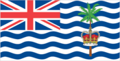
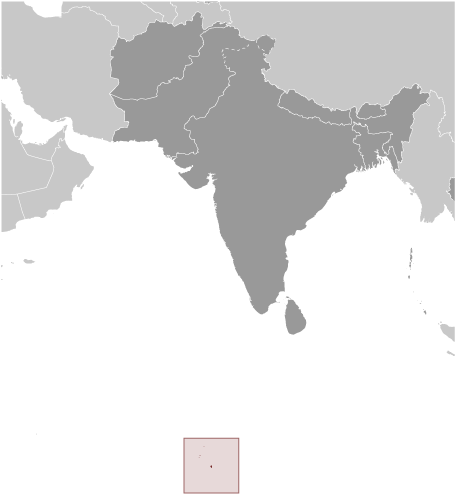
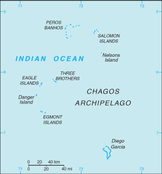

# British Indian Ocean Territory

_overseas territory of the UK_

## Introduction

**_Background:_**   
Formerly administered as part of the British Crown Colony of Mauritius, the British Indian Ocean Territory (BIOT) was established as an overseas territory of the UK in 1965. A number of the islands of the territory were later transferred to the Seychelles when it attained independence in 1976. Subsequently, BIOT has consisted only of the six main island groups comprising the Chagos Archipelago. The largest and most southerly of the islands, Diego Garcia, contains a joint UK-US naval support facility. All of the remaining islands are uninhabited. Between 1967 and 1973, former agricultural workers, earlier residents in the islands, were relocated primarily to Mauritius, but also to the Seychelles. Negotiations between 1971 and 1982 resulted in the establishment of a trust fund by the British Government as compensation for the displaced islanders, known as Chagossians. Beginning in 1998, the islanders pursued a series of lawsuits against the British Government seeking further compensation and the right to return to the territory. In 2006 and 2007, British court rulings invalidated the immigration policies contained in the 2004 BIOT Constitution Order that had excluded the islanders from the archipelago, but upheld the special military status of Diego Garcia. In 2008, the House of Lords, as the final court of appeal in the UK, ruled in favor of the British Government by overturning the lower court rulings and finding no right of return for the Chagossians.

## Geography

**_Location:_**   
archipelago in the Indian Ocean, south of India, about halfway between Africa and Indonesia

**_Geographic coordinates:_**   
6 00 S, 71 30 E; note - Diego Garcia 7 20 S, 72 25 E

**_Map references:_**   
Political Map of the World

**_Area:_**   
**total:** 54,400 sq km   
**land:** 60 sq km; Diego Garcia 44 sq km   
**water:** 54,340 sq km   
**note:** includes the entire Chagos Archipelago of 55 islands

**_Area - comparative:_**   
land area is about 0.3 times the size of Washington, DC

**_Land boundaries:_**   
0 km

**_Coastline:_**   
698 km

**_Maritime claims:_**   
**territorial sea:** 3 nm   
**exclusive fishing zone:** 200 nm

**_Climate:_**   
tropical marine; hot, humid, moderated by trade winds

**_Terrain:_**   
flat and low (most areas do not exceed two meters in elevation)

**_Elevation extremes:_**   
**lowest point:** Indian Ocean 0 m   
**highest point:** unnamed location on Diego Garcia 15 m

**_Natural resources:_**   
coconuts, fish, sugarcane

**_Land use:_**   
**arable land:** 0%   
**permanent crops:** 0%   
**other:** 100% (2011)

**_Natural hazards:_**   
NA

**_Environment - current issues:_**   
NA

**_Geography - note:_**   
archipelago of 55 islands; Diego Garcia, largest and southernmost island, occupies strategic location in central Indian Ocean; island is site of joint US-UK military facility

## People and Society

**_Population:_**   
no indigenous inhabitants   
**note:** approximately 1,200 former agricultural workers resident in the Chagos Archipelago, often referred to as Chagossians or Ilois, were relocated to Mauritius and the Seychelles in the 1960s and 1970s; approximately 3,000 UK and US military personnel and civilian contractors were living on the island of Diego Garcia

## Government

**_Country name:_**   
**conventional long form:** British Indian Ocean Territory   
**conventional short form:** none   
**abbreviation:** BIOT

**_Dependency status:_**   
overseas territory of the UK; administered by a commissioner, resident in the Foreign and Commonwealth Office in London

**_Legal system:_**   
the laws of the UK, where applicable, apply

**_Executive branch:_**   
**chief of state:** Queen ELIZABETH II (since 6 February 1952)   
**head of government:** Commissioner Colin ROBERTS (since July 2008); Administrator John MCMANUS (since April 2011); note - both reside in the UK and are represented by the officer commanding British Forces on Diego Garcia   
**cabinet:** NA   
**elections:** none; the monarchy is hereditary; commissioner and administrator appointed by the monarch

**_Diplomatic representation in the US:_**   
none (overseas territory of the UK)

**_Diplomatic representation from the US:_**   
none (overseas territory of the UK)

**_Flag description:_**   
white with six blue wavy horizontal stripes; the flag of the UK is in the upper hoist-side quadrant; the striped section bears a palm tree and yellow crown (the symbols of the territory) centered on the outer half of the flag; the wavy stripes represent the Indian Ocean; although not officially described, the six blue stripes may stand for the six main atolls of the archipelago

## Economy

**_Economy - overview:_**   
All economic activity is concentrated on the largest island of Diego Garcia, where a joint UK-US military facility is located. Construction projects and various services needed to support the military installation are performed by military and contract employees from the UK, Mauritius, the Philippines, and the US. Some of the natural resources found in this territory include coconuts, fish, and sugarcane. Sugarcane is still a major export for this territory. There are no industrial or agricultural activities on the islands. The territory earns foreign exchange by selling fishing licenses and postage stamps.

**_Exchange rates:_**   
the US dollar is used

## Communications

**_Telephone system:_**   
**general assessment:** separate facilities for military and public needs are available   
**domestic:** all commercial telephone services are available, including connection to the Internet   
**international:** country code (Diego Garcia) - 246; international telephone service is carried by satellite (2000)

**_Broadcast media:_**   
Armed Forces Radio and Television Service (AFRTS) broadcasts over 3 separate frequencies for US and UK military personnel stationed on the islands (2009)

**_Internet country code:_**   
.io

**_Internet hosts:_**   
75,006 (2012)

## Transportation

**_Airports:_**   
1 (2013)

**_Airports - with paved runways:_**   
**total:** 1   
**over 3,047 m:** 1 (2013)

**_Roadways:_**   
**note:** short section of paved road between port and airfield on Diego Garcia

**_Ports and terminals:_**   
**major seaport(s):** Diego Garcia

## Military

**_Military branches:_**   
no regular military forces (2014)

**_Military - note:_**   
defense is the responsibility of the UK; the US lease on Diego Garcia expires in 2016

## Transnational Issues

**_Disputes - international:_**   
Mauritius and Seychelles claim the Chagos Islands; Negotiations between 1971 and 1982 resulted in the establishment of a trust fund by the British Government as compensation for the displaced islanders, known as Chagossians, who were evicted between 1967-73; in 2001, the former inhabitants of the archipelago were granted UK citizenship and the right of return; in 2006 and 2007, British court rulings invalidated the immigration policies contained in the 2004 BIOT Constitution Order that had excluded the islanders from the archipelago; in 2008 a House of Lords' decision overturned lower court rulings, once again denying the right of return to Chagossians; in addition, the United Kingdom created the world's largest marine protection area around the Chagos islands prohibiting the extraction of any natural resources therein

............................................................   
_Page last updated on May 21, 2014_
