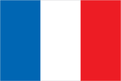
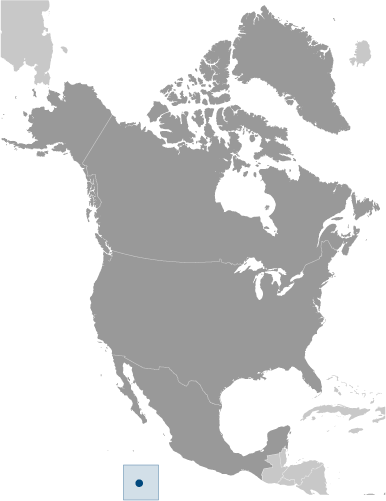
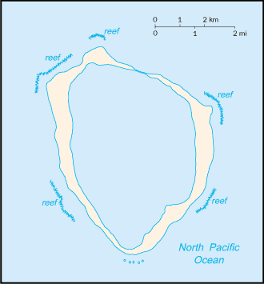

# Clipperton Island

_possession of France_

## Introduction

**_Background:_**   
This isolated atoll was named for John CLIPPERTON, a pirate who was rumored to have made it his hideout early in the 18th century. Annexed by France in 1855 and claimed by the United States, it was seized by Mexico in 1897. Arbitration eventually awarded the island to France in 1931, which took possession in 1935.

## Geography

**_Location:_**   
Middle America, atoll in the North Pacific Ocean, 1,120 km southwest of Mexico

**_Geographic coordinates:_**   
10 17 N, 109 13 W

**_Map references:_**   
Political Map of the World

**_Area:_**   
**total:** 6 sq km   
**land:** 6 sq km   
**water:** 0 sq km

**_Area - comparative:_**   
about 12 times the size of The Mall in Washington, DC

**_Land boundaries:_**   
0 km

**_Coastline:_**   
11.1 km

**_Maritime claims:_**   
**territorial sea:** 12 nm   
**exclusive economic zone:** 200 nm

**_Climate:_**   
tropical; humid, average temperature 20-32 degrees C, wet season (May to October)

**_Terrain:_**   
coral atoll

**_Elevation extremes:_**   
**lowest point:** Pacific Ocean 0 m   
**highest point:** Rocher Clipperton 29 m

**_Natural resources:_**   
fish

**_Land use:_**   
**arable land:** 0%   
**permanent crops:** 0%   
**other:** 100% (all coral) (2011)

**_Natural hazards:_**   
NA

**_Environment - current issues:_**   
NA

**_Geography - note:_**   
the atoll reef is approximately 12 km (7.5 mi) in circumference; an effort to colonize the atoll in the early 20th century ended in disaster and was abandoned in 1917

## People and Society

**_Population:_**   
uninhabited

## Government

**_Country name:_**   
**conventional long form:** none   
**conventional short form:** Clipperton Island   
**local long form:** none   
**local short form:** Ile Clipperton   
**former:** sometimes called Ile de la Passion

**_Dependency status:_**   
possession of France; administered directly by the Minister of Overseas France

**_Legal system:_**   
the laws of France apply

**_Flag description:_**   
the flag of France is used

## Economy

**_Economy - overview:_**   
Although 115 species of fish have been identified in the territorial waters of Clipperton Island, the only economic activity is tuna fishing.

## Transportation

**_Ports and terminals:_**   
none; offshore anchorage only

## Military

**_Military - note:_**   
defense is the responsibility of France

## Transnational Issues

**_Disputes - international:_**   
none

............................................................   
_Page last updated on March 27, 2014_
