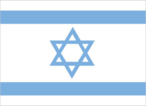
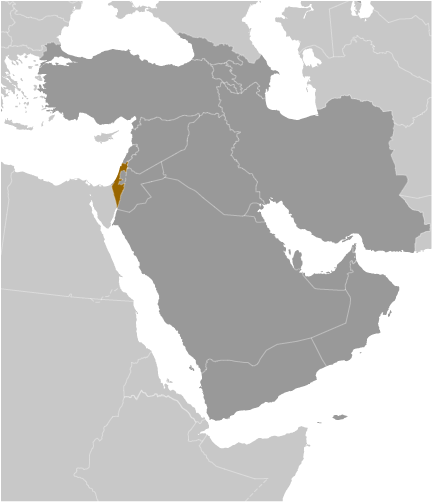
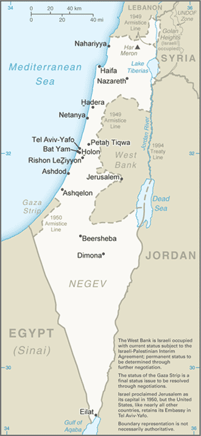

# Israel

_also see separate Gaza Strip and West Bank entries_

## Introduction

**_Background:_**   
Following World War II, the British withdrew from their mandate of Palestine, and the UN proposed partitioning the area into Arab and Jewish states, an arrangement rejected by the Arabs. Nonetheless, an Israeli state was declared in 1948 and the Israelis subsequently defeated the Arabs in a series of wars without ending the deep tensions between the two sides. (The territories Israel occupied since the 1967 war are not included in the Israel country profile, unless otherwise noted.) On 25 April 1982, Israel withdrew from the Sinai pursuant to the 1979 Israel-Egypt Peace Treaty. In keeping with the framework established at the Madrid Conference in October 1991, bilateral negotiations were conducted between Israel and Palestinian representatives and Syria to achieve a permanent settlement. Israel and Palestinian officials signed on 13 September 1993 a Declaration of Principles (also known as the "Oslo Accords"), enshrining the idea of a two-state solution to their conflict and guiding an interim period of Palestinian self-rule. Outstanding territorial and other disputes with Jordan were resolved in the 26 October 1994 Israel-Jordan Treaty of Peace. Progress toward a permanent status agreement with the Palestinians was undermined by Israeli-Palestinian violence between 2001 and February 2005. Israel in 2005 unilaterally disengaged from the Gaza Strip, evacuating settlers and its military while retaining control over most points of entry into the Gaza Strip. The election of HAMAS to head the Palestinian Legislative Council in 2006 froze relations between Israel and the Palestinian Authority (PA). In 2006 Israel engaged in a 34-day conflict with Hizballah in Lebanon in June-August 2006 and a 23-day conflict with HAMAS in the Gaza Strip during December 2008 and January 2009. Direct talks with the Palestinians launched in September 2010 collapsed following the expiration of Israel's 10-month partial settlement construction moratorium in the West Bank. In November 2012, Israel engaged in a seven-day conflict with HAMAS in the Gaza Strip. Prime Minister Binyamin NETANYAHU formed a coalition government in March 2013 following general elections in January 2013. Direct talks with the Palestinians resumed in July 2013 and but were suspended in late April 2014.

## Geography

**_Location:_**   
Middle East, bordering the Mediterranean Sea, between Egypt and Lebanon

**_Geographic coordinates:_**   
31 30 N, 34 45 E

**_Map references:_**   
Middle East

**_Area:_**   
**total:** 20,770 sq km   
**land:** 20,330 sq km   
**water:** 440 sq km

**_Area - comparative:_**   
slightly larger than New Jersey

**_Land boundaries:_**   
**total:** 1,068 km   
**border countries:** Egypt 208 km, Gaza Strip 59 km, Jordan 307 km, Lebanon 81 km, Syria 83 km, West Bank 330 km

**_Coastline:_**   
273 km

**_Maritime claims:_**   
**territorial sea:** 12 nm   
**continental shelf:** to depth of exploitation

**_Climate:_**   
temperate; hot and dry in southern and eastern desert areas

**_Terrain:_**   
Negev desert in the south; low coastal plain; central mountains; Jordan Rift Valley

**_Elevation extremes:_**   
**lowest point:** Dead Sea -408 m   
**highest point:** Har Meron 1,208 m

**_Natural resources:_**   
timber, potash, copper ore, natural gas, phosphate rock, magnesium bromide, clays, sand

**_Land use:_**   
**arable land:** 13.68%   
**permanent crops:** 3.69%   
**other:** 82.62% (2011)

**_Irrigated land:_**   
2,250 sq km (2004)

**_Total renewable water resources:_**   
1.78 cu km (2011)

**_Freshwater withdrawal (domestic/industrial/agricultural):_**   
**total:** 1.95 cu km/yr (39%/6%/55%)   
**per capita:** 282.4 cu m/yr (2009)

**_Natural hazards:_**   
sandstorms may occur during spring and summer; droughts; periodic earthquakes

**_Environment - current issues:_**   
limited arable land and natural freshwater resources pose serious constraints; desertification; air pollution from industrial and vehicle emissions; groundwater pollution from industrial and domestic waste, chemical fertilizers, and pesticides

**_Environment - international agreements:_**   
**party to:** Biodiversity, Climate Change, Climate Change-Kyoto Protocol, Desertification, Endangered Species, Hazardous Wastes, Ozone Layer Protection, Ship Pollution, Wetlands, Whaling   
**signed, but not ratified:** Marine Life Conservation

**_Geography - note:_**   
Lake Tiberias (Sea of Galilee) is an important freshwater source; the Dead Sea is the second saltiest body of water in the world (after Lake Assal in Djibouti); there are about 355 Israeli civilian sites including about 145 small outpost communities in the West Bank, 41 sites in the Golan Heights, and 32 in East Jerusalem (2010 est.)

## People and Society

**_Nationality:_**   
**noun:** Israeli(s)   
**adjective:** Israeli

**_Ethnic groups:_**   
Jewish 75.1% (of which Israel-born 73.6%, Europe/America/Oceania-born 17.9%, Africa-born 5.2%, Asia-born 3.2%), non-Jewish 24.9% (mostly Arab) (2012 est.)

**_Languages:_**   
Hebrew (official), Arabic (used officially for Arab minority), English (most commonly used foreign language)

**_Religions:_**   
Jewish 75.1%, Muslim 17.4%, Christian 2%, Druze 1.6%, other 3.9% (2012 est.)

**_Population:_**   
7,821,850   
**note:** approximately 341,400 Israeli settlers live in the West Bank (2012); approximately 18,900 Israeli settlers live in the Golan Heights (2012); approximately 196,400 Israeli settlers live in East Jerusalem (2011) (July 2014 est.)

**_Age structure:_**   
**0-14 years:** 27.1% (male 1,084,748/female 1,035,525)   
**15-24 years:** 15.7% (male 628,205/female 599,871)   
**25-54 years:** 37.8% (male 1,508,860/female 1,443,898)   
**55-64 years:** 8.8% (male 333,453/female 352,302)   
**65 years and over:** 10.5% (male 368,318/female 466,670) (2014 est.)

**_Dependency ratios:_**   
**total dependency ratio:** 63.1 %   
**youth dependency ratio:** 45.5 %   
**elderly dependency ratio:** 17.6 %   
**potential support ratio:** 5.7 (2014 est.)

**_Median age:_**   
**total:** 29.9 years   
**male:** 29.2 years   
**female:** 30.6 years (2014 est.)

**_Population growth rate:_**   
1.46% (2014 est.)

**_Birth rate:_**   
18.44 births/1,000 population (2014 est.)

**_Death rate:_**   
5.54 deaths/1,000 population (2014 est.)

**_Net migration rate:_**   
1.68 migrant(s)/1,000 population (2014 est.)

**_Urbanization:_**   
**urban population:** 91.9% of total population (2011)   
**rate of urbanization:** 1.73% annual rate of change (2010-15 est.)

**_Major urban areas - population:_**   
Tel Aviv-Yafo 3.381 million; Haifa 1.054 million; JERUSALEM (capital) 791,000 (2009)

**_Sex ratio:_**   
**at birth:** 1.05 male(s)/female   
**0-14 years:** 1.05 male(s)/female   
**15-24 years:** 1.05 male(s)/female   
**25-54 years:** 1.05 male(s)/female   
**55-64 years:** 1.01 male(s)/female   
**65 years and over:** 0.78 male(s)/female   
**total population:** 1.01 male(s)/female (2014 est.)

**_Mother's mean age at first birth:_**   
27.3 (2011 est.)

**_Maternal mortality rate:_**   
7 deaths/100,000 live births (2010)

**_Infant mortality rate:_**   
**total:** 3.98 deaths/1,000 live births   
**male:** 4.16 deaths/1,000 live births   
**female:** 3.8 deaths/1,000 live births (2014 est.)

**_Life expectancy at birth:_**   
**total population:** 81.28 years   
**male:** 79.05 years   
**female:** 83.61 years (2014 est.)

**_Total fertility rate:_**   
2.62 children born/woman (2014 est.)

**_Health expenditures:_**   
7.7% of GDP (2011)

**_Physicians density:_**   
3.11 physicians/1,000 population (2011)

**_Hospital bed density:_**   
3.4 beds/1,000 population (2011)

**_Drinking water source:_**   
**improved:** urban: 100% of population; rural: 100% of population; total: 100% of population   
**unimproved:** urban: 0% of population; rural: 0% of population; total: 0% of population (2012 est.)

**_Sanitation facility access:_**   
**improved:** urban: 100% of population; rural: 100% of population; total: 100% of population   
**unimproved:** urban: 0% of population; rural: 0% of population; total: 0% of population (2012 est.)

**_HIV/AIDS - adult prevalence rate:_**   
0.2% (2009 est.)

**_HIV/AIDS - people living with HIV/AIDS:_**   
7,500 (2009 est.)

**_HIV/AIDS - deaths:_**   
fewer than 100 (2009 est.)

**_Obesity - adult prevalence rate:_**   
26.2% (2008)

**_Education expenditures:_**   
5.6% of GDP (2011)

**_Literacy:_**   
**definition:** age 15 and over can read and write   
**total population:** 97.1%   
**male:** 98.5%   
**female:** 95.9% (2004 est.)

**_School life expectancy (primary to tertiary education):_**   
**total:** 16 years   
**male:** 15 years   
**female:** 16 years (2009)

**_Unemployment, youth ages 15-24:_**   
**total:** 12.1%   
**male:** 11.6%   
**female:** 12.7% (2012)

## Government

**_Country name:_**   
**conventional long form:** State of Israel   
**conventional short form:** Israel   
**local long form:** Medinat Yisra'el   
**local short form:** Yisra'el

**_Government type:_**   
parliamentary democracy

**_Capital:_**   
**name:** Jerusalem: note - Israel proclaimed Jerusalem as its capital in 1950, but the US, like all other countries, maintains its embassy in Tel Aviv   
**geographic coordinates:** 31 46 N, 35 14 E   
**time difference:** UTC+2 (7 hours ahead of Washington, DC, during Standard Time)   
**daylight saving time:** +1hr, begins Friday before the last Sunday in March; ends the last Sunday in October

**_Administrative divisions:_**   
6 districts (mehozot, singular - mehoz); Central, Haifa, Jerusalem, Northern, Southern, Tel Aviv

**_Independence:_**   
14 May 1948 (from League of Nations mandate under British administration)

**_National holiday:_**   
Independence Day, 14 May (1948); note - Israel declared independence on 14 May 1948, but the Jewish calendar is lunar and the holiday may occur in April or May

**_Constitution:_**   
no formal constitution; some functions of a constitution are filled by the Declaration of Establishment (1948), the Basic Laws of the Parliament (Knesset), and the Israeli citizenship law (2013)

**_Legal system:_**   
mixed legal system of English common law, British Mandate regulations, and Jewish, Christian, and Muslim religious laws

**_International law organization participation:_**   
has not submitted an ICJ jurisdiction declaration; withdrew acceptance of ICCt jurisdiction in 2002

**_Suffrage:_**   
18 years of age; universal

**_Executive branch:_**   
**chief of state:** President Shimon PERES (since 15 July 2007)   
**head of government:** Prime Minister Binyamin NETANYAHU (since 31 March 2009)   
**cabinet:** Cabinet selected by prime minister and approved by the Knesset   
**elections:** president largely a ceremonial role and is elected by the Knesset for a seven-year term (one-term limit); election last held 10 June 2014 (next to be held in 2021 but can be called earlier); following legislative elections, the president, in consultation with party leaders, assigns the task of forming a governing coalition to a Knesset member whom he or she determines is most likely to accomplish that task   
**election results:** Reuven RIVLIN elected president in second round; number of votes in first round - Reuven RIVLIN 44, Meir SHEETRIT 31, Dalia Itzik 28, Dalia Dorner 13, other/invalid 3; number of votes in second round - Reuven RIVLIN 63, Meir SHEETRIT 53, other/invalid 3; RIVLIN will be sworn in 24 July 2014

**_Legislative branch:_**   
unicameral Knesset (120 seats; political parties are elected by popular vote and assigned seats for members on a proportional basis; members serve 4-year terms)   
**elections:** last held on 22 January 2013 (next to be held in 2017)   
**election results:** percent of vote by party - Likud-Beiteinu (combined for electoral purposes only) 23.3%, Yesh Atid 14.3%, Labor 11.4%, The Jewish Home 9.1%, SHAS 8.7%, United Torah Judaism 5.2%, The Movement 5%, The New Movement-Meretz 4.5%, United Arab List-Ta'al 3.6%, HADASH 3%, Balad 2.6%, Kadima 2.1%; other 7.2%; seats by party - Likud-Beiteinu 31, Yesh Atid 19, Labor 15, The Jewish Home 12, SHAS 11, United Torah Judaism 7, The Movement 6, Meretz 6, United Arab List-Ta'al 4, HADASH 4, Balad 3, Kadima 2   
**note:** Ehud BARAK and four others on 17 January 2011 split from the Labor Party and formed the Atzmaut (Independence) Party; the Labor Party holds 8 seats in the Knesset and the Independence Party holds 5 seats; Aztmaut did not submit a candidate list for the election on 22 January 2013

**_Judicial branch:_**   
**highest court(s):** Supreme Court ( consists of the chief justice and 14 judges)   
**judge selection and term of office:** judges selected by the Judicial Selection Committee, made up of all three branches of the government and chaired by the Minister of Justice; judges can serve up to mandatory retirement age of 70   
**subordinate courts:** district and magistrate courts; national and regional labor courts; special and religious courts

**_Political parties and leaders:_**   
Balad [Jamal ZAHALKA]   
Democratic Front for Peace and Equality (HADASH) [Muhammad BARAKEH]   
Kadima [Shaul MOFAZ]   
Labor Party [Yitzhak HERZOG]   
Likud [Binyamin NETANYAHU]   
National Union [Uri ARIEL]   
SHAS [Eliyahu YISHAI]   
The Jewish Home (HaBayit HaYehudi) [Naftali BENNETT]   
The Movement (Hatnuah) [Tzipora "Tzipi" LIVNI]   
The New Movement-Meretz [Haim ORON]   
United Arab List-Ta'al [Ibrahim SARSUR]   
United Torah Judaism or UTJ [Yaakov LITZMAN] (a conglomerate of three parties)   
Yesh Atid [Yair LAPID]   
Yisrael Beiteinu or YB [Avigdor LIEBERMAN]

**_Political pressure groups and leaders:_**   
B'Tselem [Jessica MONTELL, Executive Director] monitors human rights abuses   
Peace Now [Yariv OPPENHEIMER, Secretary General] supports territorial concessions in the West Bank and Gaza Strip   
YESHA Council [Danny DAYAN, Chairman] promotes settler interests and opposes territorial compromise   
Breaking the Silence [Yehuda SHAUL, Executive Director] collects testimonies from soldiers who served in the West Bank and Gaza Strip

**_International organization participation:_**   
BIS, BSEC (observer), CE (observer), CICA, EBRD, FAO, IADB, IAEA, IBRD, ICAO, ICC (national committees), ICRM, IDA, IFAD, IFC, IFRCS, ILO, IMF, IMO, IMSO, Interpol, IOC, IOM, IPU, ISO, ITSO, ITU, ITUC (NGOs), MIGA, OAS (observer), OECD, OPCW (signatory), OSCE (partner), Pacific Alliance (observer), Paris Club (associate), PCA, SELEC (observer), UN, UNCTAD, UNESCO, UNHCR, UNIDO, UNWTO, UPU, WCO, WHO, WIPO, WMO, WTO

**_Diplomatic representation in the US:_**   
**chief of mission:** Ambassador Ron DERMER (since 3 December 2013)   
**chancery:** 3514 International Drive NW, Washington, DC 20008   
**telephone:** [1] (202) 364-5500   
**FAX:** [1] (202) 364-5647   
**consulate(s) general:** Atlanta, Boston, Chicago, Houston, Los Angeles, Miami, New York, Philadelphia, San Francisco

**_Diplomatic representation from the US:_**   
**chief of mission:** Ambassador Daniel B. SHAPIRO (since 8 July 2011)   
**embassy:** 71 Hayarkon Street, Tel Aviv 63903   
**telephone:** [972] (3) 519-7475   
**FAX:** [972] (3) 516-4390   
**consulate(s) general:** Jerusalem; note - an independent US mission, established in 1928, whose members are not accredited to a foreign government

**_Flag description:_**   
white with a blue hexagram (six-pointed linear star) known as the Magen David (Star of David or Shield of David) centered between two equal horizontal blue bands near the top and bottom edges of the flag; the basic design resembles a traditional Jewish prayer shawl (tallit), which is white with blue stripes; the hexagram as a Jewish symbol dates back to medieval times

**_National symbol(s):_**   
Star of David (Magen David)

**_National anthem:_**   
**name:** "Hatikvah" (The Hope)   
**lyrics/music:** Naftali Herz IMBER/traditional, arranged by Samuel COHEN   
**note:** adopted 2004, unofficial since 1948; used as the anthem of the Zionist movement since 1897; the 1888 arrangement by Samuel COHEN is thought to be based on the Romanian folk song "Carul cu boi" (The Ox Driven Cart)

## Economy

**_Economy - overview:_**   
Israel has a technologically advanced market economy. Cut diamonds, high-technology equipment, and pharmaceuticals are among the leading exports. Its major imports include crude oil, grains, raw materials, and military equipment. Israel usually posts sizable trade deficits, which are covered by tourism and other service exports, as well as significant foreign investment inflows. Between 2004 and 2011, growth averaged nearly 5% per year, led by exports. The global financial crisis of 2008-09 spurred a brief recession in Israel, but the country entered the crisis with solid fundamentals, following years of prudent fiscal policy and a resilient banking sector. In 2010, Israel formally acceded to the OECD. Israel's economy also has weathered the Arab Spring because strong trade ties outside the Middle East have insulated the economy from spillover effects. The economy has recovered better than most advanced, comparably sized economies, but slowing demand domestically and internationally, and a strong shekel, have reduced forecasts for the next decade to the 3% level. Natural gas fields discovered off Israel's coast since 2009 have brightened Israel's energy security outlook. The Tamar and Leviathan fields were some of the world's largest offshore natural gas finds this past decade. The massive Leviathan field is not due to come online until 2018, but production from Tamar provided a one percentage point boost to Israel's GDP in 2013 and is expected to contribute 0.5% growth in 2014. In mid-2011, public protests arose around income inequality and rising housing and commodity prices. Israel's income inequality and poverty rates are among the highest of OECD countries and there is a broad perception among the public that a small number of "tycoons" have a cartel-like grip over the major parts of the economy. The government formed committees to address some of the grievances but has maintained that it will not engage in deficit spending to satisfy populist demands. In May 2013 the Israeli government, in a politically difficult process, passed an austerity budget to reign in the deficit and restore confidence in the government's fiscal position. Over the long term, Israel faces structural issues, including low labor participation rates for its fastest growing social segments - the ultra-orthodox and Arab-Israeli communities. Also, Israel's progressive, globally competitive, knowledge-based technology sector employs only 9% of the workforce, with the rest employed in manufacturing and services - sectors which face downward wage pressures from global competition.

**_GDP (purchasing power parity):_**   
$273.2 billion (2013 est.)   
$264.5 billion (2012 est.)   
$255.9 billion (2011 est.)   
**note:** data are in 2013 US dollars

**_GDP (official exchange rate):_**   
$272.7 billion (2013 est.)

**_GDP - real growth rate:_**   
3.3% (2013 est.)   
3.4% (2012 est.)   
4.6% (2011 est.)

**_GDP - per capita (PPP):_**   
$36,200 (2013 est.)   
$34,300 (2012 est.)   
$34,000 (2011 est.)   
**note:** data are in 2013 US dollars

**_Gross national saving:_**   
22.2% of GDP (2013 est.)   
21% of GDP (2012 est.)   
21.4% of GDP (2011 est.)

**_GDP - composition, by end use:_**   
**household consumption:** 56.1%   
**government consumption:** 22.7%   
**investment in fixed capital:** 19.6%   
**investment in inventories:** 0.7%   
**exports of goods and services:** 34.4%   
**imports of goods and services:** -33.5%; (2013 est.)

**_GDP - composition, by sector of origin:_**   
**agriculture:** 2.4%   
**industry:** 31.2%   
**services:** 66.4% (2013 est.)

**_Agriculture - products:_**   
citrus, vegetables, cotton; beef, poultry, dairy products

**_Industries:_**   
high-technology products (including aviation, communications, computer-aided design and manufactures, medical electronics, fiber optics), wood and paper products, potash and phosphates, food, beverages, and tobacco, caustic soda, cement, construction, metal products, chemical products, plastics, cut diamonds, textiles, footwear

**_Industrial production growth rate:_**   
5.5% (2013 est.)

**_Labor force:_**   
3.493 million (2013 est.)

**_Labor force - by occupation:_**   
**agriculture:** 1.6%   
**industry:** 18.1%   
**services:** 80.3% (2012 est.)

**_Unemployment rate:_**   
5.8% (2013 est.)   
6.8% (2012 est.)

**_Population below poverty line:_**   
21%   
**note:** Israel's poverty line is $7.30 per person per day (2012)

**_Household income or consumption by percentage share:_**   
**lowest 10%:** 2.5%   
**highest 10%:** 24.3% (2008)

**_Distribution of family income - Gini index:_**   
37.6 (2012)   
39.2 (2008)

**_Budget:_**   
**revenues:** $109.7 billion   
**expenditures:** $113.9 billion (2013 est.)

**_Taxes and other revenues:_**   
40.2% of GDP (2013 est.)

**_Budget surplus (+) or deficit (-):_**   
-1.5% of GDP (2013 est.)

**_Public debt:_**   
67.1% of GDP (2013 est.)   
66.9% of GDP (2012 est.)

**_Fiscal year:_**   
calendar year

**_Inflation rate (consumer prices):_**   
1.7% (2013 est.)   
1.7% (2012 est.)

**_Central bank discount rate:_**   
1% (31 December 2013 est.)   
1.75% (31 December 2012 est.)

**_Commercial bank prime lending rate:_**   
3.8% (31 December 2013 est.)   
5.16% (31 December 2012 est.)

**_Stock of narrow money:_**   
$37.09 billion (31 December 2013 est.)   
$32.48 billion (31 December 2012 est.)

**_Stock of broad money:_**   
$151.2 billion (31 December 2013 est.)   
$136.2 billion (31 December 2012 est.)

**_Stock of domestic credit:_**   
$207.7 billion (31 December 2013 est.)   
$192.3 billion (31 December 2012 est.)

**_Market value of publicly traded shares:_**   
$148.4 billion (31 December 2012 est.)   
$145 billion (31 December 2011)   
$218.1 billion (31 December 2010 est.)

**_Current account balance:_**   
$5.259 billion (2013 est.)   
$609 million (2012 est.)

**_Exports:_**   
$60.67 billion (2013 est.)   
$62.32 billion (2012 est.)

**_Exports - commodities:_**   
machinery and equipment, software, cut diamonds, agricultural products, chemicals, textiles and apparel

**_Exports - partners:_**   
US 27.8%, Hong Kong 7.7%, UK 5.7%, Belgium 4.6%, China 4.3% (2012)

**_Imports:_**   
$67.03 billion (2013 est.)   
$71.67 billion (2012 est.)

**_Imports - commodities:_**   
raw materials, military equipment, investment goods, rough diamonds, fuels, grain, consumer goods

**_Imports - partners:_**   
US 12.9%, China 7.3%, Germany 6.3%, Switzerland 5.5%, Belgium 4.8% (2012)

**_Reserves of foreign exchange and gold:_**   
$80.74 billion (31 December 2013 est.)   
$75.91 billion (31 December 2012 est.)

**_Debt - external:_**   
$96.3 billion (31 December 2013 est.)   
$93.98 billion (31 December 2012 est.)

**_Stock of direct foreign investment - at home:_**   
$86.04 billion (31 December 2013 est.)   
$75.94 billion (31 December 2012 est.)

**_Stock of direct foreign investment - abroad:_**   
$80.85 billion (31 December 2013 est.)   
$74.75 billion (31 December 2012 est.)

**_Exchange rates:_**   
new Israeli shekels (ILS) per US dollar -   
3.621 (2013 est.)   
3.8559 (2012 est.)   
3.739 (2010 est.)   
3.93 (2009)   
3.588 (2008)

## Energy

**_Electricity - production:_**   
55.77 billion kWh (2011 est.)

**_Electricity - consumption:_**   
48.73 billion kWh (2010 est.)

**_Electricity - exports:_**   
4.224 billion kWh (2011 est.)

**_Electricity - imports:_**   
0 kWh (2012 est.)

**_Electricity - installed generating capacity:_**   
15.33 million kW (2010 est.)

**_Electricity - from fossil fuels:_**   
98.1% of total installed capacity (2010 est.)

**_Electricity - from nuclear fuels:_**   
0% of total installed capacity (2010 est.)

**_Electricity - from hydroelectric plants:_**   
0% of total installed capacity (2010 est.)

**_Electricity - from other renewable sources:_**   
1.8% of total installed capacity (2010 est.)

**_Crude oil - production:_**   
5,839 bbl/day (2012 est.)

**_Crude oil - exports:_**   
0 bbl/day (2010 est.)

**_Crude oil - imports:_**   
260,600 bbl/day (2010 est.)

**_Crude oil - proved reserves:_**   
11.5 million bbl (1 January 2013 est.)

**_Refined petroleum products - production:_**   
278,400 bbl/day (2010 est.)

**_Refined petroleum products - consumption:_**   
238,400 bbl/day (2011 est.)

**_Refined petroleum products - exports:_**   
83,700 bbl/day (2010 est.)

**_Refined petroleum products - imports:_**   
56,420 bbl/day (2010 est.)

**_Natural gas - production:_**   
6.86 billion cu m (2013 est.)

**_Natural gas - consumption:_**   
6.86 billion cu m (2013 est.)

**_Natural gas - exports:_**   
0 cu m (2011 est.)

**_Natural gas - imports:_**   
720 million cu m (2011 est.)

**_Natural gas - proved reserves:_**   
268.5 billion cu m (1 January 2013 est.)

**_Carbon dioxide emissions from consumption of energy:_**   
72.1 million Mt (2011 est.)

## Communications

**_Telephones - main lines in use:_**   
3.594 million (2012)

**_Telephones - mobile cellular:_**   
9.225 million (2012)

**_Telephone system:_**   
**general assessment:** most highly developed system in the Middle East   
**domestic:** good system of coaxial cable and microwave radio relay; all systems are digital; four privately owned mobile-cellular service providers with countrywide coverage   
**international:** country code - 972; submarine cables provide links to Europe, Cyprus, and parts of the Middle East; satellite earth stations - 3 Intelsat (2 Atlantic Ocean and 1 Indian Ocean) (2011)

**_Broadcast media:_**   
state broadcasting network, operated by the Israel Broadcasting Authority (IBA), broadcasts on 2 channels, one in Hebrew and the other in Arabic; 5 commercial channels including a channel broadcasting in Russian, a channel broadcasting Knesset proceedings, and a music channel supervised by a public body; multi-channel satellite and cable TV packages provide access to foreign channels; IBA broadcasts on 8 radio networks with multiple repeaters and Israel Defense Forces Radio broadcasts over multiple stations; about 15 privately owned radio stations; overall more than 100 stations and repeater stations (2008)

**_Internet country code:_**   
.il

**_Internet hosts:_**   
2.483 million (2012)

**_Internet users:_**   
4.525 million (2009)

## Transportation

**_Airports:_**   
47 (2013)

**_Airports - with paved runways:_**   
**total:** 29   
**over 3,047 m:** 2   
**2,438 to 3,047 m:** 5   
**1,524 to 2,437 m:** 6   
**914 to 1,523 m:** 11   
**under 914 m:** 5 (2013)

**_Airports - with unpaved runways:_**   
**total:** 18   
**1,524 to 2,437 m:** 1   
**914 to 1,523 m:** 3   
**under 914 m:** 14 (2013)

**_Heliports:_**   
3 (2013)

**_Pipelines:_**   
gas 763 km; oil 442 km; refined products 261 km (2013)

**_Railways:_**   
**total:** 975 km   
**standard gauge:** 975 km 1.435-m gauge (2008)

**_Roadways:_**   
**total:** 18,566 km   
**paved:** 18,566 km (includes 449 km of expressways) (2011)

**_Merchant marine:_**   
**total:** 8   
**by type:** cargo 1, container 7   
**registered in other countries:** 48 (Bermuda 3, Georgia 1, Honduras 1, Liberia 34, Malta 3, Moldova 2, Panama 1, Saint Vincent and the Grenadines 3) (2010)

**_Ports and terminals:_**   
**major seaport(s):** Ashdod, Elat (Eilat), Hadera, Haifa   
**container port(s) TEUs):** Ashdod (1,176,000), Haifa (1,238,000)

## Military

**_Military branches:_**   
Israel Defense Forces (IDF), Israel Naval Force (IN), Israel Air Force (IAF) (2010)

**_Military service age and obligation:_**   
18 years of age for compulsory (Jews, Druzes) military service; 17 years of age for voluntary (Christians, Muslims, Circassians) military service; both sexes are obligated to military service; conscript service obligation - 36 months for enlisted men, 21 months for enlisted women, 48 months for officers; pilots commit to 9 years service; reserve obligation to age 41-51 (men), 24 (women) (2013)

**_Manpower available for military service:_**   
**males age 16-49:** 1,797,960   
**females age 16-49:** 1,713,230 (2010 est.)

**_Manpower fit for military service:_**   
**males age 16-49:** 1,517,510   
**females age 16-49:** 1,446,132 (2010 est.)

**_Manpower reaching militarily significant age annually:_**   
**male:** 62,304   
**female:** 59,418 (2010 est.)

**_Military expenditures:_**   
5.69% of GDP (2012)   
5.87% of GDP (2011)   
5.69% of GDP (2010)

## Transnational Issues

**_Disputes - international:_**   
West Bank and Gaza Strip are Israeli-occupied with current status subject to the Israeli-Palestinian Interim Agreement - permanent status to be determined through further negotiation; Israel continues construction of a "seam line" separation barrier along parts of the Green Line and within the West Bank; Israel withdrew its settlers and military from the Gaza Strip and from four settlements in the West Bank in August 2005; Golan Heights is Israeli-occupied (Lebanon claims the Shab'a Farms area of Golan Heights); since 1948, about 350 peacekeepers from the UN Truce Supervision Organization headquartered in Jerusalem monitor ceasefires, supervise armistice agreements, prevent isolated incidents from escalating, and assist other UN personnel in the region

**_Refugees and internally displaced persons:_**   
**refugees (country of origin):** 34,988 (Eritrea); 12,926 (Sudan) (2013)   
**stateless persons:** 14 (2012)

**_Illicit drugs:_**   
increasingly concerned about ecstasy, cocaine, and heroin abuse; drugs arrive in country from Lebanon and, increasingly, from Jordan; money-laundering center

............................................................   
_Page last updated on June 22, 2014_
