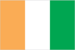
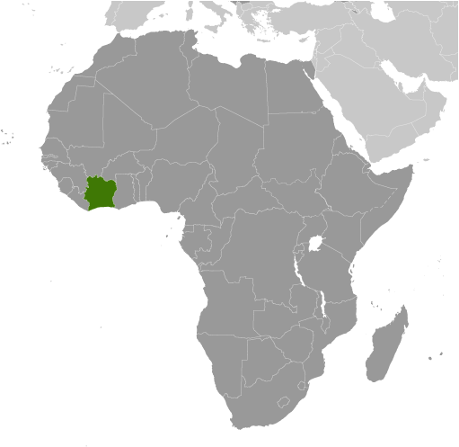
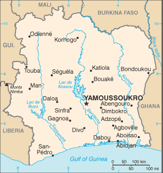

# Cote d'Ivoire

## Introduction

**_Background:_**   
Close ties to France following independence in 1960, the development of cocoa production for export, and foreign investment all made Cote d'Ivoire one of the most prosperous of the West African states but did not protect it from political turmoil. In December 1999, a military coup - the first ever in Cote d'Ivoire's history - overthrew the government. Junta leader Robert GUEI blatantly rigged elections held in late 2000 and declared himself the winner. Popular protest forced him to step aside and brought Laurent GBAGBO into power. Ivorian dissidents and disaffected members of the military launched a failed coup attempt in September 2002 that developed into a rebellion and then a civil war. The war ended in 2003 with a cease fire that left the country divided with the rebels holding the north, the government the south, and peacekeeping forces a buffer zone between the two. In March 2007, President GBAGBO and former New Forces rebel leader Guillaume SORO signed an agreement in which SORO joined GBAGBO's government as prime minister and the two agreed to reunite the country by dismantling the buffer zone, integrating rebel forces into the national armed forces, and holding elections. Difficulties in preparing electoral registers delayed balloting until 2010. In November 2010, Alassane Dramane OUATTARA won the presidential election over GBAGBO, but GBAGBO refused to hand over power, resulting in a five-month stand-off. In April 2011, after widespread fighting, GBAGBO was formally forced from office by armed OUATTARA supporters with the help of UN and French forces. Several thousand UN peacekeepers and several hundred French troops remain in Cote d'Ivoire to support the transition process. OUATTARA is focused on rebuilding the country's infrastructure and military after the five months of post-electoral fighting and faces ongoing threats from GBAGBO supporters, many of whom have sought shelter in Ghana. GBAGBO is in The Hague awaiting trial for crimes against humanity.

## Geography

**_Location:_**   
Western Africa, bordering the North Atlantic Ocean, between Ghana and Liberia

**_Geographic coordinates:_**   
8 00 N, 5 00 W

**_Map references:_**   
Africa

**_Area:_**   
**total:** 322,463 sq km   
**land:** 318,003 sq km   
**water:** 4,460 sq km

**_Area - comparative:_**   
slightly larger than New Mexico

**_Land boundaries:_**   
**total:** 3,458 km   
**border countries:** Burkina Faso 545 km, Ghana 720 km, Guinea 816 km, Liberia 778 km, Mali 599 km

**_Coastline:_**   
515 km

**_Maritime claims:_**   
**territorial sea:** 12 nm   
**exclusive economic zone:** 200 nm   
**continental shelf:** 200 nm

**_Climate:_**   
tropical along coast, semiarid in far north; three seasons - warm and dry (November to March), hot and dry (March to May), hot and wet (June to October)

**_Terrain:_**   
mostly flat to undulating plains; mountains in northwest

**_Elevation extremes:_**   
**lowest point:** Gulf of Guinea 0 m   
**highest point:** Monts Nimba 1,752 m

**_Natural resources:_**   
petroleum, natural gas, diamonds, manganese, iron ore, cobalt, bauxite, copper, gold, nickel, tantalum, silica sand, clay, cocoa beans, coffee, palm oil, hydropower

**_Land use:_**   
**arable land:** 8.99%   
**permanent crops:** 13.65%   
**other:** 77.36% (2011)

**_Irrigated land:_**   
727.5 sq km (2003)

**_Total renewable water resources:_**   
81.14 cu km (2011)

**_Freshwater withdrawal (domestic/industrial/agricultural):_**   
**total:** 1.55 cu km/yr (41%/21%/38%)   
**per capita:** 83.07 cu m/yr (2008)

**_Natural hazards:_**   
coast has heavy surf and no natural harbors; during the rainy season torrential flooding is possible

**_Environment - current issues:_**   
deforestation (most of the country's forests - once the largest in West Africa - have been heavily logged); water pollution from sewage and industrial and agricultural effluents

**_Environment - international agreements:_**   
**party to:** Biodiversity, Climate Change, Climate Change-Kyoto Protocol, Desertification, Endangered Species, Hazardous Wastes, Law of the Sea, Marine Dumping, Ozone Layer Protection, Ship Pollution, Tropical Timber 83, Tropical Timber 94, Wetlands, Whaling   
**signed, but not ratified:** none of the selected agreements

**_Geography - note:_**   
most of the inhabitants live along the sandy coastal region; apart from the capital area, the forested interior is sparsely populated

## People and Society

**_Nationality:_**   
**noun:** Ivoirian(s)   
**adjective:** Ivoirian

**_Ethnic groups:_**   
Akan 42.1%, Voltaiques or Gur 17.6%, Northern Mandes 16.5%, Krous 11%, Southern Mandes 10%, other 2.8% (includes 130,000 Lebanese and 14,000 French) (1998)

**_Languages:_**   
French (official), 60 native dialects of which Dioula is the most widely spoken

**_Religions:_**   
Muslim 38.6%, Christian 32.8%, indigenous 11.9%, none 16.7% (2008 est.)   
**note:** the majority of foreigners (migratory workers) are Muslim (70%) and Christian (20%)

**_Population:_**   
22,848,945   
**note:** estimates for this country explicitly take into account the effects of excess mortality due to AIDS; this can result in lower life expectancy, higher infant mortality, higher death rates, lower population growth rates, and changes in the distribution of population by age and sex than would otherwise be expected (July 2014 est.)

**_Age structure:_**   
**0-14 years:** 38.4% (male 4,427,193/female 4,353,342)   
**15-24 years:** 21% (male 2,415,504/female 2,378,196)   
**25-54 years:** 33% (male 3,864,593/female 3,677,996)   
**55-64 years:** 4.3% (male 494,063/female 493,213)   
**65 years and over:** 3.2% (male 361,135/female 383,710) (2014 est.)

**_Dependency ratios:_**   
**total dependency ratio:** 79.7 %   
**youth dependency ratio:** 74 %   
**elderly dependency ratio:** 5.7 %   
**potential support ratio:** 17.6 (2014 est.)

**_Median age:_**   
**total:** 20.3 years   
**male:** 20.3 years   
**female:** 20.2 years (2014 est.)

**_Population growth rate:_**   
1.96% (2014 est.)

**_Birth rate:_**   
29.25 births/1,000 population (2014 est.)

**_Death rate:_**   
9.67 deaths/1,000 population (2014 est.)

**_Net migration rate:_**   
0 migrant(s)/1,000 population (2014 est.)

**_Urbanization:_**   
**urban population:** 51.3% of total population (2011)   
**rate of urbanization:** 3.56% annual rate of change (2010-15 est.)

**_Major urban areas - population:_**   
ABIDJAN (seat of government) 4.288 million; YAMOUSSOUKRO (capital) 966,000 (2011)

**_Sex ratio:_**   
**at birth:** 1.03 male(s)/female   
**0-14 years:** 1.02 male(s)/female   
**15-24 years:** 1.02 male(s)/female   
**25-54 years:** 1.05 male(s)/female   
**55-64 years:** 1.02 male(s)/female   
**65 years and over:** 0.96 male(s)/female   
**total population:** 1.03 male(s)/female (2014 est.)

**_Mother's mean age at first birth:_**   
19.8   
**note:** median age at first birth among women 25-29 (2011-12 est.)

**_Maternal mortality rate:_**   
400 deaths/100,000 live births (2010)

**_Infant mortality rate:_**   
**total:** 60.16 deaths/1,000 live births   
**male:** 66.4 deaths/1,000 live births   
**female:** 53.73 deaths/1,000 live births (2014 est.)

**_Life expectancy at birth:_**   
**total population:** 58.01 years   
**male:** 56.9 years   
**female:** 59.16 years (2014 est.)

**_Total fertility rate:_**   
3.63 children born/woman (2014 est.)

**_Contraceptive prevalence rate:_**   
18.2% (2012)

**_Health expenditures:_**   
6.8% of GDP (2011)

**_Physicians density:_**   
0.14 physicians/1,000 population (2008)

**_Hospital bed density:_**   
0.4 beds/1,000 population (2006)

**_Drinking water source:_**   
**improved:** urban: 91.5% of population; rural: 67.8% of population; total: 80.2% of population   
**unimproved:** urban: 8.5% of population; rural: 32.2% of population; total: 19.8% of population (2012 est.)

**_Sanitation facility access:_**   
**improved:** urban: 32.7% of population; rural: 10% of population; total: 21.9% of population   
**unimproved:** urban: 67.3% of population; rural: 90% of population; total: 78.1% of population (2012 est.)

**_HIV/AIDS - adult prevalence rate:_**   
3.2% (2012 est.)

**_HIV/AIDS - people living with HIV/AIDS:_**   
450,000 (2012 est.)

**_HIV/AIDS - deaths:_**   
31,200 (2012 est.)

**_Major infectious diseases:_**   
**degree of risk:** very high   
**food or waterborne diseases:** bacterial diarrhea, hepatitis A, and typhoid fever   
**vectorborne diseases:** malaria, dengue fever, and yellow fever   
**water contact disease:** schistosomiasis   
**animal contact disease:** rabies   
**respiratory disease:** meningococcal meningitis   
**note:** highly pathogenic H5N1 avian influenza has been identified in this country; it poses a negligible risk with extremely rare cases possible among US citizens who have close contact with birds (2013)

**_Obesity - adult prevalence rate:_**   
6.2% (2008)

**_Children under the age of 5 years underweight:_**   
29.4% (2007)

**_Education expenditures:_**   
4.6% of GDP (2008)

**_Literacy:_**   
**definition:** age 15 and over can read and write   
**total population:** 56.9%   
**male:** 65.6%   
**female:** 47.6% (2011 est.)

**_Child labor - children ages 5-14:_**   
**total number:** 1,796,802   
**percentage:** 35 % (2006 est.)

## Government

**_Country name:_**   
**conventional long form:** Republic of Cote d'Ivoire   
**conventional short form:** Cote d'Ivoire   
**local long form:** Republique de Cote d'Ivoire   
**local short form:** Cote d'Ivoire   
**note:** pronounced coat-div-whar   
**former:** Ivory Coast

**_Government type:_**   
republic; multiparty presidential regime established 1960

**_Capital:_**   
**name:** Yamoussoukro; note - although Yamoussoukro has been the official capital since 1983, Abidjan remains the commercial and administrative center; the US, like other countries, maintains its Embassy in Abidjan   
**geographic coordinates:** 6 49 N, 5 16 W   
**time difference:** UTC 0 (5 hours ahead of Washington, DC, during Standard Time)

**_Administrative divisions:_**   
12 districts and 2 autonomous districts\*; Abidjan\*, Bas-Sassandra, Comoe, Denguele, Goh-Djiboua, Lacs, Lagunes, Montagnes, Sassandra-Marahoue, Savanes, Vallee du Bandama, Woroba, Yamoussoukro\*, Zanzan

**_Independence:_**   
7 August 1960 (from France)

**_National holiday:_**   
Independence Day, 7 August (1960)

**_Constitution:_**   
previous 1960; latest approved by referendum 23 July 2000; amended 2012 (2012)

**_Legal system:_**   
civil law system based on the French civil code; judicial review of legislation held in the Constitutional Chamber of the Supreme Court

**_International law organization participation:_**   
accepts compulsory ICJ jurisdiction with reservations; accepts ICCt jurisdiction under Article 12(3)of the Rome Statute

**_Suffrage:_**   
18 years of age; universal

**_Executive branch:_**   
**chief of state:** President Alassane Dramane OUATTARA (since 4 December 2010)   
**head of government:** Prime Minister Daniel Kablan DUNCAN (since 21 November 2012)   
**cabinet:** Council of Ministers appointed by the president   
**elections:** president elected by popular vote for a five-year term (no term limits); election last held on 31 October and 28 November 2010 (next to be held in 2015); prime minister appointed by the president   
**election results:** Alassane OUATTARA elected president; percent of vote - Alassane OUATTARA 54.1%, Laurent GBAGBO 45.9%; note - President OUATTARA was declared winner by the election commission and took the oath of office on 4 December; Prime Minister SORO resigned from the incumbent administration and was subsequently appointed to the same position by OUATTARA; former president GBAGBO refused to cede resulting in a 5-month stand-off and was finally forced to stand down in April 2011

**_Legislative branch:_**   
unicameral National Assembly or Assemblee Nationale (255 seats; members elected in single- and multi-district elections by direct popular vote to serve five-year terms)   
**elections:** elections last held on 11 December 2011 (next to be held in 2016)   
**election results:** percent of vote by party - RDR 42.1%, PDCI 28.6%, UDPCI 3.1%, RDP 1.7%, other 24.5% ; seats by party - RDR 127, PDCI 76, UDPCI 7, RDP 4, other 2, independents 39

**_Judicial branch:_**   
**highest court(s):** Supreme Court or Cour Supreme (organized into Judicial, Audit, Constitutional, and Administrative Chambers; consists of the court president, 3 vice-presidents for the Judicial, Audit, and Administrative chambers, and 9 associate justices or magistrates); judges nominated by the Superior Council of the Magistrature, a 7-member body consisting of the national president (chairman), 3 "Bench" judges, and 3 public prosecutors; judges appointed for life   
**subordinate courts:** Courts of Appeal (organized into civil, criminal, and social chambers); first instance courts; peace courts

**_Political parties and leaders:_**   
Citizen's Democratic Union or UDCY [Theodore MEL EG]   
Democracy and Liberty for the Republic or LIDER [Mamadou KOULIBALY]   
Democratic Party of Cote d'Ivoire or PDCI [Henri Konan BEDIE]   
Ivorian Popular Front or FPI [Pascal AFFI NGUESSAN]   
Ivorian Worker's Party or PIT [Daniel AKA AHIZ]   
Movement of the Future Forces or MFA [Innocent Augustin ANAKY KOBENA]   
Rally of the Republicans or RDR [Alassane OUATTARA]   
Union for Democracy and Peace in Cote d'Ivoire or UDPCI [Toikeuse MABRI]   
over 144 smaller registered parties

**_Political pressure groups and leaders:_**   
Federation of University and High School Students of Cote d'Ivoire or FESCI [Augustin MIAN]   
National Congress for the Resistance and Democracy or CNRD [Bernard DADIE]   
Panafrican Congress for Justice and Peoples Equality or COJEP [Roselin BLY]   
Rally of Houphouetists for Democracy and Peace or RHDP

**_International organization participation:_**   
ACP, AfDB, AU, ECOWAS, EITI (candidate country), Entente, FAO, FZ, G-24, G-77, IAEA, IBRD, ICAO, ICC, ICRM, IDA, IDB, IFAD, IFC, IFRCS, ILO, IMF, IMO, Interpol, IOC, IOM, IPU, ISO, ITSO, ITU, ITUC (NGOs), MIGA, MINUSMA, NAM, OIC, OIF, OPCW, UN, UNCTAD, UNESCO, UNHCR, UNIDO, Union Latina, UNWTO, UPU, WADB (regional), WAEMU, WCO, WFTU (NGOs), WHO, WIPO, WMO, WTO

**_Diplomatic representation in the US:_**   
**chief of mission:** Ambassador Daouda DIABATE (since 11 February 2011)   
**chancery:** 2424 Massachusetts Avenue NW, Washington, DC 20008   
**telephone:** [1] (202) 797-0300   
**FAX:** [1] (202) 462-9444

**_Diplomatic representation from the US:_**   
**chief of mission:** Ambassador Terrance MCCULLEY   
**embassy:** Cocody Riviera Golf 01, Abidjan   
**mailing address:** B. P. 1712, Abidjan 01   
**telephone:** [225] 22 49 40 00   
**FAX:** [225] 22 49 43 32

**_Flag description:_**   
three equal vertical bands of orange (hoist side), white, and green; orange symbolizes the land (savannah) of the north and fertility, white stands for peace and unity, green represents the forests of the south and the hope for a bright future   
**note:** similar to the flag of Ireland, which is longer and has the colors reversed - green (hoist side), white, and orange; also similar to the flag of Italy, which is green (hoist side), white, and red; design was based on the flag of France

**_National symbol(s):_**   
elephant

**_National anthem:_**   
**name:** "L'Abidjanaise" (Song of Abidjan)   
**lyrics/music:** Mathieu EKRA, Joachim BONY, and Pierre Marie COTY/Pierre Marie COTY and Pierre Michel PANGO   
**note:** adopted 1960; although the nation's capital city moved from Abidjan to Yamoussoukro in 1983, the anthem still owes its name to the former capital

## Economy

**_Economy - overview:_**   
Cote d'Ivoire is heavily dependent on agriculture and related activities, which engage roughly two-thirds of the population. Cote d'Ivoire is the world's largest producer and exporter of cocoa beans and a significant producer and exporter of coffee and palm oil. Consequently, the economy is highly sensitive to fluctuations in international prices for these products and in climatic conditions. Cocoa, oil, and coffee are the country's top export revenue earners, but the country is also producing gold. The country also produces oil and boasted two offshore oil finds in 2012. Since the end of the civil war in 2003, political turmoil has continued to damage the economy, resulting in the loss of foreign investment and slow economic growth. In June 2012, the IMF and the World Bank announced $4.4 billion in debt relief for Cote d'Ivoire under the Highly Indebted Poor Countries Initiative. Cote d'Ivoire's long-term challenges include political instability and degrading infrastructure.

**_GDP (purchasing power parity):_**   
$43.67 billion (2013 est.)   
$40.43 billion (2012 est.)   
$36.84 billion (2011 est.)   
**note:** data are in 2013 US dollars

**_GDP (official exchange rate):_**   
$28.28 billion (2013 est.)

**_GDP - real growth rate:_**   
8% (2013 est.)   
9.8% (2012 est.)   
-4.7% (2011 est.)

**_GDP - per capita (PPP):_**   
$1,800 (2013 est.)   
$1,700 (2012 est.)   
$1,600 (2011 est.)   
**note:** data are in 2013 US dollars

**_GDP - composition, by end use:_**   
**household consumption:** 79.1%   
**government consumption:** 9.1%   
**investment in fixed capital:** 12.7%   
**investment in inventories:** 0%   
**exports of goods and services:** 53.2%   
**imports of goods and services:** -54.1%; (2013 est.)

**_GDP - composition, by sector of origin:_**   
**agriculture:** 26.3%   
**industry:** 21.3%   
**services:** 52.4% (2013 est.)

**_Agriculture - products:_**   
coffee, cocoa beans, bananas, palm kernels, corn, rice, cassava (manioc, tapioca), sweet potatoes, sugar, cotton, rubber; timber

**_Industries:_**   
foodstuffs, beverages; wood products, oil refining, gold mining, truck and bus assembly, textiles, fertilizer, building materials, electricity

**_Industrial production growth rate:_**   
7% (2013 est.)

**_Labor force:_**   
7.928 million (2013 est.)

**_Labor force - by occupation:_**   
**agriculture:** 68%   
**industry and services:** NA% (2007 est.)

**_Unemployment rate:_**   
NA%

**_Population below poverty line:_**   
42% (2006 est.)

**_Household income or consumption by percentage share:_**   
**lowest 10%:** 2.2%   
**highest 10%:** 31.8% (2008)

**_Distribution of family income - Gini index:_**   
41.5 (2008)   
36.7 (1995)

**_Budget:_**   
**revenues:** $5.7 billion   
**expenditures:** $6.665 billion (2013 est.)

**_Taxes and other revenues:_**   
20.2% of GDP (2013 est.)

**_Budget surplus (+) or deficit (-):_**   
-3.4% of GDP (2013 est.)

**_Public debt:_**   
45.2% of GDP (2013 est.)   
47.8% of GDP (2012 est.)

**_Fiscal year:_**   
calendar year

**_Inflation rate (consumer prices):_**   
2.9% (2013 est.)   
1.3% (2012 est.)

**_Central bank discount rate:_**   
4.25% (31 December 2010 est.)   
4.25% (31 December 2009 est.)

**_Commercial bank prime lending rate:_**   
3.8% (31 December 2013 est.)   
4% (31 December 2012 est.)

**_Stock of narrow money:_**   
$7.606 billion (31 December 2013 est.)   
$6.552 billion (31 December 2012 est.)

**_Stock of broad money:_**   
$11.46 billion (31 December 2013 est.)   
$9.877 billion (31 December 2012 est.)

**_Stock of domestic credit:_**   
$7.953 billion (31 December 2013 est.)   
$6.918 billion (31 December 2012 est.)

**_Market value of publicly traded shares:_**   
$7.829 billion (31 December 2012 est.)   
$NA (31 December 2011)   
$7.099 billion (31 December 2010 est.)

**_Current account balance:_**   
-$623 million (2013 est.)   
-$266.5 million (2012 est.)

**_Exports:_**   
$12.96 billion (2013 est.)   
$12.53 billion (2012 est.)

**_Exports - commodities:_**   
cocoa, coffee, timber, petroleum, cotton, bananas, pineapples, palm oil, fish

**_Exports - partners:_**   
Netherlands 8.8%, US 8.1%, Nigeria 8%, Germany 7.5%, France 4.5%, Canada 4.2% (2012)

**_Imports:_**   
$9.859 billion (2013 est.)   
$8.973 billion (2012 est.)

**_Imports - commodities:_**   
fuel, capital equipment, foodstuffs

**_Imports - partners:_**   
Nigeria 25%, France 11%, China 7.2% (2012)

**_Reserves of foreign exchange and gold:_**   
$4.085 billion (31 December 2013 est.)   
$3.928 billion (31 December 2012 est.)

**_Debt - external:_**   
$8.959 billion (31 December 2013 est.)   
$8.096 billion (31 December 2012 est.)

**_Stock of direct foreign investment - at home:_**   
$NA

**_Stock of direct foreign investment - abroad:_**   
$NA

**_Exchange rates:_**   
Communaute Financiere Africaine francs (XOF) per US dollar -   
504.6 (2013 est.)   
510.29 (2012 est.)   
495.28 (2010 est.)   
472.19 (2009)   
447.81 (2008)

## Energy

**_Electricity - production:_**   
5.721 billion kWh (2010 est.)

**_Electricity - consumption:_**   
3.865 billion kWh (2010 est.)

**_Electricity - exports:_**   
471 million kWh (2010 est.)

**_Electricity - imports:_**   
0 kWh (2012 est.)

**_Electricity - installed generating capacity:_**   
1.222 million kW (2010 est.)

**_Electricity - from fossil fuels:_**   
50.6% of total installed capacity (2010 est.)

**_Electricity - from nuclear fuels:_**   
0% of total installed capacity (2010 est.)

**_Electricity - from hydroelectric plants:_**   
49.4% of total installed capacity (2010 est.)

**_Electricity - from other renewable sources:_**   
0% of total installed capacity (2010 est.)

**_Crude oil - production:_**   
38,560 bbl/day (2012 est.)

**_Crude oil - exports:_**   
32,190 bbl/day (2010 est.)

**_Crude oil - imports:_**   
49,780 bbl/day (2010 est.)

**_Crude oil - proved reserves:_**   
100 million bbl (1 January 2013 est.)

**_Refined petroleum products - production:_**   
55,890 bbl/day (2010 est.)

**_Refined petroleum products - consumption:_**   
24,630 bbl/day (2011 est.)

**_Refined petroleum products - exports:_**   
38,300 bbl/day (2010 est.)

**_Refined petroleum products - imports:_**   
4,810 bbl/day (2010 est.)

**_Natural gas - production:_**   
1.5 billion cu m (2011 est.)

**_Natural gas - consumption:_**   
1.5 billion cu m (2010 est.)

**_Natural gas - exports:_**   
0 cu m (2011 est.)

**_Natural gas - imports:_**   
0 cu m (2011 est.)

**_Natural gas - proved reserves:_**   
28.32 billion cu m (1 January 2013 est.)

**_Carbon dioxide emissions from consumption of energy:_**   
6.68 million Mt (2011 est.)

## Communications

**_Telephones - main lines in use:_**   
268,000 (2012)

**_Telephones - mobile cellular:_**   
19.827 million (2012)

**_Telephone system:_**   
**general assessment:** well-developed by African standards; telecommunications sector privatized in late 1990s and operational fixed-lines have increased since that time with two fixed-line providers operating over open-wire lines, microwave radio relay, and fiber-optics; 90% digitalized   
**domestic:** with multiple mobile-cellular service providers competing in the market, usage has increased sharply to roughly 80 per 100 persons   
**international:** country code - 225; landing point for the SAT-3/WASC fiber-optic submarine cable that provides connectivity to Europe and Asia; satellite earth stations - 2 Intelsat (1 Atlantic Ocean and 1 Indian Ocean) (2011)

**_Broadcast media:_**   
2 state-owned TV stations; no private terrestrial TV stations, but satellite TV subscription service is available; 2 state-owned radio stations; some private radio stations; transmissions of several international broadcasters are available (2007)

**_Internet country code:_**   
.ci

**_Internet hosts:_**   
9,115 (2012)

**_Internet users:_**   
967,300 (2009)

## Transportation

**_Airports:_**   
27 (2013)

**_Airports - with paved runways:_**   
**total:** 7   
**over 3,047 m:** 1   
**2,438 to 3,047 m:** 2   
**1,524 to 2,437 m:** 4 (2013)

**_Airports - with unpaved runways:_**   
**total:** 20   
**1,524 to 2,437 m:** 6   
**914 to 1,523 m:** 11   
**under 914 m:** 3 (2013)

**_Heliports:_**   
1 (2013)

**_Pipelines:_**   
condensate 101 km; gas 256 km; oil 118 km; oil/gas/water 5 km; water 7 km (2013)

**_Railways:_**   
**total:** 660 km   
**narrow gauge:** 660 km 1.000-m gauge   
**note:** an additional 622 km of this railroad extends into Burkina Faso (2008)

**_Roadways:_**   
**total:** 81,996 km   
**paved:** 6,502 km   
**unpaved:** 75,494 km   
**note:** includes intercity and urban roads; another 20,000 km of dirt roads are in poor condition and 150,000 km of dirt roads are impassable (2007)

**_Waterways:_**   
980 km (navigable rivers, canals, and numerous coastal lagoons) (2011)

**_Ports and terminals:_**   
**major seaport(s):** Abidjan, San-Pedro   
**oil/gas terminal(s):** Espoir Offshore Terminal

## Military

**_Military branches:_**   
Republican Forces of Cote d'Ivoire (Force Republiques de Cote d'Ivoire, FRCI): Army, Navy, Cote d'Ivoire Air Force (Force Aerienne de la Cote d'Ivoire)   
**note:** FRCI is the former Armed Forces of the New Forces (FAFN) (2013)

**_Military service age and obligation:_**   
18-25 years of age for compulsory and voluntary male and female military service; conscription is not enforced; voluntary recruitment of former rebels into the new national army is restricted to ages 22-29 (2012)

**_Manpower available for military service:_**   
**males age 16-49:** 5,247,522   
**females age 16-49:** 5,047,901 (2010 est.)

**_Manpower fit for military service:_**   
**males age 16-49:** 3,360,087   
**females age 16-49:** 3,196,033 (2010 est.)

**_Manpower reaching militarily significant age annually:_**   
**male:** 247,011   
**female:** 242,958 (2010 est.)

**_Military expenditures:_**   
1.65% of GDP (2012)   
1.49% of GDP (2011)   
1.65% of GDP (2010)

## Transnational Issues

**_Disputes - international:_**   
disputed maritime border between Cote d'Ivoire and Ghana

**_Refugees and internally displaced persons:_**   
**IDPs:** at least 70,000 (post-election conflict in 2010-2011, as well as civil war from 2002-2004; most pronounced in western and southwestern regions) (2013)   
**stateless persons:** 700,000 (2012); note - many Ivoirians lack documentation proving their nationality, which prevent them from accessing education and healthcare; birth on Ivorian soil does not automatically result in citizenship; disputes over citizenship and the associated rights of the large population descended from migrants from neighboring countries is an ongoing source of tension and contributed to the country's 2002 civil war; some observers believe the government's mass naturalizations of thousands of people over the last couple of years is intended to boost its electoral support base; the government in October 2013 acceded to international conventions on statelessness and in August 2013 reformed its nationality law, key steps to clarify the nationality of thousands of residents

**_Illicit drugs:_**   
illicit producer of cannabis, mostly for local consumption; utility as a narcotic transshipment point to Europe reduced by ongoing political instability; while rampant corruption and inadequate supervision leave the banking system vulnerable to money laundering, the lack of a developed financial system limits the country's utility as a major money-laundering center (2008)

............................................................   
_Page last updated on June 22, 2014_
