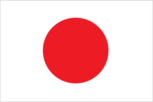
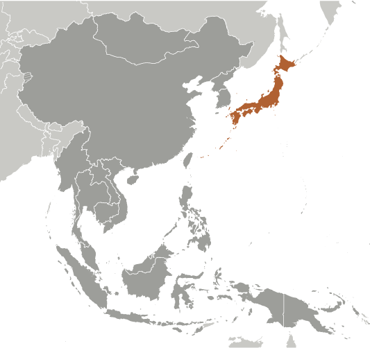
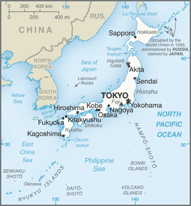

# Japan

## Introduction

**_Background:_**   
In 1603, after decades of civil warfare, the Tokugawa shogunate (a military-led, dynastic government) ushered in a long period of relative political stability and isolation from foreign influence. For more than two centuries this policy enabled Japan to enjoy a flowering of its indigenous culture. Japan opened its ports after signing the Treaty of Kanagawa with the US in 1854 and began to intensively modernize and industrialize. During the late 19th and early 20th centuries, Japan became a regional power that was able to defeat the forces of both China and Russia. It occupied Korea, Formosa (Taiwan), and southern Sakhalin Island. In 1931-32 Japan occupied Manchuria, and in 1937 it launched a full-scale invasion of China. Japan attacked US forces in 1941 - triggering America's entry into World War II - and soon occupied much of East and Southeast Asia. After its defeat in World War II, Japan recovered to become an economic power and an ally of the US. While the emperor retains his throne as a symbol of national unity, elected politicians hold actual decision-making power. Following three decades of unprecedented growth, Japan's economy experienced a major slowdown starting in the 1990s, but the country remains a major economic power. In March 2011, Japan's strongest-ever earthquake, and an accompanying tsunami, devastated the northeast part of Honshu island, killing thousands and damaging several nuclear power plants. The catastrophe hobbled the country's economy and its energy infrastructure, and tested its ability to deal with humanitarian disasters.

## Geography

**_Location:_**   
Eastern Asia, island chain between the North Pacific Ocean and the Sea of Japan, east of the Korean Peninsula

**_Geographic coordinates:_**   
36 00 N, 138 00 E

**_Map references:_**   
Asia

**_Area:_**   
**total:** 377,915 sq km   
**land:** 364,485 sq km   
**water:** 13,430 sq km   
**note:** includes Bonin Islands (Ogasawara-gunto), Daito-shoto, Minami-jima, Okino-tori-shima, Ryukyu Islands (Nansei-shoto), and Volcano Islands (Kazan-retto)

**_Area - comparative:_**   
slightly smaller than California

**_Land boundaries:_**   
0 km

**_Coastline:_**   
29,751 km

**_Maritime claims:_**   
**territorial sea:** 12 nm; between 3 nm and 12 nm in the international straits - La Perouse or Soya, Tsugaru, Osumi, and Eastern and Western Channels of the Korea or Tsushima Strait   
**contiguous zone:** 24 nm   
**exclusive economic zone:** 200 nm

**_Climate:_**   
varies from tropical in south to cool temperate in north

**_Terrain:_**   
mostly rugged and mountainous

**_Elevation extremes:_**   
**lowest point:** Hachiro-gata -4 m   
**highest point:** Fujiyama 3,776 m

**_Natural resources:_**   
negligible mineral resources, fish   
**note:** with virtually no energy natural resources, Japan is the world's largest importer of coal and liquefied natural gas, as well as the second largest importer of oil

**_Land use:_**   
**arable land:** 11.26%   
**permanent crops:** 0.81%   
**other:** 87.93% (2011)

**_Irrigated land:_**   
25,000 sq km (2010)

**_Total renewable water resources:_**   
430 cu km (2011)

**_Freshwater withdrawal (domestic/industrial/agricultural):_**   
**total:** 90.04 cu km/yr (20%/18%/62%)   
**per capita:** 714.3 cu m/yr (2007)

**_Natural hazards:_**   
many dormant and some active volcanoes; about 1,500 seismic occurrences (mostly tremors but occasional severe earthquakes) every year; tsunamis; typhoons   
**volcanism:** both Unzen (elev. 1,500 m) and Sakura-jima (elev. 1,117 m), which lies near the densely populated city of Kagoshima, have been deemed Decade Volcanoes by the International Association of Volcanology and Chemistry of the Earth's Interior, worthy of study due to their explosive history and close proximity to human populations; other notable historically active volcanoes include Asama, Honshu Island's most active volcano, Aso, Bandai, Fuji, Iwo-Jima, Kikai, Kirishima, Komaga-take, Oshima, Suwanosejima, Tokachi, Yake-dake, and Usu

**_Environment - current issues:_**   
air pollution from power plant emissions results in acid rain; acidification of lakes and reservoirs degrading water quality and threatening aquatic life; Japan is one of the largest consumers of fish and tropical timber, contributing to the depletion of these resources in Asia and elsewhere

**_Environment - international agreements:_**   
**party to:** Antarctic-Environmental Protocol, Antarctic-Marine Living Resources, Antarctic Seals, Antarctic Treaty, Biodiversity, Climate Change, Climate Change-Kyoto Protocol, Desertification, Endangered Species, Environmental Modification, Hazardous Wastes, Law of the Sea, Marine Dumping, Ozone Layer Protection, Ship Pollution, Tropical Timber 83, Tropical Timber 94, Wetlands, Whaling   
**signed, but not ratified:** none of the selected agreements

**_Geography - note:_**   
strategic location in northeast Asia

## People and Society

**_Nationality:_**   
**noun:** Japanese (singular and plural)   
**adjective:** Japanese

**_Ethnic groups:_**   
Japanese 98.5%, Koreans 0.5%, Chinese 0.4%, other 0.6%   
**note:** up to 230,000 Brazilians of Japanese origin migrated to Japan in the 1990s to work in industries; some have returned to Brazil (2004)

**_Languages:_**   
Japanese

**_Religions:_**   
Shintoism 83.9%, Buddhism 71.4%, Christianity 2%, other 7.8%   
**note:** total adherents exceeds 100% because many people belong to both Shintoism and Buddhism (2005)

**_Population:_**   
127,103,388 (July 2014 est.)

**_Age structure:_**   
**0-14 years:** 13.2% (male 8,681,728/female 8,132,809)   
**15-24 years:** 9.7% (male 6,429,429/female 5,890,991)   
**25-54 years:** 38.1% (male 23,953,643/female 24,449,655)   
**55-64 years:** 13.2% (male 8,413,872/female 8,400,953)   
**65 years and over:** 24.8% (male 14,218,655/female 18,531,653) (2014 est.)

**_Dependency ratios:_**   
**total dependency ratio:** 63.3 %   
**youth dependency ratio:** 21.2 %   
**elderly dependency ratio:** 42.1 %   
**potential support ratio:** 2.4 (2014 est.)

**_Median age:_**   
**total:** 46.1 years   
**male:** 44.8 years   
**female:** 47.5 years (2014 est.)

**_Population growth rate:_**   
-0.13% (2014 est.)

**_Birth rate:_**   
8.07 births/1,000 population (2014 est.)

**_Death rate:_**   
9.38 deaths/1,000 population (2014 est.)

**_Net migration rate:_**   
0 migrant(s)/1,000 population (2014 est.)

**_Urbanization:_**   
**urban population:** 91.3% of total population (2011)   
**rate of urbanization:** 0.57% annual rate of change (2010-15 est.)

**_Major urban areas - population:_**   
TOKYO (capital) 37.217 million; Osaka-Kobe 11.494 million; Nagoya 3.328 million; Fukuoka-Kitakyushu 2.868 million; Sapporo 2.742 million; Sendai 2.428 million (2011)

**_Sex ratio:_**   
**at birth:** 1.06 male(s)/female   
**0-14 years:** 1.07 male(s)/female   
**15-24 years:** 1.09 male(s)/female   
**25-54 years:** 0.98 male(s)/female   
**55-64 years:** 0.94 male(s)/female   
**65 years and over:** 0.76 male(s)/female   
**total population:** 0.95 male(s)/female (2014 est.)

**_Mother's mean age at first birth:_**   
30.3 (2012 est.)

**_Maternal mortality rate:_**   
5 deaths/100,000 live births (2010)

**_Infant mortality rate:_**   
**total:** 2.13 deaths/1,000 live births   
**male:** 2.35 deaths/1,000 live births   
**female:** 1.88 deaths/1,000 live births (2014 est.)

**_Life expectancy at birth:_**   
**total population:** 84.46 years   
**male:** 81.13 years   
**female:** 87.99 years (2014 est.)

**_Total fertility rate:_**   
1.4 children born/woman (2014 est.)

**_Contraceptive prevalence rate:_**   
54.3%   
**note:** percent of women aged 20-49 (2005)

**_Health expenditures:_**   
9.3% of GDP (2011)

**_Physicians density:_**   
2.14 physicians/1,000 population (2008)

**_Hospital bed density:_**   
13.7 beds/1,000 population (2009)

**_Drinking water source:_**   
**improved:** urban: 100% of population; rural: 100% of population; total: 100% of population   
**unimproved:** urban: 0% of population; rural: 0% of population; total: 0% of population (2012 est.)

**_Sanitation facility access:_**   
**improved:** urban: 100% of population; rural: 100% of population; total: 100% of population   
**unimproved:** urban: 0% of population; rural: 0% of population; total: 0% of population (2012 est.)

**_HIV/AIDS - adult prevalence rate:_**   
less than 0.1% (2009 est.)

**_HIV/AIDS - people living with HIV/AIDS:_**   
8,100 (2009 est.)

**_HIV/AIDS - deaths:_**   
fewer than 100 (2009 est.)

**_Obesity - adult prevalence rate:_**   
5% (2008)

**_Education expenditures:_**   
3.8% of GDP (2011)

**_Literacy:_**   
**definition:** age 15 and over can read and write   
**total population:** 99%   
**male:** 99%   
**female:** 99% (2002)

**_School life expectancy (primary to tertiary education):_**   
**total:** 15 years   
**male:** 15 years   
**female:** 15 years (2011)

**_Unemployment, youth ages 15-24:_**   
**total:** 7.9%   
**male:** 8.7%   
**female:** 7.1% (2012)

## Government

**_Country name:_**   
**conventional long form:** none   
**conventional short form:** Japan   
**local long form:** Nihon-koku/Nippon-koku   
**local short form:** Nihon/Nippon

**_Government type:_**   
a parliamentary government with a constitutional monarchy

**_Capital:_**   
**name:** Tokyo   
**geographic coordinates:** 35 41 N, 139 45 E   
**time difference:** UTC+9 (14 hours ahead of Washington, DC, during Standard Time)

**_Administrative divisions:_**   
47 prefectures; Aichi, Akita, Aomori, Chiba, Ehime, Fukui, Fukuoka, Fukushima, Gifu, Gunma, Hiroshima, Hokkaido, Hyogo, Ibaraki, Ishikawa, Iwate, Kagawa, Kagoshima, Kanagawa, Kochi, Kumamoto, Kyoto, Mie, Miyagi, Miyazaki, Nagano, Nagasaki, Nara, Niigata, Oita, Okayama, Okinawa, Osaka, Saga, Saitama, Shiga, Shimane, Shizuoka, Tochigi, Tokushima, Tokyo, Tottori, Toyama, Wakayama, Yamagata, Yamaguchi, Yamanashi

**_Independence:_**   
3 May 1947 (current constitution adopted as amendment to Meiji Constitution); notable earlier dates: 660 B.C. (traditional date of the founding of the nation by Emperor JIMMU); 29 November 1890 (Meiji Constitution provides for constitutional monarchy)

**_National holiday:_**   
Birthday of Emperor AKIHITO, 23 December (1933)

**_Constitution:_**   
previous 1890; latest approved 6 October 1946, adopted 3 November 1946, effective 3 May 1947 (2013)

**_Legal system:_**   
civil law system based on German model; system also reflects Anglo-American influence and Japanese traditions; judicial review of legislative acts in the Supreme Court

**_International law organization participation:_**   
accepts compulsory ICJ jurisdiction with reservations; accepts ICCt jurisdiction

**_Suffrage:_**   
20 years of age; universal

**_Executive branch:_**   
**chief of state:** Emperor AKIHITO (since 7 January 1989)   
**head of government:** Prime Minister Shinzo ABE (since 26 December 2012); Deputy Prime Minister Taro ASO (since 26 December 2012)   
**cabinet:** Cabinet is appointed by the prime minister   
**elections:** Diet, the bicameral legislature, designates the prime minister; constitution requires that the prime minister commands parliamentary majority; following legislative elections, the leader of majority party or leader of majority coalition in House of Representatives usually becomes prime minister; the monarchy is hereditary

**_Legislative branch:_**   
bicameral Diet or Kokkai consists of the House of Councillors or Sangi-in (242 seats - members elected for fixed six-year terms; 146 members in multi-seat constituencies and 96 by proportional representation) half elected every three years; and the House of Representatives or Shugi-in (480 seats - members elected for maximum four-year terms; 300 in single-seat constituencies; 180 members by proportional representation in 11 regional blocs); the prime minister has the right to dissolve the House of Representatives at any time with the concurrence of the cabinet   
**elections:** House of Councillors - last held on 21 July 2013 (next to be held in July 2016); House of Representatives - last held on 16 December 2012 (next to be held by 15 December 2016)   
**election results:** House of Councillors - percent of vote by party - NA; seats by party - LPD 115, DPJ 59, New Komeito 20, Your Party 18, JCP 11, JRP 9, SDP 3, others 4, independents 3; House of Representatives - percent of vote by party (by proportional representation) - LDP 31.6%, DPJ 16.6%, JRP 22.2%, New Komeito 12.2%, Your Party 7.7%, JCP 4.4%, TRP 3.9%, others 1.4%; seats by party LDP 294, DPJ 57, JRP 54, New Komeito 31, Your Party 18, TPJ 9, JCP 8, others 4, independents 5

**_Judicial branch:_**   
**highest court(s):** Supreme Court or Saiko saibansho (consists of the chief justice and 14 associate justices); note - the Supreme Court has jurisdiction in constitutional issues   
**judge selection and term of office:** Supreme Court chief justice designated by the Cabinet and appointed by the monarch; associate justices appointed by the Cabinet and confirmed by the monarch; all justices are reviewed in a popular referendum at the first general election of the House of Representatives following each judge's appointment and every 10 years afterward   
**subordinate courts:** 8 High Courts (Koto-saiban-sho), each with a Family Court (Katei-saiban-sho); 50 District Courts (Chiho saibansho), with 203 additional branches; 438 Summary Courts (Kani saibansho)

**_Political parties and leaders:_**   
Democratic Party of Japan or DPJ [Banri KAIEDA]   
Japan Communist Party or JCP [Kazuo SHII]   
Japan Restoration Party or JRP [Shintaro ISHIHARA]   
Liberal Democratic Party or LDP [Shinzo ABE]   
New Komeito or NK [Natsuo YAMAGUCHI]   
People's Life Party or PF [Ichiro OZAWA]   
Social Democratic Party or SDP [Tadatomo YOSHIDA]   
Tomorrow Party of Japan or TPJ [Tomoko ABE]   
Your Party or YP [Yoshimi WATANABE]

**_Political pressure groups and leaders:_**   
**other:** business groups; trade unions

**_International organization participation:_**   
ADB, AfDB (nonregional member), APEC, ARF, ASEAN (dialogue partner), Australia Group, BIS, CD, CE (observer), CERN (observer), CICA (observer), CP, EAS, EBRD, EITI (implementing country), FAO, FATF, G-20, G-5, G-7, G-8, G-10, IADB, IAEA, IBRD, ICAO, ICC (national committees), ICRM, IDA, IEA, IFAD, IFC, IFRCS, IGAD (partners), IHO, ILO, IMF, IMO, IMSO, Interpol, IOC, IOM, IPU, ISO, ITSO, ITU, ITUC (NGOs), LAIA (observer), MIGA, NEA, NSG, OAS (observer), OECD, OPCW, OSCE (partner), Pacific Alliance (observer), Paris Club, PCA, PIF (partner), SAARC (observer), SELEC (observer), SICA (observer), UN, UNCTAD, UNDOF, UNESCO, UNHCR, UNIDO, UNMISS, UNRWA, UNWTO, UPU, WCO, WFTU (NGOs), WHO, WIPO, WMO, WTO, ZC

**_Diplomatic representation in the US:_**   
**chief of mission:** Ambassador Kenichiro SASAE (since 19 November 2012)   
**chancery:** 2520 Massachusetts Avenue NW, Washington, DC 20008   
**telephone:** [1] (202) 238-6700   
**FAX:** [1] (202) 328-2187   
**consulate(s) general:** Atlanta, Boston, Chicago, Denver, Detroit, Agana (Guam), Honolulu, Houston, Los Angeles, Miami, Nashville (TN), New York, Portland (OR), San Francisco, Seattle   
**consulate(s):** Anchorage (AK), Saipan (Northern Mariana Islands)

**_Diplomatic representation from the US:_**   
**chief of mission:** Ambassador Caroline Bouvier KENNEDY (since 19 November 2013)   
**embassy:** 1-10-5 Akasaka, Minato-ku, Tokyo 107-8420   
**mailing address:** Unit 9800, Box 300, APO AP 96303-0300   
**telephone:** [81] (03) 3224-5000   
**FAX:** [81] (03) 3505-1862   
**consulate(s) general:** Naha (Okinawa), Osaka-Kobe, Sapporo   
**consulate(s):** Fukuoka, Nagoya

**_Flag description:_**   
white with a large red disk (representing the sun without rays) in the center

**_National symbol(s):_**   
red sun disc; chrysanthemum

**_National anthem:_**   
**name:** "Kimigayo" (The Emperor"s Reign)   
**lyrics/music:** unknown/Hiromori HAYASHI   
**note:** adopted 1999; in use as unofficial national anthem since 1883; oldest anthem lyrics in the world, dating to the 10th century or earlier; there is some opposition to the anthem because of its association with militarism and worship of the emperor

## Economy

**_Economy - overview:_**   
In the years following World War II, government-industry cooperation, a strong work ethic, mastery of high technology, and a comparatively small defense allocation (1% of GDP) helped Japan develop a technologically advanced economy. Two notable characteristics of the post-war economy were the close interlocking structures of manufacturers, suppliers, and distributors, known as keiretsu, and the guarantee of lifetime employment for a substantial portion of the urban labor force. Both features are now eroding under the dual pressures of global competition and domestic demographic change. Japan's industrial sector is heavily dependent on imported raw materials and fuels. A small agricultural sector is highly subsidized and protected, with crop yields among the highest in the world. While self-sufficient in rice production, Japan imports about 60% of its food on a caloric basis. For three decades, overall real economic growth had been spectacular - a 10% average in the 1960s, a 5% average in the 1970s, and a 4% average in the 1980s. Growth slowed markedly in the 1990s, averaging just 1.7%, largely because of the after effects of inefficient investment and an asset price bubble in the late 1980s that required a protracted period of time for firms to reduce excess debt, capital, and labor. Modest economic growth continued after 2000, but the economy has fallen into recession three times since 2008. A sharp downturn in business investment and global demand for Japan's exports in late 2008 pushed Japan into recession. Government stimulus spending helped the economy recover in late 2009 and 2010, but the economy contracted again in 2011 as the massive 9.0 magnitude earthquake and the ensuing tsunami in March disrupted manufacturing. The economy has largely recovered in the two years since the disaster, but reconstruction in the Tohoku region has been uneven. Prime Minister Shinzo ABE has declared the economy his government's top priority; he has overturned his predecessor's plan to permanently close nuclear power plants and is pursuing an economic revitalization agenda of fiscal stimulus, monetary easing, and structural reform. Japan joined the Trans Pacific Partnership negotiations in 2013, a pact that would open Japan's economy to increased foreign competition and create new export opportunities for Japanese businesses. Measured on a purchasing power parity (PPP) basis that adjusts for price differences, Japan in 2013 stood as the fourth-largest economy in the world after second-place China, which surpassed Japan in 2001, and third-place India, which edged out Japan in 2012. The new government will continue a longstanding debate on restructuring the economy and reining in Japan's huge government debt, which is exceeding 230% of GDP. To help raise government revenue and reduce public debt, Japan decided in 2013 to gradually increase the consumption tax to a total of 10% by the year 2015. Japan is making progress on ending deflation due to a weaker yen and higher energy costs, but reliance on exports to drive growth and an aging, shrinking population pose other major long-term challenges for the economy.

**_GDP (purchasing power parity):_**   
$4.729 trillion (2013 est.)   
$4.638 trillion (2012 est.)   
$4.549 trillion (2011 est.)   
**note:** data are in 2013 US dollars

**_GDP (official exchange rate):_**   
$5.007 trillion (2013 est.)

**_GDP - real growth rate:_**   
2% (2013 est.)   
2% (2012 est.)   
-0.6% (2011 est.)

**_GDP - per capita (PPP):_**   
$37,100 (2013 est.)   
$36,300 (2012 est.)   
$35,600 (2011 est.)   
**note:** data are in 2013 US dollars

**_Gross national saving:_**   
22.1% of GDP (2013 est.)   
21.6% of GDP (2012 est.)   
22% of GDP (2011 est.)

**_GDP - composition, by end use:_**   
**household consumption:** 61%   
**government consumption:** 20.7%   
**investment in fixed capital:** 21.6%   
**investment in inventories:** -0.6%   
**exports of goods and services:** 15.8%   
**imports of goods and services:** -18.4%; (2013 est.)

**_GDP - composition, by sector of origin:_**   
**agriculture:** 1.1%   
**industry:** 25.6%   
**services:** 73.2% (2013 est.)

**_Agriculture - products:_**   
rice, sugar beets, vegetables, fruit; pork, poultry, dairy products, eggs; fish

**_Industries:_**   
among world's largest and most technologically advanced producers of motor vehicles, electronic equipment, machine tools, steel and nonferrous metals, ships, chemicals, textiles, processed foods

**_Industrial production growth rate:_**   
1% (2013 est.)

**_Labor force:_**   
65.62 million (2013 est.)

**_Labor force - by occupation:_**   
**agriculture:** 3.9%   
**industry:** 26.2%   
**services:** 69.8% (2010 est.)

**_Unemployment rate:_**   
4.1% (2013 est.)   
4.4% (2012 est.)

**_Population below poverty line:_**   
16% (2010)

**_Household income or consumption by percentage share:_**   
**lowest 10%:** 1.9%   
**highest 10%:** 27.5% (2008)

**_Distribution of family income - Gini index:_**   
37.6 (2008)   
24.9 (1993)

**_Budget:_**   
**revenues:** $1.739 trillion   
**expenditures:** $2.149 trillion (2013 est.)

**_Taxes and other revenues:_**   
34.7% of GDP (2013 est.)

**_Budget surplus (+) or deficit (-):_**   
-8.2% of GDP (2013 est.)

**_Public debt:_**   
226.1% of GDP (2013 est.)   
219.1% of GDP (2012 est.)

**_Fiscal year:_**   
1 April - 31 March

**_Inflation rate (consumer prices):_**   
0.2% (2013 est.)   
0% (2012 est.)

**_Central bank discount rate:_**   
0.1% (31 December 2012)   
0.3% (31 December 2009)

**_Commercial bank prime lending rate:_**   
1.5% (31 December 2013 est.)   
1.48% (31 December 2012 est.)

**_Stock of narrow money:_**   
$5.604 trillion (31 December 2013 est.)   
$6.176 trillion (31 December 2012 est.)

**_Stock of broad money:_**   
$13.12 trillion (31 December 2011 est.)   
$13.41 trillion (31 December 2010 est.)

**_Stock of domestic credit:_**   
$12.39 trillion (31 December 2013 est.)   
$13.72 trillion (31 December 2012 est.)

**_Market value of publicly traded shares:_**   
$3.681 trillion (31 December 2012 est.)   
$3.541 trillion (31 December 2011)   
$NA (31 December 2010 est.)

**_Current account balance:_**   
$56.6 billion (2013 est.)   
$60.8 billion (2012 est.)

**_Exports:_**   
$697 billion (2013 est.)   
$776.6 billion (2012 est.)

**_Exports - commodities:_**   
motor vehicles 13.6%; semiconductors 6.2%; iron and steel products 5.5%; auto parts 4.6%; plastic materials 3.5%; power generating machinery 3.5%

**_Exports - partners:_**   
China 18.1%, US 17.8%, South Korea 7.7%, Thailand 5.5%, Hong Kong 5.1% (2012)

**_Imports:_**   
$766.6 billion (2013 est.)   
$830.1 billion (2012 est.)

**_Imports - commodities:_**   
petroleum 15.5%; liquid natural gas 5.7%; clothing 3.9%; semiconductors 3.5%; coal 3.5%; audio and visual apparatus 2.7% (2011 est.)

**_Imports - partners:_**   
China 21.3%, US 8.8%, Australia 6.4%, Saudi Arabia 6.2%, UAE 5%, South Korea 4.6%, Qatar 4% (2012)

**_Reserves of foreign exchange and gold:_**   
$1.268 trillion (31 December 2012 est.)   
$1.296 trillion (31 December 2011 est.)

**_Debt - external:_**   
$3.017 trillion (31 December 2012 est.)   
$3.115 trillion (31 December 2011)

**_Stock of direct foreign investment - at home:_**   
$231.2 billion (31 December 2013 est.)   
$222.2 billion (31 December 2012 est.)

**_Stock of direct foreign investment - abroad:_**   
$1.179 trillion (31 December 2013 est.)   
$1.054 trillion (31 December 2012 est.)

**_Exchange rates:_**   
yen (JPY) per US dollar -   
97.44 (2013 est.)   
79.79 (2012 est.)   
87.78 (2010 est.)   
93.57 (2009)   
103.58 (2008)

## Energy

**_Electricity - production:_**   
936.2 billion kWh (2012 est.)

**_Electricity - consumption:_**   
859.7 billion kWh (2012 est.)

**_Electricity - exports:_**   
0 kWh (2012 est.)

**_Electricity - imports:_**   
0 kWh (2012 est.)

**_Electricity - installed generating capacity:_**   
287 million kW (2010 est.)

**_Electricity - from fossil fuels:_**   
63.5% of total installed capacity (2010 est.)

**_Electricity - from nuclear fuels:_**   
17.1% of total installed capacity (2010 est.)

**_Electricity - from hydroelectric plants:_**   
7.8% of total installed capacity (2010 est.)

**_Electricity - from other renewable sources:_**   
2.8% of total installed capacity (2010 est.)

**_Crude oil - production:_**   
135,500 bbl/day (2012 est.)

**_Crude oil - exports:_**   
0 bbl/day (2010 est.)

**_Crude oil - imports:_**   
3.472 million bbl/day (2010 est.)

**_Crude oil - proved reserves:_**   
44.12 million bbl (1 January 2013 est.)

**_Refined petroleum products - production:_**   
3.862 million bbl/day (2010 est.)

**_Refined petroleum products - consumption:_**   
4.464 million bbl/day (2011 est.)

**_Refined petroleum products - exports:_**   
349,900 bbl/day (2010 est.)

**_Refined petroleum products - imports:_**   
1.311 million bbl/day (2010 est.)

**_Natural gas - production:_**   
3.273 billion cu m (2012 est.)

**_Natural gas - consumption:_**   
112.6 billion cu m (2011 est.)

**_Natural gas - exports:_**   
0 cu m (2012 est.)

**_Natural gas - imports:_**   
122.2 billion cu m (2012 est.)

**_Natural gas - proved reserves:_**   
20.9 billion cu m (1 January 2013 est.)

**_Carbon dioxide emissions from consumption of energy:_**   
1.181 billion Mt (2011 est.)

## Communications

**_Telephones - main lines in use:_**   
64.273 million (2012)

**_Telephones - mobile cellular:_**   
138.363 million (2011)

**_Telephone system:_**   
**general assessment:** excellent domestic and international service   
**domestic:** high level of modern technology and excellent service of every kind   
**international:** country code - 81; numerous submarine cables provide links throughout Asia, Australia, the Middle East, Europe, and US; satellite earth stations - 7 Intelsat (Pacific and Indian Oceans), 1 Intersputnik (Indian Ocean region), 2 Inmarsat (Pacific and Indian Ocean regions), and 8 SkyPerfect JSAT (2012)

**_Broadcast media:_**   
a mixture of public and commercial broadcast TV and radio stations; 6 national terrestrial TV networks including 1 public broadcaster; the large number of radio and TV stations available provide a wide range of choices; satellite and cable services provide access to international channels (2012)

**_Internet country code:_**   
.jp

**_Internet hosts:_**   
64.453 million (2012)

**_Internet users:_**   
99.182 million (2009)

## Transportation

**_Airports:_**   
175 (2013)

**_Airports - with paved runways:_**   
**total:** 142   
**over 3,047 m:** 6   
**2,438 to 3,047 m:** 45   
**1,524 to 2,437 m:** 38   
**914 to 1,523 m:** 28   
**under 914 m:** 25 (2013)

**_Airports - with unpaved runways:_**   
**total:** 33   
**914 to 1,523 m:** 5   
**under 914 m:** 28 (2013)

**_Heliports:_**   
16 (2013)

**_Pipelines:_**   
gas 4,456 km; oil 174 km; oil/gas/water 104 km (2013)

**_Railways:_**   
**total:** 27,182 km   
**standard gauge:** 4,251 km 1.435-m gauge (4,251 km electrified)   
**dual gauge:** 486 km 1.435-1.067-m gauge (486 km electrified)   
**narrow gauge:** 96 km 1.372-m gauge (96 km electrified); 22,301 km 1.067-m gauge (15,222 km electrified); 48 km 0.762-m gauge (48 km electrified) (2009)

**_Roadways:_**   
**total:** 1,210,251 km   
**paved:** 973,234 km (includes 7,803 km of expressways)   
**unpaved:** 237,017 km (2010)

**_Waterways:_**   
1,770 km (seagoing vessels use inland seas) (2010)

**_Merchant marine:_**   
**total:** 684   
**by type:** bulk carrier 168, cargo 34, carrier 3, chemical tanker 29, container 2, liquefied gas 58, passenger 11, passenger/cargo 117, petroleum tanker 152, refrigerated cargo 4, roll on/roll off 52, vehicle carrier 54   
**registered in other countries:** 3,122 (Bahamas 88, Bermuda 2, Burma 1, Cambodia 1, Cayman Islands 23, China 2, Cyprus 16, Honduras 4, Hong Kong 79, Indonesia 8, Isle of Man 19, Liberia 110, Luxembourg 3, Malaysia 2, Malta 5, Marshall Islands 59, Mongolia 2, Netherlands 1, Panama 2372, Philippines 77, Portugal 9, Saint Kitts and Nevis 2, Saint Vincent and the Grenadines 3, Sierra Leone 4, Singapore 164, South Korea 14, Tanzania 1, UK 5, Vanuatu 39, unknown 7) (2010)

**_Ports and terminals:_**   
**major seaport(s):** Chiba, Kawasaki, Kobe, Mizushima, Moji, Nagoya, Osaka, Tokyo, Tomakomai, Yokohama   
**container port(s) (TEUs):** Kobe (2,725,304), Nagoya (2,471,821), Osaka (2,172,797), Tokyo (4,416,119), Yokohama (2,992,517)

## Military

**_Military branches:_**   
Japanese Ministry of Defense (MOD): Ground Self-Defense Force (Rikujou Jieitai, GSDF); Maritime Self-Defense Force (Kaijou Jieitai, MSDF); Air Self-Defense Force (Koukuu Jieitai, ASDF) (2011)

**_Military service age and obligation:_**   
18 years of age for voluntary military service; no conscription; mandatory retirement at age 53 for senior enlisted personnel and at 62 years for senior service officers (2012)

**_Manpower available for military service:_**   
**males age 16-49:** 27,301,443   
**females age 16-49:** 26,307,003 (2010 est.)

**_Manpower fit for military service:_**   
**males age 16-49:** 22,390,431   
**females age 16-49:** 21,540,322 (2010 est.)

**_Manpower reaching militarily significant age annually:_**   
**male:** 623,365   
**female:** 591,253 (2010 est.)

**_Military expenditures:_**   
0.99% of GDP (2012)   
1.01% of GDP (2011)   
0.99% of GDP (2010)

## Transnational Issues

**_Disputes - international:_**   
the sovereignty dispute over the islands of Etorofu, Kunashiri, and Shikotan, and the Habomai group, known in Japan as the "Northern Territories" and in Russia as the "Southern Kuril Islands," occupied by the Soviet Union in 1945, now administered by Russia and claimed by Japan, remains the primary sticking point to signing a peace treaty formally ending World War II hostilities; Japan and South Korea claim Liancourt Rocks (Take-shima/Tok-do) occupied by South Korea since 1954; China and Taiwan dispute both Japan's claims to the uninhabited islands of the Senkaku-shoto (Diaoyu Tai) and Japan's unilaterally declared exclusive economic zone in the East China Sea, the site of intensive hydrocarbon prospecting

............................................................   
_Page last updated on June 20, 2014_
