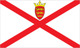
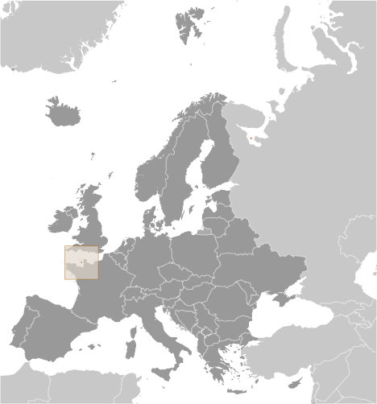
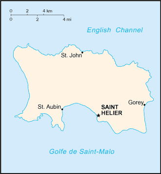

# Jersey

_British crown dependency_

## Introduction

**_Background:_**   
Jersey and the other Channel Islands represent the last remnants of the medieval Dukedom of Normandy that held sway in both France and England. These islands were the only British soil occupied by German troops in World War II. Jersey is a British crown dependency but is not part of the UK or of the European Union. However, the UK Government is constitutionally responsible for its defense and international representation.

## Geography

**_Location:_**   
Western Europe, island in the English Channel, northwest of France

**_Geographic coordinates:_**   
49 15 N, 2 10 W

**_Map references:_**   
Europe

**_Area:_**   
**total:** 116 sq km   
**land:** 116 sq km   
**water:** 0 sq km

**_Area - comparative:_**   
about two-thirds the size of Washington, DC

**_Land boundaries:_**   
0 km

**_Coastline:_**   
70 km

**_Maritime claims:_**   
**territorial sea:** 3 nm   
**exclusive fishing zone:** 12 nm

**_Climate:_**   
temperate; mild winters and cool summers

**_Terrain:_**   
gently rolling plain with low, rugged hills along north coast

**_Elevation extremes:_**   
**lowest point:** Atlantic Ocean 0 m   
**highest point:** unnamed elevation 143 m

**_Natural resources:_**   
arable land

**_Land use:_**   
**arable land:** NA   
**permanent crops:** NA   
**other:** NA

**_Irrigated land:_**   
NA

**_Natural hazards:_**   
NA

**_Environment - current issues:_**   
NA

**_Geography - note:_**   
largest and southernmost of Channel Islands; about 30% of population concentrated in Saint Helier

## People and Society

**_Nationality:_**   
**noun:** Channel Islander(s)   
**adjective:** Channel Islander

**_Ethnic groups:_**   
Jersey 46.4%, British 32.7%, Portuguese/Madeiran 8.2%, Polish 3.3%, Irish, French, and other white 7.1%, other 2.4% (2011 est.)

**_Languages:_**   
English 94.5% (official), Portuguese 4.6%, other 0.9% (2001 census)

**_Religions:_**   
Protestant (Anglican, Baptist, Congregational New Church, Methodist, Presbyterian), Roman Catholic

**_Population:_**   
96,513 (July 2014 est.)

**_Age structure:_**   
**0-14 years:** 16% (male 8,001/female 7,456)   
**15-24 years:** 14.8% (male 7,271/female 6,972)   
**25-54 years:** 41.4% (male 20,000/female 19,927)   
**55-64 years:** 12.2% (male 5,690/female 6,055)   
**65 years and over:** 15.4% (male 6,464/female 8,677) (2014 est.)

**_Dependency ratios:_**   
**total dependency ratio:** 46.4 %   
**youth dependency ratio:** 21.7 %   
**elderly dependency ratio:** 24.7 %   
**potential support ratio:** 4   
**note:** data represents the Channel Islands (2014 est.)

**_Median age:_**   
**total:** 39.5 years   
**male:** 37.1 years   
**female:** 41.6 years (2014 est.)

**_Population growth rate:_**   
0.81% (2014 est.)

**_Birth rate:_**   
11.65 births/1,000 population (2014 est.)

**_Death rate:_**   
7.63 deaths/1,000 population (2014 est.)

**_Net migration rate:_**   
4.08 migrant(s)/1,000 population (2014 est.)

**_Urbanization:_**   
**urban population:** 31.2% of total population (2011)   
**rate of urbanization:** 0.63% annual rate of change (2010-15 est.)

**_Sex ratio:_**   
**at birth:** 1.06 male(s)/female   
**0-14 years:** 1.07 male(s)/female   
**15-24 years:** 1.04 male(s)/female   
**25-54 years:** 1 male(s)/female   
**55-64 years:** 0.97 male(s)/female   
**65 years and over:** 0.74 male(s)/female   
**total population:** 0.96 male(s)/female (2014 est.)

**_Infant mortality rate:_**   
**total:** 3.86 deaths/1,000 live births   
**male:** 4.08 deaths/1,000 live births   
**female:** 3.63 deaths/1,000 live births (2014 est.)

**_Life expectancy at birth:_**   
**total population:** 81.66 years   
**male:** 79.22 years   
**female:** 84.26 years (2014 est.)

**_Total fertility rate:_**   
1.66 children born/woman (2014 est.)

**_HIV/AIDS - adult prevalence rate:_**   
NA

**_HIV/AIDS - people living with HIV/AIDS:_**   
NA

**_HIV/AIDS - deaths:_**   
NA

**_Literacy:_**   
NA

## Government

**_Country name:_**   
**conventional long form:** Bailiwick of Jersey   
**conventional short form:** Jersey

**_Dependency status:_**   
British crown dependency

**_Government type:_**   
parliamentary democracy

**_Capital:_**   
**name:** Saint Helier   
**geographic coordinates:** 49 11 N, 2 06 W   
**time difference:** UTC 0 (5 hours ahead of Washington, DC, during Standard Time)   
**daylight saving time:** +1hr, begins last Sunday in March; ends last Sunday in October

**_Administrative divisions:_**   
none (British crown dependency); there are no first-order administrative divisions as defined by the US Government, but there are 12 parishes; Grouville, Saint Brelade, Saint Clement, Saint Helier, Saint John, Saint Lawrence, Saint Martin, Saint Mary, Saint Ouen, Saint Peter, Saint Saviour, and Trinity

**_Independence:_**   
none (British crown dependency)

**_National holiday:_**   
Liberation Day, 9 May (1945)

**_Constitution:_**   
unwritten; partly statutes, partly common law and practice (2013)

**_Legal system:_**   
the laws of the UK, where applicable, apply; local statutes

**_Suffrage:_**   
16 years of age; universal

**_Executive branch:_**   
**chief of state:** Queen ELIZABETH II (since 6 February 1952); represented by Lieutenant Governor Sir John MCCOLL (since 26 September 2011)   
**head of government:** Chief Minister Ian GORST (18 December 2011); Bailiff Michael BIRT (since 9 July 2009)   
**cabinet:** Cabinet (since December 2005)   
**elections:** ministers of the Cabinet including the chief minister are elected by the Assembly of States; the monarchy is hereditary; lieutenant governor and bailiff appointed by the monarch

**_Legislative branch:_**   
unicameral Assembly of the States of Jersey (58 seats; 53 are voting members, of which 12 are senators elected for six-year terms, 12 are constables or heads of parishes elected for three-year terms, 29 are deputies elected for three-year terms; the 5 non-voting members include the bailiff and the deputy bailiff, the Dean of Jersey, the Attorney General, and the Solicitor General appointed by the monarch)   
**elections:** last held on 27 April 2011 (next to be held in 2014)   
**election results:** percent of vote - NA; seats - independents 53; note - starting with the 2014 elections, the number of Senators will be reduced to 8

**_Judicial branch:_**   
**highest court(s):** Jersey Court of Appeal (consists of the bailiff, deputy bailiff, and 12 judges and organized into Heritage, Family, Probate, and Civil and Criminal Divisions); Royal Court (consists of the bailiff, deputy bailiff, 6 commissioners - part-time judges, and NA lay people referred to as jurats)   
**judge selection and term of office:** Jersey Court of Appeal bailiffs and judges appointed by the Crown upon the advice of the Secretary of State for Justice; bailiffs and judges appointed for extent of good behavior; Royal Court bailiffs appointed by the Crown upon the advice of the Secretary of State for Justice; commissioners appointed by the bailiff; jurats appointed by the Electoral College; bailiffs and commissioners appointed for extent of good behavior; jurats appointed until retirement at age 72   
**subordinate courts:** Magistrate's Court; Youth Court; Petty Debts Court; Parish Hall Enquires (a process of preliminary investigation into youth and minor adult offenses to determine need for presentation before a court)

**_Political parties and leaders:_**   
**one declared parties:** Jersey Democratic Alliance;   
**note:** all senators and deputies elected in 2008 were independents

**_Political pressure groups and leaders:_**   
Institute of Directors, Jersey branch (provides business support)   
Jersey Hospitality Association [Robert JONES] (trade association)   
Jersey Rights Association [David ROTHERHAM] (human rights)   
La Societe Jersiaise (education and conservation group)   
Progress Jersey [Daren O'TOOLE, Gino RISOLI] (human rights)   
Royal Jersey Agriculture and Horticultural Society or RJA&amp;HS (development and management of the Jersey breed of cattle)   
Save Jersey's Heritage (protects heritage through building preservation)

**_Diplomatic representation in the US:_**   
none (British crown dependency)

**_Diplomatic representation from the US:_**   
none (British crown dependency)

**_Flag description:_**   
white with a diagonal red cross extending to the corners of the flag; in the upper quadrant, surmounted by a yellow crown, a red shield with three lions in yellow; according to tradition, the ships of Jersey - in an attempt to differentiate themselves from English ships flying the horizontal cross of St. George - rotated the cross to the "X" (saltire) configuration; because this arrangement still resembled the Irish cross of St. Patrick, the yellow Plantagenet crown and Jersey coat of arms were added

**_National symbol(s):_**   
Jersey cow

**_National anthem:_**   
**name:** "Isle de Siez Nous" (Island Home)   
**lyrics/music:** Gerard LE FEUVRE   
**note:** adopted 2008; serves as a local anthem; as a British crown dependency, "God Save the Queen" is official (see United Kingdom)

## Economy

**_Economy - overview:_**   
Jersey's economy is based on international financial services, agriculture, and tourism. In 2010 the financial services sector accounted for about 50% of the island's output. Potatoes, cauliflower, tomatoes, and especially flowers are important export crops, shipped mostly to the UK. The Jersey breed of dairy cattle is known worldwide and represents an important export income earner. Milk products go to the UK and other EU countries. Tourism accounts for one-quarter of GDP. In recent years, the government has encouraged light industry to locate in Jersey with the result that an electronics industry has developed, displacing more traditional industries. All raw material and energy requirements are imported as well as a large share of Jersey's food needs. Light taxes and death duties make the island a popular tax haven. In January 2013, Jersey signed a tax agreement with Guernsey and the Isle of Man, in order to enable the islands' authorities to end tax avoidance and evasion. Living standards come close to those of the UK.

**_GDP (purchasing power parity):_**   
$5.1 billion (2005 est.)

**_GDP (official exchange rate):_**   
$5.1 billion (2005 est.)

**_GDP - real growth rate:_**   
NA%

**_GDP - per capita (PPP):_**   
$57,000 (2005 est.)

**_GDP - composition, by sector of origin:_**   
**agriculture:** 2%   
**industry:** 2%   
**services:** 96% (2010)

**_Agriculture - products:_**   
potatoes, cauliflower, tomatoes; beef, dairy products

**_Industries:_**   
tourism, banking and finance, dairy, electronics

**_Industrial production growth rate:_**   
NA%

**_Labor force:_**   
53,380 (June 2012)

**_Unemployment rate:_**   
1.7% (2012 est.)   
2.2% (2006 est.)

**_Population below poverty line:_**   
NA%

**_Household income or consumption by percentage share:_**   
**lowest 10%:** NA%   
**highest 10%:** NA%

**_Budget:_**   
**revenues:** $829 million   
**expenditures:** $851 million (2005)

**_Taxes and other revenues:_**   
16.3% of GDP (2005)

**_Budget surplus (+) or deficit (-):_**   
-0.4% of GDP (2005)

**_Fiscal year:_**   
1 April - 31 March

**_Inflation rate (consumer prices):_**   
3.7% (2006)

**_Market value of publicly traded shares:_**   
$NA

**_Exports:_**   
$NA

**_Exports - commodities:_**   
light industrial and electrical goods, dairy cattle, foodstuffs, textiles, flowers

**_Imports:_**   
$NA

**_Imports - commodities:_**   
machinery and transport equipment, manufactured goods, foodstuffs, mineral fuels, chemicals

**_Debt - external:_**   
$NA

**_Exchange rates:_**   
Jersey pounds (JEP) per US dollar   
0.6307 (2014)   
0.6391 (2013)   
0.6472 (2010)   
0.6175 (2009)   
0.5302 (2008)

## Energy

**_Electricity - consumption:_**   
630.1 million kWh (2004 est.)

## Communications

**_Telephones - main lines in use:_**   
73,800 (2010)

**_Telephones - mobile cellular:_**   
108,000 (2010)

**_Telephone system:_**   
**general assessment:** increasingly modern system, with broadband access   
**domestic:** digital telephone system launch announced in 2006 now implemented; fixed-line and mobile-cellular services widely available; combined fixed and mobile-cellular density exceeds 100 per 100 persons   
**international:** country code - 44; submarine cable connectivity to Guernsey, the UK, and France (2010)

**_Broadcast media:_**   
multiple UK terrestrial television broadcasts are received via a transmitter in Jersey; satellite packages available; BBC Radio Jersey and 1 other radio station operating (2009)

**_Internet country code:_**   
.je

**_Internet hosts:_**   
264 (2012)

**_Internet users:_**   
29,500 (2009)

## Transportation

**_Airports:_**   
1 (2013)

**_Airports - with paved runways:_**   
**total:** 1   
**1,524 to 2,437 m:** 1 (2013)

**_Roadways:_**   
**total:** 576 km (2010)

**_Merchant marine:_**   
**registered in other countries:** 14 (Gibraltar 1, India 2, Marshall Islands 11) (2010)

**_Ports and terminals:_**   
**major seaport(s):** Gorey, Saint Aubin, Saint Helier

## Military

**_Manpower fit for military service:_**   
**males age 16-49:** 18,688   
**females age 16-49:** 18,615 (2010 est.)

**_Manpower reaching militarily significant age annually:_**   
**male:** 664   
**female:** 590 (2010 est.)

**_Military - note:_**   
defense is the responsibility of the UK

## Transnational Issues

**_Disputes - international:_**   
none

............................................................   
_Page last updated on June 18, 2014_
